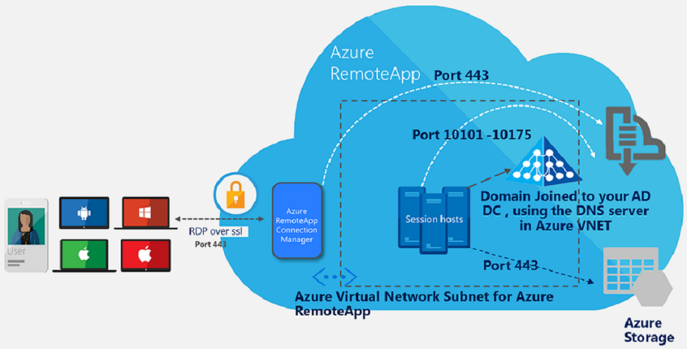
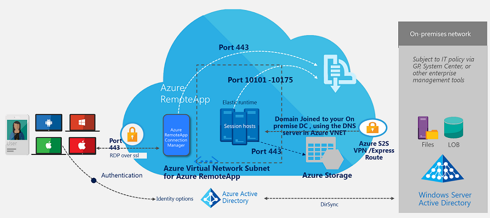

<properties
    pageTitle="Zum Planen von virtuellen Netzwerks für eine Websitesammlung Azure RemoteApp | Microsoft Azure"
    description="Informationen Sie zum Planen von virtuellen Netzwerks für eine Websitesammlung Azure RemoteApp."
    services="remoteapp"
    documentationCenter="" 
    authors="mghosh1616"
    manager="mbaldwin" />

<tags
    ms.service="remoteapp"
    ms.workload="compute"
    ms.tgt_pltfrm="na"
    ms.devlang="na"
    ms.topic="article"
    ms.date="08/15/2016"
    ms.author="elizapo" />

# So virtuellen Netzwerks für Azure RemoteApp planen

> [AZURE.IMPORTANT]
> Azure RemoteApp ist nicht mehr verwendet werden. Lesen Sie die Details der [Ankündigung](https://go.microsoft.com/fwlink/?linkid=821148) .

Dieses Dokument beschreibt, wie Ihre Azure virtuelles Netzwerk (VNET) und dem Subnetz für Azure RemoteApp einrichten. Wenn Sie nicht mit Azure virtuelle Netzwerke vertraut sind, ist dies eine Funktion, die Sie zur Virtualisierung Ihrer Netzwerk-Infrastruktur in der Cloud und Hybrid Lösungen mit Azure und lokale Ressourcen erstellen kann. Sie können weitere Informationen dazu [hier](../virtual-network/virtual-networks-overview.md).

Wenn Sie in Ihrem Netzwerk virtuelle Sicherheitsrichtlinien für den Datenverkehr (eingehende und ausgehende) definieren, wo Sie Azure RemoteApp bereitstellen, möchten, empfehlen wir Azure RemoteApp vom restlichen Bereitstellung Ihrer in das Azure virtuelle Netzwerk ein separates Subnetz erstellen. Lesen Sie weitere Informationen zum Definieren von Sicherheitsrichtlinien in Ihrem Subnetz Azure virtuelles Netzwerk [was eine Netzwerk Sicherheit Gruppe (NSG) ist?](../virtual-network/virtual-networks-nsg.md).

## Typen von Azure RemoteApp Websitesammlungen mit Azure virtuelle Netzwerke

Die folgenden Grafiken anzeigen die zwei verschiedenen Websitesammlung Optionen aus, wenn Sie ein virtuelles Netzwerk verwenden möchten.

### Azure RemoteApp Cloud-Sammlung mit VNET

 

Dies stellt eine Azure RemoteApp Websitesammlung, in dem alle Ressourcen, die die Sitzung RemoteApp Hosts müssen für den Zugriff auf in Azure bereitgestellt werden. Sie können in der gleichen VNET als die RemoteApp VNET oder eines anderen VNET in Azure befinden.

### Azure RemoteApp Hybrid Websitesammlung mit VNET

Dies stellt eine Azure RemoteApp Auflistung, wo sich einige der Ressourcen, die die RemoteApp Sitzung Hosts müssen für den Zugriff auf lokale bereitgestellten befinden. Die RemoteApp VNET wird mit dem lokalen Netzwerk mit Azure Hybrid Technologien wie Standort-zu-Standort VPN oder Express-Routing verknüpft.

## Funktionsweise des

Im Hintergrund bereitstellt Azure RemoteApp Azure-virtuellen Computern (mit dem hochgeladenen Bild) mit dem virtuellen Netzwerksubnetz, das Sie während der Bereitstellung ignoriert. Wenn Sie für eine Websitesammlung Hybrid entschieden haben, versuchen Sie wir, die den vollqualifizierten Domänennamen für die Domänencontroller zu beheben, die Sie mit der DNS-Servers in das virtuelle Netzwerk im Workflow provisioning eingegeben.  
Wenn Sie eine Verbindung zu einem vorhandenen virtuellen Netzwerk herstellen, stellen Sie sicher, um die erforderlichen Ports in Ihrem Netzwerk Sicherheitsgruppen in Ihrem Subnetz gehören, Azure RemoteApp verfügbar zu machen. 

Es empfiehlt sich, dass Sie ein [großes genug Subnetz für RemoteApp Azure](remoteapp-vnetsizing.md)verwenden. Der größte von Azure-virtuellen Netzwerk unterstützt wird /8 (mit CIDR Subnetzdefinitionen). Ihr Subnetz sollten für alle der Azure RemoteApp virtuellen Computern während Skalierung ausreicht, wenn der Zugriff auf Weitere Benutzer der apps. 

Es folgen Maßnahmen, die in Ihrem Subnetz virtuelles Netzwerk aktivieren benötigen werden: 

2.  Ausgehender Datenverkehr aus dem Subnetz sollte mit einer der internen Azure RemoteApp Dienste Kommunikation auf Portbereich 10101-10175 zugelassen werden.
3.  Ausgehender Datenverkehr aus Ihrem Subnetz dürfen Verbindung zum Azure-Speicher auf Port 443
4.  Wenn Sie Active Directory in Azure gehostet haben, stellen Sie sicher, dass alle virtuellen Computer im virtuelle Netzwerksubnetz für Azure RemoteApp Verbindung zu dieser Domänencontroller hergestellt wird. Die DNS-Einträge in das virtuelle Netzwerk sollte den vollqualifizierten Domänennamen des dieser Domänencontroller beheben können.

## Virtuelles Netzwerk mit Erzwungene Tunnel

[Erzwungene Tunnel](../vpn-gateway/vpn-gateway-about-forced-tunneling.md) wird nun für alle neuen Azure RemoteApp Websitesammlungen unterstützt. Die Migration von einer vorhandenen Websitesammlung zur Unterstützung von erzwungenen Tunnel wir derzeit nicht unterstützt.  Sie müssen alle vorhandenen Websitesammlungen mithilfe der VNET, die Sie zum Azure RemoteApp verknüpfen, löschen und Erstellen eines neuen Kontos abrufen Erzwungene Tunnel auf Ihrer Websitesammlungen aktiviert. 
