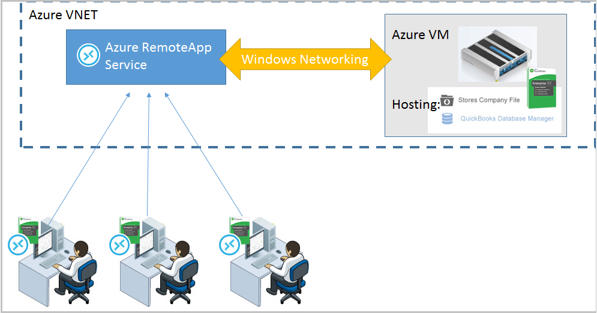

<properties 
    pageTitle="Bereitstellen von QuickBooks in Azure RemoteApp | Microsoft Azure" 
    description="Informationen Sie zum Azure RemoteApp QuickBooks freigeben." 
    services="remoteapp" 
    documentationCenter="" 
    authors="ericorman" 
    manager="mbaldwin" />

<tags 
    ms.service="remoteapp" 
    ms.workload="compute" 
    ms.tgt_pltfrm="na" 
    ms.devlang="na" 
    ms.topic="article" 
    ms.date="08/15/2016" 
    ms.author="elizapo" />

# Wie bereit Sie QuickBooks in Azure RemoteApp?

> [AZURE.IMPORTANT]
> Azure RemoteApp ist nicht mehr verwendet werden. Lesen Sie die Details der [Ankündigung](https://go.microsoft.com/fwlink/?linkid=821148) .

Verwenden Sie die folgende Informationen zum Freigeben von QuickBooks als eine app in Azure RemoteApp aus.

Sie können in einem Hybriden oder die Cloud Websitesammlungen QuickBooks 2015 Enterprise mit Azure RemoteApp freigeben. Die Unternehmensdatei muss auf einen virtuellen befinden, die QuickBooks-Datenbankserver ausgeführt wird, die von den Servern Azure RemoteApp getrennt ist. Nie Unternehmen auf Speichern Azure RemoteApp Bild – Datenverlust erwartet wird, wenn Sie dies tun. Nur QuickBooks Enterprise unterstützt als Host für die Datei QuickBooks auf eine externe Freigabe mit QuickBooks-Datenbankserver über Windows-standard-Netzwerk zugegriffen werden.   

> [AZURE.IMPORTANT] QuickBooks-Datenbankserver an, der die Unternehmensdatei hostet muss auf einen separaten virtuellen innerhalb der gleichen VNET wie die Azure RemoteApp Auflistung befinden.  

## Schritte zum Bereitstellen von QuickBooks

1. Erstellen Sie einer Azure-virtuellen Computer installieren Sie QuickBooks, QuickBooks-Datenbankserver, und legen Sie die Unternehmensdatei eine Azure-virtuellen Computers.  Vergewissern Sie sich für die ordnungsgemäße Konfiguration der Firewall-Regeln.
2. Installieren von QuickBooks auf ein [benutzerdefiniertes Bild](remoteapp-imageoptions.md) , und erstellen Sie eine [Auflistung Azure RemoteApp](remoteapp-collections.md)entweder Cloud oder Hybrid, in die genauen derselben VNET, in der virtuellen Computer hosten des QuickBooks-Datenbankservers mit Unternehmen Dateien gespeichert ist. 
3.  [Veröffentlichen](remoteapp-publish.md) QuickBooks-app für Benutzer
4.  Starten Sie den Azure RemoteApp gehostete QuickBooks-Client, navigieren Sie zu dem virtuellen Computer hosten des Datenbankservers QuickBooks standard Windows-Netzwerk, und öffnen Sie die Unternehmensdatei. 

## Dokumentation Verweise

- QuickBooks [unterstützte Konfigurationen](http://enterprisesuite.intuit.com/products/enterprise-solutions/technical/#top)
- QuickBooks [Bereitstellungsoptionen](http://enterprisesuite.intuit.com/everythingenterprise/launchpad/new-user/)

Sie können auch Ignite einer Präsentation, die [Grundlagen von Microsoft Azure RemoteApp Verwaltung und Administration](https://channel9.msdn.com/Events/Ignite/2015/BRK3868) - schnelle Vorlauf zu 1:02:45, um das Webpart QuickBooks zu gelangen Auschecken.

## Bereitstellungsarchitektur

