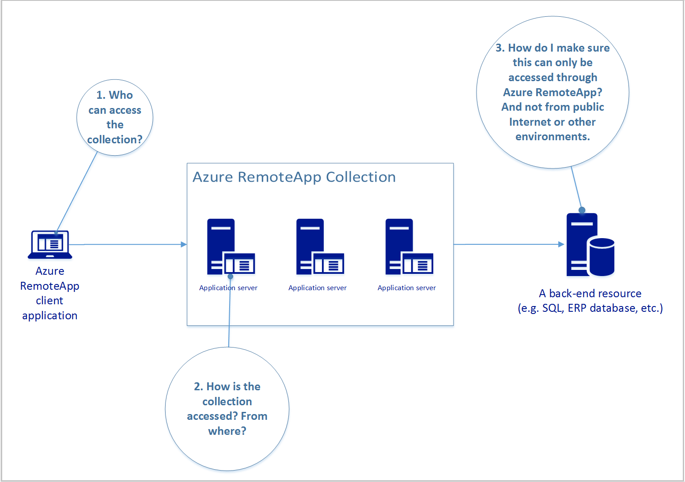
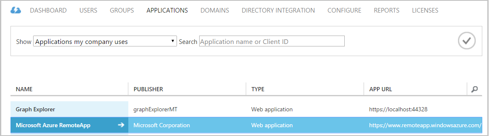
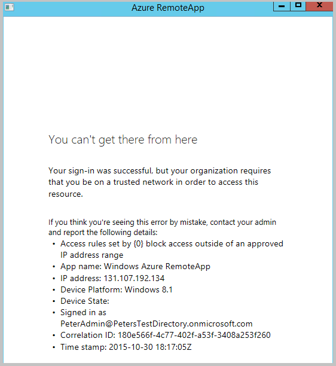
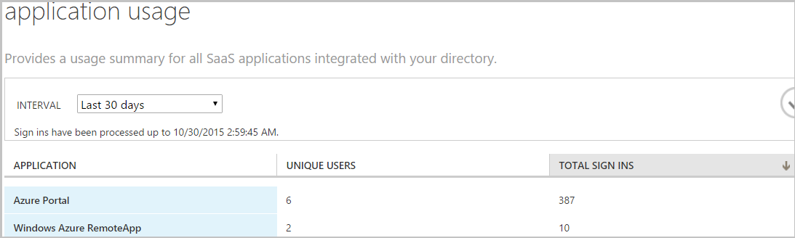
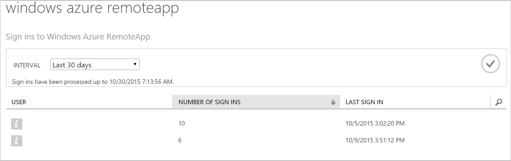
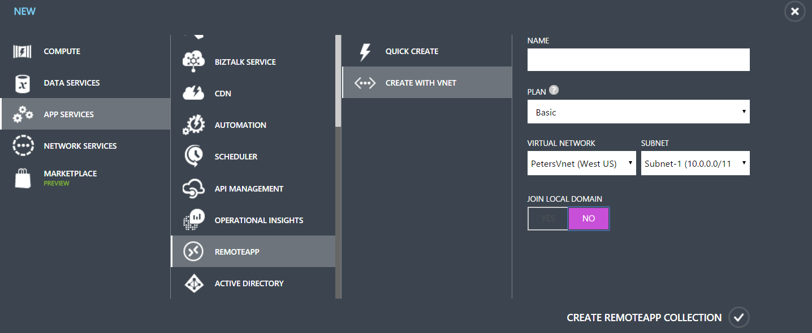
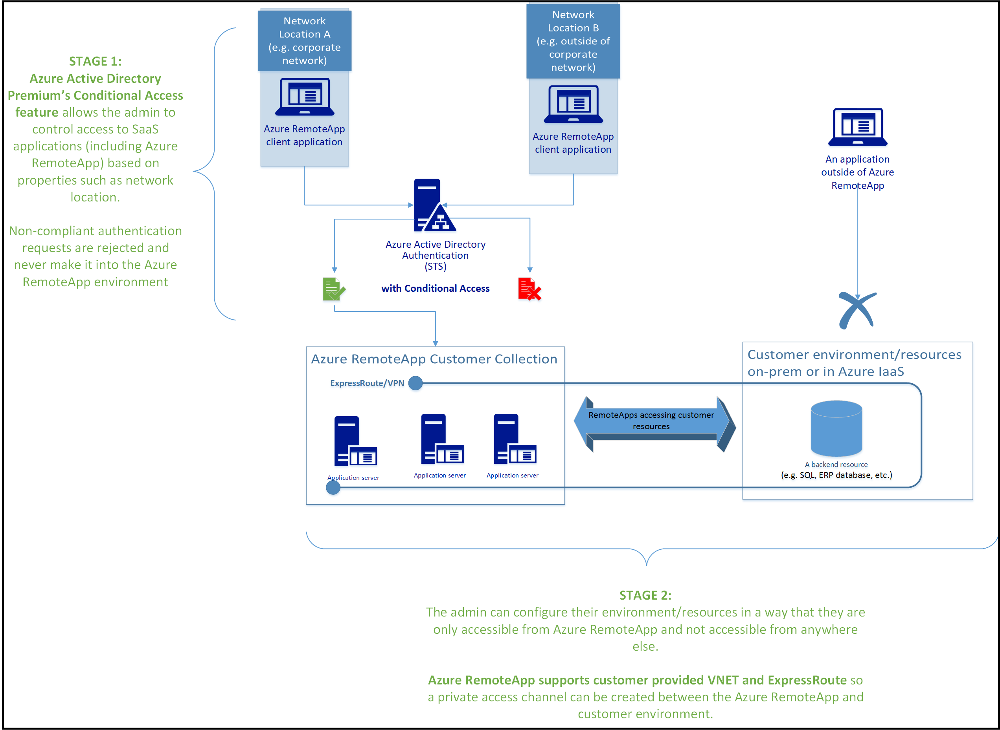

<properties 
    pageTitle="Sichern des Zugriffs auf Azure RemoteApp und darüber hinaus | Microsoft Azure"
    description="Erfahren Sie, wie sicheren Zugriff auf Azure RemoteApp in Azure Active Directory mithilfe von bedingten Zugriff"
    services="remoteapp"
    documentationCenter="" 
    authors="piotrci" 
    manager="mbaldwin" />

<tags 
    ms.service="remoteapp" 
    ms.workload="compute" 
    ms.tgt_pltfrm="na" 
    ms.devlang="na" 
    ms.topic="article" 
    ms.date="08/15/2016" 
    ms.author="elizapo" />

# Sichern des Zugriffs auf Azure RemoteApp und darüber hinaus

> [AZURE.IMPORTANT]
> Azure RemoteApp ist nicht mehr verwendet werden. Lesen Sie die Details der [Ankündigung](https://go.microsoft.com/fwlink/?linkid=821148) .

In diesem Artikel liefert wir Ihnen einen Überblick darüber, wie ein Administrator einen sicheren Zugriff Kanal des Endbenutzers, bis Azure RemoteApp beginnen und enden eine sichere Ressource z. B. einer SQL-Datenbank oder einer anderen Anwendung Back-End einrichten kann. Ziel ist es, stellen Sie sicher, dass nur autorisierte Benutzer die gewünschten Bedingungen erfüllen Applications remote zugreifen können und die sichere Back-End nur von der gesteuert Azure RemoteApp-Umgebung und nicht mit anderen Speicherorten zugegriffen werden kann.

Es gibt 3, wenn, denen der Administrator eigenständig muss, Hauptbereichen:

Lesen Sie auf Informationen und Antworten auf diese Fragen.

## Wer kann die Sammlung zugreifen?
Der Administrator wählt die Benutzer, die remote-Anwendungen in der Auflistung zugreifen können. Sie können Azure Active Directory (Azure AD) Arbeit oder Schule Konten (vormals bezeichnet, "organisationsinterne Konten") oder Microsoft-Konten (z. B. @outlook.com). Die meisten Enterprise-Szenarien verwenden Azure AD-Konten. Sie können Sie bedingte Access Features später erläutert und werden auch die einzige Option für Websitesammlungen Domänenverbund. Im weiteren Verlauf dieses Artikels wird davon ausgegangen, dass Sie Azure AD-Konten mit Azure RemoteApp verwenden.

**Was wir erreicht haben:**

Verwenden zum Steuern des Zugriffs auf Azure RemoteApp Azure AD-Konten (datumuhrzeitschlüssel) zwei Dinge:

1.  Wir immer wissen, wer die Applikationen zugreifen kann, veröffentlicht haben, und Zugreifen auf beliebige, Back-endet diese Applikationen Herstellen einer Verbindung mit.
2.  Wir steuern das zugrunde liegenden Azure AD, damit wir erstellen können, und Löschen von Benutzerkonten, Kennwortrichtlinien festlegen, verwenden Sie kombinierte Authentifizierung usw.. 

## Wie erfolgt die Sammlung? Woher?
Im Allgemeinen Administratoren Richtlinien für den Zugriff auf einer öffentlichen Internet zugänglichen-Umgebung, wie z. B. Azure RemoteApp definieren möchten. Sie möchten beispielsweise sicherzustellen, dass Benutzer, die Zugriff auf die Umgebung von außerhalb des Unternehmensnetzwerks auf kombinierte Authentifizierung (MFA) verwenden Sie für den Zugriff; oder vielleicht sie ganz blockiert werden soll.

Azure RemoteApp Administratoren können die Funktionalität verfügbar bis Azure AD Premium bedingten Zugriffsrichtlinien für ihre Umgebung Azure RemoteApp festlegen. Sie können auch umfangreiche Berichts- und Features Warnung um zu überwachen, wie die Umgebung zugegriffen wird.

### Zum Einrichten von bedingten Zugriff für Azure RemoteApp
Wir werden nun ein Beispiel-Szenario – das Azure RemoteApp durchzuführen Administrator Zugriff auf die Umgebung sperren, wenn Benutzer außerhalb des Unternehmensnetzwerks werden möchte.

>[AZURE.NOTE] Angenommen Sie Azure AD auf der Ebene Premium aktualisiert haben und Sie mindestens eine Azure RemoteApp Websitesammlung erstellt haben.

1.  Klicken Sie auf die Registerkarte **Active Directory** , Azure-Portal. Klicken Sie dann auf dem Verzeichnis, das Sie konfigurieren möchten.

    Denken Sie daran: Bedingte Access ist eine Eigenschaft Ihres Verzeichnisses und nicht der Azure-RemoteApp, damit alle Konfiguration Ebene der Directory abgeschlossen ist. Dies bedeutet auch, dass Sie diese Änderungen vorgenommen haben das Directory-Administrator sein müssen.

2.  Klicken Sie auf **Anwendungen**, und klicken Sie dann auf **Microsoft Azure RemoteApp** bedingten Zugriff einrichten. Beachten Sie, dass Sie bedingte Zugriffsrechte für jede Anwendung "Software als Dienst" in Ihrem Verzeichnis separat einrichten können.

 

3.  Legen Sie auf der Registerkarte **Konfigurieren** **Access Regeln aktivieren** auf.

 

4.  Jetzt können Sie verschiedene Regeln konfigurieren, und wählen Sie aus, die sie anwenden:

    1. Wählen Sie **nicht am Arbeitsplatz Zugriff blockieren** , um vollständig verhindern den Zugriff auf RemoteApp Azure außerhalb der Netzwerk-Umgebung, die Sie angeben.
    2. Klicken Sie auf der folgenden Optionen aus, um die IP-Adressbereiche definieren, die Ihrem Netzwerk"vertrauenswürdigen" bilden. Alles außerhalb von Personen werden abgelehnt.

5.  Testen Sie Ihre Konfiguration, indem Sie ebenso den Azure RemoteApp Client über eine IP-Adresse außerhalb des Bereichs, die Sie angegeben haben. Nachdem Sie sich mit Ihrer Azure AD-Anmeldeinformationen angemeldet sollte eine Meldung wie folgt angezeigt werden:

 

### Zukünftigen bedingte Access-features 
Das Azure Active Directory-Team arbeitet an neuen Funktionen in bedingten Zugriff. Administratoren werden können neue Typen von Regeln über das Netzwerk hinaus standortbasierte Regeln erstellen. Eine Vorschau auf die neue Funktionalität öffentliche demnächst verfügbar.

### Zum Überwachen der Zugriff auf Azure RemoteApp
Ein großartiges Feature entlang bedingte Access verwendet wird, Azure Active Directory Premium mit der Funktion. Berichte zu überwachen, die auf Ihre Umgebung zugreifen ist verwenden können und verdächtige Aktivitäten erkennen.

Beispielsweise können Sie die Namen der Benutzer Azure RemoteApp, wie oft Zugriff auf diese konnten sie sehen und wann.

1.  Klicken Sie auf **Active Directory**Azure-Portal, und klicken Sie dann auf Ihrem Verzeichnis.

2.  Wechseln Sie zur Registerkarte **Berichte** .

3.  Wählen Sie aus der Liste der Berichte **Anwendungsverwendung** unter **integrierte Applications**aus.

    Einige aggregierten Statistiken sehen für Azure RemoteApp. 

 
5.  Klicken Sie auf die Anwendung, um Informationen zu den Benutzern den Zugriff auf RemoteApp Azure angezeigt werden.

 
### Zusammenfassung
Sie können mit Azure Active Directory Premium Access Regeln Azure RemoteApp (und anderer Software als eine verfügbar bis Azure AD dienstanwendungen) einrichten. Regeln sind derzeit auf Netzwerk standortbasierte Richtlinien beschränkt, aber zukünftig zu anderen Aspekten der Enterprise-Management erweitert werden.

Azure AD-Premium auch bietet reporting und Überwachungsfunktionen, die dem Steuerelement den Administrator erweitert über ihre Umgebung Azure RemoteApp hat.

## Wie sicherstellen ich, dass meine sichere Ressource nur meine Umgebung Azure RemoteApp verfügbare ist?
In den vorherigen Abschnitten dieses Artikels dienten Sichern des Zugriffs auf die RemoteApp Azure-Umgebung. Wir haben, die lesbar, indem Sie auf die Benutzer, die Zugriff gewährt werden und Einrichten von Access Regeln zur weitergehenden Steuerung wie den Dienst verwendet werden kann.

Ein gängiges Szenario für Azure RemoteApp Bereitstellungen ist, dass die remote-Anwendungen mit einer Back-End-Ressource, beispielsweise einer SQL-Datenbank kommunizieren müssen. Diese Ressource gehostet wird entweder lokal (z. B. in einem Unternehmensnetzwerk) oder in der Cloud (z. B. in Azure IaaS). Administratoren möchten häufig, um sicherzustellen, dass die Back-End-Ressource nur durch die Anwendung, die über RemoteApp Azure bereitgestellt und nicht beispielsweise durch eine Anwendung direkt auf den Computer des Benutzers ausgeführt und den Zugriff auf über public Internet zugegriffen werden kann. Azure RemoteApp wird häufig als die zentral verwaltete und geschützten Umgebung und somit der einzige Pfad, über den Benutzer mit der Back-End-Ressource interagieren soll.

Die Lösung besteht darin, setzen Sie sowohl die Azure RemoteApp Umgebung und sichere Ressource in der gleichen Azure virtuelle Netzwerk (VNET). Wenn die Ressource in einer anderen Website ist, können Sie eine Website-zu-Standort VPN-Verbindung, z. B. zum Erstellen einer VNet das Azure Data Center und den Kunden lokalen Umgebung umfassen herstellen.

Azure RemoteApp unterstützt zwei Arten von Websitesammlung Bereitstellungen, wo Sie Ihre eigenen VNET erhalten:

-   Nicht-Domäne: die Applications "Zeile der aus den Augen" die anderen Ressourcen in der VNET haben. Dies kann beispielsweise verwendet werden, Verbindung von Applications zu einer SQL­Datenbank, die SQL-Authentifizierung verwendet (Applications Authentifizieren des Benutzers direkt mit der Datenbank)

-   Domäne: den virtuellen Computern von Azure RemoteApp verwendet werden mit Domänencontroller in der VNET verknüpft. Dies ist nützlich, wenn die Applikationen erforderlich ist, einen Windows-Domänencontroller authentifizieren, damit erhalten Zugriff auf eine Ressource Back-End.

 
### So erstellen Sie eine sichere Verbindung zwischen Azure und meinem lokalen Umgebung
Es gibt mehrere Optionen für die Verbindung Ihrer Azure und lokale Umgebungen. Hier ist eine gute Übersicht über die Optionen zur Verfügung.

Mit Azure RemoteApp müssen Sie Ihre VNet zuerst konfigurieren und verwenden sie dann beim Erstellen der Ihrer Websitesammlung. 

## Die vollständige Lösung
Im nachstehenden Diagramm zeigt die vollständige Lösung, wir haben einen sicherer Zugriff Kanal des Endbenutzers, bis Azure RemoteApp (ARA) in die Back-End-Ressource aufgebaut.
 In Phase 1 wir die Benutzer ausgewählt und erstellt Access-Regeln, die bestimmen, wie ARA zugegriffen werden kann. Im folgenden Beispiel ermöglichen wir nur Zugriff für Benutzer, die aus dem Firmennetzwerk arbeiten. MACS Benutzer werden nicht auf die Umgebung ARA gar zugreifen.
In "Phase 2" haben wir die Back-End-Ressource nur über die VNet/VPN-Konfiguration verfügbar gemacht, wodurch wir steuern. Azure RemoteApp wurde in der gleichen VNet platziert. Das Ergebnis ist, dass die Ressource nur über die ARA Umgebung zugegriffen werden kann.

