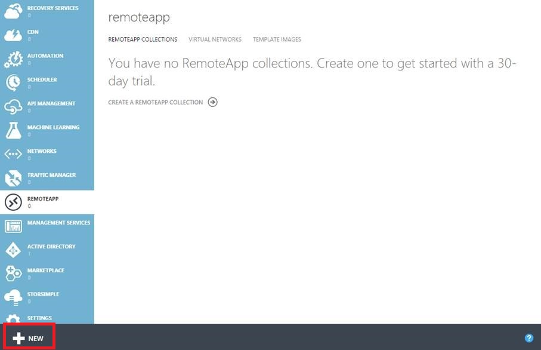
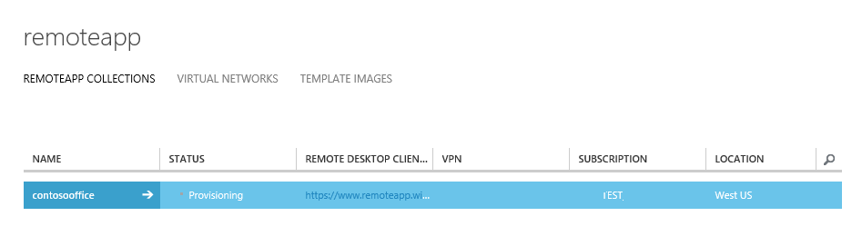
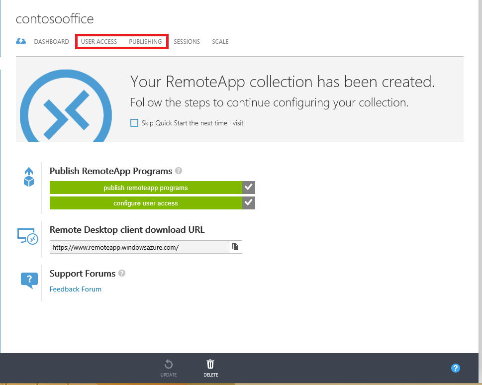
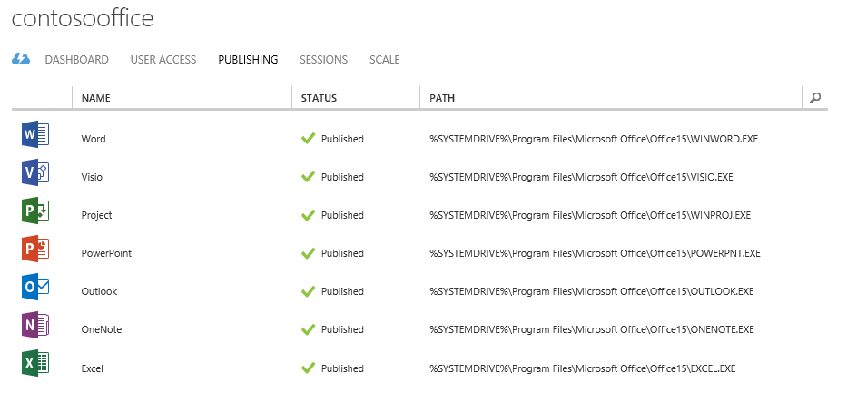
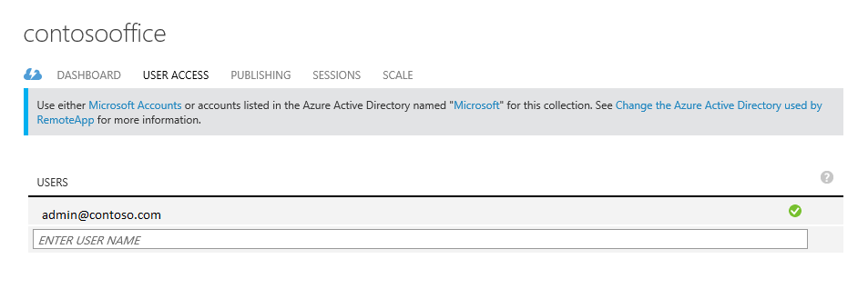
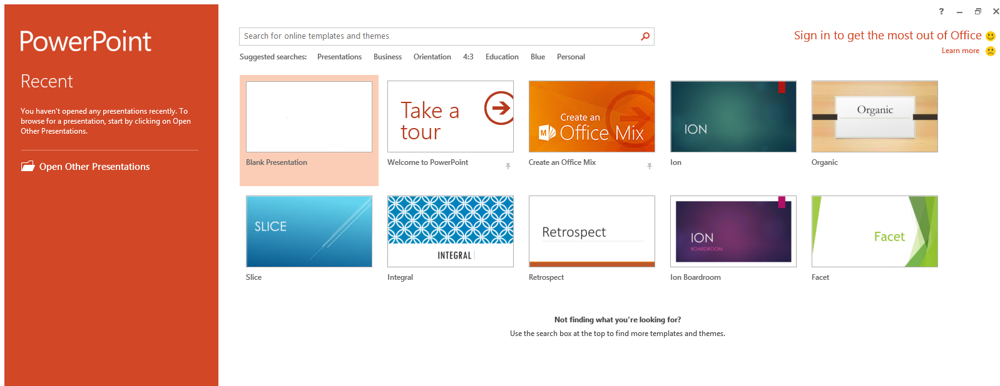

<properties
   pageTitle="Erhalten Sie die gleiche Office 365-Oberfläche auf jedem Gerät mit Azure RemoteApp | Microsoft Azure"
   description="Erfahren Sie, wie eine beliebige app, Office 365 für Ihre Benutzer freizugeben, mithilfe von Azure RemoteApp."
   services="remoteapp"
   documentationCenter=""
   authors="guscatalano"
   manager="mbaldwin"
   editor=""/>

<tags
   ms.service="remoteapp"
   ms.devlang="na"
   ms.topic="hero-article"
   ms.tgt_pltfrm="na"
   ms.workload="compute"
   ms.date="08/15/2016"
   ms.author="guscatal;elizapo"/>

# Erhalten Sie die gleiche Office 365-Oberfläche auf jedem Gerät mit Azure RemoteApp

> [AZURE.IMPORTANT]
> Azure RemoteApp ist nicht mehr verwendet werden. Lesen Sie die Details der [Ankündigung](https://go.microsoft.com/fwlink/?linkid=821148) .

In diesem Artikel wird zum Bereitstellen von Office 365 auf jedem Gerät in Ihrem Unternehmen behandelt. Die Benutzer können die gleichen Funktionen und die Benutzeroberfläche Erfahrung mit Android, Apple und Windows erhalten.

Dies wird erreicht, mit Azure RemoteApp durch das Hosten von Office 365 auf skalieren können virtuellen Computern in Azure, die Benutzer die Verbindung herstellen können. Mit dieser Gruppe von virtuellen Computern wir eine Auflistung"Cloud" aufrufen.

## Erstellen einer Websitesammlung cloud

Nachdem Sie ein Azure-Konto erstellt haben, navigieren Sie zuerst **RemoteApp bereit** , indem Sie auf den Link auf der linken Seite.

Klicken Sie dann durch Klicken auf **neue** unten und "quick erstellen" Fortsetzen einer Websitesammlung. Geben Sie einen Namen, der Region, das Abonnement, den Plan und das Bild "Office Proffesional 2013", das wir bereitstellen.

Nachdem Sie das Formular abgeschlossen, die, das der Erstellungsprozess für Websitesammlung gestartet werden soll haben. Dies kann bis zu einer Stunde dauern.

Nachdem der Vorgang abgeschlossen ist, wird sie wie folgt aussehen. Wenn wir **für die Veröffentlichung** klicken Sie auf sehen Sie, dass die meisten Office-Clientanwendungen für uns bereits veröffentlicht wurden.

An diesem Punkt können Sie auch mehrere Benutzer hinzufügen, die auf dieser Websitesammlung zugreifen, indem Sie **Des Benutzerzugriffs**auf.

Jetzt uns Herstellen einer Verbindung mit Office 365 testen!

## Verbinden mit Office 365

Wir leiten über zu [https://www.remoteapp.windowsazure.com/](https://www.remoteapp.windowsazure.com/), führen Sie einen Bildlauf nach unten und klicken Sie auf **Herunterladen von Clients** , um den Azure RemoteApp-Client auf dem Gerät installiert werden, die angezeigt wird. Die folgenden Screenshots sind für Windows.

Sobald die Anwendung gestartet wird werden Sie aufgefordert werden, melden Sie sich mit Ihrem Microsoft-Konto (vormals als eine "Live-ID" bezeichnet), verwenden die gleiche eine als Azure-Konto jetzt. Wenn Sie angemeldet sind in sollten Sie erhalten eine Benachrichtigung über neue Einladungen, klicken Sie auf vorhanden und sollten Sie eine Liste wie eine unten sehen. Nehmen Sie die Einladung, die Ihre Azure-Konto Besitzer e-Mail-Adresse entspricht.

Wie es aussieht, wenn neue Einladungen vorhanden sind.

Nachdem Sie die Einladung annehmen, sollte der Office-apps im Client Azure RemoteApp angezeigt werden.

Beim Klicken auf sollten all diese Elemente, die die Anwendung werden, der Azure-virtuellen Computern und Sie gestartet soll alle Menge! Einfacheres!

