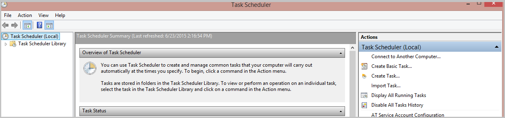
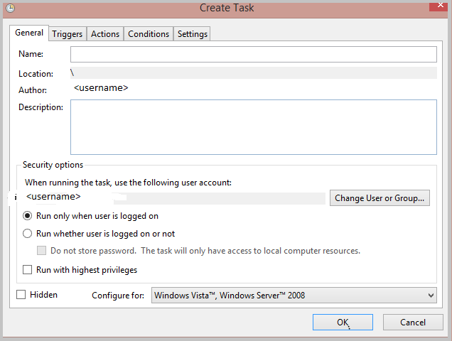
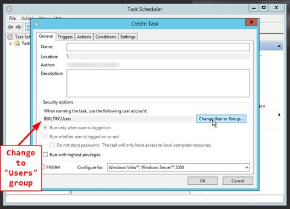

<properties 
    pageTitle="Wie wird Azure RemoteApp Benutzerdaten und Einstellungen gespeichert? | Microsoft Azure"
    description="Erfahren Sie, wie Azure RemoteApp Benutzerdaten mithilfe des Benutzer Profil Datenträgers speichert."
    services="remoteapp"
    documentationCenter="" 
    authors="lizap" 
    manager="mbaldwin" />

<tags 
    ms.service="remoteapp" 
    ms.workload="compute" 
    ms.tgt_pltfrm="na" 
    ms.devlang="na" 
    ms.topic="article" 
    ms.date="08/15/2016" 
    ms.author="elizapo" />

# Wie wird Azure RemoteApp Benutzerdaten und Einstellungen gespeichert?

> [AZURE.IMPORTANT]
> Azure RemoteApp ist nicht mehr verwendet werden. Lesen Sie die Details der [Ankündigung](https://go.microsoft.com/fwlink/?linkid=821148) .

Azure RemoteApp speichert die Identität des Benutzers und Anpassungen über Geräte und Sitzungen. Diese Benutzerdaten werden in einem pro Benutzer pro Websitesammlung Datenträger, bekannt als Benutzer Profil Datenträger (UPD) gespeichert. Der Datenträger wird für diesen Benutzer und stellt sicher, dass der Benutzer verfügt über ein konsistentes, unabhängig davon, wo sie sich anmelden. speichert 

Benutzer Profil Datenträger sind für den Benutzer vollständig transparent – Benutzer Speichern von Dokumenten auf ihren Dokumentordners (auf der Anzeige auf einem lokalen Laufwerk werden), und ändern Sie ihre app-Einstellungen wie üblich. Zur gleichen Zeit beibehalten werden alle persönliche Einstellungen, beim Herstellen einer Verbindung zu Azure RemoteApp von jedem Gerät aus. Der Benutzer sieht lediglich die Daten an derselben Stelle.

Jede UPD verfügt über 50GB dauerhafte Speicherung und beide benutzereinstellungen Daten und der Anwendung enthält. 

Lesen Sie weitere Informationen darüber, Benutzerprofildaten auf.

>[AZURE.NOTE] So deaktivieren Sie die UPD müssen? Sie können diese jetzt - Auschecken Pavithras Blogbeitrag, [Deaktivieren Sie Benutzer Profil Datenträger (UPDs) in Azure RemoteApp](https://blogs.technet.microsoft.com/enterprisemobility/2015/11/11/disable-user-profile-disks-upds-in-azure-remoteapp/)Details ausführen.

## Wie kann ein Administrator die Daten?

Wenn Sie Zugriff auf die Daten für einen Benutzer (für Wiederherstellung oder, wenn der Benutzer das Unternehmen verlässt) müssen, wenden Sie sich an Azure-Support und übermitteln Sie Abonnement für die Websitesammlung und die Identität des Benutzers. Das Team Azure RemoteApp wird die URL in die virtuelle Festplatte ein. Herunterladen Sie diese virtuelle Festplatte und rufen Sie ab, alle Dokumente oder Dateien, die Sie benötigen. Beachten Sie, dass die virtuelle Festplatte 50 GB ist, sodass es dauert ein wenig sie herunterladen.

## Ist die Daten gesichert?

Ja, wir eine Sicherung Benutzerdaten pro geografischem Standort speichern. Die Daten ist schreibgeschützt und auf die gleiche Weise zugegriffen werden kann, wie die regulären Daten (Kontakt Azure RemoteApp Bezugsarten) wäre, ist das primäre Data Center nach unten. Die Daten in den Sicherungsspeicherort in Echtzeit kopiert werden, und wir Kopien von unterschiedlichen Versionen nicht beibehalten. Ja, auf Beschädigung der Daten, wir werden nicht auf eine zuvor bekannten guten Version Wiederherstellen ist das primäre Data Center nach unten, Sie werden jedoch keine Benutzerdaten aus dem anderen Speicherort abrufen.

## Wie anzeigen Benutzer die UPD serverseitig?

Jeder Benutzer muss eigenen Verzeichnis auf dem Server, der ihre UPD zugeordnet ist: c:\Users\username.

## Was ist die beste Methode zum Verwenden von Outlook und UPD?

Azure RemoteApp speichert den Outlook-Zustand (Postfächer PST-Dateien) zwischen Sitzungen an. Um dies zu ermöglichen, benötigen wir die PST-Datei in die Benutzerprofildaten gespeichert werden soll (c:\users\<Username >). Dies ist der Standardspeicherort für die Daten, also solange nicht die Position zu ändern, die Daten zwischen Sitzungen beibehalten werden.

Es empfiehlt sich auch, dass "Cache"-Modus in Outlook und Verwenden von "Server /" Onlinemodus für die Suche.

Lesen Sie weitere Informationen zur Verwendung von Outlook und Azure RemoteApp [in diesem Artikel](remoteapp-outlook.md) aus.

## Wissenswertes zu Umleitung
Sie können Azure RemoteApp, damit die Benutzer lokale Geräte Einrichten der [Umleitung](remoteapp-redirection.md)zugreifen können, konfigurieren. Lokale Geräte werden klicken Sie dann auf die Daten auf die UPD zugreifen.

## Kann ich meine UPD als Netzwerkfreigabe verwenden?
Nein. UPDs kann nicht als Netzwerkfreigabe verwendet werden. Eine UPD ist nur verfügbar, für den Benutzer, wenn der Benutzer aktiv Azure RemoteApp verbunden ist.

## Löschen eines Benutzers aus einer Sammlung wird deren UPD gelöscht?

Nein, wenn Sie einen Benutzer löschen, wir die UPD nicht automatisch gelöscht, – stattdessen wir die Daten speichern, bis Sie die Sammlung löschen. 90 Tage nach dem Löschen der Websitesammlung löschen wir alle UPDs. 

Wenn Sie eine UPD aus einer Sammlung löschen, wenden Sie sich an Azure RemoteApp - müssen, können wir UPD aus unsere Seite löschen.

## Kann ich meine Benutzer UPDs (entweder aktuellen oder gelöschte Benutzer) zugreifen?

Ja, wenn Sie [Azure RemoteApp](mailto:remoteappforum@microsoft.com)wenden, können wir Sie mit einer URL Zugriff auf die Daten einrichten. Ungefähr 10 Stunden müssen Sie Herunterladen von Daten oder Dateien aus der UPD vor der Zugriff läuft ab.

## Sind UPDs offline verfügbar?

Bis zu diesem Zeitpunkt wir jenseits der oben beschriebenen 10 Stunde Access-Fenster nicht Offlinezugriff auf UPDs, bereitstellen. Dies bedeutet, dass wir derzeit nicht über eine Möglichkeit, die Ihnen Zugriff für lange ermöglichen verfügen genug, um komplexere Aufgaben, wie das Ausführen von Antivirensoftware auf den UPDs oder den Zugriff auf Daten für ein Audit durchführen.

## Werden gehen Sie wie folgt-Registrierungsschlüssel beibehalten?
Ja, ist HKEY_Current_User geschrieben Teil der UPD.

## Kann ich UPDs für eine Websitesammlung deaktivieren?

Ja, bitten Sie Azure RemoteApp UPDs für ein Abonnement deaktivieren, aber nicht möglich, die sich selbst. Dies bedeutet, dass UPDs für alle Websitesammlungen in das Abonnement deaktiviert wird.

Möglicherweise möchten UPDs in den folgenden Situationen zu deaktivieren: 

- Müssen Abschluss Zugriff und Steuerung von Benutzerdaten (für überwachen und Analysieren der Zwecke, z. B. financial Institutionen).
- Sie haben 3rd Drittanbietern Benutzer Management Lösungen lokalen Profil und weiterhin diese in Ihrer Domäne RemoteApp Azure-Bereitstellung verwenden möchten. Hierzu muss den Agent Profil in das gold Bild geladen werden. 
- Sie brauchen keine lokalen Datenspeicher oder Sie verfügen über alle Daten in der Cloud oder die Dateifreigabe und möchte Steuerelement mit Daten über die Azure RemoteApp lokal speichern.

Weitere Informationen finden Sie unter [Deaktivieren Benutzer Profil Datenträger (UPDs) in Azure RemoteApp](https://blogs.technet.microsoft.com/enterprisemobility/2015/11/11/disable-user-profile-disks-upds-in-azure-remoteapp/) .

## Kann ich verhindern, dass Benutzer Speichern von Daten in dem Systemlaufwerk?

Ja, aber Sie müssen, die in das Vorlagenbild einrichten, bevor Sie die Websitesammlung erstellen. Gehen Sie folgendermaßen vor, den Zugriff auf dem Systemlaufwerk blockieren:

1. Führen Sie **gpedit.msc** auf das Vorlagenbild ein.
2. Navigieren Sie zu **Benutzerkonfiguration > Administrative Vorlagen > Windows-Komponenten > Explorer**.
3. Wählen Sie die folgenden Optionen aus:
    - **Diese angegebenen Datenträger im Fenster Arbeitsplatz ausblenden**
    - **Zugriff auf Laufwerke vom Arbeitsplatz nicht zulassen**

## Kann ich UPDs Startwert? Ich möchte einige Daten in der UPD setzen, die beim ersten zur Verfügung, die der Benutzer anmeldet.

Ja, wenn Sie das Vorlagenbild erstellen, können Sie Informationen zu den standardmäßigen Profil hinzufügen. Diese Informationen wird dann die UPD hinzugefügt.

## Können die Größe der UPD je nachdem wie viele Daten ändern, die ich speichern möchte?

Nein, alle UPDs 50 GB Speicher haben. Wenn Sie die unterschiedliche Datenmengen speichern möchten, versuchen Sie Folgendes:

1. Deaktivieren Sie UPDs für die Websitesammlung ein.
2. Richten Sie eine Dateifreigabe für Benutzern den Zugriff auf ein.
3. Laden Sie die Dateifreigabe mithilfe eines Skripts zum Starten. Nachfolgend finden Sie Details in Azure RemoteApp Skripts zum Starten.
4. Direkte Benutzer, alle Daten in die Dateifreigabe zu speichern.

## Wie führe ich eine Skript zum Starten des in Azure RemoteApp?

Wenn Sie ein Startskript ausführen möchten, beginnen Sie durch Erstellen einer geplanten Vorgangs im Vorlagenbild, die, das Sie für die Websitesammlung verwenden möchten. (Führen Sie diese *vor dem* Ausführen von Sysprep.) 

Klicken Sie auf der Registerkarte **Allgemein** müssen Sie das **Benutzerkonto** , klicken Sie unter Sicherheit auf "BUILTIN\Users." ändern

Geplante Vorgang wird das Startskript, und verwenden die Anmeldeinformationen des Benutzers gestartet. Planen Sie die Aufgabe aus jeder jeweils ein Benutzer anmeldet.

Sie können auch [Skripts zum Starten von Gruppenrichtlinien-basierten](https://technet.microsoft.com/library/cc779329%28v=ws.10%29.aspx)verwenden. 

## Wissenswertes zum Platzieren eines Skripts zum Starten in das Startmenü? Funktionieren die?

Kurzum, lässt sich erstellen eine bat-Datei, die ein Config Fenster Skript ausgeführt wird und auf den c:\ProgramData\Microsoft\Windows\Start Menu\Programs\StartUp Ordner gespeichert, und lassen Sie anschließend die Skripts ausgeführt werden, wenn ein Benutzer eine Sitzung RemoteApp startet?

Nein, ist, die nicht mit Azure RemoteApp, unterstützt die RDSH, verwendet, das auch Skripts zum Starten in das Startmenü nicht unterstützt.

## Kann ich mstsc.exe (das Programm Remotedesktop) so konfigurieren Sie die Skripts zum Anmelden verwenden?

Das wird durch Azure RemoteApp nicht unterstützt.

## Können Daten lokal des virtuellen Computers werden gespeichert?

Nein, eine beliebige Stelle des virtuellen Computers außer in den UPD gespeicherte Daten verloren. Besteht eine hohe Wahrscheinlichkeit der Benutzer erhalten Sie dem gleichen virtuellen Computer das nächste Mal, das sie in Azure RemoteApp anmelden. Wir beibehalten nicht Beibehaltung der Benutzer-virtueller Computer, damit der Benutzer wird nicht melden Sie sich bei dem gleichen virtuellen Computer, und die Daten gehen verloren. Wenn wir die Sammlung aktualisieren, werden die vorhandenen virtuellen Computern darüber hinaus mit einer neuen Gruppe von virtuellen Computern - ersetzt, die bedeutet, dass alle des virtuellen Computers selbst gespeicherten Daten verloren. Es wird empfohlen, Daten in die UPD, freigegebenen Speicher ähnlich wie eine Dateiserver innerhalb einer VNET oder in der Cloud mit einem Cloud-Speicher-System wie DropBox Azure-Dateien speichern.

## Wie können eine Azure Dateifreigabe auf einem virtuellen Computer mithilfe der PowerShell werden bereitgestellt?

Das Cmdlet Netz-PSDrive können Sie das Laufwerk, wie folgt bereitstellen:

    New-PSDrive -Name <drive-name> -PSProvider FileSystem -Root \\<storage-account-name>.file.core.windows.net\<share-name> -Credential :<storage-account-name>

Sie können auch Ihre Anmeldeinformationen speichern, indem Sie Folgendes ausführen:

    cmdkey /add:<storage-account-name>.file.core.windows.net /user:<storage-account-name> /pass:<storage-account-key>

Die können Sie die überspringen den - Credential-Parameter in das Cmdlet PSDrive neu.
