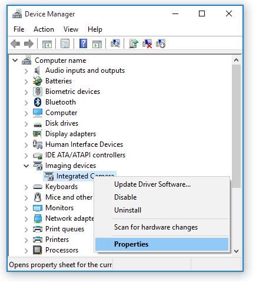
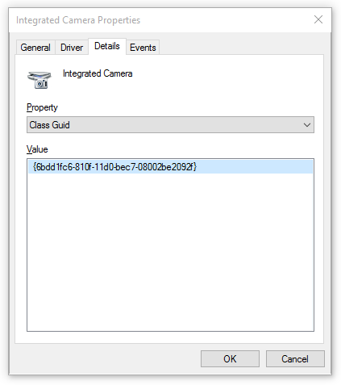
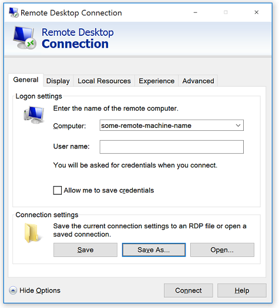

<properties 
    pageTitle="Wie können Sie USB-Geräte in Azure RemoteApp umleiten? | Microsoft Azure" 
    description="Erfahren Sie, wie Umleitung für USB-Geräte in Azure RemoteApp verwendet werden soll." 
    services="remoteapp" 
    documentationCenter="" 
    authors="lizap" 
    manager="mbaldwin" />

<tags 
    ms.service="remoteapp" 
    ms.workload="compute" 
    ms.tgt_pltfrm="na" 
    ms.devlang="na" 
    ms.topic="article" 
    ms.date="08/15/2016" 
    ms.author="elizapo" />

# Wie können Sie USB-Geräte in Azure RemoteApp umleiten?

> [AZURE.IMPORTANT]
> Azure RemoteApp ist nicht mehr verwendet werden. Lesen Sie die Details der [Ankündigung](https://go.microsoft.com/fwlink/?linkid=821148) .

Umleitung ermöglicht Benutzern das USB-Gerät mit ihrem Computer oder Tablet-PC mit der apps in Azure RemoteApp verwenden. Wenn Sie Skype über Azure RemoteApp freigegeben haben, müssen die Benutzer beispielsweise deren Kameras Gerät verwenden können.

Bevor Sie fortfahren, stellen Sie sicher, dass Sie die USB-Umleitungsinformationen in [verwenden Umleitung in Azure RemoteApp](remoteapp-redirection.md)lesen. Jedoch die Nusbdevicestoredirect:s empfohlen: * funktioniert nicht für USB-Webcams und funktioniert möglicherweise nicht für einige USB-Drucker oder multifunktionalen USB-Geräte. Standardmäßig und aus Sicherheitsgründen muss der Administrator Azure RemoteApp Umleitung Geräteklasse GUID oder Gerät Instanz-ID aktivieren, bevor die Benutzer diesen Geräten verwenden können.

Obwohl in diesem Artikel über das Web Kamera Umleitung spricht, können Sie mithilfe einen ähnlichen Ansatz umleiten USB-Druckern und anderen multifunktionalen USB-Geräten, die nicht umgeleitet werden, indem Sie die **Nusbdevicestoredirect:s:*** Befehl.

## Umleitungsoptionen für USB-Geräte
Azure RemoteApp verwendet ähnelt dem Verfahren für USB-Geräte als verfügbar für Remote Desktop Services umleiten. Die zugrunde liegende Technologie können Sie die richtige Umleitungsmethode für ein angegebenes Gerät, um das Beste beider auf hoher Ebene erhalten und RemoteFX USB-Gerät auswählen Umleitung mithilfe der **Usbdevicestoredirect:s:** Befehl. Es gibt vier Elemente, die diesen Befehl aus:

| Verarbeitungsreihenfolge | Parameter           | Beschreibung                                                                                                                |
|------------------|---------------------|----------------------------------------------------------------------------------------------------------------------------|
| 1                | *                   | Wählt alle Geräte, die vom auf hoher Ebene Umleitung übernommen nicht zur Verfügung. Hinweis: durch das Design * für USB-Webcams funktioniert nicht.  |
|                  | {Geräteklasse GUID} | Wählt alle Geräte, die die angegebenen Gerätesetupklasse entsprechen.                                                           |
|                  | USB\InstanceID      | Wählt ein USB-Gerät angegeben haben, für die jeweilige Instanz-ID.                                                                  |
| 2                | -USB\Instance ID    | Entfernt die Umleitung Einstellungen für das angegebene Gerät an.                                                                 |

## Ein USB-Gerät umleiten mithilfe der Geräteklasse GUID
Es gibt zwei Möglichkeiten, um die Geräteklassen-GUID des zu finden, die für die Umleitung verwendet werden kann. 

Die erste Option besteht darin, [Systemdefinierte Gerät Setup Klassen zur Verfügung Lieferanten](https://msdn.microsoft.com/library/windows/hardware/ff553426.aspx)verwenden. Wählen Sie die Klasse, die das auf den lokalen Computer angeschlossene Gerät am besten passt. Bei digitalen Kameras kann es eine Bildverarbeitungsgeräte Class oder Videogerät erfassen Klasse handeln. Sie müssen ein Experimentieren mit den Geräteklassen, um die richtige Klassen-GUID zu finden, die mit dem lokal angeschlossenen USB-Gerät (in unserem Fall die Webkamera) funktioniert führen.

Ein besseres oder die zweite Option besteht darin, führen Sie diese Schritte, um die bestimmte Geräteklasse GUID zu finden:

1. Öffnen Sie den Geräte-Manager, suchen Sie das Gerät, das umgeleitet, und klicken Sie darauf, und öffnen Sie die Eigenschaften.

2. Klicken Sie auf die Registerkarte **Details** wählen Sie die Eigenschaft **Class Guid**aus. Der Wert, der angezeigt wird, ist die GUID Klasse für diese Art von Gerät.

3. Verwenden Sie den Wert Class Guid, Geräte umleiten, die es entsprechen.

Beispiel:

        Set-AzureRemoteAppCollection -CollectionName <collection name> -CustomRdpProperty "nusbdevicestoredirect:s:<Class Guid value>"

Sie können mehrere Gerät Umleitung in der gleichen Cmdlet kombinieren. Beispiel: lokale Speicherung und eine USB-Webcam umgeleitet, Cmdlet sieht wie folgt aus:

        Set-AzureRemoteAppCollection -CollectionName <collection name> -CustomRdpProperty "drivestoredirect:s:*`nusbdevicestoredirect:s:<Class Guid value>"

Wenn Sie Umleitung von Klasse GUID festlegen werden alle Geräte, die in der angegebenen Auflistung Klasse GUID entsprechen umgeleitet. Wenn Sie mehreren Computern im lokalen Netzwerk, die die gleichen USB-Webcams enthalten sind, können Sie ein einzelnes Cmdlet alle der Webcams umgeleitet ausführen.

## Umleiten ein USB-Gerät mithilfe der Geräte-Instanz-ID

Wenn Sie eine genauere Kontrolle und Umleitung pro Gerät steuern möchten, können Sie den **USB\InstanceID** Umleitung Parameter verwenden.

Der schwierigste Teil dieser Methode wird die USB-Gerät Instanz-ID suchen. Sie benötigen Zugriff auf den Computer und das USB-Gerät. Klicken Sie dann wie folgt vor:

1. Aktivieren Sie die Gerät Umleitung in Remote Desktop-Sitzung in beschriebenen [wie kann ich meine Geräte und Ressourcen in verwenden eine Sitzung Remotedesktop?](http://windows.microsoft.com/en-us/windows7/How-can-I-use-my-devices-and-resources-in-a-Remote-Desktop-session)
2. Öffnen Sie eine Remote Desktop-Verbindung, und klicken Sie auf **Optionen anzeigen**.
3. Klicken Sie auf **Speichern unter** , um die aktuellen Verbindungseinstellungen zu einer RDP-Datei zu speichern.  
    
4. Wählen Sie einen Namen und einen Speicherort, beispielsweise "MyConnection.rdp" und "Diese PC\Documents", und speichern Sie die Datei.
5. Öffnen Sie die MyConnection.rdp-Datei mit einem Texteditor, und suchen Sie die Instanz-ID des Geräts, die Sie umleiten möchten.

Verwenden Sie nun die Instanz-ID in das folgende Cmdlet aus:

    Set-AzureRemoteAppCollection -CollectionName <collection name> -CustomRdpProperty "nusbdevicestoredirect:s: USB\<Device InstanceID value>"

### Helfen Sie uns Ihnen helfen 
Wussten Sie schon, dass zusätzlich zur Bewertung der in diesem Artikel und Erstellen von Kommentaren nach unten unter, Sie im Artikel selbst ändern können? Fehlt etwas? Ein Problem? Schreiben ich etwas, die nur verwirrend ist? Bildlauf nach oben, und klicken Sie auf **Bearbeiten, klicken Sie auf GitHub** , um die Änderungen vornehmen – die werden zu uns kommen, zur Überprüfung, und klicken Sie dann, sobald wir sie melden Sie sich auf deaktivieren, sehen Sie Ihre Änderungen und direkt hier Verbesserungen.