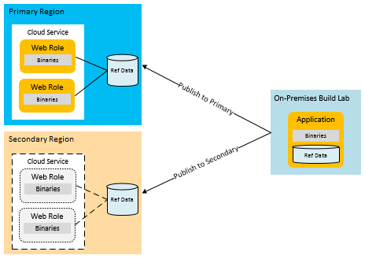
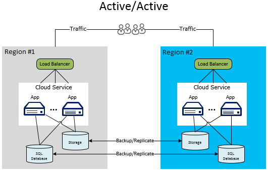

<properties
   pageTitle="Wiederherstellung für Azure Applications | Microsoft Azure"
   description="Technische Übersicht und ausführliche Informationen über das Entwerfen von Applications für die Wiederherstellung auf Microsoft Azure."
   services=""
   documentationCenter="na"
   authors="adamglick"
   manager="saladki"
   editor=""/>

<tags
   ms.service="resiliency"
   ms.devlang="na"
   ms.topic="article"
   ms.tgt_pltfrm="na"
   ms.workload="na"
   ms.date="08/18/2016"
   ms.author="aglick"/>

#Wiederherstellung bei Microsoft Azure

Während der hoher Verfügbarkeit zu temporären Fehlers Management ist, ist der Wiederherstellung (DR) zu schwerwiegenden Verlust der Anwendungsfunktionalität. Angenommen Sie, das Szenario, in dem Bereich fällt aus. In diesem Fall müssen Sie einen Plan zum Ausführen Ihrer Anwendungs oder Zugriff auf Ihre Daten außerhalb der Azure Region. Ausführung von diesem Plan umfasst die Personen, Prozesse und unterstützenden Anwendungen, die das System, um die Funktion zu ermöglichen. Die Besitzer Business und SOX-Technologie, die bei einem schwerwiegenden Vorfall Betrieb des Systems-Modus definieren ermitteln die Ebene der Funktionalität für den Dienst auch bei einem Datenverlust. Die Ebene der Funktionalität kann einige Formen annehmen: teilweise verfügbar ist, überhaupt nicht verfügbar (heruntergestuft Funktionalität oder verzögert Verarbeitung) oder vollständig verfügbar.

##Azure Disaster Wiederherstellungsfeatures

Wie bei Verfügbarkeit Aspekte, hat Azure [Stabilität technische Anleitung](./resiliency-technical-guidance.md) , die für die Unterstützung der Wiederherstellung entwickelt wurde. Es gibt auch eine Beziehung zwischen einige der Features für die Verfügbarkeit von Azure und Disaster Wiederherstellung. Beispielsweise wird die Verwaltung von Rollen in Fehlerstrukturanalyse-Domänen die Verfügbarkeit der Anwendung erhöht. Ohne die Verwaltung werden Hardwarefehler nicht behandelt "Fehlerszenarios". Damit die ordnungsgemäße Durchführung der von Verfügbarkeitsfeatures und Strategien ein wichtiger Disaster dokumentprüfung ist eine Anwendung. Es jedoch nicht in diesem Artikel Probleme mit der allgemeinen Verfügbarkeit zu schwerwiegenden (und manchen) unerwünschte Ereignisse.

##Mehrere Datacenter Regionen

Azure unterhält Rechenzentren in vielen Regionen auf der ganzen Welt. Diese Infrastruktur unterstützt mehrere Wiederherstellungssituationen wie die vom System bereitgestellten Geo-Replikation Azure-Speicher zu sekundären Regionen. Dies bedeutet auch, dass Sie einfach und kostengünstig einen Clouddienst mit mehreren Speicherorten auf der ganzen Welt bereitstellen können. Vergleichen Sie dies mit den Kosten und Probleme bei der Ausführung von Ihrer eigenen Rechenzentren auf mehrere Bereiche. Bereitstellen von Daten und Dienste auf mehrere Bereiche trägt zum Schutz Ihrer Anwendungs von Haupt-Ausfall in einem einzigen Bereich.

##Azure Datenverkehr-Manager

Wenn ein regionsspezifische Fehler auftritt, müssen Sie den Datenverkehr auf Services oder in einer anderen Region Bereitstellungen umleiten. Sie können diese routing manuell ausführen, aber es sieht effizienter mit einem automatisierten Vorgang. Azure Datenverkehr Manager ist für diese Aufgabe vorgesehen. Sie können Sie um das Failover für den Benutzerdatenverkehr in einer anderen Region bei Ausfall die primäre Region automatisch zu verwalten. Da Datenverkehr Management ein wichtiger der globalen Strategie ist, ist es wichtig, die Grundlagen von Datenverkehr Manager zu verstehen.

Das folgende Diagramm verbinden Benutzer zu einer URL, die für den Datenverkehr-Manager (__http://myATMURL.trafficmanager.net__) und die Zusammenfassung der ist-Website-URLs (__http://app1URL.cloudapp.net__ und __http://app2URL.cloudapp.net__) angegeben hat. Grundlage, wie Sie die Kriterien für konfigurieren, wenn für Routing von Benutzern, werden Benutzer an die richtige ist-Website gesendet, wenn die Richtlinie schreibt vor. Die Richtlinienoptionen sind Round-Robert, Leistung oder Failover. Aus Gründen der in diesem Artikel werden wir nur die Option Failover kümmern.

Wenn Sie den Datenverkehr Manager konfigurieren sind, geben Sie ein neues DNS Manager Datenverkehr Präfix. Dies ist die URL-Präfix, die Sie bereitstellen, werden den Benutzern auf Ihren Dienst zugreifen. Datenverkehr Manager fasst jetzt eine Ebene nach oben und nicht auf der Regionsebene für den Lastenausgleich. Das DNS Manager Datenverkehr ordnet CNAME für alle Bereitstellungen, die es verwaltet werden.

In den Datenverkehr Manager legen Sie die Priorität Bereitstellungen, die Benutzer weitergeleitet werden, wenn ein Fehler auftritt. Datenverkehr-Manager überwacht die Endpunkte des Bereitstellungen und Notizen an, wenn die primäre Bereitstellung fehlschlägt. Bei einem Fehler Datenverkehr Manager analysiert die nach Priorität sortierte Liste der Bereitstellungen und leitet Benutzer nach dem nächsten Vorkommen in der Liste.

Obwohl Datenverkehr Manager, wo Sie in einem Failover beschließt, können Sie entscheiden, ob Ihre Domäne Failover inaktiv oder aktiv ist, während Sie sich nicht in der Failovermodus befinden. Die Funktionalität hat nichts mit Azure Datenverkehr Manager tun. Datenverkehr-Manager einen Fehler in der primären Standort erkennt und wird zur Failover-Standort. Datenverkehr Manager setzt über unabhängig davon, ob dieser Standort aktuell Benutzer oder nicht zuständig ist.

Weitere Informationen zur Funktionsweise von Azure Datenverkehr Manager finden Sie in:

 * [Übersicht über den Datenverkehr-Manager](../traffic-manager/traffic-manager-overview.md)
 * [Konfigurieren von Failover routing Methode](../traffic-manager/traffic-manager-configure-failover-routing-method.md)

##Azure Notfallszenarios

Den folgenden Abschnitten werden die verschiedene Typen von Notfallszenarios. Region organisationsweite Ausfällen sind nicht nur Gründe der Anwendung organisationsweite Fehler. Beeinträchtigt Entwurf oder Administration Fehler können auch zu Ausfall führen. Es ist wichtig, erwägen Sie die möglichen Ursachen für einen Fehler beim Entwerfen und Testen Phasen Ihres Plans Wiederherstellung. Ein guter Plan nutzt Azure Funktionen und diese mit anwendungsspezifische Strategien erweitert. Die ausgewählte Antwort wird durch die Wichtigkeit der Anwendung vorgegeben Wiederherstellung Punkt Ziel (RPO), und die Ziel-Wiederherstellung Zeit (RTO).

###Anwendungsfehler

Azure Datenverkehr Manager übernimmt automatisch Fehlern, die aus der zugrunde liegenden Hardware oder das Betriebssystem von Software auf dem Host virtuellen Computer an. Azure erstellt eine neue Instanz der Rolle funktionierenden Servers und die Drehung Lastenausgleich hinzugefügt. Ist die Anzahl der Rolleninstanzen größer als eins, wechselt Azure Verarbeitung zu anderen laufenden Rolleninstanzen beim Ersetzen des fehlerhaften Knotens an.

Es gibt schwerwiegende Anwendungsfehler, die unabhängig von Hardware oder Betriebssystem Fehler auftreten. Die Anwendung möglicherweise aufgrund von Problemen mit fehlerhaften Logik oder Probleme mit der Datenintegrität verursacht schwerwiegenden Ausnahmen fehl. Sie müssen genügend werden in den Code einbinden, damit ein Überwachung System Fehler erkennen und einen Anwendungsadministrator benachrichtigen kann. Administrator, der die vollständige die Verfahren kennt kann entscheiden, ein Prozesses Failover aufzurufen. Sie können auch ein Administrator einfach einen Ausfall Verfügbarkeit zum Beheben der kritische Fehler übernehmen.

###Beschädigung der Daten

Azure speichert automatisch Ihre Daten Azure SQL-Datenbank und Azure-Speicher dreimal redundant in verschiedenen Fehlerstrukturanalyse Domänen in der gleichen Region. Wenn Sie Geo-Replikation verwenden, werden die Daten zusätzliche dreimal in einem anderen Bereich gespeichert. Jedoch wenn Ihre Benutzer oder eine Anwendung werden die Daten in die primäre Kopie beschädigt, repliziert die Daten schnell auf andere Kopien. Leider führt dies drei Kopien beschädigt Daten.

Um potenzielle Beschädigung der Daten zu verwalten, haben Sie zwei Optionen. Zunächst können Sie eine benutzerdefinierte Sicherung Strategie verwalten. Sie können Ihre Sicherungskopien in Azure oder lokalen, je nach Ihren Anforderungen Business oder Governance Vorschriften speichern. Eine weitere Möglichkeit besteht darin, die Wiederherstellungsoption für die neue Point-in-Time zum Wiederherstellen einer SQL-Datenbank zu verwenden. Weitere Informationen finden Sie im Abschnitt auf [Daten Strategien für die Wiederherstellung](#data-strategies-for-disaster-recovery).

###Netzwerk einem Dienstausfall

Wenn Teile des Netzwerks Azure nicht zugegriffen werden kann, Sie zu Ihrer Anwendung oder Daten abrufen möglicherweise nicht. Wenn eine oder mehrere Rolleninstanzen aufgrund von Netzwerkproblemen nicht verfügbar sind, wird Azure die verbleibenden verfügbaren Instanzen der Anwendung verwendet. Wenn eine Anwendung seine Daten aufgrund von einem Netzwerkausfall Azure Zugriff nicht möglich ist, können Sie potenziell in einem eingeschränkten Modus ausführen, mithilfe von zwischengespeicherten Daten lokal. Sie müssen das Wiederherstellen nach Datenverlusten zur Ausführung im beeinträchtigt Modus in Ihrer Anwendung entwerfen. Bei einigen Applikationen möglicherweise diese nicht Praxis.

Eine andere Möglichkeit ist dann, Daten in einem anderen Speicherort speichern, bis die Verbindung wiederhergestellt ist. Wenn beeinträchtigt Modus nicht möglich ist, sind die übrigen Optionen Anwendungsausfallzeiten oder Failover zu einer alternativen Region. Das Design einer Anwendung in einem eingeschränkten Modus ausgeführt wird so viele geschäftliche Entscheidung als eine technische. Dies wird ausführlich erläutert im Abschnitt [heruntergestuft Anwendungsfunktionalität](#degraded-application-functionality)klicken Sie auf Weiter.

###Fehler bei der ein abhängiger Dienst

Azure bietet viele Dienste, die periodische Ausfallzeiten auftreten können. Erwägen Sie [Azure Redis Cache](https://azure.microsoft.com/services/cache/) als Beispiel für ein. Dieser mit mehreren Mandanten-Dienst bietet Zwischenspeichern Funktionen an Ihrer Anwendung. Es ist wichtig zu berücksichtigen ist, was in Ihrer Anwendung geschieht, wenn der abhängige Dienst nicht verfügbar ist. Dieses Szenario ist in vielen Möglichkeiten mit dem Netzwerk einem Dienstausfall Szenario vergleichbar. Jedoch in Betracht ziehen, führt jeden Dienst unabhängig voneinander potenzieller Verbesserungen in Ihren gesamten Plan.

Azure Redis Cache bietet Zwischenspeichern an Ihrer Anwendung aus, in der Cloud-Service-Bereitstellung, die Disaster Wiederherstellung Vorteile bereitstellt. Zunächst wird der Dienst jetzt Rollen, die lokal für die Bereitstellung sind ausgeführt werden. Daher können Sie besser zu überwachen und den Status des Caches als Teil der gesamten Management-Prozesse für den Clouddienst verwalten können. Diese Art von Zwischenspeichern macht auch die neuen Features verfügbar. Eines der neuen Features ist eine hohe Verfügbarkeit für zwischengespeicherten Daten. Auf diese Weise können zwischengespeicherte Daten zu erhalten, wenn Sie ein einzelner Knoten schlägt fehl, da doppelte Kopien auf anderen Knoten.

Beachten Sie, dass hohe Verfügbarkeit Durchsatz verkleinert und Wartezeit erhöht, da die Aktualisierung der sekundäre Kopie auf schreibt ein. Es wird auch verdoppelt die Speichermenge, die für jedes Element verwendet wird, also für das planen. Dieses bestimmte Beispiel zeigt, dass jede abhängiger Dienst-Funktionen, die möglicherweise, mit die Ihre allgemeine Verfügbarkeit und Schutz vor schwerwiegenden Fehlern zu verbessern.

Mit jeder abhängigen Dienst sollten Sie die Auswirkungen eines dienststörung verstehen. Im Beispiel Zwischenspeichern ist dies möglicherweise möglich, die Daten direkt aus einer Datenbank zugreifen, bis Sie Ihren Cache wiederherstellen. Dies wäre eine beeinträchtigt Modus in Bezug auf die Leistung jedoch würde umfassende Funktionalität im Hinblick auf Daten bereitstellen.

###Region organisationsweite dienststörung

Die vorherigen Fehlern wurden hauptsächlich Fehlern, die innerhalb der gleichen Azure Region verwaltet werden können. Jedoch müssen Sie auch die Möglichkeit Vorbereiten einer dienststörung des gesamten Bereichs auftritt. Wenn eine Region organisationsweite dienststörung auftritt, sind die lokal redundanten Kopien Ihrer Daten nicht verfügbar. Wenn Sie Geo-Replikation aktiviert haben, gibt es drei zusätzliche Kopien Ihrer Blobs und Tabellen in einem anderen Bereich. Wenn in der Region verloren gegangen sind Microsoft deklariert wird, ordnet Azure alle DNS-Einträge in der Region Geo repliziert.

>[AZURE.NOTE] Achten Sie darauf, verfügen Sie nicht über die Kontrolle über dieses Verfahren, und es wird nur für Region organisationsweite dienststörung auftreten. Daher müssen Sie auf andere anwendungsspezifische Strategien in der höchsten Ebene über die Verfügbarkeit von erzielen verlassen. Weitere Informationen finden Sie im Abschnitt auf [Daten Strategien für die Wiederherstellung](#data-strategies-for-disaster-recovery).

###Azure organisationsweite dienststörung

In Notfallplan zu können, müssen Sie den gesamten Zellbereich mögliche Datenverluste berücksichtigen. Eines der am häufigsten schwerwiegenden Ausfällen beinhaltet alle Azure Regionen gleichzeitig. Wie mit anderen Dienst, können Sie festlegen, dass Sie in diesem Fall das Risiko temporäre Ausfall erörtert. Weit verbreitet Ausfällen, die Regionen umfassen sollte viel manchen als isoliert Ausfällen sein, die abhängigen Dienste oder die einzelnen Regionen beinhalten.

Wichtiger Anwendungsmöglichkeiten möglicherweise Sie jedoch entscheiden, dass ein Sicherung Plan auch in diesem Szenario muss. Der Plan für das Ereignis, enthalten möglicherweise über zu Diensten in einer [alternativen Cloud](#alternative-cloud) oder eine [lokale und cloud-Lösung Hybrid](#hybrid-on-premises-and-cloud-solution)fehlschlägt.

###Beeinträchtigt Anwendungsfunktionalität

Eine gut entworfene Anwendung verwendet in der Regel eine Zusammenstellung von Modulen, die durch die Implementierung von lose verknüpften Informationen-Interchange Mustern kommunizieren. Eine DR geeignete Anwendung erfordert Trennung von Aufgaben auf der Modulebene. Dies ist, um zu verhindern, dass die Unterbrechung von einem abhängigen Dienst Deaktivierung der gesamten Anwendungs. Betrachten Sie beispielsweise eine Web-e-Commerce-Anwendung für Unternehmen Y. Die folgenden Module darstellen könnte die Anwendung:

 * __Produktkatalog__ ermöglicht Benutzern Produkte zu navigieren.
 * __Einkaufswagen__ können Benutzer hinzufügen und Entfernen von Produkten in seinem Einkaufswagen.
 * __Der Status__ zeigt den Versandstatus der Benutzer Bestellungen.
 * __Übermittlung der Bestellung__ schließt die Einkaufswagen Sitzung ab, indem Sie die Reihenfolge mit Zahlung.
 * __Order Processing__ überprüft die Reihenfolge für die Datenintegrität und führt eine Überprüfung der Verfügbarkeit Menge an.

Wenn eine abhängige eines Moduls in dieser Anwendung fällt aus, wie funktioniert das Modul bis dieses Teils enthalten stellt wieder her? Ein gut entwickelte System implementiert Isolation Begrenzung durch Trennung von Vorgängen zur Entwurfszeit sowohl zur Laufzeit. Sie können jeder Fehler als entfernt und nicht wiederhergestellt kategorisieren. Nicht behebbarer Fehler dauert unten im Modul, aber Sie können einen behebbarer Fehler alternativen durch minimieren. Wie im Abschnitt hoher Verfügbarkeit erläutert wird, können Sie einige Probleme von Benutzern ausblenden, indem Sie Behandlung von Fehlern und alternative Aktionen auszuführen. Während ein größeres dienststörung möglicherweise die Anwendung überhaupt nicht verfügbar. Ist jedoch eine dritte Option weiterhin bedienen Benutzer in einem eingeschränkten Modus ein.

Beispielsweise verliert die Datenbank für das Hosten von Bestellungen wechselt nach unten, das Order Processing Modul die Möglichkeit zum Verarbeiten von Verkäufen. Abhängig von der Architektur möglicherweise es schwer oder unmöglich für die Übermittlung der Bestellung und Order Processing Teile der Anwendung, um den Vorgang fortzusetzen. Wenn die Anwendung nicht für ist dieses Szenario ausgelegt, möglicherweise die gesamte Anwendung offline gehen.

In diesem Szenario gleichen ist es jedoch möglich, dass die Produktdaten in einem anderen Speicherort gespeichert ist. In diesem Fall kann das Modul Produktkatalog weiterhin zum Anzeigen von Produkten verwendet werden. Im Modus beeinträchtigt wird die Anwendung weiterhin für verfügbaren Funktionen wie anzeigen Produktkatalog Benutzer bereitgestellt werden. Andere Teile der Anwendung, sind jedoch nicht verfügbar ist, wie z. B. Anordnung oder Inventory Abfragen.

Eine andere Variante der beeinträchtigt Modus zentriert auf Performance anstelle von Funktionen. Betrachten Sie beispielsweise ein Szenario, in dem Produktkatalog durch Azure Redis Cache zwischengespeichert wird. Wenn Zwischenspeichern nicht mehr verfügbar ist, möglicherweise die Anwendung direkt an den Server-Speicher Katalog Produktinformationen abzurufen wechseln. Aber in Access möglicherweise langsamer als die Version aus dem Cache. Aus diesem Grund wird die Leistung der Anwendung beeinträchtigt, bis der Zwischenspeichern Dienst wiederhergestellt werden kann.

Entscheidung, wie viel der Anwendung weiterhin die Funktion in einem eingeschränkten Modus wird sowohl einer geschäftlichen und einer technischen Entscheidung. Die Anwendung muss auch entscheiden, wie die Benutzer temporäre Probleme zu informieren. In diesem Beispiel kann die Anwendung zulassen Produkte anzeigen und auch einen Einkaufswagen hinzufügen. Jedoch, wenn der Benutzer versucht, einen Kauf tätigen, die Anwendung der Benutzer benachrichtigt, dass das Modul Vertrieb vorübergehend nicht zugegriffen werden kann. Ideal für den Kunden nicht gefunden, aber es verhindert, dass eine Anwendung organisationsweite dienststörung.

##Daten Strategien für die Wiederherstellung

Behandeln von Daten korrekt ist der schwierigste Bereich rechts abzurufenden in einem beliebigen solchen Plans. Wiederherstellen von Daten ist ebenfalls den Teil des Wiederherstellungsvorgangs, die in der Regel akzeptiert die meiste Zeit. Andere Auswahlmöglichkeiten in Verschlechterung Modi für die Wiederherstellung von Daten aus Fehler und Konsistenz auftretenden Problemen nach Fehler führen.

Einer der Faktoren ist die Notwendigkeit, wiederherstellen oder eine Kopie der Anwendung Daten verwalten. Sie verwenden diese Daten für Verweis und Transaktionen Zwecke an einem sekundären Standort. Eine lokale Einstellung erfordert eine teure und längeren Planungsprozesses Vielfache-Region Wiederherstellen nach Datenverlusten implementiert wird. Die meisten Cloud-Anbieter, einschließlich Azure zulassen bequem, Flexibilität die Bereitstellung von Applications auf mehrere Bereiche. Diese Bereiche sind geografischen so verteilt, dass mehrere-Region dienststörung extrem seltene sein soll. Die Strategie für den Umgang mit Daten über Regionen ist einer der Faktoren für den Erfolg eines solchen Plans beitragen.

In den folgenden Abschnitten erläutern Disaster Wiederherstellungstechniken im Zusammenhang mit Daten Sicherungskopien, Verweisdaten und Transaktionen Daten.

###Sichern und Wiederherstellen

Sichern Sie regelmäßig Anwendungsdaten können einige Wiederherstellungssituationen unterstützen. Verschiedene Speicherressourcen erfordern unterschiedliche Techniken.

Für die Ebenen Basic, Standard und Premium SQL-Datenbank können Sie die Nutzen von Point-in-Time wiederherstellen, um die Datenbank wiederherzustellen. Weitere Informationen finden Sie unter [Übersicht: Cloud Business Continuity und Datenbank Wiederherstellung mit SQL-Datenbank](../sql-database/sql-database-business-continuity.md). Eine weitere Möglichkeit besteht darin, aktiven Geo-Replikation für SQL-Datenbank zu verwenden. Dies wird automatisch Datenbank Änderungen auf sekundären Datenbanken in der gleichen Azure Region oder auch in ein anderes Azure Region repliziert. Dadurch wird eine mögliche Alternative zu einigen der mehr manuellen Synchronisierung-Techniken in diesem Artikel vorgestellten. Weitere Informationen finden Sie unter [Übersicht: SQL-aktive Geo Datenbankreplikation](../sql-database/sql-database-geo-replication-overview.md).

Sie können auch einem eher manuellen Verfahren für die Sicherung verwenden und wiederherstellen. Verwenden Sie den Befehl Datenbank kopieren, um eine Kopie der Datenbank erstellen. Sie müssen diesen Befehl verwenden, können Sie um eine Sicherungskopie mit Konsistenz zu gelangen. Sie können auch den Import/Export-Dienst Azure SQL-Datenbank verwenden. Unterstützt das Exportieren Datenbanken für BACPAC-Dateien, die in Azure Blob Storage gespeichert sind.

Die integrierte Redundanz Azure-Speicher erstellt zwei Replikate der Sicherungsdatei in derselben Region. Die Häufigkeit des Ausführens des Sicherungsdatei Prozess bestimmt jedoch Ihre RPO-, welche ist die Menge der Daten, die Sie in Notfallszenarios verlieren möglicherweise. Angenommen Sie, führen Sie eine Sicherung am oberen Rand der Stunde und einem Datenverlust zwei Minuten, bevor Sie oben auf die Stunde tritt. Sie verlieren 58 Minuten Datenseite ist nach die letzte Sicherung durchgeführt wurde. Zum Schutz vor einer Region organisationsweite dienststörung, sollten Sie auch die BACPAC Dateien zu einer alternativen Region kopieren. Sie haben dann die Möglichkeit, diese Sicherungskopien in der Region alternative wiederherstellen. Weitere Informationen hierzu finden Sie unter [Übersicht: Cloud Business Continuity und Datenbank Wiederherstellung mit SQL-Datenbank](../sql-database/sql-database-business-continuity.md).

Für Azure-Speicher können Sie einen eigenen benutzerdefinierten Sicherung Prozess entwickeln oder verwenden Sie eine der vielen Drittanbieter-Sicherung Tools. Beachten Sie, dass die meisten Anwendung Entwürfe für zusätzliche Komplexität haben, in dem Speicherressourcen verweisen aufeinander. Angenommen Sie, einer SQL-Datenbank, die eine Spalte mit einem Link zu einer Blob in Azure-Speicher aufweist. Wenn die Sicherungskopien nicht gleichzeitig erfolgen, möglicherweise die Datenbank den Mauszeiger in ein Blob nicht vor dem Fehler gesichert wurde. Die Anwendung oder Plan zur Wiederherstellung muss Prozesse zur Behandlung dieses Inkonsistenzen nach einer Wiederherstellung implementieren.

###Verweis Datenmuster für die Wiederherstellung

Verweisdaten sind schreibgeschützt, der Anwendungsfunktionalität unterstützt. Es wird in der Regel nicht häufig geändert. Obwohl das Sichern und Wiederherstellen ist eine Methode zum Behandeln von Region organisationsweite Ausfällen, ist das RTO relativ lange. Wenn Sie die Anwendung sekundäre Region bereitstellen, können einige Strategien das RTO für Daten Bezug verbessern.

Da verwiesen werden Daten ändert sich selten, können Sie das RTO durch eine dauerhafte Kopie der Daten in der Region sekundäre Bezug weitgehender verbessern. Dadurch wird die Zeit für Sicherungskopien bei einem Ausfall wiederherstellen. Wenn Sie das Vielfache-Region Disaster Wiederherstellung erfüllen, müssen Sie die Anwendung und die Verweis-Daten nicht trennen in mehreren Regionen bereitstellen. Wie in [Bezug Datenmuster für hohen Verfügbarkeit](./resiliency-high-availability-azure-applications.md#reference-data-pattern-for-high-availability)erwähnt, können Sie Daten Bezug der Rolle selbst, externe Speicher oder eine Kombination aus beiden bereitstellen.

Das Verweis-Bereitstellung Datenmodell in berechnen-Knoten signiert werden implizit die Disaster Wiederherstellung Anforderungen. Verweis Daten Bereitstellung mit SQL-Datenbank erfordert, dass Sie eine Kopie der Daten Bezug auf jeder Region bereitstellen. Dieselbe Strategie gilt Azure-Speicher. Sie müssen eine Kopie der Daten Bezug bereitstellen, die in Azure-Speicher, die den primären und sekundären Regionen gespeichert ist.

Sie müssen eine eigene anwendungsspezifische Sicherungsroutinen für alle Daten, einschließlich Daten Bezug implementieren. Kopien über Regionen Geo repliziert werden nur in einer Region organisationsweite dienststörung verwendet. Um erweiterte Ausfall nicht möchten, stellen Sie die wichtigen Teile der Anwendung Daten in der sekundäre Region ein. Ein Beispiel für diese Suchtopologie finden Sie unter der [Aktiv / Passiv-Modell](#active-passive).

###Transaktionen Datenmuster für die Wiederherstellung

Implementierung eine voll funktionsfähige Verfahren Modus Datenverlusten integriert erfordert asynchronen Replikation Transaktionen Daten der sekundäre Region. Der Praxis Zeitfenster, in denen die Replikation erfolgen kann, werden die RPO Merkmalen der Anwendung ermitteln. Sie möglicherweise die Daten wiederherstellen, die während der Replikation Fenster aus der primären Region verloren gegangen sind. Sie können auch später Zusammenführen mit der sekundäre Region sein.

Die folgenden Beispiele geben Architektur finden Sie einige Ideen zu anderen Methoden zum Behandeln von Transaktionen Daten in einem Szenario Failover. Es ist wichtig, beachten Sie, dass in diesen Beispielen nicht vollständig sind. Zwischen-XT für Speicherorte wie Warteschlangen möglicherweise beispielsweise mit Azure SQL-Datenbank ersetzt werden. Die Warteschlangen selbst möglicherweise entweder Azure-Speicher oder Azure-Dienstbus Warteschlangen (siehe [Azure Warteschlangen und Servicebuswarteschlangen – verglichen und bereitstehen](../service-bus-messaging/service-bus-azure-and-service-bus-queues-compared-contrasted.md)). Server-Speicher Ziele möglicherweise auch variieren, z. B. Azure Tabellen anstelle der SQL-Datenbank. Darüber hinaus möglicherweise Worker-Rollen als Mittler in verschiedenen Schritten eingefügt werden. Wichtige Hinweis ist nicht zu dieser Architekturen genau emuliert, aber verschiedene alternativen bei der Wiederherstellung von Transaktionen Daten und die zugehörigen Module zu berücksichtigen.

####Die Replikation von Transaktionen Daten in Vorbereitung für die Wiederherstellung

Beispiel: eine Anwendung, die Warteschlangen Azure-Speicher wird verwendet, um Transaktionen Daten enthalten. Dadurch wird ein Worker-Rollen zum Verarbeiten der Transaktionen Daten in die Serverdatenbank in einer Entkoppelter Architektur. Setzt die Transaktionen verwenden irgendeine temporäre zwischenspeichern, wenn die Front-End-Rollen die direkten Abfrage der Daten benötigen. Abhängig von der Datenverlust Fehlertoleranz können Sie die Warteschlangen, die Datenbank oder alle Speicherressourcen repliziert werden. Mit nur Datenbankreplikation ist die primäre Region ab, wechselt können Sie immer noch wiederherstellen die Daten in der Warteschlange, wenn die primäre Region wieder verfügbar ist.

Das folgende Diagramm zeigt eine Architektur, in dem die Server-Datenbank für die Regionen synchronisiert werden.

Die größte Herausforderung Implementierung dieser Architektur ist eine Replikationsstrategie zwischen Regionen. Der Dienst Azure SQL-Daten synchronisieren kann diese Art von Replikation. Jedoch der Dienst befindet sich noch in der Vorschau und nicht für die Herstellung Umgebungen empfohlen wird. Weitere Informationen finden Sie unter [Übersicht: Cloud Business Continuity und Datenbank Wiederherstellung mit SQL-Datenbank](../sql-database/sql-database-business-continuity.md). Für Applikationen Herstellung müssen Sie in der Lösung eines Drittanbieters investieren oder erstellen Sie eine eigene Replikation Logik im Code. Abhängig von der Architektur möglicherweise die Replikation bidirektionaler, welche auch komplexere ist.

Eine mögliche Implementierung vorgenommenen möglicherweise verwenden, der zwischen-XT für Warteschlange im vorherigen Beispiel. Worker-Rolle, die die Daten an das Ziel abgeschlossen Speicher verarbeitet möglicherweise die Änderung in der primären Region und in der Region sekundäre vornehmen. Dies sind keine einfache Aufgaben und vollständige Anleitung für Code Replikation ist nicht Gegenstand dieses Artikels. Wichtiger Punkt ist, die zu viel Zeit zu sparen und Testen sollte der Schwerpunkt auf, wie Sie Ihre Daten auf der Sekundärachse Region repliziert. Weitere Verarbeitung und testen können sicherstellen, dass die Prozesse Failover und Wiederherstellung ordnungsgemäß möglichen Dateninkonsistenzen oder doppelte Transaktionen behandeln.

>[AZURE.NOTE] Die meisten der in diesem Artikel liegt der Schwerpunkt auf Plattform als Service (PaaS). Zusätzliche Replikation und Verfügbarkeit von Optionen für Applikationen Hybrid wird jedoch Azure-virtuellen Computern verwenden. Diese Hybrid Applications verwenden Infrastruktur als Service (IaaS), um SQL Server auf virtuellen Computern in Azure zu hosten. Dadurch wird traditionelle Verfügbarkeit Vorgehensweisen in SQL Server, wie etwa AlwaysOn Verfügbarkeit Gruppen oder Log Liefer-. Einige Techniken, wie etwa AlwaysOn, funktionieren nur zwischen lokalen SQL Server-Instanzen und Azure-virtuellen Computern. Weitere Informationen finden Sie unter [hohe Verfügbarkeit und Wiederherstellung für SQL Server in Azure virtuellen Computern](../virtual-machines/virtual-machines-windows-sql-high-availability-dr.md).

####Beeinträchtigt Anwendungsmodus für Transaktion erfassen

Erwägen Sie eine zweite Architektur, die in Betrieb sind in einem eingeschränkten Modus. Die Anwendung auf der Sekundärachse Region werden alle Funktionen, wie z. B. reporting, Business Intelligence (BI), oder läuft aus dem Spiel Warteschlangen deaktiviert. Er akzeptiert nur die wichtigsten Typen von Transaktionen Workflows durch Business Anforderungen definiert. Das System erfasst werden die Transaktionen und schreibt sie in Warteschlangen. Das System möglicherweise Verarbeitung der Daten während der Anfangsphase, der die dienststörung verschieben. Wenn das System auf die primäre Region innerhalb des erwarteten Zeitfensters erneut aktiviert wird, können die Worker-Rollen in der primären Region die Warteschlangen abarbeiten. Dieses Verfahren überflüssig Datenbank zusammenführen. Wenn die primäre Region dienststörung hinter dem Fenster zulässige geht, kann die Anwendung gestartet Warteschlangen verarbeiten.

In diesem Szenario enthält die Datenbank auf die sekundäre inkrementelle Transaktionen Daten, die zusammengeführt werden müssen, nachdem die primäre erneut aktiviert ist. Das folgende Diagramm veranschaulicht diese Strategie zum Speichern von vorübergehend Transaktionen Daten, bis die primäre Region wiederhergestellt wurde.

Weitere Informationen zu Daten Management-Techniken für robuste Azure Applications, finden Sie unter [Failsafe: Leitfaden für robuste Cloudarchitekturen](https://channel9.msdn.com/Series/FailSafe).

##Bereitstellungstopologien für die Wiederherstellung

Sie müssen für die Möglichkeit, eine Region organisationsweite dienststörung wichtiger Applikationen vorbereiten. Hierzu Einbinden von eine Bereitstellungsstrategie Vielfache Region in der Betrieb planen.

Vielfache Region Bereitstellungen möglicherweise IT-Pro-Prozesse, um die Anwendung und verweisen Daten auf der Sekundärachse Region nach einem Datenverlust zu veröffentlichen umfassen. Wenn die Anwendung instant Failover erfordert, möglicherweise der Bereitstellungsprozess einer Aktiv/Passiv-Setup oder eine aktiv/aktiv umfassen. Diese Art der Bereitstellung weist vorhandene Instanzen der Anwendung in der Region alternative ausgeführt. Eine Weiterleitung Tool wie Azure Datenverkehr Manager bietet Lastenausgleich Services Ebene der DNS. Sie können Ausfällen erkennen und die Benutzer auf die verschiedenen Bereiche bei Bedarf weiterleiten.

Teil eines erfolgreichen Azure Wiederherstellung ist die Wiederherstellung in die Lösung ab Beginn Architektur. Die Cloud bietet zusätzliche Optionen zum Wiederherstellen von Fehlern bei einem Datenverlust, die nicht in einem herkömmlichen Hostinganbieter verfügbar sind. Insbesondere können Sie schnell und einfach dynamisch Ressourcen zu einem anderen Bereich zuordnen. Daher wird nicht Sie sehr für Ressourcen im Leerlauf bezahlen, während Sie auf einem Fehler warten.

Den folgenden Abschnitten werden die verschiedenen Bereitstellungstopologien für die Wiederherstellung. Es gibt in der Regel eine Abwägung in höhere Kosten und Komplexität für zusätzliche Verfügbarkeit.

###Bereitstellung der einzige region

Eine einzige Region Bereitstellung nicht wirklich eine Disaster Wiederherstellung Suchtopologie, sondern Kontrast mit den anderen Architekturen soll. Einzige Region Bereitstellungen gelten für Applikationen in Azure. Diese Art der Bereitstellung ist jedoch nicht für ein Plan zur Wiederherstellung einer schwerwiegenden Rivale.

Das folgende Diagramm enthält eine Anwendung, die in einem einzigen Azure Bereich ausgeführt wird. Azure Datenverkehr-Manager und die Verwendung von Domänen Fehlerstrukturanalyse und Upgrade vergrößern Verfügbarkeit der Anwendung in der region

Hier ist es offensichtlich, dass die Datenbank einen einzelnen Punkt des Fehlers ist. Tritt auf, obwohl Azure die Daten in verschiedenen Fehlerstrukturanalyse Domänen auf interne Replikate repliziert, das ganze in derselben Region. Die Anwendung kann nicht schwerwiegenden Fehler aufnehmen. Der Bereich einfügen nach unten, wechseln, wenn alle Fehlerstrukturanalyse Domänen ab – einschließlich aller Dienstinstanzen und Speicherressourcen.

Für alle jedoch die minimalen kritischen Anwendungen müssen Sie einen Plan für die Bereitstellung Ihrer Anwendung über mehrere Bereiche entwickeln. Sie sollten auch berücksichtigen RTO und Kosten Einschränkungen in Betracht ziehen der Suchtopologie Bereitstellung verwenden.

Sehen wir uns nun bei bestimmten Mustern Failover in verschiedener Regionen unterstützen. In diesen Beispielen alle verwenden zwei Bereiche, um den Prozess zu beschreiben.

###Erneute sekundäre Azure Region

Im Muster der erneute sekundäre Region hat nur die primäre Region Applikationen und Datenbanken ausgeführt. Die sekundäre Region ist nicht für ein automatisches Failover festgelegt. Wenn bei Datenverlusten müssen Sie also von alle Teile der Dienst in der neuen Region drehen. Dies umfasst Hochladen von einem Cloud-Dienst in Azure Cloud-Dienst bereitstellen, Wiederherstellen von Daten und Ändern von DNS-Einträge, um den Datenverkehr einzusetzen.

Hier die am häufigsten kostengünstiger der Optionen Vielfache-Region, hat aber die schlechtesten RTO Merkmale. In diesem Modell die Dienst Paket und Datenbank Sicherungen gespeichert sind entweder lokal oder in der Azure BLOB-Speicherinstanz des sekundären Region. Sie müssen jedoch einen neuen Dienst bereitstellen und die Daten wiederherstellen, bevor sie Vorgang fortgesetzt wird. Auch wenn Sie die Datenübertragung von Sicherung Speicher vollständig automatisieren, verbraucht dreht von der neuen Datenbank-Umgebung viel Zeit. Verschieben von Daten aus der Sicherungsdatei Festplattenspeicher auf die leere Datenbank auf der Sekundärachse Region ist der am häufigsten teure Teil des Wiederherstellungsvorgangs. Sie müssen jedoch so vorgehen, wenn Sie die neue Datenbank an einem Betrieb Zustand bringen, da er repliziert nicht zur Verfügung.

Die beste Vorgehensweise besteht darin die Service-Paketen im BLOB-Speicher in der Region sekundäre zu speichern. Dadurch wird das Paket auf Azure hochladen, also was passiert, wenn Sie aus einer lokalen Entwicklungscomputer bereitstellen überflüssig. Sie können die Service-Paketen schnell einen neuen Cloud-Dienst von Blob-Speicher bereitstellen, mithilfe der PowerShell-Skripts.

Diese Option ist nur für nicht kritische Applikationen, die eine hohe RTO tolerieren können praktisch. Dies möglicherweise z. B. für eine Anwendung arbeiten, die nicht verfügbar für mehrere Stunden können aber sollte innerhalb von 24 Stunden erneut ausgeführt werden.

###Aktiv-Passiv

Das Aktiv-Passiv-Muster ist die Option, die viele Unternehmen bevorzugen. Dieses Muster stellt eine Verbesserung gegenüber der Muster für die erneute Bereitstellung auf das RTO mit relativ vergrößert sich die Kosten.
In diesem Szenario ist eine primäre und eine sekundäre Azure Region. Gesamte Datenfluss wechselt zur aktiven Bereitstellung auf der primären Region. Die sekundäre Region ist besser für die Wiederherstellung vorbereitet, da die Datenbank auf beide Regionen ausgeführt wird. Darüber hinaus ist ein Verfahren für die Synchronisierung direkte dazwischen ein. Dieser Ansatz standby kann zwei Variationen umfassen: eine Datenbank nur Ansatz oder eine umfassende Bereitstellung in der Region sekundäre.

####Nur-Datenbank

In der ersten Variation des Musters Aktiv-Passiv hat nur die primäre Region eine bereitgestellten Cloud-Service-Anwendung. Im Gegensatz zu den Muster für die erneute Bereitstellung sind jedoch beide Regionen mit dem Inhalt der Datenbank synchronisiert. (Weitere Informationen finden Sie unter Abschnitt auf [Transaktionen Datenmuster für die Wiederherstellung](#transactional-data-pattern-for-disaster-recovery).) Wenn bei Datenverlusten stehen weniger Aktivierung Anforderungen. Sie starten Sie die Anwendung in der sekundäre Region, Verbindungszeichenfolgen in die neue Datenbank zu ändern, und ändern die DNS-Einträge, um den Datenverkehr einzusetzen.

Wie das erneute Muster sollten Sie bereits die Service-Paketen in Azure Blob-Speicher in der sekundäre Region für schnellere Bereitstellung gespeichert sind. Im Gegensatz zu den Muster für die erneute Bereitstellung anfallen nicht Sie die meisten der Verwaltungsaufwand, die Wiederherstellung der Datenbank erforderlich sind. Die Datenbank ist bereit und ausgeführt. Auf diese Weise sehr viel Zeit, darauf folgt verwenden einer kostengünstiger DR Muster aus. Es ist auch der am häufigsten verwendeten DR Muster.

####Vollreplikats

Die zweite Variante des Musters Aktiv-Passiv enthalten sowohl die primäre Region und der sekundäre Region eine vollständige Bereitstellung. Diese Bereitstellung umfasst die Clouddienste und eine synchronisierte Datenbank. Jedoch ist nur die primäre Region aktiv Netzwerkanfragen der Benutzer behandeln. Nur, wenn die primäre Region einer dienststörung auftritt, wird die sekundäre Region aktiv. Führen Sie in diesem Fall alle neuen Netzwerk Besprechungsanfragen an der sekundäre Region ein. Azure Datenverkehr Manager können diese Failover automatisch verwalten.

Schneller als die Datenbank nur Variation tritt Failover auf, da die Dienste bereits bereitgestellt werden. Dieses Muster bietet eine sehr niedrig RTO. Die sekundäre Failover Region muss bereit sind, wechseln Sie unmittelbar nach Fehler des primären Region.

Zusammen mit einer Antwort schnellerer hat dieses Muster den Vorteil vorab zuordnen und Bereitstellen von Diensten Sicherung. Sie müssen nicht über einen Bereich, ohne den Abstand neue Instanzen in einem Datenverlust reservieren Gedanken machen. Dies ist wichtig, wenn der sekundäre Azure Region Kapazität ist fast. Es gibt keine Garantie (Vereinbarung zum Servicelevel), dass Sie sofort eine Reihe von neuen Clouddiensten in einer beliebigen Region bereitstellen können.

Für die schnellste Antwortzeit mit diesem Modell müssen Sie in der primären und sekundären Regionen ähnlichen Skala (Anzahl der Rolleninstanzen) verfügen. Trotz der Vorteile für nicht verwendete Computinginstanzen bezahlen kostet, und dies möglicherweise nicht die am häufigsten ratsam financial Wahl. Aus diesem Grund ist es häufiger eine etwas verkleinerte Version der Clouddienste auf der Sekundärachse Region verwendet werden soll. Dann können Sie schnell über fehlschlagen und sekundärer Bereich skalieren, falls erforderlich. Sie sollten des Failovervorgangs automatisieren, damit nach die primäre Region nicht zugegriffen werden kann, Sie zusätzliche Instanzen, je nach der Auslastung aktivieren. Dies möglicherweise die Verwendung von eine automatische Skalierung Verfahren wie [virtuellen Computern Maßstab legt](../virtual-machine-scale-sets/virtual-machine-scale-sets-overview.md)umfassen.

Das folgende Diagramm veranschaulicht das Modell, in dem die primären und sekundären Regionen einen vollständig bereitgestellte Cloud-Dienst in einer Aktiv-Passiv Muster enthalten.

###Aktive

Jetzt, Sie haben wahrscheinlich herauszufinden, die Entwicklung der Muster: Verringern des RTOs erhöht, Kosten und Komplexität. Die aktive Lösung verletzt tatsächlich diese dazu unter Berücksichtigung der, Kosten.

In einem Muster aktive werden die Cloud Services und die Datenbank vollständig in beiden Regionen bereitgestellt. Im Gegensatz zu Modell aktiv-passiv erhalten beide Regionen Datenverkehr von Benutzern. Diese Option ergibt die schnellste Wiederherstellungszeit. Die Dienste werden bereits skaliert, um einen Teil der Last in der jeweiligen Region zu behandeln. DNS ist bereits aktiviert, die sekundäre Region verwenden. Es gibt zusätzliche Komplexität bestimmen, wie Benutzer auf die entsprechende Region weiterleiten. Round-Robert Planung möglicherweise möglich. Es ist sehr viel eher bereit, dass bestimmte Benutzer einen bestimmten Bereich verwenden möchten, in dem die primäre Kopie ihrer Daten gespeichert ist.

Deaktivieren Sie bei Failover einfach DNS-Einträge für die primäre Region ein. Dies leitet gesamten Verkehr auf der Sekundärachse Region ein.

Es gibt einige Variationen, auch in diesem Modell. Das folgende Diagramm zeigt beispielsweise ein Modell, in dem die primäre Region die master-Kopie der Datenbank besitzt. Die Clouddienste in beiden Regionen Schreiben in die primäre Datenbank. Die sekundäre Bereitstellung kann aus der primären oder repliziert Datenbank gelesen. In diesem Beispiel Replikation passiert eine Möglichkeit.

Es gibt ein Nachteil die aktive Architektur im vorherigen Diagramm aus. Zweite Bereich muss die Datenbank aus dem ersten Bereich zugreifen, da es die master-Kopie befindet. Leistung löscht erheblich deaktivieren beim Zugriff auf Daten aus außerhalb eines Bereichs. In Datenbank Cross-Region aufrufen sollten Sie einige Typs Batchverarbeitung Strategie zum Verbessern der Leistung dieser Anrufe. Weitere Informationen finden Sie unter [So Batchverarbeitung zum Verbessern der Leistung der SQL-Datenbank-Anwendung verwenden](../sql-database/sql-database-use-batching-to-improve-performance.md).

Eine alternative Architektur möglicherweise jeder Region direkten Zugriff auf eine eigene Datenbank umfassen. Bei diesem Modell ist eine Art von bidirektionale Replikation zum Synchronisieren der Datenbanken in jeder Region erforderlich.

In die aktive Muster benötigen Sie möglicherweise nicht beliebig viele Varianten auf die primäre Region in der aktiven passiven Muster angeben. Wenn Sie auf der primären Region in einer Aktiv-Passiv-Architektur 10 Instanzen haben, müssen Sie nur 5 in jeder Region in eine aktive Architektur gegebenenfalls. Beide Regionen freigeben jetzt die laden. Möglicherweise eine Kosten sparen über der aktiven passiven Muster Sie einen einsatzbereiten standby auf der passiven Region mit 10 Instanzen Failover warten auf Speichern.

Einreichen Sie, bis Sie die primäre Region wiederherstellen, die sekundäre Region ein plötzliches Überspannung neuer Benutzer empfangen kann. Wenn 10.000 Benutzer auf jedem Server, wenn die primäre Region einer dienststörung auftritt, muss die sekundäre Region plötzlich 20.000 Benutzer zu behandeln. Auf der Sekundärachse Region Regeln für die Überwachung muss diese vergrößern und doppelte Instanzen in der Region sekundäre erkennen. Weitere Informationen hierzu finden Sie im Abschnitt auf [Erkennung von Fehlern](#failure-detection).

##Lokale und cloud-Lösung Hybrid

Eine weitere Strategie für die Wiederherstellung ist eine Anwendung Hybrid entwerfen, die lokal ausgeführt wird und in der Cloud. Je nach der Anwendung die, möglicherweise der primären Region entweder Speicherort aus. Erwägen Sie die vorherigen Architekturen, und stellen Sie sich vor der primären oder sekundären Region als einem lokalen Speicherort.

Es gibt einige Probleme in dieser Hybrid Architekturen. Zuerst die meisten der in diesem Artikel weist berücksichtigt PaaS Architektur Mustern. Typische PaaS Applications in Azure basieren auf Azure-spezifische Konstrukte, wie z. B. Rollen, Cloud-Diensten und den Datenverkehr-Manager. Zum Erstellen einer lokalen Lösung für diese Art von PaaS-Anwendung würde eine erheblich andere Architektur erforderlich. Dies kann nicht aus einem Management oder Kosten Perspektive soweit möglich sein.

Eine gemischte Lösung für die Wiederherstellung hat jedoch weniger Herausforderung für herkömmliche Architekturen, die einfach in die Cloud verschoben wurden. Dies gilt der Architekturen, die IaaS verwenden. IaaS Applikationen verwenden virtuellen Computern in der Cloud, die lokale direkte Entsprechung enthalten kann. Virtuelle Netzwerke können Sie auch Computer in der Cloud mit lokalen Netzwerkressourcen herzustellen. Daraufhin wird von mehrere mögliche Werte, die nicht mit schreibgeschützten PaaS Applikationen möglich sind. Beispielsweise kann SQL Server Disaster Wiederherstellung Lösungen wie AlwaysOn Verfügbarkeit von Gruppen und Spiegeln von Datenbanken nutzen. Details finden Sie unter [hohe Verfügbarkeit und Wiederherstellung für SQL Server in Azure-virtuellen Computern](../virtual-machines/virtual-machines-windows-sql-high-availability-dr.md).

IaaS-Lösung bietet auch einen einfacher Pfad für lokale Applikationen Azure als die Option Failover verwendet. Sie müssen eine voll funktionsfähige Anwendung in einen vorhandenen lokalen Bereich. Was geschieht, wenn fehlt Sie jedoch die Ressourcen, die eine geografischen Region Failoververarbeitung? Sie könnten virtuellen Computern und virtuelle Netzwerke zu verwenden, um eine Anwendung in Azure ausgeführt abzurufen. In diesem Fall definieren Sie Prozessen, die Daten in der Cloud zu synchronisieren. Klicken Sie dann die Azure-Bereitstellung wird der sekundäre Region für Failover verwendet werden soll. Die primäre Region bleibt der lokalen Anwendung. Weitere Informationen zu IaaS Architekturen und Funktionen finden Sie in der [Dokumentation virtuellen Computern](https://azure.microsoft.com/documentation/services/virtual-machines/).

##Alternative cloud

Es gibt Situationen, in dem auch die Stabilität des Microsoft-Cloud nicht gerecht möglicherweise internen Compliance-Regeln oder Richtlinien, die Ihre Organisation erforderlich sind. Auch die beste Vorbereitung und Entwurf, um zusätzliche Systeme während einem Datenverlust implementieren liegen kurzen, es ist eine globale dienststörung eines Dienstanbieters Cloud.

Sie erhalten Verfügbarkeit Anforderungen mit Kosten und Komplexität der höhere Verfügbarkeit vergleichen möchten. Führen Sie eine Risiko aus, und definieren Sie die RTO und RPO für Ihre Lösung. Wenn eine Anwendung Ausfallzeit tolerieren, möglicherweise sinnvoll sein, wenn Sie eine andere Cloudlösung in Erwägung erleichtern. Es sei denn, das gesamte Internet nach unten geht, wird möglicherweise eine andere Cloudlösung weiterhin zur Verfügung, wenn Azure Global nicht mehr verfügbar ist.

Wie bei Hybrid-Szenario können die Failover-Bereitstellungen in der vorherigen Disaster Wiederherstellung Architekturen auch in einem anderen Cloudlösung vorhanden sein. Alternative Cloud DR Websites sollte nur für Lösungen verwendet werden, deren RTO sehr kleinen, sofern vorhanden, Ausfallzeiten ermöglicht. Beachten Sie, dass eine Lösung, die eine DR-Website außerhalb Azure verwendet mehr Arbeit benötigen zu konfigurieren, entwickeln, bereitstellen und verwalten. Es ist auch schwieriger zu best Practices in einer Kreuzes Cloud Architektur implementieren. Obwohl Cloud Plattformen ähnliche auf hoher Ebene Konzepte haben, sind die APIs und Architekturen unterschiedlich.

Wenn Sie Ihre DR zwischen verschiedenen Plattformen teilen möchten, würde es dem Abstraktionsschichten in das Design der Lösung Aufbau Sinn. Wenn Sie dies tun, müssen Sie wird nicht zum Entwickeln und pflegen von zwei verschiedenen Versionen derselben Anwendung für verschiedene Cloud Plattformen Fall der Fälle. Als mit Hybrid-Szenario die Verwendung von Azure-virtuellen Computern oder Azure Container Dienst einfacher in diesen Fällen als die Verwendung der Cloud-spezifische PaaS Designs möglicherweise.

##Automatisierung

Einige der Muster, die soeben erläutert erfordern schnelle Aktivierung der offline-Bereitstellungen und Wiederherstellen von bestimmter Teile eines Systems. Automatisierung oder scripting, unterstützt die Möglichkeit, aktivieren Ressourcen bei Bedarf und schnell Bereitstellen von Lösungen. In diesem Artikel DR-bezogene Automatisierung mit [Azure PowerShell](https://msdn.microsoft.com/library/azure/jj156055.aspx)gleichgesetzt wird, aber der [Dienst Management REST-API](https://msdn.microsoft.com/library/azure/ee460799.aspx) ist ebenfalls eine Option aus.

Entwickeln von Skripts können Sie die Teile DR verwalten, die nicht transparent Azure behandelt. Dies hat die Vorteile der Herstellung konsistente Ergebnisse jedes Mal, die das Risiko von personenbezogenen Fehler minimiert. Probleme DR Skripts vordefinierter reduziert auch die Zeit eines Systems und seiner Bestandteile mitten in einem Datenverlust wiederherstellen. Sie möchten nicht versuchen, manuell ermitteln, wie Sie Ihrer Website wiederherstellen, während sie nach unten und Verlust Geld pro Minute ist.

Nachdem Sie die Skripts erstellen, testen Sie diese wiederholt von a bis z. Nachdem Sie ihre Grundfunktionen überprüfen möchten, stellen Sie sicher, dass sie in [Disaster Simulation](#disaster-simulation)zu testen. Auf diese Weise können für eine Steigerung Lücken in die Skripts oder Prozesse.

Bewährte Methode mit Automatisierung wird ein Repository von PowerShell Skripts oder line Interface (CLI) Skripts für Azure Wiederherstellung erstellt. Klar kennzeichnen Sie und kategorisieren Sie diese für einfache nachschlagen. Bestimmen Sie eine Person die Repository und Versioning Skripts verwalten. Dokumentieren sie auch mit der wichtigsten Werkzeuge Parameter und Beispiele für Skript verwenden. Stellen Sie auch sicher, dass Sie diese Dokumentation mit Ihrer Azure-Bereitstellungen synchron bleiben. Dies Unterstreicht den Zweck der Probleme eine Person für alle Teile der Repository verantwortlich.

##Erkennung von Fehlern

Wenn Sie Probleme mit der Verfügbarkeit und Wiederherstellung ordnungsgemäß verarbeitet, müssen Sie möglicherweise erkennen und Analysieren von Fehlern. Führen Sie erweiterte Server und Bereitstellung für die Überwachung, damit Sie schnell wissen können, wann ein System oder seinen Teilen plötzlich unten sind. Überwachungstools, die den allgemeinen Zustand des Cloud-Dienst und die zugehörigen Dateien eigenständig kann Teil dieser Arbeit ausführen. Ein Microsoft-Tool ist [System Center 2016](https://www.microsoft.com/en-us/server-cloud/products/system-center-2016/). Drittanbieter-Tools können auch Überwachungsfunktionen bereitstellen. Die meisten Überwachung Solutions Nachverfolgen von Key Performance Indicators und Verfügbarkeit von Diensten.

Obwohl diese Tools wichtig sind, ersetzen sie nicht planen für Fehlerstrukturanalyse Erkennung und reporting in einen Clouddienst werden müssen. Sie müssen ordnungsgemäß Azure-Diagnose verwenden möchten. Benutzerdefinierte Leistungsindikatoren oder Einträge im Ereignisprotokoll können auch Bestandteil der generelle Strategie sein. Auf diese Weise mehr Daten, während ein, nach denen schnell das Problem diagnostizieren und Wiederherstellen von vollständigen Funktionen. Darüber hinaus zusätzliche Statistiken, mit denen die Überwachungstools Anwendung Systemzustand zu bestimmen. Weitere Informationen finden Sie unter [Aktivieren von Azure Diagnose Azure-Cloud-Dienste](../cloud-services/cloud-services-dotnet-diagnostics.md). Ausführliche Informationen zum Planen für eine gesamt "Health Model", finden Sie unter [Failsafe: Leitfaden für robuste Cloudarchitekturen](https://channel9.msdn.com/Series/FailSafe).

##Disaster simulation

Testen der Simulation umfasst das Erstellen von kleiner realen Situationen auf die Untergrenze Arbeit zu sehen, wie die Teammitglieder darauf reagieren. Simulationen anzeigen auch an, wie effektiv die Solutions in den Wiederherstellungsplan sind. Führen Sie Simulationen so, dass die erstellten Szenarien tatsächlichen Geschäftsabläufe beeinträchtigen nicht, während weiterhin wie real Situationen Gefühl.

Erwägen Sie die Architektur eines Typs von "Übersicht" in der Anwendung, um Probleme mit der Verfügbarkeit manuell zu reproduzieren. Lösen Sie aus, z. B. durch eine weiche wechseln, Datenbank Zugriffsausnahmen für eine Sortierung Modul indem bewirken, dass es nicht mehr ordnungsgemäß funktioniert. Sie können ähnliche einfache Methoden für andere Module Ebene Schnittstelle Netzwerk nutzen.

Die Simulation hervorgehoben Probleme, die unzureichend adressiert wurden. Die simulierten Szenarien müssen vollständig gesteuert werden. Dies bedeutet, dass, auch wenn Sie der Wiederherstellungsplan scheint zu sein scheint, Sie die Situation wieder zur normalen wiederherstellen können ohne signifikante Absicht. Es ist auch wichtig, dass Sie darüber informiert werden höheren Ebene Management zu wann und wie die Simulation Übungen ausgeführt werden. Dieser Plan sollte Zeit oder Ressourcen, die während der Ausführung des Simulationstests unproduktive werden möglicherweise Informationen enthalten. Wenn Sie Ihr Plan zur Wiederherstellung zu einem Test Wert sind, ist es auch wichtig zu definieren, wie der Erfolg gemessen werden soll.

Es gibt verschiedene Techniken, die Sie zum Testen von Wiederherstellungsplänen verwenden können. Die meisten von ihnen sind jedoch einfach geänderte Versionen dieser grundlegende Techniken. Das Hauptfenster Motive hinter dieser Test besteht darin, der ausgewertet werden wie möglich ist und wie funktionsfähig der Wiederherstellungsplan ist. Testen die Details zum Ermitteln von Lücken in den Wiederherstellungsplan grundlegende zum Schwerpunkt Wiederherstellung.

##Nächste Schritte

Dieser Artikel ist Teil einer Reihe von Artikeln [Wiederherstellung und hohe Verfügbarkeit bei Microsoft Azure](./resiliency-disaster-recovery-high-availability-azure-applications.md)dienten. Im vorherige Artikel in dieser Reihe ist eine [hohe Verfügbarkeit bei Microsoft Azure](./resiliency-high-availability-azure-applications.md).
