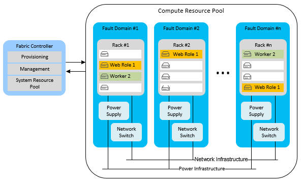
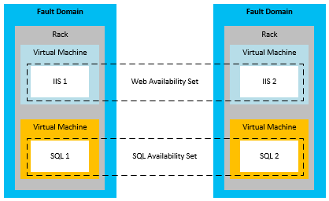
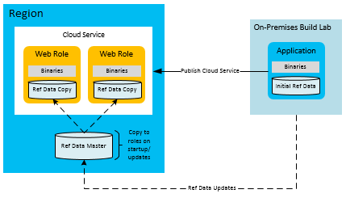
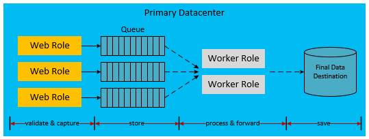

<properties
   pageTitle="Hohe Verfügbarkeit für Applikationen Azure | Microsoft Azure"
   description="Technische Übersicht und ausführliche Informationen zum Entwerfen und Erstellen von hohen Verfügbarkeit auf Microsoft Azure."
   services=""
   documentationCenter="na"
   authors="adamglick"
   manager="saladki"
   editor=""/>

<tags
   ms.service="resiliency"
   ms.devlang="na"
   ms.topic="article"
   ms.tgt_pltfrm="na"
   ms.workload="na"
   ms.date="08/18/2016"
   ms.author="aglick"/>

#Hohe Verfügbarkeit bei Microsoft Azure

Eine hoch verfügbare Anwendung übernimmt Fluktuationen unter Verfügbarkeit, laden und temporäre Fehler in abhängige Dienste und Hardware. Die Anwendung wird zu einer zulässigen Benutzer und systematische Antwort Ebene arbeitet weiter, Business Anforderungen oder Anwendung Service Level Agreements (SLAs) definiert.

##Azure Funktionen für hohe Verfügbarkeit

Azure wartet mit zahlreichen integrierte Plattformfunktionen, die hoch verfügbare Anwendungen zu unterstützen. In diesem Abschnitt werden einige der die wichtigsten Features beschrieben. Eine umfassendere Analyse der Plattform finden Sie unter [Azure Stabilität technische Anleitung](./resiliency-technical-guidance.md).

###Fabric controller

Der Azure-Struktur Controller Vorschriften und überwacht die Bedingung der Instanzen Azure berechnen. Der Fabric Controller überprüft den Status der Hardware und Software der Instanzen Computer Host und Gast. Wenn einen Fehler erkannt wird, erzwingt es SLAs durch automatisches Verschieben von der Instanzen virtueller Computer. Des Konzepts der weiteren Fehlerstrukturanalyse und der Upgradeeinstellungen Domänen unterstützt der Vereinbarung zum SERVICELEVEL berechnen.

Wenn mehrere Instanzen der Cloud-Dienst Rolle bereitgestellt werden, bereitstellt Azure diese Instanzen zu anderen Fehlerstrukturanalyse Domänen aus. Grenze ein Fehler ist im Grunde eine andere Hardware den Shapes für Gestelle in derselben Region. Fehlerstrukturanalyse-Domänen verringern Sie die Wahrscheinlichkeit, dass ein Hardwarefehler lokalisierten Unterbrechen des Diensts der Anwendung wird. Sie können nicht die Anzahl der Fehlerstrukturanalyse-Domänen verwalten, die Ihre Arbeitskollegen oder Webrollen zugewiesen sind. Der Fabric Controller verwendet dedizierte Ressourcen, die getrennt von Applications Azure gehostet sind. Es hat 100 Prozent Verfügbarkeit, da es als dem der Kern des Systems Azure fungiert. Es Überwachung und Verwaltung von Rolleninstanzen über Fehlerstrukturanalyse Domänen.

Das folgende Diagramm veranschaulicht Azure freigegebenen Ressourcen der Fabric Controller bereitstellt und in anderen Fehlerstrukturanalyse-Domänen verwaltet werden.

Upgrade Domänen Fehlerstrukturanalyse-Domänen in der Funktion ähneln, aber unterstützten Upgrades statt Fehlern. Eine Upgrade Domäne ist eine logische Einheit Instanz Trennung, der festlegt, welche Instanzen in einen bestimmten Dienst zu einem bestimmten Zeitpunkt aktualisiert werden sollen. Für die Bereitstellung gehosteten Dienst standardmäßig werden die fünf Upgrade Domänen definiert. Allerdings können Sie diesen Wert in der Definition Dienstdatei ändern. Angenommen Sie, dass Sie acht Instanzen von Ihrer Webrolle haben. Es werden zwei Instanzen in drei Upgrade Domänen und zwei Instanzen in einem Upgrade Domäne. Azure definiert Sequenz für die Aktualisierung, aber alle Instanzen basieren auf die Anzahl der Upgrade Domänen. Weitere Informationen zum Upgrade Domänen finden Sie in der [Cloud-Dienst aktualisieren](../cloud-services/cloud-services-update-azure-service.md).

###Features, die in anderen Diensten

Zusätzlich zu den Plattformfeatures, die Verfügbarkeit von hoher berechnen unterstützen, eingebettet Azure Funktionen für hohe Verfügbarkeit in deren andere Dienste. Azure-Speicher verwaltet z. B. drei Replikate aller Blob, Tabelle und Warteschlangendaten. Sie können auch die Möglichkeit zum Speichern von Sicherungen Blobs und Tabellen in einer sekundären Region Geo-Replikation. Beim Azure Content Delivery Network ermöglicht Blobs auf der ganzen Welt für Redundanz und Skalierbarkeit zwischengespeichert werden. Azure SQL-Datenbank verwaltet auch mehrere Replikate.

Zusätzlich zu den [technischen Leitfaden Stabilität](https://aka.ms/bctechguide) Reihe von Artikeln finden Sie unter [Bewährte Methoden für den Entwurf von Scale Services für Azure Cloud Services](https://azure.microsoft.com/blog/best-practices-for-designing-large-scale-services-on-windows-azure/) Papier. Diese Paper bereitstellen eine tiefere Diskussion von Features für die Verfügbarkeit von Azure-Plattform.

Obwohl Azure mehrere Features, die hohen Verfügbarkeit unterstützen enthält, ist es wichtig zu verstehen, deren Einschränkungen:

- Für den Bereich Computing garantiert Azure an, dass Ihre Rollen sind verfügbar und ausgeführt werden, aber es weiß nicht, wenn die Anwendung laufenden oder überlastet ist.
- Für SQL Azure-Datenbank werden die Daten in der Region synchron repliziert. Sie können bis zu vier zusätzliche Datenbankkopien in der gleichen Region (oder verschiedener Regionen) ermöglicht active Geo-Replikation auswählen. Diese Datenbankreplikaten sind keine Point-in-Time Sicherungskopien. SQL-Datenbanken bieten zusätzliche Point-in-Time-Funktionen. Lesen Sie weitere Informationen zu Funktionen, die SQL-Datenbank-Zeitpunkt [Azure SQL-Datenbank, zeigen in Zeit wiederherstellen](https://azure.microsoft.com/blog/azure-sql-database-point-in-time-restore/).
- Für Azure-Speicher werden Tabelle und Blob-Daten zu einer alternativen Region standardmäßig repliziert. Sie können jedoch nicht die Replikate zugreifen, bis Microsoft wählt über zu der Website alternative fehlschlägt. Eine Region ausgeführt wird nur bei einer längeren Region organisationsweite dienststörung, und es wird keine Vereinbarung zum SERVICELEVEL für Geo-Failoverzeit. Es ist auch zu beachten, dass Datenfehlern schnell auf die Replikate verteilt.

Aus diesen Gründen müssen Sie Features für die Verfügbarkeit Plattform mit anwendungsspezifische Verfügbarkeitsfeatures ergänzen. Anwendungsspezifische Verfügbarkeitsfeatures gehören die Blob Snapshot-Funktion, um Point-in-Time Sicherungen BLOB-Daten zu erstellen.

###Verfügbarkeit legt für Azure virtuellen Computern

Die meisten in diesem Artikel befasst sich mit Cloud-Diensten, die eine Plattform als Servicemodell (PaaS) verwenden. Es gibt jedoch auch die von bestimmter Verfügbarkeitsfeatures für Azure virtuellen Computern, die eine Infrastruktur als Modell Service (IaaS) verwendet. Um hohe Verfügbarkeit mit virtuellen Computern zu erreichen, müssen Sie die Verfügbarkeit von Mengen verwenden. Eine Sammlung Verfügbarkeit fungiert eine ähnliche Funktion Fehlerstrukturanalyse und der Upgradeeinstellungen Domänen. Innerhalb eines Satzes Verfügbarkeit positioniert Azure den virtuellen Computern auf eine Weise, die verhindert, dass lokalisierten Hardware-Fehlern und Wartungsaktivitäten Deaktivierung auf alle Computer in dieser Gruppe. Verfügbarkeit Sätze müssen der Azure Vereinbarung zum SERVICELEVEL für die Verfügbarkeit von virtuellen Computern zu erzielen.

Das folgende Diagramm enthält eine Darstellung von zwei Verfügbarkeit dieser Gruppe Web und SQL Server-virtuellen Computern Hilfethemas.

>[AZURE.NOTE] In der obigen Abbildung ist SQL Server auf virtuellen Computern installiert und ausgeführt. Dies unterscheidet sich von der vorherigen Diskussion Azure SQL-Datenbank, die eine Datenbank als verwalteter Dienst bereitstellt.

##Anwendung Strategien für hohe Verfügbarkeit

Die meisten Anwendung Strategien für hohe Verfügbarkeit umfassen Redundanz oder das Entfernen von harte Abhängigkeiten zwischen Anwendungskomponenten. Anwendungsentwurf sollte Fehlertoleranz während gelegentliche Ausfall eines Azure oder Drittanbieter-Dienste unterstützen. Den folgenden Abschnitten werden die Anwendung Muster zum Erhöhen der Verfügbarkeit von Ihrer Clouddienste.

###Asynchrone Kommunikation und dauerhaften Warteschlangen

Erwägen Sie asynchrone Kommunikation zwischen lose verknüpften Diensten, Verfügbarkeit in Azure Applications zu erhöhen. Schreiben Sie in diesem Muster Nachrichten entweder Speicher Warteschlangen oder Azure Servicebuswarteschlangen für eine spätere Verarbeitung aus. Wenn Sie die Nachricht in der Warteschlange schreiben, zurückgegeben Steuerung sofort an den Absender der Nachricht. Eine weitere Ebene von der Anwendung übernimmt die Nachricht verarbeiten, in der Regel als eine Worker-Rolle implementiert. Wenn Worker-Rolle fällt aus, sammeln sich die Nachrichten in der Warteschlange, bis der Verarbeitungsdienst wiederhergestellt wurde. Solange die Warteschlange zur Verfügung steht, gibt es keine direkte Abhängigkeit zwischen dem Front-End-Absender und die Nachrichtenprozessor. Dadurch wird die Notwendigkeit Synchroner Dienst-Anrufe, die Durchsatzengpass in Clientanwendungen verteilt werden können.

Eine Variation dieses wird als Speicherort Failover für Anrufe fehlerhaften Datenbank Azure-Speicher (Blobs, Tabellen, Warteschlangen) oder Servicebuswarteschlangen verwendet. Beispielsweise schlägt wiederholt Gespräch synchroner innerhalb einer Anwendung an einen anderen Dienst (wie etwa SQL Azure-Datenbank). Sie können die Daten in dauerhaften Speicher Serialisieren möglicherweise. Zu einem späteren Zeitpunkt, wenn der Dienst oder die Datenbank wieder online ist, kann die Anwendung die Anforderung von Speicher Senden erneut. Die Differenz in diesem Modell ist, dass die mittlere Position keinem Konstanten Teil des Workflows Anwendung. Es ist nur in Szenarios verwendet.

In beiden Szenarien verhindern, dass die asynchrone Kommunikation und temporäre Speicherung einen stillgelegte Back-End-Dienst Deaktivierung der gesamten Anwendungs. Warteschlangen dienen als logische Zwischenbenutzer. Weitere Hilfe bei den richtigen Warteschlangen-Dienst auswählen finden Sie unter [Azure Warteschlangen und Azure Servicebuswarteschlangen – verglichen und bereitstehen](../service-bus-messaging/service-bus-azure-and-service-bus-queues-compared-contrasted.md).

###Fehlerstrukturanalyse-Erkennung und "Wiederholen" Logik

Ein wichtiger Punkt in der Entwurfsansicht mit hoher Verfügbarkeit Anwendung besteht darin, verwenden "Wiederholen" Logik in Code zu einen Dienst ordnungsgemäß behandelt werden, der vorübergehend ausgefallen ist. Die [Vorübergehende Fehlerstrukturanalyse Handling Application Block](https://msdn.microsoft.com/library/hh680934.aspx), entwickelt von der Microsoft Patterns and Practices-Team unterstützt Entwickler in diesem Prozess. Das Wort "vorübergehend" bedeutet ein vorübergehendes Problem, das nur für eine relativ kurze Zeit dauert. Im Kontext dieses Artikels ist Behandeln von vorübergehende Fehler Teil bei der Entwicklung einer hoch verfügbaren Anwendungs aus. Beispiele für vorübergehende Zustände sind Netzwerkprobleme Fehler und Datenbankverbindungen verloren.

Die vorübergehende Fehlerstrukturanalyse Handling Application Block ist eine vereinfachte Möglichkeit, Fehler innerhalb des Codes ein schrittweises zu behandeln. Sie können Sie um die Verfügbarkeit von Ihrer Anwendung zu verbessern, indem Sie robuste vorübergehende Fehlerbehandlungslogik hinzufügen. In den meisten Fällen Logik Wiederholungsversuche kurze Unterbrechung verarbeitet und erneut eine Verbindung herstellt Absender und Empfänger nach mindestens eine fehlgeschlagene Versuche. Ein Versuch erfolgreich "Wiederholen" wird in der Regel wesentlich auffälliger an Anwendungsbenutzer gesendet.

Entwickler haben Sie drei Optionen für die Verwaltung von deren Logik Wiederholungsversuche: inkrementell, feste Intervall und exponentiellen. Inkrementell wartet wiederholen mehr vor jeder in einer zunehmenden linear bis (z. B. 1, 2, 3 und 4 Sekunden). Feste Intervall wartet die gleiche Zeitdauer zwischen den einzelnen "Wiederholen" (z. B. 2 Sekunden). Eine weitere zufällige Option wartet der exponentiellen Back-off mehr zwischen Wiederholungsversuche. Es verwendet jedoch exponentiellen Verhalten (z. B. 2, 4, 8 und 16 Sekunden).

Die Strategie innerhalb des Codes lautet:

1. Definieren Sie Ihre Strategie "Wiederholen" und die Richtlinie ein.
1. Führen Sie den Vorgang, der in eine vorübergehende Fehlerstrukturanalyse möglicherweise ein.
1. Wenn vorübergehende Fehler auftritt, rufen Sie die Richtlinie "Wiederholen" aus.
1. Wenn alle Versuche fehlschlagen, fangen Sie eine endgültige Ausnahme aus.

Testen Sie Ihre Logik Wiederholungsversuche in simulierten Fehlern, um sicherzustellen, dass nicht Wiederholungsversuche auf aufeinander folgende Vorgänge eine unvorhergesehene längeren Verzögerung führen. Bevor Sie sich entscheiden, die gesamte Aufgabe fehlschlägt Aktion.

###Verweis Datenmuster für hohen Verfügbarkeit

Daten Bezug ist der schreibgeschützte Daten einer Anwendung. Diese Daten enthält, im Business Kontext, in dem die Anwendung Transaktionen Daten im Verlauf eines Vorgangs Business generiert, wird. Transaktionen Daten ist eine Point-in-Time-Funktion Verweis Daten. Daher hängt von deren Integrität der Momentaufnahme der Daten Bezug zum Zeitpunkt der Transaktion. Dies ist eine etwas an Definition, aber es in den meisten Fällen für unsere Zwecke hier.

Bezug der Daten im Kontext einer Anwendung ist für das Funktionieren der Anwendung erforderlich. Die jeweiligen Applications erstellen und Verwalten von Daten Bezug; Master Daten Management (MDM) Systeme ausführen häufig diese Funktion. Diese Systeme, die zum Ende des Lebenszyklus der Daten Bezug verantwortlich sind. Beispiele für Verweisdaten sind Produktkatalog, Mitarbeiter Master, Webparts Master und Ausrüstung Master-Shape. Verweisdaten können auch stammen aus außerhalb der Organisation, beispielsweise Postleitzahlen oder Steuersätzen. Strategien für die Verfügbarkeit von Daten Bezug zunehmender sind in der Regel kleiner als die für Transaktionen Daten schwierig. Daten Bezug hat den Vorteil, hauptsächlich unveränderlich.

Sie können Azure Web- und Worker Rollen vornehmen, die Verweisdaten zur Laufzeit eigenständigen nutzen, indem Sie die Daten zusammen mit der Anwendung. Wenn die Größe des lokalen Speicher eine solche Bereitstellung zulässt, ist dies eine ideale Bundesstaat aus. Eingebettete Datenbanken (SQL, NoSQL) oder XML-Dateien befinden, die auf einem lokalen Dateisystem helfen der Autonomie von Azure berechnen Maßeinheiten. Müssen Sie jedoch ein Verfahren zum Aktualisieren der Daten in jeder Rolle, ohne dass für die erneute Bereitstellung. Platzieren Sie hierzu alle Updates auf die Daten Bezug zu einem Cloud-Speicher-Endpunkt (z. B. Azure Blob-Speicher oder SQL-Datenbank). Fügen Sie für jede Rolle, die die Aktualisierung von Daten in die Datenverarbeitungsknoten Rolle Systemstart downloads Code ein. Fügen Sie alternativ Code, die ein Administrator einen erzwungenen Download Instanzen Rolle ausführen kann.

Zum Erhöhen der Verfügbarkeit sollte die Rollen auch eine Reihe von Bezug Daten enthalten, für den Fall, dass Speicher nicht verfügbar ist. Dadurch wird die Rollen aus, um mit einem einfachen Satz von Daten Bezug zu starten, bis die Speicherressource für die Updates verfügbar ist.

Ein Aspekt für dieses Muster ist die Bereitstellung und Start Geschwindigkeit für Ihre Rollen. Wenn Sie bereitstellen oder Herunterladen große Datenmengen Bezug auf Start, kann diese die Zeitdauer erhöhen, die benötigt wird, um nach neuen Bereitstellungen oder Rolleninstanzen drehen. Dies möglicherweise ein akzeptabler Kompromiss für eine der unabhängige der Probleme sofort verfügbaren Daten Bezug auf jede Rolle statt Abhängigkeit von externen Speicherdienste suchen.

###Transaktionen Datenmuster für hohen Verfügbarkeit

Transaktionen Daten sind die Daten, die die Anwendung in einem Kontext Business generiert. Transaktionen Daten ist eine Kombination aus den Satz von Geschäftsprozessen, die die Anwendung implementiert und die Verweisdaten, die diese Prozesse unterstützt. Beispiele für Transaktionen Daten können Bestellungen, erweiterte Versand Hinweise, Rechnungen und Kunden Beziehung (Relationship Management) Verkaufschancen sind. Die Transaktionen Daten daher generiert werden für externe Systeme für Eintrag planmäßigen oder für die weitere Verarbeitung "Herd".

Orientieren Sie diesen Verweis, die Daten in den Hilfesystemen ändern können, die für diese Daten zuständig sind. Daher müssen Transaktionen Daten im Kontext der Bezug Point-in-Time-Daten speichern, so, dass sie minimale externe Abhängigkeiten für seine semantische Konsistenz. Betrachten Sie beispielsweise die Deinstallation eines Produkts aus dem Katalog ein paar Monate nach dem Ordnung erfüllt ist. Die bewährte Methode ist an, wie viel Bezug Datenkontext wie möglich in die Transaktion einzubetten. Dadurch wird die Semantik der Transaktion zugeordnet beibehalten, selbst wenn die Daten Bezug ändert, nachdem die Transaktion erfasst wird.

Wie zuvor schon erwähnt, eignen Architekturen Kopplung und asynchrone Kommunikation verwenden, die sich zu einer höheren Verfügbarkeit. Dies gilt für Transaktionen Daten auch, aber die Implementierung ist komplexer. Traditionelle Transaktionen Konzepte aufsetzen in der Regel für die Datenbank für die Transaktion garantiert. Wenn Sie zwischen-XT für Ebenen vorstellen, muss Code der Anwendung die Daten auf verschiedenen Ebenen ausreichend Konsistenz und Zuverlässigkeit sicherstellen ordnungsgemäß behandeln.

Die folgende Schrittfolge beschreibt einen Workflow, der die Aufzeichnung der Transaktionen Daten von deren Verarbeitung trennt:

1. Web berechnen Knoten: präsentieren verweisen auf Daten.
1. Externe Speicher: zwischen-XT für Transaktionen Daten speichern.
1. Web berechnen Knoten: die Endbenutzer Transaktion abzuschließen.
1. Web berechnen Knoten: senden die fertigen Transaktionen Daten zusammen mit dem Kontext Bezug Daten in den temporären dauerhaften Speicher, die garantiert Reaktionen vorhersehbar erteilen.
1. Web berechnen Knoten: Signal vom Endbenutzer Abschluss der Transaktion.
1. Hintergrund Knoten zu berechnen: die Transaktionen Daten extrahieren, nach dem bei Bedarf verarbeiten und senden Sie diese an ihrem endgültigen Speicherort im aktuellen System.

Das folgende Diagramm zeigt eine mögliche Implementierung dieses Entwurfs in einer Azure gehostete Cloud-Dienst an.

Geben Sie die gestrichelte Pfeile im vorherigen Diagramm asynchrone Verarbeitung an. Die Front-End-Web-Rolle ist keine dieser asynchrone Verarbeitung bekannt. Dadurch die Speicherung der Transaktion an seinem endgültigen Ziel mit Verweisen auf dem aktuellen System. Aufgrund der Wartezeit, die diese asynchrone Modell eingeführt wird, sind die Transaktionen Daten nicht sofort für Abfrage zur Verfügung. Daher muss jede Einheit Transaktionen Daten in einem Cache gespeichert werden, oder eine Sitzung Benutzer, die die Benutzeroberfläche sofortige stattfinden muss.

Die Webrolle ist eigenständigen gegenüber dem Rest der Infrastruktur. Die Verfügbarkeitsprofil ist eine Kombination der Webrolle und Azure Warteschlange und nicht die gesamte Infrastruktur. Zusätzlich zur hohen Verfügbarkeit ermöglicht dieser Ansatz die Web-Rolle horizontal, unabhängig von der Back-End-Speicher skalieren. Dieses Modell hoher Verfügbarkeit kann sich auf die Wirtschaftlichkeit von JOIN-Operationen auswirken. Weitere Komponenten wie Azure Warteschlangen und Worker-Rollen können monatliche Verwendung Kosten auswirken.

Beachten Sie, dass im vorherige Diagramm eine Implementierung von dieser Entkoppelter Ansatz Transaktionen Daten werden. Es gibt viele andere möglichen Implementierungen. Die folgende Liste enthält einige Alternativen:

 * Eine Worker-Rolle möglicherweise zwischen die Web-Rolle und der Speicherwarteschlange platziert werden.
 * Eine Warteschlange Dienstbus kann anstelle einer Warteschlange Azure-Speicher verwendet werden.
 * Das endgültige Ziel möglicherweise Azure-Speicher erfüllen oder eine andere Datenbank.
 * Azure Cache kann bei der Web-Ebene verwendet werden, um die sofortigen Zwischenspeichern Anforderungen nach der Transaktion bereitzustellen.

###Skalierbarkeit Mustern

Es ist wichtig, beachten Sie, dass der Skalierbarkeit Cloud-Dienst direkt auf die Verfügbarkeit. Höhere Auslastung bewirkt, dass den Dienst nicht mehr reagiert, ist der Benutzer Eindruck, dass die Anwendung nach unten. Führen Sie bewährte Methoden für Skalierbarkeit basierend auf der erwarteten Anwendung laden und zukünftigen rechnen. Die höchste Skala umfasst viele Aspekte, wie etwa die Verwendung von einzelne oder mehrere Speicherkonten in mehreren Datenbanken freigeben und Strategien Zwischenspeichern. Im Detail dieser Muster finden Sie unter [Bewährte Methoden für den Entwurf von Scale Services für Azure Cloud Services](https://azure.microsoft.com/blog/best-practices-for-designing-large-scale-services-on-windows-azure/).

##Nächste Schritte

Dieser Artikel ist Teil einer Reihe von Artikeln [Wiederherstellung und hohe Verfügbarkeit bei Microsoft Azure](./resiliency-disaster-recovery-high-availability-azure-applications.md)dienten. Im nächsten Artikel in dieser Reihe ist [Wiederherstellung bei Microsoft Azure](./resiliency-disaster-recovery-azure-applications.md).
