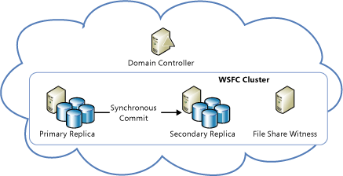

<properties
   pageTitle="Technische Anleitung: Wiederherstellung aus lokalen Fehlern in Azure | Microsoft Azure"
   description="Artikel auf Grundlegendes zu und robuste, hoher Verfügbarkeit entwerfen, Fehlertoleranz Anwendungen, als auch für lokale Fehler in Azure dienten Wiederherstellung planen."
   services=""
   documentationCenter="na"
   authors="adamglick"
   manager="saladki"
   editor=""/>

<tags
   ms.service="resiliency"
   ms.devlang="na"
   ms.topic="article"
   ms.tgt_pltfrm="na"
   ms.workload="na"
   ms.date="08/18/2016"
   ms.author="aglick"/>

#Azure Stabilität technischen Leitfaden: Wiederherstellung aus lokalen Fehlern in Azure

Es gibt zwei primäre Risiken für die Verfügbarkeit der Anwendung:

* Der Fehler von Geräten, wie z. B. Laufwerke und Server
* Wichtige Ressourcen, wie beispielsweise berechnen unter Belastung Höchstwert Vorgang

Azure stellt eine Kombination von Ressourcenmanagement, Elastizität, den Lastenausgleich und Einheit hohen Verfügbarkeit unter diesen Umständen aktivieren. Einige dieser Features werden automatisch für alle Azure Services ausgeführt werden. In einigen Fällen muss Entwickler jedoch einige zusätzliche Arbeit an eine andere von ihnen profitieren kann.

##Cloud-Dienste

Azure Cloud Services besteht aus Sammlungen von einer oder mehreren Web oder Arbeitskollegen Rollen. Eine oder mehrere Instanzen einer Rolle können gleichzeitig ausgeführt werden. Die Konfiguration bestimmt die Anzahl der Instanzen. Rolleninstanzen überwacht und verwaltet werden, eine Komponente den Fabric Controller bezeichnet. Der Fabric Controller erkennt und reagiert auf Hardware und Software Fehlern automatisch.

Jede Instanz der Rolle ausgeführt wird in einem eigenen virtuellen Computern (virtueller Computer) und kommuniziert mit seiner Fabric Controller über einen Agent Gast. Der Gast Agent sammelt Ressourcen- und Knoten Kennzahlen, einschließlich virtueller Computer Verwendung, Status, Protokolle, Ressource: Einsatz hinzu, Ausnahmen und Fehler an. Der Fabric Controller fragt der Gast-Agent konfigurierbare Intervallen und dem Neustart den virtuellen Computer wird, wenn der Gast Agent nicht reagiert. Ausfall der Hardware der zugeordneten Fabric Controller bewegt sich alle betroffenen Rolleninstanzen zu einem neuen Hardware-Knoten und im Netzwerk für die Weiterleitung Verkehr es neu.

Um diese Features nutzen zu können, sollten die Entwickler sicherstellen, dass alle Dienstverwaltungsrollen vermeiden Sie das Speichern von Status für die Rolleninstanzen. In diesem Fall sollte alle permanente Daten aus dauerhaften Speicher, wie etwa Azure Storage oder SQL Azure-Datenbank zugegriffen werden. Dadurch werden alle Rollen, Anfragen zu behandeln. Dies bedeutet auch, dass Rolleninstanzen zu einem beliebigen Zeitpunkt springen können nach unten ohne Inkonsistenzen in den vorübergehenden oder permanenten Zustand des Diensts erstellen.

Mehrere wirkt sich die Anforderung, die die Rollen extern Zustand gespeichert. Es impliziert, z. B., dass alle zugehörige Änderungen an einer Azure-Speicher-Tabelle in einer einzigen Transaktion Entität-Gruppe, falls möglich geändert werden soll. Natürlich nicht immer möglich, nehmen Sie alle Änderungen in einer einzigen Transaktion. Machen Sie unbefugtem Zugriff sicherstellen, dass die Rolle Instanz Fehlern keine Probleme verursachen, wenn sie zeitintensive Vorgänge unterbrechen, die mindestens zwei Updates an den beständigen Zustand des Diensts umfassen. Wenn eine andere Rolle versucht, einen solcher Vorgang zu wiederholen, muss erwarten und helfen den Fall, in dem die Arbeit teilweise abgeschlossen wurde.

Betrachten Sie beispielsweise einen Dienst, der teilt den Daten in mehreren speichern aus. Wenn eine Worker-Rolle geht ab, während sie einen Shard Verschieben von ist, möglicherweise nicht die Verlagerung von der Shard beendet. Oder die Verlagerung möglicherweise durch eine andere Worker-Rolle, sodass verwaiste Daten oder Beschädigung der Daten aus der Einführung wiederholt werden. Wenn Probleme verhindern möchten, muss zeitintensive Vorgänge eine oder beide der folgenden Aktionen aus:

 * *Idempotent*: ohne Effekte Seite wiederholt. Um Idempotent sein, sollte ein langer Vorgang unabhängig davon, wie oft die gleiche Wirkung haben, wenn es ausgeführt wird, auch wenn sie während der Ausführung unterbrochen ist.
 * *Inkrementell neu gestartet*: nach zum letzten Zeitpunkt des Fehlers fortgesetzt werden können. Um inkrementell neu gestartet werden, sollte ein langer Vorgang eine Abfolge von kleineren atomare Vorgänge bestehen. Es sollte auch deren Status im dauerhaften Speicher zeichnen, sodass jeder nachfolgenden Aufrufen, wird der Rückkehr Stelle, an der Vorgänger beendet.

Schließlich sollte alle zeitintensive Vorgänge wiederholt aufgerufen werden, bis er erfolgreich ausgeführt werden kann. Beispielsweise ein provisioning Vorgang möglicherweise in einer Azure Warteschlange platziert, und dann durch eine Worker-Rolle aus der Warteschlange entfernt nur, wenn sie erfolgreich ist. Garbagecollection möglicherweise erforderlich, Bereinigen von Daten, die Vorgänge unterbrochen zu erstellen.

###Elastizität

Die ursprüngliche Anzahl der Instanzen für jede Rolle ausgeführt wird jede Rolle der Konfiguration bestimmt. Administratoren sollten anfangs jede Rolle zum Ausführen von mit zwei oder mehr Instanzen in Bezug auf erwartete Last konfigurieren. Aber Sie können ganz einfach Rolleninstanzen von skalieren oder nach unten unter Verwendung Muster ändern. Sie können dies manuell vornehmen, Azure-Portal, oder Sie können den Prozess mithilfe von Windows PowerShell, die Service Management-API oder Drittanbieter-Tools automatisieren. Weitere Informationen finden Sie unter [So automatisch Skalieren einer Anwendung](../cloud-services/cloud-services-how-to-scale.md).

###Partitionierung

Der Azure-Struktur Controller verwendet zwei Partitionsarten:

* Eine *Domäne aktualisieren* dient zum Aktualisieren des Diensts Rolleninstanzen in Gruppen. Azure bereitstellt Dienstinstanzen in mehreren Update Domänen. Der Fabric Controller für eine Aktualisierung in-situ bringt alle Instanzen in einem einzigen Update Domain, aktualisiert, und dann vor dem Verschieben in den nächsten Domäne aktualisieren neu. Dieser Ansatz verhindert den gesamten Dienst nicht verfügbar für die Aktualisierung auswählen.
* *Fehlerstrukturanalyse-Domäne* definiert potenzielle Points of Hardware oder Netzwerk. Für alle Rollen, die mehr als eine Instanz enthält,: der Fabric Controller damit ist sichergestellt, dass mehrere Fehlerstrukturanalyse-Domänen, um zu verhindern, dass isoliert Hardware-Fehlern Unterbrechung des Dienstes die Instanzen verteilt werden. Fehlerstrukturanalyse-Domänen Aufsicht Server und Cluster Fehlern alle anzeigen.

[Azure Service Level Agreement (Vereinbarung zum SERVICELEVEL)](https://azure.microsoft.com/support/legal/sla/) garantiert, wenn zwei oder mehr Instanzen von Web-Rolle zu anderen Fehlerstrukturanalyse bereitgestellt werden und Aktualisieren von Domänen, diese externe Konnektivität mindestens 99,95 Prozent der Zeit haben. Im Gegensatz zu Domänen aktualisieren gibt es Möglichkeit keine zum Steuern der Anzahl der Fehlerstrukturanalyse-Domänen. Azure automatisch zuweist Fehlerstrukturanalyse-Domänen und verteilt die Rolleninstanzen auf diese. AT mindestens die ersten beiden Instanzen der jeder Rolle in verschiedenen Fehlerstrukturanalyse gesetzt und Aktualisieren von Domänen, um sicherzustellen, dass alle Rolle mit mindestens zwei Instanzen der Vereinbarung zum SERVICELEVEL erfüllen wird. Dies wird in der folgenden Abbildung dargestellt.

###Lastenausgleich

Alle eingehenden Verkehr zu einer Webrolle durchläuft ein statusfreie Lastenausgleich, die Client-Anfragen für Rolleninstanzen verteilt. Einzelne Instanzen haben keine öffentliche IP-Adressen, und sie nicht direkt aus dem Internet adressiert sind. Webrollen sind statusfrei, damit alle Clientanforderung an eine Instanz der Rolle weitergeleitet werden kann. Ein Ereignis [StatusCheck](https://msdn.microsoft.com/library/microsoft.windowsazure.serviceruntime.roleenvironment.statuscheck.aspx) wird alle 15 Sekunden ausgelöst. Sie können dies angeben, ob die Rolle des Datenverkehr empfangen bereit ist, oder ob es beschäftigt ist und sollten aus den Lastenausgleich Drehung unternommen werden.

##Virtuellen Computern

Azure-virtuellen Computern unterscheidet sich von Plattform, wie ein Service (PaaS) Rollen in mehreren Punkten in Bezug auf hohen Verfügbarkeit zu berechnen. In einigen Fällen müssen Sie zusätzlichen Aufwand zur Sicherstellung hohen Verfügbarkeit ausführen.

###Datenträger Zuverlässigkeit

Im Gegensatz zu PaaS Rolleninstanzen ist Daten auf virtuellen Computern Laufwerken beständigen, auch wenn des virtuellen Computers verschoben wird. Azure-virtuellen Computern verwenden virtueller Computer Datenträger, die vorhanden sind, als Blobs in Azure-Speicher. Wegen der Verfügbarkeit Eigenschaften Azure-Speicher ist auch die Daten auf Laufwerken des virtuellen Computers hoch verfügbar.

Beachten Sie, dass Laufwerk D (in Windows-virtuellen Computern) eine Ausnahme mit dieser Regel wird. Laufwerk D ist tatsächlich Speicherplatz auf den Shapes für Gestelle Servers ein, den virtuellen Computer hostet, und seine Daten verloren, wenn der virtuellen Computer wieder verwendet wird. Laufwerk D gelten nur temporäre Speicherung. Im Linux stellt Azure "normalerweise" (aber nicht immer) den lokalen temporären Datenträger als /dev/sdb Block-Gerät. Es ist oft als /mnt/resource oder/mnt Bereitstellungspunkte (konfigurierbare über /etc/waagent.conf) vom Linux Agent Azure bereitgestellt.

###Partitionierung

Azure systembedingt versteht die Ebenen in einer PaaS-Anwendung (Webrolle und Worker-Rolle) und somit kann ordnungsgemäß verteilen sie auf Domänen Fehlerstrukturanalyse und aktualisieren. Die Ebenen in einer Infrastruktur als Service (IaaS) Anwendung müssen hingegen manuell über die Verfügbarkeit von Mengen definiert werden. Verfügbarkeit Sätze sind für eine Vereinbarung zum SERVICELEVEL unter IaaS erforderlich.

In der obigen Abbildung sind die Internet Information Services (IIS)-Ebene (die als Web app Ebene funktioniert) und der SQL-Ebene (die als Datenebene funktioniert) Verfügbarkeit von anderen Gruppen zugewiesen. Dadurch wird sichergestellt, dass alle Instanzen von pro Ebene Hardwareredundanz verfügen, indem Sie Verteilen von virtuellen Computern auf Fehlerstrukturanalyse Domänen und gesamte Ebenen während einer Aktualisierung nicht geöffnet werden nach unten.

###Lastenausgleich

Wenn die virtuellen Computern den Datenverkehr auf diese verteilt sein soll, müssen Sie die virtuellen Computern in einer Anwendung und Laden Saldo über einen bestimmten TCP- oder UDP-Endpunkt gruppieren. Weitere Informationen finden Sie unter [den Lastenausgleich virtuellen Computern](../virtual-machines/virtual-machines-linux-load-balance.md). Wenn die virtuellen Computern Eingaben aus einer anderen Quelle (z. B. Warteschlangenmechanismus) erhalten, ist ein Lastenausgleich nicht erforderlich. Lastenausgleich mithilfe eine einfachen integritätsprüfung bestimmt, ob den Datenverkehr an den Knoten gesendet werden soll. Es ist es möglich, erstellen Ihre eigenen Prüfpunkte anwendungsspezifische Gesundheit Kennzahlen implementieren beschrieben, die bestimmen, ob der virtuellen Computer Datenverkehr erhalten soll.

##Speicher

Azure-Speicher ist der geplanten dauerhaften Daten für Azure. Darüber Blob, Tabelle, Warteschlange und Festplattenspeicher virtueller Computer. Es verwendet eine Kombination der Replikation und der ressourcenverwaltung, um hohe Verfügbarkeit in einem einzigen Rechenzentrum bereitstellen. Die Verfügbarkeit der Azure-Speicher Vereinbarung zum SERVICELEVEL gewährleistet, dass mindestens 99,9 Prozent der Zeit:

* Ordnungsgemäß formatierten Anfragen hinzufügen, aktualisieren, lesen und Löschen von Daten erfolgreich und ordnungsgemäß verarbeitet werden.
* Speicherkonten haben die Verbindung zum Internet-Gateway.

###Replikation

Azure-Speicher erleichtert Daten Zuverlässigkeit, da mehrere Kopien von allen Daten auf verschiedenen Laufwerken über vollständig unabhängige physische Speicher Teilsystemen in der Region ein. Daten werden synchron repliziert und alle Kopien sind zugesicherte, bevor der Schreibvorgang bestätigt wird. Azure-Speicher ist stark konsistent, was bedeutet, dass liest garantiert sind, um die zuletzt schreibt wiederzugeben. Darüber hinaus werden Kopien von Daten fortlaufend gescannt, um erkennen und Reparieren Bit Rot, eine oft übersehene Bedrohung für die Integrität des gespeicherten Daten.

Services nutzbringend Replikation einfach mithilfe von Azure-Speicher. Der Dienstentwickler erforderlich nicht zusätzlichen Aufwand, um Fehler in einem lokalen wiederherzustellen.

###Ressourcenverwaltung

Nach Mai 2014, erstellte Speicherkonten können wächst auf bis zu 500 TB (das vorherige Maximum war 200 TB). Wenn Sie weiterer Speicherplatz benötigt wird, müssen Applikationen mit mehreren Speicherkonten entworfen werden.

###Datenträger virtuellen Computern

Festplatte des virtuellen Computers wird als eine Seitenblob in Azure-Speicher, indem er ihm alle dieselbe Zuverlässigkeit und Skalierbarkeit Eigenschaften als Blob-Speicher gespeichert. Dadurch ist die Daten auf der Festplatte des virtuellen Computers beständigen, auch wenn der Server mit dem virtuellen Computer schlägt fehl, und der virtuellen Computer neu werden, auf einem anderen Server gestartet muss.

##Datenbank

###SQL-Datenbank

Azure SQL-Datenbank bietet Datenbank als Dienst an. Es ist die Anwendung schnell bereitstellen, Abfrage relationale Datenbanken und Daten in einfügen. Es bietet viele der vertrauten SQL Server-Features und Funktionalität, während die Einhaltung der Hardware, Konfiguration, Patch und Stabilität abstrahiert.

>[AZURE.NOTE] Azure SQL-Datenbank bietet keine 1: 1-Feature Unstimmigkeit mit SQL Server. Es soll weist einen anderen Satz von Anforderungen – eine durchführen zu können, die eindeutig in der Cloud Applikationen (Flexible skalieren, Datenbank als Dienst geeignet weist zu verringern Wartungskosten usw.). Weitere Informationen finden Sie unter [Wählen Sie eine Cloud SQL Server-Option aus: Azure SQL (PaaS)-Datenbank oder SQL Server auf Azure-virtuellen Computern (IaaS)](../sql-database/sql-database-paas-vs-sql-server-iaas.md).

####Replikation

Azure SQL-Datenbank bietet integrierten Stabilität auf Fehler bei der Ebene des Knotens. Alle schreibt in einer Datenbank werden automatisch auf zwei oder mehr Hintergrund Knoten durch eine Quorum Commit Technik repliziert. (Der primären und sekundären mindestens eine müssen bestätigen, dass die Aktivität in der Transaktionslog geschrieben werden, bevor die Transaktion als Erfolg angesehen und gibt.) Wenn Knoten Vorgang fehlschlägt wechselt die Datenbank automatisch auf eines der sekundäre Replikate. Dadurch wird eine vorübergehende Verbindung Unterbrechung für Clientanwendungen. Daher müssen alle Azure SQL-Datenbank-Clients eine Form von vorübergehende Verbindung Behandlung implementieren. Weitere Informationen finden Sie unter [Hinweise zu bestimmten Diensten wiederholen](../best-practices-retry-service-specific.md).

####Ressourcenverwaltung

Jede Datenbank, wenn erstellt haben, wird mit einer oberen Größenlimit konfiguriert. Die aktuell verfügbare maximale Größe beträgt 1 TB (Größe, die Grenzwerte variieren basieren auf Ihrem Dienst Kategorie und finden Sie unter [Service Ebenen und Leistungsstufe des Azure SQL-Datenbanken](../sql-database/sql-database-resource-limits.md#service-tiers-and-performance-levels). Wenn Sie eine Datenbank das Größenlimit oberen Treffer, weist er zusätzliche einfügen oder aktualisieren Befehle zurück. (Abfragen und Löschen von Daten ist immer noch möglich.)

In einer Datenbank verwendet Azure SQL-Datenbank eine Struktur zum Verwalten von Ressourcen an. Verwendet jedoch anstelle eines Fabric Controller es ein Suchtopologie anrufen zu Fehlern erkennen. Jedes Replikat in einem Cluster besitzt die beiden Nachbarn und erkennt, wenn er ablaufen soll nach unten verantwortlich ist. Wenn ein Replikat nach unten wechselt, auslösen benachbarten einen Agent neu konfiguriert, um es auf einem anderen Computer neu zu erstellen. Engine begrenzungsebene werden bereitgestellt, um sicherzustellen, dass ein logischer Server nicht zu viele Ressourcen auf einem Computer verwenden oder des Computers physischen Grenzen überschreiten.

###Elastizität

Wenn die Anwendung mehr als der Grenzwert für 1 TB-Datenbank erforderlich ist, muss er einen Skalierung Ansatz implementieren. Sie skalieren mit Azure SQL-Datenbank durch die manuell Partitionierung, auch bekannt als Sharding, Daten in mehreren SQL-Datenbanken. Dieser Ansatz Skalierung bietet die Möglichkeit, nahezu linearen Kosten geometrischen Maßstab zu erzielen. Flexible Wachstum und Kapazität nach Bedarf kann mit der zusätzlichen Kosten bei Bedarf vergrößert da Datenbanken in Rechnung basierend auf der Mittelwert Originalgröße verwendet, die pro Tag gestellt werden, nicht auf die maximale mögliche Größe basiert.

##SQLServer auf virtuellen Computern

Nach der Installation von SQL Server (Version 2014 oder höher) auf Azure virtuellen Computern, können Sie die Funktionen für herkömmliche Verfügbarkeit von SQL Server nutzen. Diese Features gehören AlwaysOn Verfügbarkeit von Gruppen und Spiegeln von Datenbanken. Beachten Sie, dass Azure-virtuellen Computern, Speicher und Netzwerke andere funktionsspezifischen Besonderheiten als eine lokale, nicht virtualisierten IT-Infrastruktur haben. Eine erfolgreiche Implementierung von einer hohen Verfügbarkeit/Wiederherstellung (HA/DR) SQL Server-Lösung in Azure setzt voraus, dass Sie diese Unterschiede verstehen und Ihrer Lösung entwerfen, um diese zu berücksichtigen.

###Hohe Verfügbarkeit-Knoten in einem Satz Verfügbarkeit

Wenn Sie eine Lösung mit hoher Verfügbarkeit in Azure implementieren, können Sie die Verfügbarkeit festlegen in Azure platzieren Sie die Knoten hoher Verfügbarkeit in einer separaten Fehlerstrukturanalyse-Domänen und Aktualisieren von Domänen. Um deutlich zu sagen, ist die Verfügbarkeit Menge ein Azure Konzept. Es ist eine bewährte Methode, die Sie folgen sollten, um sicherzustellen, dass Ihre Datenbanken tatsächlich um hochgradig verfügbar sind, ob Sie AlwaysOn Verfügbarkeit Gruppen, Spiegeln von Datenbanken oder etwas anderes verwenden. Wenn Sie bewährte Methode nicht folgen, unter der Voraussetzung falsch möglicherweise, dass es sich bei Ihrem System hoch verfügbar ist. Aber tatsächlich Ihrer Knoten können alle nicht gleichzeitig, da sie auftreten, in der gleichen Fehlerstrukturanalyse-Domäne in der Region Azure platziert werden.

Diese Empfehlungen ist nicht mit Log Versand nach Bedarf. Als Disaster Wiederherstellung Feature sollten Sie sicherstellen, dass die Server in separaten Azure Regionen ausgeführt werden. Per Definition sind diese Bereiche separate Fehlerstrukturanalyse Domänen.

Für Azure Cloud Services virtuelle Computer über das klassische Portal bereitgestellt werden in der gleichen Verfügbarkeit festlegen müssen Sie diese in der gleichen Cloud-Dienst bereitstellen. Diese Einschränkung keinen virtuellen Computern bis Azure Ressourcenmanager (der aktuelle Portal) bereitgestellt. Für klassische Portal virtuellen Computern in Azure-Cloud-Dienst bereitgestellt wird, können nur Knoten in der gleichen Cloud-Dienst in demselben Satz Verfügbarkeit teilnehmen. Darüber hinaus sollten die Cloud Services-virtuellen Computern in derselben virtuelle Netzwerk, um sicherzustellen, dass diese auch nach der Reparatur Dienst ihre IP-Adressen verwalten. Dadurch wird die DNS-Update Ausbluten verhindert.

###Nur Azure-: hoher Verfügbarkeit Lösungen

Sie können eine Lösung mit hoher Verfügbarkeit für SQL Server-Datenbanken in Azure mithilfe von AlwaysOn Verfügbarkeit Gruppen oder Spiegelung Datenbank haben.

Das folgende Diagramm veranschaulicht die Architektur AlwaysOn Verfügbarkeit Gruppen auf Azure virtuellen Computern ausgeführt. Dieses Diagramm wurde aus den ausführlichen Artikel zu diesem Thema, [hohe Verfügbarkeit und Wiederherstellung für SQL Server auf Azure virtuellen Computern](../virtual-machines/virtual-machines-windows-sql-high-availability-dr.md)übernommen.

Sie können auch automatisch eine AlwaysOn Verfügbarkeit Gruppen Bereitstellung-durchgehende auf Azure-virtuellen Computern mithilfe der Vorlage AlwaysOn Azure-Portal bereitstellen. Weitere Informationen finden Sie unter [SQL Server AlwaysOn anbietet Microsoft Azure-Portal-Katalog](https://blogs.technet.microsoft.com/dataplatforminsider/2014/08/25/sql-server-alwayson-offering-in-microsoft-azure-portal-gallery/).

Das folgende Diagramm veranschaulicht die Verwendung der Datenbank Spiegelung auf Azure virtuellen Computern an. Es wurde die genaue Thema [hohe Verfügbarkeit und Wiederherstellung für SQL Server auf Azure virtuellen Computern](../virtual-machines/virtual-machines-windows-sql-high-availability-dr.md)entnommen.

>[AZURE.NOTE] Beide Architekturen erfordern einen Domänencontroller. Mit der Datenbank Spiegelung ist es jedoch möglich, Serverzertifikate verwenden, um eine Domänencontroller überflüssig.

##Andere Dienste Azure-Plattform

Anwendungen, die auf Azure aufbauen nutzbringend Plattformfunktionen zum Wiederherstellen von Lokale Fehler aus. In einigen Fällen können Sie bestimmte Aktionen zum Erhöhen der Verfügbarkeit für Ihr spezielles Szenario nutzen.

###Dienstbus

Um mit einem temporären Ausfall der Azure-Dienstbus zu verringern, erwägen Sie eine dauerhafte clientseitige Warteschlange zu erstellen. Dies verwendet vorübergehend eine Alternative, lokalen Speicher Verfahren zum Speichern von Nachrichten, die der Warteschlange Dienstbus hinzugefügt werden können. Die Anwendung kann entscheiden, wie die vorübergehend gespeicherten Nachrichten zu verarbeiten, nachdem der Dienst wiederhergestellt werden. Weitere Informationen finden Sie unter [bewährte Methoden zur Steigerung der Leistung mit Dienstbus vermittelte messaging](../service-bus-messaging/service-bus-performance-improvements.md) und [Dienstbus (Wiederherstellung)](./resiliency-technical-guidance-recovery-loss-azure-region.md#other-azure-platform-services).

###HDInsight

Die Daten, die Azure HDInsight zugeordnet ist, werden standardmäßig in Azure Blob Storage gespeichert. Azure-Speicher gibt hohe Verfügbarkeit und Zuverlässigkeit Eigenschaften für Blob-Speicher an. Die Verarbeitung von mehreren Knoten, die Hadoop MapReduce Aufträge zugeordnet ist tritt auf, klicken Sie auf eine vorübergehende Hadoop Distributed Datei System (HDFS), das bereitgestellt wird, wenn diese HDInsight erforderlich. Ergebnisse aus einem Auftrag MapReduce werden standardmäßig in Azure Blob-Speicher auch gespeichert, sodass die verarbeiteten Daten dauerhaften ist und bleibt hochgradig verfügbar, nachdem der Hadoop Cluster hat, wird. Weitere Informationen finden Sie unter [HDInsight (Wiederherstellung)](./resiliency-technical-guidance-recovery-loss-azure-region.md#other-azure-platform-services).

##Checklisten für lokale Fehler

###Cloud-Dienste

  1. Überprüfen Sie im Abschnitt Cloud Services dieses Dokuments.
  2. Konfigurieren Sie mindestens zwei Instanzen für jede Rolle.
  3. Behalten Sie Zustand in dauerhaften Speicher, die sich nicht auf Rolleninstanzen.
  4. Das Ereignis StatusCheck ordnungsgemäß zu behandeln.
  5. Umbrechen von verknüpften Änderungen in Transaktionen, falls möglich.
  6. Stellen Sie sicher, dass Worker Rolle Aufgaben Idempotent sind und neu gestartet.
  7. Fahren Sie mit Operationen aufzurufen, bis er erfolgreich ausgeführt werden kann.
  8. Erwägen Sie das automatische Skalierung Strategien.

###Virtuellen Computern

  1. Überprüfen Sie im Abschnitt virtuellen Computern dieses Dokuments.
  2. Verwenden Sie Laufwerk D nicht zum permanenten Speichern aus.
  3. Gruppieren von Computern in einer Dienstebene in einer Verfügbarkeit festlegen.
  4. Konfigurieren von Lastenausgleich und optional Prüfpunkte.

###Speicher

  1. Überprüfen Sie im Abschnitt Speicher dieses Dokuments.
  2. Verwenden Sie mehrere Speicherkonten aus, wenn die Daten oder Bandbreite Kontingente überschreitet.

###SQL-Datenbank

  1. Überprüfen des SQL-Datenbank im Abschnitts dieses Dokuments.
  2. Implementieren einer Richtlinie "Wiederholen", um vorübergehende Fehler zu behandeln.
  3. Verwenden Sie Partitionierung/Sharding als eine Strategie skalieren möchten.

###SQLServer auf virtuellen Computern

  1. Überprüfen von SQL Server auf virtuellen Computern Abschnitt dieses Dokuments.
  2. Befolgen Sie die vorherigen Ratschläge für virtuelle Computer aus.
  3. Verwenden Sie SQL Server hohen Verfügbarkeit von Features wie AlwaysOn.

###Dienstbus

  1. Überprüfen Sie im Abschnitt Dienstbus dieses Dokuments.
  2. Erwägen Sie das Erstellen einer dauerhaften clientseitige Warteschlange als Sicherung.

###HDInsight

  1. Überprüfen Sie im Abschnitt HDInsight dieses Dokuments.
  2. Es sind keine zusätzliche Verfügbarkeit Schritte für lokale Fehler erforderlich.

##Nächste Schritte

Dieser Artikel ist Teil einer Serie [Azure Stabilität technischen Leitfaden](./resiliency-technical-guidance.md)dienten. Im nächsten Artikel in dieser Reihe ist [Wiederherstellung aus einer Region organisationsweite dienststörung](./resiliency-technical-guidance-recovery-loss-azure-region.md).
