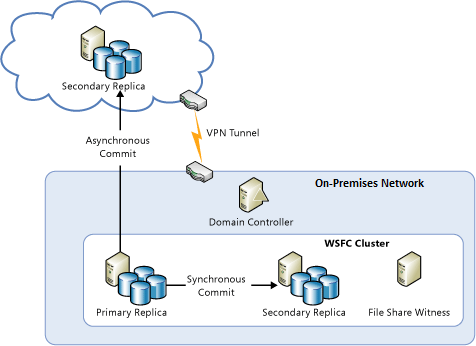
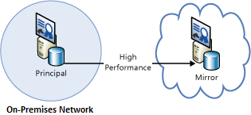

<properties
   pageTitle="Technische Anleitung: Wiederherstellung aus lokalen in Azure | Microsoft Azure"
   description="Grundlegendes zu und Erstellen eines Konzepts Wiederherstellung Systeme aus lokalen Infrastruktur in Azure Artikel"
   services=""
   documentationCenter="na"
   authors="adamglick"
   manager="saladki"
   editor=""/>

<tags
   ms.service="resiliency"
   ms.devlang="na"
   ms.topic="article"
   ms.tgt_pltfrm="na"
   ms.workload="na"
   ms.date="08/18/2016"
   ms.author="aglick"/>

#Azure Stabilität technischen Leitfaden: Wiederherstellung aus lokalen in Azure

Azure bietet eine umfassende Reihe von Services für die Erweiterung einer lokalen Datencenters in Azure Gründen der hohen Verfügbarkeit und Disaster Wiederherstellung aktivieren:

* __Networking__: mit ein virtuelles privates Netzwerk, erweitern Sie sicher Netzwerks lokal in der Cloud.
* __Berechnen__: Kunden mit Hyper-V lokalen können "heben Sie und UMSCHALT" vorhandenen virtuellen Computern (virtuellen Computern) Azure.
* __Speicher__: StorSimple erweitert Dateisystem auf Azure-Speicher. Die Sicherung Azure Service stellt die Sicherung für Dateien und SQL-Datenbanken in den Azure-Speicher.
* __Datenbankreplikation__: mit SQL Server 2014 (oder höher) Verfügbarkeit Gruppen, können Sie für Ihre Daten lokal hohen Verfügbarkeit und Disaster Wiederherstellung implementieren.

##Netzwerke

Azure-virtuellen Netzwerk können Sie einen Abschnitt logisch isolierten in Azure erstellen und sichere Verbindung zu Ihrem lokalen Datacenter oder einem einzelnen Clientcomputer mithilfe einer IPSec-Verbindungs. Mit virtuellen Netzwerk können Sie die Infrastruktur skalierbare, bei Bedarf in Azure nutzen während der Verbindung zu Daten und Applikationen lokalen, einschließlich Computern unter Windows Server, Mainframecomputer und UNIX. Weitere Informationen finden Sie unter [Azure networking Dokumentation](../virtual-network/virtual-networks-overview.md) .

##Berechnen

Wenn Sie Hyper-V lokal verwenden, können Sie "heben Sie und UMSCHALT" vorhandenen virtuellen Computern in Azure und -Dienstanbieter WindowsServer 2012 (oder höher) ausführen, ohne in den virtuellen Computer verwandelt hat machen oder konvertieren virtueller Computer formatiert. Weitere Informationen finden Sie unter [Datenträger und virtuellen Festplatten für Azure-virtuellen Computern](../virtual-machines/virtual-machines-linux-about-disks-vhds.md).

##Wiederherstellung Azure-Website

Wenn Sie als Service (DRaaS) Wiederherstellung möchten, bietet Azure [Azure Website Wiederherstellung](https://azure.microsoft.com/services/site-recovery/)aus. Azure Website Wiederherstellung bietet umfassenden Schutz für VMware, Hyper-V und physische Server. Mit Azure Website Wiederherstellung können Sie eine andere lokale Server- oder Azure als der Wiederherstellung Website verwenden. Weitere Informationen zum Wiederherstellen der Azure-Website finden Sie in der [Dokumentation zur Azure Website Wiederherstellung](https://azure.microsoft.com/documentation/services/site-recovery/).

##Speicher

Es gibt mehrere Optionen für die Verwendung von Azure als Sicherung Website für lokale Daten.

###StorSimple

StorSimple integriert sicher und transparent Cloud-Speicher für lokale Applikationen. Darüber hinaus ermöglicht eine einzelne Einheit, die leistungsstarken gestufte lokale und Cloud-Speicher, live Archivierung, cloudbasierten Datenschutz und Wiederherstellung bietet. Weitere Informationen finden Sie unter der [StorSimple Produkt (Seite)](https://azure.microsoft.com/services/storsimple/).

###Azure Sicherung

Sicherung Azure ermöglicht Cloud Sicherungskopien mithilfe der vertrauten Sicherung Tools in Windows Server 2012 (oder höher), Windows Server 2012 Essentials (oder höher), und klicken Sie auf System Center 2012 Data Protection Manager (oder höher). Diese Tools bieten einen Workflow für die Sicherungsdatei Verwaltung, der den Speicherort für die Sicherungskopien unabhängig ist, ob auf einem lokalen Laufwerk oder Azure-Speicher. Nach Daten in der Cloud gesichert werden, können autorisierte Benutzer ohne weiteres Sicherungskopien auf einen beliebigen Server wiederherstellen.

Mit inkrementell Sicherungskopien werden nur die Änderungen an Dateien in der Cloud übertragen. Auf diese Weise können Sie effizient Speicherplatz verwenden, Bandbreite reduzieren und Point-in-Time-Wiederherstellung mehrerer Versionen der Daten unterstützt. Sie können auch mit Zusatzfunktionen, wie Daten Aufbewahrungsrichtlinien, Daten Komprimierung und Datenübertragung begrenzungsebene auswählen. Verwenden von Azure als den Sicherungsspeicherort bietet den offensichtlichen Vorteil, dass die Sicherungskopien automatisch "extern" sind. Dadurch wird die zusätzlichen Anforderungen sichern und schützen vor Ort Sicherung Medien.

Weitere Informationen finden Sie unter [Neuigkeiten Azure Sicherung?](../backup/backup-introduction-to-azure-backup.md) und [Azure Sicherung für DPM Daten konfigurieren](https://technet.microsoft.com/library/jj728752.aspx).

##Datenbank

Können Sie haben eine Disaster Wiederherstellung Lösung für SQL Server-Datenbanken in einer Hybrid-IT-Umgebung mithilfe von AlwaysOn Verfügbarkeit Gruppen, Datenbank Spiegelung, das Protokoll Liefer- und Sichern und Wiederherstellen mit Azure Blob-Speicher. Alle folgenden Lösungsvorschlägen verwenden Sie SQL Server auf Azure virtuellen Computern.

AlwaysOn Verfügbarkeit Gruppen können verwendet werden, in einer Hybrid-IT-Umgebung, in dem Datenbankreplikaten beide lokalen vorhanden, und in der Cloud. Dies ist in der folgenden Abbildung dargestellt.

Spiegeln von Datenbanken kann auch lokalen Servers und der Cloud in einem Zertifikat-basierte Setup umfassen. Das folgende Diagramm veranschaulicht dieses Konzept.

Log Versand kann verwendet werden, um eine lokale Datenbank mit einer SQL Server-Datenbank in eine Azure-virtuellen Computern synchronisieren.

Schließlich können Sie direkt auf Azure Blob-Speicher eine lokale Datenbank sichern.

Weitere Informationen finden Sie unter [hohe Verfügbarkeit und Disaster Wiederherstellung für SQL Server in Azure-virtuellen Computern](../virtual-machines/virtual-machines-windows-sql-high-availability-dr.md) und [Sichern und Wiederherstellen für SQL Server in Azure-virtuellen Computern](../virtual-machines/virtual-machines-windows-sql-backup-recovery.md).

##Checklisten für lokale Wiederherstellung in Microsoft Azure

###Netzwerke

  1. Überprüfen Sie im Abschnitt Netzwerke dieses Dokuments.
  2. Verwenden Sie virtuelle Netzwerk sicher lokal in der Cloud zu verbinden.

###Berechnen

  1. Überprüfen Sie im Abschnitt berechnen dieses Dokuments.
  2. Verschieben von virtuellen Computern zwischen Hyper-V und Azure.

###Speicher

  1. Überprüfen Sie im Abschnitt Speicher dieses Dokuments.
  2. Nutzen Sie die Vorteile von StorSimple Services für die Verwendung des Cloud-Speicher.
  3. Verwenden Sie die Sicherung Azure Service ein.

###Datenbank

  1. Überprüfen Sie im Abschnitt Datenbank dieses Dokuments.
  2. Erwägen Sie SQL Server auf Azure-virtuellen Computern als die Sicherung.
  3. Einrichten von AlwaysOn Verfügbarkeit Gruppen.
  4. Konfigurieren von Zertifikaten basierende Datenbank Spiegelung.
  5. Verwenden Sie Log Lieferung an.
  6. Sichern Sie lokale Datenbanken in Azure Blob-Speicher.

##Nächste Schritte

Dieser Artikel ist Teil einer Serie [Azure Stabilität technischen Leitfaden](./resiliency-technical-guidance.md)dienten. Im nächsten Artikel in dieser Reihe ist [Wiederherstellung Beschädigung der Daten oder unbeabsichtigtes löschen](./resiliency-technical-guidance-recovery-data-corruption.md).