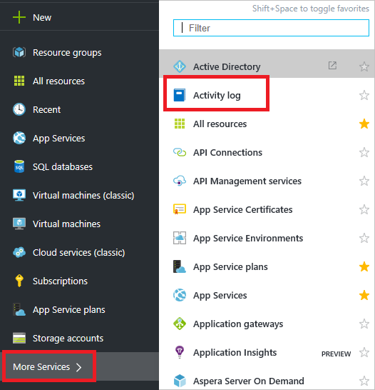
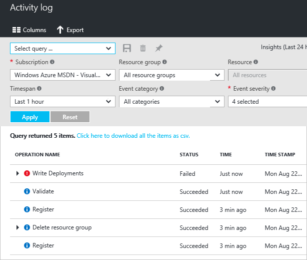
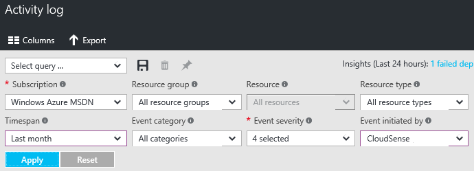
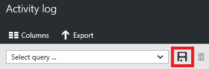
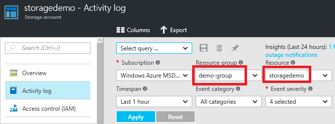

<properties
    pageTitle="Überwachen von Vorgängen mit Ressourcenmanager | Microsoft Azure"
    description="Verwenden der Aktivität Log in Ressourcenmanager Benutzeraktionen und Fehler zu überprüfen. Zeigt Azure Portals PowerShell, Azure CLI und REST."
    services="azure-resource-manager"
    documentationCenter=""
    authors="tfitzmac"
    manager="timlt"
    editor="tysonn"/>

<tags
    ms.service="azure-resource-manager"
    ms.workload="multiple"
    ms.tgt_pltfrm="na"
    ms.devlang="na"
    ms.topic="article"
    ms.date="08/22/2016"
    ms.author="tomfitz"/>

# Überwachen von Vorgängen mit Ressourcenmanager

Durch die Aktivitätsprotokolle können Sie ermitteln:

- welche Vorgänge wurden für Ressourcen, die in Ihrem Abonnement übernommen.
- Wer initiiert des Vorgangs (zwar Vorgänge initiiert von einer Back-End-Dienst kein Benutzers als Anrufer zurückgeben)
- Wenn der Vorgang wurde
- der Status des Vorgangs
- die Werte anderer Eigenschaften, die Ihnen helfen, möglicherweise Recherchieren des Vorgangs

[AZURE.INCLUDE [resource-manager-audit-limitations](../includes/resource-manager-audit-limitations.md)]

Dieses Thema befasst sich Überwachung Vorgänge. Weitere Informationen zum verwenden die Aktivitätsprotokolle mit eine Bereitstellung behandeln, finden Sie unter [Problembehandlung Ressource Gruppe Bereitstellungen in Azure](resource-manager-troubleshoot-deployments-portal.md).

Sie können Informationen aus den Aktivitätsprotokollen über das Portal, PowerShell, Azure CLI, Einsichten REST-API oder [Einsichten .NET Bibliothek](https://www.nuget.org/packages/Microsoft.Azure.Insights/)abrufen.

## Portal Aktivitätsprotokolle anzeigen

1. Wählen Sie zum Anzeigen der Aktivitätsprotokolle über das Portal **Weitere Dienste** und **Protokolle Aktivität**aus.

    

2. In das Blade **Aktivität Log** wird eine Zusammenfassung der zuletzt verwendete Vorgänge für alle Ressourcengruppen in Ihr Abonnement. Er enthält eine Liste der zuletzt verwendete Vorgänge.

    

3. Um die Anzahl der angezeigten Vorgänge einschränken möchten, wählen Sie unterschiedliche Situationen aus. Die folgende Abbildung zeigt beispielsweise die **Timespan** und **Ereignis initiiert von** Feldern, die geändert, um die von einem bestimmten Benutzer oder einer Anwendung für des letzten Monats ausgeführten Aktionen anzeigen.

    

4. Wählen Sie **Übernehmen** , um die Ergebnisse der Abfrage anzuzeigen.

5. Wenn Sie die Abfrage zu einem späteren Zeitpunkt erneut ausführen müssen, wählen Sie **Speichern** aus, und benennen Sie der Abfrage.

    

6. Wählen Sie automatisch Filter für eine bestimmte Ressource oder Ressourcengruppe aus dieser Ressource Blade **Aktivität Log** aus. Beachten Sie, dass das Aktivitätsprotokoll automatisch von der ausgewählten Ressource gefiltert wird.

    

## PowerShell Aktivitätsprotokolle anzeigen

1. Führen Sie zum Abrufen von Protokolleinträge **Get-AzureRmLog** Befehl ein. Geben Sie ein zusätzlichen Parametern zum Filtern der Liste der Einträge. Wenn Sie eine Start- und Zeit nicht angeben, werden die Einträge für die letzte Stunde zurückgegeben. Beispiel zum Abrufen von die Vorgänge für eine Ressourcengruppe während der vergangenen Stunde ausführen:

        Get-AzureRmLog -ResourceGroup ExampleGroup

    Im folgenden Beispiel wird veranschaulicht, wie das Überwachungsprotokoll auf Recherchieren Vorgänge während eines bestimmten Zeitraums erfasste verwenden. Die Anfangs- und Endtermine werden in ein Datumsformat angegeben.

        Get-AzureRmLog -ResourceGroup ExampleGroup -StartTime 2015-08-28T06:00 -EndTime 2015-09-10T06:00

    Oder Sie können Datumsfunktionen verwenden, um den Datumsbereich, wie etwa die letzten 14 Tage angeben.

        Get-AzureRmLog -ResourceGroup ExampleGroup -StartTime (Get-Date).AddDays(-14)

2. Je nach der Startzeit, die Sie angeben, können die vorherigen Befehle eine lange Liste von Vorgängen, für die Ressourcengruppe zurückgeben. Sie können die Ergebnisse für die gesuchte werden können, indem Sie Suchkriterien filtern. Wenn Sie versuchen, recherchieren, wie eine Web app angehalten wurde, könnten Sie den folgenden Befehl ausführen.  

        Get-AzureRmLog -ResourceGroup ExampleGroup -StartTime (Get-Date).AddDays(-14) | Where-Object OperationName -eq Microsoft.Web/sites/stop/action
        
    Die für dieses Beispiel zeigt, dass eine Beendigungsaktion von durchgeführt wurde someone@contoso.com. 
        
        Authorization     :
        Scope     : /subscriptions/xxxxx/resourcegroups/ExampleGroup/providers/Microsoft.Web/sites/ExampleSite
        Action    : Microsoft.Web/sites/stop/action
        Role      : Subscription Admin
        Condition :
        Caller            : someone@contoso.com
        CorrelationId     : 84beae59-92aa-4662-a6fc-b6fecc0ff8da
        EventSource       : Administrative
        EventTimestamp    : 8/28/2015 4:08:18 PM
        OperationName     : Microsoft.Web/sites/stop/action
        ResourceGroupName : ExampleGroup
        ResourceId        : /subscriptions/xxxxx/resourcegroups/ExampleGroup/providers/Microsoft.Web/sites/ExampleSite
        Status            : Succeeded
        SubscriptionId    : xxxxx
        SubStatus         : OK

3. Sie können die Aktionen, die von einem bestimmten Benutzer, auch für eine Ressourcengruppe, die nicht mehr vorhanden ist nachschlagen.

        Get-AzureRmLog -ResourceGroup deletedgroup -StartTime (Get-Date).AddDays(-14) -Caller someone@contoso.com

## Azure CLI Aktivitätsprotokolle anzeigen

1. Führen Sie zum Abrufen von Protokolleinträge Befehl **Azure Gruppe Protokoll anzeigen** aus.

        azure group log show ExampleGroup

2. Sie können die Ergebnisse mit einem JSON-Programm, wie z. B. [Jq](http://stedolan.github.io/jq/download/)filtern. Im folgenden Beispiel wird gezeigt, wie Vorgänge gesucht, die eine Web-Konfigurationsdatei aktualisiert.

        azure group log show ExampleGroup --json | jq ".[] | select(.operationName.localizedValue == \"Update web sites config\")"

3. Sie können die Aktionen für einen bestimmten Benutzer nachschlagen.

        azure group log show ExampleGroup --json | jq ".[] | select(.caller==\"someone@contoso.com\")"

## REST-API zum Anzeigen der Überwachungsprotokolle

Die restlichen Vorgänge für das Arbeiten mit der Log Aktivitäten gehören die [Einsichten REST-API](https://msdn.microsoft.com/library/azure/dn931943.aspx). Zum Abrufen von Aktivität protokollieren von Ereignissen finden Sie in der [Liste der Ereignisse in einem Abonnement](https://msdn.microsoft.com/library/azure/dn931934.aspx).

## Nächste Schritte

- Azure Aktivitätsprotokolle können mit Power BI verwendet werden, um Rückschlüsse auf die Aktionen in Ihrem Abonnement größer zu erhalten. Finden Sie unter [anzeigen und Analysieren von Azure Aktivitätsprotokollen in der Power BI und vieles mehr](https://azure.microsoft.com/blog/analyze-azure-audit-logs-in-powerbi-more/).
- Weitere Informationen zum Einrichten von Sicherheitsrichtlinien für die, finden Sie unter [Rollenbasierte Azure Access Control](./active-directory/role-based-access-control-configure.md).
- Wenn Sie die Befehle zur Behandlung dieses Problems Bereitstellungen wissen möchten, finden Sie unter [Problembehandlung Ressource Gruppe Bereitstellungen in Azure](resource-manager-troubleshoot-deployments-portal.md).
- Um Informationen zum Löschen für eine Ressource für alle Benutzer zu verhindern, finden Sie unter [Sperrenressourcen Azure Ressourcenmanager](resource-group-lock-resources.md).

