<properties
   pageTitle="Service-Portal Hauptbenutzer erstellen | Microsoft Azure"
   description="Beschreibt das Erstellen eines neuen Active Directory-Anwendung und Dienst Tilgungsanteile, die mit dem Steuerelement rollenbasierte Access in Azure Ressourcenmanager zum Verwalten des Zugriffs auf Ressourcen verwendet werden kann."
   services="azure-resource-manager"
   documentationCenter="na"
   authors="tfitzmac"
   manager="timlt"
   editor="tysonn"/>

<tags
   ms.service="azure-resource-manager"
   ms.devlang="na"
   ms.topic="article"
   ms.tgt_pltfrm="na"
   ms.workload="na"
   ms.date="09/07/2016"
   ms.author="tomfitz"/>

# Erstellen von Active Directory-Anwendung und Dienst Tilgungsanteile, die Ressourcen zugreifen kann mithilfe von portal

> [AZURE.SELECTOR]
- [PowerShell](resource-group-authenticate-service-principal.md)
- [Azure CLI](resource-group-authenticate-service-principal-cli.md)
- [Portal](resource-group-create-service-principal-portal.md)

Wenn Sie eine Anwendung, die vorliegt für den Zugriff oder Ressourcen ändern, müssen Sie richten Sie eine Anwendung Active Directory (AD) und die erforderlichen Berechtigungen zuweisen. In diesem Thema wird gezeigt, wie diese Schritte über das Portal ausführen. Aktuell, müssen Sie das klassische Portal zum Erstellen einer neuen Active Directory-Anwendung, und wechseln Sie dann in der Azure-Portal zuweisen eine Rolle zur Anwendung verwenden. 

> [AZURE.NOTE] Die Schritte in diesem Artikel gelten nur, wenn das **klassische-Portal** zu verwenden, um die AD-Anwendung zu erstellen. **Wenn Sie das Azure-Portal verwenden, für die AD-Anwendung zu erstellen, ist diese Schritte nicht erfolgreich.** 
>
> Möglicherweise finden Sie es einfacher zum Einrichten Ihrer AD-Anwendung und Dienst Hauptbenutzer über [PowerShell](resource-group-authenticate-service-principal.md) oder [Azure CLI](resource-group-authenticate-service-principal-cli.md), insbesondere dann, wenn Sie ein Zertifikat für die Authentifizierung verwenden möchten. In diesem Thema wird nicht so verwenden Sie ein Zertifikat angezeigt.

Eine Erläuterung der Active Directory-Konzepte finden Sie unter [Anwendung und Dienst Tilgungsanteile Objekte](./active-directory/active-directory-application-objects.md). Weitere Informationen zu Active Directory-Authentifizierung finden Sie unter [Authentifizierungsszenarien Azure AD](./active-directory/active-directory-authentication-scenarios.md).

Die detaillierten Schritte zur Integration von einer Anwendung in Azure für die Verwaltung von Ressourcen finden Sie unter [Entwicklers Leitfaden für Autorisierung API Ressourcenmanager Azure](resource-manager-api-authentication.md).

## Erstellen einer Active Directory-Anwendung

1. Melden Sie sich bei Ihrem Konto Azure über das [klassische Portal](https://manage.windowsazure.com/)aus. 

2. Stellen Sie sicher, dass Sie die standardmäßigen Active Directory für Ihr Abonnement kennen. Sie können nur Zugriff für Applikationen in demselben Verzeichnis wie Ihr Abonnement gewähren. Wählen Sie **Einstellungen** aus, und suchen Sie nach der Name des Verzeichnisses mit Ihrem Abonnement verknüpft ist.  Weitere Informationen finden Sie unter [wie Azure-Abonnements Azure Active Directory zugeordnet sind](./active-directory/active-directory-how-subscriptions-associated-directory.md).
   
     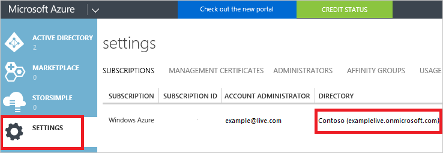

2. Wählen Sie im linken Bereich aus **Active Directory** .

     
     
3. Wählen Sie die Active Directory, die Sie zum Erstellen der Anwendungs verwenden möchten. Wenn Sie mehrere Active Directory verfügen, erstellen Sie die Anwendung im Standardverzeichnis für Ihr Abonnement.   

     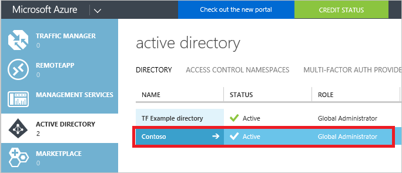
     
3. Wählen Sie zum Anzeigen der Anwendungen in Ihrem Verzeichnis **Applications**aus.

     

4. Wenn Sie in diesem Verzeichnis vor Anwendung erstellt haben, sollte ungefähr folgende Abbildung angezeigt werden. Wählen Sie **eine Anwendung hinzufügen**

     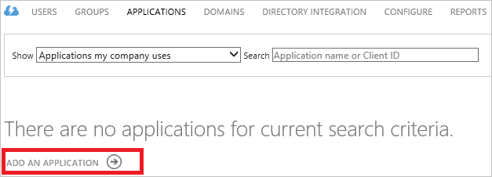

     Oder klicken Sie im unteren Bereich auf **Hinzufügen** .

     

5. Wählen Sie den Typ der Anwendung, die Sie erstellen möchten. Wählen Sie in diesem Lernprogramm **eine Anwendung, die zur Entwicklung von meinem Unternehmen hinzufügen**. 

     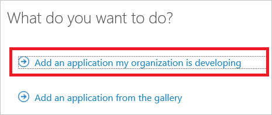

6. Geben Sie einen Namen für die Anwendung, und wählen Sie den Typ der Anwendung, die Sie erstellen möchten. In diesem Lernprogramm erstellen Sie eine **WEB-Anwendung und/oder WEB-API** , und klicken Sie auf die Schaltfläche Weiter. Wenn Sie **NATIVE CLIENT-Anwendung**auswählen, werden die restlichen Schritte in diesem Artikel nicht Ihre Erfahrungen überein.

     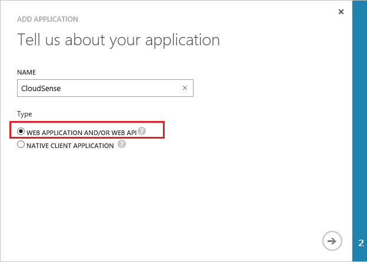

7. Füllen Sie die Eigenschaften für Ihre app ein. **Melden Sie sich auf URL**vorsehen Sie den URI zu einer Website, die eine Anwendung beschreibt. Das Vorhandensein der Website wird nicht überprüft. Bieten Sie für **APP-ID-URI**des URIS, Ihrer Anwendung bezeichnet.

     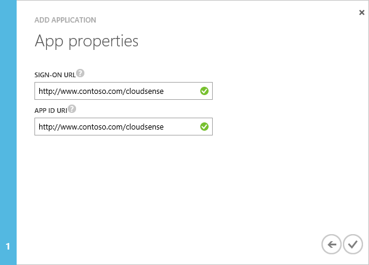

Sie haben eine Anwendung erstellt.

## Abrufen von Kunden-Id und Authentifizierung Schlüssel

Wenn programmgesteuert anmelden, benötigen Sie die Id für eine Anwendung. Wenn die Anwendung unter einem eigenen Anmeldeinformationen ausgeführt wird, benötigen Sie auch einen Authentifizierungsschlüssel.

1. Wählen Sie die Registerkarte **Konfigurieren** zum Konfigurieren Ihrer Anwendung Kennwort ein.

     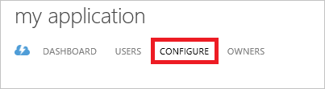

2. Kopieren Sie die **CLIENT-ID**an.
  
     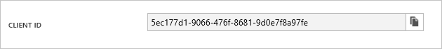

3. Wenn die Anwendung unter einem eigenen Anmeldeinformationen ausgeführt wird, führen Sie einen Bildlauf nach unten bis zum Abschnitt **Tasten** , und wählen Sie aus, wie lange Sie Ihr Kennwort gültig sein soll.

     

4. Wählen Sie **Speichern** , um Ihre Schlüssel zu erstellen.

     

     Der gespeicherte Schlüssel wird angezeigt, und kopieren Sie sie. Sie sind nicht die Taste später abrufen können also jetzt kopieren.

     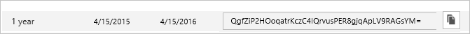

## Abrufen von Mandanten-id

Wenn programmgesteuert anmelden, müssen Sie den Mandanten-Id bei Ihrer Anforderung Authentifizierung übergeben. Web Apps und Web-API Apps können Sie die Mandanten-Id abrufen, indem Sie die **Ansicht Endpunkte** am unteren Rand des Bildschirms und Abrufen der Id wie in der folgenden Abbildung gezeigt.  

   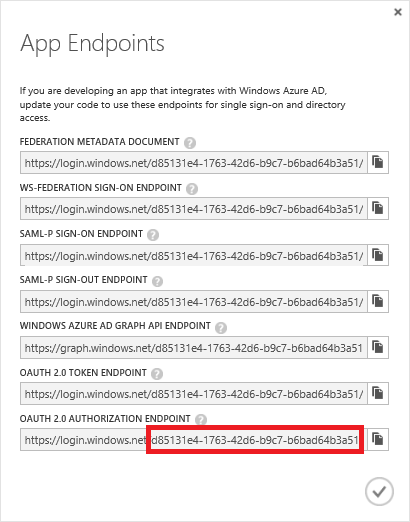

Sie können auch die Mandanten-Id über PowerShell abrufen:

    Get-AzureRmSubscription

Oder Azure CLI:

    azure account show --json

## Delegierte Festlegen von Berechtigungen

Wenn eine Anwendung im Auftrag eines Benutzers angemeldet greift Ressourcen auf, müssen Sie die delegierte Zugriffsberechtigung für andere Programme Ihrer Anwendung gewähren. Sie gewähren diese im Abschnitt **Berechtigungen für andere Programme auf** der Registerkarte **Konfigurieren** . Standardmäßig ist eine delegierte Berechtigung für Azure Active Directory bereits aktiviert. Lassen Sie diese Delegierte Berechtigung unverändert beizubehalten.

1. Wählen Sie **Hinzufügen aus**.

2. Wählen Sie aus der Liste der **Windows Azure Service Management-API**ein. Wählen Sie dann das Symbol "abgeschlossen" aus.

      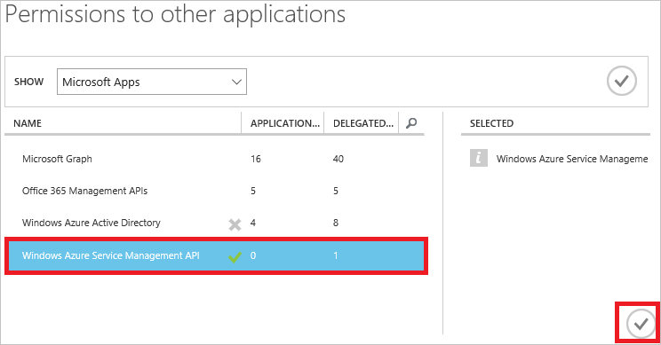

3. Wählen Sie in der Dropdown-Liste für delegierte Berechtigungen **Access Azure Servicemanagement als Organisation**aus.

      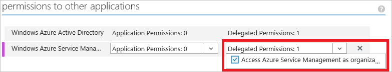

4. Speichern Sie die Änderung an.

## Weisen Sie Anwendung Rolle

Wenn die Anwendung unter einem eigenen Anmeldeinformationen ausgeführt wird, müssen Sie die Anwendung zu einer Rolle zuweisen. Entscheiden Sie, welche Rolle die entsprechenden Berechtigungen für die Anwendung darstellt. Informationen zu den verfügbaren Rollen finden Sie unter [RBAC: integrierte Rollen](./active-directory/role-based-access-built-in-roles.md). 

Zuweisen eine Rolle zu einer Anwendung müssen Sie die erforderlichen Berechtigungen verfügen. Müssen insbesondere `Microsoft.Authorization/*/Write` Zugriff durch die Rolle [Besitzer](./active-directory/role-based-access-built-in-roles.md#owner) oder [Access](./active-directory/role-based-access-built-in-roles.md#user-access-administrator) -Administratorrolle erhalten. Die Rolle "Mitwirkender" kann nicht die richtige zugreifen.

Sie können den Bereich auf der Ebene der Abonnements, Ressourcengruppe oder Ressource festlegen. Berechtigungen werden in der unteren Ebenen des Gültigkeitsbereichs übernommen. Hinzufügen einer Anwendung die Rolle Leser für eine Ressourcengruppe bedeutet z. B., dass er gelesen werden kann, die Ressourcengruppe und die darin enthaltenen Ressourcen.

1. Wenn Sie die Anwendung einer Rolle zuweisen, wechseln Sie vom klassischen Portal [Azure-Portal](https://portal.azure.com).

1. Überprüfen Sie Ihre Berechtigungen, um sicherzustellen, dass Sie die Dienst Tilgungsanteile einer Rolle zuweisen können. Wählen Sie **Meine Berechtigungen** für Ihr Konto ein.

    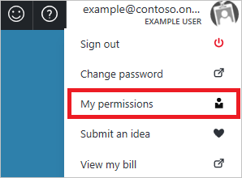

1. Anzeigen der zugewiesenen Berechtigungen für Ihr Konto an. Wie zuvor erwähnt, wenn Sie der Besitzer oder Administrator für Benutzer Access Rollen gehören, oder eine angepasste Rolle, die Schreibberechtigungen für Microsoft.Authorization gewährt. Die folgende Abbildung zeigt ein Konto, das die Rolle "Mitwirkender" für das Abonnement zugeordnet ist, nicht über die erforderlichen Berechtigungen eine Anwendung zu einer Rolle zugewiesen ist.

    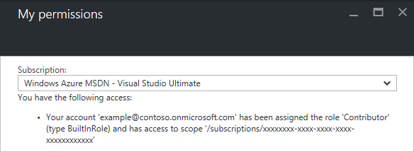

     Wenn Sie nicht die erforderlichen Berechtigungen zum Zugriff auf eine Anwendung gewähren, müssen Sie entweder Anforderung, dass Sie Ihr Abonnementadministrator der Benutzer Access-Administratorrolle hinzugefügt haben, oder anfordern, erhält der Administrator Zugriff auf die Anwendung.

1. Navigieren Sie zu der Ebene des Bereichs aus die Anwendung zugewiesen werden soll. Wählen Sie zum Zuweisen einer Rolle im Bereich Abonnement **Abonnements**aus.

     

     Wählen Sie das bestimmte Abonnement für die Anwendung zuweisen.

     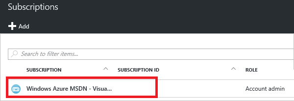

     Wählen Sie das **Access** -Symbol in der oberen rechten Ecke aus.

     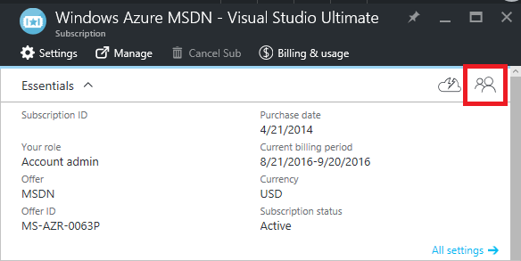
     
     Alternativ zum Zuweisen einer Rolle im Bereich der Ressource gruppieren, navigieren Sie zu einer Ressourcengruppe. Wählen Sie aus dem Ressource Gruppe Blade **Access-Steuerelement**aus.

     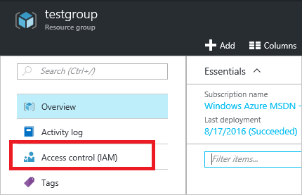

     Die folgenden Schritte sind für jeden Bereich identisch.

2. Wählen Sie auf **Hinzufügen**.

     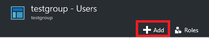

3. Wählen Sie die Rolle **Reader** (oder jeden Rolle die Anwendung zugewiesen werden soll).

     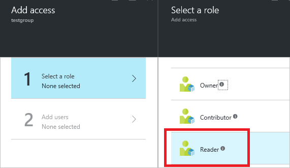

4. Wenn Sie zuerst die Liste der Benutzer angezeigt, die Sie der Rolle hinzufügen können wird, sehen Sie keine Applications. Gruppieren und Benutzer wird nur angezeigt werden.

     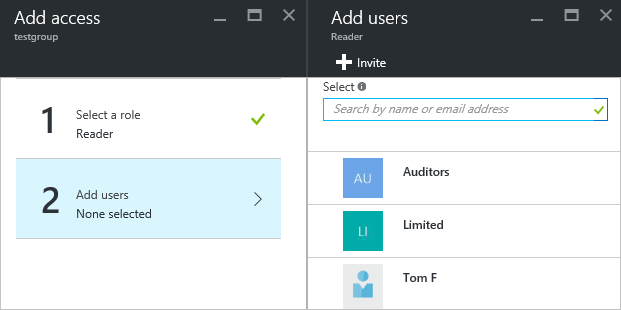

5. Um Ihrer Anwendung finden möchten, müssen Sie es suchen. Geben Sie den Namen der Anwendung, und die Liste der verfügbaren Optionen ändern. Wählen Sie die Anwendung, wenn Sie in der Liste angezeigt wird.

     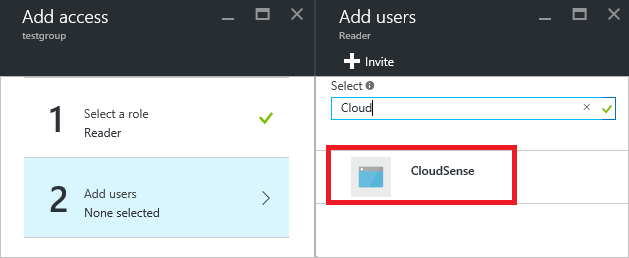

6. Wählen Sie **OK** zum Abschließen die Rolle zuweisen aus. Es sollte jetzt eine Anwendung in der Liste der Verwendung einer Rolle für die Ressourcengruppe zugewiesen angezeigt.

Weitere Informationen zum Zuweisen von Benutzern und Anwendungen, die Rollen über das Portal finden Sie unter [Verwenden von rollenzuweisungen zum Verwalten des Zugriffs auf Ihre Abonnementressourcen Azure](role-based-access-control-configure.md#manage-access-using-the-azure-management-portal).

## Beispiel für Applikationen

Im folgenden Beispiel Applikationen zeigen, wie als die Tilgungsanteile Dienst anmelden.

**.NET**

- [Bereitstellen einer SSH aktiviert virtueller Computer mit einer Vorlage mit .NET](https://azure.microsoft.com/documentation/samples/resource-manager-dotnet-template-deployment/)
- [Verwalten von Azure Ressourcen und Ressourcengruppe mit .NET](https://azure.microsoft.com/documentation/samples/resource-manager-dotnet-resources-and-groups/)

**Java**

- [Erste Schritte mit - Bereitstellen mit Azure Ressourcenmanager Vorlage - Ressourcen in Java](https://azure.microsoft.com/documentation/samples/resources-java-deploy-using-arm-template/)
- [Erste Schritte mit - Ressourcengruppe verwalten - Ressourcen in Java](https://azure.microsoft.com/documentation/samples/resources-java-manage-resource-group//)

**Python**

- [Bereitstellen einer SSH virtueller Computer mit einer Vorlage in Python aktiviert](https://azure.microsoft.com/documentation/samples/resource-manager-python-template-deployment/)
- [Verwalten von Azure Ressourcen- und Ressourcengruppen mit Python](https://azure.microsoft.com/documentation/samples/resource-manager-python-resources-and-groups/)

**Node.js**

- [Bereitstellen einer SSH virtueller Computer mit einer Vorlage in Node.js aktiviert](https://azure.microsoft.com/documentation/samples/resource-manager-node-template-deployment/)
- [Verwalten von Azure Ressourcen und Ressourcengruppe mit Node.js](https://azure.microsoft.com/documentation/samples/resource-manager-node-resources-and-groups/)

**Ruby**

- [Bereitstellen einer SSH virtueller Computer mit einer Vorlage in Ruby aktiviert](https://azure.microsoft.com/documentation/samples/resource-manager-ruby-template-deployment/)
- [Verwalten von Azure Ressourcen- und Ressourcengruppen mit Ruby](https://azure.microsoft.com/documentation/samples/resource-manager-ruby-resources-and-groups/)

## Nächste Schritte

- Finden Sie weitere Informationen zum Angeben von Sicherheit, [Rollenbasierte Azure Access Control](./active-directory/role-based-access-control-configure.md)aus.  
- Eine Videodemonstration Schritte finden Sie unter [Aktivieren der programmgesteuerten Verwaltung von einer Ressource Azure mit Azure Active Directory](https://channel9.msdn.com/Series/Azure-Active-Directory-Videos-Demos/Enabling-Programmatic-Management-of-an-Azure-Resource-with-Azure-Active-Directory).

