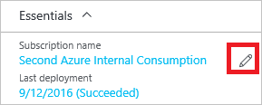

<properties 
    pageTitle="Verschieben von Ressourcen in eine neue Ressourcengruppe | Microsoft Azure" 
    description="Verwenden Sie Azure Ressourcenmanager, um Ressourcen zu einer neuen Ressourcengruppe oder das Abonnement zu verschieben." 
    services="azure-resource-manager" 
    documentationCenter="" 
    authors="tfitzmac" 
    manager="timlt" 
    editor="tysonn"/>

<tags 
    ms.service="azure-resource-manager" 
    ms.workload="multiple" 
    ms.tgt_pltfrm="na" 
    ms.devlang="na" 
    ms.topic="article" 
    ms.date="10/21/2016" 
    ms.author="tomfitz"/>

# Verschieben von Ressourcen zu neuen Ressourcengruppe oder-Abonnement

In diesem Thema wird gezeigt, wie Ressourcen entweder ein neues Abonnement oder eine neue Ressourcengruppe im selben Abonnement wechseln. Im Portal, PowerShell, Azure CLI oder die REST-API können Sie die um Ressource zu verschieben. Die verschieben-Vorgänge in diesem Thema stehen Ihnen ohne jegliche Unterstützung von Azure-Support.

In der Regel verschieben Sie Ressourcen aus, wenn Sie entscheiden:

- Aus Gründen der Abrechnung muss eine Ressource in ein anderes Abonnement live.
- Eine Ressource teilt nicht mehr den gleichen Lebenszyklus als die Ressourcen, die, denen Sie zuvor mit gruppiert wurde. Möchten Sie in einer neuen Ressourcengruppe verschieben, sodass Sie diese Ressource unabhängig von den anderen Ressourcen verwalten können.

Beim Verschieben von Ressourcen, die Quellgruppe und der Zielgruppe während des Vorgangs gesperrt. Schreiben und Löschvorgängen werden auf der Gruppen blockiert, bis das Verschieben abgeschlossen ist.

Sie können den Speicherort der Ressource nicht ändern. Eine Ressource verschieben, nur wird zu einer neuen Ressourcengruppe. Möglicherweise müssen Sie die neue Ressourcengruppe einen anderen Speicherort, aber die ändert nicht den Speicherort der Ressource.

> [AZURE.NOTE] Dieser Artikel beschreibt, wie Sie Ressourcen innerhalb einer vorhandenen Azure Angebot Konto verschieben. Wenn Sie tatsächlich Ihr Geschenk (z. B. Aktualisieren von nutzungsbasierte vorab bezahlen) für die Arbeit mit vorhandenen Ressourcen Verschiebe Azure-Konto ändern möchten, finden Sie unter [Wechseln zu einem anderen Angebot Ihr Azure Abonnement](billing-how-to-switch-azure-offer.md). 

## Checkliste vor dem Verschieben von Ressourcen

Es gibt einige wichtige Schritte ausführen, bevor Sie eine Ressource aus. Diese Bedingung überprüft haben, können Sie Fehler vermeiden.

1. Der Dienst muss die Möglichkeit zum Verschieben der Ressourcen aktivieren. Finden Sie in der Liste unter Informationen, welche [Dienste verschieben Ressourcen zu aktivieren](#services-that-enable-move).
1. Die Quell- und Zielfelder Abonnements müssen innerhalb der gleichen [Active Directory-Mandanten](./active-directory/active-directory-howto-tenant.md)vorhanden sein. Rufen Sie Support an, um in einen neuen Mandanten zu verschieben.
2. Das Zielabonnement muss für die Ressourcenanbieter der Ressource verschobene registriert sein. Wenn dies nicht der Fall ist, erhalten Sie eine Fehlermeldung darauf hin, dass das **Abonnement nicht für einen Ressourcentyp registriert ist**. Dieses Problem auftreten, wenn eine Ressource zu einem neuen Abonnement, verschieben, aber nie Abonnement mit diesem Ressourcentyp verwendet wurde. Informationen zum Überprüfen des Registrierungsstatus und Ressourcenprovider registrieren, finden Sie unter [Ressourcenanbieter und Datentypen](../resource-manager-supported-services.md#resource-providers-and-types).
4. Wenn Sie App Dienst app verschieben, haben Sie [App diensteinschränkungen](#app-service-limitations)überprüft.
4. Wenn Sie mit den Diensten von Wiederherstellung zugeordnete Ressourcen verschieben, haben Sie die [Wiederherstellung Services Einschränkungen](#recovery-services-limitations) überprüft.
5. Wenn Sie Ressourcen bereitgestellt durch Klassisch verschieben, haben Sie [klassischen Bereitstellung Einschränkungen](#classic-deployment-limitations)überprüft.

## Wann Sie den Support anrufen

Sie können über die Self-service-Vorgänge in diesem Thema werden die meisten Ressourcen verschieben. Verwenden Sie die Self-service-Operationen zu:

- Ressourcenmanager Ressourcen zu verschieben.
- Verschieben Sie klassische Ressourcen entsprechend den [klassischen Bereitstellung Einschränkungen](#classic-deployment-limitations). 

Wenden Sie bei Bedarf:

- Verschieben der Ressourcen auf ein neues Azure-Konto (und Active Directory-Mandanten).
- Klassische Ressourcen zu verschieben, aber Probleme mit Einschränkungen.

## Dienste, mit die verschieben können.

Jetzt sind die Dienste, mit denen in einer neuen Ressourcengruppe und die Abonnement verschieben:

- API Management
- App-Service-apps (Web apps -) finden Sie unter [App diensteinschränkungen](#app-service-limitations)
- Automatisierung
- Stapelverarbeitung
- CDN
- Cloud Services - finden Sie unter [klassischen Bereitstellung Einschränkungen](#classic-deployment-limitations)
- Daten Factory
- DNS-EINTRÄGE
- DocumentDB
- HDInsight Cluster
- IoT Hubs
- Key Tresor 
- Media-Dienste
- Mobile Engagement
- Benachrichtigung Hubs
- Betrieb Einsichten
- Redis Cache
- Scheduler
- Suchen
- Dienstbus
- Speicher
- Speicher (klassisch) – finden Sie unter [klassischen Bereitstellung Einschränkungen](#classic-deployment-limitations)
- SQL-Datenbankserver - Datenbank und den Server muss sich in derselben Ressourcengruppe befinden. Wenn Sie einen SQLServer zu verschieben, werden alle zugehörigen Datenbanken ebenfalls verschoben.
- Virtueller Computer – jedoch Features nicht unterstützt einem neuen Abonnement wechseln, wenn seine Zertifikate in einem Tresor Schlüssel gespeichert sind
- Virtuellen Computern (klassisch) – finden Sie unter [klassischen Bereitstellung Einschränkungen](#classic-deployment-limitations)
- Virtuelle Netzwerke

## Dienste, die nicht zu, verschieben aktivieren

Die Dienste, die derzeit nicht aktivieren das Verschieben einer Ressource sind:

- Application Gateway
- Anwendung Einsichten
- Express weiterleiten
- Wiederherstellung Services Vaulting - auch nicht mit der Wiederherstellung Services Tresor verbundenen Ressourcen Datenverarbeitung, Netzwerk und Speicher verschieben, finden Sie unter [Wiederherstellung Services Einschränkungen](#recovery-services-limitations).
- Virtuellen Computern mit Zertifikat gehörende Kehrmatrix Tresor-Taste
- Virtuellen Computern skalieren Datensätze
- Virtuelle Netzwerke (klassisch) – finden Sie unter [klassischen Bereitstellung Einschränkungen](#classic-deployment-limitations)
- VPN-Gateway

## Diensteinschränkungen App

Bei der Arbeit mit App Service apps können nicht nur eine App Serviceplan wechseln Zum Verschieben der App-Dienst apps sind Ihre Optionen aus:

- Verschoben Sie der App-Serviceplan und alle anderen Dienst App Ressourcen in dieser Ressourcengruppe zu einer neuen Ressourcengruppe, die App-Dienst Ressourcen noch nicht. Diese Anforderung bedeutet, dass Sie auch die App-Dienst Ressourcen verschoben werden soll, die nicht der App-Serviceplan zugeordnet sind. 
- Verschieben Sie der apps zu einer anderen Ressourcengruppe, aber behalten Sie alle Dienstpläne für die App in der ursprünglichen Ressourcengruppe bei.

Wenn Ihre ursprüngliche Ressourcengruppe auch eine Anwendung Einsichten Ressource enthält, können Sie diese Ressource verschieben, da Anwendung Einsichten den Vorgang nicht aktuell aktivieren. Wenn Sie die Anwendung Einsichten Ressource beim Verschieben von App-Dienst apps einschließen, schlägt fehl, der gesamten Vorgang. Die Anwendung Einsichten und App-Serviceplan müssen jedoch nicht in derselben Ressourcengruppe als die app für die app ordnungsgemäß gespeichert sind.

Wenn beispielsweise Ihre Ressourcengruppe enthält:

- **Web-a** die zugeordnet ist **Plan ein** und **app Einsichten ein**
- **Web-b** dem **Plan-b** und **app-Einsichten-b** zugeordnet ist

Die Optionen sind:

- Verschieben von **Web ein**, **Planen eines**, **Web-b**und **b-Plan**
- Verschieben von **Web-a** und **Web-b**
- Verschieben von **Web-a**
- Verschieben von **Web-b**

Alle anderen Kombinationen betreffen entweder einen Ressourcentyp, der (Anwendung Einsichten) verschoben werden kann, verschieben oder hinterlassen einen Ressourcentyp, der hinter bleiben kann, wenn eine App-Serviceplan (beliebiger Typ der App-Dienst Ressource) verschieben.

Wenn Web app befindet sich in einer anderen Ressourcengruppe als den Plan für die App-Dienst, aber Sie beide zu einer neuen Ressourcengruppe verschieben möchten, müssen Sie das Verschieben in zwei Schritten durchführen. Beispiel:

- **Web-a** befindet sich im **Web-Gruppe**
- **Planen eines** befindet sich im **Plan-Gruppe**
- Möchten Sie **Web ein** und **Planen eines** **kombiniert Gruppe** angehören

Um diese verschieben zu erreichen, führen Sie zwei separate verschieben-Vorgänge in der folgenden Reihenfolge aus:

1. Verschieben der **Web ein** **Plan -** Gruppe
2. Verschieben von **Web-a** und **Planen eines** **kombiniert**Gruppe.

Sie können das Zertifikat einer App zu einer neuen Ressourcengruppe oder Abonnements ohne Probleme verschieben. Wenn Ihre Web app ein SSL-Zertifikat, die Sie erworben und die app geladen enthält, müssen Sie das Zertifikat löschen, bevor Sie die Web app. Beispielsweise können Sie die folgenden Schritte ausführen:

1. Löschen Sie das hochgeladene Zertifikat aus dem Web app.
2. Verschieben Sie die Web app
3. Das Zertifikat zu Web app hochladen

## Wiederherstellung Services Einschränkungen

Verschieben Sie, nicht für Speicher, Netzwerk, aktiviert ist, oder berechnen Sie zum Einrichten der Wiederherstellung mit Azure Website Wiederherstellung verwendete Ressourcen zu. 

Angenommen Sie, Sie Replikation Ihrer lokalen Computer mit einem Speicherkonto (Storage1) eingerichtet haben und möchten den geschützten Computer nach Failover in Azure als Anlage zu einem virtuellen Netzwerk (verwendet1) virtueller Computer (VM1) ergibt. Sie können keine dieser Azure Ressourcen - Storage1, VM1 und verwendet1 - zwischen Ressourcengruppen innerhalb des gleichen Abonnements oder übergreifend Abonnements wechseln.

## Klassische Bereitstellung Einschränkungen

Die Optionen für die Ressourcen bereitgestellt, bis der Option Klassisch verschieben unterscheiden sich je nach, ob Sie die Ressourcen innerhalb eines Abonnements oder in einem neuen Abonnement verschieben möchten, klicken Sie auf. 

### Gleichen Abonnement

Beim Verschieben von Ressourcen aus einer Ressourcengruppe in eine andere Ressourcengruppe innerhalb des gleichen Abonnements, gelten die folgenden Einschränkungen:

- Virtuelle Netzwerke (klassische) können nicht verschoben werden.
- Mit der Cloud-Dienst müssen virtuellen Computern (klassisch) verschoben werden. 
- Cloud-Dienst kann nur verschoben werden, wenn das Verschieben aller virtuellen Computern enthält.
- Nur einen Cloud-Dienst kann jeweils verschoben werden.
- Nur ein Speicherkonto (klassische) kann jeweils verschoben werden.
- Speicher-Konto (klassische) kann nicht in den gleichen Vorgang mit eines virtuellen Computers oder einem Cloud-Dienst verschoben werden.

Verwenden Sie zum klassische Ressourcen zu einer neuen Ressourcengruppe innerhalb des gleichen Abonnements verschieben, die Vorgänge standard verschieben über das [Portal](#use-portal), [Azure PowerShell](#use-powershell), [Azure CLI](#use-azure-cli)oder [REST-API](#use-rest-api)ein. Verwenden Sie Vorgänge aus, wie Sie zum Verschieben von Ressourcenmanager Ressourcen verwenden.

### Neues Abonnement

Beim Verschieben von Ressourcen in einem neuen Abonnement, gelten die folgenden Einschränkungen:

- Alle Ressourcen des Abonnements klassische müssen im gleichen Vorgang verschoben werden.
- Das gewünschte Abonnement darf keine anderen klassischen Ressourcen enthalten.
- Verschieben kann nur über eine separate REST API für klassische verschiebt angefordert werden. Die standardmäßige Ressourcenmanager verschieben Befehle funktionieren nicht beim Verschieben von klassischer Ressourcen in einem neuen Abonnement.

Um klassischen Ressourcen in einem neuen Abonnement zu verschieben, müssen Sie REST Vorgänge verwenden, die auf klassische Ressourcen beziehen. Führen Sie die folgenden Schritte aus, um klassischen Ressourcen zu einem neuen Abonnement verschieben.

1. Überprüfen Sie, ob das Abonnement Quelle in ein Kreuz-Abonnement verschieben teilnehmen kann. Verwenden Sie den folgenden Vorgang ein:

         POST https://management.azure.com/subscriptions/{sourceSubscriptionId}/providers/Microsoft.ClassicCompute/validateSubscriptionMoveAvailability?api-version=2016-04-01
    
     In den Textbereich der Besprechungsanfrage einbeziehen:

         {
           "role": "source"
         }

     Die Antwort für die Ausführung der Validierung wird in folgendem Format:

         {
           "status": "{status}",
           "reasons": [
             "reason1",
             "reason2"
           ]
         }

2. Überprüfen Sie, ob das Zielabonnement in ein Kreuz-Abonnement verschieben teilnehmen kann. Verwenden Sie den folgenden Vorgang ein:

         POST https://management.azure.com/subscriptions/{destinationSubscriptionId}/providers/Microsoft.ClassicCompute/validateSubscriptionMoveAvailability?api-version=2016-04-01

     In den Textbereich der Besprechungsanfrage einbeziehen:

         {
           "role": "target"
         }

     Die Antwort ist in das gleiche Format wie die Überprüfung der Datenquelle Abonnement.

3. Wenn beide Abonnements Validierung, verschieben Sie alle klassische Ressourcen aus einem Abonnement zu einem anderen Abonnement mit den folgenden Vorgang ein:

         POST https://management.azure.com/subscriptions/{subscription-id}/providers/Microsoft.ClassicCompute/moveSubscriptionResources?api-version=2016-04-01

    In den Textbereich der Besprechungsanfrage einbeziehen:

         {
           "target": "/subscriptions/{target-subscription-id}"
         }

Der Vorgang möglicherweise für einige Minuten ausgeführt. 

## Verwenden von portal

Um Ressourcen zu einer neuen Ressourcengruppe in der **gleichen Abonnement**verschieben möchten, wählen Sie die Ressourcengruppe aus, die mit dieser Ressource, und wählen Sie dann auf die Schaltfläche **Verschieben** .

Oder, um ein **Neues Abonnement**Ressourcen verschieben möchten, wählen Sie die Ressourcengruppe aus, die mit dieser Ressource, und wählen Sie dann auf das Symbol zum Bearbeiten von Abonnements.

Wählen Sie die Ressourcen verschieben und die Ziel-Ressourcengruppe. Bestätigen Sie, dass Sie müssen Skripts für diese Ressourcen zu aktualisieren, und wählen Sie **OK**aus. Wenn Sie das Symbol Edit Abonnement im vorherigen Schritt ausgewählt haben, müssen Sie auch das Zielabonnement auswählen.

In **Benachrichtigungen**sehen Sie, dass der Verschiebungsvorgang ausgeführt wird.

Wenn sie durchgeführt wurde, werden Sie des Ergebnisses benachrichtigt.

## Verwenden von PowerShell

Verwenden Sie den Befehl **Verschieben-AzureRmResource** aus, um vorhandene Ressourcen zu einer anderen Ressourcengruppe oder-Abonnement verschieben.

Das erste Beispiel zeigt, wie Sie eine Ressource zu einer neuen Ressourcengruppe verschieben.

    $resource = Get-AzureRmResource -ResourceName ExampleApp -ResourceGroupName OldRG
    Move-AzureRmResource -DestinationResourceGroupName NewRG -ResourceId $resource.ResourceId

Das zweite Beispiel zeigt, wie Sie mehrere Ressourcen zu einer neuen Ressourcengruppe verschieben.

    $webapp = Get-AzureRmResource -ResourceGroupName OldRG -ResourceName ExampleSite
    $plan = Get-AzureRmResource -ResourceGroupName OldRG -ResourceName ExamplePlan
    Move-AzureRmResource -DestinationResourceGroupName NewRG -ResourceId $webapp.ResourceId, $plan.ResourceId

Wenn Sie ein neues Abonnement verschieben möchten, einbeziehen Sie einen Wert für den Parameter **DestinationSubscriptionId**

Sie werden aufgefordert, zu bestätigen, dass die angegebenen Ressourcen verschoben werden soll.

    Confirm
    Are you sure you want to move these resources to the resource group
    '/subscriptions/{guid}/resourceGroups/newRG' the resources:

    /subscriptions/{guid}/resourceGroups/destinationgroup/providers/Microsoft.Web/serverFarms/exampleplan
    /subscriptions/{guid}/resourceGroups/destinationgroup/providers/Microsoft.Web/sites/examplesite
    [Y] Yes  [N] No  [S] Suspend  [?] Help (default is "Y"): y

## Verwenden von Azure CLI

Um vorhandene Ressourcen in einer anderen Ressourcengruppe oder das Abonnement verschieben möchten, verwenden Sie den Befehl **Azure Ressource verschieben** . Sie müssen die Ressource Ids Ressourcen verschieben bereitstellen. Sie können Ressourcen-Ids mit den folgenden Befehl erhalten:

    azure resource list -g sourceGroup --json

Die folgende Format zurückgegeben:

    [
      {
        "id": "/subscriptions/{guid}/resourceGroups/sourceGroup/providers/Microsoft.Storage/storageAccounts/storagedemo",
        "name": "storagedemo",
        "type": "Microsoft.Storage/storageAccounts",
        "location": "southcentralus",
        "tags": {},
        "kind": "Storage",
        "sku": {
          "name": "Standard_RAGRS",
          "tier": "Standard"
        }
      }
    ]

Im folgenden Beispiel wird gezeigt, wie ein Speicherkonto in einer neuen Ressourcengruppe verschieben. Geben Sie in der **i -** Parameter an, dass eine kommagetrennte Liste der Ressource-Id ist um zu verschieben.

    azure resource move -i "/subscriptions/{guid}/resourceGroups/sourceGroup/providers/Microsoft.Storage/storageAccounts/storagedemo" -d "destinationGroup"
    
Sie werden aufgefordert, zu bestätigen, dass die angegebene Ressource verschoben werden soll.

## Verwenden Sie die REST-API

Wenn Sie um vorhandene Ressourcen in einer anderen Ressourcengruppe oder das Abonnement zu verschieben, führen Sie Folgendes aus:

    POST https://management.azure.com/subscriptions/{source-subscription-id}/resourcegroups/{source-resource-group-name}/moveResources?api-version={api-version} 

In den Textbereich der Besprechungsanfrage Geben Sie die Ressource Zielgruppe und den Ressourcen zu navigieren. Weitere Informationen zu den restlichen Vorgang finden Sie unter [Verschieben von Ressourcen](https://msdn.microsoft.com/library/azure/mt218710.aspx).

## Nächste Schritte
- Informationen zu PowerShell-Cmdlets für die Verwaltung Ihres Abonnements finden Sie unter [Verwenden von Azure PowerShell mit Ressourcen-Manager](powershell-azure-resource-manager.md).
- Informationen zu Azure CLI-Befehle für die Verwaltung Ihres Abonnements finden Sie unter [Verwendung der CLI Azure mit Ressourcen-Manager](xplat-cli-azure-resource-manager.md).
- Über Portal Features für die Verwaltung Ihres Abonnements finden Sie unter [Verwenden des Azure Portals zum Verwalten von Ressourcen](./azure-portal/resource-group-portal.md).
- Weitere Informationen zum Anwenden von logisch organisiert auf Ressourcen, finden Sie unter [Verwenden von Kategorien, um Ihre Ressourcen zu organisieren](resource-group-using-tags.md).
