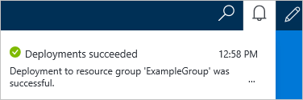
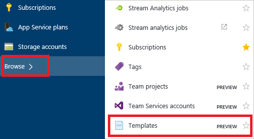

<properties 
    pageTitle="Verwenden von Azure-Portals Azure Ressourcen bereitstellen | Microsoft Azure" 
    description="Verwenden Sie Azure-Portal und Azure Ressource verwalten, um Ressourcen bereitstellen." 
    services="azure-resource-manager,azure-portal" 
    documentationCenter="" 
    authors="tfitzmac" 
    manager="timlt" 
    editor="tysonn"/>

<tags 
    ms.service="azure-resource-manager" 
    ms.workload="multiple" 
    ms.tgt_pltfrm="na" 
    ms.devlang="na" 
    ms.topic="article" 
    ms.date="09/15/2016" 
    ms.author="tomfitz"/>

# Bereitstellen von Ressourcen mit Ressourcenmanager Vorlagen und Azure-portal

> [AZURE.SELECTOR]
- [PowerShell](resource-group-template-deploy.md)
- [Azure CLI](resource-group-template-deploy-cli.md)
- [Portal](resource-group-template-deploy-portal.md)
- [REST-API](resource-group-template-deploy-rest.md)

In diesem Thema wird gezeigt, wie der [Azure-Portal](https://portal.azure.com) mit [Azure Ressourcenmanager](azure-resource-manager/resource-group-overview.md) zu verwenden, um Ihre Azure Ressourcen bereitstellen. Weitere Informationen zum Verwalten von Ressourcen, finden Sie unter [Verwalten von Azure Ressourcen über Portal](./azure-portal/resource-group-portal.md).

Zurzeit unterstützt nicht jeder Dienst im Portal oder Ressourcenmanager. Für diese Dienste verwenden müssen Sie das [klassische Portal](https://manage.windowsazure.com)verwenden. Der Status der einzelnen Dienste finden Sie unter [Azure Portals Verfügbarkeitsdiagramm](https://azure.microsoft.com/features/azure-portal/availability/).

## Ressourcengruppe erstellen

1. Wählen Sie zum Erstellen einer leeren Ressourcengruppe **neu** > **Management** > **Ressourcengruppe**.

    

2. Geben sie einen Namen und einen Speicherort aus, und aktivieren Sie bei Bedarf ein Abonnement. Sie müssen einen Speicherort für die Ressourcengruppe bereitstellen, weil die Ressourcengruppe Metadaten zu Ressourcen speichert. Aus Gründen der Compliance möchten Sie möglicherweise angeben, dass Metadaten gespeichert ist. Es wird empfohlen, dass Sie einen Speicherort angeben, in dem meisten Ressourcen gespeichert werden soll. Mithilfe derselben Stelle können Sie Ihre Vorlage vereinfachen.

    

## Bereitstellen von Ressourcen aus Marketplace

Nachdem Sie eine Ressourcengruppe erstellt haben, können Sie Ressourcen aus dem Marketplace darauf bereitstellen. Der Marketplace stellt vordefinierte Lösungen für häufige Szenarien.

1. Um eine Bereitstellung zu beginnen, wählen Sie **neu** und den Typ der Ressource aus, die Sie bereitstellen möchten. Suchen Sie dann die Version der Ressource aus, die Sie bereitstellen möchten.

    

2. Wenn Sie bestimmte Lösung aus, die Sie bereitstellen möchten, nicht angezeigt werden, können Sie dafür den Marketplace suchen.

    

3. Je nach Typ der ausgewählten Ressource müssen Sie eine Zusammenstellung von relevanten Eigenschaften, die vor der Bereitstellung festlegen. Diese Optionen werden nicht hier angezeigt werden, wenn diese Ressourcenart je nach. Bei allen Typen müssen Sie eine Ressourcengruppe Ziel auswählen. Die folgende Abbildung zeigt, wie Sie eine Web app erstellen und Bereitstellen der Ressourcengruppe, die Sie erstellt haben.

    

    Alternativ können Sie entscheiden, um eine Ressourcengruppe beim Bereitstellen von Ressourcen zu erstellen. Wählen Sie **neu erstellen** , und benennen Sie der Ressourcengruppe aus.

    

4. Ihre Bereitstellung beginnt. Die Bereitstellung kann einige Minuten dauern. Wenn die Bereitstellung abgeschlossen ist, wird eine Benachrichtigung angezeigt.

    

5. Nach der Bereitstellung von Ressourcen, können Sie mithilfe des Befehls **Hinzufügen** auf die Ressource Gruppe Blade Weitere Ressourcen der Ressourcengruppe hinzufügen.

    

## Bereitstellen von benutzerdefinierten Vorlage Ressourcen

Wenn Sie Ausführen einer Bereitstellung jedoch eine der Vorlagen nicht in der Marketplace verwenden möchten, können Sie eine angepasste Vorlage erstellen, die die Infrastruktur für Ihre Lösung definiert. Weitere Informationen zum Erstellen von Vorlagen, finden Sie unter [Azure Ressourcenmanager Authoring-Vorlagen](resource-group-authoring-templates.md).

1. Wenn Sie eine angepasste Vorlage über das Portal bereitstellen, wählen Sie **neu**, und starten Sie der Suche für die **Bereitstellung der Vorlage** , bis Sie sie aus den Optionen auswählen können.

    

2. Wählen Sie aus den verfügbaren Ressourcen **Bereitstellung der Vorlage** ein.

    

3. Öffnen Sie nach dem Start der bereitstellungs der Vorlage, die leere Vorlage, die zur Anpassung zur Verfügung.

    

    Fügen Sie im Editor für die JSON-Syntax, die Ressourcen definiert werden, die Sie bereitstellen möchten. Wählen Sie anschließend **Speichern** . Leitfaden für die JSON-Syntax schreiben finden Sie unter [Exemplarische Vorgehensweise Ressourcenmanager-Vorlage](resource-manager-template-walkthrough.md).

    

4. Alternativ können Sie eine bereits vorhandene Vorlage aus [Azure Schnellstart Vorlagen](https://azure.microsoft.com/documentation/templates/)auswählen. Diese Vorlagen werden von der Community bereitgestellt. Diese Deckblatt viele häufige Szenarien und eine andere Person haben eine Vorlage, die ähnelt dem, was Sie bereitstellen möchten hinzugefügt. Sie können die Vorlagen, um etwas zu finden, die Ihrem Szenario entspricht suchen.

    

    Sie können die ausgewählte Vorlage im Editor anzeigen.

5. Wählen Sie nach der alle anderen Werte **Erstellen** , um die Vorlage bereitstellen. 

    

## Bereitstellen von Ressourcen aus einer Vorlage, die mit Ihrem Konto gespeichert

Im Portal können Sie eine Vorlage auf Ihr Konto Azure speichern, und es später erneut. Weitere Informationen zum Arbeiten mit diesen Vorlagen, die [Erste Schritte mit der Azure-Portal als "Privat" Vorlagen](./marketplace-consumer/mytemplates-getstarted.md)gespeichert.

1. Um Ihre gespeicherten Vorlagen zu finden, wählen Sie **Durchsuchen** > **Vorlagen**.

    

2. Wählen Sie aus der Liste der Vorlagen, die mit Ihrem Konto gespeichert, die Sie bearbeiten möchten.

    

3. Wählen Sie **Bereitstellen** dieser gespeicherten Vorlage erneut bereitstellen.

    

## Nächste Schritte

- Zum Anzeigen der Überwachungsprotokolle finden Sie unter [Überwachen von Vorgängen mit Ressourcen-Manager](resource-group-audit.md).
- Bereitstellungsfehler zur Problembehandlung, finden Sie unter [Problembehandlung Ressource Gruppe Bereitstellungen mit Azure-Portal](resource-manager-troubleshoot-deployments-portal.md).
- Wenn Sie eine Vorlage aus einer Bereitstellung oder Ressourcengruppe abzurufen, finden Sie unter [Exportieren Azure Ressourcenmanager Vorlage aus vorhandenen Ressourcen](resource-manager-export-template.md).

