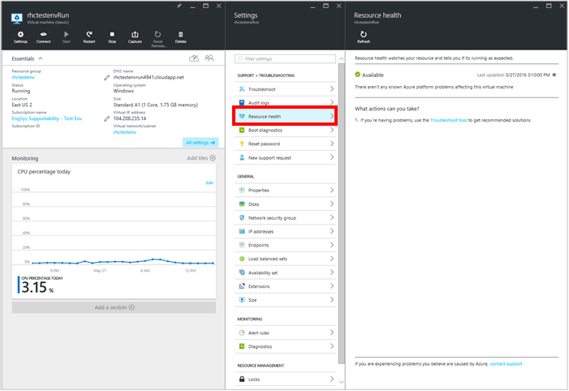
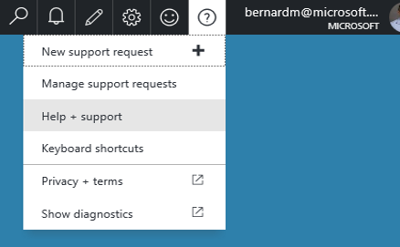
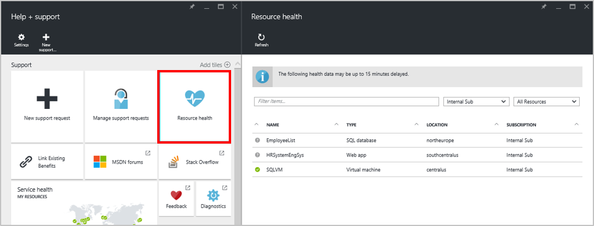
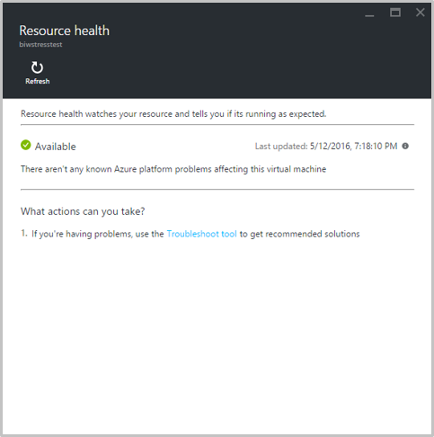
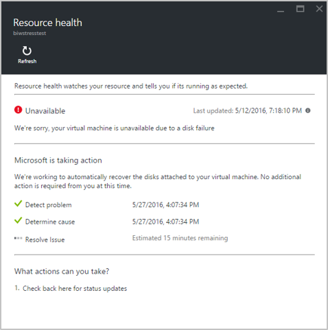
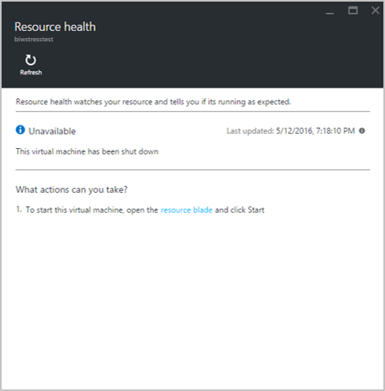
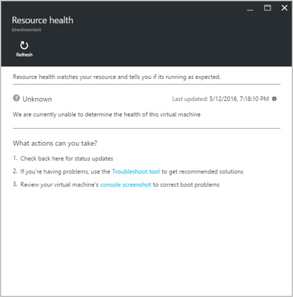
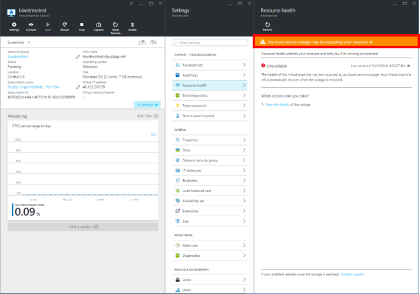

<properties
   pageTitle="Azure Ressourcenübersicht Gesundheit | Microsoft Azure"
   description="Übersicht über Zustand Azure-Ressourcen"
   services="Resource health"
   documentationCenter="dev-center-name"
   authors="BernardoAMunoz"
   manager=""
   editor=""/>

<tags
   ms.service="resource-health"
   ms.devlang="na"
   ms.topic="article"
   ms.tgt_pltfrm="na"
   ms.workload="Supportability"
   ms.date="06/01/2016"
   ms.author="BernardoAMunoz"/>

# Azure Ressourcenübersicht Dienststatus

Azure Ressource Gesundheit ist ein Dienst, der die Integrität des einzelne Azure Ressourcen stellt zahlreiche und enthält einige Hinweise zur Problembehandlung. Das Ziel für die Ressource Gesundheit werden in einen Cloud-Umgebung, an dem es möglich, direkten Zugriff auf Servern oder Infrastrukturelemente nicht, die Zeit reduzieren, Problembehandlung, Kunden widmen insbesondere Verringern der Zeit für bestimmen, wenn die die Ursache des Problems innerhalb der Anwendung ordnet oder dieses durch ein Ereignis innerhalb der Azure-Plattform verursacht wird.

## Was ist eine Ressource betrachtet und Funktionsweise von Ressourcen Gesundheit beschließt, wenn die Ressource fehlerfrei ist? 
Eine Ressource ist eine Benutzerinstanz erstellt einen Ressourcentyp bereitgestellten von einem Dienst, beispielsweise: eines virtuellen Computers, eine Web app oder einer SQL-Datenbank. 

Ressource Gesundheit beruht auf Signale durch die Ressource und/oder den Dienst ausgegeben, um festzustellen, ob eine Ressource fehlerfrei ist. Es ist wichtig, beachten Sie, dass aktuell Ressource Dienststatus nur Konten für die Integrität des eine bestimmte Ressource geben und andere Elemente, die zu den allgemeinen Zustand beitragen möglicherweise nicht berücksichtigt. Beispielsweise wird bei der Meldung, dass der Status eines virtuellen Computers, nur den Teil Berechnen der Infrastruktur in Betracht wird d. h. Probleme im Netzwerk nicht in Ressource-Dienststatus angezeigt werden, wenn deklarierte Dienst derzeit nicht zur Verfügung, in diesem Fall sollten sie über das Banner am oberen Rand der Blade einfach gefunden werden. Weitere Informationen zu Dienstausfall wird später in diesem Artikel angeboten. 

## Wie unterscheidet sich Ressource Gesundheit von-Dienststatus-Dashboard?

Die Angaben Ressource Gesundheit ist detaillierter als von-Dienststatus-Dashboard bereitgestellt werden. Während der SHD Ereignisse kommuniziert die beeinflussen, die Verfügbarkeit von einem Dienst in einem Bereich, Zustand Ressourcen macht Informationen in Bezug auf eine bestimmte Ressource, z. B. wird es Ereignisse die beeinflussen, die Verfügbarkeit von eines virtuellen Computers, eine Web app oder einer SQL-Datenbank verfügbar machen. Beispielsweise, wenn ein Knoten unerwartet neu gestartet, werden Kunden, deren virtuellen Computern auf diesem Knoten ausgeführt wurden, können auf den Grund zu erhalten, warum ihre virtuellen Computer für einen Zeitraum nicht verfügbar ist.   

## Zugreifen auf Ressourcen Dienststatus
Für die Dienste, die über Zustand Ressourcen verfügbar gibt es 2 Methoden zum Systemzustand Ressource zugreifen.

### Azure-Portal
Ressource Gesundheit vorher in der Azure-Portal enthält detaillierte Informationen über die Integrität der Ressource sowie empfohlene Aktionen, die den aktuellen Zustand der Ressource abhängig. Diese Blade bietet am besten bei der Abfrage Ressource Gesundheit, wie sie Zugriff auf andere Ressourcen innerhalb des Portals vereinfacht. Wie bereits erwähnt, variieren basierend auf den aktuellen Zustand der Satz von empfohlene Aktionen in der Ressource Gesundheit Blade:

* Fehlerfrei Ressourcen: Da kein Problem, bei dem die Integrität der Ressource beeinträchtigen kann nicht erkannt wurde, werden die Aktionen zu den Fortschritt der Problembehandlung helfen, konzentrieren. Angenommen, bietet es direkten Zugriff auf das Blade Problembehandlung, seiner Anleitungen, die am häufigsten auftretenden Probleme Kunden Smiley zu lösen.
* Fehlerhafte Ressource: für durch Azure verursachte Probleme, zeigt das Blade Aktionen Microsoft sehr (oder übernommen hat) zum Wiederherstellen der Ressource. Probleme, die durch Benutzer verursacht initiierte Aktionen der Blade wird eine Liste von Aktionen Kunden ausführen kann also das Problem zu beheben und Wiederherstellen die Ressource.  

Sobald Sie in der Azure-Portal angemeldet haben, gibt es zwei Methoden zum Zugreifen auf des Ressource Gesundheit Blades: 

###Öffnen Sie das Blade Ressource
Öffnen Sie das Blade Ressource für eine bestimmte Ressource an. Klicken Sie in den Einstellungen Blade, das neben dem Blade Ressource angezeigt wird auf Ressource Integrität das Ressource Gesundheit Blade zu öffnen. 

### Hilfe und Support blade
Öffnen Sie das Blade Hilfe und Support, indem auf das Fragezeichen in der oberen rechten Ecke klicken Hilfe + Unterstützung auswählen. 

**In der oberen Navigationsleiste**

Durch Klicken auf die Kachel wird das Ressource Gesundheit Abonnement Blade, das alle Ressourcen in Ihrem Abonnement auflisten wird geöffnet. Neben jeder Ressource befindet sich ein Symbol, deren Status angibt. Durch Klicken auf jede Ressource wird das Ressource Gesundheit Blade geöffnet werden.

**Ressource Gesundheit Kachel**

## Was bedeutet, dass meine Integritätsstatus Ressource?
Es gibt 4 verschiedenen Gesundheit Status, die für die Ressource angezeigt werden.

### Verfügbar
Der Dienst hat keine Probleme in der Plattform festgestellt, die die Verfügbarkeit der Ressource beeinträchtigen werden konnte. Dies wird durch ein Symbol für grünes Häkchen angezeigt. 

### Nicht verfügbar

In diesem Fall hat der Dienst einer laufenden Problem in die Plattform festgestellt, die beeinträchtigt die Verfügbarkeit der Ressource, z. B. der Knoten, auf dem der virtuellen Computer ausgeführt wurde, unerwartet neu gestartet. Dies wird durch ein rotes Symbol für Warnung angezeigt. Weitere Informationen zu dem Problem finden Sie im mittleren Bereich des Blades, einschließlich: 

1.  Welche Aktionen Microsoft zum Wiederherstellen der Ressource ausführt 
2.  Eine detaillierte Zeitachse des Problems, einschließlich der erwarteten Auflösungszeit
3.  Eine Liste empfohlene Aktionen für Benutzer 

### Nicht verfügbar – Kunden initiiert
Die Ressource ist aufgrund einer Anforderung Kunden, wie z. B. Beenden einer Ressource oder einen Vorschlag für einen Neustart nicht verfügbar. Dies wird durch ein Symbol für blauen informativen angezeigt. 

### Unbekannt
Der Dienst hat Informationen zu dieser Ressource für mehr als 5 Minuten nicht empfangen. Dies wird durch ein Symbol grauen Fragezeichen angezeigt. 

Es ist wichtig, beachten Sie, dass dies keiner endgültigen Angabe besteht darin, dass ein Problem mit einer Ressource, damit Kunden diese Empfehlungen folgen soll:

* Wenn die Ressource ausgeführt wird, wie erwartet, aber deren Status auf unbekannt im Gesundheitswesen Ressource festgelegt ist, keine Probleme vorliegen, und können Sie den Status der Ressource auf fehlerfrei nach ein paar Minuten aktualisieren erwartet.
* Wenn es gibt Probleme beim Zugriff auf die Ressource und deren Status auf unbekannt im Gesundheitswesen Ressource festgelegt ist, kann dies sollte frühen Angabe werden es könnte ein Problem und zusätzliche Untersuchungen geschehen, bis der Dienststatus auf entweder fehlerfrei oder fehlerhaft aktualisiert wird

## Dienst beeinträchtigen Ereignisse
Wenn die Ressource durch ein laufendes Service beeinträchtigen Ereignis beeinträchtigt werden kann, wird ein Banner am oberen Rand der Ressource Gesundheit Blade angezeigt. Indem Sie auf das Banner wird das Blade von Ereignissen geöffnet, das Weitere Informationen zu den einem Dienstausfall angezeigt werden.

## Was muss ich Ressource Gesundheit kennen?

### Signal Wartezeit
Die Videosignale, die Ressource Gesundheit feed, kann bis zu 15 Minuten verzögert werden, werden die Unterschiede zwischen den aktuellen Status der Ressource und der tatsächlichen Verfügbarkeit führen kann. Es ist wichtig, dies Bedenken wie hilft unnötig Zeit für bearbeitenden mögliche Probleme zu unterdrücken. 

### Spezielle Groß-/Kleinschreibung für SQL 
Ressource Integritätsberichte den Status der SQL-Datenbank, nicht auf dem SqlServer. Während dieser Routing vertraut ein weitere realistischeres Gesundheit Bild zur Verfügung steht, muss es mehrere Komponenten und Dienste in Betracht gezogen werden, um die Integrität der Datenbank zu bestimmen. Das aktuelle Signal beruht auf Benutzernamen in der Datenbank, was bedeutet, dass für Datenbanken, die empfangen regulären Benutzernamen (enthält unter anderem abfrageausführung Anfragen empfangen) die Integrität regelmäßig Status angezeigt werden soll. Wenn die Datenbank nicht für einen Zeitraum von 10 Minuten oder mehr zugegriffen wurde, wird es in der unbekannten Zustand verschoben werden. Dies bedeutet nicht, dass die Datenbank ist nicht verfügbar, nur, dass kein Signal ausgegeben wurde hat, da keine Benutzernamen durchgeführt wurden. Herstellen einer Verbindung mit der Datenbank und Ausführen einer Abfrage gibt die Videosignale zum Ermitteln und aktualisieren den Status der Datenbank erforderlich sind.

## Feedback
Es ist immer geöffnet, damit Sie Feedback und Vorschläge! Senden Sie uns Ihre [Vorschläge](https://feedback.azure.com/forums/266794-support-feedback). Darüber hinaus können Sie über [Twitter](https://twitter.com/azuresupport) oder den [MSDN-Foren](https://social.msdn.microsoft.com/Forums/azure)mit uns populärer.
