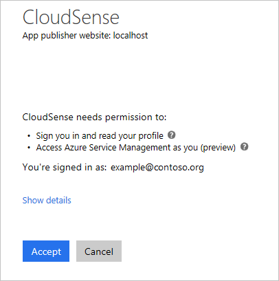

<properties 
   pageTitle="Active Directory-Authentifizierung und Ressourcenmanager | Microsoft Azure"
   description="Ein Entwickler-Leitfaden für Authentifizierung mit dem Azure Ressourcenmanager API und Active Directory für die Integration von einer app mit anderen Azure-Abonnements."
   services="azure-resource-manager,active-directory"
   documentationCenter="na"
   authors="dushyantgill"
   manager="timlt"
   editor="tysonn" />
<tags 
   ms.service="azure-resource-manager"
   ms.devlang="na"
   ms.topic="article"
   ms.tgt_pltfrm="na"
   ms.workload="identity"
   ms.date="08/31/2016"
   ms.author="dugill;tomfitz" />

# So Azure Active Directory und Ressourcenmanager verwenden, um einen Kunden Ressourcen verwalten

## Einführung

Wenn Sie Softwareentwickler, die eine app erstellen, die Kunden Azure Ressourcen verwaltet werden muss sind, zeigt in diesem Thema, wie die mit den Azure Ressourcenmanager APIs authentifizieren und Zugriff auf Ressourcen in anderen Abonnements. 

Ihre app kann die APIs Ressourcenmanager in verschiedene Arten zugreifen:

1. **Benutzer + Access app**: für apps, die im Auftrag eines Benutzers angemeldet Ressourcen zugreifen. Dieser Ansatz funktioniert für apps, wie etwa Web apps und Befehlszeile Tools, die nur "interaktive Verwaltung" Azure Ressourcen behandelt.
1. **App schreibgeschützten Zugriff**: für apps, die Daemon Services und geplante Aufträge ausgeführt werden. Identität des app wird direkten Zugriff auf die Ressourcen gewährt. Dieser Ansatz funktioniert für apps, die langfristig "offline" auf Azure zugreifen.

Dieses Thema enthält schrittweise Anweisungen für eine app erstellen, in der beiden Autorisierungsmethoden angewendet. Es zeigt, wie die einzelnen Schritte mit REST-API oder c# durchzuführen. Die vollständige ASP.NET-MVC-Anwendung ist unter [https://github.com/dushyantgill/VipSwapper/tree/master/CloudSense](https://github.com/dushyantgill/VipSwapper/tree/master/CloudSense)verfügbar.

Alle der Code für dieses Thema als Web app ausgeführt wird, die Sie am [http://vipswapper.azurewebsites.net/cloudsense](http://vipswapper.azurewebsites.net/cloudsense)ausprobieren können. 

## Was bedeutet, dass das Web app

Die Web-app:

1. Vorzeichen-in einen Azure-Benutzer.
2. Fordert Benutzer auf den app-Webzugriff auf Ressourcenmanager erteilen.
3. Ruft Benutzer + app Access Token für den Zugriff auf Ressourcen-Manager.
4. Ressourcenmanager anrufen und Zuweisen einer Rolle im Abonnement, das den app langfristiges-Zugriff auf das Abonnement haben des app Dienst Tilgungsanteile mithilfe Token (aus Schritt 3).
5. Ruft app schreibgeschützten Zugriff token.
6. Verwendet Token (aus Schritt 5) zum Verwalten von Ressourcen in das Abonnement bis Ressourcenmanager.

Hier ist der End-to-End-Fluss der Website ein.

Als Benutzer geben Sie die Abonnement-Id, für das Abonnement, das Sie verwenden möchten:

Wählen Sie das Konto für die Anmeldung verwenden.

Geben Sie Ihre Anmeldeinformationen ein.

Der app-Zugriff auf Ihre Azure-Abonnements zu gewähren:
 

 
Verwalten Sie Ihrer verbundenen Abonnements:

## Register-Anwendung

Bevor Sie beginnen, Schreiben von Code, registrieren Sie Web app mit Azure Active Directory (AD). Die app-Registrierung erstellt eine zentrale Identität für Ihre app in Azure AD an. Er enthält grundlegenden Informationen zu Ihrer Anwendung wie OAuth-Client-ID, Antworten URLs und Anmeldeinformationen, die die Anwendung zum Authentifizieren und den Zugriff Azure Ressourcenmanager APIs verwendet. Die app-Registrierung Einträge auch die verschiedenen delegierten Berechtigungen, die Microsoft-APIs im Namen des Benutzers den Zugriff auf eine Anwendung benötigt. 

Da Ihre app anderen Abonnements greift auf, müssen Sie es als eine Anwendung mit mehreren Mandanten konfigurieren. Damit die Validierung gültig bieten Sie eine Domäne mit Ihrer Active Directory verknüpft ist. Melden Sie sich zum Anzeigen der Domänen Ihrer Active Directory zugeordnet [klassischen-Portal](https://manage.windowsazure.com)an. Wählen Sie Ihr Active Directory aus, und wählen Sie dann **Domänen**.

Im folgenden Beispiel wird gezeigt, wie die app mithilfe der PowerShell Azure registrieren. Sie müssen die neueste Version (August 2016) von Azure PowerShell für diesen Befehl arbeiten können. 

    $app = New-AzureRmADApplication -DisplayName "{app name}" -HomePage "https://{your domain}/{app name}" -IdentifierUris "https://{your domain}/{app name}" -Password "{your password}" -AvailableToOtherTenants $true
    
Zum Melden Sie sich, wie die AD-Anwendung, benötigen Sie die Anwendung-Id und das Kennwort ein. Verwenden Sie zum Anzeigen der Id der Anwendung, die aus dem vorherigen Befehl zurückgegeben wird:

    $app.ApplicationId

Im folgenden Beispiel wird gezeigt, wie die app mit Azure CLI registrieren. 

    azure ad app create --name {app name} --home-page https://{your domain}/{app name} --identifier-uris https://{your domain}/{app name} --password {your password} --available true

Die Ergebnisse enthalten die AppId, die Sie bei der Authentifizierung als die Anwendung müssen.

### Optionale Konfiguration - Zertifikat Anmeldeinformationen

Azure AD Zertifikatanmeldeinformationen auch für Applikationen unterstützt: Sie ein selbst signiertes Zertifikat erstellen, behalten Sie den privaten Schlüssel und den öffentlichen Schlüssel in der Registrierung Ihrer Azure AD-Anwendung hinzufügen. Für die Authentifizierung Ihrer Anwendung sendet eine kleine Nutzlast an Azure AD mit Ihrem privaten Schlüssel signiertes und Azure AD überprüft die Signatur, die mit dem öffentlichen Schlüssel, den Sie registriert.

Informationen zum Erstellen einer AD-app mit einem Zertifikat finden Sie unter [Verwenden von Azure PowerShell keinen Zugriff auf Ressourcen Hauptbenutzer Dienst erstellen](resource-group-authenticate-service-principal.md#create-service-principal-with-certificate) oder [Verwenden Azure CLI Erstellen eines Diensts Hauptbenutzer Zugriff auf Ressourcen](resource-group-authenticate-service-principal-cli.md#create-service-principal-with-certificate).

## Abrufen von Mandanten-Id aus Abonnement-id

Um ein Token anfordern, die zum Aufrufen der Ressourcenmanager verwendet werden können, muss eine Anwendung die Mandanten-ID den Azure AD-Mandanten kennen, die das Abonnement Azure hostet. In den meisten Fällen die Benutzer ihre Abonnement-Ids kennen, aber sie möglicherweise nicht kennen ihren Mandanten Ids für Active Directory. Um Mandanten-Id des Benutzers zu erhalten, bitten Sie den Benutzer für die Abonnement-Id ein. Geben Sie die Abonnement-Id beim Senden einer Anforderung über das Abonnement:

    https://management.azure.com/subscriptions/{subscription-id}?api-version=2015-01-01

Die Anforderung schlägt fehl, da der Benutzer nicht noch angemeldet hat, aber Sie die Mandanten-Id, aus der Antwort abrufen können. Rufen Sie in diese Ausnahme die Mandanten-Id aus der Antwort Kopfzeile Wert für **"Www" authentifizieren**ein. Diese Implementierung in der Methode [GetDirectoryForSubscription](https://github.com/dushyantgill/VipSwapper/blob/master/CloudSense/CloudSense/AzureResourceManagerUtil.cs#L20) angezeigt.

## Abrufen von Benutzer + app Access token

Die Anwendung leitet den Benutzer zur Azure AD mit einer OAuth 2.0 autorisieren anfordern - Authentifizierung die Anmeldeinformationen des Benutzers und wieder einen Autorisierungscode. Eine Anwendung verwendet den Autorisierungscode, um eine Access token für Ressourcenmanager abzurufen. Die Methode [ConnectSubscription](https://github.com/dushyantgill/VipSwapper/blob/master/CloudSense/CloudSense/Controllers/HomeController.cs#L42) erstellt die Autorisierung Anforderung an.

In diesem Thema wird die REST-API Anfragen zum Authentifizieren des Benutzers an. Helper Bibliotheken können Sie auch im Code Authentifizierung durchzuführen. Weitere Informationen zu diesen Bibliotheken finden Sie unter [Azure Active Directory-Authentifizierung Bibliotheken](./active-directory/active-directory-authentication-libraries.md). Leitfaden für die zur Integration von Identitätsmanagement in einer Anwendung finden Sie unter [Azure Active Directory developer's Guide](./active-directory/active-directory-developers-guide.md).

### Autorisierende Anforderung (OAuth 2.0)

Geben Sie an den Endpunkt Azure AD autorisieren aus einer geöffneten ID verbinden/OAuth2.0 autorisieren anfordern:

    https://login.microsoftonline.com/{tenant-id}/OAuth2/Authorize

Die Abfragezeichenfolgenparameter, die für diese Anforderung verfügbar sind, werden im Thema [Anforderung einer Autorisierungscode](./active-directory/active-directory-protocols-oauth-code.md#request-an-authorization-code) beschrieben.

Im folgenden Beispiel wird gezeigt, wie OAuth2.0 Autorisierung anfordern:

    https://login.microsoftonline.com/{tenant-id}/OAuth2/Authorize?client_id=a0448380-c346-4f9f-b897-c18733de9394&response_mode=query&response_type=code&redirect_uri=http%3a%2f%2fwww.vipswapper.com%2fcloudsense%2fAccount%2fSignIn&resource=https%3a%2f%2fgraph.windows.net%2f&domain_hint=live.com

Azure AD authentifiziert den Benutzer, und, falls erforderlich, fordert den Benutzer bei der app erteilt. Den Autorisierungscode zurückgegeben an die URL Ihrer Anwendung Antwort. Je nach entweder die angeforderten Response_mode, Azure AD sendet die Daten wieder in der Abfragezeichenfolge oder als Post-Daten.

    code=AAABAAAAiL****FDMZBUwZ8eCAA&session_state=2d16bbce-d5d1-443f-acdf-75f6b0ce8850

### Autorisierende Anforderung (Open-ID verbinden)

Wenn Sie nicht nur Azure Ressourcenmanager im Namen des Benutzers zugreifen möchten, aber auch dem Benutzer an Ihrer Anwendung ermöglicht, mit deren Azure AD-Konto anmelden, Emission eines geöffneten ID verbinden autorisieren anfordern. Mit der Open-ID verbinden empfängt die Anwendung auch eine Id_token aus Azure Active Directory, die Ihre app verwenden können, in dem Benutzer anmelden.

Die Abfragezeichenfolgenparameter, die für diese Anforderung verfügbar sind, werden im Thema [Senden Sie die Anfrage Anmeldung](./active-directory/active-directory-protocols-openid-connect-code.md#send-the-sign-in-request) beschrieben.

Eine Beispiel für eine Open-ID verbinden Anforderung lautet:

     https://login.microsoftonline.com/{tenant-id}/OAuth2/Authorize?client_id=a0448380-c346-4f9f-b897-c18733de9394&response_mode=form_post&response_type=code+id_token&redirect_uri=http%3a%2f%2fwww.vipswapper.com%2fcloudsense%2fAccount%2fSignIn&resource=https%3a%2f%2fgraph.windows.net%2f&scope=openid+profile&nonce=63567Dc4MDAw&domain_hint=live.com&state=M_12tMyKaM8

Azure AD authentifiziert den Benutzer, und, falls notwendig, fordert den Benutzer bei der app erteilt. Den Autorisierungscode zurückgegeben an die URL Ihrer Anwendung Antwort. Je nach entweder die angeforderten Response_mode, Azure AD sendet die Daten wieder in der Abfragezeichenfolge oder als Post-Daten.

Beispiel für Open-ID verbinden Antwort lautet:

    code=AAABAAAAiL*****I4rDWd7zXsH6WUjlkIEQxIAA&id_token=eyJ0eXAiOiJKV1Q*****T3GrzzSFxg&state=M_12tMyKaM8&session_state=2d16bbce-d5d1-443f-acdf-75f6b0ce8850

### Token Anforderung (OAuth2.0 Code erteilen Datenfluss)

Nachdem Sie nun eine Anwendung den Autorisierungscode aus Azure AD erhalten haben, ist es Zeit Zugriff token für Azure Ressourcenmanager.  Bereitstellen einer OAuth2.0 Code gewähren des Sicherheitstokens anfordern, die an den Endpunkt Azure AD Token: 

    https://login.microsoftonline.com/{tenant-id}/OAuth2/Token

Die Abfragezeichenfolgenparameter, die für diese Anforderung verfügbar sind, werden im Thema [Verwenden Sie den Autorisierungscode](./active-directory/active-directory-protocols-oauth-code.md#use-the-authorization-code-to-request-an-access-token) beschrieben.

Im folgenden Beispiel wird eine Anforderung für Code erteilen Token mit Kennwort Anmeldeinformationen:

    POST https://login.microsoftonline.com/7fe877e6-a150-4992-bbfe-f517e304dfa0/oauth2/token HTTP/1.1

    Content-Type: application/x-www-form-urlencoded
    Content-Length: 1012

    grant_type=authorization_code&code=AAABAAAAiL9Kn2Z*****L1nVMH3Z5ESiAA&redirect_uri=http%3A%2F%2Flocalhost%3A62080%2FAccount%2FSignIn&client_id=a0448380-c346-4f9f-b897-c18733de9394&client_secret=olna84E8*****goScOg%3D

Bei der Arbeit mit Zertifikatanmeldeinformationen Erstellen einer JSON Web Token (JWT) und melden Sie sich (RSA SHA256) mit den privaten Schlüssel Ihrer Anwendung Zertifikat Anmeldeinformationen. In [JWT token Ansprüche](./active-directory/active-directory-protocols-oauth-code.md#jwt-token-claims)sind die Ansprüche für das Token aufgeführt. Referenz finden Sie unter den [Active Directory autorisierende Bibliothek (.NET) Code](https://github.com/AzureAD/azure-activedirectory-library-for-dotnet/blob/dev/src/ADAL.PCL.Desktop/CryptographyHelper.cs) Client Assertion JWT Token anmelden.

Finden Sie in der [geöffneten ID verbinden Spezifikation](http://openid.net/specs/openid-connect-core-1_0.html#ClientAuthentication) Details auf Client-Authentifizierung. 

Im folgenden Beispiel wird eine Anforderung für Code erteilen Token mit Zertifikat Anmeldeinformationen:

    POST https://login.microsoftonline.com/7fe877e6-a150-4992-bbfe-f517e304dfa0/oauth2/token HTTP/1.1
    
    Content-Type: application/x-www-form-urlencoded
    Content-Length: 1012
    
    grant_type=authorization_code&code=AAABAAAAiL9Kn2Z*****L1nVMH3Z5ESiAA&redirect_uri=http%3A%2F%2Flocalhost%3A62080%2FAccount%2FSignIn&client_id=a0448380-c346-4f9f-b897-c18733de9394&client_assertion_type=urn%3Aietf%3Aparams%3Aoauth%3Aclient-assertion-type%3Ajwt-bearer&client_assertion=eyJhbG*****Y9cYo8nEjMyA

Eine Beispielantwort für Code gewähren Token: 

    HTTP/1.1 200 OK

    {"token_type":"Bearer","expires_in":"3599","expires_on":"1432039858","not_before":"1432035958","resource":"https://management.core.windows.net/","access_token":"eyJ0eXAiOiJKV1Q****M7Cw6JWtfY2lGc5A","refresh_token":"AAABAAAAiL9Kn2Z****55j-sjnyYgAA","scope":"user_impersonation","id_token":"eyJ0eXAiOiJKV*****-drP1J3P-HnHi9Rr46kGZnukEBH4dsg"}

#### Behandeln von Code gewähren des Sicherheitstokens Antwort

Eine erfolgreiche token Antwort enthält (Benutzer + app) Access Token für Azure-Manager. Die Anwendung mithilfe dieses Token Access Ressourcenmanager im Namen des Benutzers zugreifen. Die Gültigkeitsdauer von Access Token ausgestellt von Azure AD ist eine Stunde. Es ist wahrscheinlich nicht, dass die Webanwendung (Benutzer + app) erneuern muss Access Token. Wenn sie das Access-Token erneuern muss, verwenden Sie das Token aktualisieren, das die Anwendung in der token Antwort empfängt. Bereitstellen einer OAuth2.0 Token anfordern an den Endpunkt Azure AD Token: 

    https://login.microsoftonline.com/{tenant-id}/OAuth2/Token

Die Parameter zur Verwendung mit der Anfrage aktualisieren werden in [der Access-Token aktualisieren](./active-directory/active-directory-protocols-oauth-code.md#refreshing-the-access-tokens)beschrieben.

Im folgenden Beispiel wird so verwenden Sie die Aktualisierung token:

    POST https://login.microsoftonline.com/7fe877e6-a150-4992-bbfe-f517e304dfa0/oauth2/token HTTP/1.1

    Content-Type: application/x-www-form-urlencoded
    Content-Length: 1012

    grant_type=refresh_token&refresh_token=AAABAAAAiL9Kn2Z****55j-sjnyYgAA&client_id=a0448380-c346-4f9f-b897-c18733de9394&client_secret=olna84E8*****goScOg%3D

Obwohl aktualisieren Token zum neuen Access Token für Azure Ressourcenmanager abrufen verwendet werden können, sind sie nicht für den Offlinezugriff nach Ihrer Anwendung geeignet. Die Aktualisierung Token Lebensdauer ist begrenzt und aktualisieren Token für den Benutzer gebunden sind. Wenn der Benutzer die Organisation verlässt, verliert die Anwendung, die mit dem Token aktualisieren Access aus. Dieser Ansatz ist nicht geeignet für Applikationen, die von Teams zum Verwalten ihrer Azure Ressourcen verwendet werden.

## Überprüfen Sie, ob Benutzer Access Abonnement zuordnen können

Ihre Anwendung wird jetzt hat ein Token Azure Ressourcenmanager im Namen des Benutzers Zugriff auf. Im nächste Schritt wird die app in das Abonnement verbunden. Nach dem Herstellen der Verbindung kann Ihre app diese Abonnements verwalten, auch wenn der Benutzer nicht vorhanden ist (langfristiges Offlinezugriff). 

Rufen Sie für jedes Abonnement Verbindung, [Listenberechtigungen Ressourcenmanager](https://msdn.microsoft.com/library/azure/dn906889.aspx) API feststellen, ob der Benutzer die Verwaltung der Zugriffsrechte für das Abonnement verfügt.

Die [UserCanManagerAccessForSubscription](https://github.com/dushyantgill/VipSwapper/blob/master/CloudSense/CloudSense/AzureResourceManagerUtil.cs#L44) -Methode der app Stichprobe ASP.NET-MVC implementiert dieser Anruf.

Im folgenden Beispiel wird gezeigt, wie Berechtigungen für ein Abonnement eines Benutzers anfordern. 83cfe939-2402-4581-b761-4f59b0a041e4 ist die Id des Abonnements.

    GET https://management.azure.com/subscriptions/83cfe939-2402-4581-b761-4f59b0a041e4/providers/microsoft.authorization/permissions?api-version=2015-07-01 HTTP/1.1

    Authorization: Bearer eyJ0eXAiOiJKV1QiLC***lwO1mM7Cw6JWtfY2lGc5A

Ist ein Beispiel der Antwort an den Berechtigungen des Benutzers auf Abonnement zu erhalten:

    HTTP/1.1 200 OK

    {"value":[{"actions":["*"],"notActions":["Microsoft.Authorization/*/Write","Microsoft.Authorization/*/Delete"]},{"actions":["*/read"],"notActions":[]}]}

Die Berechtigungen API gibt mehrere Berechtigungen. Jede Berechtigung besteht aus zulässigen Aktionen (Aktionen) und erlaubt Aktionen (Notactions). Wenn eine Aktion in der Liste zulässige Aktionen alle Berechtigungstyp vorhanden und in der Liste Notactions dieser Berechtigung nicht vorhanden ist, wird der Benutzer zum Durchführen der Aktion zulässig. **Microsoft.Authorization/RoleAssignments/Write** handelt es sich um die Aktion, die Verwaltung von Informationsrechten Zugriff gewährt. Das Ergebnis der Berechtigungen für eine Übereinstimmung Regex auf diese Aktionszeichenfolge in die Aktionen und Notactions der einzelnen Berechtigungen aussehen muss Ihrer Anwendung analysiert werden.

## Abrufen von app schreibgeschützten Zugriff token

Nun wissen Sie, wenn der Benutzer das Abonnement Azure Access zuordnen kann. Die nächsten Schritte sind:

1. Ihrer Anwendung Identität auf das Abonnement die entsprechende RBAC-Rolle zuweisen.
2. Überprüfen Sie die Access-Zuordnung Abfragen nach der Anwendung von Berechtigungen auf das Abonnement oder den Zugriff auf Ressourcenmanager app nur Token verwenden.
1. Zeichnen Sie die Verbindung in der Datenstruktur Applications "verbundenen Abonnements" – die Id des Abonnements beibehalten.

Sehen wir uns näher beim ersten Schritt. Um der Anwendung Identität die entsprechende RBAC-Rolle zuzuweisen, müssen Sie Folgendes festlegen:

- Die Objekt-Id der Identität des Benutzers Azure Active Directory Ihrer Anwendung
- Der Bezeichner des RBAC-Rolle, die die Anwendung auf das Abonnement erforderlich ist.

Bei der Anwendung ein Benutzers aus einer Azure Active Directory authentifiziert, wird ein Dienst Hauptbenutzer Objekt für eine Anwendung in dieser Azure Active Directory erstellt. Azure ermöglicht RBAC-Rollen, Dienst Hauptbenutzer zugewiesen werden soll, den direkten Zugriff auf die entsprechende Applikationen auf Azure Ressourcen gewähren. Diese Aktion ist genau an, was wir tun möchten. Die Azure AD Graph-API einer Abfrage in der der Dienst Tilgungsanteile Ihrer Anwendung in der angemeldeten Benutzer-ID zu ermitteln ist Azure AD an.

Sie haben eine Access-Token nur für Azure Ressourcenmanager – benötigen Sie ein neues Access Token die Azure AD Graph-API aufrufen. Jede Azure AD-Anwendung verfügt über die Berechtigung ein eigenen Dienst Hauptbenutzer Objekt, Abfragen, damit eine app schreibgeschützten Zugriffstoken ausreicht.

<a id="app-azure-ad-graph">
### Abrufen von token app schreibgeschützten Zugriff für Azure AD Graph-API

Um Ihre app authentifizieren und ein Token Azure AD Graph-API erhalten, senden Sie eine Client Anmeldeinformationen erteilen OAuth2.0 Fluss token Anforderung an alle token Azure AD-Endpunkt (**https://login.microsoftonline.com/ {Directory_domain_name} / OAuth2/Token**) aus.

Die [GetObjectIdOfServicePrincipalInOrganization](https://github.com/dushyantgill/VipSwapper/blob/master/CloudSense/CloudSense/AzureADGraphAPIUtil.cs) -Methode der Stichprobe ASP.NET-MVC-Anwendung ruft eine app schreibgeschützten Zugriff token für Graph-API mit der Active Directory-Authentifizierungsbibliothek für .NET.

Die Abfragezeichenfolgenparameter, die für diese Anforderung verfügbar sind, werden im Thema [Anforderung einer Access-Token](./active-directory/active-directory-protocols-oauth-service-to-service.md#request-an-access-token) beschrieben.

Eine Beispiel für eine Anforderung für Client-Anmeldeinformationen Token zu gewähren: 

    POST https://login.microsoftonline.com/62e173e9-301e-423e-bcd4-29121ec1aa24/oauth2/token HTTP/1.1
    Content-Type: application/x-www-form-urlencoded
    Content-Length: 187</pre>
    <pre>grant_type=client_credentials&client_id=a0448380-c346-4f9f-b897-c18733de9394&resource=https%3A%2F%2Fgraph.windows.net%2F &client_secret=olna8C*****Og%3D

Eine Beispielantwort für Client-Anmeldeinformationen Token zu gewähren: 

    HTTP/1.1 200 OK

    {"token_type":"Bearer","expires_in":"3599","expires_on":"1432039862","not_before":"1432035962","resource":"https://graph.windows.net/","access_token":"eyJ0eXAiOiJKV1QiLCJhbGciOiJSUzI1NiIsIng1dCI6Ik1uQ19WWmNBVGZNNXBPWWlKSE1iYTlnb0VLWSIsImtpZCI6Ik1uQ19WWmNBVGZNNXBPWWlKSE1iYTlnb0VLWSJ9.eyJhdWQiOiJodHRwczovL2dyYXBoLndpbmRv****G5gUTV-kKorR-pg"}

### Abrufen von ObjectId der Anwendung Dienst Tilgungsanteile in Azure AD-Benutzer

Nun mithilfe des app schreibgeschützten Zugriffstokens Abfragen [Hauptbenutzer Azure AD Graph-Service](https://msdn.microsoft.com/Library/Azure/Ad/Graph/api/entity-and-complex-type-reference#serviceprincipal-entity) -API, um die Objekt-Id des der Anwendung Dienst Hauptbenutzer im Verzeichnis zu ermitteln.

Die Methode [GetObjectIdOfServicePrincipalInOrganization](https://github.com/dushyantgill/VipSwapper/blob/master/CloudSense/CloudSense/AzureADGraphAPIUtil.cs#) der Stichprobe ASP.NET-MVC-Anwendung implementiert dieser Anruf.

Im folgenden Beispiel wird veranschaulicht, wie der Anwendung Dienst Tilgungsanteile anfordern. a0448380-c346-4f9f-b897-c18733de9394 ist die Client-Id der Anwendung.

    GET https://graph.windows.net/62e173e9-301e-423e-bcd4-29121ec1aa24/servicePrincipals?api-version=1.5&$filter=appId%20eq%20'a0448380-c346-4f9f-b897-c18733de9394' HTTP/1.1

    Authorization: Bearer eyJ0eXAiOiJK*****-kKorR-pg

Im folgenden Beispiel wird eine Antwort auf die Anfrage für die Anwendung Dienst Hauptbenutzer 

    HTTP/1.1 200 OK

    {"odata.metadata":"https://graph.windows.net/62e173e9-301e-423e-bcd4-29121ec1aa24/$metadata#directoryObjects/Microsoft.DirectoryServices.ServicePrincipal","value":[{"odata.type":"Microsoft.DirectoryServices.ServicePrincipal","objectType":"ServicePrincipal","objectId":"9b5018d4-6951-42ed-8a92-f11ec283ccec","deletionTimestamp":null,"accountEnabled":true,"appDisplayName":"CloudSense","appId":"a0448380-c346-4f9f-b897-c18733de9394","appOwnerTenantId":"62e173e9-301e-423e-bcd4-29121ec1aa24","appRoleAssignmentRequired":false,"appRoles":[],"displayName":"CloudSense","errorUrl":null,"homepage":"http://www.vipswapper.com/cloudsense","keyCredentials":[],"logoutUrl":null,"oauth2Permissions":[{"adminConsentDescription":"Allow the application to access CloudSense on behalf of the signed-in user.","adminConsentDisplayName":"Access CloudSense","id":"b7b7338e-683a-4796-b95e-60c10380de1c","isEnabled":true,"type":"User","userConsentDescription":"Allow the application to access CloudSense on your behalf.","userConsentDisplayName":"Access CloudSense","value":"user_impersonation"}],"passwordCredentials":[],"preferredTokenSigningKeyThumbprint":null,"publisherName":"vipswapper"quot;,"replyUrls":["http://www.vipswapper.com/cloudsense","http://www.vipswapper.com","http://vipswapper.com","http://vipswapper.azurewebsites.net","http://localhost:62080"],"samlMetadataUrl":null,"servicePrincipalNames":["http://www.vipswapper.com/cloudsense","a0448380-c346-4f9f-b897-c18733de9394"],"tags":["WindowsAzureActiveDirectoryIntegratedApp"]}]}

### Abrufen von Azure RBAC Rollenbezeichner

Wenn Sie dem Dienst Hauptbenutzer die entsprechende RBAC-Rolle zuweisen, müssen Sie den Bezeichner der Rolle Azure RBAC ermitteln.

Die richtigen RBAC Rolle für eine Anwendung:

- Wenn eine Anwendung nur-Abonnement, überwacht ohne Änderungen vorgenommen werden, ist es nur Leseberechtigungen für das Abonnement erforderlich. Weisen Sie die Rolle **Leser** ein.
- Wenn eine Anwendung Azure Abonnement, Erstellen/Ändern/Löschen von Personen verwaltet werden ist einer der Mitwirkender Berechtigungen erforderlich.
  - Um einen bestimmten Typ von Ressourcen zu verwalten, weisen Sie die Ressource-spezifische Mitwirkender Rollen (virtuellen Computern Mitwirkender, virtuelle Netzwerk Mitwirkender, Speicher Konto Mitwirkender usw.)
  - Zum Verwalten von einem beliebigen Ressourcenart weisen Sie die Rolle " **Mitwirkender** " aus.

Die rollenzuweisung für eine Anwendung ist Benutzer, sollten Sie die kleinste erforderlich Berechtigung sichtbar.

Rufen Sie die [Ressourcenmanager Rollendefinition API](https://msdn.microsoft.com/library/azure/dn906879.aspx) , um eine Liste aller Azure RBAC-Rollen und suchen, und klicken Sie dann durchlaufen Sie das Ergebnis, um die gewünschte Rollendefinition anhand des Namens zu finden.

Die [GetRoleId](https://github.com/dushyantgill/VipSwapper/blob/master/CloudSense/CloudSense/AzureResourceManagerUtil.cs#L246) -Methode der app Stichprobe ASP.NET-MVC implementiert dieser Anruf.

Im folgenden Beispiel der Anfrage veranschaulicht Azure RBAC Rollenbezeichner abzurufen. 09cbd307-aa71-4aca-b346-5f253e6e3ebb ist die Id des Abonnements.

    GET https://management.azure.com/subscriptions/09cbd307-aa71-4aca-b346-5f253e6e3ebb/providers/Microsoft.Authorization/roleDefinitions?api-version=2015-07-01 HTTP/1.1

    Authorization: Bearer eyJ0eXAiOiJKV*****fY2lGc5

Die Antwort wird in folgendem Format: 

    HTTP/1.1 200 OK

    {"value":[{"properties":{"roleName":"API Management Service Contributor","type":"BuiltInRole","description":"Lets you manage API Management services, but not access to them.","scope":"/","permissions":[{"actions":["Microsoft.ApiManagement/Services/*","Microsoft.Authorization/*/read","Microsoft.Resources/subscriptions/resources/read","Microsoft.Resources/subscriptions/resourceGroups/read","Microsoft.Resources/subscriptions/resourceGroups/resources/read","Microsoft.Resources/subscriptions/resourceGroups/deployments/*","Microsoft.Insights/alertRules/*","Microsoft.Support/*"],"notActions":[]}]},"id":"/subscriptions/09cbd307-aa71-4aca-b346-5f253e6e3ebb/providers/Microsoft.Authorization/roleDefinitions/312a565d-c81f-4fd8-895a-4e21e48d571c","type":"Microsoft.Authorization/roleDefinitions","name":"312a565d-c81f-4fd8-895a-4e21e48d571c"},{"properties":{"roleName":"Application Insights Component Contributor","type":"BuiltInRole","description":"Lets you manage Application Insights components, but not access to them.","scope":"/","permissions":[{"actions":["Microsoft.Insights/components/*","Microsoft.Insights/webtests/*","Microsoft.Authorization/*/read","Microsoft.Resources/subscriptions/resources/read","Microsoft.Resources/subscriptions/resourceGroups/read","Microsoft.Resources/subscriptions/resourceGroups/resources/read","Microsoft.Resources/subscriptions/resourceGroups/deployments/*","Microsoft.Insights/alertRules/*","Microsoft.Support/*"],"notActions":[]}]},"id":"/subscriptions/09cbd307-aa71-4aca-b346-5f253e6e3ebb/providers/Microsoft.Authorization/roleDefinitions/ae349356-3a1b-4a5e-921d-050484c6347e","type":"Microsoft.Authorization/roleDefinitions","name":"ae349356-3a1b-4a5e-921d-050484c6347e"}]}

Sie müssen nicht diese API kontinuierlichen Produktlizenzierung anrufen. Nachdem Sie die bekannte GUID der Rollendefinition bestimmt haben, können Sie die Rollen Definition-Id als erstellen:

    /subscriptions/{subscription_id}/providers/Microsoft.Authorization/roleDefinitions/{well-known-role-guid}

Hier sind die bekannten Guids von häufig verwendeten integrierte Rollen:

| Rolle | GUID |
| ----- | ------ |
| Reader | acdd72a7-3385-48ef-bd42-f606fba81ae7
| Mitwirkenden | b24988ac-6180-42a0-ab88-20f7382dd24c
| Mitwirkender virtuellen Computern | d73bb868-a0df-4d4d-bd69-98a00b01fccb
| Virtuelle Netzwerk Mitwirkender | b34d265f-36f7-4a0d-a4d4-e158ca92e90f
| Mitwirkender für Speicher-Konto | 86e8f5dc-a6e9-4c67-9d15-de283e8eac25
| Website Mitwirkender | de139f84-1756-47ae-9be6-808fbbe84772
| Web Plan Mitwirkender | 2cc479cb-7b4d-49a8-b449-8c00fd0f0a4b
| SQL Server-Teilnehmer | 6d8ee4ec-f05a-4a1d-8b00-a9b17e38b437
| SQL-DB Mitwirkender | 9b7fa17d-e63e-47b0-bb0a-15c516ac86ec

### Anwendung RBAC-Rolle zuweisen

Sie verfügen über alles, was Sie zu Ihrem Dienst Hauptbenutzer die entsprechende RBAC-Rolle zuweisen, mithilfe der [Ressourcenmanager erstellen rollenzuweisung](https://msdn.microsoft.com/library/azure/dn906887.aspx) API benötigen.

Die [GrantRoleToServicePrincipalOnSubscription](https://github.com/dushyantgill/VipSwapper/blob/master/CloudSense/CloudSense/AzureResourceManagerUtil.cs#L170) -Methode der app Stichprobe ASP.NET-MVC implementiert dieser Anruf.

Ein Beispiel für eine Anforderung Anwendung RBAC-Rolle zuzuweisen: 

    PUT https://management.azure.com/subscriptions/09cbd307-aa71-4aca-b346-5f253e6e3ebb/providers/microsoft.authorization/roleassignments/4f87261d-2816-465d-8311-70a27558df4c?api-version=2015-07-01 HTTP/1.1

    Authorization: Bearer eyJ0eXAiOiJKV1QiL*****FlwO1mM7Cw6JWtfY2lGc5
    Content-Type: application/json
    Content-Length: 230

    {"properties": {"roleDefinitionId":"/subscriptions/09cbd307-aa71-4aca-b346-5f253e6e3ebb/providers/Microsoft.Authorization/roleDefinitions/acdd72a7-3385-48ef-bd42-f606fba81ae7","principalId":"c3097b31-7309-4c59-b4e3-770f8406bad2"}}

In der Besprechungsanfrage sind die folgenden Werte verwendet:

| GUID | Beschreibung |
| ------ | --------- |
| 09cbd307-aa71-4aca-b346-5f253e6e3ebb | die Id des Abonnements
| c3097b31-7309-4c59-b4e3-770f8406bad2 | die Objekt-Id aus dem Dienst-Prinzip der Anwendung
| acdd72a7-3385-48ef-bd42-f606fba81ae7 | die Id des Rolle
| 4f87261d-2816-465d-8311-70a27558df4c | eine neue Guid für die neue Rolle Zuordnung erstellt wurden.

Die Antwort wird in folgendem Format: 

    HTTP/1.1 201 Created

    {"properties":{"roleDefinitionId":"/subscriptions/09cbd307-aa71-4aca-b346-5f253e6e3ebb/providers/Microsoft.Authorization/roleDefinitions/acdd72a7-3385-48ef-bd42-f606fba81ae7","principalId":"c3097b31-7309-4c59-b4e3-770f8406bad2","scope":"/subscriptions/09cbd307-aa71-4aca-b346-5f253e6e3ebb"},"id":"/subscriptions/09cbd307-aa71-4aca-b346-5f253e6e3ebb/providers/Microsoft.Authorization/roleAssignments/4f87261d-2816-465d-8311-70a27558df4c","type":"Microsoft.Authorization/roleAssignments","name":"4f87261d-2816-465d-8311-70a27558df4c"}

### Abrufen von app schreibgeschützten Zugriff token für Azure Ressourcenmanager

Um zu überprüfen, die app hat den gewünschten Zugriff auf das Abonnement, führen Sie eine Testaufgabe auf das Abonnement mithilfe einer app nur Token.

Wenn Sie eine app schreibgeschützten Zugriff token erhalten möchten, Anweisungen Sie Abschnitts [app schreibgeschützten Zugriff für Azure AD Graph-API token erhalten](#app-azure-ad-graph), mit einem anderen Wert für die Ressource Parameter: 

    https://management.core.windows.net/

Die [ServicePrincipalHasReadAccessToSubscription](https://github.com/dushyantgill/VipSwapper/blob/master/CloudSense/CloudSense/AzureResourceManagerUtil.cs#L110) -Methode der Stichprobe ASP.NET-MVC-Anwendung erhält eine app schreibgeschützten Zugriff token für Azure Ressourcenmanager mit Active Directory-Authentifizierung Library für .net.

#### Holen Sie die Berechtigungen der Anwendung auf Abonnement

Um zu überprüfen, dass die Anwendung den gewünschten Zugriff auf ein Azure-Abonnement verfügt, können Sie auch [Ressourcenmanager Berechtigungen](https://msdn.microsoft.com/library/azure/dn906889.aspx) API aufrufen. Dieser Ansatz ist ähnlich wie Sie bestimmt, ob der Benutzer Access Verwaltung von Informationsrechten für das Abonnement. Rufen Sie jedoch diesmal die Berechtigungen API mit der app schreibgeschützten Zugriffstoken, das Sie im vorherigen Schritt zu erhalten.

Die [ServicePrincipalHasReadAccessToSubscription](https://github.com/dushyantgill/VipSwapper/blob/master/CloudSense/CloudSense/AzureResourceManagerUtil.cs#L110) -Methode der app Stichprobe ASP.NET-MVC implementiert dieser Anruf.

## Verwalten von verbundenen Abonnements

Wenn die entsprechende RBAC Rolle in Ihrer Anwendung Service Hauptbenutzer auf das Abonnement zugeordnet ist, kann eine Anwendung Überwachung/es mithilfe der app schreibgeschützten Zugriffstoken für Azure Ressourcenmanager verwalten.

Wenn ein Abonnementbesitzer Ihrer Anwendung rollenzuweisung mit dem Portal klassischen oder Befehlszeile Tools entfernt werden, ist eine Anwendung nicht mehr auf die Abonnements zugreifen. In diesem Fall sollten Sie informieren den Benutzer, den die Verbindung mit dem Abonnement von außerhalb der Anwendung unterbrochen wurde, und geben sie eine Option, um die Verbindung "Reparieren". "Reparieren" würde einfach die rollenzuweisung erneut erstellen, die offline gelöscht wurde.

So, wie Sie den Benutzer Verbindung Abonnements an Ihrer Anwendung aktiviert haben, müssen Sie den Benutzer zu trennen von Abonnements zulassen. Trennen Sie aus einer Access Management Perspektive bedeutet, dass der rollenzuweisung, die das Abonnement der Anwendung Dienst Tilgungsanteile wurde entfernt. Optional können Sie möglicherweise auch jeder Status in der Anwendung für das Abonnement entfernt werden. Nur Benutzer mit Management Zugriffsberechtigung für das Abonnement sind in der Lage, das Abonnement zu trennen.

Die [RevokeRoleFromServicePrincipalOnSubscription-Methode](https://github.com/dushyantgill/VipSwapper/blob/master/CloudSense/CloudSense/AzureResourceManagerUtil.cs#L200) der app Stichprobe ASP.NET-MVC implementiert dieser Anruf.

Das war's auch - Benutzer können jetzt ganz einfach verbinden und Verwalten ihrer Azure-Abonnements mit Ihrer Anwendung.

