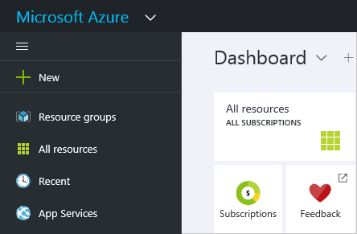
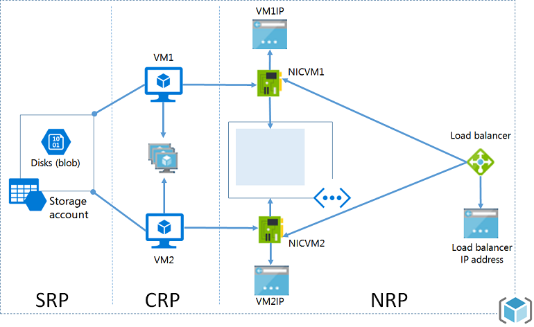

<properties
   pageTitle="Ressourcenmanager und klassischen Bereitstellung | Microsoft Azure"
   description="Beschreibt die Unterschiede zwischen dem Modell zur Bereitstellung von Ressourcenmanager und der Standardansicht (oder Servicemanagement) Modell zur Bereitstellung von."
   services="azure-resource-manager"
   documentationCenter="na"
   authors="tfitzmac"
   manager="timlt"
   editor="tysonn"/>

<tags
   ms.service="azure-resource-manager"
   ms.devlang="na"
   ms.topic="article"
   ms.tgt_pltfrm="na"
   ms.workload="na"
   ms.date="10/27/2016"
   ms.author="tomfitz"/>

# Azure Ressourcenmanager im Vergleich zu klassischen Bereitstellung: verstehen Bereitstellungsmodelle und den Status Ihrer Ressourcen

In diesem Thema lernen Sie Azure Ressourcenmanager und klassischen Bereitstellungsmodelle, den Status Ihrer Ressourcen, und warum mit mindestens einer anderen Ressourcen bereitgestellt waren. Die Ressourcenmanager und klassischen Bereitstellungsmodelle darstellen zwei verschiedene Arten von bereitstellen und Verwalten von Ihrer Azure Lösungen. Sie arbeiten mit ihnen über zwei verschiedene API Gruppen, und die bereitgestellten Ressourcen können wichtige Unterschiede enthalten. Die beiden Modelle sind nicht miteinander vollständig kompatibel. In diesem Thema werden die Unterschiede an.

Um die Bereitstellung und Verwaltung von Ressourcen zu vereinfachen, empfiehlt es sich, dass Sie für alle neuen Ressourcen Ressourcenmanager verwenden. Falls möglich, empfiehlt es sich, dass Sie vorhandene Ressourcen durch Ressourcenmanager erneut bereitstellen.

Wenn Sie nach Ressourcen Manager nicht vertraut sind, empfiehlt es sich, zuerst die Terminologie definiert, in der [Übersicht Azure Ressourcenmanager](azure-resource-manager/resource-group-overview.md)überprüfen.

## Verlauf der Bereitstellungsmodelle

Azure bereitgestellt ursprünglich nur klassische Bereitstellungsmodell aus. In diesem Modell vorhanden ist unabhängig jeder Ressource; Es wurde keine Möglichkeit, die zugehörige Ressourcen zu gruppieren. Statt dessen hatte Sie manuell welche Ressourcen Ihres Lösung oder einer Anwendung eckiger nachverfolgen, und denken Sie daran, diese koordinierte und systematisch zu verwalten. Um eine Lösung bereitstellen, haben Sie entweder jede Ressource einzeln über das klassische Portal erstellen oder erstellen Sie ein Skript, die alle Ressourcen in der richtigen Reihenfolge bereitgestellt. Um eine Lösung zu löschen, haben Sie jede Ressource einzeln löschen. Sie können nicht ohne weiteres anwenden und Steuerelement-Richtlinien für verwandte Ressourcen aktualisieren. Schließlich konnte nicht wenden Sie Kategorien, um Ressourcen beschriften sie Begriffe, die Ihnen helfen Ressourcen überwachen und Verwalten der Abrechnung.

2014 eingeführt Azure Ressourcenmanager, die des Konzepts einer Ressourcengruppe hinzugefügt. Eine Ressourcengruppe ist ein Container für Ressourcen, die einen allgemeinen Lebenszyklus freigeben. Das Modell zur Bereitstellung von Ressourcenmanager bietet mehrere Vorteile:

- Sie können bereitstellen, verwalten und überwachen alle Dienste für Ihre Lösung als Gruppe, anstatt diese Behandlung einzeln services.
- Wiederholt können Sie Ihre Lösung während des gesamten Lebenszyklus bereitstellen und KONFIDENZ, die in einem konsistenten Zustand Ressourcen bereitgestellt werden müssen.
- Steuerung des Benutzerzugriffs auf alle Ressourcen anwenden können, in der Ressourcengruppe und diesen Richtlinien werden automatisch angewendet, wenn neue Ressourcen der Ressourcengruppe hinzugefügt werden.
- Sie können Tags zu Ressourcen, die alle Ressourcen, die in Ihrem Abonnement logisch organisieren anwenden.
- JavaScript Object Notation (JSON) können Sie die Infrastruktur für Ihre Lösung definieren. Die JSON-Datei wird als Vorlage Ressourcenmanager bezeichnet.
- Sie können festlegen, dass die Abhängigkeiten zwischen Ressourcen, damit sie in der richtigen Reihenfolge bereitgestellt werden.

Wenn Ressourcenmanager hinzugefügt wurde, wurden alle Ressourcen rückwirkend Ressource Standardgruppen hinzugefügt. Wenn Sie eine Ressource bis jetzt klassischen Bereitstellung erstellen, wird die Ressource innerhalb einer Ressource Standardgruppe für diesen Dienst, automatisch erstellt, obwohl Sie keinen dieser Ressourcengruppe bei der Bereitstellung angegeben haben. Nur innerhalb einer Ressourcengruppe vorhandenen bedeutet jedoch nicht, dass die Ressource in das Modell Ressourcenmanager konvertiert wurde. Wir werden wie jeden Dienst für die von zwei Bereitstellungsmodelle im nächsten Abschnitt behandelt. 

## Unterstützung für die Modelle verstehen 

Bei der Entscheidung, welche Modell zur Bereitstellung für Ressourcen verwendet werden soll, gibt es drei Szenarios berücksichtigen:

1. Der Dienst unterstützt Ressourcenmanager und enthält nur einen einzigen Typ.
2. Der Dienst Ressourcenmanager unterstützt, aber bietet zwei Arten - eine für Ressourcenmanager und eine für Classic. Dieses Szenario gilt nur für virtuelle Maschinen, Speicherkonten und virtuelle Netzwerke.
3. Der Dienst unterstützt Ressourcenmanager nicht.

Um zu ermitteln, ob ein Dienst Ressourcenmanager unterstützt, finden Sie unter [Ressourcenmanager unterstützt Anbieter](resource-manager-supported-services.md).

Wenn Sie der Dienst, den Sie verwenden möchten Ressourcenmanager nicht unterstützt, müssen Sie weiterhin klassischen Bereitstellung verwenden.

Wenn der Dienst Ressourcenmanager und **kein** virtueller Computer, Speicher-Konto oder virtuelle Netzwerk unterstützt, können Sie keine Probleme geben Ressourcenmanager.

Für virtuelle Maschinen, Speicherkonten und virtuelle Netzwerke Wenn die Ressource durch die klassischen-Bereitstellung erstellt wurde müssen Sie weiterhin durch klassischen-Vorgänge ausgeführt werden. Wenn virtuellen Computern, Speicher Firmen- oder virtuelles Netzwerk bis Ressourcenmanager Bereitstellung erstellt wurde, müssen Sie weiterhin Ressourcenmanager Vorgänge verwenden. Diese Unterscheidung kann verwirrend erhalten, wenn Ihr Abonnement eine Mischung Ressourcen über Ressourcenmanager und klassischen Bereitstellung erstellt wurden enthält. Diese Kombination von Ressourcen kann unerwartete Ergebnisse erstellen, da die Ressourcen nicht dieselben Operationen unterstützen.

In einigen Fällen ein Befehls Ressourcenmanager abrufen kann Informationen zu einer Ressource über klassische Bereitstellung erstellt wurden, oder kann eine administrative Aufgabe, wie etwa das Verschieben einer klassischen Ressource in eine andere Ressourcengruppe ausführen. Diesen Fällen, sollte aber nicht den Eindruck, dass der Typ Ressourcenmanager Vorgänge unterstützt. Nehmen Sie beispielsweise an, dass Sie eine Ressourcengruppe enthalten, die einen virtuellen Computer enthält, der mit klassischen Bereitstellung erstellt wurde. Wenn Sie den folgenden Ressourcenmanager PowerShell-Befehl ausführen:

    Get-AzureRmResource -ResourceGroupName ExampleGroup -ResourceType Microsoft.ClassicCompute/virtualMachines

Es gibt des virtuellen Computers:
    
    Name              : ExampleClassicVM
    ResourceId        : /subscriptions/{guid}/resourceGroups/ExampleGroup/providers/Microsoft.ClassicCompute/virtualMachines/ExampleClassicVM
    ResourceName      : ExampleClassicVM
    ResourceType      : Microsoft.ClassicCompute/virtualMachines
    ResourceGroupName : ExampleGroup
    Location          : westus
    SubscriptionId    : {guid}

Die Ressourcenmanager Cmdlet **Get-AzureRmVM** gibt jedoch nur virtuellen Computern bis Ressourcenmanager bereitgestellt. Mit dem folgende Befehl gibt keine des virtuellen Computers erstellt bis klassischen Bereitstellung zurück.

    Get-AzureRmVM -ResourceGroupName ExampleGroup

Nur Ressourcen über Ressourcenmanager Support Kategorien erstellt wurden. Sie können keine Kategorien auf klassische Ressourcen anwenden.

## Ressourcenmanager Merkmale

Wenn Sie die beiden Modelle helfen können, betrachten wir die Merkmale der Ressourcenmanager Arten:

- Über das [Azure-Portal](https://portal.azure.com/)erstellt.

     

     Für berechnen, Speicher und Netzwerk Ressourcen haben Sie die Möglichkeit, Ressourcenmanager oder auf Standard-Bereitstellung verwenden. Wählen Sie **Ressourcenmanager**aus.

     

- Mit der Version Ressourcenmanager die Azure PowerShell-Cmdlets erstellt. Diese Befehle haben Format *Verb-AzureRmNoun*.

        New-AzureRmResourceGroupDeployment

- Über die restlichen Vorgänge [Azure Ressourcenmanager REST-API](https://msdn.microsoft.com/library/azure/dn790568.aspx) erstellt.

- Erstellt bis Azure CLI-Befehle in der **Cloud** -Modus ausgeführt.

        azure config mode arm
        azure group deployment create 

- Die Ressourcenart schließt **(klassische)** nicht in den Namen ein. Die folgende Abbildung zeigt den Typ als **Speicher-Konto**an.

    

## Klassische Bereitstellungsmerkmale

Sie können auch klassischen Bereitstellungsmodell wie das Modell Servicemanagement kennen.

Freigeben von Ressourcen, die in der klassischen Bereitstellungsmodell erstellt die folgenden Merkmale:

- Über das [klassische Portal](https://manage.windowsazure.com) erstellt

     

     Oder der Azure-Portal an, und legen **klassische** Bereitstellung (für berechnen, Speicher und Netzwerke).

     

- Über die Servicemanagement-Version der Azure-PowerShell-Cmdlets erstellt. Dieser Befehlsnamen haben Format *Verb-AzureNoun*.

        New-AzureVM 

- Über die restlichen Vorgänge [Service Management REST-API](https://msdn.microsoft.com/library/azure/ee460799.aspx) erstellt.
- Erstellt bis Azure CLI-Befehle in **Asm** -Modus ausgeführt.

        azure config mode asm
        azure vm create 

- Der Ressourcentyp enthält den Namen **(klassische)** . Die folgende Abbildung zeigt den Typ als **Speicher-Konto (klassische)**.

    

Azure-Portal können zum Verwalten von Ressourcen, die durch die klassischen-Bereitstellung erstellt wurden.

## Änderungen für Datenverarbeitung, Netzwerk und Speicher

Das folgende Diagramm zeigt Datenverarbeitung, Netzwerk und Speicher Ressourcen durch Ressourcenmanager bereitgestellt.

Beachten Sie die folgenden Beziehungen zwischen den Ressourcen:

- Alle Ressourcen, die innerhalb einer Ressourcengruppe vorhanden sein.
- Des virtuellen Computers hängt ein bestimmte Speicherkonto im Speicher Ressourcenanbieter zum Speichern von zugehörigen Laufwerke im BLOB-Speicher (erforderlich) definiert.
- Des virtuellen Computers verweist auf einen bestimmten Netzwerkadapter in den Anbieter Netzwerk Ressourcen (erforderlich) und eine Verfügbarkeit einrichten im berechnen Ressourcenanbieter definierten (optional) definiert.
- Die NIC verweist auf die virtuellen Computern zugewiesene IP-Adresse (erforderlich), das Subnetz des virtuellen Netzwerks des virtuellen Computers (erforderlich), und klicken Sie auf eine Sicherheitsgruppe Netzwerk (optional).
- Das Subnetz in einem virtuellen Netzwerk verweist auf eine Sicherheitsgruppe Netzwerk (optional).
- Die Auslastung Lastenausgleich Instanz verweist auf die Back-End-Pool IP-Adressen, die die NIC eines virtuellen Computers (optional) enthalten und verweist auf eine laden Lastenausgleich öffentlichen oder privaten IP-Adresse (optional).

Hier sind die Komponenten und deren Beziehungen für klassische Bereitstellung aus:

Die klassische Lösung für das Hosten eines virtuellen Computers umfasst:

- Eine erforderliche Cloud-Dienst, der als Container für das Hosten von virtuellen Computern (Berechnung) verwendet. Virtuelle Computer werden automatisch mit einer Netzwerk-Oberfläche Netzwerkschnittstellenkarte bereitgestellt und eine IP-Adresse von Azure zugewiesen. Darüber hinaus enthält der Cloud-Dienst eine Instanz der externen laden Lastenausgleich, eine öffentliche IP-Adresse und Standard von Endpunkten in remote desktop- und remote PowerShell für Windows-basiertem virtuellen Computern und Secure Shell (SSH) Datenverkehr für Linux-basierten virtuellen Computern zulassen.
- Eines erforderlichen Speicher-Kontos, das die virtuellen Festplatten für einen virtuellen Computer, einschließlich des Betriebssystems, temporäre und weitere Daten Datenträger (Speicher) gespeichert.
- Eine optionale virtuelle Netzwerk, der als einen weiteren Container, fungiert, in dem Sie eine Struktur Subnetz erstellen und bestimmen das Subnetz auf dem des virtuellen Computers befindet (Netzwerk).

Die folgende Tabelle beschreibt die Änderungen in Datenverarbeitung, Netzwerk und Speicher Ressourcenanbieter Interaktion:

 Element | Klassische | Ressourcenmanager
 ---|---|---
| Cloud-Dienst für virtuellen Computern |  Cloud-Dienst wurde ein Container zum Speichern der virtuellen Computern, die Verfügbarkeit von der Plattform und den Lastenausgleich erforderlich. | Cloud-Dienst ist nicht mehr ein Objekt für das Erstellen eines virtuellen Computers mit dem neuen Modell erforderlich ist. |
| Virtuelle Netzwerke | Ein virtuelles Netzwerk ist optional des virtuellen Computers. Wenn enthalten ist, kann das virtuelle Netzwerk mit Ressourcenmanager bereitgestellt werden. | Virtuellen Computern erfordert ein virtuelles Netzwerk, das mit Ressourcen-Manager bereitgestellt wurde. |
| Speicherkonten | Des virtuellen Computers erfordert ein Speicher-Kontos, das die virtuellen Festplatten für das Betriebssystem, temporäre und weitere Daten Datenträger gespeichert. | Des virtuellen Computers erfordert ein Speicherkonto, um seine Laufwerke im BLOB-Speicher zu speichern. |
| Verfügbarkeit von Gruppen | Verfügbarkeit der Plattform erkennbar wurde die gleichen "AvailabilitySetName" auf den virtuellen Computern konfigurieren. Die maximale Anzahl der Fehlerstrukturanalyse Domänen wurde 2. | Festlegen der Verfügbarkeit ist eine Ressource, Microsoft.Compute Anbieter bereitgestellt werden. Virtuellen Computern, die eine hohen Verfügbarkeit erfordern muss in der Verfügbarkeit festlegen enthalten sein. Die maximale Anzahl der Fehlerstrukturanalyse Domänen ist jetzt 3. |
| Gruppen die | Gruppen die wurden zur Erstellung von virtuellen Netzwerken erforderlich. Jedoch war im Lieferumfang des regionalen virtuelle Netzwerke, die nicht erforderlich nicht mehr. |Um zu vereinfachen, vorhanden nicht des Konzepts Gruppen die im verfügbaren bis Azure Ressourcenmanager APIs. |
| Lastenausgleich    | Erstellung einer Cloud-Dienst bietet eine implizit Lastenausgleich für den virtuellen Computern bereitgestellt. | Lastenausgleich ist eine Ressource, die von den Microsoft.Network-Anbieter verfügbar gemacht werden. Die primäre Schnittstelle der virtuellen Computer, für die Lastenausgleich durchgeführt werden muss sollte Lastenausgleich verweisen. Lastenausgleich können intern oder extern sein. Eine Instanz der laden Lastenausgleich verweist auf die Back-End-Pool IP-Adressen, die die NIC eines virtuellen Computers (optional) enthalten und verweist auf eine laden Lastenausgleich öffentlichen oder privaten IP-Adresse (optional). [Weitere Informationen.](../articles/resource-groups-networking.md) |
|Virtuelle IP-Adresse | Cloud Services erhalten eine Standard-VIP (virtuelle IP-Adresse) aus, wenn ein virtueller Computer auf einen Clouddienst hinzugefügt wird. Die virtuelle IP-Adresse ist die Adresse, den Lastenausgleich implizit zugeordnet.    | Öffentliche IP-Adresse ist eine Ressource, die von den Microsoft.Network-Anbieter verfügbar gemacht werden. Öffentliche IP-Adresse kann es sich um statische (reserviert) oder dynamische sein. Ein Lastenausgleich kann dynamische öffentlichen IP-Adressen zugewiesen werden. Öffentliche IP-Adressen kann mithilfe von Sicherheitsgruppen gesichert werden. |
|Reservierte IP-Adresse|   Sie können eine IP-Adresse in Azure reservieren und Zuordnen einer Cloud-Dienst, um sicherzustellen, dass die IP-Adresse Kurznotizen ist.   | Öffentliche IP-Adresse im Modus "Statische" erstellt werden können, und bietet dieselbe Funktion als eine "reservierte IP-Adresse". Statische öffentliche IP-Adressen können nur ein Lastenausgleich sofort zugewiesen werden. |
|Öffentliche IP-Adresse (PIP) pro virtueller Computer | Öffentliche IP-Adressen können auch direkt eines virtuellen Computers zugeordnet werden. | Öffentliche IP-Adresse ist eine Ressource, die von den Microsoft.Network-Anbieter verfügbar gemacht werden. Öffentliche IP-Adresse kann es sich um statische (reserviert) oder dynamische sein. Jedoch können nur dynamische öffentlichen IP-Adressen zu Netzwerk-Schnittstellen zugeordnet werden, können Sie eine öffentliche IP-Adresse pro virtueller Computer sofort zu gelangen. |
|Endpunkte| Eingabe Endpunkte erforderlich konfiguriert sein, auf einem virtuellen Computer von Konnektivität für bestimmte Ports geöffnet sein. Einer der die gängigen Modi der Herstellen einer Verbindung mit virtuellen Computern, die beim Einrichten von Endpunkten fertig. | Eingehende NAT Regeln können auf Lastenausgleich erzielen dieselbe Funktion der Aktivierung Endpunkte an bestimmten Ports zum Herstellen einer Verbindung mit den virtuellen Computern konfiguriert werden. |
|DNS-Name| Cloud-Dienst würden ein implizit global eindeutigen DNS-Namen erhalten. Beispiel: `mycoffeeshop.cloudapp.net`. | DNS-Namen sind optionale Parameter, die für eine Ressource öffentliche IP-Adresse angegeben werden können. Der vollqualifizierten Domänennamen befindet sich in folgendem Format - `<domainlabel>.<region>.cloudapp.azure.com`. |
|Netzwerk-Schnittstellen | Primären und sekundären Schnittstelle und deren Eigenschaften als Netzwerkkonfiguration eines virtuellen Computers definiert wurden. | Netzwerk-Schnittstellen gehören, eine Ressource, Microsoft.Network Anbieter bereitgestellt werden. Des Lebenszyklus von der Schnittstelle ist nicht mit einer virtuellen Computern verknüpft. Sie verweist auf die virtuellen Computern zugewiesene IP-Adresse (erforderlich), das Subnetz des virtuellen Netzwerks des virtuellen Computers (erforderlich), und klicken Sie auf eine Sicherheitsgruppe Netzwerk (optional). |

Weitere Informationen zum Herstellen einer Verbindung virtuelle Netzwerke aus verschiedenen Bereitstellungsmodellen, finden Sie unter [Verbinden virtuelle Netzwerke aus verschiedenen Bereitstellungsmodellen im Portal](./vpn-gateway/vpn-gateway-connect-different-deployment-models-portal.md).

## Migrieren von klassischen zu Ressourcenmanager

Wenn Sie zum Migrieren von Ressourcen aus dem klassischen Bereitstellung zu Ressourcenmanager Bereitstellung bereit sind, finden Sie unter:

1. [Technische aneignen auf Plattform unterstützt Migration von Classic zu Azure Ressourcenmanager](./virtual-machines/virtual-machines-windows-migration-classic-resource-manager-deep-dive.md)
2. [Plattform unterstützt Migration von IaaS Ressourcen aus klassischen zu Azure Ressourcenmanager](./virtual-machines/virtual-machines-windows-migration-classic-resource-manager.md)
3. [Migrieren Sie IaaS Ressourcen von klassischen Ressourcenmanager zu Azure mithilfe von Azure PowerShell](./virtual-machines/virtual-machines-windows-ps-migration-classic-resource-manager.md)
4. [Migrieren Sie IaaS Ressourcen von klassischen Ressourcenmanager zu Azure mithilfe von Azure CLI](./virtual-machines/virtual-machines-linux-cli-migration-classic-resource-manager.md)

## Häufig gestellte Fragen

**Kann ich mit Azure Ressourcenmanager in einem virtuellen Netzwerk oder Speicherkonto erstellt klassischen Bereitstellung bereitstellen einen virtuellen Computer erstellen?**

Dies wird nicht unterstützt. Sie können Ressourcenmanager Azure ein virtuellen Computers in einem Netzwerk virtuelle bereitstellen, die mit klassischen Bereitstellung erstellt wurde.

**Kann ich mit der Azure Ressourcenmanager aus einem Benutzer Bild, das mithilfe der Azure Service Management-APIs erstellt wurde einen virtuellen Computer erstellen?**

Dies wird nicht unterstützt. Sie können jedoch, kopieren Sie die virtuelle Festplatte Dateien von einem Speicherkonto, die mithilfe der Service Management-APIs erstellt wurde, und fügen diese in ein neues Konto erstellt bis Azure Ressourcenmanager.

**Was ist die Auswirkung auf das Kontingent für mein Abonnement?**

Die Kontingente für den virtuellen Computern, virtuelle Netzwerke und Speicherkonten über Azure-Manager erstellt werden getrennt von anderen Kontingente. Jedes Abonnement ruft Kontingente, die mithilfe der neuen APIs Ressourcen zu erstellen. Sie können weitere Informationen zu den weiteren Kontingenten [hier](../articles/azure-subscription-service-limits.md).

**Kann ich weiterhin meine automatisierte Skripts für die Bereitstellung von virtuellen Computern, virtuelle Netzwerke und Speicherkonten über die APIs Ressourcenmanager verwenden?**

Die Automatisierung und Skripts, die Sie erstellt haben weiterhin für die vorhandenen virtuellen Computer, virtuelle Netzwerke erstellt haben, klicken Sie unter den Servicemanagement Azure-Modus arbeiten. Haben jedoch die Skripts aktualisiert werden, um das neue Schema zur Erstellung von der dieselben Ressourcen durch den Modus Ressourcenmanager verwenden.

**Wo finde ich Beispiele für Ressourcenmanager Azure-Vorlagen?**

Eine umfassende Reihe von Starter-Vorlagen finden Sie auf [Azure Ressourcenmanager Schnellstart Vorlagen](https://azure.microsoft.com/documentation/templates/).

## Nächste Schritte

- Wenn Sie die Erstellung einer Vorlage durchzuführen, die eine virtuellen Computern, Speicher-Konto und virtuelles Netzwerk definiert, finden Sie unter [Exemplarische Vorgehensweise Ressourcenmanager-Vorlage](resource-manager-template-walkthrough.md).
- Die Befehle für die Bereitstellung von einer Vorlage finden Sie unter [Bereitstellen einer Anwendung mit Ressourcenmanager Azure-Vorlage](resource-group-template-deploy.md).
