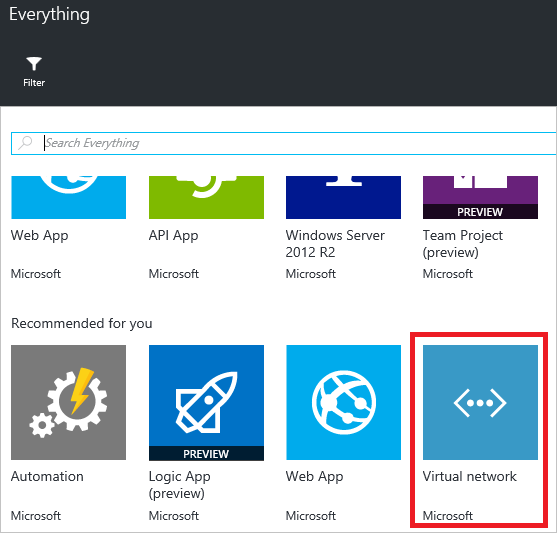

<properties
    pageTitle="Ressourcenmanager Azure Vorlage exportieren | Microsoft Azure"
    description="Verwenden Sie zum Exportieren einer Vorlage aus einer vorhandenen Ressourcengruppe Azure Ressource verwalten."
    services="azure-resource-manager"
    documentationCenter=""
    authors="tfitzmac"
    manager="timlt"
    editor="tysonn"/>

<tags
    ms.service="azure-resource-manager"
    ms.workload="multiple"
    ms.tgt_pltfrm="na"
    ms.devlang="na"
    ms.topic="get-started-article"
    ms.date="10/20/2016"
    ms.author="tomfitz"/>

# <a name="export-an-azure-resource-manager-template-from-existing-resources"></a>Exportieren einer Vorlage Azure Ressourcenmanager von vorhandenen Ressourcen

Ressourcenmanager können Sie eine Vorlage Ressourcenmanager aus vorhandenen Ressourcen in Ihrem Abonnement exportieren. Sie können die generierte Vorlage wissen möchten, die Vorlagensyntax oder die erneute Bereitstellung Ihrer Lösung zu automatisieren, je nach Bedarf verwenden.

Es ist wichtig, beachten Sie, dass es zwei verschiedene Verfahren zum Exportieren einer Vorlage gibt:

- Sie können die ist-Vorlage exportieren, die Sie für die Bereitstellung verwendet. Die exportierte Vorlage enthält alle Parameter und Variablen, genau wie auch in der ursprünglichen Vorlage dargestellt. Dieser Ansatz empfiehlt sich, wenn Sie über das Portal Ressourcen bereitgestellt haben. Nun möchten sehen, wie die Vorlage zum Erstellen von Ressourcen zu erstellen.
- Sie können eine Vorlage exportieren, die den aktuellen Status der Ressourcengruppe darstellt. Die exportierte Vorlage basiert nicht auf eine Vorlage, die Sie für die Bereitstellung verwendet. In diesem Fall wird eine Vorlage, die ist eine Momentaufnahme der Ressourcengruppe, erstellt. Die exportierte Vorlage enthält viele hartcodierte Werte und wahrscheinlich nicht so viele Parameter, wie Sie in der Regel definieren. Dieser Ansatz ist hilfreich, wenn Sie die Ressourcengruppe über das Portal oder Skripts geändert haben. Nun müssen Sie die Ressourcengruppe als Vorlage zu erfassen.

In diesem Thema wird beide Methoden.

In diesem Lernprogramm anmelden Azure-Portal an, erstellen Sie ein Speicherkonto aus, und exportieren Sie die Vorlage für dieses Speicherkonto. Sie fügen Sie ein virtuelles Netzwerk zum Ändern der Ressourcengruppe hinzu. Schließlich exportieren Sie eine neue Vorlage, die aktuellen Zustand darstellt. Obwohl in diesem Artikel auf eine vereinfachte Infrastruktur Schwerpunkt, können Sie dieselben Schritte, Exportieren eine Vorlage für eine komplexere Lösung.

## <a name="create-a-storage-account"></a>Erstellen Sie ein Speicherkonto

1. Wählen Sie im [Azure-Portal](https://portal.azure.com) **neu** > **Speicher** > **Speicher-Konto**.

      

2. Erstellen Sie ein Speicherkonto mit Namen, **Speicher**, Ihre Initialen und das Datum aus. Den Namen des Kontos Speicher muss über Azure eindeutig sein. Wenn der Name bereits verwendet wird, wird eine Fehlermeldung, dass der Name verwendet wird. Versuchen Sie eine Variante aus. Erstellen einer neuen Ressourcengruppe Ressourcengruppe und nennen Sie es **ExportGroup**. Sie können die Standardwerte für die anderen Eigenschaften verwenden. Wählen Sie auf **Erstellen**.

      

Die Bereitstellung kann Minuten dauern. Nachdem die Bereitstellung abgeschlossen ist, enthält Ihr Abonnement Speicher-Konto an.

## <a name="view-a-template-from-deployment-history"></a>Anzeigen einer Vorlage aus dem Verlauf der Bereitstellung

1. Wechseln Sie zu der Ressource Gruppe Blade für die neue Ressourcengruppe. Beachten Sie, dass das Blade das Ergebnis der letzten Bereitstellung entspricht. Wählen Sie diesen Link aus.

      

2. Sie finden Sie unter Verlauf Bereitstellungen für die Gruppe aus. In Ihrem Fall enthält das Blade wahrscheinlich nur eine Bereitstellung aus. Wählen Sie diese Bereitstellung aus.

     

3. Das Blade zeigt eine Zusammenfassung der Bereitstellung. Die Zusammenfassung enthält den Status der Bereitstellung und seiner Geschäftstätigkeit und die Werte, die Sie für Parameter bereitgestellt. Wählen Sie **Ansicht aus**, um die Vorlage anzuzeigen, die Sie für die Bereitstellung verwendet.

     

4. Ressourcenmanager Ruft die folgenden sechs Dateien für Sie:

   1. **Vorlage** – die Vorlage, die Infrastruktur für Ihre Lösung definiert. Bei der Erstellung des Speicherkontos über das Portal Ressourcenmanager eine Vorlage zur Bereitstellung von es verwendet, und dieser Vorlage zur späteren Referenz gespeichert.
   2. **Parameter** - eine Parameterdatei, die Sie verwenden können, um Werte während der Bereitstellung zu übergeben. Sie enthält die Werte, die Sie während der ersten Bereitstellung bereitgestellt, aber Sie können eine der folgenden Werte ändern, wenn Sie die Vorlage erneut bereitstellen.
   3. **CLI** - eines Azure Befehlszeilenversion Befehlszeile Interface (CLI) Skriptdatei, die Sie verwenden können, um die Vorlage bereitstellen.
   4. **PowerShell** - ein Azure PowerShell-Skriptdatei, die Sie verwenden können, um die Vorlage bereitstellen.
   5. **.NET** - A .NET Class, die Sie verwenden können, um die Vorlage bereitstellen.
   6. **Ruby** - A Ruby-Klasse, die Sie verwenden können, um die Vorlage bereitstellen.

     Die Dateien sind über das Blade über Links zur Verfügung. Standardmäßig wird das Blade die Vorlage angezeigt.

       

     Achten Sie uns besonders in die Vorlage ein. Ihre Vorlage sollte ähnlich wie aus:

        {"$schema": "https://schema.management.azure.com/schemas/2015-01-01/deploymentTemplate.json#", "ContentVersion": "1.0.0.0", "Parameter": {"Name": {"Typ": "Zeichenfolge"}, "AccountType": {"Typ": "Zeichenfolge"}, "Speicherort": {"Typ": "Zeichenfolge"}, "EncryptionEnabled": {"Standardwert": false "Typ": "Boolesche"}}, "Ressourcen": [{"Typ": "Microsoft.Storage/storageAccounts", "Sku": {"Name": "[parameters('accountType')]"}, "Kind": "Speicher", "name": "[parameters('name')]", "ApiVersion": "2016-01-01", "Speicherort": "[parameters('location')]", "Eigenschaften": {"Verschlüsselung": {"Dienstleistungen": {"Blob": {"aktiviert": "[parameters('encryptionEnabled')]"}}, "KeySource": "Microsoft.Storage"}}}]}
 
Diese Vorlage ist die ist-Vorlage verwendet, um Ihr Speicherkonto zu erstellen. Beachten Sie, dass sie Parameter enthält, mit die Sie unterschiedliche Kontotypen Speicher bereitstellen können. Weitere Informationen über die Struktur der Vorlage finden Sie unter [Azure Ressourcenmanager Authoring-Vorlagen](resource-group-authoring-templates.md). Die vollständige Liste der Funktionen, die Sie in eine Vorlage verwenden können, finden Sie unter [Azure Ressourcenmanager Vorlagenfunktionen](resource-group-template-functions.md).


## <a name="add-a-virtual-network"></a>Hinzufügen eines virtuellen Netzwerks

Die Vorlage, die Sie im vorherigen Abschnitt heruntergeladen dargestellt die Infrastruktur für die ursprüngliche Bereitstellung. Es wird jedoch keine Änderungen berücksichtigt, die nach der Bereitstellung vorgenommen werden.
Um dieses Problem zu veranschaulichen, ändern Sie uns der Ressourcengruppe an, indem Sie ein virtuelles Netzwerk über das Portal hinzufügen klicken.

1. Wählen Sie in der Gruppe Ressourcen Blade- **Hinzufügen**aus.

      

2. Wählen Sie aus den verfügbaren Ressourcen **virtuellen Netzwerk** aus.

      

2. Namen für das virtuelle Netzwerk **VNET**, und verwenden Sie die Standardwerte für die anderen Eigenschaften. Wählen Sie auf **Erstellen**.

      

3. Nachdem das virtuelle Netzwerk Ihrer Ressourcengruppe erfolgreich bereitgestellt, betrachten Sie noch einmal den Verlauf der Bereitstellung. Sie sehen jetzt zwei Bereitstellungen. Wenn Sie die zweite Bereitstellung nicht angezeigt werden, müssen Sie Ihre Ressourcen Gruppe Blade schließen und erneut. Wählen Sie das neuere Bereitstellung aus.

      

4. Zeigen Sie die Vorlage für die Bereitstellung. Beachten Sie, dass sie nur das virtuelle Netzwerk definiert. Es ist nicht das Speicherkonto enthalten, die, das Sie zuvor bereitgestellt. Sie müssen nicht mehr eine Vorlage, die alle Ressourcen in der Ressourcengruppe darstellt.

## <a name="export-the-template-from-resource-group"></a>Exportieren Sie die Vorlage aus Ressourcengruppe

Um den aktuellen Status der Ressourcengruppe zu gelangen, exportieren Sie eine Vorlage, die eine Momentaufnahme der Ressourcengruppe anzeigt.  

> [AZURE.NOTE] Eine Vorlage für eine Ressourcengruppe, die mehr als 200 Ressourcen verfügbar sind, können nicht exportiert werden.

1. Wählen Sie zum Anzeigen der Vorlage für eine Ressourcengruppe **Automatisierungsskript**ein.

      

     Nicht alle Ressourcentypen unterstützen die Funktion der Vorlage exportieren. Wenn Ihre Ressourcengruppe nur die Speicher-Konto und virtuelles Netzwerk angezeigt, die in diesem Artikel enthält, einen Fehler nicht angezeigt. Jedoch, wenn Sie andere Ressourcentypen erstellt haben, sehen Sie eine Fehlermeldung darauf hin, dass es ein Problem mit den Export liegt. Sie erfahren, wie Sie diese Probleme im Abschnitt [Exportieren-Probleme beheben](#fix-export-issues) zu behandeln.

      

2. Sie erneut die sechs Dateien, die Sie verwenden können, um die Lösung erneut bereitzustellen sehen, jedoch diesmal die Vorlage ist ein wenig anders ab. Diese Vorlage hat nur zwei Parametern: eine für den Speicher Kontonamen und eine für den Namen des virtuellen Netzwerks.

        "parameters": {
          "virtualNetworks_VNET_name": {
            "defaultValue": "VNET",
            "type": "String"
          },
          "storageAccounts_storagetf05092016_name": {
            "defaultValue": "storagetf05092016",
            "type": "String"
          }
        },

     Ressourcenmanager nicht abgerufen werden die Vorlagen, die Sie während der Bereitstellung verwendet. Stattdessen generiert sie eine neue Vorlage, die auf die aktuelle Konfiguration der Ressourcen basiert. Die Vorlage wird beispielsweise den Speicherort und Replikation Speicherwert von Konto auf an:

        "location": "northeurope",
        "tags": {},
        "properties": {
            "accountType": "Standard_RAGRS"
        },

3. Sie haben eine Reihe von Optionen für die Arbeit mit dieser Vorlage zu erhalten. Sie können die Vorlage herunterladen und lokal mit einem JSON-Editor daran arbeiten. Alternativ können Sie die Vorlage in der Bibliothek speichern und daran arbeiten, über das Portal.

     Wenn Sie mit einem JSON-Editor wie [Im Vergleich mit einer Code](resource-manager-vs-code.md) oder [Visual Studio](vs-azure-tools-resource-groups-deployment-projects-create-deploy.md)vertraut sind, möchten Sie vielleicht die Vorlage lokal herunterladen und verwenden diesen Editor. Wenn Sie nicht mit einem JSON-Editor eingerichtet sind, möchten Sie vielleicht die Vorlage über das Portal bearbeiten. In diesem Thema wird davon ausgegangen, dass Sie die Vorlage gespeichert haben, zu Ihrer Bibliothek im Portal. Jedoch nehmen Sie die gleichen Syntax Änderungen an der Vorlage, ob lokal mit einem JSON-Editor oder über das Portal funktioniert.

     Wenn lokal arbeiten möchten, wählen Sie **herunterladen**aus.

      

     Wenn Sie über das Portal arbeiten möchten, wählen Sie **zur Bibliothek hinzufügen**.

      

     Beim Hinzufügen einer Vorlage zu der Bibliothek, geben Sie einen Namen und eine Beschreibung der Vorlage. Wählen Sie dann **Speichern**.

     

4. Zum Anzeigen einer Vorlage in der Bibliothek gespeichert Wählen Sie **Weitere Dienste**, geben Sie **Vorlagen** zum Filtern von Ergebnissen **Vorlagen**auswählen.

      

5. Wählen Sie die Vorlage mit dem Namen, die, den Sie gespeichert haben.

      

## <a name="customize-the-template"></a>Passen Sie die Vorlage

Die exportierte Vorlage funktioniert, wenn Sie die gleichen Speicherkonto und das virtuelle Netzwerk für jede Bereitstellung erstellen möchten. Ressourcenmanager bietet jedoch Optionen aus, damit Vorlagen mit viel mehr Flexibilität bereitgestellt werden kann. Möglicherweise möchten Sie beispielsweise während der Bereitstellung geben Speicher-Konto zu erstellen oder die Werte für die virtuelle Netzwerk Adresspräfix und Subnetzpräfix verwendet werden soll.

In diesem Abschnitt fügen Sie Parameter in die exportierte Vorlage, damit Sie die Vorlage wiederverwenden können, wenn Sie diese Ressourcen anderen Umgebungen bereitstellen. Sie hinzufügen können Ihre Vorlage verringern Sie die Wahrscheinlichkeit, dass einen Fehler auftreten, wenn Sie Ihre Vorlage bereitstellen einige Features. Sie müssen nicht mehr einen eindeutigen Namen für Ihr Speicherkonto annehmen. Die Vorlage erstellt stattdessen einen eindeutigen Namen. Sie schränken Sie die Werte, die für den Speicher Kontotyp auf nur gültige Optionen angegeben werden können.

1. Wählen Sie zum Anpassen der Vorlage **Bearbeiten** .

     

1. Wählen Sie die Vorlage ein.

     

1. Wenn Sie in der Lage, die Werte übergeben, die Sie möglicherweise während der Bereitstellung angeben möchten, ersetzen Sie im Abschnitt **Parameter** mit neuen Parameterdefinitionen. Beachten Sie die Werte der **AllowedValues** für **StorageAccount_accountType**. Wenn Sie versehentlich einen ungültigen Wert angeben, wird dieser Fehler erkannt, vor die Bereitstellung wird gestartet. Beachten Sie, dass Sie nur ein Präfix für den Kontonamen Speicher bereitstellen, und das Präfix maximal 11 Zeichen kann. Wenn Sie das Präfix auf 11 Zeichen einschränken, stellen Sie sicher, dass der vollständige Name nicht die maximale Anzahl von Zeichen für ein Speicherkonto übersteigt. Das Präfix können Sie eine Benennungskonvention auf Ihre Speicherkonten angewendet wird. So erstellen Sie einen eindeutigen Namen im nächsten Schritt wird angezeigt.

        "parameters": {
          "storageAccount_prefix": {
            "type": "string",
            "maxLength": 11
          },
          "storageAccount_accountType": {
            "defaultValue": "Standard_RAGRS",
            "type": "string",
            "allowedValues": [
              "Standard_LRS",
              "Standard_ZRS",
              "Standard_GRS",
              "Standard_RAGRS",
              "Premium_LRS"
            ]
          },
          "virtualNetwork_name": {
            "type": "string"
          },
          "addressPrefix": {
            "defaultValue": "10.0.0.0/16",
            "type": "string"
          },
          "subnetName": {
            "defaultValue": "subnet-1",
            "type": "string"
          },
          "subnetAddressPrefix": {
            "defaultValue": "10.0.0.0/24",
            "type": "string"
          }
        },

2. Im Abschnitt **Variablen** Ihrer Vorlage ist zurzeit leer. Im Abschnitt **Variablen** erstellen Sie Werte, die die Syntax für die restlichen Ihrer Vorlage zu vereinfachen. Ersetzen Sie diesen Abschnitt durch eine neue Variable Definition. Die Variable **StorageAccount_name** verkettet das Präfix aus dem Parameter in einer eindeutigen Zeichenfolge generiert wird, die auf Grundlage des Bezeichners der Ressourcengruppe. Sie müssen nicht mehr auf einen eindeutigen Namen liefern, wenn Sie einen Parameterwert bereitstellen.

        "variables": {
          "storageAccount_name": "[concat(parameters('storageAccount_prefix'), uniqueString(resourceGroup().id))]"
        },

3. Um die Parameter und Variablen in den Ressourcendefinitionen verwenden, ersetzen Sie im Abschnitt **Ressourcen** mit neuen Ressourcendefinitionen aus. Beachten Sie die kleinen in den Ressourcendefinitionen als der Wert geändert hat, die auf die Ressourceneigenschaft zugeordnet ist. Die Eigenschaften sind identisch mit den Eigenschaften, die aus der exportierten Vorlage. Sie sind einfach Eigenschaften Parameterwerte, anstatt hartcodierte Werte zuweisen. Die Position der Ressourcen wird festgelegt, am selben Speicherort wie die Ressourcengruppe durch den Ausdruck **ResourceGroup () .location** verwenden. Die Variable, die Sie für den Speicher Kontonamen erstellt wird durch den Ausdruck **Variablen** verwiesen werden.

        "resources": [
          {
            "type": "Microsoft.Network/virtualNetworks",
            "name": "[parameters('virtualNetwork_name')]",
            "apiVersion": "2015-06-15",
            "location": "[resourceGroup().location]",
            "properties": {
              "addressSpace": {
                "addressPrefixes": [
                  "[parameters('addressPrefix')]"
                ]
              },
              "subnets": [
                {
                  "name": "[parameters('subnetName')]",
                  "properties": {
                    "addressPrefix": "[parameters('subnetAddressPrefix')]"
                  }
                }
              ]
            },
            "dependsOn": []
          },
          {
            "type": "Microsoft.Storage/storageAccounts",
            "name": "[variables('storageAccount_name')]",
            "apiVersion": "2015-06-15",
            "location": "[resourceGroup().location]",
            "tags": {},
            "properties": {
                "accountType": "[parameters('storageAccount_accountType')]"
            },
            "dependsOn": []
          }
        ]

4. Wählen Sie **OK** aus, wenn Sie fertig sind die Vorlage bearbeiten.

5. Wählen Sie **Speichern** , um die Änderungen für die Vorlage zu speichern.

     

6. Wählen Sie für die Bereitstellung die aktualisierte Vorlage **Bereitstellen**.

     

7. Bereitstellen Sie Parameterwerte, und wählen Sie eine neue Ressourcengruppe die Ressourcen bereitgestellt.

## <a name="update-the-downloaded-parameters-file"></a>Aktualisieren Sie die der heruntergeladenen Parameterdatei

Wenn Sie die heruntergeladenen Dateien (anstelle der Portalseite Library) verwenden, müssen Sie die der heruntergeladenen Parameterdatei zu aktualisieren. Sie entspricht nicht mehr der Parameter in der Vorlage. Sie verfügen keine Parameterdatei verwenden, aber es kann den Prozess vereinfachen, wenn Sie eine Umgebung erneut bereitstellen. Sie verwenden die Standardwerte, die für viele der Parameter in der Vorlage definiert sind, damit Ihre Parameterdatei nur zwei Werte benötigt.

Ersetzen Sie den Inhalt der Datei parameters.json durch:

```
{
  "$schema": "https://schema.management.azure.com/schemas/2015-01-01/deploymentParameters.json#",
  "contentVersion": "1.0.0.0",
  "parameters": {
    "storageAccount_prefix": {
      "value": "storage"
    },
    "virtualNetwork_name": {
      "value": "VNET"
    }
  }
}
```

Die aktualisierten Parameterdatei enthält Werte nur für Parameter, die nicht über einen Standardwert verfügen. Sie können die Werte für die anderen Parameter bereitstellen, wenn Sie einen Wert definieren möchten, der von den Standardwert unterscheidet.

## <a name="fix-export-issues"></a>Beheben von Problemen mit exportieren

Nicht alle Ressourcentypen unterstützen die Funktion der Vorlage exportieren. Einige Ressourcentypen, um zu verhindern, dass vertrauliche Daten bereitstellen exportiert Ressourcenmanager insbesondere nicht. Beispielsweise, wenn Sie eine Verbindungszeichenfolge in der Website Config haben, führen Sie wahrscheinlich nicht angezeigt werden soll es explizit in einer exportierten Vorlage. Sie können dieses Problem umgehen, indem manuell fehlenden Ressourcen wieder in der Vorlage hinzufügen.

> [AZURE.NOTE] Hinweise zum Export wird nur beim Exportieren aus einer Ressourcengruppe und nicht aus dem Verlauf Bereitstellung auftreten. Wenn die letzte Bereitstellung genau den aktuellen Status der Ressourcengruppe darstellt, sollten Sie die Vorlage aus dem Verlauf Bereitstellung und nicht aus der Ressourcengruppe exportieren. Exportieren Sie nur aus einer Ressourcengruppe, wenn Sie Änderungen vorgenommen haben, der Ressourcengruppe, die nicht in einer Vorlage definiert sind.

Wenn Sie eine Vorlage für eine Ressourcengruppe, die eine Web app, die SQL-Datenbank und die Verbindungszeichenfolge in der Website Config enthält exportieren, wird beispielsweise die folgende Meldung angezeigt:


Markieren die Nachricht zeigt Ihnen genau welche Ressourcentypen nicht exportiert wurden. 
     


In diesem Thema werden allgemeine Updates.

### <a name="connection-string"></a>Verbindungszeichenfolge

Hinzuzufügen Sie in der Ressource Websites Definition für die Verbindungszeichenfolge der Datenbank:

```
{
  "type": "Microsoft.Web/sites",
  ...
  "resources": [
    {
      "apiVersion": "2015-08-01",
      "type": "config",
      "name": "connectionstrings",
      "dependsOn": [
          "[concat('Microsoft.Web/Sites/', parameters('<site-name>'))]"
      ],
      "properties": {
          "DefaultConnection": {
            "value": "[concat('Data Source=tcp:', reference(concat('Microsoft.Sql/servers/', parameters('<database-server-name>'))).fullyQualifiedDomainName, ',1433;Initial Catalog=', parameters('<database-name>'), ';User Id=', parameters('<admin-login>'), '@', parameters('<database-server-name>'), ';Password=', parameters('<admin-password>'), ';')]",
              "type": "SQLServer"
          }
      }
    }
  ]
}
```    

### <a name="web-site-extension"></a>Website-Erweiterung

Fügen Sie in der Ressource Website Definition für den Code zu installieren:

```
{
  "type": "Microsoft.Web/sites",
  ...
  "resources": [
    {
      "name": "MSDeploy",
      "type": "extensions",
      "location": "[resourceGroup().location]",
      "apiVersion": "2015-08-01",
      "dependsOn": [
        "[concat('Microsoft.Web/sites/', parameters('<site-name>'))]"
      ],
      "properties": {
        "packageUri": "[concat(parameters('<artifacts-location>'), '/', parameters('<package-folder>'), '/', parameters('<package-file-name>'), parameters('<sas-token>'))]",
        "dbType": "None",
        "connectionString": "",
        "setParameters": {
          "IIS Web Application Name": "[parameters('<site-name>')]"
        }
      }
    }
  ]
}
```

### <a name="virtual-machine-extension"></a>Erweiterung virtuellen Computern

Beispiele für virtuellen Computern Erweiterungen finden Sie unter [Azure Windows virtueller Computer Erweiterung Konfiguration Beispiele](./virtual-machines/virtual-machines-windows-extensions-configuration-samples.md).

### <a name="virtual-network-gateway"></a>Virtuelle Netzwerk-gateway

Fügen Sie einen Ressourcentyp für virtuelles Netzwerk Gateway hinzu.

```
{
  "type": "Microsoft.Network/virtualNetworkGateways",
  "name": "[parameters('<gateway-name>')]",
  "apiVersion": "2015-06-15",
  "location": "[resourceGroup().location]",
  "properties": {
    "gatewayType": "[parameters('<gateway-type>')]",
    "ipConfigurations": [
      {
        "name": "default",
        "properties": {
          "privateIPAllocationMethod": "Dynamic",
          "subnet": {
            "id": "[resourceId('Microsoft.Network/virtualNetworks/subnets', parameters('<vnet-name>'), parameters('<new-subnet-name>'))]"
          },
          "publicIpAddress": {
            "id": "[resourceId('Microsoft.Network/publicIPAddresses', parameters('<new-public-ip-address-Name>'))]"
          }
        }
      }
    ],
    "enableBgp": false,
    "vpnType": "[parameters('<vpn-type>')]"
  },
  "dependsOn": [
    "Microsoft.Network/virtualNetworks/codegroup4/subnets/GatewaySubnet",
    "[concat('Microsoft.Network/publicIPAddresses/', parameters('<new-public-ip-address-Name>'))]"
  ]
},
```

### <a name="local-network-gateway"></a>Lokales Netzwerkgateway

Fügen Sie einen Ressourcentyp für lokales Netzwerk Gateway hinzu.

```
{
    "type": "Microsoft.Network/localNetworkGateways",
    "name": "[parameters('<local-network-gateway-name>')]",
    "apiVersion": "2015-06-15",
    "location": "[resourceGroup().location]",
    "properties": {
      "localNetworkAddressSpace": {
        "addressPrefixes": "[parameters('<address-prefixes>')]"
      }
    }
}
```

### <a name="connection"></a>Verbindung

Fügen Sie einen Ressourcentyp Verbindung hinzu.

```
{
    "apiVersion": "2015-06-15",
    "name": "[parameters('<connection-name>')]",
    "type": "Microsoft.Network/connections",
    "location": "[resourceGroup().location]",
    "properties": {
        "virtualNetworkGateway1": {
        "id": "[resourceId('Microsoft.Network/virtualNetworkGateways', parameters('<gateway-name>'))]"
      },
      "localNetworkGateway2": {
        "id": "[resourceId('Microsoft.Network/localNetworkGateways', parameters('<local-gateway-name>'))]"
      },
      "connectionType": "IPsec",
      "routingWeight": 10,
      "sharedKey": "[parameters('<shared-key>')]"
    }
},
```


## <a name="next-steps"></a>Nächste Schritte

Herzlichen Glückwunsch! Sie haben gelernt, wie Sie eine Vorlage von Ressourcen zu exportieren, die Sie im Portal erstellt.

- Sie können eine Vorlage über [PowerShell](resource-group-template-deploy.md), [Azure CLI](resource-group-template-deploy-cli.md)oder [REST-API](resource-group-template-deploy-rest.md)bereitstellen.
- So exportieren Sie eine Vorlage über PowerShell finden Sie unter [Verwenden von Azure PowerShell Azure Ressourcenmanager](powershell-azure-resource-manager.md).
- So exportieren Sie eine Vorlage über Azure CLI finden Sie unter [Verwenden der Azure CLI für Mac, Linux, und Windows Azure-Ressourcenmanager](xplat-cli-azure-resource-manager.md).
