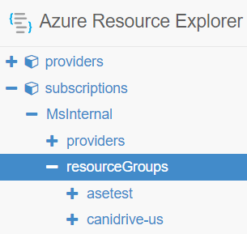
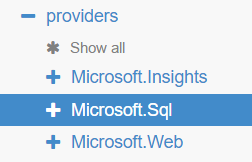
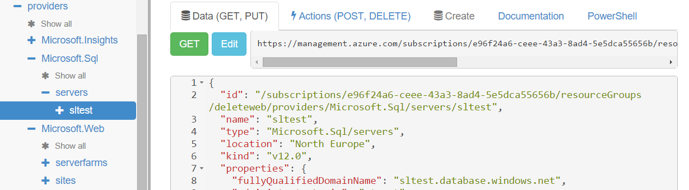
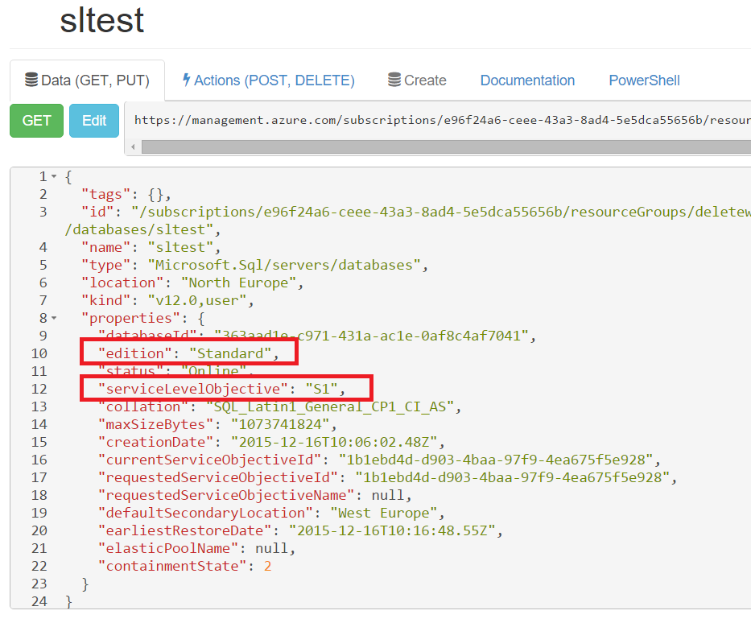
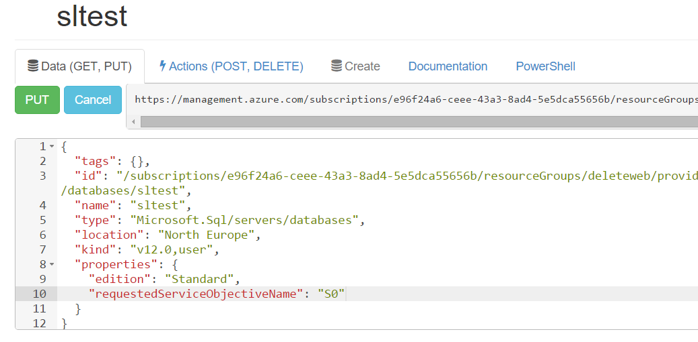
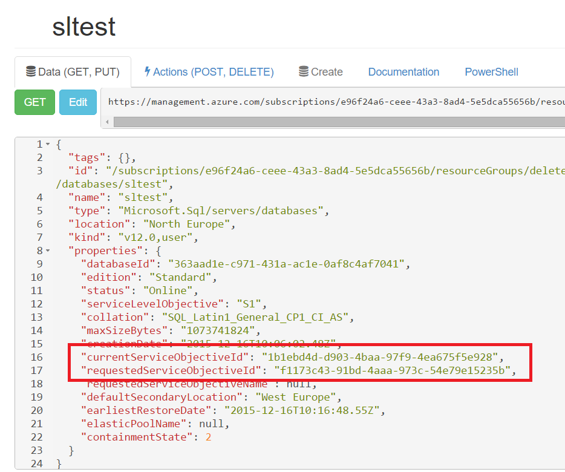
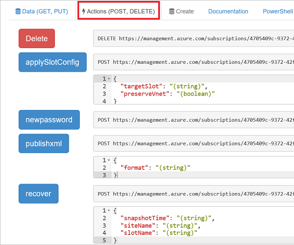
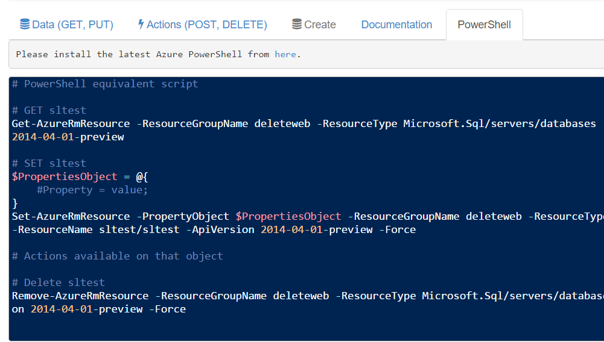

<properties
   pageTitle="Azure-Explorers | Microsoft Azure"
   description="Beschreibt Azure Ressource Explorer und wie sie genutzt werden kann, zum Anzeigen und Aktualisieren von Bereitstellungen bis Azure Ressourcenmanager"
   services="azure-resource-manager"
   documentationCenter="na"
   authors="stuartleeks"
   manager="ankodu"
   editor=""/>

<tags
   ms.service="azure-resource-manager"
   ms.devlang="na"
   ms.topic="article"
   ms.tgt_pltfrm="na"
   ms.workload="na"
   ms.date="08/01/2016"
   ms.author="stuartle;tomfitz"/>

# Verwenden von Azure Ressource Explorer zum Anzeigen und Ändern von Ressourcen
Der [Azure-Explorers](https://resources.azure.com) ist ein großartiges Tool für die Suche bei Ressourcen, die Sie bereits in Ihrem Abonnement erstellt haben. Mithilfe dieses Tool können Sie verstehen, wie die Ressourcen sind strukturiert und finden Sie unter den Eigenschaften, die jeder Ressource zugeordnet. Sie können Informationen zu den REST-API Vorgänge und PowerShell-Cmdlets für einen Ressourcentyp verfügbar sind, und Sie können auch Befehle über die Benutzeroberfläche. Ressourcen-Explorer kann besonders hilfreich sein, wenn Sie Ressourcenmanager Vorlagen erstellen, da Sie zum Anzeigen der Eigenschaften für vorhandene Ressourcen können.

Die Quelle für die Ressource Explorer-Tool steht auf [Github](https://github.com/projectkudu/ARMExplorer), die eine wertvolle bereitstellt, wenn Sie ein ähnliches Verhalten in Ihrem eigenen Clientanwendungen implementieren müssen.

## Ressourcen anzeigen
Navigieren Sie zu [https://resources.azure.com](https://resources.azure.com) , und melden Sie sich mit den gleichen Anmeldeinformationen, die Sie für das [Azure-Portal](https://portal.azure.com)verwenden möchten.

Nach dem Laden, können der Strukturansicht auf der linken Seite Drilldown in Ihre Abonnements und Ressourcengruppen auf:

Wie Sie einen Drilldown in einer Ressourcengruppe durchführen sehen Sie den Anbieter für die Ressourcen in dieser Gruppe vorhanden sind:

Von dort aus können Sie den Drilldown für der Ressourceninstanzen starten. Im folgenden Bildschirmfoto sehen Sie die `sltest` SQL Server-Instanz in der Strukturansicht. Klicken Sie auf der rechten Seite können, finden Sie Informationen über die REST-API Besprechungsanfragen, die Sie mit dieser Ressource verwenden können. Navigieren zu den Knoten für eine Ressource, indem Sie trifft Ressource Explorer automatisch die GET-Anforderung zum Abrufen von Informationen zur Ressource an. In den großen Textbereich unterhalb der URL sehen Sie die Antwort aus der-API. 

Wenn Sie mit Vorlagen Ressourcenmanager vertraut beginnt des Textkörpers vertraut aussehen! Im Abschnitt **Eigenschaften** der Antwort entspricht die Werte, die Sie im Abschnitt **Eigenschaften** der Vorlage angeben können.

Ressourcen-Explorer ermöglicht es Ihnen, nach unten untergeordneten Ressourcen, wenn der SQL-Datenbankserver untersuchen Detailebenen beibehalten, stehen Ihnen untergeordneten Ressourcen für Elemente wie Datenbanken und Firewall-Regeln.

Untersuchen einer Datenbank zeigt uns die Eigenschaften für diese Datenbank. In den folgenden Screenshot können wir sehen, die Datenbank `edition` ist `Standard` und die `serviceLevelObjective` (oder Datenbankebene) ist `S1`.

## Ändern von Ressourcen

Nachdem Sie an eine Ressource gewechselt sind, können Sie die Schaltfläche Bearbeiten, um den JSON-Inhalt bearbeitbar auswählen. Dann können Ressourcen-Explorer zum Bearbeiten der JSON und senden Sie eine Besprechungsanfrage sich so ändern Sie die Ressource. Die nachstehende Abbildung zeigt beispielsweise die Datenbankebene in geändert `S0`:

Indem Sie auswählen, **setzen** Sie die Anforderung senden. 

Nachdem die Anforderung gesendet wurde Probleme erneut Ressource Explorer GET-Anforderung, um den Status zu aktualisieren. In diesem Fall sehen wir, dass die `requestedServiceObjectiveId` wurde aktualisiert und unterscheidet sich von der `currentServiceObjectiveId` angibt, die ein Vorgang Skalierung ausgeführt wird. Sie können die GET-Schaltfläche, um den Status manuell aktualisieren klicken.

## Ausführen von Aktionen für Ressourcen

Die Registerkarte **Aktionen** können Sie anzeigen und zusätzliche REST Vorgänge durchführen. Wenn Sie eine Ressource für die Website ausgewählt haben, bietet die Registerkarte Aktionen beispielsweise eine lange Liste mit verfügbaren Vorgänge, von die einige unten dargestellt werden.

## Aufrufen der-API über PowerShell
Die Registerkarte PowerShell Ressource Explorer wird gezeigt, die Cmdlets zu verwenden, um mit der Ressource zu interagieren, die Sie zurzeit untersuchen werden. Je nach Art der Ressource, die Sie ausgewählt haben, das angezeigte PowerShell-Skript kann im Bereich von einfachen Cmdlets (z. B. `Get-AzureRmResource` und `Set-AzureRmResource`) zu komplizierter Cmdlets (z. B. austauschen Steckplätze auf einer Website). 

Weitere Informationen auf der Azure-PowerShell-Cmdlets finden Sie unter [Verwenden von Azure PowerShell Azure Ressourcenmanager](powershell-azure-resource-manager.md)

## Zusammenfassung
Bei der Arbeit mit Ressourcenmanager kann der Ressource Explorer äußerst hilfreich sein. Es ist eine großartige Möglichkeit zum Suchen von Methoden zur Verwendung von PowerShell Abfragen und Änderungen vornehmen. Wenn Sie die REST-API arbeiten, ist es eine großartige Möglichkeit, um erste Schritte und API-Aufrufe schnell zu testen, bevor Sie beginnen, Schreiben von Code. Und wenn Sie Vorlagen, dass werden eine großartige Möglichkeit, um der Ressourcenhierarchie verstehen und Suchen eines Speicherorts für Konfigurations - schreiben, können Sie nehmen Sie eine Änderung im Portal und suchen Sie dann die entsprechenden Einträge in Ressource Explorer!

Weitere Informationen schauen Sie sich die [Channel 9 video mit Stefan Hanselman und David Ebbo](https://channel9.msdn.com/Shows/Azure-Friday/Azure-Resource-Manager-Explorer-with-David-Ebbo)

