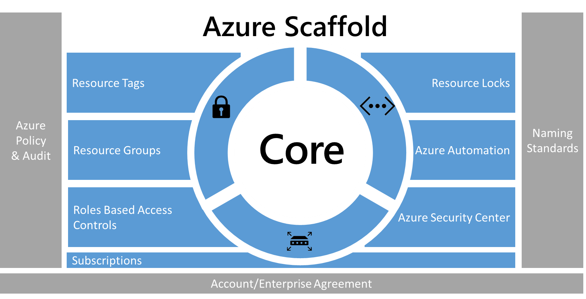

<properties
   pageTitle="Bewährte Methoden für Unternehmen in Azure verschieben | Microsoft Azure"
   description="Beschreibt ein Gerüst, die Unternehmen verwenden können, um eine sichere und verwaltbare Umgebung sicherzustellen."
   services="azure-resource-manager"
   documentationCenter="na"
   authors="rdendtler"
   manager="timlt"
   editor="tysonn"/>

<tags
   ms.service="azure-resource-manager"
   ms.devlang="na"
   ms.topic="article"
   ms.tgt_pltfrm="na"
   ms.workload="na"
   ms.date="10/05/2016"
   ms.author="rodend;karlku;tomfitz"/>

# Azure Enterprise Scaffold - Abonnement Nachschlagewerke governance

Unternehmen sind zunehmend die öffentliche Cloud für seine Flexibilität und Flexibilität eingeführt werden. Sie sind Nutzung der Cloud Stärken zum Umsatz oder Ressourcen für Unternehmen zu optimieren. Microsoft Azure bietet einer Vielzahl von Diensten an, dass diese Zusammenstellen von Unternehmen wie Bausteine eine Vielzahl von Auslastung und -Programmen behoben werden können. 

Aber zu wissen, wo Sie beginnen gestaltet sich häufig schwierig. Nachdem Sie sich entscheiden, Azure verwenden, treten einige Fragen im Allgemeinen:

- "Wie wird treffen unsere gesetzlichen Vorschriften für Daten Hoheit in bestimmten Ländern?"
- "Wie sicherstellen kann ich, dass jemand nicht versehentlich eine kritische System ändert?"
- "Wie kann ich feststellen, was jeder Ressource unterstützt werden, damit ich Konto können, für die es und es wieder am genauesten Rechnung?"

Der Interessenten eines leeren Abonnements mit keine Geländer ist schwierig. Diese Leerzeichen kann Ihre verschieben in Azure behindern.

Dieser Artikel bietet einen Ausgangspunkt für technische Freiberufler Adresse die Notwendigkeit der Governance und mit der Notwendigkeit der Flexibilität zu verteilen. Das Konzept von einem Enterprise-Scaffold, die Organisationen implementieren und Verwalten von Azure-Abonnements führt. 

## Notwendigkeit der governance

Beim Verschieben von in Azure, müssen Sie das Thema der Governance früh, um sicherzustellen, dass die erfolgreiche Verwendung des Cloud innerhalb des Unternehmens zu beheben. Leider bedeutet der Arbeitszeiten und des Erstellens eines Systems umfassende Governance Bürokratie, dass einige Gruppen Business ohne Enterprise IT betreffen direkt zu Lieferanten wechseln. Dieser Ansatz kann Unternehmen geöffnet lassen Schwachstellen, wenn die Ressourcen nicht ordnungsgemäß verwaltet werden. Die Merkmale der öffentlichen Cloud - Flexibilität, Flexibilität und Preise Verbrauch-basierten - sind wichtig, zu Business-Gruppen, um schnell die Notwendigkeit, Kunden (internen und externen) entsprechen müssen. Aber Enterprise IT stellen Sie sicher, dass Daten und Systeme wirksam geschützt werden muss.

In der Praxis wird Gerüstbau verwendet, um die Grundlage für die Struktur zu erstellen. Die Scaffold führt die allgemeine Gliederung und stellt Ankerpunkte für permanente Systeme bereitgestellt werden soll. Eine Enterprise-Scaffold ist gleich: eine Reihe von flexible Steuerelemente und Azure-Funktionen, die Strukturierung Umgebung und Anker werden für basierend auf der öffentlichen Cloud-Dienste. Es stellt die Builder (IT und Business Gruppen) eine Foundation zu erstellen, und fügen Sie neue Dienste.

Die Scaffold basiert auf Methoden, die wir in vielen Projekten für Kunden verschiedener Größe gesammelt haben. Diese im Clientbereich von kleinen Unternehmen zur Entwicklung von Lösungen in der Cloud zu Fortune 500-Unternehmen und unabhängigen Software-Händler, bei der Migration sind und zur Entwicklung von Lösungen in der Cloud. Die Scaffold Enterprise ist "speziell" flexibel, um sowohl von herkömmlichen IT-Auslastung agiles Auslastung; unterstützt werden Azure-Funktionen, wie z. B. Entwickler, Software-as-a-Service (SaaS) Applications erstellen Grundlage.

Die Enterprise-Scaffold soll die Grundlage für jedes neue Abonnement in Azure sein. Mit dem Administratoren sicherstellen, dass die Auslastung der minimalen Governance einer Organisation erfüllen ohne verhindern, dass Business Gruppen und Entwickler schnell eigene Ziele Besprechung.

> [AZURE.IMPORTANT] Governance ist entscheidend für den Erfolg von Azure. In diesem Artikel Ziel hat die technische Durchführung einer Enterprise Scaffold jedoch nur auf die breiteren Prozess und Beziehungen zwischen den Komponenten berührt. Richtlinie Governance fließt von oben nach unten und hängt von Was Unternehmen erreicht werden sollen. Natürlich umfasst die Erstellung eines governancemodells für Azure Vertreter von IT, doch wichtiger sollte es signifikante Darstellung von Business Gruppenleiter und Sicherheit und Risikomanagement. Ist am Ende einer Enterprise Scaffold zur Vermeidung von geschäftliche Risiken um Auftrag und Ziele eines Unternehmens zu erleichtern.

Die folgende Abbildung beschreibt die Komponenten der Scaffold. Die Grundlage beruht auf einen durchgezogenen Plan für Abteilungen, Konten und Abonnements. Die Säulen bestehen aus Ressourcenmanager Richtlinien und sicherer naming-Standards. Die restlichen Scaffold stammen aus Core Azure-Funktionen und features, mit denen eine sichere und verwaltbare Umgebung.

> [AZURE.NOTE] Azure gewachsen schnell seit seiner Einführung in 2008. Dieses Wachstum: Microsoft Technik Teams zu deren Ansatz zum Verwalten und Bereitstellen von Diensten überdenken erforderlich. Ressourcenmanager Azure Modell wurde in 2014 eingeführt und ersetzt das Bereitstellungsmodell klassischen. Ressourcenmanager können Organisationen einfacher bereitstellen, organisieren und Azure Ressourcen steuern. Ressourcenmanager enthält Parallelisierung Ressourcen für schnellere Bereitstellung von Lösungen für komplexe, voneinander zu erstellen. Darüber hinaus präzise Access-Steuerelement, und die Möglichkeit zum Kategorisieren von Ressourcen mit Metadaten. Microsoft empfiehlt, dass Sie alle Ressourcen über das Modell Ressourcenmanager erstellen. Die Enterprise-Scaffold dient explizit Ressourcenmanager Modell.

## Definieren der Hierarchie

Die Grundlage für die Scaffold ist das Azure Enterprise-Registrierung (und Enterprise Portal). Das Enterprise-Registrierung definiert das Shape und Azure Dienste innerhalb eines Unternehmens nutzen und ist die Core Governance-Struktur. Kunden können innerhalb der Enterprise Agreement die Umgebung in Abteilungen, Konten und schließlich Abonnements weiteren unterteilen. Ein Azure-Abonnement ist die Grundeinheit, in dem alle Ressourcen enthalten sind. Darüber hinaus werden mehrere Grenzwerte in Azure, beispielsweise die Anzahl der Kerne, Ressourcen usw. definiert.

Jeder Enterprise unterscheidet und die Hierarchie in der vorherigen Abbildung ermöglicht signifikante Flexibilität in Azure innerhalb des Unternehmens Aufbau. Vor dem Implementieren der in diesem Dokument enthaltenen Hinweise, sollten Sie die Hierarchie modellieren und grundlegende Informationen zu den Einfluss auf die Abrechnung, Zugriff auf Ressourcen und Komplexität.

Die drei allgemeine Muster für die Registrierung für die Azure sind:

- Das **Funktionsübergreifendes** Muster

    

- Das **Business Unit** -Muster 

    

- Die **geografischen** Muster

    

Sie übernehmen die Scaffold Ebene der Abonnement um die Governance Anforderungen des Unternehmens in das Abonnement zu erweitern.

## Benennen standards

Der erste Säule von der Scaffold ist Standards benennen. Durchdachter naming-Standards können Sie Ressourcen im Portal auf einer Rechnung, und klicken Sie innerhalb von Skripts zu identifizieren. In den meisten Fällen müssen Sie bereits Standards für lokal Infrastruktur benennen. Beim Hinzufügen von Azure zu Ihrer Umgebung, sollten Sie diese naming-Standards auf Ihre Azure Ressourcen erweitern. Benennen Standard eine effizienteren Verwaltung der Umgebung auf allen Ebenen erleichtern.

> [AZURE.TIP]
>
> - Überprüfen und Übernehmen der Where möglich die [Muster und Methoden Anleitungen](./guidance/guidance-naming-conventions.md). Dieser Leitfaden hilft Ihnen bei der Entscheidung für einen aussagekräftigen naming Standard.
> - Verwenden Sie CamelCasing für Namen von Ressourcen (z. B. MyResourceGroup und VnetNetworkName). Hinweis: Es gibt bestimmte Ressourcen, wie z. B. Speicherkonten, wo die einzige Möglichkeit besteht darin, Kleinbuchstaben (oder andere Sonderzeichen) verwenden.
> - Erwägen Sie Ressourcenmanager Azure-Richtlinien (im nächsten Abschnitt beschrieben) naming-Standards erzwingen.
 
## Richtlinien und Überwachung

Der zweiten Säule von der Scaffold umfasst das Erstellen von [Azure Ressourcenmanager Richtlinien](resource-manager-policy.md) und [Überwachung der Aktivität Log](resource-group-audit.md). Ressourcenmanager Richtlinien bieten Ihnen die Möglichkeit, das Risiko in Azure verwalten. Sie können Richtlinien definieren, die Daten Hoheit nach einschränken, erzwingen oder bestimmte Aktionen Überwachung sicherzustellen. 

- Richtlinie ist ein Standard-System **erlauben** . Sie steuern Aktionen definieren und Zuweisen von Richtlinien für Ressourcen, die den oder die Aktionen auf Ressourcen überwachen.
- Richtlinien werden von der Richtliniendefinitionen in einer Richtlinie Definition Language (Wenn-dann-Bedingungen) beschrieben.
- Erstellen Sie Richtlinien mit JSON (Javascript Object Notation) formatierte Dateien. Nach dem Definieren einer Richtlinie, Sie weisen sie an einen bestimmten Bereich: Abonnement, Ressourcengruppe. oder Ressourcen.

Richtlinien können mehrere Aktionen, die für Ihre Szenarios einen abgestimmte Ansatz zulässig ist. Die Aktionen sind:

-   **Verweigern**: blockiert die Ressource anfordern
-   **Audit**: ermöglicht die Anfrage, aber die Aktivität Log (die Benachrichtigungen bereitstellen oder Runbooks auslösen verwendet werden kann) eine Linie hinzugefügt
-   **Anfügen**: die Ressource angegebenen Informationen hinzugefügt. Wenn eine Kategorie "CostCenter" für eine Ressource nicht vorhanden ist, fügen Sie beispielsweise das Tag mit einem Standardwert.

### Häufige Verwendungen Ressourcenmanager Richtlinien

Azure Ressourcenmanager Richtlinien sind ein leistungsfähiges Tool im Azure-Toolkit. Sie können damit vermeiden unerwartete Kosten, eine Kostenstelle für Ressourcen durch tagging zu identifizieren, und stellen Sie sicher, dass Konformität Anforderungen erfüllt sind. Wenn die Richtlinien mit den integrierten Überwachungsfunktionen kombiniert werden, können Sie komplexe und flexible Lösungen Weise. Richtlinien zulassen Unternehmen Steuerelemente für Auslastung "Traditionelle IT" und "Agile" Auslastung bereitstellen; Entwickeln, wie z. B. Kunden Applications. Die am häufigsten verwendeten Muster, die wir für Richtlinien angezeigt, werden:

- **Geo-Konformität/Data Hoheit** - Azure bietet Regionen auf der ganzen Welt an. Unternehmen möchten häufig steuern, wo Ressourcen erstellt werden (, ob um sicherzustellen, dass Daten Hoheit oder nur sicherstellen, dass die Ressourcen in der Nähe der Nutzer Ende der Ressourcen erstellt werden).
- **Verwaltung von Kosten** – ein Azure-Abonnement kann Ressourcen vieler Arten und Dezimalstellen enthalten. Unternehmen möchten häufig um sicherzustellen, dass der standard-Abonnements vermeiden unnötig große Ressourcen, die Hundert Dollar, einen Monat oder mehrere Kosten können.
- **Governance durch erforderlichen Kategorien Standard** - Tags mit Anforderung der ist eine der am häufigsten verwendeten und hochgradig gewünschten Features. Mit Azure Ressourcenmanager Richtlinien sind Unternehmen in der Lage, um sicherzustellen, dass eine Ressource ordnungsgemäß markiert sind. Die am häufigsten verwendeten Tags sind: Abteilung, Besitzer der Ressource und Umgebung Typ (z. B. - Herstellung Test, Entwicklung)

**Beispiele**

"Traditionelle IT" Abonnement für Zeile branchenanwendungen

-   Erzwingen der Abteilung und Besitzer Kategorien auf alle Ressourcen
-   Erstellen von Ressourcen in der Region North American einschränken
-   Einschränken Sie die Möglichkeit zum Erstellen von G-Serie virtuellen Computern und HDInsight Cluster

"Agiles"-Umgebung, die für eine Business Einheit Cloud Applications erstellen

- Wenn Sie Daten Hoheit erfüllen, ermöglichen Sie die Erstellung von Ressourcen nur in einem bestimmten Bereich.
- Erzwingen der Umgebung Kategorie auf alle Ressourcen. Wenn eine Ressource ohne eine Kategorie erstellt wurde, fügen Sie die **Umgebung: unbekannten** Kategorie, die der Ressource.
- Audit, wenn Ressourcen außerhalb von Nordamerika erstellt werden, aber nicht verhindert.
- Audit Wenn höchst-Kostenressourcen erstellt werden.

> [AZURE.TIP]
>
> *Wo* Ressourcen erstellt werden können und *welche* Arten von Ressourcen erstellt werden können, wird die am häufigsten verwendet Ressourcenmanager Richtlinien über Organisationen zum Steuerelement. Zusätzlich zur Bereitstellung Steuerelemente auf der *Position* und *welche*verwenden viele Unternehmen Richtlinien, um sicherzustellen, dass Ressourcen die entsprechende Metadaten, für den Verzehr in Rechnung gestellt haben. Es wird empfohlen, Richtlinien für Ebene der Abonnement anwenden:
>
> - Hoheit Geo-Compliance-Daten
> - Verwaltung von Kosten
> - Erforderliche Kategorien (festgelegt durch geschäftliche Notwendigkeit, wie z. B. RechnungAn, Besitzer der Anwendung)
>
> Sie können weitere Richtlinien am unteren Ebenen des Gültigkeitsbereichs anwenden.
 
### Audit - ist was passiert?

Um anzuzeigen, wie Ihre Umgebung funktioniert, müssen Sie Benutzeraktivitäten zu überwachen. Die meisten Ressourcentypen in Azure erstellen Diagnoseprotokolle, die Sie über ein Protokoll Tool oder in Azure Vorgänge Management Suite analysieren können. Sie können über mehrere Abonnements für eine Abteilung bereitstellen oder Enterprise-Ansicht Aktivitätsprotokolle sammeln. Audit-Einträge sind sowohl Werkzeug Diagnose und ein entscheidend Verfahren zum Auslösen der Ereignisse in der Azure-Umgebung.

Platzieren Sie Aktivitätsprotokolle aus Ressourcenmanager Bereitstellungen ermöglichen es Ihnen, die **Vorgänge** zu ermitteln, die durchgeführt wurde, und wer Sie erledigt hat. Aktivitätsprotokolle können erfasst werden und mithilfe von Tools wie Log Analytics aggregiert.

## Ressourcen-Kategorien

Wenn Benutzer in Ihrer Organisation mit dem Abonnement für Ressourcen hinzufügen, wird es immer wichtiger, zu der entsprechenden Abteilung, Kunden und Umgebung Ressourcen zuordnen. Sie können Ressourcen über [Kategorien](resource-group-using-tags.md)Metadaten hinzufügen. Verwenden von Kategorien und Informationen zu der Ressource oder der Besitzer enthält. Kategorien können Sie nicht nur aggregieren und Gruppieren von Ressourcen auf verschiedene Weise, aber die Daten Testzwecken von Chargeback verwenden. Sie können Ressourcen mit bis zu 15 Schlüssel: Wert-Paare kategorisieren. 

Ressource Kategorien sind flexibel und auf die meisten Ressourcen angefügt werden soll. Beispiele für allgemeine Ressource Kategorien sind:

- BillTo
- Abteilung (oder Business Unit)
- Umgebung (Herstellung, Phase, Entwicklung)
- Ebene (Webebene, Schicht Anwendung)
- Besitzer der Anwendung
- Projektname

Weitere Beispiele für Kategorien finden Sie unter [Benennungskonventionen für Azure Ressourcen empfohlen](./guidance/guidance-naming-conventions.md).

> [AZURE.TIP]
>
> Erstellen einer tagging Strategie, die über Ihre Abonnements identifiziert, welche Metadaten für die Business, Finanzen, Sicherheit, Risikomanagement und Gesamtkosten für die Verwaltung der Umgebung benötigt werden. Erwägen Sie die Erstellung einer Richtlinie, die für tagging erfordert:
>
> - Ressourcengruppen
> - Speicher
> - Virtuellen Computern
> - Service-Umgebungen/Web Anwendungsserver

## Ressourcengruppe 

Ressourcenmanager können Sie Ressourcen in aussagekräftige Gruppen für die Verwaltung Rechnungsadresse oder natürlich Zugehörigkeit zu setzen. Wie zuvor schon erwähnt, weist Azure zwei Bereitstellungsmodelle aus. In der früheren Klassisch wurde die Grundeinheit der Verwaltung des Abonnements. Es war schwierig zu unterbrechen der unten Ressourcen innerhalb eines Abonnements, die zur Erstellung einer großen Anzahl von Abonnements geführt haben. Mit dem Modell Ressourcenmanager gesehen wir die Einführung von Ressourcengruppen haben. Ressourcengruppen sind Container für Ressourcen, die allgemeine Lebenszyklus oder freigeben ein Attribut wie "alle SQL Server" oder "Anwendung A".

Ressourcengruppen können nicht ineinander enthalten sein und Ressourcen können nur einer Ressourcengruppe gehören. Sie können bestimmte Aktionen auf alle Ressourcen in einer Ressourcengruppe anwenden. Löschen einer Ressourcengruppe entfernt beispielsweise alle Ressourcen innerhalb der Ressourcengruppe auf. Setzen Sie in der Regel eine gesamte Anwendung oder verwandte System in derselben Ressourcengruppe aus. Eine drei Ebenen Anwendung mit dem Namen "Contoso" Webanwendung würde beispielsweise den Webserver, Anwendungsserver und SQLServer in der gleichen Ressourcengruppe enthalten.

> [AZURE.TIP]
>
> Möglicherweise wie Sie Ihrer Ressourcengruppen Organisieren von "Traditionelle IT" Auslastung zu "Agiles IT" Auslastung abweichen.
>
> - "Traditionelle IT" Auslastung durch Elemente innerhalb der gleichen Lebenszyklus, beispielsweise eine Anwendung am häufigsten gruppiert werden. Gruppieren von Anwendung ermöglicht für einzelne anwendungsverwaltung.
> - "Agiles IT" Auslastung in der Regel auf externe Kunden zugänglichen Cloud Applikationen konzentrieren. Die Ressourcengruppen sollte die Ebenen der Bereitstellung (z. B. Web Stufe, App-Leiste) widerspiegeln und Verwaltung.

## Rollenbasierte Access-Steuerelement

Sie sind wahrscheinlich Fragen "Wer soll Zugriff auf Ressourcen besitzen?" und "Wie steuere ich diesen Zugriff auf?" Zuzulassen oder ablehnen von Zugriff auf das Portal Azure und Steuern des Zugriffs auf Ressourcen im Portal ist entscheidend. 

Access-Steuerelemente auf ein Abonnement Azure Anfangs veröffentlicht wurde, grundlegende wurden: oder Co-Administratoren. Zugreifen Sie auf ein Abonnement im Modell impliziert klassischen Zugriff auf alle Ressourcen im Portal. Diese fehlende abgestimmte Steuerelement zu der zu viele Abonnements geführt haben, um einen Grad der Zugriffskontrolle angemessenen für einer Registrierung Azure bereitzustellen.

Diese zu viele Abonnements wird nicht mehr benötigt. Mit rollenbasierte Access Control können Sie Benutzer Standardrollen (z. B. allgemeine "Leser" und "Autor" Arten von Rollen) zuweisen. Sie können auch benutzerdefinierte Rollen definieren.

> [AZURE.TIP]
>  
> - Herstellen einer Verbindung Azure Active Directory mithilfe des Tools für die AD-Verbinden mit Ihrer corporate Identität Store (am häufigsten Active Directory).
> - Steuern der Administrator/Co-Administrator eines Abonnements mithilfe einer verwalteten Identität an. **Nicht** Zuweisen der Abonnementbesitzer einer neuen Administrator/Co-Administrator. Verwenden Sie stattdessen RBAC-Rollen Rechte **Besitzer** einer Gruppe oder einzelnen bereitstellen.
> - Hinzufügen von Azure Benutzern zu einer Gruppe (beispielsweise Anwendung X Besitzer) in Active Directory. Verwenden Sie die synchronisierte Gruppe Gruppenmitglieder die erforderlichen Berechtigungen zum Verwalten der Ressourcengruppe, enthält die Anwendung bereitgestellt.
> - Führen Sie das Prinzip der **minimalen Rechte** erforderlich, um die erwartete Arbeit erledigen gewähren. Beispiel:
>     - Bereitstellung Gruppe: Eine Gruppe, die nur Ressourcen bereitstellen kann.
>     - Verwaltung von virtuellen Computern: Eine Gruppe, die virtuellen Computern (für Vorgänge) neu gestartet werden kann

## Sperren Azure Ressourcen

Ihre Organisation das Abonnement Core Services hinzufügt, wird es immer wichtiger, um sicherzustellen, dass diese Dienste für Business Unterbrechung zu vermeiden verfügbar sind. [Sperren für Ressourcen](resource-group-lock-resources.md) können Sie Vorgänge wertvolle Ressourcen, geändert oder gelöscht werden auf Ihrem Applikationen oder Cloud-Infrastruktur auswirken würde, einschränken. Sie können ein Abonnement, Ressourcengruppe oder Ressource sperren anwenden. In der Regel, wenden Sie Sperren zu grundlegenden Ressourcen wie virtuelle Netzwerke, Gateways und Speicherkonten. 

Sperren für Ressourcen zurzeit unterstützt zwei Werte: CanNotDelete und schreibgeschützt. CanNotDelete bedeutet, dass die Benutzer (mit den entsprechenden Berechtigungen) weiterhin können lesen oder ändern eine Ressource aber nicht löschen. Schreibgeschützte bedeutet, dass autorisierte Benutzer nicht löschen oder ändern eine Ressource.

Zum Erstellen oder Löschen von Management sperren, haben Sie Zugriff auf `Microsoft.Authorization/*` oder `Microsoft.Authorization/locks/*` Aktionen.
Der integrierten Rollen werden diese Aktionen nur Besitzer und Benutzer Access-Administrator erteilt werden.

> [AZURE.TIP] Core Netzwerkoptionen sollte mit Sperren geschützt werden. Unbeabsichtigtes Löschen eines Gateways, wäre Standort-zu-Standort VPN Personen ebenso wie ein Azure-Abonnement. Azure nicht möglich, ein virtuelles Netzwerk löschen, das verwendet wird, aber weitere Einschränkungen anwenden Vorsicht hilfreich ist. Richtlinien sind aber auch mit der Wartung der entsprechenden Steuerelemente entscheidend. Es empfiehlt sich, dass Sie einer **CanNotDelete** Sperren anwenden zu Richtlinien, die verwendet werden.
>
> - Virtuelle Netzwerk: CanNotDelete
> - Netzwerk-Sicherheitsgruppe: CanNotDelete
> - Richtlinien: CanNotDelete

## Core Netzwerke Ressourcen

Zugriff auf Ressourcen möglich internen (innerhalb des Unternehmens Netzwerk) oder externen (über das Internet). Es ist einfach für Benutzer in Ihrer Organisation versehentlich Ressourcen in der falschen Stelle setzen und diese potenziell bösartiger Access öffnen. Wie bei lokal Geräten müssen Unternehmen geeignete Steuerelementen, um sicherzustellen, dass die richtigen Entscheidungen, Azure Benutzer treffen hinzufügen. Für Abonnements Governance identifizieren wir Core-Ressourcen, die grundlegende Steuerung des Zugriffs bereitstellen. Die Core Ressourcen bestehen aus:

- **Virtuelle Netzwerke** sind Containerobjekte für Subnetze. Zwar nicht unbedingt erforderlich ist, wird es häufig bei der Verbindung von Applications auf interne Ihres Unternehmens Ressourcen.
- **Netzwerk-Sicherheitsgruppen** sind ähnlich wie eine Firewall und Regeln für wie eine Ressource "kommunizieren" kann über das Netzwerk bereitzustellen. Geben Sie präzise steuern, wie / wenn ein Subnetz (oder virtuellen Computern) mit dem Internet oder anderen Subnetzen im gleichen virtuellen Netzwerk eine Verbindung herstellen können.

> [AZURE.TIP]
>  
> - Erstellen Sie virtuelle Netzwerke dedizierter außen gerichteten Auslastung und internen Auslastung. Dieser Ansatz reduziert die Wahrscheinlichkeit, dass versehentlich Platzieren von virtuellen Computern, die für interne Auslastung in einem externen zugänglichen Raum vorgesehen sind.
> - Netzwerk-Sicherheitsgruppen sind entscheidend, diese Konfiguration. Mindestens interne virtuelle Netzwerke hindern Sie Zugriff auf das Internet, und Sperren Sie des Zugriffs von externen virtuellen Netzwerken mit dem Firmennetzwerk verbunden.

### Automatisierung

Verwalten von Ressourcen einzeln ist beides zeitaufwändiger und potenziell für bestimmte Vorgänge. Azure bietet verschiedene Automatisierungsfunktionen einschließlich Azure Automatisierung, Logik Apps und Azure-Funktionen. [Azure Automatisierung](./automation/automation-intro.md) können Administratoren erstellen und definieren Runbooks, um allgemeine Aufgaben bei der Verwaltung von Ressourcen zu behandeln. Erstellen Sie Runbooks mithilfe eines PowerShell-Code-Editor oder einem grafischen-Editor. Sie können komplexe mehrstufige Workflows erstellen. Azure Automatisierung wird häufig verwendet, allgemeine Aufgaben wie nicht verwendete Ressourcen beendet, oder Erstellen von Ressourcen als Antwort auf einen bestimmten Trigger ohne personenbezogenen Eingriff zu behandeln.

> [AZURE.TIP]
>
> - Erstellen Sie ein Konto Azure Automatisierung, und überprüfen Sie die verfügbaren Runbooks (Grafik- und Befehl Linie) im [Katalog Runbooks](./automation/automation-runbook-gallery.md)verfügbar.
> - Importieren und Anpassen von Key Runbooks für Ihre Zwecke verwenden.
>
> Ein gängiges Szenario ist die Möglichkeit, Start/war(en) virtuellen Computern nach einem Zeitplan. Es gibt Beispiel Runbooks, die im Katalog verfügbar sind, die sowohl behandeln dieses Szenario veranschaulichen, wie um ihn zu erweitern.

## Azure-Sicherheitscenter

Vielleicht wurden eine von der größten Popupblocker in die cloud Annahme die Aspekte Sicherheit. IT-Risiko-Manager und Sicherheit Abteilungen müssen sicherstellen, dass Ressourcen Azure sicher sind. 

Im [Sicherheitscenter Azure](./security-center/security-center-intro.md) bietet einen zentralen Überblick über den Status der Abonnements Ressourcen und stellt Empfehlungen, die verhindern, dass betroffenen Ressourcen. Sie können eine genauere Richtlinien (z. B. anwenden Richtlinien für bestimmte Ressourcengruppen, mit denen das Unternehmen, deren Posture an das Risiko anzupassen, die sie adressieren werden kann) aktivieren. Schließlich ist Azure-Sicherheitscenter eine offene Plattform, die Microsoft-Partner und Softwarelieferanten unabhängige Software zu erstellen, die an Azure Sicherheitscenter zur Verbesserung seiner Funktionen angeschlossen ist aktiviert. 

> [AZURE.TIP]
>
> Azure-Sicherheitscenter ist standardmäßig in jedem Abonnement aktiviert. Sie jedoch müssen aktivieren Datensammlung aus virtuellen Computern Azure Sicherheitscenter seinen Agent installieren und Erfassen von Daten beginnen können.
>
> 

## Nächste Schritte

- Jetzt, da Sie Abonnement Governance erfahren haben, ist es Zeit für diese empfohlenen in der Praxis anzuzeigen. Beispiele für [Governance Azure-Abonnement implementieren](resource-manager-subscription-examples.md).

*[Karl Kuhnhausen](https://github.com/karlkuhnhausen) beigetragen zu diesem Thema.*
