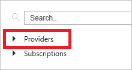

<properties
   pageTitle="Ressourcenmanager unterstützten Dienste | Microsoft Azure"
   description="Beschreibt die Ressourcenanbieter, die unterstützen Ressourcenmanager, deren Schemas und verfügbarer API Versionen und die Regionen, die die Ressourcen hosten können."
   services="azure-resource-manager"
   documentationCenter="na"
   authors="tfitzmac"
   manager="timlt"
   editor="tysonn"/>

<tags
   ms.service="azure-resource-manager"
   ms.devlang="na"
   ms.topic="article"
   ms.tgt_pltfrm="na"
   ms.workload="na"
   ms.date="10/25/2016"
   ms.author="magoedte;tomfitz"/>

# Ressourcenmanager Anbieter, Regionen, API Versionen und schemas

Azure Ressourcenmanager bietet eine neue Möglichkeit zum Bereitstellen und Verwalten der Dienste, die Ihre Applikationen bilden. Die meisten, aber nicht alle Dienste unterstützen Ressourcenmanager und einige Dienste Ressourcenmanager nur teilweise unterstützt. Dieses Thema enthält eine Liste der unterstützten Ressourcenanbieter für Azure Ressourcenmanager.

Beim Bereitstellen von Ressourcen, müssen Sie außerdem wissen, welche Bereiche diese Ressourcen unterstützen und welche Versionen API für die Ressourcen verfügbar sind. Im Abschnitt [unterstützte Regionen](#supported-regions) wird gezeigt, wie um herauszufinden, welche Bereiche Arbeit für Ihr Abonnement und Ressourcen werden kann. Im Abschnitt [Versionen unterstützt-API](#supported-api-versions) wird so bestimmen, welche Versionen API Sie verwenden können.

Auf welche Dienste in der Azure-Portal und klassischen Portal unterstützt werden, finden Sie unter [Azure Portals Verfügbarkeitsdiagramm](https://azure.microsoft.com/features/azure-portal/availability/). Auf welche Dienste verschieben Ressourcen unterstützen, finden Sie unter [Verschieben von Ressourcen zu neuen Ressourcengruppe oder das Abonnement](resource-group-move-resources.md).

In den folgenden Tabellen finden Sie welche Microsoft Services-Support-Bereitstellung und Management durch Ressourcenmanager, und zwar nicht. Der Link in der Spalte **Schnellstart Vorlagen** sendet eine Abfrage zum Repository Azure Schnellstart Vorlagen für die angegebenen Ressourcenanbieter. Schnellstart-Vorlagen hinzugefügt und häufig aktualisiert werden. Das Vorhandensein eines Links für einen bestimmten Dienst bedeutet nicht unbedingt, dass die Abfrage aus dem Repository Vorlagen zurückgegeben. Es gibt auch viele Drittanbieter-Ressourcenanbieter, die Ressourcenmanager unterstützen. Sie erfahren, wie Sie die Ressourcenanbieter im Abschnitt [Ressourcenanbieter und Datentypen](#resource-providers-and-types) finden Sie unter.

## Berechnen

| Dienst | Ressourcenmanager aktiviert | REST-API | Schema | Schnellstart-Vorlagen |
| ------- | ------------------------ |-------- | ------ | ------ |
| Stapelverarbeitung   | Ja     | [Stapel REST](https://msdn.microsoft.com/library/azure/dn820158.aspx) | [2015-12-01](https://github.com/Azure/azure-resource-manager-schemas/blob/master/schemas/2015-12-01/Microsoft.Batch.json)       |  |
|Container | Ja | [Container Dienst REST](https://msdn.microsoft.com/library/azure/mt711470.aspx) | [2016-03-30](https://github.com/Azure/azure-resource-manager-schemas/blob/master/schemas/2016-03-30/Microsoft.ContainerService.json) | [Microsoft.ContainerService](https://github.com/Azure/azure-quickstart-templates/search?utf8=%E2%9C%93&q=%22Microsoft.ContainerService%22&type=Code) |
| Dynamics Lifecycle Services | Ja  |      |        |  |
| Maßstab Datensätze | Ja | [Skalierung festlegen REST](https://msdn.microsoft.com/library/azure/mt705635.aspx) | [2015-08-01](https://github.com/Azure/azure-resource-manager-schemas/blob/master/schemas/2015-08-01/Microsoft.Compute.json) | [virtualMachineScaleSets](https://github.com/Azure/azure-quickstart-templates/search?utf8=%E2%9C%93&q=virtualMachineScaleSets&type=Code) | 
| Dienst Fabric | Ja  | [Dienst Fabric Rest](https://msdn.microsoft.com/library/azure/dn707692.aspx)  |      | [Microsoft.ServiceFabric](https://github.com/Azure/azure-quickstart-templates/search?utf8=%E2%9C%93&q=%22Microsoft.ServiceFabric%22&type=Code) |
| Virtuellen Computern | Ja | [VIRTUELLER COMPUTER REST](https://msdn.microsoft.com/library/azure/mt163647.aspx) | [2015-08-01](https://github.com/Azure/azure-resource-manager-schemas/blob/master/schemas/2015-08-01/Microsoft.Compute.json) | [virtualMachines](https://github.com/Azure/azure-quickstart-templates/search?utf8=%E2%9C%93&q=%22Microsoft.Compute%2Fvirtualmachines%22&type=Code) |
| Virtuellen Computern (klassisch) | Beschränkung | - | - | - |
| Remote-App | Nein      | -  | - | - |
| Cloud-Dienste (klassisch) | Beschränkung (siehe unten) | - | - | - |

Virtuellen Computern (klassisch) bezieht sich auf Ressourcen, die über das Bereitstellungsmodell klassischen statt über das Modell zur Bereitstellung von Ressourcenmanager bereitgestellt wurden. Im Allgemeinen diese Ressourcen Ressourcenmanager Vorgänge nicht unterstützt, aber es gibt einige Vorgänge, die aktiviert wurden. Weitere Informationen zu diesen Bereitstellungsmodellen finden Sie unter [Grundlegendes zu Ressourcenmanager und klassischen Bereitstellung](resource-manager-deployment-model.md). 

Cloud-Dienste (klassische) können mit anderen klassischen Ressourcen verwendet werden. Klassische Ressourcen wird jedoch nicht nutzen aller Ressourcenmanager Features und sind keine gute Option für zukünftige Lösungen. Erwägen Sie stattdessen, Ändern Ihrer Anwendungsinfrastruktur um Ressourcen aus den Namespaces Microsoft.Compute, Microsoft.Storage und Microsoft.Network zu verwenden.

## Netzwerke

| Dienst | Ressourcenmanager aktiviert | REST-API | Schema | Schnellstart-Vorlagen |
| ------- | -------  | -------- | ------ | ------ |
| Application Gateway | Ja | [Application Gateway REST](https://msdn.microsoft.com/library/azure/mt684939.aspx)   |        | [applicationGateways](https://github.com/Azure/azure-quickstart-templates/search?utf8=%E2%9C%93&q=%22Microsoft.Network%2FapplicationGateways%22&type=Code) |
| DNS-EINTRÄGE     | Ja | [DNS-REST](https://msdn.microsoft.com/library/azure/mt163862.aspx)         | [2016-04-01](https://github.com/Azure/azure-resource-manager-schemas/blob/master/schemas/2016-04-01/Microsoft.Network.json) | [dnsZones](https://github.com/Azure/azure-quickstart-templates/search?utf8=%E2%9C%93&q=%22Microsoft.Network%2FdnsZones%22&type=Code) |
| ExpressRoute | Ja  | [ExpressRoute REST](https://msdn.microsoft.com/library/azure/mt586720.aspx)  |       | [expressRouteCircuits](https://github.com/Azure/azure-quickstart-templates/search?utf8=%E2%9C%93&q=%22Microsoft.Network%2FexpressRouteCircuits%22&type=Code) |
| Lastenausgleich | Ja  | [Lastenausgleich REST](https://msdn.microsoft.com/library/azure/mt163651.aspx) | [2015-08-01](https://github.com/Azure/azure-resource-manager-schemas/blob/master/schemas/2015-08-01/Microsoft.Network.json) | [LoadBalancer](https://github.com/Azure/azure-quickstart-templates/search?utf8=%E2%9C%93&q=%22Microsoft.Network%2Floadbalancers%22&type=Code) |
| Datenverkehr-Manager | Ja | [REST Datenverkehr-Manager](https://msdn.microsoft.com/library/azure/mt163667.aspx) | [2015-11-01](https://github.com/Azure/azure-resource-manager-schemas/blob/master/schemas/2015-11-01/Microsoft.Network.json)  | [trafficmanagerprofiles](https://github.com/Azure/azure-quickstart-templates/search?utf8=%E2%9C%93&q=%22Microsoft.Network%2Ftrafficmanagerprofiles%22&type=Code) |
| Virtuelle Netzwerke | Ja| [Virtuelle Netzwerk REST](https://msdn.microsoft.com/en-us/library/azure/mt163650.aspx) | [2015-08-01](https://github.com/Azure/azure-resource-manager-schemas/blob/master/schemas/2015-08-01/Microsoft.Network.json) | [virtualNetworks](https://github.com/Azure/azure-quickstart-templates/search?utf8=%E2%9C%93&q=%22Microsoft.Network%2FvirtualNetworks%22&type=Code) |
| VPN-Gateway | Ja | [Netzwerk-Gateway REST](https://msdn.microsoft.com/library/azure/mt163859.aspx) |  | [virtualNetworkGateways](https://github.com/Azure/azure-quickstart-templates/search?utf8=%E2%9C%93&q=%22Microsoft.Network%2FvirtualNetworkGateways%22&type=Code)   [localNetworkGateways](https://github.com/Azure/azure-quickstart-templates/search?utf8=%E2%9C%93&q=%22Microsoft.Network%2FlocalNetworkGateways%22&type=Code)  [Verbindungen](https://github.com/Azure/azure-quickstart-templates/search?utf8=%E2%9C%93&q=%22Microsoft.Network%2Fconnections%22&type=Code) |

## Speicher

| Dienst | Ressourcenmanager aktiviert | REST-API | Schema | Schnellstart-Vorlagen |
| ------- | ------- | -------- | ------ | ------- | ------ |
| Speicher | Ja  | [REST-Speicher](https://msdn.microsoft.com/library/azure/mt163683.aspx) | [Speicher-Konto](resource-manager-template-storage.md) | [Microsoft.Storage](https://github.com/Azure/azure-quickstart-templates/search?utf8=%E2%9C%93&q=%22Microsoft.Storage%22&type=Code) |
| StorSimple | Ja  |         |        |  |

## Datenbanken

| Dienst | Ressourcenmanager aktiviert | REST-API | Schema | Schnellstart-Vorlagen |
| ------- | ------- | -------- | ------ | ------- | ------ |
| DocumentDB | Ja  | [DocumentDB REST](https://msdn.microsoft.com/library/azure/dn781481.aspx) | [2015-04-08](https://github.com/Azure/azure-resource-manager-schemas/blob/master/schemas/2015-04-08/Microsoft.DocumentDB.json)  | [Microsoft.DocumentDB](https://github.com/Azure/azure-quickstart-templates/search?utf8=%E2%9C%93&q=%22Microsoft.DocumentDb%22&type=Code) |
| Redis Cache | Ja |   | [2016-04-01](https://github.com/Azure/azure-resource-manager-schemas/blob/master/schemas/2016-04-01/Microsoft.Cache.json) | [Microsoft.Cache](https://github.com/Azure/azure-quickstart-templates/search?utf8=%E2%9C%93&q=%22Microsoft.Cache%22&type=Code) |
| SQL-Datenbank | Ja | [REST der SQL-Datenbank](https://msdn.microsoft.com/library/azure/mt163571.aspx) | [2014-04-01-Vorschau](https://github.com/Azure/azure-resource-manager-schemas/blob/master/schemas/2014-04-01-preview/Microsoft.Sql.json) | [Microsoft.Sql](https://github.com/Azure/azure-quickstart-templates/search?utf8=%E2%9C%93&q=%22Microsoft.Sql%22&type=Code) |
| SQL Datawarehouse | Ja |   |      |

## Web und Mobile

| Dienst | Ressourcenmanager aktiviert | REST-API | Schema | Schnellstart-Vorlagen |
| ------- | ------- | -------- | ------ | ------ |
| API-Apps | Ja |   | [2015-08-01](https://github.com/Azure/azure-resource-manager-schemas/blob/master/schemas/2015-08-01/Microsoft.Web.json) | [API-Apps](https://github.com/Azure/azure-quickstart-templates/search?utf8=%E2%9C%93&q=%22kind%22%3A+%22apiApp%22&type=Code) |
| API Management | Ja  | [API Management REST](https://msdn.microsoft.com/library/azure/dn776326.aspx) | [2016-07-07](https://github.com/Azure/azure-resource-manager-schemas/blob/master/schemas/2016-07-07/Microsoft.ApiManagement.json)       | [Microsoft.ApiManagement](https://github.com/Azure/azure-quickstart-templates/search?utf8=%E2%9C%93&q=%22Microsoft.ApiManagement%22&type=Code) | 
| Inhalt Moderator | Ja |   |   |   |
| App (Funktion) | Ja |   |   | [functionApp](https://github.com/Azure/azure-quickstart-templates/search?utf8=%E2%9C%93&q=%22functionApp%22&type=Code) |
| Logik Apps | Ja   | [Workflow-Dienst REST-API](https://msdn.microsoft.com/library/azure/mt643787.aspx) | [2016-06-01](https://github.com/Azure/azure-resource-manager-schemas/blob/master/schemas/2016-06-01/Microsoft.Logic.json) | [Microsoft.Logic](https://github.com/Azure/azure-quickstart-templates/search?utf8=%E2%9C%93&q=%22Microsoft.Logic%22&type=Code) |
| Mobile-Apps | Ja |  | [2015-08-01](https://github.com/Azure/azure-resource-manager-schemas/blob/master/schemas/2015-08-01/Microsoft.Web.json)  | [mobileApp](https://github.com/Azure/azure-quickstart-templates/search?utf8=%E2%9C%93&q=%22mobileApp%22&type=Code)   |
| Mobile Projekte | Ja  |  [Mobile Engagement REST](https://msdn.microsoft.com/library/azure/mt683754.aspx)        |        | [Microsoft.MobileEngagements](https://github.com/Azure/azure-quickstart-templates/search?utf8=%E2%9C%93&q=%22Microsoft.MobileEngagement%22&type=Code) |
| Suchen | Ja  | [Suchen REST](https://msdn.microsoft.com/library/azure/dn798935.aspx) |  | [Microsoft.Search](https://github.com/Azure/azure-quickstart-templates/search?utf8=%E2%9C%93&q=%22Microsoft.Search%22&type=Code) |
| Web Apps | Ja |          | [2015-08-01](https://github.com/Azure/azure-resource-manager-schemas/blob/master/schemas/2015-08-01/Microsoft.Web.json) | [Microsoft.Web](https://github.com/Azure/azure-quickstart-templates/search?utf8=%E2%9C%93&q=%22Microsoft.Web%22&type=Code) |

## Analytics

| Dienst | Ressourcenmanager aktiviert | REST-API | Schema | Schnellstart-Vorlagen |
| ------- | -------  | -------- | ------ | ------ |
| Datenkatalog | Ja  | [Datenkatalog REST](https://msdn.microsoft.com/library/azure/mt267595.aspx)  | [2016-03-30](https://github.com/Azure/azure-resource-manager-schemas/blob/master/schemas/2016-03-30/Microsoft.DataCatalog.json) |  |
| Daten Factory | Ja | [Daten Factory REST](https://msdn.microsoft.com/library/azure/dn906738.aspx) |    | [Microsoft.DataFactory](https://github.com/Azure/azure-quickstart-templates/search?utf8=%E2%9C%93&q=%22Microsoft.DataFactory%22&type=Code) |
| Daten Lake Analytics | Ja |   |   [2015-10-01-Vorschau](https://github.com/Azure/azure-resource-manager-schemas/blob/master/schemas/2015-10-01-preview/Microsoft.DataLakeAnalytics.json) | [Microsoft.DataLakeAnalytics](https://github.com/Azure/azure-quickstart-templates/search?utf8=%E2%9C%93&q=%22Microsoft.DataLakeAnalytics%22&type=Code) |
| Lake Datenspeicher | Ja  | [REST Lake Datenspeicher](https://msdn.microsoft.com/library/azure/mt693424.aspx) | [2015-10-01-Vorschau](https://github.com/Azure/azure-resource-manager-schemas/blob/master/schemas/2015-10-01-preview/Microsoft.DataLakeAnalytics.json) | [Microsoft.DataLakeStore](https://github.com/Azure/azure-quickstart-templates/search?utf8=%E2%9C%93&q=%22Microsoft.DataLakeStore%22&type=Code) |
| HDInsights | Ja | [HDInsights REST](https://msdn.microsoft.com/library/azure/mt622197.aspx) |        | [Microsoft.HDInsight](https://github.com/Azure/azure-quickstart-templates/search?utf8=%E2%9C%93&q=%22Microsoft.HDInsight%22&type=Code) |
| Computer-Schulung | Ja | [Lernen die restlichen Computer](https://msdn.microsoft.com/library/azure/mt767538.aspx)        | [2016-05-01-Vorschau](https://github.com/Azure/azure-resource-manager-schemas/blob/master/schemas/2016-05-01-preview/Microsoft.MachineLearning.json) |
| Stream Analytics | Ja  | [Stream Analytics REST](https://msdn.microsoft.com/library/azure/dn835031.aspx)   |        |  |
| Power BI | Ja | [Power BI eingebettete REST](https://msdn.microsoft.com/library/azure/mt712303.aspx) | [2016-01-29](https://github.com/Azure/azure-resource-manager-schemas/blob/master/schemas/2016-01-29/Microsoft.PowerBI.json) |  |

## Intelligence

| Dienst | Ressourcenmanager aktiviert | REST-API | Schema | Schnellstart-Vorlagen |
| ------- | ------- | -------- | ------ | ------ |
| Kognitive Services | Ja |  | [2016-02-01-Vorschau](https://github.com/Azure/azure-resource-manager-schemas/blob/master/schemas/2016-02-01-preview/Microsoft.CognitiveServices.json) |   |

## Das Internet der Dinge

| Dienst | Ressourcenmanager aktiviert | REST-API | Schema | Schnellstart-Vorlagen |
| ------- | ------- | -------- | ------ | ------ |
| Ereignis-Hub | Ja  | [Ereignis Hub REST](https://msdn.microsoft.com/library/azure/dn790674.aspx) | [2015-08-01](https://github.com/Azure/azure-resource-manager-schemas/blob/master/schemas/2015-08-01/Microsoft.EventHub.json) | [Microsoft.EventHub](https://github.com/Azure/azure-quickstart-templates/search?utf8=%E2%9C%93&q=%22Microsoft.EventHub%22&type=Code)  |
| IoTHubs | Ja | [IoT Hub REST](https://msdn.microsoft.com/library/azure/mt589014.aspx) | [2016-02-03](https://github.com/Azure/azure-resource-manager-schemas/blob/master/schemas/2016-02-03/Microsoft.Devices.json) | [Microsoft.Devices](https://github.com/Azure/azure-quickstart-templates/search?utf8=%E2%9C%93&q=%22Microsoft.Devices%22&type=Code) |
| Benachrichtigung Hubs | Ja | [Benachrichtigung Hub REST](https://msdn.microsoft.com/library/azure/dn495827.aspx) | [2015-04-01](https://github.com/Azure/azure-resource-manager-schemas/blob/master/schemas/2015-04-01/Microsoft.NotificationHubs.json) | [Microsoft.NotificationHubs](https://github.com/Azure/azure-quickstart-templates/search?utf8=%E2%9C%93&q=%22Microsoft.NotificationHubs%22&type=Code) |

## Medien und CDN

| Dienst | Ressourcenmanager aktiviert | REST-API | Schema | Schnellstart-Vorlagen |
| ------- | ------- | -------- | ------ | ------ |
| CDN | Ja | [REST CDN](https://msdn.microsoft.com/library/azure/mt634456.aspx)  | [2016-04-02](https://github.com/Azure/azure-resource-manager-schemas/blob/master/schemas/2016-04-02/Microsoft.Cdn.json) | [Microsoft.Cdn](https://github.com/Azure/azure-quickstart-templates/search?utf8=%E2%9C%93&q=%22Microsoft.Cdn%22&type=Code) |
| Media-Dienst | Ja | [REST Media-Dienste](https://msdn.microsoft.com/library/azure/hh973617.aspx)  | [2015-10-01](https://github.com/Azure/azure-resource-manager-schemas/blob/master/schemas/2015-10-01/Microsoft.Media.json) |

## Hybrid-Integration

| Dienst | Ressourcenmanager aktiviert | REST-API | Schema | Schnellstart-Vorlagen |
| ------- | ------- | -------- | ------ | ------ |
| BizTalk-Dienste | Ja |          | [2014-04-01](https://github.com/Azure/azure-resource-manager-schemas/blob/master/schemas/2014-04-01/Microsoft.BizTalkServices.json) |  |
| Wiederherstellungsdienst | Ja | [Wiederherstellung REST-Website](https://msdn.microsoft.com/library/azure/mt750497.aspx) | [2016-06-01](https://github.com/Azure/azure-resource-manager-schemas/blob/master/schemas/2016-06-01/Microsoft.RecoveryServices.json) | [Microsoft.RecoveryServices](https://github.com/Azure/azure-quickstart-templates/search?utf8=%E2%9C%93&q=%22Microsoft.RecoveryServices%22&type=Code) |
| Dienstbus | Ja | [Dienstbus REST](https://msdn.microsoft.com/library/azure/mt639375.aspx) | [2015-08-01](https://github.com/Azure/azure-resource-manager-schemas/blob/master/schemas/2015-08-01/Microsoft.ServiceBus.json)       | [Microsoft.ServiceBus](https://github.com/Azure/azure-quickstart-templates/search?utf8=%E2%9C%93&q=%22Microsoft.ServiceBus%22&type=Code) |

## Identität und Access Management 

Azure-Active Directory funktioniert mit Ressourcenmanager rollenbasierte Access-Steuerelement für Ihr Abonnement zu aktivieren. Weitere Informationen zum Access rollenbasierte Steuerelement und Active Directory verwenden, finden Sie unter [Rollenbasierte Azure Access Control](./active-directory/role-based-access-control-configure.md).

## Developer Services 

| Dienst | Ressourcenmanager aktiviert | REST-API | Schema | Schnellstart-Vorlagen |
| ------- | ------- | -------- | ------ | ------ |
| Anwendung Einsichten | Ja  | [Einsichten REST](https://msdn.microsoft.com/library/azure/dn931943.aspx)  | [2014-04-01](https://github.com/Azure/azure-resource-manager-schemas/blob/master/schemas/2014-04-01/Microsoft.Insights.json) | [Microsoft.Insights](https://github.com/Azure/azure-quickstart-templates/search?utf8=%E2%9C%93&q=%22Microsoft.insights%22&type=Code) |
| Bing Maps | Ja  |          |        |  |
| DevTest Labs | Ja |   | [2016-05-15](https://github.com/Azure/azure-resource-manager-schemas/blob/master/schemas/2016-05-15/Microsoft.DevTestLab.json) | [Microsoft.DevTestLab](https://github.com/Azure/azure-quickstart-templates/search?utf8=%E2%9C%93&q=%22Microsoft.DevTestLab%22&type=Code)  |
| Visual Studio-Konto | Ja   |          | [2014-02-26](https://github.com/Azure/azure-resource-manager-schemas/blob/master/schemas/2014-02-26/microsoft.visualstudio.json) |  |

## Verwaltung und Sicherheit

| Dienst | Ressourcenmanager aktiviert | REST-API | Schema | Schnellstart-Vorlagen |
| ------- | ------- | -------- | ------ | ------ |
| Automatisierung | Ja | [Automatisierung REST](https://msdn.microsoft.com/library/azure/mt662285.aspx) | [2015-10-31](https://github.com/Azure/azure-resource-manager-schemas/blob/master/schemas/2015-10-31/Microsoft.Automation.json)       | [Microsoft.Automation](https://github.com/Azure/azure-quickstart-templates/search?utf8=%E2%9C%93&q=%22Microsoft.Automation%22&type=Code) |
| Key Tresor | Ja | [Key Tresor REST](https://msdn.microsoft.com/library/azure/dn903609.aspx) | [Key Tresor](resource-manager-template-keyvault.md) [Key Tresor geheim](resource-manager-template-keyvault-secret.md)   | [Microsoft.KeyVault](https://github.com/Azure/azure-quickstart-templates/search?utf8=%E2%9C%93&q=%22Microsoft.KeyVault%22&type=Code) |
| Betrieb Einsichten | Ja |          |        |  |
| Scheduler | Ja  | [Scheduler REST](https://msdn.microsoft.com/library/azure/mt629143.aspx)     | [2016-03-01](https://github.com/Azure/azure-resource-manager-schemas/blob/master/schemas/2016-03-01/Microsoft.Scheduler.json) | [Microsoft.Scheduler](https://github.com/Azure/azure-quickstart-templates/search?utf8=%E2%9C%93&q=%22Microsoft.Scheduler%22&type=Code) |
| Sicherheit (Preview) | Ja | [REST-Sicherheit](https://msdn.microsoft.com/library/azure/mt704034.aspx)  |  | [Microsoft.Security](https://github.com/Azure/azure-quickstart-templates/search?utf8=%E2%9C%93&q=%22Microsoft.Security%22&type=Code)  |

## Ressourcenmanager

| Feature | Ressourcenmanager aktiviert | REST-API | Schema | Schnellstart-Vorlagen |
| ------- | ------- | -------------- | -------- | ------ | ------ |
| Autorisierung | Ja | [Management Sperren](https://msdn.microsoft.com/library/azure/mt204563.aspx) [Rollenbasierte Access-Steuerelement](https://msdn.microsoft.com/library/azure/dn906885.aspx)  | [Sperren von Ressourcen](resource-manager-template-lock.md) [Rollenzuweisungen](resource-manager-template-role.md)  | [Microsoft.Authorization](https://github.com/Azure/azure-quickstart-templates/search?utf8=%E2%9C%93&q=%22Microsoft.Authorization%22&type=Code) |
| Ressourcen | Ja | [Verknüpfte Ressourcen](https://msdn.microsoft.com/library/azure/mt238499.aspx) | [Ressourcen-links](resource-manager-template-links.md) | [Microsoft.Resources](https://github.com/Azure/azure-quickstart-templates/search?utf8=%E2%9C%93&q=%22Microsoft.Resources%22&type=Code) |

## Ressourcenanbieter und Datentypen

Beim Bereitstellen von Ressourcen, müssen Sie häufig zum Abrufen von Informationen über die Ressourcenanbieter und Typen. Sie können diese Informationen über die REST-API, Azure PowerShell oder Azure CLI abrufen.

Zum Arbeiten mit einer Ressourcenanbieter muss diese Ressourcenanbieter mit Ihrem Konto registriert sein. Standardmäßig werden viele Ressourcenanbieter automatisch registriert; Möglicherweise müssen Sie jedoch einige Ressourcenanbieter manuell zu registrieren. In den folgenden Beispielen anzeigen zum Abrufen des Status von einer Ressourcenanbieter und den Ressourcenanbieter registrieren, falls erforderlich.

### Portal

Sie können ganz einfach eine Liste der unterstützten Ressourcen Anbieter mit den folgenden Schritten finden Sie unter:

1. Wählen Sie **Meine Berechtigungen**aus.

    

2. Wählen Sie die **Ressource Anbieterstatus**

    

3. Sie sehen die vollständige Liste der Ressourcenanbieter für Ihr Abonnement.

    

### REST-API

Alle verfügbaren Ressourcen verwenden, um Anbieter, deren Typen, Speicherorte, Versionen-API und Registrierungsstatus, einschließlich den [Liste alle Ressourcenanbieter](https://msdn.microsoft.com/library/azure/dn790524.aspx) Vorgang. Wenn Sie einen Ressourcenanbieter registrieren müssen, finden Sie unter [ein Abonnement mit einer Ressourcenanbieter zu registrieren](https://msdn.microsoft.com/library/azure/dn790548.aspx).

### PowerShell

Im folgenden Beispiel wird so erhalten Sie alle verfügbaren Ressourcenanbieter.

    Get-AzureRmResourceProvider -ListAvailable
    

Im nächsten Beispiel wird gezeigt, wie die Ressourcentypen für eine bestimmte Ressourcenanbieter abrufen.

    (Get-AzureRmResourceProvider -ProviderNamespace Microsoft.Web).ResourceTypes
    
Die Ausgabe ähnelt:

    ResourceTypeName                Locations                                         
    ----------------                ---------                                         
    sites/extensions                {Brazil South, East Asia, East US, Japan East...} 
    sites/slots/extensions          {Brazil South, East Asia, East US, Japan East...} .
    ...
    
Um eine Ressourcenanbieter zu registrieren, den Namespace bereitstellt:

    Register-AzureRmResourceProvider -ProviderNamespace Microsoft.ApiManagement

### Azure CLI

Im folgenden Beispiel wird so erhalten Sie alle verfügbaren Ressourcenanbieter.

    azure provider list
    
Die Ausgabe ähnelt:

    info:    Executing command provider list
    + Getting registered providers
    data:    Namespace                        Registered
    data:    -------------------------------  -------------
    data:    Microsoft.ApiManagement          Unregistered
    data:    Microsoft.AppService             Registered
    data:    Microsoft.Authorization          Registered
    ...

Sie können die Informationen für eine bestimmte Ressourcenanbieter mit den folgenden Befehl in eine Datei speichern.

    azure provider show Microsoft.Web -vv --json > c:\temp.json

Um eine Ressourcenanbieter zu registrieren, den Namespace bereitstellt:

    azure provider register -n Microsoft.ServiceBus

## Unterstützte Regionen

Beim Bereitstellen von Ressourcen, müssen Sie in der Regel geben Sie einen Bereich für die Ressourcen. Ressourcenmanager wird in allen Regionen unterstützt, aber die Ressourcen, die Sie bereitstellen möglicherweise nicht in allen Regionen unterstützt. Darüber hinaus gibt es möglicherweise Einschränkungen für Ihr Abonnement, die verhindern, dass Sie mit einigen Regionen, die die Ressource unterstützen. Diese Einschränkungen im Zusammenhang mit Probleme für Ihr Land Start steuern oder das Ergebnis einer Richtlinie platziert, vom Abonnementadministrator nur bestimmte Bereiche verwenden. 

Eine vollständige Liste aller unterstützten Bereiche für alle Azure Services finden Sie unter [Services nach Region](https://azure.microsoft.com/regions/#services); Diese Liste kann jedoch Regionen enthalten, die Ihr Abonnement nicht unterstützt. Sie können die Regionen für einen bestimmten Ressourcentyp bestimmen, die Ihr Abonnement über das Portal, REST-API, PowerShell oder Azure CLI unterstützt.

### Portal

Sie können die unterstützten Regionen für einen Ressourcentyp mit den folgenden Schritten finden Sie unter:

1. Wählen Sie **Weitere Dienste** > **Ressource Explorer**.

    

2. Öffnen Sie den **Anbieter** -Knoten.

    

3. Wählen Sie eine Ressource aus, und zeigen Sie die unterstützten Regionen und API Versionen.

    

### REST-API

Um zu ermitteln, welche Bereiche für einen bestimmten Ressourcentyp in Ihrem Abonnement verfügbar sind, verwenden Sie die [Liste alle Ressourcenanbieter](https://msdn.microsoft.com/library/azure/dn790524.aspx) -Operation. 

### PowerShell

Im folgenden Beispiel wird gezeigt, wie die unterstützten Regionen für Websites abrufen.

    ((Get-AzureRmResourceProvider -ProviderNamespace Microsoft.Web).ResourceTypes | Where-Object ResourceTypeName -eq sites).Locations
    
Die Ausgabe ähnelt:

    Brazil South
    East Asia
    East US
    Japan East
    Japan West
    North Central US
    North Europe
    South Central US
    West Europe
    West US
    Southeast Asia
    Central US
    East US 2

### Azure CLI

Im folgende Beispiel gibt alle unterstützten Speicherorte für jeden Ressourcentyp.

    azure location list

Sie können auch die Ergebnisse Speicherort mit einem JSON-Programm wie [Jq](https://stedolan.github.io/jq/)filtern.

    azure location list --json | jq '.[] | select(.name == "Microsoft.Web/sites")'

Diese Funktion gibt zurück:

    {
      "name": "Microsoft.Web/sites",
      "location": "Brazil South,East Asia,East US,Japan East,Japan West,North Central US,
            North Europe,South Central US,West Europe,West US,Southeast Asia,Central US,East US 2"
    }

## Unterstützte API-Versionen

Wenn Sie eine Vorlage bereitstellen, müssen Sie eine Version API zum Erstellen von jeder Ressource angeben. Die API-Version bezieht sich auf eine Version der REST-API Vorgänge, die von der Anbieter für Ressourcen freigegeben werden. Wie ein Ressourcenanbieter neuen Features ermöglicht, wird eine neue Version von die REST-API freigegeben. Daher auswirkt die Version der API, die Sie in der Vorlage angeben, welche Eigenschaften, die Sie in der Vorlage angeben können. Im Allgemeinen möchten Sie die neueste Version von API wählen Sie beim Erstellen von Vorlagen. Für vorhandene Vorlagen können Sie entscheiden, ob Sie weiterhin früheren API verwenden möchten, oder aktualisieren Ihre Vorlage für die neueste Version zu der neuen Features nutzen.

### Portal

Sie bestimmen die unterstützten API Versionen auf die gleiche Weise, die Sie Bereiche bestimmt (Siehe zuvor) unterstützt.

### REST-API

Um zu ermitteln, welche Versionen API für Ressourcentypen zur Verfügung stehen, verwenden Sie die [Liste alle Ressourcenanbieter](https://msdn.microsoft.com/library/azure/dn790524.aspx) -Operation. 

### PowerShell

Im folgenden Beispiel wird gezeigt, wie die verfügbaren API Versionen für einen bestimmten Ressourcentyp abrufen.

    ((Get-AzureRmResourceProvider -ProviderNamespace Microsoft.Web).ResourceTypes | Where-Object ResourceTypeName -eq sites).ApiVersions
    
Die Ausgabe ähnelt:
    
    2015-08-01
    2015-07-01
    2015-06-01
    2015-05-01
    2015-04-01
    2015-02-01
    2014-11-01
    2014-06-01
    2014-04-01-preview
    2014-04-01

### Azure CLI

Sie können die Informationen (einschließlich der verfügbaren API Versionen) für eine Ressourcenanbieter mit den folgenden Befehl in eine Datei speichern.

    azure provider show Microsoft.Web -vv --json > c:\temp.json

Sie können die Datei öffnen, und suchen Sie das Element **apiVersions**

## Nächste Schritte

- Weitere Informationen zum Erstellen von Vorlagen für Ressourcenmanager, finden Sie unter [Azure Ressourcenmanager Authoring-Vorlagen](resource-group-authoring-templates.md).
- Weitere Informationen zum Bereitstellen von Ressourcen, finden Sie unter [Bereitstellen einer Anwendung mit Ressourcenmanager Azure-Vorlage](resource-group-template-deploy.md).
