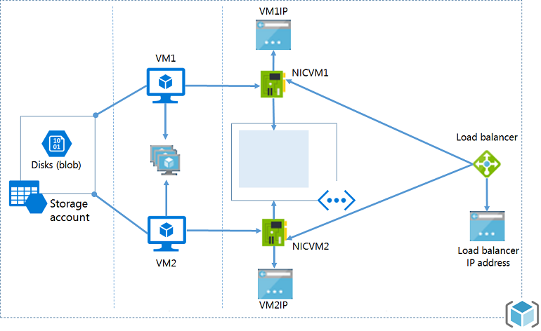

<properties
   pageTitle="Ressourcenmanager Vorlage Exemplarische Vorgehensweise | Microsoft Azure"
   description="Eine schrittweise exemplarische Vorgehensweise einer Ressource-Manager Vorlage eine grundlegende Azure IaaS Architektur bereitgestellt."
   services="azure-resource-manager"
   documentationCenter="na"
   authors="navalev"
   manager="timlt"
   editor=""/>

<tags
   ms.service="azure-resource-manager"
   ms.devlang="na"
   ms.topic="get-started-article"
   ms.tgt_pltfrm="na"
   ms.workload="na"
   ms.date="08/04/2016"
   ms.author="navale;tomfitz"/>
   
# <a name="resource-manager-template-walkthrough"></a>Ressourcenmanager Vorlage Exemplarische Vorgehensweise

Eine der ersten Fragen, die beim Erstellen einer Vorlage ist "How to starten?". Eine kann aus einer leeren Vorlage, die grundlegende Struktur in [Vorlage Authoring Artikel](resource-group-authoring-templates.md#template-format)beschriebenen folgen starten und die Ressourcen und die entsprechenden Parameter und Variablen hinzufügen. Eine gute Alternative wäre starten, indem Sie im [Schnellstart Katalog](https://github.com/Azure/azure-quickstart-templates) durchgehen, und suchen Sie nach ähnlichen Szenarien, die das Element, das Sie erstellen möchten. Sie können mehrere Vorlagen zusammenführen oder bearbeiten eine vorhandenen entsprechend Ihrer eigenen bestimmte Szenario. 

Werfen Sie einen Blick auf eine gemeinsame Infrastruktur an:

* Zwei virtuellen Computern, die dasselbe Speicherkonto verwenden, sind in demselben Satz Verfügbarkeit und im selben Subnetz eines virtuellen Netzwerks.
* Eine einzelne NIC und VM IP Adresse für jeden virtuellen Computer.
* Ein Lastenausgleich mit einer Regel für Port 80 für den Lastenausgleich



Dieses Thema führt Sie durch die Schritte zum Erstellen einer Vorlage Ressourcenmanager für diese Infrastruktur. Die endgültige Vorlage, die Sie erstellen, basiert auf einer Schnellstart Vorlage mit der Bezeichnung [2 virtuellen Computern in einer Lastenausgleich und Regeln für den Lastenausgleich](https://azure.microsoft.com/documentation/templates/201-2-vms-loadbalancer-lbrules/).

Aber, die viel ist zu auf einmal erstellen, also zuerst ein Speicherkonto erstellen und bereitstellen. Nachdem Sie die Erstellung des Speicherkontos vertraut sind, fügen Sie die anderen Ressourcen und erneut bereitstellen, die Vorlage, um die Infrastruktur abzuschließen.

>[AZURE.NOTE] Sie können jede Art von Editor verwenden, bei der Erstellung der Vorlage. Visual Studio stellt Tools, die Vorlage Entwicklung vereinfachen, aber nicht zum Bearbeiten dieses Lernprogramms Visual Studio benötigen. Ein Lernprogramm zur Verwendung von Visual Studio zum Erstellen einer-Bereitstellung Web App und SQL-Datenbank finden Sie unter [Erstellen und Bereitstellen von Azure-Ressourcengruppen über Visual Studio](vs-azure-tools-resource-groups-deployment-projects-create-deploy.md). 

## <a name="create-the-resource-manager-template"></a>Erstellen der Vorlage Ressourcenmanager

Die Vorlage ist eine JSON-Datei, die alle Ressourcen definiert werden, die Sie bereitstellen möchten. Sie können Sie Parameter, die während der Bereitstellung angegeben werden Variablen definieren, die von anderen Werten und Ausdrücke und Ausgaben aus der Bereitstellung erstellt. 

Beginnen wir mit der einfachste Vorlage:

```json
    {
      "$schema": "http://schema.management.azure.com/schemas/2015-01-01/deploymentTemplate.json#",
      "contentVersion": "1.0.0.0",
      "parameters": {  },
      "variables": {  },
      "resources": [  ],
      "outputs": {  }
    }
 ```

Speichern Sie diese Datei als **azuredeploy.json** (Beachten Sie, dass die Vorlage kann einen beliebigen Namen, die gewünschte haben, einfach die It muss eine Json-Datei).

## <a name="create-a-storage-account"></a>Erstellen Sie ein Speicherkonto
Fügen Sie innerhalb des Abschnitts **Ressourcen** ein Objekt, das Speicherkonto definiert, wie unten gezeigt. 

```json
"resources": [
  {
    "type": "Microsoft.Storage/storageAccounts",
    "name": "[parameters('storageAccountName')]",
    "apiVersion": "2015-06-15",
    "location": "[resourceGroup().location]",
    "properties": {
      "accountType": "Standard_LRS"
    }
  }
]
```

Sie vielleicht, woher diese Eigenschaften und Werte stammen. Die Eigenschaften **Typ**, **Name**, **ApiVersion**und **Speicherort** sind standard-Elemente, die für alle Ressourcentypen verfügbar sind. Weitere Informationen zu den gebräuchlichsten Schritten bei [Ressourcen](resource-group-authoring-templates.md#resources). **Namen** ist auf einen Parameterwert festgelegt, die Sie als Speicherort nach der Ressourcengruppe verwendet in während der Bereitstellung und **Speicherort** übergeben. Wir werden wie Sie **Typ** und **ApiVersion** in den folgenden Abschnitten zu bestimmen.

Im Abschnitt **Eigenschaften** enthält alle Eigenschaften, die für einen bestimmten Ressourcentyp eindeutig sind. Die Werte, die Sie in diesem Abschnitt geben Sie genau entsprechen den Vorgang sich in die REST-API für diesen Ressourcentyp erstellen. Wenn Sie ein Speicherkonto zu erstellen, müssen Sie eine **AccountType**bereitstellen. Beachten Sie, dass im Eigenschaftenabschnitt des Vorgangs REST enthält auch eine **AccountType** -Eigenschaft, die zulässigen Werte sind dokumentierten in die [REST-API zum Erstellen eines Kontos Speicher](https://msdn.microsoft.com/library/azure/mt163564.aspx) . In diesem Beispiel Kontotyp auf **Standard_LRS**festgelegt ist, jedoch konnte oder einen anderen Wert angeben, dass Benutzer Kontotyp als Parameter zu übergeben.

Nun lassen Sie uns zurück zum Abschnitt **Parameter** springen und sehen, wie Sie den Namen des Speicherkontos definieren. Sie können erfahren Sie mehr über die Verwendung von Parametern am [Parameter](resource-group-authoring-templates.md#parameters). 

```json
"parameters" : {
    "storageAccountName": {
      "type": "string",
      "metadata": {
        "description": "Storage Account Name"
      }
    }
}
```
Hier haben Sie einen Parameter vom Typzeichenfolge, die den Namen des Speicherkontos eingeben festgelegt. Der Wert für diesen Parameter werden während der Bereitstellung der Vorlage bereitgestellt werden.

## <a name="deploying-the-template"></a>Bereitstellen der Vorlage
Wir haben eine vollständige Vorlage zum Erstellen eines neuen Kontos mit Speicher. Wie Sie wissen, wurde die Vorlage im **azuredeploy.json** Datei gespeichert:

```json
{
  "$schema": "https://schema.management.azure.com/schemas/2015-01-01/deploymentTemplate.json#",
  "contentVersion": "1.0.0.0",
  "parameters" : {
    "storageAccountName": {
      "type": "string",
      "metadata": {
        "description": "Storage Account Name"
      }
    }
  },  
  "resources": [
    {
      "type": "Microsoft.Storage/storageAccounts",
      "name": "[parameters('storageAccountName')]",
      "apiVersion": "2015-06-15",
      "location": "[resourceGroup().location]",
      "properties": {
        "accountType": "Standard_LRS"
      }
    }
  ]
}
```

Es gibt ein paar Verfahren zum Bereitstellen einer Vorlage, wie Sie in der [Ressource Bereitstellung Artikel](resource-group-template-deploy.md)sehen können. Wenn Sie die Vorlage mithilfe der PowerShell Azure bereitzustellen, zu verwenden:

```powershell
# create a new resource group
New-AzureRmResourceGroup -Name ExampleResourceGroup -Location "West Europe"

# deploy the template to the resource group
New-AzureRmResourceGroupDeployment -Name ExampleDeployment -ResourceGroupName ExampleResourceGroup -TemplateFile azuredeploy.json
```

Oder, um die Vorlage mit Azure CLI bereitzustellen, zu verwenden:

```
azure group create -n ExampleResourceGroup -l "West Europe"

azure group deployment create -f azuredeploy.json -g ExampleResourceGroup -n ExampleDeployment
```

Sie können nun die Klinik eines Speicher-Kontos.

Die nächsten Schritte werden alle Ressourcen, die zum Starten des Lernprogramms beschriebene Architektur bereitstellen erforderlich hinzufügen. Fügen Sie diese Ressourcen in derselben Vorlage, die, denen Sie gearbeitet haben.

## <a name="availability-set"></a>Festlegen der Verfügbarkeit
Fügen Sie einen availably festgelegten für die virtuellen Computer nach der Definition der für das Speicherkonto hinzu. In diesem Fall keine Eigenschaften vorhanden sind zusätzlichen erforderlich, damit ihre Definition recht einfach ist. Für den Fall, dass Sie die Werte aktualisieren Domäne zählen und Fehlertoleranz Domäne zählen definieren möchten, finden Sie unter für den Abschnitt vollständige Eigenschaften die [REST-API zum Erstellen einer Verfügbarkeit festzulegen](https://msdn.microsoft.com/library/azure/mt163607.aspx) .

```json
{
   "type": "Microsoft.Compute/availabilitySets",
   "name": "[variables('availabilitySetName')]",
   "apiVersion": "2015-06-15",
   "location": "[resourceGroup().location]",
   "properties": {}
}
```

Beachten Sie, dass der **Name** auf den Wert einer Variablen festgelegt ist. Für diese Vorlage wird der Name der Verfügbarkeit festlegen in wenigen unterschiedliche Stellen benötigt. Durch diesen Wert einmal definieren und verwenden es an mehreren Stellen können Sie Ihre Vorlage einfacher verwalten.

Der Wert für **ein** angegebenen enthält sowohl den Ressourcenanbieter und der Ressourcenart. Der Ressourcenanbieter ist **Microsoft.Compute** Verfügbarkeit Sätze und der Ressourcentyp ist **AvailabilitySets**. Sie erhalten die Liste der verfügbaren Ressourcenanbieter, indem Sie den folgenden PowerShell-Befehl ausführen:

```powershell
    Get-AzureRmResourceProvider -ListAvailable
```

Oder, wenn Sie Azure CLI verwenden, können Sie den folgenden Befehl ausführen:
```
    azure provider list
```
Vorausgesetzt, dass in diesem Thema Sie mit Speicherkonten, virtuellen Computern und virtuelle Netzwerke erstellen, arbeiten Sie mit:

- Microsoft.Storage
- Microsoft.Compute
- Microsoft.Network

Um die Ressourcentypen für einen bestimmten Anbieter zu sehen, führen Sie den folgenden PowerShell-Befehl aus:

```powershell
    (Get-AzureRmResourceProvider -ProviderNamespace Microsoft.Compute).ResourceTypes
```

Oder für Azure CLI, mit dem folgende Befehl die verfügbaren Typen im JSON-Format zurückzukehren, und in eine Datei zu speichern.

```
    azure provider show Microsoft.Compute --json > c:\temp.json
```

**AvailabilitySets** sollte in einem der Typen in **Microsoft.Compute**angezeigt werden. Der vollständige Name des Typs ist **Microsoft.Compute/availabilitySets**. Sie können den Typ Ressourcennamen für alle Ressourcen in der Vorlage Sie bestimmen.

## <a name="public-ip"></a>Öffentliche IP-Adresse
Definieren Sie eine öffentliche IP-Adresse ein. Prüfen Sie erneut, die [REST-API für öffentliche IP-Adressen](https://msdn.microsoft.com/library/azure/mt163590.aspx) für die Eigenschaften festlegen.

```json
{
  "apiVersion": "2015-06-15",
  "type": "Microsoft.Network/publicIPAddresses",
  "name": "[parameters('publicIPAddressName')]",
  "location": "[resourceGroup().location]",
  "properties": {
    "publicIPAllocationMethod": "Dynamic",
    "dnsSettings": {
      "domainNameLabel": "[parameters('dnsNameforLBIP')]"
    }
  }
}
```

Die Methode der Verteilung auf **dynamische** festgelegt ist, aber legen fest, dass sie den Wert, den Sie benötigen, oder legen sie einen Parameterwert annehmen. Sie haben die Benutzer Ihrer Vorlage, um einen Wert für den Namen der Domäne übergeben aktiviert.

Nun sehen wir uns, wie Sie die **ApiVersion**fest. Der Wert, den Sie angeben, entspricht einfach die Version von die REST-API, die Sie beim Erstellen der Ressource verwenden möchten. Ja, können Sie die REST-API-Dokumentation für diesen Ressourcentyp betrachten. Alternativ können Sie den folgenden PowerShell-Befehl für einen bestimmten Typ ausführen.

```powershell
    ((Get-AzureRmResourceProvider -ProviderNamespace Microsoft.Network).ResourceTypes | Where-Object ResourceTypeName -eq publicIPAddresses).ApiVersions
```
Gibt die folgenden Werte zurück:

    2015-06-15
    2015-05-01-preview
    2014-12-01-preview

Führen Sie zum Anzeigen der API Versionen mit Azure CLI derselben **Azure Anbieter anzeigen** Befehl zuvor angezeigt aus

Wenn Sie eine neue Vorlage erstellen, wählen Sie die neueste Version von API aus.

## <a name="virtual-network-and-subnet"></a>Virtuelles Netzwerk und Subnetz
Erstellen Sie ein virtuelles Netzwerk mit einem Subnetz. Sehen Sie sich die [REST-API für virtuelle Netzwerke](https://msdn.microsoft.com/library/azure/mt163661.aspx) für alle Eigenschaften festlegen.

```json
{
   "apiVersion": "2015-06-15",
   "type": "Microsoft.Network/virtualNetworks",
   "name": "[parameters('vnetName')]",
   "location": "[resourceGroup().location]",
   "properties": {
     "addressSpace": {
       "addressPrefixes": [
         "10.0.0.0/16"
       ]
     },
     "subnets": [
       {
         "name": "[variables('subnetName')]",
         "properties": {
           "addressPrefix": "10.0.0.0/24"
         }
       }
     ]
   }
}
```

## <a name="load-balancer"></a>Lastenausgleich
Erstellen Sie nun eine externe zugänglichen Lastenausgleich. Da diese Lastenausgleich die öffentliche IP-Adresse verwendet, müssen Sie eine Abhängigkeit auf der öffentlichen IP-Adresse im Abschnitt **DependsOn** deklarieren. Dies bedeutet, dass Lastenausgleich nicht bereitgestellt wird, bis zum Abschluss der öffentlichen IP-Adresse bereitstellen. Ohne definieren diese Abhängigkeit, erhalten Sie einen Fehler zurück, da Ressourcenmanager versucht, die Ressourcen parallel bereitstellen und versucht, den Lastenausgleich öffentlichen IP-Adresse festlegen, die noch nicht vorhanden ist. 

Sie können auch einem Back-End-Adresse Ressourcenpool, ein paar eingehenden NAT-Regeln RDP in den virtuellen Computern und einer laden Lastenausgleich Regel mit einer Tcp Prüfpunkt auf Port 80 in dieser Ressourcendefinition erstellen. Kaufabwicklung die [REST-API für Lastenausgleich](https://msdn.microsoft.com/library/azure/mt163574.aspx) für alle Eigenschaften.

```json
{
   "apiVersion": "2015-06-15",
   "name": "[parameters('lbName')]",
   "type": "Microsoft.Network/loadBalancers",
   "location": "[resourceGroup().location]",
   "dependsOn": [
     "[concat('Microsoft.Network/publicIPAddresses/', parameters('publicIPAddressName'))]"
   ],
   "properties": {
     "frontendIPConfigurations": [
       {
         "name": "LoadBalancerFrontEnd",
         "properties": {
           "publicIPAddress": {
             "id": "[variables('publicIPAddressID')]"
           }
         }
       }
     ],
     "backendAddressPools": [
       {
         "name": "BackendPool1"
       }
     ],
     "inboundNatRules": [
       {
         "name": "RDP-VM0",
         "properties": {
           "frontendIPConfiguration": {
             "id": "[variables('frontEndIPConfigID')]"
           },
           "protocol": "tcp",
           "frontendPort": 50001,
           "backendPort": 3389,
           "enableFloatingIP": false
         }
       },
       {
         "name": "RDP-VM1",
         "properties": {
           "frontendIPConfiguration": {
             "id": "[variables('frontEndIPConfigID')]"
           },
           "protocol": "tcp",
           "frontendPort": 50002,
           "backendPort": 3389,
           "enableFloatingIP": false
         }
       }
     ],
     "loadBalancingRules": [
       {
         "name": "LBRule",
         "properties": {
           "frontendIPConfiguration": {
             "id": "[variables('frontEndIPConfigID')]"
           },
           "backendAddressPool": {
             "id": "[variables('lbPoolID')]"
           },
           "protocol": "tcp",
           "frontendPort": 80,
           "backendPort": 80,
           "enableFloatingIP": false,
           "idleTimeoutInMinutes": 5,
           "probe": {
             "id": "[variables('lbProbeID')]"
           }
         }
       }
     ],
     "probes": [
       {
         "name": "tcpProbe",
         "properties": {
           "protocol": "tcp",
           "port": 80,
           "intervalInSeconds": 5,
           "numberOfProbes": 2
         }
       }
     ]
   }
}
```

## <a name="network-interface"></a>Netzwerk-Benutzeroberfläche
Erstellen Sie 2 Netzwerkschnittstellen, eine für jede virtueller Computer. Anstatt doppelte Einträge für die Netzwerk-Schnittstellen aufnehmen möchten, können Sie die [copyIndex() (Funktion)](resource-group-create-multiple.md) durchlaufen Sie die in der Kopie Schleife (als NicLoop bezeichnet), und erstellen Sie die Zahlen Netzwerkschnittstellen im Sinne der `numberOfInstances` Variablen. Die Schnittstelle hängt von der Erstellung des virtuellen Netzwerks und Lastenausgleich ab. Das in die Erstellung virtueller Netzwerk und die Id, die beim Laden Lastenausgleich definierte Subnetz verwendet, um dem Pool laden Lastenausgleich Adressen und die eingehenden Regeln NAT konfigurieren.
Prüfen Sie die [REST-API für Netzwerk-Schnittstellen](https://msdn.microsoft.com/library/azure/mt163668.aspx) für alle Eigenschaften aus.

```json
{
   "apiVersion": "2015-06-15",
   "type": "Microsoft.Network/networkInterfaces",
   "name": "[concat(parameters('nicNamePrefix'), copyindex())]",
   "location": "[resourceGroup().location]",
   "copy": {
     "name": "nicLoop",
     "count": "[variables('numberOfInstances')]"
   },
   "dependsOn": [
     "[concat('Microsoft.Network/virtualNetworks/', parameters('vnetName'))]",
     "[concat('Microsoft.Network/loadBalancers/', parameters('lbName'))]"
   ],
   "properties": {
     "ipConfigurations": [
       {
         "name": "ipconfig1",
         "properties": {
           "privateIPAllocationMethod": "Dynamic",
           "subnet": {
             "id": "[variables('subnetRef')]"
           },
           "loadBalancerBackendAddressPools": [
             {
               "id": "[concat(variables('lbID'), '/backendAddressPools/BackendPool1')]"
             }
           ],
           "loadBalancerInboundNatRules": [
             {
               "id": "[concat(variables('lbID'),'/inboundNatRules/RDP-VM', copyindex())]"
             }
           ]
         }
       }
     ]
   }
}
```

## <a name="virtual-machine"></a>Virtuellen Computern
Erstellen Sie 2 virtuellen Computern copyIndex()-Funktion verwenden, wie in der Erstellung der [Netzwerk-Schnittstellen](#network-interface).
Die Erstellung virtueller Computer abhängig von dem Speicherkonto Netzwerk-Benutzeroberfläche und Verfügbarkeit festlegen. Diesem virtuellen Computer erstellt werden aus einem Bild Marketplace im Sinne der `storageProfile` Eigenschaft - `imageReference` wird verwendet, um das Bild Publisher, Angebot, Sku und Version definieren. Schließlich ist einer Diagnoseprotokollen Profil so konfiguriert, dass die Diagnose für den virtuellen Computer aktivieren. 

Führen Sie zum Aufrufen die relevanten Eigenschaften für ein Bild Marketplace finden Sie Artikel [Wählen Sie Linux virtuellen Computern Bilder](./virtual-machines/virtual-machines-linux-cli-ps-findimage.md) oder [Windows-virtuellen Computern Bilder](./virtual-machines/virtual-machines-windows-cli-ps-findimage.md) aus.

```json
{
   "apiVersion": "2015-06-15",
   "type": "Microsoft.Compute/virtualMachines",
   "name": "[concat(parameters('vmNamePrefix'), copyindex())]",
   "copy": {
     "name": "virtualMachineLoop",
     "count": "[variables('numberOfInstances')]"
   },
   "location": "[resourceGroup().location]",
   "dependsOn": [
     "[concat('Microsoft.Storage/storageAccounts/', parameters('storageAccountName'))]",
     "[concat('Microsoft.Network/networkInterfaces/', parameters('nicNamePrefix'), copyindex())]",
     "[concat('Microsoft.Compute/availabilitySets/', variables('availabilitySetName'))]"
   ],
   "properties": {
     "availabilitySet": {
       "id": "[resourceId('Microsoft.Compute/availabilitySets',variables('availabilitySetName'))]"
     },
     "hardwareProfile": {
       "vmSize": "[parameters('vmSize')]"
     },
     "osProfile": {
       "computerName": "[concat(parameters('vmNamePrefix'), copyIndex())]",
       "adminUsername": "[parameters('adminUsername')]",
       "adminPassword": "[parameters('adminPassword')]"
     },
     "storageProfile": {
       "imageReference": {
         "publisher": "[parameters('imagePublisher')]",
         "offer": "[parameters('imageOffer')]",
         "sku": "[parameters('imageSKU')]",
         "version": "latest"
       },
       "osDisk": {
         "name": "osdisk",
         "vhd": {
           "uri": "[concat('http://',parameters('storageAccountName'),'.blob.core.windows.net/vhds/','osdisk', copyindex(), '.vhd')]"
         },
         "caching": "ReadWrite",
         "createOption": "FromImage"
       }
     },
     "networkProfile": {
       "networkInterfaces": [
         {
           "id": "[resourceId('Microsoft.Network/networkInterfaces',concat(parameters('nicNamePrefix'),copyindex()))]"
         }
       ]
     },
     "diagnosticsProfile": {
       "bootDiagnostics": {
          "enabled": "true",
          "storageUri": "[concat('http://',parameters('storageAccountName'),'.blob.core.windows.net')]"
       }
     }
}
```

>[AZURE.NOTE] Für Bilder **3rd**Lieferanten veröffentlicht werden, müssen Sie an eine andere Eigenschaft namens `plan`. Ein Beispiel finden Sie in [dieser Vorlage](https://github.com/Azure/azure-quickstart-templates/tree/master/checkpoint-single-nic) aus dem Katalog Schnellstart. 

Sie haben die Ressourcen für die Vorlage definieren.

## <a name="parameters"></a>Parameter

Definieren Sie im Abschnitt Parameter die Werte, die angegeben werden können, wenn Sie die Vorlage bereitstellen. Legen Sie nur Parameter für Werte, die Sie der Meinung sind während der Bereitstellung variiert werden soll. Sie können einen Standardwert für einen Parameter bereitstellen, die verwendet wird, wenn eine nicht während der Bereitstellung bereitgestellt wird. Sie können auch die zulässigen Werte definieren, wie für den Parameter **ImageSKU** dargestellt.

```json
"parameters": {
    "storageAccountName": {
      "type": "string",
      "metadata": {
        "description": "Name of storage account"
      }
    },
    "adminUsername": {
      "type": "string",
      "metadata": {
        "description": "Admin username"
      }
    },
    "adminPassword": {
      "type": "securestring",
      "metadata": {
        "description": "Admin password"
      }
    },
    "dnsNameforLBIP": {
      "type": "string",
      "metadata": {
        "description": "DNS for Load Balancer IP"
      }
    },
    "vmNamePrefix": {
      "type": "string",
      "defaultValue": "myVM",
      "metadata": {
        "description": "Prefix to use for VM names"
      }
    },
    "imagePublisher": {
      "type": "string",
      "defaultValue": "MicrosoftWindowsServer",
      "metadata": {
        "description": "Image Publisher"
      }
    },
    "imageOffer": {
      "type": "string",
      "defaultValue": "WindowsServer",
      "metadata": {
        "description": "Image Offer"
      }
    },
    "imageSKU": {
      "type": "string",
      "defaultValue": "2012-R2-Datacenter",
      "allowedValues": [
        "2008-R2-SP1",
        "2012-Datacenter",
        "2012-R2-Datacenter"
      ],
      "metadata": {
        "description": "Image SKU"
      }
    },
    "lbName": {
      "type": "string",
      "defaultValue": "myLB",
      "metadata": {
        "description": "Load Balancer name"
      }
    },
    "nicNamePrefix": {
      "type": "string",
      "defaultValue": "nic",
      "metadata": {
        "description": "Network Interface name prefix"
      }
    },
    "publicIPAddressName": {
      "type": "string",
      "defaultValue": "myPublicIP",
      "metadata": {
        "description": "Public IP Name"
      }
    },
    "vnetName": {
      "type": "string",
      "defaultValue": "myVNET",
      "metadata": {
        "description": "VNET name"
      }
    },
    "vmSize": {
      "type": "string",
      "defaultValue": "Standard_D1",
      "metadata": {
        "description": "Size of the VM"
      }
    }
  }
```

## <a name="variables"></a>Variablen

Sie können im Abschnitt Variablen definieren Werte, die in mehr als einer zentralen Stelle in der Vorlage verwendet werden, oder Werte, die von anderen Ausdrücken oder Variablen erstellt werden. Variablen werden häufig zur Vereinfachung der Syntax einer Vorlage.

```json
"variables": {
    "availabilitySetName": "myAvSet",
    "subnetName": "Subnet-1",
    "vnetID": "[resourceId('Microsoft.Network/virtualNetworks',parameters('vnetName'))]",
    "subnetRef": "[concat(variables('vnetID'),'/subnets/',variables ('subnetName'))]",
    "publicIPAddressID": "[resourceId('Microsoft.Network/publicIPAddresses',parameters('publicIPAddressName'))]",
    "numberOfInstances": 2,
    "lbID": "[resourceId('Microsoft.Network/loadBalancers',parameters('lbName'))]",
    "frontEndIPConfigID": "[concat(variables('lbID'),'/frontendIPConfigurations/LoadBalancerFrontEnd')]",
    "lbPoolID": "[concat(variables('lbID'),'/backendAddressPools/BackendPool1')]",
    "lbProbeID": "[concat(variables('lbID'),'/probes/tcpProbe')]"
  }
```

Sie haben die Vorlage abgeschlossen! Sie können Ihre Vorlage anhand der vollständigen Vorlage im [Katalog Schnellstart](https://github.com/Azure/azure-quickstart-templates) unter [2 virtueller Computer mit Lastenausgleich, und Laden Sie Lastenausgleich Regelvorlage](https://github.com/Azure/azure-quickstart-templates/tree/master/201-2-vms-loadbalancer-lbrules)vergleichen. Ihre Vorlage weicht möglicherweise basierend auf verschiedene Versionsnummern verwenden. 

Sie können die Vorlage erneut bereitstellen, mithilfe der gleichen Befehle, die Sie beim Bereitstellen von Speicher-Konto verwendet. Sie müssen nicht löschen des Speicherkontos vor der Bereitstellung erneut, da Ressourcenmanager erneut erstellen Ressourcen überspringen wird, die bereits vorhanden ist und nicht geändert wurden.

## <a name="next-steps"></a>Nächste Schritte

- [Azure Ressourcenmanager Vorlage Schnellansicht (ARMViz)](http://armviz.io/#/) ist ein großartiges Tool zum Visualisieren Cloud-Vorlagen, sobald sie zu verstehen nur aus Lesen der Json-Datei zu groß sind möglicherweise.
- Weitere Informationen über die Struktur der Vorlage finden Sie unter [Azure Ressourcenmanager Authoring-Vorlagen](resource-group-authoring-templates.md).
- Weitere Informationen zum Bereitstellen einer Vorlage, finden Sie unter [Bereitstellen einer Ressourcengruppe Ressourcenmanager Azure-Vorlage](resource-group-template-deploy.md)
