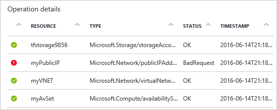

<properties
   pageTitle="Anzeigen der Bereitstellung von Vorgängen mit Portal | Microsoft Azure"
   description="Beschreibt, wie das Azure-Portal zum Ermitteln von Fehlern aus Ressourcenmanager Bereitstellung verwenden."
   services="azure-resource-manager,virtual-machines"
   documentationCenter=""
   tags="top-support-issue"
   authors="tfitzmac"
   manager="timlt"
   editor="tysonn"/>

<tags
   ms.service="azure-resource-manager"
   ms.devlang="na"
   ms.topic="article"
   ms.tgt_pltfrm="vm-multiple"
   ms.workload="infrastructure"
   ms.date="06/15/2016"
   ms.author="tomfitz"/>

# Ansicht Bereitstellungsvorgänge mit Azure-Portal

> [AZURE.SELECTOR]
- [Portal](resource-manager-troubleshoot-deployments-portal.md)
- [PowerShell](resource-manager-troubleshoot-deployments-powershell.md)
- [Azure CLI](resource-manager-troubleshoot-deployments-cli.md)
- [REST-API](resource-manager-troubleshoot-deployments-rest.md)

Sie können die Vorgänge für eine Bereitstellung über das Azure Portal anzeigen. Sie können möglicherweise am interessantesten anzeigen die Vorgänge aus, wenn Sie einen Fehler während der Bereitstellung erhalten haben, damit dieser Artikel befasst sich Vorgänge, die nicht anzeigen. Das Portal stellt eine Benutzeroberfläche, mit dem Sie auf einfache Weise finden die Fehler und mögliche Updates ermitteln.

[AZURE.INCLUDE [resource-manager-troubleshoot-introduction](../includes/resource-manager-troubleshoot-introduction.md)]

## Verwenden Sie zum Behandeln von Problemen mit Bereitstellungsvorgänge

Wenn die Bereitstellungsvorgänge anzeigen möchten, gehen Sie folgendermaßen vor:

1. Beachten Sie den Status der letzten Bereitstellung für die bei der Bereitstellung Ressourcengruppe. Wählen Sie diesen Status, um weitere Details zu erhalten.

    

2. Den zuletzt verwendete Bereitstellung Verlauf wird angezeigt. Wählen Sie die Bereitstellung, die nicht aus.

    

3. Wählen Sie **fehlgeschlagen ist. Klicken Sie hier, um Details** sehen Sie eine Beschreibung der warum Fehler bei der Bereitstellung. In der folgenden Abbildung ist der DNS-Eintrag nicht eindeutig.  

    

    Diese Fehlermeldung sollten genug für Sie mit der Problembehandlung beginnen. Wenn Sie weitere Details zu benötigen, welche Aufgaben wurden abgeschlossen, können Sie die Vorgänge anzeigen, wie in den folgenden Schritten dargestellt.

4. Sie können alle Bereitstellungsvorgänge in der **Bereitstellung** Blade anzeigen. Wählen Sie alle Vorgänge an mehr Details anzuzeigen.

    

    In diesem Fall wird, dass der Speicher-Konto, virtuelle Netzwerk- und Festlegen der Verfügbarkeit erfolgreich erstellt wurden. Konnte die öffentliche IP-Adresse und anderen Ressourcen wurden nicht übermitteln.

5. Sie können Ereignisse für die Bereitstellung anzeigen, indem Sie **Ereignisse**auswählen.

    

6. Sie finden Sie unter alle Ereignisse für die Bereitstellung, und wählen Sie eine weitere Details.

    

## Verwenden der Überwachungsprotokolle zur Problembehandlung

[AZURE.INCLUDE [resource-manager-audit-limitations](../includes/resource-manager-audit-limitations.md)]

Wenn Fehler für eine Bereitstellung anzeigen möchten, gehen Sie folgendermaßen vor:

1. Anzeigen der Überwachungsprotokolle für eine Ressourcengruppe, indem Sie **Überwachenden Protokolle**auswählen.

    

2. In der **Überwachungsprotokolle** Blade sehen Sie eine Zusammenfassung der zuletzt verwendete Vorgänge für alle Ressourcengruppen in Ihr Abonnement. Enthält die Zeit grafisch und Status der Vorgänge und eine Liste der Vorgänge.

    

3. Sie können Ihre Ansicht der Überwachungsprotokolle auf bestimmte Bedingungen konzentrieren filtern. Wählen Sie **Filter** am oberen Rand der **Überwachungsprotokolle** Blade.

    

4. Wählen Sie aus dem Blade **Filter** Bedingungen, um Ihre Ansicht der Überwachungsprotokolle auf nur die Vorgänge einzuschränken, die angezeigt werden sollen. Beispielsweise können Sie Vorgänge aus, um nur Fehlern nach der Ressourcengruppe anzeigen, filtern.

    

5. Sie können die Vorgänge Filtern durch Festlegen eines Zeitraums. Die folgende Abbildung filtert die Ansicht zu einer bestimmten Zeitspanne 20 Minuten.

    

6. Sie können die Vorgänge in der Liste auswählen. Wählen Sie den Vorgang, der den Fehler enthält, die, den Sie recherchieren möchten.

    
  
7. Alle Ereignisse für diesen Vorgang werden angezeigt. Beachten Sie die **Korrelations-IDS** in der Zusammenfassung. Diese ID wird verwendet, um verwandte Ereignisse zu verfolgen. Es kann hilfreich sein, bei der Arbeit mit den technischen Support, um ein Problem zu beheben. Sie können keine des Ereignisses, um die Details zu dem Ereignis finden Sie unter auswählen.

    

8. Details zum Ereignis wird angezeigt. Insbesondere, achten Sie auf die **Eigenschaften** für Informationen zu dem Fehler.

    

Der Filter, die, den Sie in das Überwachungsprotokoll angewendet haben, wird das nächste Mal beibehalten, anzeigen, sodass Sie möglicherweise so ändern Sie diese Werte, um die Ansicht der Vorgänge zu erweitern müssen.

## Nächste Schritte

- Hilfe bei der Behebung von bestimmter Bereitstellungsfehler finden Sie unter [Beheben häufig auftretender Fehler beim Bereitstellen von Ressourcen in Azure Azure Ressourcenmanager](resource-manager-common-deployment-errors.md).
- Weitere Informationen zum Verwenden der Überwachungsprotokolle um zu anderen Typen von Aktionen zu überwachen, finden Sie unter [Überwachen von Vorgängen mit Ressourcen-Manager](resource-group-audit.md).
- Um Ihre Bereitstellung vor der Ausführung überprüfen zu können, finden Sie unter [Bereitstellen einer Ressourcengruppe Ressourcenmanager Azure-Vorlage](resource-group-template-deploy.md).
