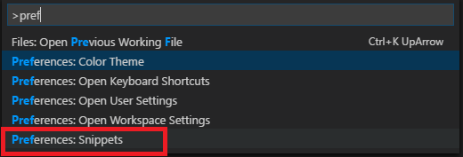
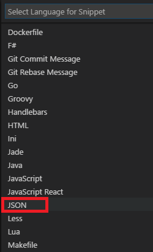
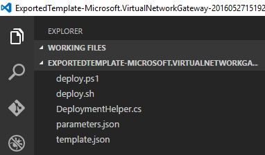
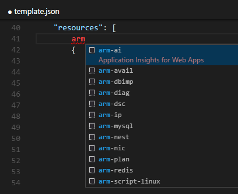
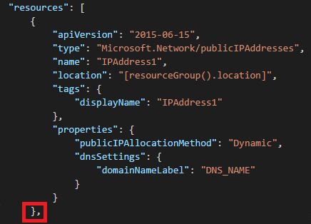
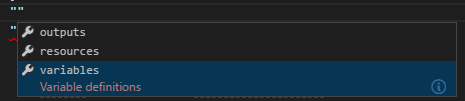
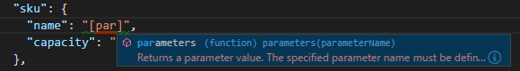
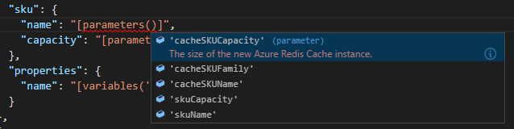
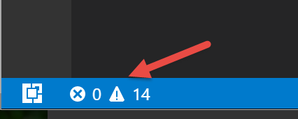
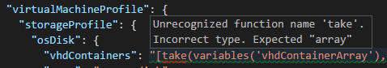

<properties
   pageTitle="Verwenden Sie im Vergleich mit einer Feldfunktion mit Ressourcenmanager Vorlagen | Microsoft Azure"
   description="Zeigt, wie Visual Studio-Code zum Erstellen von Azure Ressourcenmanager Vorlagen einrichten."
   services="azure-resource-manager"
   documentationCenter="na"
   authors="cmatskas"
   manager="timlt"
   editor="tysonn"/>

<tags
   ms.service="azure-resource-manager"
   ms.devlang="na"
   ms.topic="get-started-article"
   ms.tgt_pltfrm="na"
   ms.workload="na"
   ms.date="09/26/2016"
   ms.author="chmatsk;tomfitz"/>

# Arbeiten mit Azure Ressourcenmanager Vorlagen in Visual Studio-Code

Azure Ressourcenmanager Vorlagen sind JSON-Dateien, in denen eine Ressource und der zugehörigen Abhängigkeiten beschrieben. Diese Dateien können manchmal groß sein und kompliziert, damit Support Tools wichtig ist. Visual Studio-Code wird eine neue, einfache, Open Source, Plattform-Code-Editor. Erstellen und Bearbeiten von Vorlagen für Ressourcenmanager über eine [neue Erweiterung](https://marketplace.visualstudio.com/items?itemName=msazurermtools.azurerm-vscode-tools)unterstützt. Im Vergleich mit einer Code führt Suchvorgängen und Internetzugang setzt voraus, es sei denn, Sie auch Ihre Vorlagen Ressourcenmanager bereitstellen möchten.

Wenn Sie noch nicht im Vergleich mit einer Code verfügen, können Sie es bei [https://code.visualstudio.com/](https://code.visualstudio.com/)installieren.

## Installieren Sie die Erweiterung Ressourcenmanager

Wenn mit den JSON-Vorlagen im Vergleich mit einer Code arbeiten möchten, müssen Sie eine Erweiterung installieren. Die folgenden Schritte herunterladen und installieren die Unterstützung von Sprachen Ressourcenmanager JSON-Vorlagen:

1. Im Vergleich mit einer Code starten 
2. Öffnen Sie die Symbolleiste öffnen (STRG + P) 
3. Führen Sie den folgenden Befehl ein: 

        ext install azurerm-vscode-tools

4. Starten Sie neu im Vergleich mit einer ein, wenn Sie dazu aufgefordert werden, die Erweiterung zu aktivieren. 

 Aufgabe erledigt!

## Einrichten von Ressourcenmanager Codeausschnitte

Die vorherigen Schritte installiert, an die Unterstützung für, aber jetzt müssen wir im Vergleich mit einer-Code zur Verwendung von JSON Vorlage Codeausschnitte konfigurieren.

1. Kopieren Sie den Inhalt der Datei aus dem Repository [Azure-Xplat-Cloud-Tools](https://raw.githubusercontent.com/Azure/azure-xplat-arm-tooling/master/VSCode/armsnippets.json) in der Zwischenablage ein.
2. Im Vergleich mit einer Code starten 
3. Im Vergleich mit einer Code, können Sie die JSON Codeausschnitte-Datei öffnen, indem Sie navigieren zu einer **Datei** -> **Voreinstellungen** -> **Benutzer Codeausschnitte** -> **JSON**, oder durch Auswahl **F1** , und geben **"Einstellungen"** aus, bis Sie auswählen können **Voreinstellungen: Codeausschnitte**.

    

    Wählen Sie die Optionen **JSON**aus.

    

4. Einfügen des Inhalts der Datei auf Schritt 1 in Ihre Benutzer Codeausschnitte Datei vor dem letzten "}" 
5. Vergewissern Sie sich die JSON sieht OK aus, und es werden keine Wellenlinien an einer beliebigen Stelle. 
6. Speichern Sie und schließen Sie die Benutzer Codeausschnitte Datei.

Das ist alles, die erforderlich ist, zu der Ressourcenmanager Codeausschnitte zu arbeiten beginnen. Als Nächstes werden wir dieses Setup an den Test setzen.

## Arbeiten Sie mit Code im Vergleich mit einer Vorlage

Die einfachste Möglichkeit zum Arbeiten mit einer Vorlage ist entweder eine schnelle Starten verfügbaren Vorlagen auf [Github](https://github.com/Azure/azure-quickstart-templates) umgibt, oder verwenden Sie eine eigene. Sie können ganz einfach [Exportieren eine Vorlage](resource-manager-export-template.md) für Ihre Ressourcengruppen über das Portal. 

1. Wenn Sie eine Vorlage aus einer Ressourcengruppe exportiert haben, öffnen Sie die extrahierten Dateien im Vergleich mit einer Code.

    

2. Öffnen Sie die Datei template.json, damit Sie sie bearbeiten und einige zusätzlichen Ressourcen hinzufügen können. Nach der **"Ressourcen": [** EINGABETASTE drücken, um eine neue Zeile beginnen. Wenn Sie **Cloud**eingeben, wird eine Liste der Optionen angezeigt. Diese Optionen sind die Vorlage Codeausschnitte, die Sie installiert haben. Es sollte wie folgt aussehen: 

    

3. Wählen Sie den gewünschten Ausschnitt. In diesem Artikel bin ich **Cloud Ip -** zum Erstellen einer neuen öffentlichen IP-Adresse auswählen. Setzen nach der schließenden Klammer ein Semikolon "}" der neu erstellten Ressource, um sicherzustellen, dass Ihre Vorlage, Syntax ist gültig.

     

4. Im Vergleich mit einer Code weist integrierte IntelliSense. Wie Sie Ihre Vorlagen bearbeiten, wird im Vergleich mit einer Code verfügbaren Werte vorgeschlagen. Fügen Sie beispielsweise zum Hinzufügen eines Abschnitts Variablen Ihrer Vorlage **""** (zwei Anführungszeichen), und wählen Sie **STRG + LEERTASTE** zwischen diesen angeboten. Es wird mit einschließlich **Variablen**Optionen angezeigt.

    

5. IntelliSense kann auch verfügbaren Werte oder Funktionen vorschlagen. Wenn eine Eigenschaft, einen Parameterwert festlegen möchten, erstellen Sie einen Ausdruck mit **"[]"** und **STRG + LEERTASTE**. Sie können beginnen, geben Sie den Namen einer Funktion. Wählen Sie die **Registerkarte** , wenn Sie die Funktion gefunden haben, werden soll.

    

6. Wählen Sie erneut **STRG + LEERTASTE** innerhalb der Funktion, um eine Liste der verfügbaren Parameter innerhalb der Vorlage anzuzeigen.

    

7. Wenn Sie Ihre Vorlage Schema Überprüfungsprobleme haben, sehen Sie die vertrauten Wellenlinien im Editor. Sie können die Liste der Fehler und Warnungen anzeigen, indem Sie **STRG + UMSCHALT + M** eingeben oder auswählen die Symbole in der unteren linken Statusleiste angezeigt.

    

    Überprüfung Ihrer Vorlage helfen Ihnen, Syntaxprobleme erkennen; jedoch möglicherweise auch Fehler angezeigt, die Sie ignorieren können. In einigen Fällen wird der Editor Ihrer Vorlage mit einem Schema vergleichen, die nicht auf dem neuesten Stand und daher meldet einen Fehler, obwohl Sie wissen, dass er korrekt ist. Nehmen Sie beispielsweise an eine Funktion wurde zuletzt zu Ressourcenmanager hinzugefügt, aber das Schema nicht aktualisiert wurde. Der Editor Berichte einen Fehler trotz der Fakultät, die die Funktion während der Bereitstellung ordnungsgemäß funktioniert.

    

## Neuen Ressourcen bereitstellen

Wenn Ihre Vorlage fertig ist, können Sie die neuen Ressourcen wie folgt bereitstellen: 

### Windows

1. Öffnen Sie ein Eingabeaufforderungsfenster PowerShell 
2. Klicken Sie auf Login Type: 

        Login-AzureRmAccount 

3. Wenn Sie mehrere Abonnements haben, erhalten Sie eine Liste der Abonnements mit:

        Get-AzureRmSubscription

    Und wählen Sie das Abonnement verwenden.
   
        Select-AzureRmSubscription -SubscriptionId <Subscription Id>

4. Aktualisieren Sie die Parameter in der Datei parameters.json
5. Führen Sie die Deploy.ps1, um Ihre Vorlage mit Azure bereitstellen

### OSX/Linux

1. Öffnen Sie ein terminal-Fenster 
2. Klicken Sie auf Login Type:

        azure login 

3. Wenn Sie mehrere Abonnements verfügen, wählen Sie das richtige Abonnement mit:

        azure account set <subscriptionNameOrId> 

4. Aktualisieren Sie die Parameter in der Datei parameters.json.
5. Um die Vorlage bereitzustellen, führen Sie Folgendes aus:

        azure group deployment create -f <PathToTemplate> 

## Nächste Schritte

- Weitere Informationen zu Vorlagen finden Sie unter [Azure Ressourcenmanager Authoring-Vorlagen](resource-group-authoring-templates.md).
- Weitere Informationen zu Vorlagenfunktionen finden Sie unter [Azure Ressourcenmanager Vorlagenfunktionen](resource-group-template-functions.md).
- Weitere Beispiele zum Arbeiten mit Visual Studio-Code finden Sie unter [Erstellen Cloud-apps mit Visual Studio-Code](https://github.com/Microsoft/HealthClinic.biz/wiki/Build-cloud-apps-with-Visual-Studio-Code) von [HealthClinic.biz](https://github.com/Microsoft/HealthClinic.biz) 2015 verbinden [Demo](https://blogs.msdn.microsoft.com/visualstudio/2015/12/08/connectdemos-2015-healthclinic-biz/). Weitere Schnellstart aus HealthClinic.biz anschauen finden Sie unter [Azure Developer Tools Schnellstart](https://github.com/Microsoft/HealthClinic.biz/wiki/Azure-Developer-Tools-Quickstarts).
