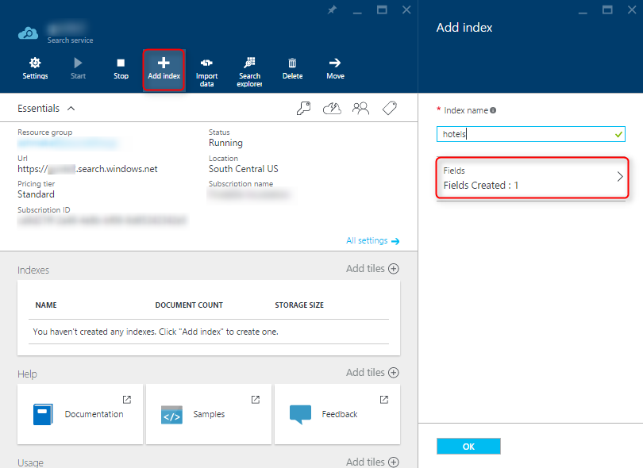
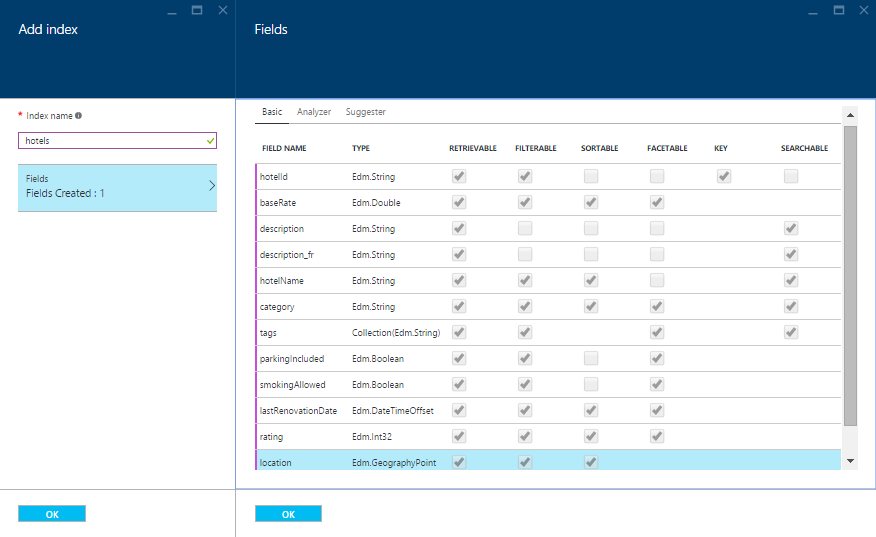
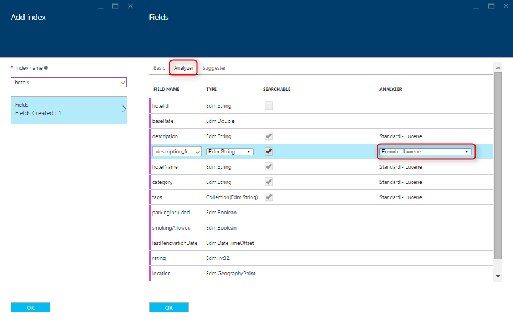

<properties
    pageTitle="Erstellen einer Azure Suchindex Verwenden des Portals Azure | Microsoft Azure | Cloud gehosteten Suchdienst"
    description="Erstellen eines Indexes mithilfe der Azure-Portal an."
    services="search"
    manager="jhubbard"
    authors="ashmaka"
    documentationCenter=""/>

<tags
    ms.service="search"
    ms.devlang="NA"
    ms.workload="search"
    ms.topic="article"
    ms.tgt_pltfrm="na"
    ms.date="08/29/2016"
    ms.author="ashmaka"/>

# Erstellen einer Azure Suchindex mithilfe der Azure-Portal
> [AZURE.SELECTOR]
- [(Übersicht)](search-what-is-an-index.md)
- [Portal](search-create-index-portal.md)
- [.NET](search-create-index-dotnet.md)
- [REST](search-create-index-rest-api.md)

In diesem Artikel werden Sie den Vorgang des Erstellens eines Azure [Index](search-what-is-an-index.md) Verwenden des Portals Azure durchzuführen.

Vor diesem Handbuch folgen und Erstellen eines Indexes, sollten Sie bereits [erstellt einen Azure Suchdienst](search-create-service-portal.md)verfügen.

## Ich. Wechseln Sie zu Ihrer Blade Azure-Suche
1. Klicken Sie auf "Alle Ressourcen" im Menü auf der linken Seite des [Azure-Portal](https://portal.azure.com/#blade/HubsExtension/BrowseResourceBlade/resourceType/Microsoft.Search%2FsearchServices)
2. Wählen Sie den Dienst Azure-Suche

## II. Fügen Sie hinzu, und nennen Sie Ihr index
1. Klicken Sie auf die Schaltfläche "Index hinzufügen"
2. Benennen Sie Ihre Azure Suchindex ein. Da einen Index zu suchenden Hotels in diesem Handbuch erstellt wird, haben wir unserem Index "Hotels" mit dem Namen.
  * Den Namen des Indexes muss mit einem Buchstaben beginnen und nur Kleinbuchstaben, Ziffern oder Striche enthalten ("-").
  * Ähnlich wie bei Ihrem Dienstnamen, den Namen des Indexes, die, den Sie auswählen, auch werden Teil der Endpunkt-URL, wo Ihre HTTP-Anfragen für die Suche-API Azure sendet Ihnen
3. Klicken Sie auf den Eintrag "Felder", um eine neue Blade zu öffnen

## III. Erstellen Sie und definieren Sie die Felder des Indexes
1. Indem Sie den Eintrag "Felder" auswählen, wird ein neuer Blade mit einem Formular zum Eingeben der Indexdefinition Ihrer geöffnet.
2. Ihre Nutzung des Formulars Index fügen Sie Felder hinzu.

  * Ein *Key* -Feld vom Typ Edm.String ist für jede Azure Suchindex obligatorisch. Dieses Feld wird standardmäßig das Feld "ID" erstellt. Wir haben sie in "HotelId" in unserem Index geändert.
  * Bestimmte Eigenschaften des Schemas Index können nur einmal festgelegt werden und nicht in der Zukunft aktualisiert werden. Aus diesem Grund sind alle Schema Aktualisierungen, die erneute Indizierung, wie etwa das Ändern von Feldtypen erfordern würden, nicht nach der erstmaligen Konfiguration aktuell möglich.
  * Wir haben sorgfältig die Eigenschaftswerte für jedes Feld basierend auf wie wir denken, dass sie in einer Anwendung verwendet werden. Beachten Sie Ihre Suche Benutzer Erfahrung und Business-Anforderungen, wenn Ihr Index zu entwerfen, wie jedes Feld die [entsprechenden Eigenschaften](https://msdn.microsoft.com/library/azure/dn798941.aspx)zugewiesen werden muss. Diese Eigenschaften-Steuerelement, das Features (filtern, Faceting, sortieren, voll-Textsuche usw.) suchen beziehen sich auf die Felder. Angenommen, ist es wahrscheinlich, dass die Suche nach Hotels interessiert Schlüsselwort entspricht, klicken Sie auf das Beschreibungsfeld "" werden können, damit wir voll-Textsuche für dieses Feld aktivieren, indem Sie die Eigenschaft "Durchsuchbar".
    * Sie können auch die [Sprache Analyzer](https://msdn.microsoft.com/en-us/library/azure/dn879793.aspx) für jedes Feld, indem Sie auf der Registerkarte "Analyzer" am oberen Rand der Blade festlegen. Sie können unter sehen, dass wir eine französische Analyse für ein Feld in unserem Index für französischen Text vorgesehen ausgewählt haben.

3. Klicken Sie auf **OK** klicken Sie auf das "Felder" Blade zur Bestätigung Ihrer Felddefinitionen
4. Klicken Sie auf **OK** , klicken Sie auf das Blade "Index hinzufügen" zu speichern und den soeben definierten Index zu erstellen.

In den folgenden Screenshots können Sie sehen, wie wir mit dem Namen und die Felder für unsere "Hotels" Index definiert haben.

## Weiter
Nach dem Erstellen eines Indexes Azure suchen, werden Sie zum [Hochladen von Inhalten in den Index](search-what-is-data-import.md) bereit, sodass Sie beginnen können, Ihre Daten zu suchen.
