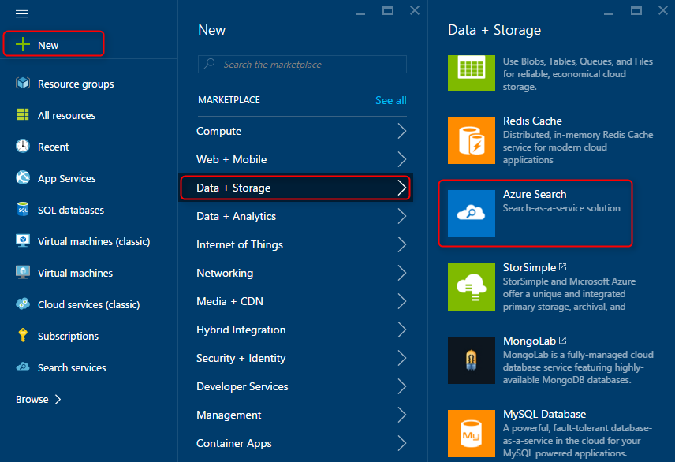
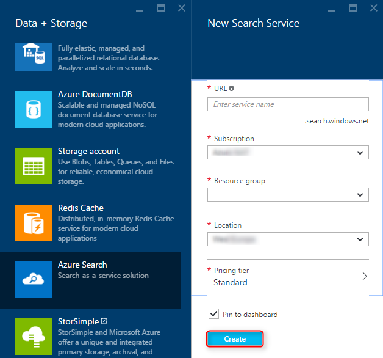
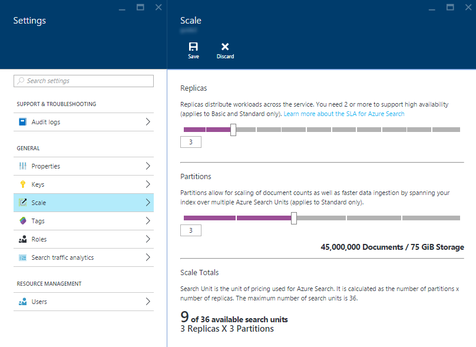

<properties
    pageTitle="Erstellen einen Azure Suchdienst Verwenden des Portals Azure | Microsoft Azure | Cloud gehosteten Suchdienst"
    description="Erfahren Sie, wie einen Azure Suchdienst mithilfe der Azure-Portal nicht bereitstellen."
    services="search"
    manager="jhubbard"
    authors="ashmaka"
    documentationCenter=""/>

<tags
    ms.service="search"
    ms.devlang="NA"
    ms.workload="search"
    ms.topic="article"
    ms.tgt_pltfrm="na"
    ms.date="08/29/2016"
    ms.author="ashmaka"/>

# Erstellen Sie einen Azure Suchdienst mithilfe der Azure-Portal

Dieses Handbuch führt Sie durch den Vorgang des Erstellens (oder provisioning) einen Azure-Suchdienst mithilfe der [Azure-Portal](https://portal.azure.com/).

Mit diesem Leitfaden wird davon ausgegangen, dass Sie bereits eine Azure-Abonnement verfügen und können melden Sie sich bei der Azure-Portal.

## Suchen von Azure suchen im Azure-Portal
1. Wechseln Sie zum [Azure-Portal](https://portal.azure.com/) an, und melden Sie sich.
1. Klicken Sie auf das Pluszeichen ("+") in der oberen linken Ecke auf.
2. Wählen Sie **Daten + Speicher**.
3. Wählen Sie aus **Azure zu suchen**.

## Wählen Sie einen Namen und URL-Endpunkt des Diensts
1. Ihr Name Service werden Teil Ihrer Azure Suchdienst Endpunkt-URL, anhand derer Sie Ihre Anrufe API zum Verwalten und verwenden den Suchdienst vornehmen.
2. Geben Sie Ihren Dienstnamen in das Feld **URL** ein. Der Dienstname:
  * darf nur Kleinbuchstaben, Ziffern oder Striche enthalten ("-")
  * kann nicht verwenden Sie einen Gedankenstrich ("-") als die ersten 2 Zeichen oder letzten einzelnes Zeichen
  * keine aufeinander folgenden Striche enthalten ("–")
  * Eingeschränkte zwischen 2 und 60 Zeichen lang ist

## Wählen Sie ein Abonnement, in dem Dienst trennen
Wenn Sie mehr als ein Abonnement besitzen, können Sie auswählen, welches dieser Azure Suchdienst enthalten sein sollen.

## Wählen Sie eine Ressourcengruppe für den Dienst aus.
Erstellen einer neuen Ressourcengruppe oder ein vorhandenes Layout auszuwählen. Eine Ressourcengruppe ist eine Zusammenstellung von Azure Dienste und Ressourcen, die gemeinsam verwendet werden. Beispielsweise, wenn Sie Azure Suche indizieren eine SQL-Datenbank verwenden, sollten klicken Sie dann beide der folgenden Dienste Teil derselben Ressourcengruppe.

## Wählen Sie den Speicherort, in der Dienst gehostet wird
Als Azure-Dienst steht Azure Suchen in Rechenzentren auf der ganzen Welt gehostet werden. Bitte beachten Sie die [Preise können variieren](https://azure.microsoft.com/pricing/details/search/) von Geography.

## Wählen Sie Ihre Preisgestaltung Ebene aus.
[Azure-Suche wird momentan in mehreren Preisgestaltung Stufen angeboten](https://azure.microsoft.com/pricing/details/search/): kostenlose, einfache oder Standard. Jede Ebene verfügt über eine eigene [Kapazität und Grenzwerte](search-limits-quotas-capacity.md). Anleitungen finden Sie unter [Auswählen eines Preisgestaltung Ebene oder SKU](search-sku-tier.md) .

In diesem Fall haben wir die standardmäßige Ebene für unseren Service ausgewählt.

## Wählen Sie die Schaltfläche "Erstellen" zu Ihrem Dienst bereitstellen.

## Skalieren des Diensts

Nach der Dienst bereitgestellt wird, können Sie darauf, um Ihren Anforderungen skalieren. Wenn Sie die standardmäßige Ebene des Diensts Azure suchen ausgewählt haben, können Sie Ihrem Dienst in zwei Dimensionen skalieren: Replikate und Partitionen. Wenn Sie die grundlegende Ebene ausgewählt haben, können Sie nur Replikate hinzufügen.

*__Partitionen__* ermöglichen Ihrem Dienst zum Speichern und weitere Dokumente durchsuchen.

*__Replikate__* zulassen des Diensts verarbeitet eine höhere Auslastung von Suchabfragen - [Dienst erfordert 2 Replikate schreibgeschützt Vereinbarung zum SERVICELEVEL erzielen und 3 Replikate ein schreibgeschützter Vereinbarung zum SERVICELEVEL zu erzielen](https://azure.microsoft.com/support/legal/sla/search/v1_0/).

1. Wechseln Sie zu Ihrer Azure Suchdienst Management vorher in Azure-Portal an.
2. Aktivieren Sie in den **Einstellungen** Blade **Skalieren**ein.
3. Sie können den Dienst durch Hinzufügen von Replikaten oder Partitionen skalieren.
  * Sie können keine des Diensts ältere 36 Suche Einheiten skalieren. Die Gesamtzahl der Suche Einheiten ist das Produkt Replikate und Partitionen (Replikate * Partitionen = Summe Suche Einheiten).
  * Wenn Sie die grundlegende Ebene ausgewählt haben, können Sie nur auf 3 Replikate skalieren. Grundlegende Dienste sind an einer Einzelpartition gebunden.

## Weiter
Nach der Bereitstellung eines Azure Suchdienst, werden Sie zum [Definieren einer Azure Suchindex](search-what-is-an-index.md) bereit, damit Sie hochladen und von Daten suchen.

Ein kurzes Lernprogramm finden Sie unter [Erste Schritte mit Azure suchen im Portal](search-get-started-portal.md) .
