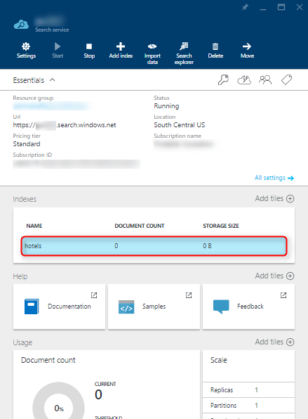
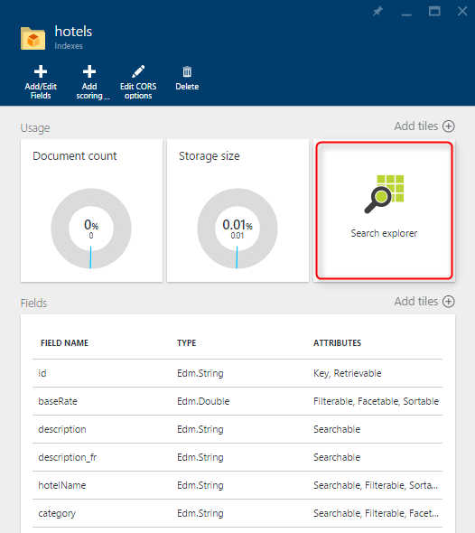
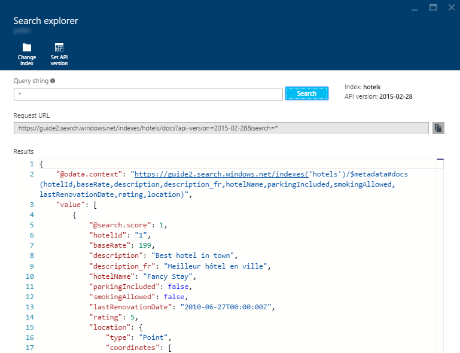

<properties
    pageTitle="Abfrage über das Azure-Portal Azure Suchindex | Microsoft Azure | Cloud gehosteten Suchdienst"
    description="Emission eine Suchabfrage in der Azure-Portal Search-Explorer."
    services="search"
    manager="jhubbard"
    documentationCenter=""
    authors="ashmaka"
/>

<tags
    ms.service="search"
    ms.devlang="NA"
    ms.workload="search"
    ms.topic="get-started-article"
    ms.tgt_pltfrm="na"
    ms.date="08/29/2016"
    ms.author="ashmaka"
/>
# Verwenden des Portals Azure Azure Suchindex Abfragen
> [AZURE.SELECTOR]
- [(Übersicht)](search-query-overview.md)
- [Portal](search-explorer.md)
- [.NET](search-query-dotnet.md)
- [REST](search-query-rest-api.md)

Mit diesem Leitfaden wird die Vorgehensweise zum Abfragen von Azure Suchindex Azure-Portal angezeigt.

Bevor Sie beginnen diese exemplarische Vorgehensweise, sollten Sie bereits [eine Azure Suchindex erstellt](search-what-is-an-index.md) und [sie mit Daten aufgefüllt](search-what-is-data-import.md)verfügen.

## Ich. Wechseln Sie zu Ihrer Blade Azure-Suche
1. Klicken Sie auf "Alle Ressourcen" im Menü auf der linken Seite des [Azure-Portal](https://portal.azure.com/#blade/HubsExtension/BrowseResourceBlade/resourceType/Microsoft.Search%2FsearchServices)
2. Wählen Sie den Dienst Azure-Suche

## II. Wählen Sie den Index aus, die, den Sie suchen möchten.
1. Wählen Sie den Index aus, die, den Sie in der Kachel "Indizes" suchen möchten.

## III. Klicken Sie auf die Kachel "Search-Explorer"

## III. Suche starten
1. Um Ihre Azure Suchindex zu suchen, mit der beginnen Sie Eingabe in das Feld "*Abfragezeichenfolge*", und drücken Sie dann die "**Suchen**".
 * Wenn Sie die Suche Explorer verwenden, können Sie einen beliebigen der [Abfrageparameter](https://msdn.microsoft.com/library/dn798927.aspx) angeben

2. Im Abschnitt "*Ergebnisse*" werden das Ergebnis der Abfrage in der unformatierten JSON, die in einen HTTP-Antworttext empfangen werden möchten, wenn ausgeben Suche gegen die Azure suchen REST-API anfordert präsentiert werden.
3. Die Abfragezeichenfolge wird automatisch in den richtigen Anforderung-URL für eine HTTP-Anforderung gegen die Azure Suche REST-API analysiert werden.

