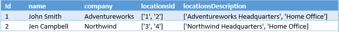
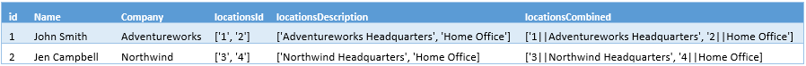

<properties
    pageTitle="So Modellieren komplexer Datentypen in Azure suchen | Microsoft Azure-Suche"
    description="Verschachtelte oder hierarchische Datenstrukturen in eine flache Rowset- und Datentyp Websitesammlungen mit Azure-Suchindex erstellt werden können."
    services="search"
    documentationCenter=""
    authors="LiamCa"
    manager="pablocas"
    editor=""
    tags="complex data types; compound data types; aggregate data types"
/>

<tags
    ms.service="search"
    ms.devlang="na"
    ms.workload="search"
    ms.topic="article"
    ms.tgt_pltfrm="na"
    ms.date="09/07/2016"
    ms.author="liamca"
/>

# So Modellieren komplexer Datentypen in Azure-Suche

Externe Datasets eine Azure Suchindex manchmal gefüllt gehören hierarchische oder geschachtelte Unterstrukturen frei, die in einem tabellarischen Rowset nicht übersichtlich aufzuteilen. Beispiele für solche Strukturen möglicherweise mehrere Orte und Telefonnummern für einen einzelnen Kunden, mehrere Farben und Größen für eine einzelne SKU, mehrere Autoren von einem Handbuch umfassen usw. In modeling Ausdrücke, wird möglicherweise diese Strukturen genannt *komplexer Datentypen*, *zusammengesetzte Datentypen*, *zusammengesetzte Datentypen*oder *Datentypen aggregieren*, um ein paar zu nennen angezeigt.

Komplexer Datentypen werden nicht systembedingt in Azure-Suche unterstützt, aber bewährte problemumgehung enthält einen zweistufigen Prozess reduzieren die Struktur und dann einen Datentyp für die **Websitesammlung** wiederherstellen, kann die innere Struktur verwenden. Das Verfahren in diesem Artikel beschriebenen ermöglicht es die Inhalte, die durchsucht werden, facettierten, gefiltert und sortiert.

## Beispiel für eine komplexe Datenstruktur

Befindet sich in der Regel, die Daten in Frage, als eine Reihe von JSON oder XML-Dokumente oder Elemente in einem NoSQL-Speicher, z. B. DocumentDB. Sind strukturiert, die Herausforderung,-gibt es mehrere untergeordnete Elemente, die durchsucht und gefiltert werden müssen.  Führen Sie das folgende JSON-Dokument, das eine Reihe von Kontakten als Beispiel für Listen als Ausgangspunkt für die Darstellung der dieses Problem zu umgehen:

~~~~~
[
  {
    "id": "1",
    "name": "John Smith",
    "company": "Adventureworks",
    "locations": [
      {
        "id": "1",
        "description": "Adventureworks Headquarters"
      },
      {
        "id": "2",
        "description": "Home Office"
      }
    ]
  }, 
  {
    "id": "2",
    "name": "Jen Campbell",
    "company": "Northwind",
    "locations": [
      {
        "id": "3",
        "description": "Northwind Headquarter"
      },
      {
        "id": "4",
        "description": "Home Office"
      }
    ]
}]
~~~~~

Während die Felder "Id" mit dem Namen, 'Name' und 'Company' einfach zugeordnet werden können als Felder innerhalb einer Azure Suchindex 1: 1, Feld 'Speicherorte' enthält ein Array von Orte, müssen beide eine Reihe von IDs Speicherort als auch Speicherort Beschreibungen. Vorausgesetzt, dass Azure Suche keinen Datentyp, der unterstützt werden, benötigen wir eine andere Möglichkeit, dies in Azure suchen modellieren. 

> [AZURE.NOTE] Dieses Verfahren wird auch durch Kirk Evans beschrieben, in einen Blogbeitrag [Indizierung DocumentDB mit Azure suchen](https://blogs.msdn.microsoft.com/kaevans/2015/03/09/indexing-documentdb-with-azure-seach/), der angezeigt wird, die eine Methode namens "Zusammenfassen von Daten", bei dem Sie ein Feld namens müssten `locationsID` und `locationsDescription` , die sich sowohl [Websitesammlungen](https://msdn.microsoft.com/library/azure/dn798938.aspx) (oder ein Array von Zeichenfolgen).   

## Teil 1: Reduzieren Sie die Matrix in einzelne Felder

Um eine Azure Suchindex erstellen, die diesem Dataset ausgelegt ist, erstellen Sie einzelne Felder für die geschachtelte Unterstruktur: `locationsID` und `locationsDescription` mit einem Datentyp von [Websitesammlungen](https://msdn.microsoft.com/library/azure/dn798938.aspx) (oder ein Array von Zeichenfolgen). In diesen Feldern indizieren Sie in diesem Fall die Werte "1" und "2" in der `locationsID` Feld für John Smith und die Werte "3" und "4" in der `locationsID` für Jen Campbell-Feld.  

Die Daten in Azure Suche würde wie folgt aussehen: 

## Teil 2: Hinzufügen eines Felds für die Websitesammlung in der Indexdefinition

Im IndexSchema können die Felddefinitionen in diesem Beispiel ähneln.

~~~~
var index = new Index()
{
    Name = indexName,
    Fields = new[]
    {
        new Field("id", DataType.String) { IsKey = true },
        new Field("name", DataType.String) { IsSearchable = true, IsFilterable = false, IsSortable = false, IsFacetable = false },
        new Field("company", DataType.String) { IsSearchable = true, IsFilterable = false, IsSortable = false, IsFacetable = false },
        new Field("locationsId", DataType.Collection(DataType.String)) { IsSearchable = true, IsFilterable = true, IsFacetable = true },
        new Field("locationsDescription", DataType.Collection(DataType.String)) { IsSearchable = true, IsFilterable = true, IsFacetable = true }
    }
};
~~~~

## Überprüfen Sie die Suche Verhalten und optional erweitern Sie des Indexes

Wenn Sie den Index erstellt und die Daten geladen, können Sie jetzt die Lösung zum Überprüfen der Ausführung der Suche-Abfragen für das Dataset testen. Jedes Feld **Websitesammlung** sollten **durchsucht**, **gefiltert** und **Facetable**. Sie sollten Abfragen wie ausführen können:

* Suchen nach allen Personen, die in der 'Adventureworks zentrale' arbeiten.
* Abrufen der Anzahl von Personen, die in einem Office' Start' arbeiten.  
* Anzeigen von Personen, die in einem Office' Start' arbeiten, welche anderen Niederlassungen sie zusammen mit der Anzahl der Personen an jedem Standort funktionieren.  

Fällt dieses Verfahren liegen ist, wenn Sie eine Suche ausführen, die sowohl die Id als auch die Position Beschreibung kombiniert müssen. Beispiel:

* Nach suchen Sie allen Personen, können sie ein Start Büro und verfügt über eine ID Speicherort von 4.  

Wenn diese nicht zurückgerufen der ursprüngliche Inhalt folgt aussieht:

~~~~
   {
        id: '4',
        description: 'Home Office'
   }
~~~~

Jedoch jetzt, da wir die Daten in separaten Feldern aufgeteilt haben, wir haben keine Möglichkeit zu wissen IF den Start Office für Jen Campbell auf bezieht `locationsID 3` oder `locationsID 4`.  

Definieren Sie ein weiteres Feld im Index, der alle Daten in einer einzelnen Auflistung kombiniert, um diesen Fall zu behandeln.  Unsere beispielsweise ruft wir dieses Feld `locationsCombined` und wir werden die Inhalte mit Trennen einer `||` , obwohl Sie Trennzeichen ein, das Sie der Meinung sind wäre eines eindeutigen Satzes von Zeichen für den Inhalt auswählen können. Beispiel: 

Mit diesem `locationsCombined` Feld wir aufnehmen noch mehr Abfragen, beispielsweise:

* Zeigen Sie die Anzahl der Personen, die bei einem 'Start Büro' mit Speicherort Id '4' arbeiten.  
* Suchen Sie nach Personen, die bei einer Office' Start' Arbeiten mit Speicherort-Id "4". 

## Einschränkungen

Diese Methode eignet sich für eine Reihe von Szenarios, aber es ist nicht verfügbar in jedem Fall.  Beispiel:

1. Wenn Sie keine statische Reihe von Feldern in der komplexen Datentyp und gab keine Möglichkeit, alle möglichen Typen auf ein einzelnes Feld zuordnen. 
2. Aktualisieren die verschachtelte Objekte erfordert einigen zusätzlichen Aufwand bestimmen, genau wie in den Suchindex von Azure aktualisiert werden muss

## Beispiel-code

Sehen Sie ein Beispiel zum Indizieren einer komplexen JSON-Datenmenge in Azure suchen und eine Reihe von Abfragen über dieses Dataset bei dieser [GitHub Repo](https://github.com/liamca/AzureSearchComplexTypes)ausführen.

## Als Nächstes

[Stimme für systemeigene Unterstützung für komplexer Datentypen](https://feedback.azure.com/forums/263029-azure-search) auf die Azure Suche UserVoice Seite, und geben Sie alle weiteren Eingaben, die Sie uns Bezug auf Implementierung von Features berücksichtigen möchten. Sie können auch erreichen an mich direkt auf Twitter unter @liamca.

 