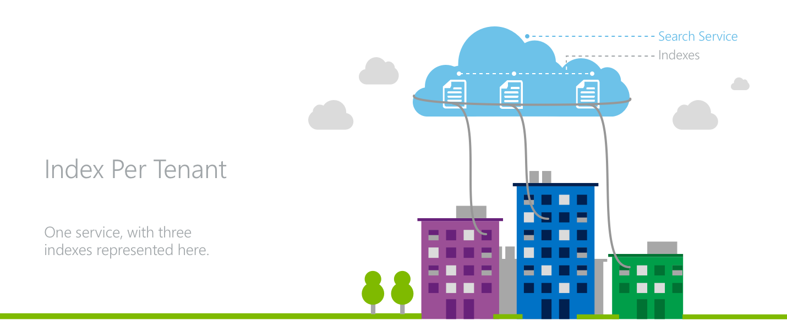
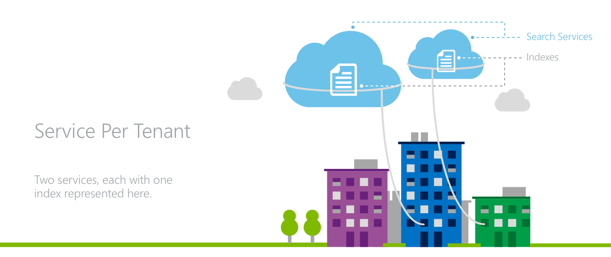

<properties
    pageTitle="Modeling Tenancy in Azure suchen | Microsoft Azure | Cloud gehosteten Suchdienst"
    description="Erfahren Sie mehr über allgemeine entwurfmustern für mandantenfähigen SaaS Applikationen, während der Verwendung von Azure suchen."
    services="search"
    manager="jhubbard"
    authors="ashmaka"
    documentationCenter=""/>

<tags
    ms.service="search"
    ms.devlang="NA"
    ms.workload="search"
    ms.topic="article"
    ms.tgt_pltfrm="na"
    ms.date="10/26/2016"
    ms.author="ashmaka"/>

# Entwerfen von Mustern für mandantenfähigen SaaS Applikationen und Azure-Suche

Eine Anwendung mandantenfähigen gilt, die die gleichen Dienste und Funktionen, die auf eine beliebige Anzahl Mandanten bereitstellt, die nicht angezeigt oder die Daten von einem beliebigen anderen Mandanten freigeben. Dieses Dokument beschreibt Mandanten Isolationsstrategien für mandantenfähigen entwickelte mit Azure suchen.

## Azure Suche Konzepte
Als einer Suche als Service-Lösung können Azure suchen Entwickler Rich-Suche Erfahrung Clientanwendungen hinzufügen, ohne jede Infrastruktur verwalten oder ein Experte auf Suchen. Daten werden der Dienst geladen, und klicken Sie dann in der Cloud gespeichert. Verwenden einfache Anfragen der Azure-Suche-API, können die Daten dann geändert und durchsucht werden. Übersicht über den Dienst finden Sie in [diesem Artikel](http://aka.ms/whatisazsearch). Bevor besprochen entwurfmustern, ist es wichtig, einige Konzepte in Azure-Suche zu verstehen.

### Suchen von Diensten, Indizes, Feldern und Dokumente
Bei der Verwendung von Azure Suche abonniert eine ein _Suchdienst_. Daten zu Azure hochgeladen werden, ist es in einen _Index_ innerhalb der Suchdienst gespeichert. Es kann eine Anzahl von Indizes in einem einzigen Dienst sein. Wenn die vertrauten Konzepte Datenbanken verwenden möchten, kann der Suchdienst zu einer Datenbank Statusmodul vergleichbar, während die Indizes in einem Dienst zu Tabellen in einer Datenbank Statusmodul vergleichbar werden können.

Jeder Index innerhalb eines Suchdiensts hat ihr eigenes Schema, das durch eine Reihe von anpassbare _Felder_definiert wird. Daten werden ein Azure Suchindex in Form von einzelne _Dokumente_hinzugefügt. Jedes Dokument in einem bestimmten Index hochgeladen werden muss und muss des Indexes Schema passt. Beim Durchsuchen von Daten mithilfe der Suchfunktion Azure sind die voll-Textsuche Abfragen mit einem bestimmten Index ausgestellt.  Um diese Konzepte auf, die mit einer Datenbank vergleichen, Felder können Spalten in einer Tabelle Statusmodul vergleichbar werden und Dokumente auf Zeilen Statusmodul vergleichbar werden können.

### Skalierbarkeit
Alle Azure-Suchdiensts in der Standardansicht [Preise Ebene](https://azure.microsoft.com/pricing/details/search/) kann in zwei Dimensionen skalieren: Speicher und Verfügbarkeit.
* _Partitionen_ können hinzugefügt werden, um die Speicherung eines Suchdiensts zu erhöhen.
* _Replikate_ können einen Dienst für den Durchsatz der Anfragen zu erhöhen, die ein Suchdienst behandeln können hinzugefügt werden.

Hinzufügen und Entfernen von Partitionen und Replikate am zulassen der Suchdiensts mit der Datenmenge wächst und der Anwendung Auslastung Verkehr über ausreichend Kapazität. In der Reihenfolge für einen Suchdienst, um eine gelesene [Vereinbarung zum SERVICELEVEL](https://azure.microsoft.com/support/legal/sla/search/v1_0/)zu erreichen müssen zwei Replikate. In Reihenfolge für einen Dienst, um eine Lese-und Schreibzugriff [Vereinbarung zum SERVICELEVEL](https://azure.microsoft.com/support/legal/sla/search/v1_0/)zu erreichen ist es drei Replikate erforderlich.

### Grenzwerte für Dienst und Index in Azure-Suche
Es gibt ein paar unterschiedliche [Preise Ebenen](https://azure.microsoft.com/pricing/details/search/) in Azure suchen, aber alle Stufen unterschiedliche [Grenzwerte und Kontingente](search-limits-quotas-capacity.md). Einige der genannten Einschränkungen Ebene der Dienst sind, einige sind auf der Ebene des Indexes und einige auf Partitionsebene-sind.

|                                  | Grundlegende     | Standard1   | Standard2   | Standard3   | HD-Standard3:  |
|----------------------------------|-----------|-------------|-------------|-------------|---------------|
| Maximale Replikate pro Dienst     | 3         | 12          | 12          | 12          | 12            |
| Maximale Partitionen pro Dienst   | 1         | 12          | 12          | 12          | 1             |
| Suche maximalen Einheiten (Replikate * Partitionen) pro Dienst | 3         | 36          | 36          | 36          | 36 (max 3 Partitionen)            |
| Maximale Dokumente pro Dienst    | 1 Millionen | 180 Millionen | 720 Millionen | 1.4 Milliarden | 600 Millionen   |
| Maximale Speicherplatz pro Dienst      | 2 GB      | 300 GB      | 1.2 TB      | 2.4 TB      | 600 GB        |
| Maximale Dokumente pro Partition  | 1 Millionen | 15 Millionen  | 60 Millionen  | 120 Millionen | 200 Millionen   |
| Maximale Speicherplatz pro Partition    | 2 GB      | 25 GB       | 100 GB      | 200 GB      | 200 GB        |
| Maximale Indizes pro Dienst      | 5         | 50          | 200         | 200         | 3000 (maximal 1000 Indizes/Partition)          |

#### S3 HD '
In Azure-Suche S3 Preisgestaltung Ebene gibt es eine Option für den High Dichtefunktion (HD) Modus speziell für das mandantenfähigen Szenarien. In vielen Fällen ist es erforderlich, um eine große Anzahl von kleineren Mandanten unter einem einzelnen Dienst Vorteile der Übersichtlichkeit und Kosten Effizienz erzielen unterstützen.

S3 HD ermöglicht die viele kleine Indizes unter der Verwaltung von einem einzelnen Suchdienst durch die Möglichkeit zum Verwenden von Partitionen für die Möglichkeit zum weitere Indizes in einem einzigen Dienst hosten Indizes zu skalieren trading verpackt werden.

Konkret konnte ein S3-Diensts zwischen 1 und 200 Indizes verfügen, die zusammen bis zu 1.4 Milliarden Dokumente gehostet werden konnte. Eine HD S3 zulassen andererseits möchten einzelne Indizes, um nur bis zu 1 Millionen Dokumente zu wechseln, aber es kann bis zu 1000 Indizes pro Partition (bis zu 3000 pro Service) mit dem gesamten Dokumentanzahl der 200 Millionen pro Partition behandeln (bis zu 600 Millionen pro Service).

## Aspekte für Applikationen mandantenfähigen
Mandantenfähigen Applikationen müssen die Ressourcen für den Mandanten effektiv gleichzeitiger gewissen Grad an Datenschutz zwischen den verschiedenen Mandanten verteilen. Es gibt ein paar Überlegungen beim Entwerfen der Architektur für eine solche Anwendung:

* _Mandanten Isolation:_ Anwendung Entwickler müssen geeignete Maßnahmen, um sicherzustellen, dass keine Mandanten nicht autorisiert oder Zugriff auf die Daten der anderen Mandanten unerwünschte haben. Über die Perspektive Daten Datenschutz erfordern Mandanten Isolationsstrategien effektiven Verwaltung von freigegebenen Ressourcen und Schutz von laut Nachbarn.
* _Cloud Ressourcenkosten:_ Wie bei jeder anderen Anwendung müssen Software Lösungen Kosten als Komponente einer Anwendung mandantenfähigen Mitbewerber bleiben.
* _Vorgänge für erleichterte Bedienung:_ Bei der Entwicklung einer mandantenfähigen Architektur ist die Auswirkung auf die Vorgänge und Komplexität der Anwendung ein wichtiges Kriterium aus. Azure Suche verfügt über eine [99,9 % Vereinbarung zum SERVICELEVEL](https://azure.microsoft.com/support/legal/sla/search/v1_0/).
* _Globale Platzbedarf:_ Möglicherweise müssen mandantenfähigen Applikationen effektiv Mandanten dienen die in der ganzen Welt verteilt sind.
* _Skalierbarkeit:_ Entwickler müssen berücksichtigen, wie er zwischen ausreichend gering Anwendungskomplexität verwalten und Entwerfen der Anwendung mit Anzahl der Mandanten und die Größe des Mandanten Daten und Arbeitsbelastung skalieren abstimmen.

Azure-Suche bietet ein paar Begrenzung, die zum Isolieren Mandanten Daten und Arbeitsbelastung verwendet werden können.

## Modeling Tenancy mit Azure-Suche
Im Fall einer mandantenfähigen Szenario Entwickler der Anwendung verbraucht ein oder mehrere Suchdienste und deren Mandanten zwischen Services und/oder Indizes dividieren. Azure Suche weist einige allgemeine Muster aus, wenn ein mandantenfähigen Szenario modeling:

1. _Index pro Mandant:_ Jede Mandanten hat einen eigenen Index innerhalb eines Suchdiensts, das für andere Mandanten freigegeben ist.
1. _Dienst pro Mandant:_ Jede Mandanten verfügt über eine eigene dedizierte Azure Suchdienst Geschenk der höchsten Ebene der Daten und Arbeitsbelastung Trennung.
1. _Mischung aus beiden:_ Größere, weitere aktiv Mandanten werden dedizierte Dienste zugewiesen, während kleinere Mandanten einzelnen Indizes in freigegebenen Services zugewiesen werden.

## 1 indizieren Sie pro Mandant

In einem Modell Index-pro Mandant beanspruchen mehrere Mandanten ein einzelnes Azure Suchdiensts, in dem jede Mandanten eigene Index hat.

Mandanten zu Datenisolation erreichen, da alle Anfragen suchen und Dokument Vorgänge werden auf eine Indexebene in Azure suchen ausgestellt. In den Layer Anwendung befindet sich die Präsenz müssen die verschiedenen Mandanten den Datenverkehr in die gemischte Indizes beim Verwalten auch über alle Mandanten Ressourcen Ebene der Dienst leiten.

Ein Key-Attribut des Modells Index-pro Mandant ist die Möglichkeit für den Entwickler der Anwendung, die Kapazität eines Suchdiensts zwischen der Anwendung Mandanten überzeichnen. Wenn die Mandanten eine ungleiche Verteilung der Arbeitsbelastung verfügen, kann die optimale Kombination von Mandanten auf einen Suchdienst Indizes eine Anzahl hochgradig aktiven, Ressourcen ankommt Mandanten gerecht werden kann, denn während gleichzeitig eine lange Ende weniger aktiven Mandanten verteilt werden. Das Verhältnis ist die Unfähigkeit des Modells zur Behandlung von Situationen, in dem jede Mandanten gleichzeitig hochgradig aktiv ist.

Index pro Mandant Modell bietet die Grundlage für eine Variablen Stückkosten Modell, wo ein gesamte Azure Suchdienst betreiben erworben wird, und klicken Sie dann später mit Mandanten ausgefüllt. Dadurch freie Kapazität, für die Test- und kostenlosen Konten festgelegt werden sollen.

Für Applikationen globale das Modell Index-pro Mandant ist möglicherweise nicht die am effizientesten. Wenn eine Anwendung des Mandanten auf der ganzen Welt verteilt sind, ein separaten Dienst für die einzelnen Regionen notwendigen möglicherweise die Kosten für jede von ihnen doppelte möglicherweise.

Azure suchen kann wächst für die Skalierung der sowohl die einzelnen Indizes und die Gesamtzahl der Indizes. Wenn eine entsprechende Preise wurde Ebene ausgewählt, Partitionen und der mit dem gesamten Suchdienst hinzugefügt werden kann, wenn ein einzelner Index innerhalb des Diensts zu groß im Hinblick auf Speicher oder den Datenverkehr wird.

Wenn die Gesamtzahl der Indizes für einen einzelnen Dienst zu groß wird, muss ein anderer Dienst bereitgestellt werden, um den neuen Mandanten aufnehmen zu können. Wenn Indizes haben zwischen Suchdiensten verschoben werden soll, wenn neue Dienste hinzugefügt werden, müssen die Daten aus dem Index manuell aus einem Index zu einem anderen kopiert werden als Azure Suchen eines Indexes verschoben werden nicht zulässt.

## 2. Dienst pro Mandant

In einer Architektur Dienst pro Mandant weist jede Mandanten eigenem Suchdienst.

In diesem Modell wird die Anwendung die maximale Ebene der Isolation für den Mandanten erreicht. Jeden Dienst hat Speicher und Durchsatz für den Umgang mit suchanforderung als auch in separaten API Tasten eingerichtet werden.

Für Applikationen, in dem jede Mandanten eine große Präsenz oder die Arbeitsbelastung hat etwas variieren Mandanten zu Mandanten ist das Modell Dienst pro Mandant eine effektive Auswahl als Ressourcen in verschiedenen Mandanten Auslastung nicht freigegeben werden.

Ein Dienst pro Mandant Modell bietet auch die Vorteile eines Kostenmodells vorhersehbar, feste. Es gibt keine betreiben Investition in einer gesamten Suchdienst bis ein Mandanten, auszufüllenden vorhanden ist, jedoch die Kosten pro Mandant höher als ein Modell Index-pro Mandant ist.

Das Modell Dienst pro Mandant ist eine effiziente Auswahl für Applikationen globale. Mit geografischen verteilt Mandanten ganz einfach des Mandanten-Dienst in die entsprechende Region haben.

Die Probleme in dieselbe Skalierung dieses Muster auftreten, wenn einzelne Mandanten deren Dienst auseinander. Azure-Suche unterstützt derzeit nicht das Upgrade von der Preisgestaltung Ebene eines Suchdiensts, damit alle Daten in eine neue Dienstleistung manuell kopiert werden müssten.

## 3. beide Modelle das Mischen
Ein weiteres Muster für die Modellierung Tenancy wird sowohl die Index-pro-Mandanten-Dienst pro Mandant Strategien mischen.

Durch Kombinieren von zwei Muster aus, können einer Anwendung größten Mandanten dedizierte Dienste beanspruchen, während das lange Ende weniger aktiv, kleinere Mandanten Indizes in einem freigegebenen Dienst einnehmen kann. Dieses Modell gewährleistet, dass die größten Mandanten konsistent hohe Leistung vom Dienst während die kleineren Mandanten von einem beliebigen lauten Nachbarn geschützt haben.

Angewiesen, diese Strategie implementieren Zukunftsforschung in Vorhersage, welche Mandanten einen dedizierten Dienst im Vergleich zu einen Index in einem freigegebenen Dienst erforderlich ist. Anwendungskomplexität nimmt mit der müssen beide dieser multitenancy Modelle verwalten.

## Eine noch stärkere Verfeinerung erreichen
Die oben genannten entwurfmustern modellieren mandantenfähigen Szenarien in Azure suchen davon uniform Bereich, in dem jede Mandanten eine gesamte Instanz der Anwendung wird, aus. Applikationen können jedoch manchmal viele kleinere Bereichen verarbeiten.

Wenn-Dienst pro Mandant und Index pro Mandant Modelle nicht ausreichend kleine Bereiche sind, ist es möglich, einen Index, um ein noch genauer Grad der Genauigkeit erzielen modellieren.

Um einen einzelnen Index abweichendem Verhalten für verschiedene Clientendpunkte verfügen, kann ein Feld auf einen Index die angibt, einen bestimmten Wert für jede mögliche Client hinzugefügt werden. Jedes Mal ein Client Azure suchen Ruft, um Abfragen oder Bearbeiten eines Indexes, gibt den Code von der Clientanwendung den entsprechenden Wert für dieses Feld mithilfe der Azure-Suche [Filter](https://msdn.microsoft.com/library/azure/dn798921.aspx) -Funktion zum Zeitpunkt der Abfrage an.

Diese Methode kann verwendet werden, um die Funktionalität der separate Benutzerkonten, separaten Berechtigungsstufen, erzielen und sogar vollständig Applications zu trennen.

## Nächste Schritte
Azure suchen ist eine hervorragende Wahl für viele Clientanwendungen, [Weitere Informationen zu robuste Funktionen des Diensts](http://aka.ms/whatisazsearch). Berücksichtigen Sie die verschiedenen entwurfmustern für Applikationen mandantenfähigen auswerten, die [verschiedenen Preisgestaltung Ebenen](https://azure.microsoft.com/pricing/details/search/) sowie die entsprechenden [Beschränkungen Service](search-limits-quotas-capacity.md) optimale Ihre Bedürfnisse Azure-Suche auf Auslastung und Architekturen aller Größen passt.

Fragen zu Azure suchen und mandantenfähigen Szenarien können umgeleitet werden, um azuresearch_contact@microsoft.com.
