<properties
   pageTitle="Von Sicherheitshinweisen nach Typ in Sicherheitscenter Azure | Microsoft Azure"
   description="Dieses Dokument können Sie um den Typ des von Sicherheitshinweisen verfügbar in Azure-Sicherheitscenter zu verstehen."
   services="security-center"
   documentationCenter="na"
   authors="YuriDio"
   manager="swadhwa"
   editor=""/>

<tags
   ms.service="security-center"
   ms.topic="hero-article"
   ms.devlang="na"
   ms.tgt_pltfrm="na"
   ms.workload="na"
   ms.date="09/20/2016"
   ms.author="yurid"/>

# Von Sicherheitshinweisen nach Typ in Sicherheitscenter Azure
Dieses Dokument hilft Ihnen, die verschiedenen Typen von von Sicherheitshinweisen verfügbar in Azure-Sicherheitscenter zu verstehen. Lesen Sie weitere Informationen zum Verwalten von Benachrichtigungen [Verwaltung und Beantworten von Sicherheitshinweisen in Azure Sicherheitscenter](security-center-managing-and-responding-alerts.md) .

> [AZURE.NOTE] Aktualisieren Sie auf Azure Security Center Standard, um erweiterte Erkennung zu aktivieren. Kostenlose Testversion 90 Tage steht. Wählen Sie aktualisieren Preise Ebene in der [Sicherheitsrichtlinie](security-center-policies.md)ein. Die [Preise Seite](https://azure.microsoft.com/pricing/details/security-center/) Weitere Informationen finden Sie unter.

## Welche Art von Benachrichtigungen sind verfügbar?
Sicherheitscenter Azure bietet eine Vielzahl von Benachrichtigungen, die mit der Phasen der Kette Kill im Internet ausrichten. Die folgende Abbildung enthält einige Beispiele für verschiedene Benachrichtigungen Bezug auf einige dieser Phasen.

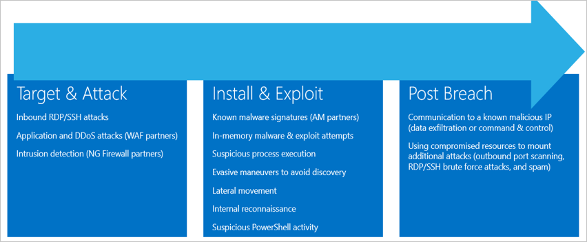

**Ziel & Angriffen**

- Eingehenden RDP/SSH Angriffen
- Anwendung und DDoS-Angriffen (WAF Partner)
- Einen unbefugten (NG Firewall Partner)

**Installieren und ausnutzen**

- Bekannte Schadsoftware Signaturen (Uhr Partner)
- In-Memory Schadsoftware & Exploit Versuche
- Ausführung von verdächtigen Prozess
- Verschleierten Schachzüge Suche zu vermeiden.
- Seitliche Bewegung
- Interner Eindringung
- Verdächtige PowerShell Aktivitäten

**Verstoß gegen Posten**  

- Kommunikation mit einer bekannten bösartiger IP (Daten Exfiltration oder Befehl & -Steuerelement)
- Verwenden von betroffenen Ressourcen zum Bereitstellen von weiterer Angriffen (Spam und ausgehenden Port Scan RDP/SSH Hackerangriffen zu)

Verschiedene Arten von Angriffen jede Phase zugeordnet sind, und sie die verschiedene Teilsystemen anzupassen. Adresse Angriffen während diese Phasen, Sicherheitscenter drei Feldkategorien für Benachrichtigungen hat:

- Virtuellen Computern Verhalten Analyse (VMBA)
- Netzwerk-Analyse
- Ressourcen-Analyse

## Verhalten Analyse virtuellen Computern

Azure-Sicherheitscenter können Verhalten Analytics kennzeichnen die betroffenen Ressourcen basierend auf Analyse von virtuellen Computern Ereignisprotokollen, beispielsweise: Ereignisse beim Erstellen von Prozess, Login Ereignisse usw..). Darüber hinaus müssen sich mit anderen zu prüfen, ob Belege von einer weit verbreitet für eine Marketingkampagne entsprechen.

> [AZURE.NOTE] Weitere Informationen dazu, wie das Sicherheitscenter Erkennungsfunktionen arbeiten zu können, finden Sie unter [Azure Security Center Erkennungsfunktionen](security-center-detection-capabilities.md).

### Analyse abstürzen

Stürzt ab Abbild Arbeitsspeicher, dass die Analyse ist eine Methode zum Auffinden von anspruchsvolle Schadsoftware, die traditionelle Sicherheitsmaßnahmen Lösungen zu entgehen kann verwendet werden soll. Versuchen Sie verschiedene Arten von Schadsoftware der erkannten von Anti-Virus-Produkten, indem Sie auf einem Datenträger nie schreiben oder Datenbankschutz geschriebene Software-Komponenten gering auf einem Datenträger. Dadurch wird die Schadsoftware schwer zu erkennen, traditionelle Modul Ansätze verwenden. Jedoch kann solche Malware erkannt werden mit Arbeitsspeicheranalyse, wie Schadsoftware auf ordnungsgemäße Funktion im Speicher verlassen muss.

Wenn Software stürzt ab, zeichnet ein Absturzabbild einen Teil des Speichers zum Zeitpunkt der Absturz auf. Nach Schadsoftware, allgemeine Anwendung oder Systemprobleme möglicherweise der Absturz verursacht werden. Durch die Analyse des Speichers in das Absturzspeicherabbild, können Sicherheitscenter erkennen Techniken, mit denen nutzen Schwachstellen in der Software, vertrauliche Daten zugreifen und heimliche beibehalten mit-in einem betroffenen Computer. Dies geschieht mit Hosts die minimalen Performance auswirken, wie die Analyse von Security Center Back-End ausgeführt wird.

Die folgenden Felder werden in der unten aufgeführte Abbild Analysis-Benachrichtigungen abstürzen:

- DUMPFILE: Namen der Sicherungsdatei Absturz
- PROZESSNAME: Name des Absturzprozesse
- PROCESSVERSION: Version des Absturzprozesse

### Shellcode erkannt

Shellcode ist die Nutzlast, die ausgeführt werden, nachdem Schadsoftware ein Softwaresicherheitsrisiko ausnutzen weist. Diese Warnung weist darauf hin, dass Absturzspeicherabbild Analyse ausführbaren Code weist auf Verhalten durch bösartige Fracht häufig ausgeführte erkannt hat. Zwar nicht bösartiger Software dieses Verhalten durchführen kann, ist es nicht normalen Software Development Methoden typische.

Diese Warnung bietet das folgende zusätzliche Feld:

- ADDRESS: Die Position im Arbeitsspeicher von der shellcode

Dies ist ein Beispiel für diese Art von Benachrichtigung:

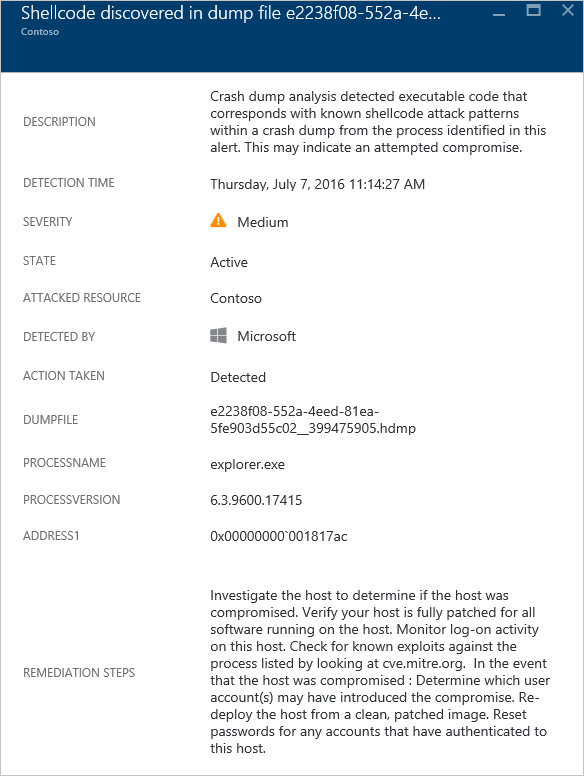 

### Modul Missbrauch erkannt

Windows basiert auf Dynamic Link Library (DLL-Dateien) Software allgemeine Windows-System-Funktionen nutzen können. Missbrauch DLL tritt bei Schadsoftware die DLL laden Reihenfolge zum Laden bösartige Fracht, wo beliebiger Code ausgeführt werden kann. Diese Warnung weist darauf hin, dass die Analyse der Absturzspeicherabbild erkannt hat, dass ein ähnlich benanntes Modul aus zwei unterschiedlichen Pfaden, geladen wird, einen der geladen Pfade an einem gemeinsamen Windows System binäre Ort stammen.

Seriösen Softwareentwickler gelegentlich die DLL laden Reihenfolge ändern unbeabsichtigte Gründen, z. B. instrumentieren, erweitern die Windows-Betriebssystem oder Windows Applications. Um Unterscheidung zwischen bösartiger und potenziell duldet Änderungen vor, um die Reihenfolge der DLL laden überprüft Azure-Sicherheitscenter, und zwar unabhängig davon, ob ein Modul geladen verdächtigen Profil entspricht. Das Ergebnis dieser Prüfung wird nach dem Feld "Signatur" der Warnung angezeigt und in der Schwere der Benachrichtigung, Beschreibung der Warnung und benachrichtigen Maßnahmen wiedergegeben wird. Analysieren von der auf dem Datenträger Kopie des Moduls Missbrauch, beispielsweise nach dem Überprüfen der digitalen Signatur von Dateien oder einen Scan Anti-Virus ausführen können Sie weitere Informationen unter ', um die Art seriösen oder bösartiger des Moduls Missbrauch vorsehen.

Zusätzlich zu den allgemeinen Feldern oben im Abschnitt "Shellcode entdeckt" beschrieben bietet diese Warnung die folgenden Felder:

- Signatur: Gibt an, wenn das Modul Missbrauch eines Profils von verdächtigen Verhalten entspricht
- HIJACKEDMODULE: Der Name des Moduls den übernommene Windows-system
- HIJACKEDMODULEPATH: Der Pfad des Moduls den übernommene Windows-system
- HIJACKINGMODULEPATH: Der Pfad des Moduls Missbrauch

Dies ist ein Beispiel für diese Art von Benachrichtigung:

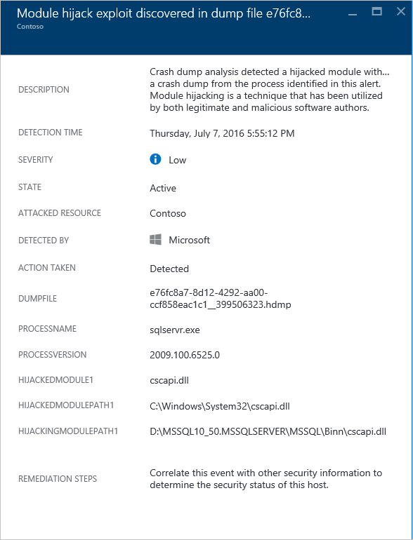 

### Adressmaskierung Windows-Modul gefunden

Verwenden Sie Schadsoftware möglicherweise Allgemeine Namen von Windows-Systembinärdateien (z. B. SVCHOST. EXE-Datei) oder Module (z. B. NTDLL. DLL) um "Verbund in" und die Art des Systemadministrators die Schadsoftware verdecken. Diese Warnung weist darauf hin, dass die Analyse der Absturzspeicherabbild erkannt hat, dass die Sicherungsdatei Absturz Module enthält, die Windows-System Modulnamen verwenden, aber nicht anderen Kriterien, die der Windows-Module typische sind erfüllen. Analysieren die auf dem Datenträger Kopie des Moduls Adressmaskierung können Sie weitere Informationen unter ', um die Art seriösen oder bösartiger dieses Moduls vorsehen. Analyse möglicherweise umfassen:

- Bestätigen Sie, dass die betreffende Datei als Teil eines Softwarepakets seriösen geliefert wird
- Überprüfen der digitalen Signatur der Datei
- Führen Sie einen Anti-Virus Scan an der Datei

Zusätzlich zu den allgemeinen Feldern oben im Abschnitt "Shellcode entdeckt" beschrieben bietet diese Warnung die folgenden zusätzlichen Felder:

- DETAILS: Beschrieben, ob die Metadaten Module gültig ist, und gibt an, ob das Modul aus einem Systempfad geladen wurde.
- NAME: Der Name des Moduls Windows Adressmaskierung
- Pfad: Der Pfad zum Adressmaskierung Windows-Modul.

Diese Warnung wird auch extrahiert und zeigt die bestimmte Felder aus des Moduls PE Kopfzeile, wie etwa "CHECKSUM" und "TIMESTAMP". Diese Felder werden nur angezeigt, wenn die Felder im Modul vorhanden sind. Finden Sie im [Microsoft-PE und COFF-Spezifikation](https://msdn.microsoft.com/windows/hardware/gg463119.aspx) Details zu diesen Feldern.

Dies ist ein Beispiel für diese Art von Benachrichtigung:

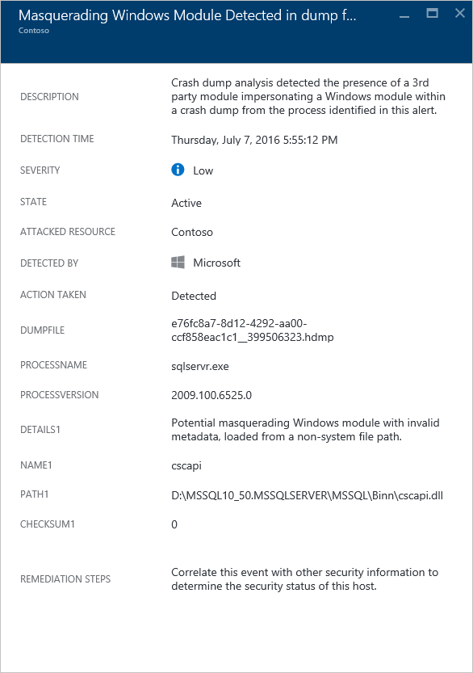 

### Binäre geänderte System erkannt

Schadsoftware möglicherweise Core Systembinärdateien um verborgenen Daten zugreifen oder heimliche beibehalten werden, klicken Sie auf eine beschädigte System ändern. Diese Warnung weist darauf hin, dass die Analyse der Absturzspeicherabbild erkannt hat, dass die Windows-Betriebssystem Kernbinärdateien im Speicher oder auf dem Datenträger geändert wurden.
Seriösen Softwareentwickler ändern gelegentlich Systemmodule im Speicher unbeabsichtigte Gründen, wie z. B. abweichen müssen oder für die Anwendungskompatibilität. Um zu unterscheiden zwischen bösartiger und potenziell legitime Module, überprüft Azure-Sicherheitscenter, und zwar unabhängig davon, ob das geänderte Modul zu einer verdächtigen Profil erfüllt. Das Ergebnis dieser Prüfung wird durch die Schwere der Benachrichtigung, Beschreibung der Warnung und benachrichtigen Maßnahmen angezeigt.

Zusätzlich zu den allgemeinen Feldern im Abschnitt "Shellcode entdeckt" oben beschriebenen bietet diese Warnung die folgenden zusätzlichen Felder:

- MODULENAME: Der Name des geänderten binäre Systems
- MODULEVERSION: Das geänderte System binäre Version

Dies ist ein Beispiel für diese Art von Benachrichtigung:

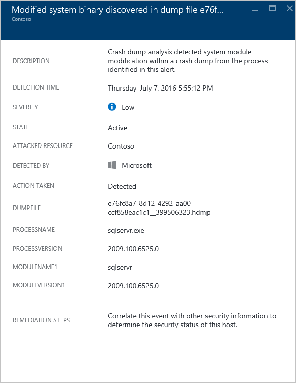 

### Verdächtigen Prozesse ausgeführt

Sicherheitscenter identifiziert verdächtige Prozess bei der Ausführung in der Zielliste virtuellen Computern und lösen eine Warnung aus. Die Erkennung nicht nach bestimmten Namen sind, allerdings durch seinen Parameter, daher auch, wenn der Angreifer benennt die ausführbare Datei, um Sicherheitscenter weiterhin zu erkennen.
 
Dies ist ein Beispiel für diese Art von Benachrichtigung:

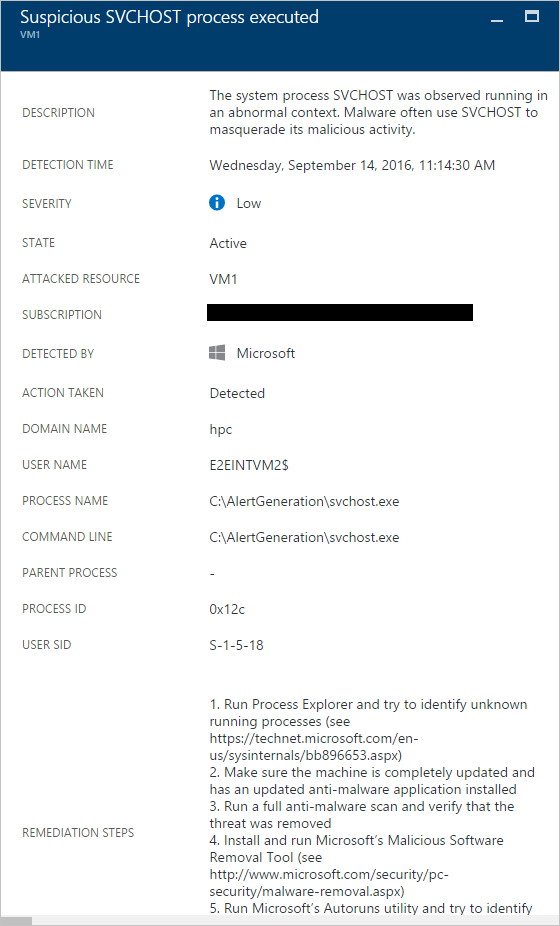

### Mehrere Domänenkonten abgefragt

Sicherheitscenter können mehrere Versuche erkennen, Abfrage Domänenkonten, also etwa in der Regel von Angreifern während Eindringung durchgeführt. Dieses Verfahren zum Abfragen von der Domäne zu identifizieren, die die Benutzer, was Konten der Domäne-Administrator sind, welchen Computern Domänencontroller sowie mögliche Domäne Vertrauensstellung mit anderen Domänen sind, können von Angreifern genutzt werden.

Dies ist ein Beispiel für diese Art von Benachrichtigung:

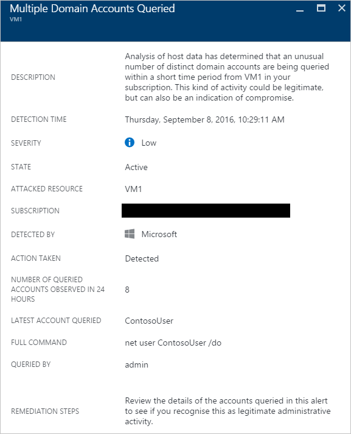

## Netzwerk-Analyse

Erkennung Sicherheitscenter Netzwerk funktioniert, da sich Sicherheitsinformationen automatisch aus Ihrem Verkehr Azure IPFIX (Internet Protocol Datenfluss Informationen exportieren). Er analysiert diese Informationen, die häufig Verknüpfen von Informationen aus mehreren Quellen, um Risiken zu identifizieren.

### Verdächtigen ausgehenden Datenverkehr erkannt

Netzwerkgeräte können erkannt und ein Profil auf die gleiche Weise als andere Arten von Systemen erstellt werden. Angreifer beginnen mit Scannen von Ports normalerweise / port ziehen. Im folgenden Beispiel müssen Sie eine verdächtige SSH Datenverkehr eines virtuellen Computers, die von einer SSH Bruteforce oder Port ziehen Angriffen anhand einer externen Ressource durchgeführt werden können.

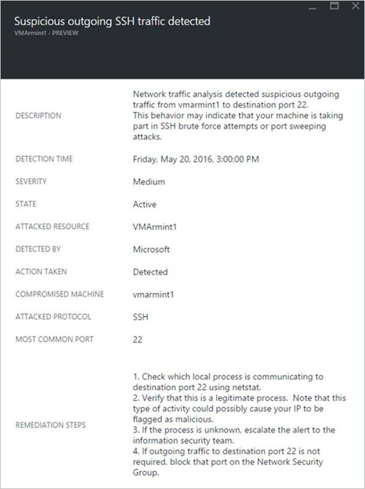 

Diese Warnung bietet Informationen, die ermöglicht es Ihnen, die Ressource zu identifizieren, die verwendet wurde, einleiten dieser Angriffen, Computer, die Uhrzeit Erkennung das Protokoll und den Port, verwendet wurde. Diese Blade gibt Ihnen außerdem eine Liste der Schritte, die verwendet werden können, um dieses Problem zu verringern.

### Netzwerkkommunikation mit einem Computer bösartige

Durch die Nutzung von Microsoft Threat Intelligence-Feeds, können Azure-Sicherheitscenter betroffenen Computern erkennen, das mit bösartiger IP-Adressen in vielen Fällen ein Befehl und Steuerung Center kommuniziert werden. In diesem Fall Azure-Sicherheitscenter erkannt, dass die Kommunikation vorgenommen wurde Schlüsselloch Ladeprogramm Schadsoftware (auch bekannt als [Fareit](https://www.microsoft.com/security/portal/threat/encyclopedia/entry.aspx?Name=PWS:Win32/Fareit.AF)) verwenden.

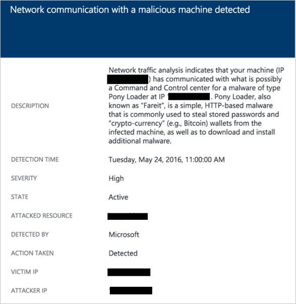

Diese Warnung bietet Informationen, die Sie zum Angeben der Ressource, die diese Angriffen einleiten verwendet wurde, betroffenen Ressource, die Opfer IP-Adresse, die Angreifer IP-Adresse und die Uhrzeit Erkennung ermöglicht.

[AZURE.NOTE] Live IP-Adressen wurden aus diesem Screenshot für private Zweck entfernt.

### Ausgehende DOS Angriffen erkannt

Abweichenden Netzwerkdatenverkehr stammt, von einem virtuellen Computer kann Sicherheitscenter zum Auslösen eines potenziellen-DOS-Typs von Angriffen führen.
 
Dies ist ein Beispiel für diese Art von Benachrichtigung:

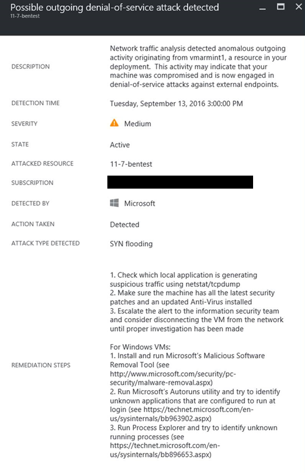

## Ressourcen-Analyse

Sicherheitscenter Ressource liegt der Schwerpunkt PaaS-Dienste, wie etwa die Integration mit [Db Erkennung Azure SQL](../sql-database/sql-database-threat-detection-get-started.md) -Feature. Auf der Grundlage der Analyseergebnisse aus diesen Bereichen, löst Sicherheitscenter eine Ressource verknüpften Warnung aus.

### Mögliche SQL einfügen

Einfügen von SQL ist Angriffen in der bösartiger Code in Zeichenfolgen eingefügt wird, die später zur Analyse und Ausführung in eine Instanz von SQL Server übergeben werden. Jede Prozedur, die SQL-Anweisungen erstellt sollte für Injektionssicherheitsrisiken überprüft werden, da SQL Server alle Syntax gültige Abfragen ausgeführt wird, die sie erhält. SQL Erkennung wird maschinellen Schulung, Verhaltensanalyse und Normalbetriebswerte verdächtige Ereignisse zu bestimmen, die in Ihrem SQL Azure-Datenbanken stattfinden werden möglicherweise verwendet. Beispiel:

- Datenbank der Zugriffsversuch nach einem früheren Mitarbeiter 
- SQL-Injektionsangriffe 
- Ungewöhnliche Zugriff auf Herstellung Datenbank von einem Benutzer zu Hause

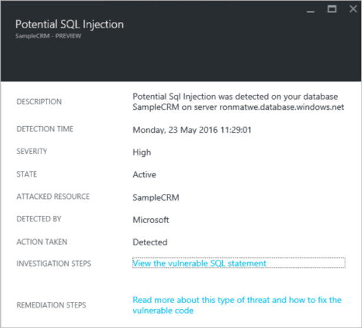

Diese Warnung haben Informationen, die Sie die betroffenen Ressource, die Uhrzeit der Zustand des der Angriffen Erkennung erkennen kann, und es enthält auch einen Link zu weiteren gerichtliche Schritte.

### Sicherheitsrisiko für SQL einfügen

Diese Warnung wird ausgelöst, wenn ein Anwendungsfehler auf eine Datenbank erkannt wurde was ein mögliches Sicherheitsrisiko zu Injektionsangriffe hinweisen kann.

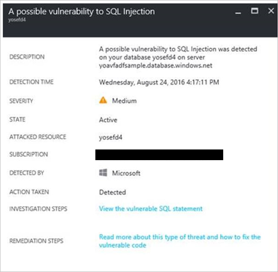

### Ungewöhnliche Zugriff von unbekannten Standort aus

Diese Warnung wird ausgelöst, wenn ein Zugriff mit einer unbekannten IP-Adresse auf dem Server, gefunden wurde, die in der letzten Periode nicht erkannt wurde.

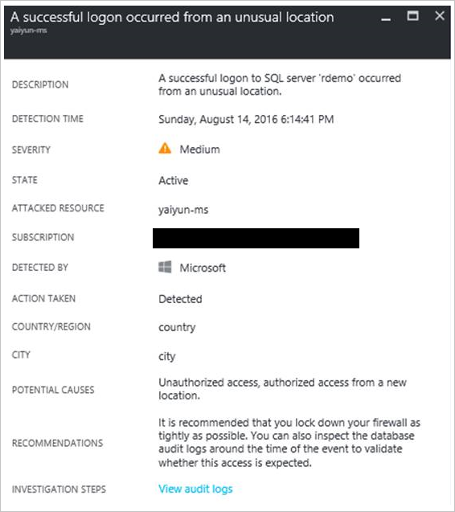

## Siehe auch

In diesem Dokument werden die verschiedenen Typen von Sicherheitswarnungen im Sicherheitscenter gelernt. Weitere Informationen zum Sicherheitscenter, probieren Sie Folgendes ein:

- [Behandeln von Sicherheitsvorfall in Azure-Sicherheitscenter](security-center-incident.md)
- [Azure-Sicherheitscenter Erkennung-Funktionen](security-center-detection-capabilities.md)
- [Planen von Azure-Sicherheitscenter und Operations Guide](security-center-planning-and-operations-guide.md)
- [Häufig gestellte Fragen zur Azure Security Center](security-center-faq.md) – häufig gestellte Fragen zur Verwendung des Dienstes suchen.
- [Azure Security Blog](http://blogs.msdn.com/b/azuresecurity/) – Blogbeiträge zur Azure Sicherheit und Einhaltung von Vorschriften zu finden.
