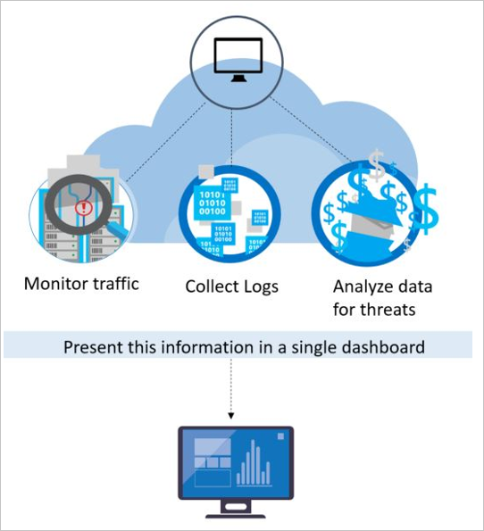

<properties
   pageTitle="Erkennungsfunktionen in Azure-Sicherheitscenter | Microsoft Azure"
   description="Dieses Dokument hilft Ihnen zu verstehen, wie Azure-Sicherheitscenter Erkennungsfunktionen funktionieren."
   services="security-center"
   documentationCenter="na"
   authors="YuriDio"
   manager="swadhwa"
   editor=""/>

<tags
   ms.service="security-center"
   ms.topic="hero-article"
   ms.devlang="na"
   ms.tgt_pltfrm="na"
   ms.workload="na"
   ms.date="09/22/2016"
   ms.author="yurid"/>

# Azure-Sicherheitscenter Erkennung-Funktionen
Dieses Dokument beschreibt Azure-Sicherheitscenter Erweiterte Erkennung-Funktionen, die hilft aktive Risiken verwendet Microsoft Azure Ressourcen zu identifizieren und bietet Ihnen die Einsichten schnell reagiert erforderlich.

> [AZURE.NOTE] Erweiterte Erkennung stehen in der Standardansicht in der Azure-Sicherheitscenter. Kostenlose Testversion 90 Tage steht. Sie können von der Preise in die Auswahl in die [Sicherheitsrichtlinie](security-center-policies.md)aktualisieren. Finden Sie auf [Sicherheitscenter Seite](https://azure.microsoft.com/pricing/details/security-center/) , um weitere Informationen zur Preisgestaltung. 

## Reagieren auf heutige Viren
Es wurden wesentlichen Änderungen in der Bedrohungslage den letzten 20 Jahren. In der Vergangenheit hatten Unternehmen normalerweise nur über die Verunstaltung von Websites von einzelnen Angreifern Gedanken machen, die hauptsächlich interessiert "konnte Anzeige was sie tun" wurden. Heutigen Angreifer sind viel mehr ausgefeilte und angeordnet. Oft haben Sie bestimmte Finanz- und strategische Ziele. Sie können zudem weitere Ressourcen zur Verfügung, die sie, wie diese Staaten oder Internetkriminalität finanziert werden können.

Dieser Ansatz hat zu einer Kundenproduktivität Professionalität in der Rangfolge Angreifer geführt. Sie sind nicht mehr im Web Verunstaltung interessiert. Sie sind jetzt Diebstahl von Informationen, finanzielle Konten und privaten Daten – alle diese können Cashflow auf dem Markt generieren oder Nutzung einer bestimmten Business, die Position des politischen oder folgendem interessiert. Noch mehr betreffend als diese Angreifer mit einem financial Ziel die Angreifer, die Netzwerke sind, Schaden für Infrastruktur und Personen zu beeinträchtigen.

Als Antwort bereitstellen Organisationen häufig verschiedene Punkt-Lösungen, Schutz der Enterprise-Shape oder Endpunkte durch bekannter wonach konzentrieren. Um eine große Anzahl von niedrig Genauigkeit Benachrichtigungen zu generieren, die erfordern eine Sicherheit Analysten zu Sichten und Untersuchen der Regel folgenden Lösungsvorschlägen. Die meisten Organisationen verfügen nicht über Datum und reagieren auf diese Benachrichtigungen – erforderliche Fachwissen, so viele unaddressed wechseln.  In der Zwischenzeit haben Angreifern deren Methoden zum viele Signatur-basierten Schutzmechanismen und [Anpassung an Cloud-Umgebungen](https://azure.microsoft.com/blog/detecting-threats-with-azure-security-center/)untergraben entwickelt. Neue Ansätze sind weitere schnell neu auftretender Risiken identifizieren und beschleunigen Erkennung und Antwort erforderlich. 

## Wie Azure-Sicherheitscenter erkennt und reagiert auf Risiken

Microsoft-Sicherheitsexperten werden beständig Ausschau für Risiken. Sie haben Zugriff auf einen umfangreichen Satz von aus Microsoft globale Präsenz in der Cloud und lokale gewonnen werden. Diese Wide Eingang und unterschiedlichen Sammlung von Datasets mit der Microsoft über seine lokalen Consumer und Enterprise-Produkte sowie deren Onlinedienste neuen Angriffsmustern und Trends ermitteln. Daher können Sicherheitscenter seine Erkennung Algorithmen schnell aktualisieren, wie Angreifer neue und zunehmend komplexe Angriffen lassen. Dieser Ansatz hilft Ihnen der mit einer schnellen verschieben Bedrohung-Umgebung Schritt halten. 

Sicherheitscenter Erkennung funktioniert, wenn Sie automatisch Sammeln von Informationen zur Sicherheit von Azure Ressourcen, die Netzwerk- und verbundenen partnerlösungen. Er analysiert diese Informationen, die häufig Verknüpfen von Informationen aus mehreren Quellen, um Risiken zu identifizieren. Von Sicherheitshinweisen sind sowie Empfehlungen zum Beheben des Risiko im Sicherheitscenter Priorität zugewiesen.

Sicherheitscenter beschäftigt Analytics für erweiterte Sicherheit, die Signatur-basierten Ansätze weit hinausgehen. Durchbrüche in big Data und [Computer learning](https://azure.microsoft.com/blog/machine-learning-in-azure-security-center/) Technologien werden genutzt, um auszuwerten Ereignisse, über den gesamten Cloud-Struktur – erkennen von Angriffen, die zum Identifizieren der manuellen Ansätze verwenden und die Entwicklung von Angriffen Vorhersage möglich ist. Diese Sicherheit Analytics umfassen: 

- **Integrierte Bedrohungsanalyse**: sucht nach bekannten Bad Akteuren durch Nutzung von Microsoft-Produkten und Diensten, Microsoft digitale Crimes Einheit (Datencacheeinheit), Microsoft Security Antwort Center (MSRC) und externe Feeds globale Bedrohungsanalyse.
- **Analytics Verhalten**: bekannte Muster zum Ermitteln bösartigen Verhaltens gilt. 
- **Normalbetriebswerte**: erstellen ein Basisplans zurückliegenden verwendet statistische Profil erstellen. Klicken Sie auf abweichungen von definierte Basislinien, die eine mögliche Angriffen entsprechen, benachrichtigt.

### Bedrohungsanalyse
Microsoft hat eine umfassende Menge globale Bedrohungsanalyse. Aus mehreren Quellen, wie z. B. Azure, Office 365, Microsoft CRM online, von Microsoft Dynamics, outlook.com, MSN, Microsoft digitale Crimes Einheit (Datencacheeinheit) und Microsoft Security Antwort Center (MSRC) geleitet werden. Forscher erhalten auch Intelligence Informationen, die wichtigsten Cloud-Dienstanbieter gemeinsam verwendet wird und abonniert Threat Intelligence-Feeds von Drittanbietern. Diese Informationen können Azure-Sicherheitscenter Sie Risiken aus bekannten Bad Akteuren benachrichtigen. Einige Beispiele:

- **Ausgehende Kommunikation an eine bösartige IP-Adresse**: ausgehender Datenverkehr auf eine bekannte Botnet oder Darknet wahrscheinlich gibt an, dass Ihre Ressourcen gefährdet und Angreifer sie beim Ausführen dieser Daten System oder Exfiltrate Befehle. Azure-Sicherheitscenter vergleicht den Netzwerkverkehr zum globalen Microsoft Datenbank und benachrichtigt Sie, wenn Geräte-Kommunikation an eine bösartige IP-Adresse.

## Verhalten analytics

Verhalten Analytics ist eine Methode, die analysiert und vergleicht die Daten auf eine Auflistung von bekannten Mustern. Diese Muster sind jedoch nicht einfache Signaturen. Sie werden bestimmt durch komplexe maschinellen learning Algorithmen, die in umfangreichen Datasets angewendet werden. Sie werden auch durch bösartige Verhaltensweisen sorgfältiger Analyse durch Experten Analysten bestimmt. Verhalten Analytics können Azure-Sicherheitscenter um betroffenen Ressourcen basierend auf Analyse der virtuellen Computern Protokolle, virtuelles Netzwerk Gerät Protokolle, Fabric Protokolle, Absturzabbilder und anderen Quellen zu identifizieren. 

Darüber hinaus müssen sich mit anderen zu prüfen, ob Belege von einer weit verbreitet für eine Marketingkampagne entsprechen. Damit diese Beziehung hindert um Ereignisse zu identifizieren, die mit der Kompromisse definierte Indikatoren konsistent sind. Einige Beispiele:

- **Verdächtige verarbeiten Ausführung**: Angreifern einsetzen verschiedene Techniken ohne Erkennung bösartigen Software nicht ausführen. Beispielsweise ein Angreifer möglicherweise verleihen Schadsoftware denselben Namen wie seriösen Systemdateien aber diese Dateien in einem anderen Speicherort zu platzieren, verwenden Sie einen Namen, der eine Datei duldet sehr ähnlich ist oder Maske true Dateierweiterung. Sicherheitscenter Modelle Prozesse Verhaltensweisen und Monitore Vorgehensweise zum Ermitteln von Ausreißern folgenden Ausführungen.  
- **Versucht ausgeblendet Schadsoftware und Nutzung**: anspruchsvolle Malware können entgehen traditionelle Modul Produkte nach nie Schreiben auf einen Datenträger oder Verschlüsseln von Software-Komponenten auf einem Datenträger gespeichert ist.  Jedoch kann solche Malware erkannt werden mit Arbeitsspeicheranalyse, wie die Schadsoftware auf ordnungsgemäße Funktion im Speicher verlassen muss. Wenn Software stürzt ab, zeichnet ein Absturzabbild einen Teil des Speichers zum Zeitpunkt der Absturz auf.  Durch die Analyse des Speichers in das Absturzspeicherabbild, können Azure Sicherheitscenter erkennen Techniken, mit denen nutzen Schwachstellen in der Software, vertrauliche Daten zugreifen und heimliche beibehalten mit-in einem betroffenen Computer beeinträchtigt die Leistung des Computers.
- **Lateral Bewegung und internen Eindringung**: behalten Sie in einer betroffenen Netzwerk und suchen/Ernte wertvolle Angreifern häufig versuchen, seitlich aus dem betroffenen Computer an andere Personen innerhalb des gleichen Netzwerks zu verschieben. Sicherheitscenter überwacht Prozess, und melden Sie sich Aktivitäten und Versuche, Erweitern eines Angreifers Fuß innerhalb der Netzwerk, wie z. B. remote-Befehl Ausführung Netzwerk Überprüfung, und das Konto Enumeration ermitteln.
- **Bösartige PowerShell Skripts**: PowerShell wird von Angreifern verwendet, um auf die Ziel-virtuellen Computern für verschiedene Zwecke bösartigen Code ausgeführt werden. Sicherheitscenter untersucht PowerShell Aktivität nach Hinweisen auf verdächtige Aktivitäten. 
- **Ausgehende Angriffen**: häufig Angreifer Cloudressourcen mit dem Ziel mithilfe dieser Ressourcen zum Bereitstellen von weiterer Angriffen. Betroffenen virtuellen Computern kann beispielsweise Hackerangriffen zu mit anderen virtuellen Computern starten, SPAM senden oder Scannen geöffnete Ports und andere Geräte im Internet verwendet werden. Learning Computer auf Netzwerkverkehr anwenden, können Sicherheitscenter erkennen, wenn ausgehende Netzwerk Kommunikation Standard überschreiten. Im Falle von SPAM, Sicherheitscenter auch ungewöhnliche e-Mail-Verkehr mit abgeglichen Intelligence von Office 365, um festzustellen, ob die e-Mail-Nachrichten wahrscheinlich wird schädliche oder das Ergebnis einer seriösen e-Mail für eine Marketingkampagne.  

### Erkennen von Netzwerkanomalien

Azure-Sicherheitscenter verwendet auch Normalbetriebswerte Risiken identifizieren müssen. Im Gegensatz zu anderen Verhalten Analytics (die bekannten Mustern abgeleitet von großen Datasets abhängt), Normalbetriebswerte "ist mehr personalisierte" und liegt der Schwerpunkt auf Basisplänen, die für die Bereitstellung Ihrer spezifisch sind. Maschinelle Learning normale Aktivitäten für die Bereitstellung Ihrer Ermittlung angewendet, und dann Regeln um Ausreißer Konditionen, die ein Sicherheitsereignis darstellen konnte generiert werden. Hier ist ein Beispiel:

- **Eingehende RDP/SSH brute-force-Angriffen**: Bereitstellung Ihrer möglicherweise beschäftigt virtuellen Computern mit zahlreiche Benutzernamen jeden Tag und anderen virtuellen Computern, die nur wenige aufweisen oder einem Benutzernamen. Azure-Sicherheitscenter können Sie bestimmen geplante Loginaktivität für diesen virtuellen Computern und lernen, wie Sie festlegen, was außerhalb normaler Loginaktivität Computer verwenden. Wenn die Anzahl der Benutzernamen oder die Uhrzeit des Arbeitstags die Benutzernamen oder die Position, aus der die Benutzernamen angefordert werden, oder andere Merkmale Login-bezogene unterscheidet sich deutlich von den Basisplan sind, möglicherweise eine Warnung generiert. Erneut bestimmt maschinellen Learning was relevant ist.

## Fortlaufender Threat Intelligence Überwachung

Azure-Sicherheitscenter arbeitet Sicherheit Recherchieren und Daten Wissenschaft Teams, die sich die Bedrohungslage ständig zu überwachen. Dies umfasst die folgenden Initiativen:

- **Threat Intelligence Überwachung**: Threat Intelligence umfasst Verfahren, Indikatoren, Auswirkungen und einige Ratschläge zu vorhandenen oder neu entstehenden Risiken. Diese Informationen werden in der Sicherheits-Community freigegeben und Microsoft überwacht ständig Threat Intelligence Feeds von internen und externen Quellen.
- **Freigeben von Signal**: Einsichten von Sicherheitsteams über umfangreichen Portfolio Microsoft Cloud und lokale Services, Client und Server-Endpunkt Geräte freigegeben und analysiert werden. 
- **Microsoft-Sicherheitsspezialisten**: laufenden Engagement mit Teams über Microsoft, funktionieren in spezielle Sicherheit mit Feldern wie Analysen und web von Angriffen.
- **Optimieren von Erkennung**: Algorithmen sind für Kunden Datasets ausführen und Sicherheitsexperten arbeiten mit Kunden, um die Ergebnisse zu überprüfen. WAHR und falsch Positives dienen zur maschinellen Learning Algorithmen optimieren.

In diesem Zusammenhang kombinierte enden, in die neue und verbesserte Erkennung Sie sofort von profitieren können – es ist keine Aktion für Sie ausführen.

## Siehe auch
In diesem Dokument haben Sie gelernt, wie auf Sicherheitscenter Azure Erkennung Funktionen arbeiten. Weitere Informationen zum Sicherheitscenter, probieren Sie Folgendes ein:

- [Planen von Azure-Sicherheitscenter und Operations Guide](security-center-planning-and-operations-guide.md)
- [Verwalten und Beantworten von Sicherheitshinweisen in Azure-Sicherheitscenter](security-center-managing-and-responding-alerts.md)
- [Von Sicherheitshinweisen nach Typ in Sicherheitscenter Azure](security-center-alerts-type.md)
- [Sicherheit Dienststatus überwachen im Sicherheitscenter Azure](security-center-monitoring.md) – erfahren, wie Sie die Integrität des Azure Ressourcen zu überwachen.
- [Überwachen von partnerlösungen mit Azure-Sicherheitscenter](security-center-partner-solutions.md) – erfahren, wie Sie den Status des Ihrer partnerlösungen zu überwachen.
- [Häufig gestellte Fragen zur Azure Security Center](security-center-faq.md) – häufig gestellte Fragen zur Verwendung des Dienstes suchen.
- [Azure Security Blog](http://blogs.msdn.com/b/azuresecurity/) – Blogbeiträge zur Azure Sicherheit und Einhaltung von Vorschriften zu finden.
