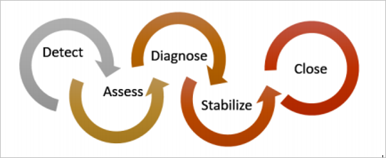

<properties
   pageTitle="Mithilfe von Azure-Sicherheitscenter für Reaktion auf einen Vorfall | Microsoft Azure"
   description="Dieses Dokument wird erläutert, wie Azure-Sicherheitscenter für ein Vorfall Antwort Szenario verwendet wird."
   services="security-center"
   documentationCenter="na"
   authors="YuriDio"
   manager="swadhwa"
   editor=""/>

<tags
   ms.service="security-center"
   ms.topic="hero-article"
   ms.devlang="na"
   ms.tgt_pltfrm="na"
   ms.workload="na"
   ms.date="09/20/2016"
   ms.author="yurid"/>

# Mithilfe von Azure-Sicherheitscenter für Reaktion auf einen Vorfall
Viele Organisationen erfahren Sie, wie auf Sicherheitsvorfälle reagiert erst nach einer Angriffen mit. Klicken Sie zum Verringern Kosten und Schäden ist es wichtig, dass Reaktion auf einen Vorfall direkte planen, bevor Angriffen stattfindet. Sie können in verschiedenen Stufen der Reaktion auf einen Vorfall Sicherheitscenter Azure verwenden.

## Planen der Vorfall Antwort

Ein effektiver Plan abhängig von drei Hauptfunktionen: schützen können sondern, erkennen und Beantworten von Risiken. Schutz ist zu verhindern Fälle, Erkennung ist zu früh Identifizieren von Risiken und Antwort zu den Angreifer entfernen und Wiederherstellen von Systeme, um die Nachteile einer Verletzung zu verringern.

In diesem Artikel werden die Sicherheit Reaktion Phasen aus dem [Microsoft Azure Sicherheitsantwort in der Cloud](https://gallery.technet.microsoft.com/Azure-Security-Response-in-dd18c678) -Artikel verwenden, wie in der folgenden Abbildung dargestellt:

Sie können während der Phasen erkennen, bewerten und Konfigurationsprobleme Sicherheitscenter verwenden. Hier finden Beispiele für wie Sicherheitscenter während der drei Phasen erste Vorfall Antwort können nützlich sein:

- **Erkennen**: Überprüfen Sie die erste Angabe des Untersuchungen Ereignis.
    - Beispiel: Überprüfen der anfänglichen Überprüfung, dass eine Warnung hoher Priorität im Sicherheitscenter Dashboard ausgelöst wurde.
- **Bewerten**: Ausführen die erste Beurteilung, um weitere Informationen zu den verdächtige Aktivitäten zu erhalten.
    - Beispiel: Weitere Informationen zu den Sicherheitshinweis zu erhalten.
- **Konfigurationsprobleme**: durchführen eine technische Untersuchung und Eingrenzung, Reduzierung und dieses Problem zu umgehen Strategien zu identifizieren.
    - Beispiel: Gehen Sie Behebung vom Sicherheitscenter in dieser bestimmten Sicherheitshinweis beschrieben.

Das Szenario, das folgt wird gezeigt, wie Sicherheitscenter während der Phasen erkennen, bewerten und Konfigurationsprobleme/Antworten ein Sicherheitsvorfall zu nutzen. Im Sicherheitscenter ist ein [Sicherheitsvorfall](security-center-incident.md) eine Aggregation alle Benachrichtigungen für eine Ressource, die mit Mustern [Abbrechen Kette](https://blogs.technet.microsoft.com/office365security/addressing-your-cxos-top-five-cloud-security-concerns/) ausrichten. Fälle werden in der Kachel [von Sicherheitshinweisen](security-center-managing-and-responding-alerts.md) und Blade. Ein Vorfall werden die Liste der zugehörigen Benachrichtigungen, die womit Sie erhalten weitere Informationen zu jedem auftreten kann. Sicherheitscenter bietet auch eigenständigen von Sicherheitshinweisen, die auch verwendet werden können, um eine verdächtige Aktivitäten aufzufinden.

## Szenario

Contoso migriert zuletzt einige ihrer lokalen Ressourcen in Azure, einschließlich einiger virtuellen Computern-basierten Branchen Auslastung und SQL-Datenbanken. Zurzeit verfügt Contoso Core Computer Sicherheit Vorfall Antwort Team (CSIRT) ein Problem Untersuchung läuft Sicherheitsproblemen aufgrund von Sicherheit Intelligence nicht in ihre aktuelle Reaktion Tools integriert werden. Diese fehlende Integration führt zu einem Problem in welcher Phase erkennen (zu viele falsche positive) und während der Phasen bewerten und Konfigurationsprobleme. Im Rahmen der Migration entschieden Sie sich für das Sicherheitscenter helfen sie dieses Problem zu lösen zu abonnieren.

Die erste Phase der Migration abgeschlossen werden, nachdem er Onboarded alle Ressourcen und alle empfohlenen Sicherheit von Sicherheitscenter berücksichtigt. Contoso CSIRT ist zentraler Punkt für den Umgang mit Sicherheitsvorfällen Computer an. Das Team besteht aus einer Gruppe von Personen, für den Umgang mit einem beliebigen Sicherheitsvorfall. Die Teammitglieder haben eindeutig definierte Aufgaben, um sicherzustellen, dass keine Bereich der Antwort offen steht ungedeckt.

Im Rahmen dieses Szenarios wird in den Fokus auf den folgenden Rollen Rollen gezeigt, die Contoso CSIRT gehören:

Nina befindet sich Sicherheitsvorgänge. Zu ihren Aufgaben zählen:

- Für die Überwachung und Sicherheitsrisiken rund um die Uhr beantworten.
- Zu der Cloud Arbeitsbelastung Besitzer oder Sicherheit Analysten Bedarf ausgeweitet wurde.

SAM ist eine Sicherheit Analysten und seine Zuständigkeiten einbeziehen:

- Untersuchen von Angriffen.
- Beseitigen Benachrichtigungen.
- Arbeiten mit Arbeitsbelastung Besitzer ermitteln und Problembehebungen anwenden.

Wie Sie sehen können, Nina und Sam haben andere Aufgaben und gemeinsam Freigabe von Informationen für das Sicherheitscenter arbeiten müssen.

## Empfohlene Lösung

Da Nina und Sam unterschiedliche Rollen haben, werden diese verschiedene Bereichen Sicherheitscenter verwenden, um relevante Informationen zu ihrer täglichen Aktivitäten zu erhalten. Nina wird **von Sicherheitshinweisen** als Teil ihrer täglichen Überwachung verwendet werden.

Nina wird von Sicherheitshinweisen während der Phasen erkennen und bewerten verwendet. Nach Beendigung die erste Beurteilung Nina möglicherweise Anna das Problem mit Sam heraufstufen, wenn Sie weitere Untersuchung erforderlich ist. Sam wird zu diesem Zeitpunkt die Informationen verwendet, die vom Sicherheitscenter, manchmal in Verbindung mit anderen Datenquellen, um in der Phase Konfigurationsprobleme zu verschieben, bereitgestellt wurde.

## Wie diese Lösung implementiert wird.

Um anzuzeigen, wie Sie in einem Szenario Reaktion Sicherheitscenter Azure verwenden möchten, wir Ninas Schritten in der Phasen erkennen und bewerten, und klicken Sie dann finden Sie unter Funktionsweise von Sam, um das Problem zu diagnostizieren.

### Erkennen Sie und bewerten Sie Reaktion Phasen

Nina Azure-Portal angemeldet und in der Verwaltungskonsole Sicherheitscenter funktioniert. Als Teil ihrer täglich Überwachen der Aktivitäten Schritte Anna hoher Priorität von Sicherheitshinweisen überprüfen, indem Sie die folgenden Schritte ausführen:

1. Klicken Sie auf die Kachel **von Sicherheitshinweisen** und zugreifen Sie das Blade **von Sicherheitshinweisen** .
    

    > [AZURE.NOTE] Im Rahmen dieses Szenarios soll Nina eine Bewertung für die Aktivität Benachrichtigung bösartiger SQL ausführen wie in der vorherigen Abbildung zu sehen.
2. Klicken Sie auf die **Aktivität bösartiger SQL** -Benachrichtigung, und überprüfen Sie die betroffenen Ressourcen in das Blade **bösartiger SQL Aktivität** :  

    In diesem Blade Nina kann Notizen über die betroffenen Ressourcen, wie oft diese Angriffen passiert ist, und wenn es erkannt wurde.
3. Klicken Sie auf die **Ressource angegriffen** um weitere Informationen zu diesen Angriffen zu erhalten.

Nach dem Lesen der Beschreibung, ist Nina überzeugt, dass dies nicht falsch positiv ist und Anna diesem Fall zu Sam heraufstufen sollten.

### Diagnostizieren Reaktion Phase

SAM der Groß-/Kleinschreibung von Nina empfängt und gestartet wird, überprüfen die Schritte zur Wiederherstellung, die Sicherheitscenter vorgeschlagen.

### Zusätzliche Ressourcen

Mitglied des Teams kann auch das Durchblättern von verschiedenen Arten von Berichten finden Sie unter [Sicherheit Center Power BI](security-center-powerbi.md) nutzen. Diese Berichte können dabei unterstützen sollen, während weitere Untersuchung zu visualisieren, analysieren und Filtern Sie Empfehlungen und Sicherheitswarnungen. Unternehmen, deren Informationen zu Sicherheit und Ereignis Management (SIEM) Lösung während der Untersuchung zu nutzen, können sie auch [Sicherheitscenter mit ihrer Lösung integrieren](security-center-integrating-alerts-with-log-integration.md). Sie können auch Azure Überwachungsprotokolle und virtuellen Computern (virtueller Computer) Sicherheitsereignisse mithilfe des [Azure Log Integrationstool](https://blogs.msdn.microsoft.com/azuresecurity/2016/07/21/microsoft-azure-log-integration-preview/)integrieren. Angriffen aus, um können Sie diese Informationen in Verbindung mit den Informationen, die das Sicherheitscenter bereitstellt.

## Abschluss

Zusammenstellen eines Teams an, bevor ein Vorfall stattfindet, ist für Ihre Organisation äußerst wichtig und wird positiv beeinflussen, wie Fälle verarbeitet werden. Die richtigen Tools zum Überwachen Ressourcen können dieses Team zur Behebung eines Sicherheitsvorfalls genau Schritte unterstützen. Sicherheitscenter [Erkennungsfunktionen](security-center-detection-capabilities.md) unterstützen können IT schnell reagieren auf Sicherheitsvorfälle und Beheben von Sicherheitsproblemen,.
