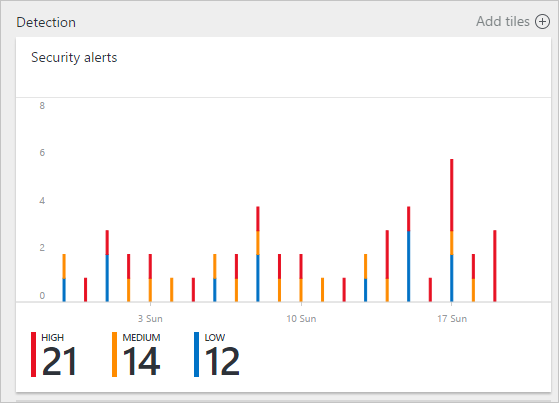
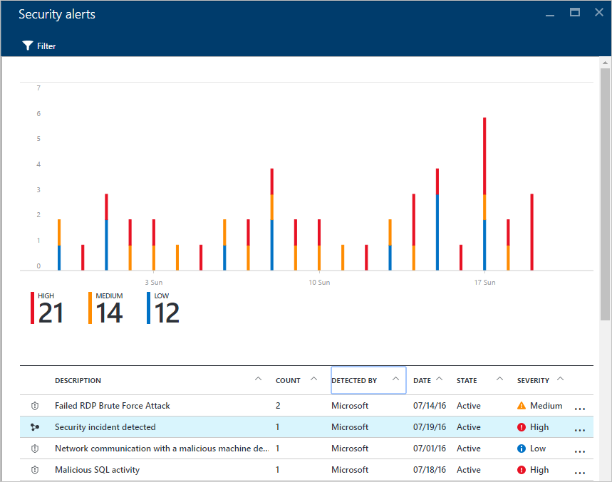
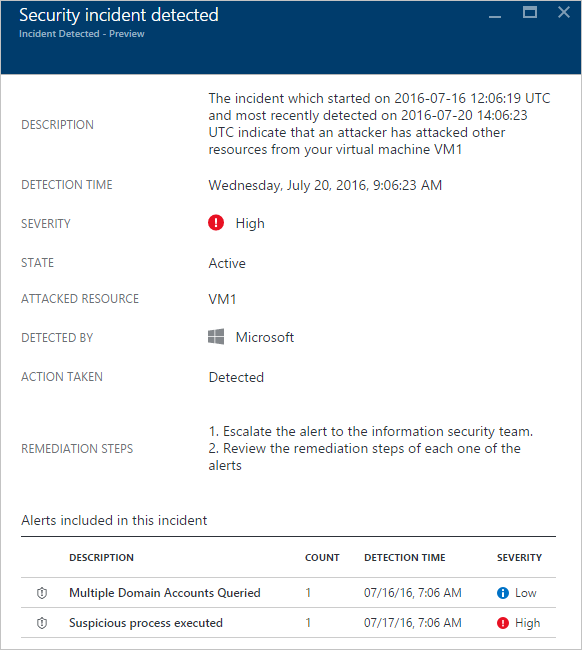
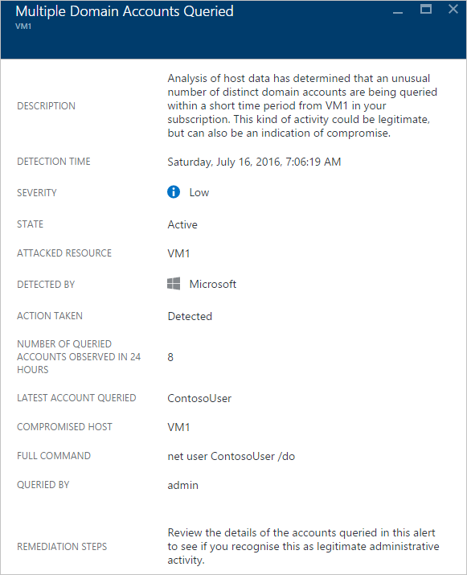

<properties
   pageTitle="Behandeln von Sicherheitsvorfall in Azure-Sicherheitscenter | Microsoft Azure"
   description="Dieses Dokument hilft Ihnen, Sicherheitscenter Azure-Funktionen, die nicht mit um Sicherheitsvorfälle zu behandeln."
   services="security-center"
   documentationCenter="na"
   authors="YuriDio"
   manager="swadhwa"
   editor=""/>

<tags
   ms.service="security-center"
   ms.topic="hero-article"
   ms.devlang="na"
   ms.tgt_pltfrm="na"
   ms.workload="na"
   ms.date="10/18/2016"
   ms.author="yurid"/>

# Behandeln von Sicherheitsvorfall in Azure-Sicherheitscenter 
Selektierung und Untersuchen von Sicherheitshinweisen können sehr lange dauern für auch die am häufigsten erfahrenen Sicherheitsanalysten und für viele wird es schwierig, auch wissen, wo beginnen soll. Mithilfe der [Analytics](security-center-detection-capabilities.md) Verbindung die Informationen zwischen den unterschiedlichen [von Sicherheitshinweisen](security-center-managing-and-responding-alerts.md)Sicherheitscenter können Sie mit einer Einzelansicht von einer Campaign Angriffen und der zugehörigen Benachrichtigungen für alle bieten – Sie können schnell wissen, welche Aktionen der Angreifer erstellen und welche Ressourcen beeinträchtigt wurden.

Dieses Dokument beschreibt die Verwendung von Sicherheit benachrichtigen Videofunktionen Sicherheitscenter zur Unterstützung bei der Behandlung von Sicherheitsvorfällen.

## Was ist ein Sicherheitsvorfall?

Im Sicherheitscenter ist ein Sicherheitsvorfall eine Aggregation alle Benachrichtigungen für eine Ressource, die mit Mustern [Abbrechen Kette](https://blogs.technet.microsoft.com/office365security/addressing-your-cxos-top-five-cloud-security-concerns/) ausrichten. Fälle werden in der Kachel [Von Sicherheitshinweisen](security-center-managing-and-responding-alerts.md) und Blade. Ein Vorfall informiert, die Liste der zugehörigen Benachrichtigungen, die womit Sie erhalten weitere Informationen zu jedem auftreten können.

## Verwalten von Sicherheitsvorfälle

Ihrer aktuellen Sicherheitsvorfälle können Sie überprüfen, indem Sie die Kachel der Sicherheit Benachrichtigungen. Zugriff auf das Portal Azure, und folgen Sie den Schritten unten, um weitere Details für jeden Sicherheitsvorfall finden Sie unter:

1. Die Kachel **von Sicherheitshinweisen** auf dem Dashboard Sicherheitscenter wird angezeigt.

    

2.  Klicken Sie auf diese Kachel zu erweitern und ein Sicherheitsvorfall erkannt wird, wird es unter Sicherheit Benachrichtigungen Diagramm wie folgt angezeigt:

    

3.  Beachten Sie, dass die Sicherheit Vorfall Beschreibung ein anderes Symbol im Vergleich zu anderen Benachrichtigungen hat. Klicken Sie darauf, um weitere Details zu diesen Vorfall anzeigen.

    

4.  Klicken Sie auf den **Vorfall** Blade Sie weitere sehen details zu diesen Sicherheitsvorfall, wozu auch die vollständige Beschreibung, deren schwere (die in diesem Fall hoch ist), aktuellen Zustand (in diesem Fall ist immer noch *aktiv*, d. h., der Benutzer eine Aktion vorgenommen noch nicht *zu schließen* sie - dies kann, indem Sie mit der rechten Maustaste auf den Vorfall in das Blade **von Sicherheitshinweisen** ) , die betroffenen Ressource (in diesem Fall *VM1*), die Behebung Schritte für den Vorfall und im unteren Bereich haben Sie die Benachrichtigungen, die in diesen Vorfall enthalten waren. Wenn Sie weitere Informationen zu jeder Benachrichtigung erhalten möchten, wird nur auf erkannt und ein anderes Blade geöffnet, wie unten dargestellt:

    

Die Informationen in diesem Blade variieren gemäß der Benachrichtigung. Lesen Sie für Weitere Informationen zum Verwalten von dieser Benachrichtigungen [Verwaltung und Beantworten von Sicherheitshinweisen im Sicherheitscenter Azure](security-center-managing-and-responding-alerts.md) . Einige wichtige Hinweise zu dieser Funktion werden soll:

- Ein neuer Filter können Sie die Ansicht, nur Vorfall oder nur Benachrichtigungen anpassen. 
- Im Rahmen der ein Vorfall (falls zutreffend) und als eine Benachrichtigung eigenständigen sichtbar sein kann dieselbe Warnung vorhanden. 
- Einen Vorfall geleitet wird nicht die zugehörigen Benachrichtigungen beenden.

## Siehe auch

In diesem Dokument gelernt Sie die Sicherheit Vorfall-Funktion im Sicherheitscenter verwendet werden kann. Weitere Informationen zum Sicherheitscenter, probieren Sie Folgendes ein:

- [Verwalten und Beantworten von Sicherheitshinweisen in Azure-Sicherheitscenter](security-center-managing-and-responding-alerts.md)
- [Azure-Sicherheitscenter Erkennung-Funktionen](security-center-detection-capabilities.md)
- [Planen von Azure-Sicherheitscenter und Operations Guide](security-center-planning-and-operations-guide.md)
- [Verwalten und Beantworten von Sicherheitshinweisen in Azure-Sicherheitscenter](security-center-managing-and-responding-alerts.md)
- [Häufig gestellte Fragen zur Azure Security Center](security-center-faq.md)– suchen häufig gestellte Fragen zur Verwendung des Dienstes.
- [Azure Security Blog](http://blogs.msdn.com/b/azuresecurity/)– Blog suchen Beiträge zu Azure Sicherheit und Kompatibilität.
