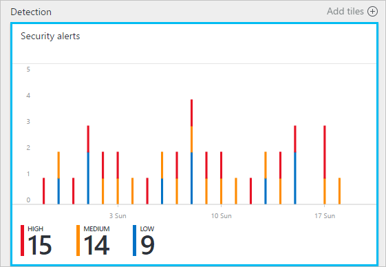
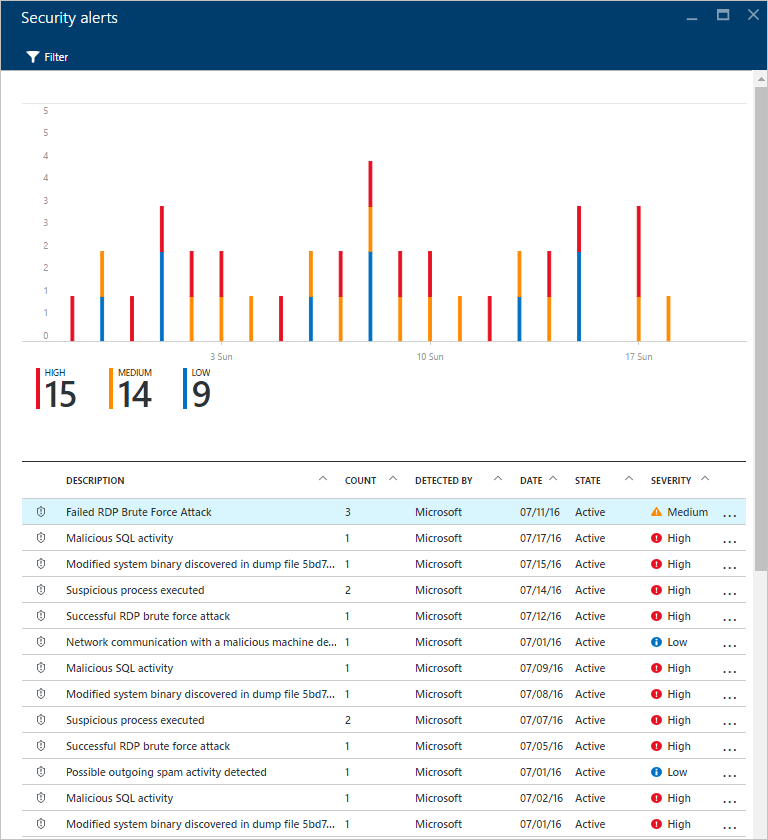
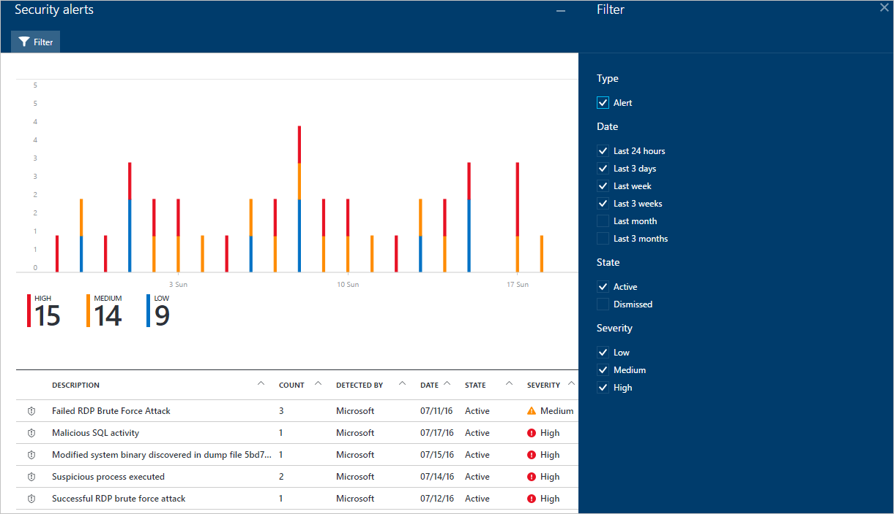
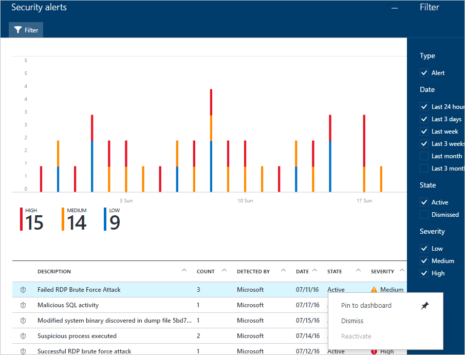
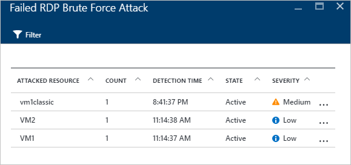
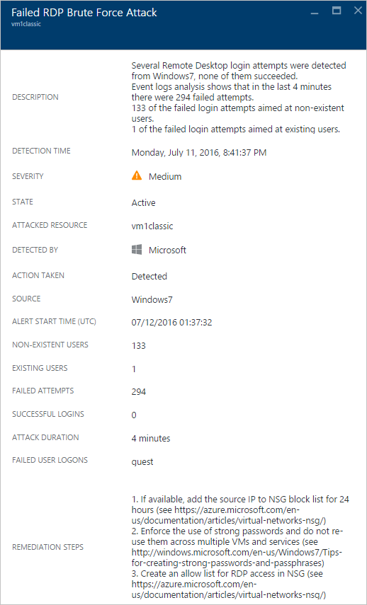

<properties
   pageTitle="Verwalten und Beantworten von Sicherheitshinweisen im Sicherheitscenter Azure | Microsoft Azure"
   description="Dieses Dokument hilft Ihnen, Azure-Sicherheitscenter Funktionen zum Verwalten und Beantworten von Sicherheitshinweisen verwenden."
   services="security-center"
   documentationCenter="na"
   authors="YuriDio"
   manager="swadhwa"
   editor=""/>

<tags
   ms.service="security-center"
   ms.topic="hero-article"
   ms.devlang="na"
   ms.tgt_pltfrm="na"
   ms.workload="na"
   ms.date="10/17/2016"
   ms.author="yurid"/>

# Verwalten und Beantworten von Sicherheitshinweisen in Azure-Sicherheitscenter
Dieses Dokument hilft Ihnen Azure-Sicherheitscenter zum Verwalten und Beantworten von Sicherheitshinweisen.

> [AZURE.NOTE] Aktualisieren Sie auf Azure Security Center Standard, um erweiterte Erkennung zu aktivieren. Kostenlose Testversion 90 Tage steht. Upgrade, wählen Sie in der [Sicherheitsrichtlinie](security-center-policies.md)Preise in aus. Weitere Informationen finden Sie in der [Azure-Sicherheitscenter Preise](security-center-pricing.md) .

## Was sind Sicherheitswarnungen?
Sicherheitscenter automatisch erfasst, analysiert und Integration von Log-Daten aus Azure Ressourcen, die Netzwerk- und verbundene partnerlösungen, wie Firewall und Endpunkt Schutz Lösungen reale Risiken erkennen und falsche positive zu verringern. Eine Liste der Priorität von Sicherheitshinweisen wird im Sicherheitscenter zusammen mit den Informationen angezeigt, Sie das Problem und Vorschläge zur Behebung Angriffen wie schnell zu ermitteln müssen. Azure-Sicherheitscenter aggregiert auch Benachrichtigungen, die zum Abbrechen der Kette Mustern in [Fälle](security-center-incident.md)ausrichten. 

> [AZURE.NOTE] Weitere Informationen dazu, wie das Sicherheitscenter Erkennungsfunktionen arbeiten zu können, finden Sie unter [Azure Security Center Erkennungsfunktionen](security-center-detection-capabilities.md).

## Verwalten von Sicherheitshinweisen

Die aktuellen Benachrichtigungen können Sie überprüfen, indem Sie die Kachel **von Sicherheitshinweisen** . Öffnen Sie Azure-Portal zu, und folgen Sie den Schritten unten, um weitere Details zu jeder Benachrichtigung anzuzeigen:

1. Die Kachel **von Sicherheitshinweisen** auf dem Dashboard Sicherheitscenter wird angezeigt.

    

2.  Klicken Sie auf die Kachel, um das Blade **Sicherheitswarnungen** zu öffnen, das weitere Details zu der Benachrichtigungen wie unten dargestellt enthält.

    

In den unteren Teil dieses Blade sind die Details für jede Warnung. Wenn Sie sortieren möchten, klicken Sie auf die Spalte, der Sie sortieren möchten. Die Definition für jede Spalte wird unten angezeigt:

- **Warnung**: eine kurze Erläuterung der Warnung.
- **Zählen**: eine Liste aller Benachrichtigungen dieses bestimmten Typs, die an einem bestimmten Tag erkannt wurden.
- **Erkannt nach**: der Dienst, der für das Auslösen der Warnung zuständig ist.
- **Datum**: der Termin, an dem das Ereignis aufgetreten ist.
- **Bundesstaat**: den aktuellen Status für die Benachrichtigung. Es gibt zwei Arten von Zustände:
    - **Aktive**: Sicherheitshinweis erkannt wurde.
    - **Dismissed**: vom Benutzer Sicherheitshinweis verworfen wurde. Dieser Status wird in der Regel für Benachrichtigungen verwendet, die jedoch entweder minimierte oder gefunden nicht zu einem tatsächlichen Angriffen untersucht wurde haben.

- **Schwere**: der Schwere Ebene hoch, Mittel oder Niedrig werden kann.

### Filtern von Benachrichtigungen

Sie können Benachrichtigungen basierend auf Datum, Status und schwere filtern. Filtern Benachrichtigungen hilfreich für Szenarios, in denen Sie einzugrenzen Sicherheit Benachrichtigungen anzeigen müssen. Angenommen, Sie können Sie von Sicherheitshinweisen Adresse, die in den letzten 24 Stunden aufgetreten sind, da Sie eine mögliche Verletzung im System untersuchen möchten.

1. Klicken Sie auf das Blade **Von Sicherheitshinweisen** auf **Filter** . Das **Filters** Blade wird geöffnet, und Sie wählen Sie das Datum, Status und schwere Werte, die Sie anzeigen möchten.

    

2.  Nach der Untersuchung einer Warnung, kann es passieren, dass er falsch für Ihre Umgebung positiv oder zeigt die erwarteten Verhaltens für eine bestimmte Ressource an. Was kann der Fall sein, wenn Sie feststellen, dass eine Warnung ist nicht anwendbar, können Sie die Benachrichtigung deaktivieren und Filtern sie dann aus der Ansicht. Es gibt zwei Möglichkeiten, um eine Warnung zu schließen. Klicken Sie mit der rechten Maustaste auf eine Benachrichtigung wählen Sie **Schließen** oder Hover aus, auf das Element zeigen, klicken Sie auf die drei Punkte, die auf der rechten Seite angezeigt werden, und wählen Sie **Schließen**aus. Sie können ausgeblendete von Sicherheitshinweisen anzeigen, indem Sie auf **Filter** und **Dismissed**.

    

### Beantworten von Sicherheitshinweisen

Wählen Sie eine sicherheitswarnung Weitere Informationen dazu die Ereignisse, die ausgelöst die Benachrichtigung und wurde, wenn vorhanden, Schritte Sie durchführen, um Angriffen zu beheben müssen. Von Sicherheitshinweisen sind nach Typ und Datum gruppiert. Auf einem Sicherheitshinweis wird eine Blade mit einer Liste der gruppierten Warnungen geöffnet.

In diesem Fall finden Sie die Benachrichtigungen, die ausgelöst wurden verdächtige (Remotedesktopprotokoll) Aktivitäten. Die erste Spalte zeigt an, welche Ressourcen angegriffen wurden; die zweite zeigt an, wie oft die Ressource ausgesetzt; die dritte zeigt die Anzeigedauer der Angriffen; die vierte zeigt Status der Warnung; und fünften zeigt die Schwere der die Angriffen. Überprüfen Sie diese Informationen ein, klicken Sie auf die Ressource, die war und ein neuer Blade wird geöffnet.

In das Feld **Beschreibung** des diese Blade finden Sie weitere Details zu diesem Ereignis. Diese zusätzlichen Details bieten einen Einblick in was Sicherheitshinweis, die Zielressource, falls zutreffend ausgelöst wurde die Quelle IP-Adresse und Empfehlungen im Zusammenhang mit Informationen zum beheben.  In einigen Fällen wird die Quelle IP-Adresse leer sein (nicht verfügbar) da nicht alle Windows-Ereignisprotokollen Sicherheit die IP-Adresse enthalten.

Die Behebung von Sicherheitscenter vorgeschlagene variieren gemäß dem Sicherheitshinweis. In einigen Fällen müssen Sie möglicherweise andere Azure-Funktionen verwenden, um die empfohlenen Behebung zu implementieren. Beträgt beispielsweise der Behebung für diese Angriffen die IP-Adresse schwarzen Liste, die mit einem [Netzwerk ACL](../virtual-network/virtual-networks-acl.md) oder eine [Netzwerksicherheitsgruppe](../virtual-network/virtual-networks-nsg.md) Regel generiert diese Angriffen ein.

> [AZURE.NOTE] Lesen Sie weitere Informationen über die verschiedenen Arten von Benachrichtigungen [Von Sicherheitshinweisen nach Typ in Sicherheitscenter Azure](security-center-alerts-type.md)ein.

## Siehe auch

In diesem Dokument gelernt Sie Sicherheitscenter Sicherheitsrichtlinien konfigurieren. Weitere Informationen zum Sicherheitscenter, probieren Sie Folgendes ein:

- [Behandlung von Sicherheitsvorfall in Azure-Sicherheitscenter](security-center-incident.md)
- [Azure-Sicherheitscenter Erkennung-Funktionen](security-center-detection-capabilities.md)
- [Planen von Azure-Sicherheitscenter und Operations Guide](security-center-planning-and-operations-guide.md)
- [Häufig gestellte Fragen zur Azure Security Center](security-center-faq.md) – häufig gestellte Fragen zur Verwendung des Dienstes suchen.
- [Azure Security Blog](http://blogs.msdn.com/b/azuresecurity/) – Suchen nach Informationen zu Azure Sicherheits- und Compliance-Blogbeiträge.
