<properties
   pageTitle="Überwachung der Sicherheit Dienststatus in Azure-Sicherheitscenter | Microsoft Azure"
   description="In diesem Artikel können Sie erste Schritte mit den Überwachungsfunktionen in Azure-Sicherheitscenter."
   services="security-center"
   documentationCenter="na"
   authors="YuriDio"
   manager="swadhwa"
   editor=""/>

<tags
   ms.service="security-center"
   ms.devlang="na"
   ms.topic="hero-article"
   ms.tgt_pltfrm="na"
   ms.workload="na"
   ms.date="09/22/2016"
   ms.author="yurid"/>

# Überwachung der Sicherheit Dienststatus in Azure-Sicherheitscenter
In diesem Artikel hilft Ihnen die Überwachungsfunktionen in Azure-Sicherheitscenter zum Überwachen der Einhaltung von Richtlinien.

## Was ist die Sicherheit Gesundheit Überwachung?
Wir denken häufig der Überwachung als heraus und Warten auf ein Ereignis auftritt, damit wir die Situation reagieren können. Bezieht sich mit der Überwachung der Sicherheit auf Probleme eine proaktive Strategie, die überwacht Ressourcen um Systeme zu identifizieren, die nicht best Practices oder organisationsinterne Standards entsprechen.

## Überwachen der Sicherheit Dienststatus
Nachdem Sie die [Sicherheitsrichtlinien](security-center-policies.md) für Ressourcen ein Abonnement aktiviert, analysiert Sicherheitscenter die Sicherheit Ihrer Ressourcen zur Identifizierung möglicher Sicherheitslücken. Informationen zur Netzwerkkonfiguration sind sofort verfügbar. Eine Stunde dauern, oder Weitere Informationen zur Konfiguration des virtuellen Computers, wie z. B. Sicherheit aktualisieren, Status und Betriebssystem-Konfiguration verfügbar wird. Sie können den Sicherheitsstatus von Ressourcen und Probleme in der **Ressource Sicherheit Gesundheit** Blade anzeigen. Sie können auch eine Liste mit diesen Problemen auf das Blade **Empfehlungen** anzeigen.

Weitere Informationen dazu, wie Sie Empfehlungen anwenden finden Sie unter [implementieren Sicherheit Empfehlungen im Sicherheitscenter Azure](security-center-recommendations.md).

Klicken Sie auf die Kachel **Ressourcen Sicherheit Systemzustand** können Sie den Sicherheitsstatus Ihrer Ressourcen überwachen. Im folgenden Beispiel können Sie sehen, dass eine Reihe von Problemen hoher und mittlerer schwere haben und für die Aufmerksamkeit erforderlich. Die Sicherheitsrichtlinien, die aktiviert werden wirkt sich die Typen von Steuerelementen, die überwacht werden.

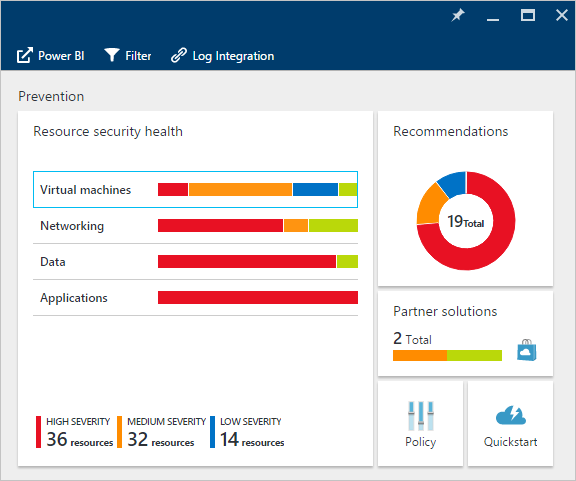

Wenn Sicherheitscenter ein Sicherheitsrisiko, die identifiziert, wie z. B. eines virtuellen Computers berücksichtigt werden, die fehlen Sicherheitsupdates oder einem Subnetz ohne eine [Netzwerksicherheitsgruppe](../virtual-network/virtual-networks-nsg.md), wird dieser hier aufgeführt.

### Überwachen von virtuellen Computern
Wenn Sie in der Kachel **Ressourcen Sicherheit Gesundheit** **virtuellen Computern** klicken, zeigt das **virtuellen Computern** Blade, das geöffnet wird weitere Details Onboarding, Prevention Schritte und einer Liste von allen virtuellen Computern, die das Sicherheitscenter überwacht, wie im folgenden Screenshot dargestellt.

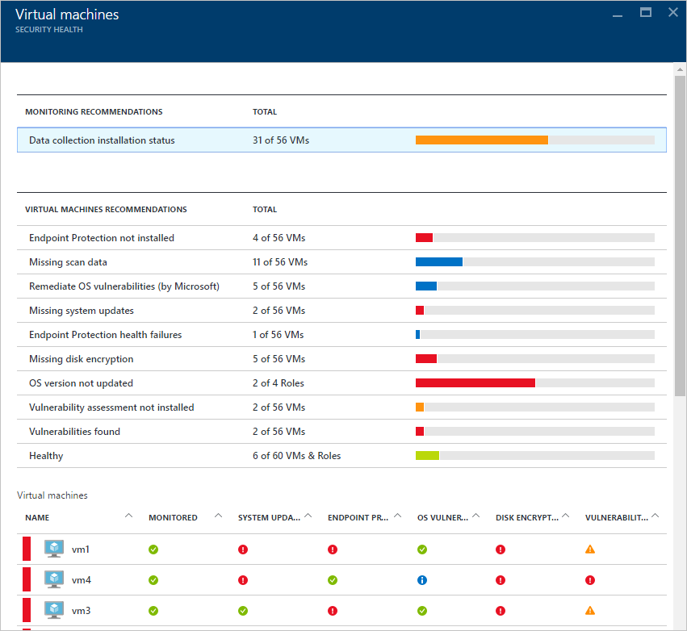

- Onboarding Schritte
- Empfehlungen im Zusammenhang mit virtuellen Computern
- Virtuellen Computern

Wählen Sie in jedem Bereich eine einzelne Option finden Sie weitere Informationen über die empfohlenen Schritte aus, um dieses Problem zu beheben. In den folgenden Abschnitten werden diese Bereiche ausführlicher erläutert.

#### Empfehlungen für die Überwachung
In diesem Abschnitt zeigt die Gesamtzahl der virtuellen Computern, die für die Sammlung von Daten und deren aktuellen Status Initialisierung wurden. Nachdem alle virtuellen Computern Datensammlung Initialisierung haben, werden sie bereit sind, Richtlinien für das Sicherheitscenter Sicherheit zu erhalten. Wenn Sie diesen Eintrag klicken, das **Daten Websitesammlung Installationsstatus** Blade wird geöffnet, und Sie können die Namen der virtuellen Computer und den aktuellen Status der Sammlung von Daten in der Spalte **STATUS der INSTALLATION** sehen, wie im folgenden Screenshot dargestellt.

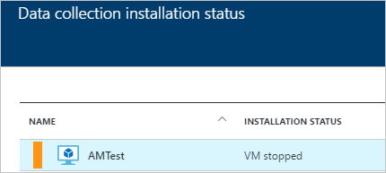

#### Empfehlungen im Zusammenhang mit virtuellen Computern
Dieser Abschnitt enthält eine Reihe von [Empfehlungen für jedes virtuellen Computern](security-center-virtual-machine-recommendations.md) , die überwacht Azure-Sicherheitscenter. Die erste Spalte listet empfohlen. Die zweite Spalte enthält die Gesamtzahl der virtuellen Computern, die von diesem Empfehlungen betroffen sind. Die dritte Spalte zeigt die Schwere des Problems wie im folgenden Screenshot dargestellt.

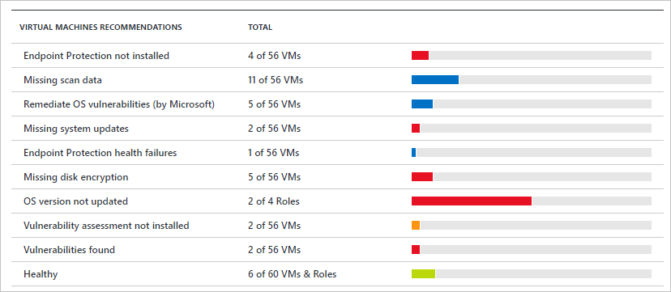

> [AZURE.NOTE] Nur virtuellen Computern, die mindestens einen öffentlichen Endpunkt enthalten sind in **Gesundheit Networking** vorher in der Liste **Netzwerk Suchtopologie** dargestellt.

Jede Empfehlungen weist eine Reihe von Aktionen, die Sie ausführen können, nachdem Sie darauf klicken. Beispielsweise, wenn Sie **Fehlende System-Updates**geklickt haben, das **System-Updates Missing** Blade wird geöffnet. Es listet die virtuellen Computern, die Patches und der Schwere der fehlenden Updates fehlen, wie im folgenden Screenshot dargestellt.

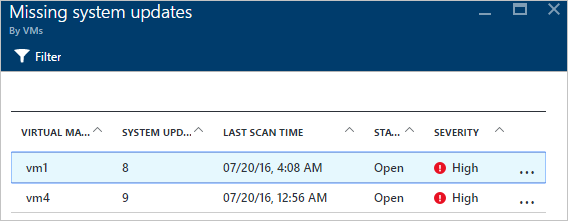

Das **System-Updates Missing** Blade zeigt eine Tabelle mit den folgenden Informationen:

- **Virtuellen Computern**: der Name des virtuellen Computers, die Updates nicht angezeigt wird.
- **SYSTEM-UPDATES**: die Anzahl der Systemupdates, die nicht vorhanden sind.
- **Letzte SCAN-Zeit**: die Zeit, dass Sicherheitscenter zuletzt den virtuellen Computern nach Updates überprüft.
- **BUNDESSTAAT**: den aktuellen Status der empfohlen:
    - **Öffnen**: empfohlen wurde nicht berücksichtigt.
    - **In Bearbeitung**: empfohlen aktuell auf diese Ressourcen angewendet wird, und von Ihnen ist keine Aktion erforderlich.
    - **Gelöst**: empfohlen wurde bereits abgeschlossen. (Wenn das Problem behoben wurde, ist der Eintrag abgeblendet).
- **Schwere**: Beschreibt die Schwere der dieser bestimmten empfohlen:
    - **Hohe**: ein Sicherheitsrisiko vorhanden ist, mit einer aussagekräftigen Ressource (Anwendung, virtuellen Computern oder Netzwerk-Sicherheitsgruppe) und Aufmerksamkeit erfordert.
    - **Mittel**: Kritisch oder zusätzliche Schritte sind erforderlich, um eine abschließen oder ein Sicherheitsrisiko zu unterdrücken.
    - **Niedrig**: ein Sicherheitsrisiko berücksichtigt werden sollen, aber nicht sofortige Aufmerksamkeit erfordert. (Standardmäßig niedrige Empfehlungen werden nicht angezeigt, aber Sie können über niedrig empfohlene filtern, wenn sie anzeigen möchten.)

Wenn die Empfehlungen-Details anzeigen möchten, klicken Sie auf den Namen des virtuellen Computers. Ein neuer Blade für diesen virtuellen Computern wird mit der Liste der Updates geöffnet, wie im folgenden Screenshot dargestellt.

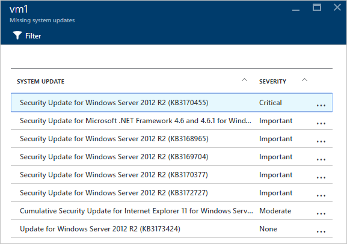

> [AZURE.NOTE] Hier die Sicherheit Empfehlungen sind identisch mit denen in der **Empfehlungen** Blade. Finden Sie unter [Implementierung Sicherheit Empfehlungen im Sicherheitscenter Azure](security-center-recommendations.md) für Weitere Informationen dazu, wie Sie Empfehlungen zu beheben. Dies gilt nicht nur für virtuellen Computern, sondern auch für alle Ressourcen, die in der Kachel **Zustand Ressourcen** verfügbar sind.

#### Abschnitt virtuellen Computern
Im Abschnitt virtuellen Computern gibt Ihnen einen Überblick über alle virtuellen Computern und Empfehlungen. Jede Spalte steht für eine Reihe von Empfehlungen wie im folgenden Screenshot gezeigt:

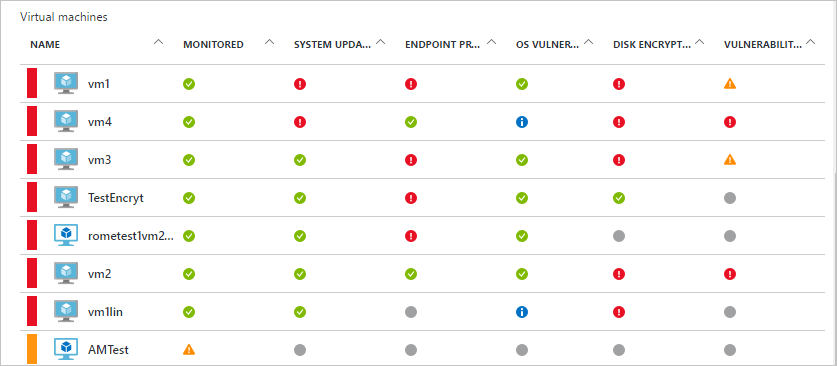

Das daraufhin unter jeder Empfehlungen angezeigte Symbol hilft Ihnen, den virtuellen Computern, die Aufmerksamkeit und den Typ des Empfehlungen benötigen, schnell zu erkennen.

Im vorherigen Beispiel weist einen virtuellen Computern Endpunkt Schutzes kritische empfohlen. Um weitere Informationen zu des virtuellen Computers zu gelangen, klicken Sie darauf. Ein neuer Blade, der geöffnet wird darstellt dieses virtuellen Computers, wie im folgenden Screenshot dargestellt.

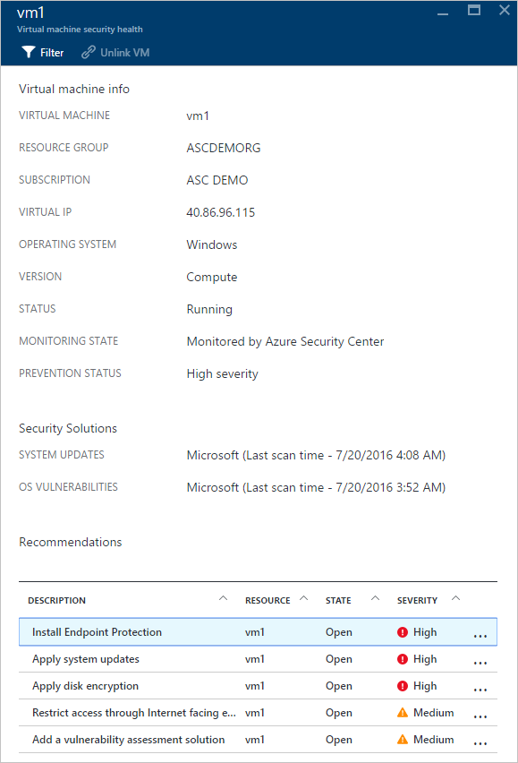

Diese Blade verfügt über die Sicherheitsdetails des virtuellen Computers. Am Ende dieses Blade sehen Sie die empfohlene Aktion und die Schwere der einzelnen Probleme.

#### Abschnitt der Cloud-Dienste (Preview)
Integritätsstatus für Cloud Services enthalten ist in des virtuellen Computers **Sicherheit Gesundheit** Kachel. Empfohlen wird erstellt, wenn die Version des Betriebssystems älter wie im folgenden Screenshot dargestellt wird:

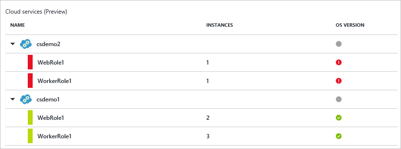

Müssen Sie die Schritte in der Empfehlungen Version des Betriebssystems zu aktualisieren. Angenommen, Sie klicken Sie auf das rote Warnung in der WebRole1 (Windows Server ausgeführt wird automatisch auf IIS bereitgestellt Web-App) oder WorkerRole1 (Windows Server ausgeführt wird automatisch auf IIS bereitgestellt Web-App) Zeilen, ein neuer Blade wird geöffnet, und weitere Details zu diesen Empfehlungen wie im folgenden Screenshot gezeigt:

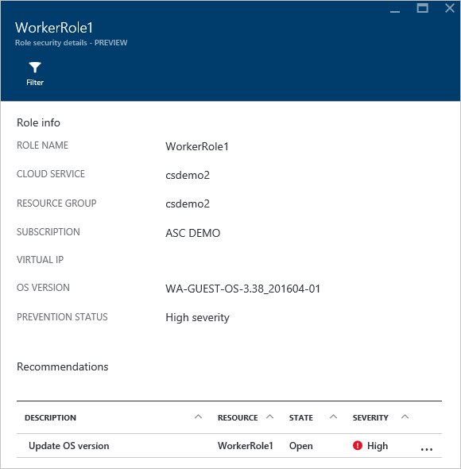

Um eine weitere ausführliche Erläuterung zu diesem Empfehlungen angezeigt wird, klicken Sie unter der Spalte **Beschreibung** auf **Betriebssystemversion aktualisieren** . Weitere Details wird das Blade **Update Betriebssystemversion (Preview)** geöffnet.

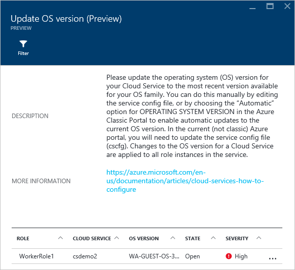  

### Virtuelle Netzwerke überwachen
Wenn Sie **Networking** in der Kachel **Ressourcen Sicherheit Dienststatus** klicken, wird das Blade **Networking** mit mehr Details, wie im folgenden Screenshot dargestellt:

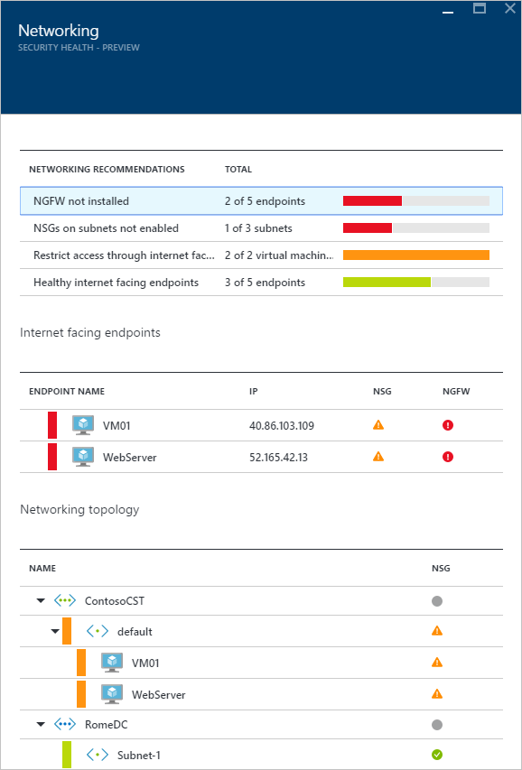

#### Netzwerk-Empfehlungen

Wie Gesundheit Ressourceninformationen des virtuellen Computers bietet dieses Blade eine zusammengefasste Liste mit Problemen im Kopfbereich des Blades und eine Liste der überwachten Netzwerke an den Fuß an.

Abschnitt Projektstrukturplan-Codes Netzwerke Status Listen Probleme und [Empfehlungen](security-center-network-recommendations.md)bietet. Mögliche Probleme können einbeziehen:

- Weiter Generation Firewall (NGFW) eins nicht installiert
- Netzwerk-Sicherheitsgruppen in Subnetzen nicht aktiviert.
- Netzwerk-Sicherheitsgruppen auf virtuellen Computern nicht aktiviert.
- Beschränken Sie den externen Zugriff über öffentliche externe Endpunkt
- Fehlerfrei Internet zugänglichen Endpunkte

Wenn Sie ein Empfehlungen klicken, wird kein neuer Blade mit mehr Details empfohlen geöffnet, wie im folgenden Beispiel gezeigt.

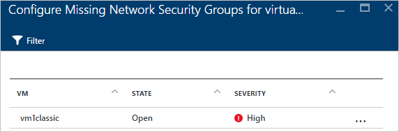

In diesem Beispiel weist das **Konfigurieren von fehlenden Netzwerk Sicherheitsgruppen für Subnetze** Blade eine Liste der Subnetze und virtuellen Computern, die Netzwerk-Sicherheit gruppenschutz fehlt. Wenn Sie das Subnetz Sie im Netzwerk-Sicherheitsgruppe anwenden möchten klicken, wird eine andere Blade geöffnet.

In das Blade **Netzwerk-Sicherheitsgruppe auswählen** können Sie auswählen, die am besten geeignete Netzwerk-Sicherheitsgruppe für das Subnetz oder Sie können eine neue Netzwerk-Sicherheitsgruppe erstellen.

#### Internet zugänglichen Endpunkte Abschnitt

Im Abschnitt **Internet zugänglichen Endpunkte** können Sie den virtuellen Computern anzeigen, die derzeit mit einer Internet-Endpunkt und den aktuellen Status gegenüberliegende konfiguriert sind.

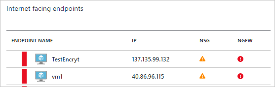

Diese Tabelle hat den Endpunktnamen, der den virtuellen Computern, die Internet zugänglichen IP-Adresse und den aktuellen Status der Schwere der Netzwerk-Sicherheitsgruppe und der NGFW darstellt. Die Tabelle wird durch schwere sortiert werden:

- Rote (im Vordergrund): hohe Priorität und sofort berücksichtigt werden sollte
- Orange: Mittlerer Priorität und so früh wie möglich berücksichtigt werden sollte
- Grüne (letzten eins): ordnungsgemäßen Zustand

#### Netzwerke Suchtopologie Abschnitt

Im Abschnitt **Networking Suchtopologie** weist eine hierarchische Sicht von Ressourcen wie im folgenden Screenshot gezeigt:

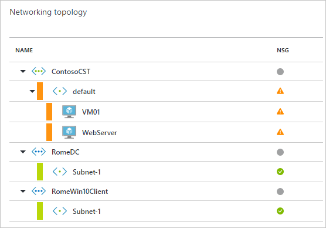

Die folgende Tabelle enthält (virtuellen Computern und Subnetze) nach Schwere sortiert:

- Rote (im Vordergrund): hohe Priorität und sofort berücksichtigt werden sollte
- Orange: Mittlerer Priorität und so früh wie möglich berücksichtigt werden sollte
- Grün (letzten eins): ordnungsgemäßen Zustand

In dieser Ansicht Suchtopologie weist die erste Ebene [virtuelle Netzwerke](../virtual-network/virtual-networks-overview.md), [virtuelles Netzwerkgateways](../vpn-gateway/vpn-gateway-site-to-site-create.md)und [virtuelle Netzwerke (klassische)](../virtual-network/virtual-networks-create-vnet-classic-pportal.md). Die zweite Ebene weist Subnetze, und die dritte Ebene hat den virtuellen Computern, die diesen Subnetzen angehören. Die rechte Spalte weist den aktuellen Status der Netzwerksicherheitsgruppe für Ressourcen, wie im folgenden Beispiel gezeigt:

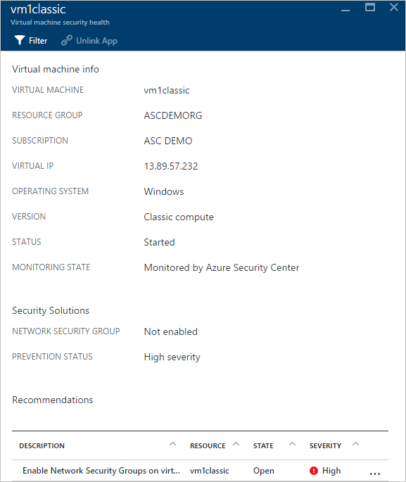

Der unteren Teil dieses Blade verfügt über die Empfehlungen für dieses virtuellen Computers, welche ist ähnlich wie zuvor beschrieben wird. Sie können eine Empfehlungen zu informieren, oder wenden Sie die benötigten Sicherheit Steuerelement oder Konfiguration klicken.

### Überwachen von Daten
Wenn Sie **Daten** in der Kachel **Ressourcen Sicherheit Dienststatus** klicken, wird geöffnet, das **SQL** -Blade Empfehlungen für Probleme, wie z. B. ü und transparente Daten Verschlüsselung nicht aktiviert. Sie hat auch [Empfehlungen](security-center-sql-service-recommendations.md) für die allgemeine Integritätsstatus der Datenbank.

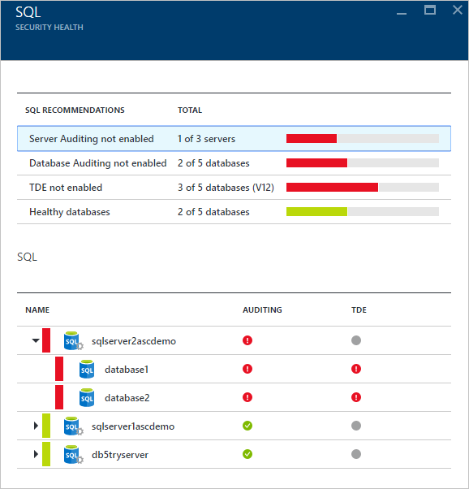

Sie können klicken Sie auf eine beliebige Empfehlungen und erhalten weitere Details weitere Maßnahmen, die ein Problem zu beheben. Im folgenden Beispiel wird die Erweiterung des empfohlen **Überwachung Datenbank nicht aktiviert** .

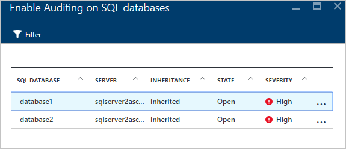

Das **Überwachung aktivieren, klicken Sie auf SQL-Datenbanken** Blade weist die folgende Informationen:

- Eine Liste der SQL-Datenbanken
- Der Server, auf dem sie gespeichert sind
- Informationen, ob diese Einstellung vom Server geerbt wurde, oder wenn sie in dieser Datenbank eindeutig ist
- Im aktuellen Zustand
- Die Schwere des Problems

Wenn Sie die Datenbank zur Behebung dieses Empfehlungen klicken, wird das **Überwachung und Bedrohung Erkennung** Blade geöffnet, wie im folgenden Screenshot dargestellt.

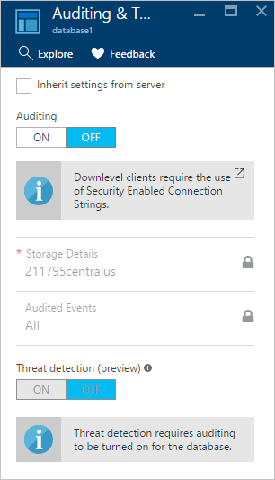

Zum Aktivieren der Überwachung, wählen Sie unter die Option **Überwachung** **auf** aus.

### Überwachen von applications

Wenn Ihre Azure Arbeitsbelastung Applikationen befindet sich im [virtuellen Computern (erstellt bis Azure Ressourcenmanager)](../resource-manager-deployment-model.md) mit zugänglicher Web Ports (TCP-Ports 80 und 443) enthält, können Sicherheitscenter überwacht die Probleme erkennen und Behebungsschritte empfohlen. Wenn Sie die Kachel **Applikationen** klicken, wird das Blade **Applikationen** mit einer Reihe von Empfehlungen im Abschnitt **Prevention Schritte** geöffnet. Es werden auch die Anwendung Projektstrukturplan-Codes pro Host/virtuelle IP-Adresse wie im folgenden Screenshot dargestellt.

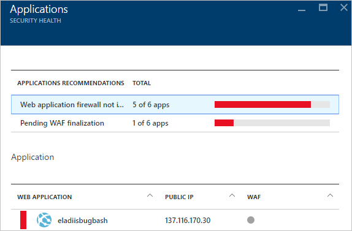

So, wie Sie mit der anderen Empfehlungen haben, können Sie eine Empfehlungen zu finden Sie weitere Details zu dem Problem und so beheben klicken. In der folgenden Abbildung gezeigte Beispiel ist eine Anwendung, die als Webanwendung unsicheren identifiziert wurde. Wenn Sie die Anwendung, die nicht als sicher angesehen wurde auswählen, öffnet ein anderes Blade mit der folgenden Option steht zur Verfügung:

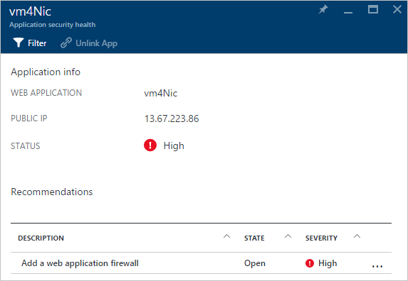

Diese Blade wird eine Liste aller empfohlenen für diese Anwendung haben. Wenn Sie das **Hinzufügen einer Web-Anwendung Firewall** Empfehlungen klicken, wird das **Hinzufügen einer Web-Anwendung Firewall** Blade mit Optionen für eine Web-Anwendung Firewall (WAF) installieren von einem Partner wie im folgenden Screenshot dargestellt geöffnet.

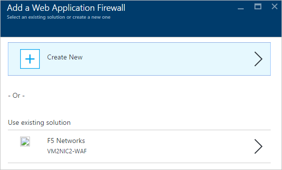

## Siehe auch
In diesem Artikel gelernt Sie Überwachungsfunktionen in Azure-Sicherheitscenter verwenden. Wenn Sie weitere Informationen zur Azure-Sicherheitscenter, probieren Sie Folgendes ein:

- [Einrichten von Sicherheitsrichtlinien für die in Azure Sicherheitscenter](security-center-policies.md): Informationen zum Konfigurieren von Sicherheitseinstellungen in Azure-Sicherheitscenter.
- [Verwalten von und Beantworten von Sicherheitshinweisen im Sicherheitscenter Azure](security-center-managing-and-responding-alerts.md): Informationen zum Verwalten und Beantworten von Sicherheitshinweisen.
- [Überwachen von partnerlösungen mit Azure-Sicherheitscenter](security-center-partner-solutions.md): erfahren, wie Sie den Status des Ihrer partnerlösungen zu überwachen.
- [Häufig gestellte Fragen zur Azure Security Center](security-center-faq.md): häufig gestellte Fragen zur Verwendung des Dienstes suchen.
- [Azure Security Blog](http://blogs.msdn.com/b/azuresecurity/): Suchen nach Blogbeiträge zu Azure Sicherheit und Kompatibilität.
