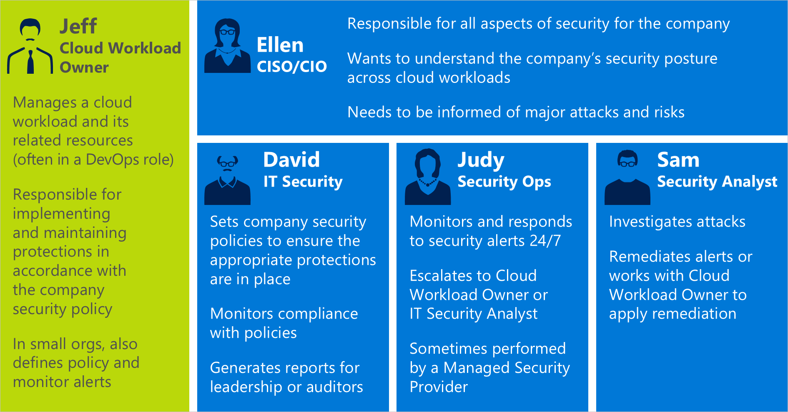
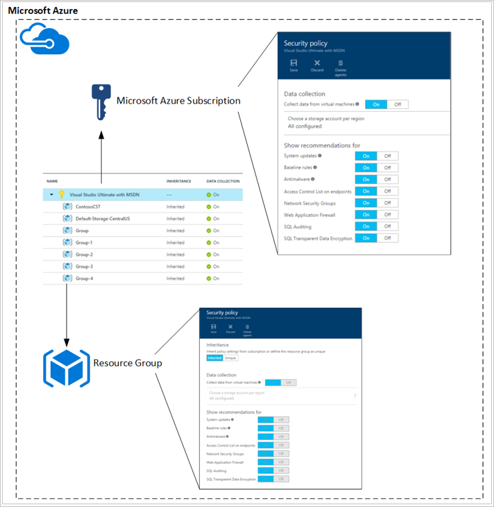
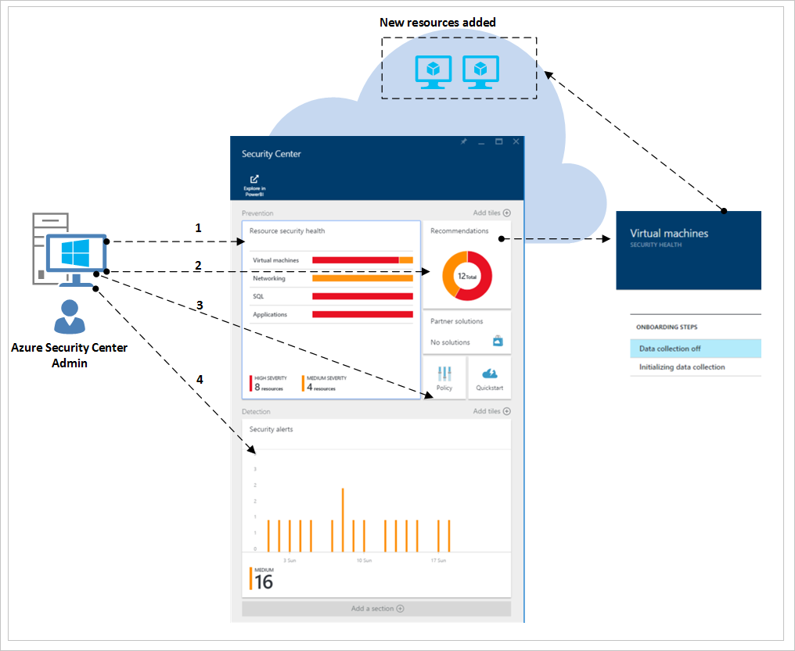
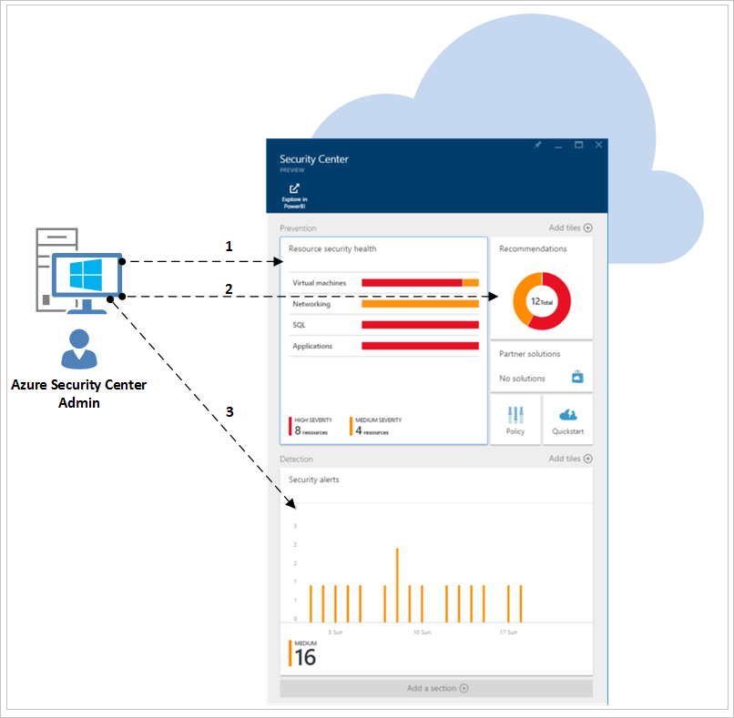
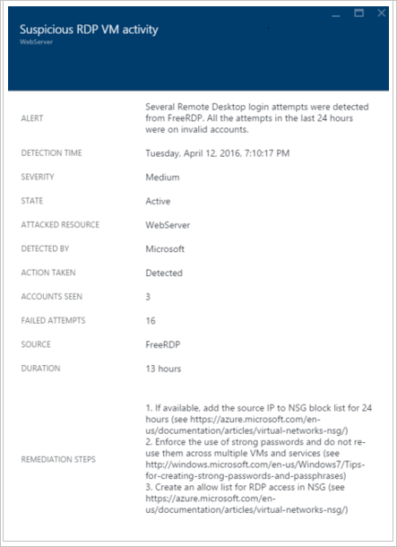

<properties
   pageTitle="Sicherheitscenter Planung und Operations Guide | Microsoft Azure"
   description="Dieses Dokument unterstützt Sie beim Planen, bevor Sie Azure-Sicherheitscenter und Aspekte hinsichtlich täglichen eingeführt."
   services="security-center"
   documentationCenter="na"
   authors="YuriDio"
   manager="swadhwa"
   editor=""/>

<tags
   ms.service="security-center"
   ms.topic="hero-article"
   ms.devlang="na"
   ms.tgt_pltfrm="na"
   ms.workload="na"
   ms.date="10/25/2016"
   ms.author="yurid"/>

# Planung und Betrieb Sicherheitscenter Azure-Leitfaden
Dieses Handbuch ist für IT-Experten (IT), IT-Architekten, Informationen Sicherheitsanalysten und Cloud-Administratoren, deren Organisationen planen, Azure-Sicherheitscenter zu verwenden.

## Planungshandbuch
Dieses Handbuch enthält eine Reihe von Schritte und Aufgaben, die Sie folgen können, um Ihre Verwendung von Sicherheitscenter basierend auf Ihrer Organisation Sicherheit Anforderungen und Cloud Management-Modell zu optimieren. Um das Sicherheitscenter zu nutzen, es ist wichtig zu verstehen, wie verschiedene Personen oder Teams in Ihrer Organisation mit dem sichere Entwicklung und Vorgänge, Überwachung, Governance, entsprechen den Dienst und Reaktion muss. Die wichtigsten Bereiche zu berücksichtigen ist bei der Planung für das Sicherheitscenter verwenden werden:

- Sicherheitsrollen und Access-Steuerelemente
- Sicherheitsrichtlinien und Empfehlungen
- Datensammlung und Speicher
- Überwachung der laufenden Sicherheit
- Vorfall Antwort

Im nächsten Abschnitt erfahren Sie, wie für jedes dieser Bereiche planen und diese Empfehlungen im Zusammenhang mit Ihren Anforderungen entsprechend anzuwenden.

> [AZURE.NOTE] Lesen Sie [Azure Sicherheitscenter häufig gestellte Fragen (FAQ)](security-center-faq.md) für eine Liste mit häufig gestellte Fragen, die auch während der Gestaltung und Planung Phase nützlich sein können.

## Sicherheitsrollen und Access-Steuerelemente
Je nach Größe und Struktur Ihrer Organisation möglicherweise mehrere Einzelpersonen sowie Teams Sicherheitscenter für andere Sicherheits-Aufgaben verwenden. Das folgende Diagramm haben Sie ein Beispiel für fiktives Rollen und ihre jeweiligen Rollen und Zuständigkeiten Sicherheit:

Sicherheitscenter ermöglicht diese Personen auf diese verschiedenen Zuständigkeiten entsprechen. Beispiel:

**Jeff (Cloud Arbeitsbelastung Besitzer)**

- Verwalten einer Cloud Arbeitsbelastung und deren zugehörige Ressourcen
- Implementieren und warten Schutzmechanismen gemäß der Sicherheitsrichtlinie Unternehmen verantwortlich

**Heike (CISO/CIO)**

- Für alle Aspekte der Sicherheit für das Unternehmen zuständig
- Verstehen des Unternehmens Sicherheitslage arbeitslastübergreifend Cloud möchte
- Der wichtigsten Angriffen und Risiken informiert werden muss

**David (IT-Sicherheit)**

- Datensätze des Unternehmens Sicherheitsrichtlinien, um sicherzustellen, dass die entsprechenden Schutzmechanismen angeordnet sind
- Monitore Einhaltung von Richtlinien
- Erstellt Berichte für führende oder Auditoren

**Nina (Security Operations)**

- Überwacht und beantwortet von Sicherheitshinweisen 24/7
- Eskaliert Cloud Arbeitsbelastung Besitzer oder Analysten für IT-Sicherheit

**SAM (Security Analysten)**

- Untersuchen von Angriffen
- Benachrichtigungen behebt oder arbeitet mit Cloud Arbeitsbelastung Besitzer Behebung anwenden 

Sicherheitscenter verwendet [rollenbasierte Access Control (RBAC)](../active-directory/role-based-access-control-configure.md), das [integrierte Funktionen](../active-directory/role-based-access-built-in-roles.md) bereitstellt, die Benutzer, Gruppen und Dienste in Azure zugeordnet werden kann. Wenn ein Benutzer Sicherheitscenter geöffnet wird, finden Sie unter diese nur Informationen, die im Zusammenhang mit Ressourcen, die, denen Sie Zugriff haben. Was bedeutet, dass den Benutzer zugeordnet ist die Rolle des Besitzer, Mitwirkender oder Reader das Abonnement oder Ressourcengruppe, zu der eine Ressource gehört. 

> [AZURE.NOTE] Ein Benutzer muss mindestens ein Abonnement, Ressourcen Gruppenbesitzer oder Mitwirkender Sicherheitscenter in Azure finden Sie unter können sein.

Verwenden die Rollen in der vorherigen Abbildung Erläuterung, würde die folgenden RBAC erforderlich sein:

**Jeff (Cloud Arbeitsbelastung Besitzer)**

- Ressourcengruppe Besitzer/Collaborator

**David (IT-Sicherheit)**

- Abonnement Besitzer/Collaborator

**Nina (Security Operations)**

- Abonnement Reader zum Anzeigen von Benachrichtigungen
- Abonnement Besitzer/Collaborator erforderlich, um Benachrichtigungen zu beenden.

**SAM (Security Analysten)**

- Abonnement Reader zum Anzeigen von Benachrichtigungen
- Abonnement Besitzer/Collaborator zur Behebung oder Beenden der Benachrichtigungen erforderlich
- Zugriff auf Speicher kann erforderlich sein.

Einige weitere wichtige Informationen zu berücksichtigen ist:

- Nur Abonnement Besitzer und Mitwirkenden können eine Sicherheitsrichtlinie bearbeiten.
- Nur Abonnement und Ressourcengruppe Besitzer und Mitwirkenden können Sicherheit Empfehlungen für eine Ressource anwenden.

Beim Planen der Access-Steuerelement RBAC für das Sicherheitscenter verwenden, müssen Sie verstehen, die in Ihrer Organisation Sicherheitscenter verwendet wird. Auch, welche Arten von Aufgaben, die sie ausführen und dann RBAC entsprechend konfigurieren.

> [AZURE.NOTE] Es empfiehlt sich, dass Sie die wenigsten Berechtigungen Rolle erforderlich für Benutzer zum Ausführen ihrer Aufgaben zuweisen. Beispielsweise sollten Benutzer, die nur die entsprechenden Informationen über den Sicherheitsstatus von Ressourcen anzeigen, aber nicht Aktionen durchführen, wie etwa Empfehlungen anwenden oder Bearbeiten von Richtlinien, die Rolle Leser zugewiesen.

## Sicherheitsrichtlinien und Empfehlungen
Eine Sicherheitsrichtlinie definiert die Steuerelemente, die für Ressourcen innerhalb des angegebenen Abonnement oder Ressourcengruppe vorgeschlagen werden. Im Sicherheitscenter definieren Sie Richtlinien gemäß Ihres Unternehmens Sicherheit Anforderungen und Anwendungstyp oder Vertraulichkeit der Daten aus.

Weitergabe von Richtlinien, die in der Abonnementebene automatisch aktiviert werden alle Gruppen von Ressourcen innerhalb des Abonnements, wie in der folgenden Abbildung dargestellt:

(Siehe vorstehende Abbildung) können Sicherheitsrichtlinien für Ressourcengruppen aus der Abonnementebene übernommen werden.

In einigen Fällen, wo Sie Ressourcen in einer Ressourcengruppe auftritt, die einen anderen Satz von Richtlinien erfordern, können Sie Vererbung deaktivieren und Anwenden von benutzerdefinierten Richtlinien auf eine bestimmte Ressourcengruppe.

Wenn Sie benutzerdefinierte Richtlinien in Gruppen bestimmte Ressource benötigen, sollten Sie Deaktivieren der Vererbung in der Ressourcengruppe und ändern Sie die Sicherheitsrichtlinien. Beispielsweise wenn Sie einige Auslastung, die die Richtlinie SQL-Verschlüsselung Transparent Daten nicht benötigen verfügen, deaktivieren Sie die Richtlinie auf der Abonnementebene, und aktivieren sie nur in den Ressourcen Gruppen, SQL TDE erforderlich ist.

Beim Erstellen von benutzerdefinierter Richtlinien für andere Ressourcengruppen starten, sollten Sie planen, Ihre Richtlinie Bereitstellung wissen, dass bei einer Richtlinienkonflikt (Abonnement im Vergleich zu Ressourcengruppe), die Ressource Gruppenrichtlinien hat Vorrang.

> [AZURE.NOTE] Wenn Sie benötigen, um zu überprüfen, welche Richtlinien geändert wurden, können Sie [Überwachungsprotokolle Azure](https://blogs.msdn.microsoft.com/cloud_solution_architect/2015/03/10/audit-logs-for-azure-events/)verwenden. Richtlinie Änderungen werden in Azure Überwachungsprotokolle immer protokolliert.

### Sicherheit Empfehlungen

Vor dem Konfigurieren von Sicherheitsrichtlinien, überprüfen Sie jeden der [Mittelpunkt](security-center-recommendations.md)und feststellen Sie, ob diese Richtlinien für Ihre verschiedenen Abonnements und Ressourcengruppen geeignet sind. Es ist es wichtig, zu verstehen, welche Aktion Adresse Mittelpunkt ausgeführt wird.

**Endpunkt Schutz**: ein virtuellen Computers keine Endpunkt Schutz Lösung aktiviert, empfiehlt Sicherheitscenter, eine zu installieren. Wenn Sie eine bevorzugten Endpunkt Schutz Lösung, dass Sie bereits lokale eingeführt haben haben, müssen Sie entscheiden, ob Sie die gleichen Modul für Ihre Azure-virtuellen Computer verwenden. Sicherheitscenter bietet mehrere Endpunkt Kennwortschutzoptionen.  Verwenden Sie die kostenlose Microsoft Antimalware oder wählen Sie zwischen einer Liste von Endpunkt Protection Solutions von integrierten Partner zur Verfügung. Lesen Sie weitere Informationen zum Bereitstellen von Modul mit dem Sicherheitscenter [Endpunkt Schutz im Sicherheitscenter Azure installieren](security-center-install-endpoint-protection.md).

**System-Updates**: Sicherheitscenter identifiziert virtuellen Computern, die Sicherheit oder das Betriebssystem von wichtigen Updates für IaaS und Cloud-Dienste (PaaS) fehlen. Erwägen Sie, wer für die Anwendung von Updates bei Bedarf verantwortlich ist und wie diese angewendet werden. Viele Organisationen verwenden WSUS, Windows Update oder ein anderes Tool an.

**Geplantes Konfigurationen**: Wenn virtuellen Computern Betriebssystemkonfigurationen empfohlenen Basislinien nicht übereinstimmen, wird ein Empfehlungen angegeben. Überprüfen Sie den Satz von Basisplänen [hier](https://gallery.technet.microsoft.com/Azure-Security-Center-a789e335) und entscheiden Sie, wie das Betriebssystem von Konfigurationen angewendet werden.

**Verschlüsselung Festplatten**: Wenn Sie virtuellen Computern Festplatten, die nicht verschlüsselt sind verfügen, Sicherheitscenter empfiehlt Sie Azure Datenträger Verschlüsselung anwenden. Dieses Feature nutzt BitLocker für Windows und DM-Crypt für Linux, um die Lautstärke Verschlüsselung für die Datenträger OS und Daten zu ermöglichen. Diese Empfehlungen leitet Sie an eine [schrittweise Anleitung](security-center-disk-encryption.md) , die die Anweisungen zur Durchführung dieses Verschlüsselung enthält.

Achten Sie darauf, dass es gibt verschiedene Szenarios für die Verschlüsselung, die behoben werden müssen. Sie müssen für die Anforderungen für jedes dieser Szenarien planen:

- Verschlüsselung von neuen Azure virtuellen Computern aus virtuelle Festplatten, die Sie mit Ihrer eigenen Schlüssel für die Verschlüsselung verschlüsselte
- Verschlüsselung von neuen Azure virtuellen Computern, die aus dem Katalog Azure erstellt wurden
- Verschlüsselung von Azure virtuellen Computern, die bereits in Azure ausgeführt werden

Planung Anforderungen, wird für jedes dieser Szenarien unterschiedlich sein. Näheres [Azure Datenträger Verschlüsselung Whitepaper](https://gallery.technet.microsoft.com/Azure-Disk-Encryption-for-a0018eb0) für jedes dieser Szenarien Details.

**Web Anwendung Firewall**: Sicherheitscenter virtuellen Computern Webanwendungen erkennen und empfiehlt sich, dass Sie eine Web Anwendung Firewall (WAF) installiert haben. Beurteilen von der verfügbaren partnerlösungen zum bestimmen, welche die optimale Breite für Ihre Organisation ist und zum bestimmen, wie die Lösung lizenziert werden sollen (Partner unterstützen möglicherweise wieder abrufen Ihrer eigenen Lizenz und/oder Quellenbesteuerung Modelle). Weitere Informationen zum Bereitstellen einer Web-Anwendung Firewalls in Ihrer Azure-virtuellen Computern einlesen Sicherheitscenter, [Hinzufügen eine Web-Anwendung Firewall in Azure Sicherheitscenter](security-center-add-web-application-firewall.md).

**Nächste Generation Firewall**: Aktivieren Sie eine virtuelle Einheit von führenden Herstellern, einschließlich Check Point und bald nach Cisco und Fortinet bereitstellen. Dadurch wird erweitert Netzwerk Schutzmechanismen jenseits Netzwerk Sicherheitsgruppen, die in Azure integriert sind. Sicherheitscenter wird ermitteln Bereitstellungen für die nächste Generation Firewall wird empfohlen, und ermöglichen es Ihnen, eine virtuelle Einheit bereitstellen.

**Virtual Networking**: Sicherheitscenter wertet Ihrer [Azure-virtuellen Netzwerk](https://azure.microsoft.com/documentation/services/virtual-network/) -Infrastruktur und die Konfiguration zu überprüfen, ob das [Netzwerk Sicherheitsgruppen](../virtual-network/virtual-networks-nsg.md) sind angewendete und mit einem ordnungsgemäß konfigurierten eingehenden Verkehrsregeln. Sie sollten, was den Datenverkehr Regeln definiert werden sollen, und kommunizieren diese an die Personen von Empfehlungen im Zusammenhang mit der Sicherheit im Zusammenhang anwenden.

Sicherheitscenter wird empfiehlt sich, dass Sie für Ihr Abonnement Azure Kontaktdetails Sicherheit bereitstellen. Diese Informationen werden von Microsoft verwendet werden, mit Ihnen Kontakt aufnehmen, wenn das Microsoft Security Antwort Center (MSRC) erkennt, dass Ihre Kundendaten durch einen dritten ungesetzlichen oder nicht autorisierte zugegriffen wurde. Lesen Sie weitere Informationen zum Aktivieren dieser Empfehlungen [Bereitstellen Sicherheit Details im Sicherheitscenter Azure wenden Sie sich an](security-center-provide-security-contact-details.md) .

## Datensammlung und Speicher

Es wird dringend empfohlen, dass Sie Datensammlung für jede Ihrer Abonnements aktivieren wie folgt sorgt dafür, dass die Sicherheit überwachen für Ihre virtuellen Computer verfügbar ist. Datensammlung wird über der Azure Überwachung-Agent (ASMAgentLauncher.exe) und die Erweiterung Azure Sicherheit Überwachung (ASMMonitoringAgent.exe) aktiviert.

Die Erweiterung Azure Sicherheit Überwachung für verschiedene Sicherheit relevanten Konfiguration scannt und sammelt Sicherheitsprotokolle von des virtuellen Computers. Diese Daten werden mit einem Speicherkonto gesendet, die Sie angeben. Der Scan-Manager (ASMSoftwareScanner.exe) auch im virtuellen Computer installiert werden und als einen Scanner Patch verwendet werden.

Azure Sicherheit Überwachung Jahr Agent weist den folgenden Platzbedarf Basisplan an:

- 3MB Arbeitsspeicher Platzbedarf in den meisten Fällen mit potenzieller Spitzen von 10 MB, wenn ein Szenario mit jeder 12 ausgeführt wird Std..  
- Unerheblich CPU beständigen Prozess und Scanner. 
- Unerheblich Datenträger Auslastung.

ASM-Agent ist eine Kette von Prozessen, die im Speicher maximal 30 MB gesamt können.  Jede Überwachung Agent-Instanz kann bis zu 3 GB des Laufwerks verwenden. Jede Instanz wird bei 20 % CPU, Obergrenze, auch in der Praxis dies viel kleiner ist. 

Nach Datensammlung in der Sicherheitsrichtlinie aktiviert ist, wird die Überwachung Agent und Erweiterungen automatisch auf alle vorhandenen installiert sind, und eine virtuellen Computern, die nach der Bereitstellung sind neu in Azure unterstützt.  Prozess des Kundendienstmitarbeiters soll haben sehr minimalen Einfluss auf die Leistung virtueller Computer und werden keine Konflikte auftreten.

> [AZURE.NOTE] Probleme, lesen [Azure Sicherheit Problembehandlung Zwischenlinie](security-center-troubleshooting-guide.md)im Zusammenhang mit Azure Security Überwachung Agent zur Problembehandlung.

Wenn Sie zu einem bestimmten Zeitpunkt Sie Datensammlung deaktivieren möchten, können Sie es in der Sicherheitsrichtlinie deaktivieren. Um Überwachung Agents zuvor bereitgestellt zu löschen, wählen Sie die Menüoption Agents löschen.

> [AZURE.NOTE] Um eine Liste der unterstützten virtuellen Computern zu finden, lesen Sie im [Azure Sicherheitscenter häufig gestellte Fragen (FAQ)](security-center-faq.md).

Für die einzelnen Regionen, in denen Sie virtuellen Computern ausgeführt haben, wählen Sie das Speicherkonto auf diese virtuellen Computer erfassten Daten gespeichert ist. Wenn Sie ein Speicherkonto für die einzelnen Regionen nicht auswählen, wird eine für Sie erstellt. Wählen Sie den Speicherort, je nach Region oder alle Informationen an einer zentralen Stelle zu speichern. Während bei der Azure-Abonnement und Ressourcen Gruppenebene Sicherheitsrichtlinien festgelegt werden können, kann der Bereich für Ihr Speicherkonto nur Ebene der Abonnement ausgewählt werden.

Wenn Sie eine Weitergabe an andere Azure Ressourcen Speicher-Konto verwenden, stellen Sie sicher, dass Sie die [Leistung und Skalierbarkeit der Azure-Speicher](../storage/storage-scalability-targets.md) Artikel Weitere Informationen über die maximale Dateigröße und Einschränkungen lesen. Ihr Abonnement ist auch Speicher Grenzwerte zu berücksichtigen, [Azure-Abonnement und Beschränkungen Service, Kontingente, und Einschränkungen](../azure-subscription-service-limits.md) zum besseren Verständnis der genannten Einschränkungen überprüfen.

Kosten im Zusammenhang mit dieser Speicher fallen nicht unter den Preis für das Sicherheitscenter und separat zu regulären [Azure-Speicher Sätzen](https://azure.microsoft.com/pricing/details/storage/)belastet werden. Hinsichtlich der Planung sollten Sie beachten, dass Sicherheitscenter hinzugefügt wird, dass die Daten zu Ihrer Azure-Speicher, die die Kosten erhöhen möglicherweise zwischen 1 bis 3 Dollar pro Jahr liegt.

Leistung und Skalierbarkeit Aspekte sollten auch geplant werden, ab der Umgebungsgröße Ihrer Azure-und den Ressourcen, die Ihr Speicherkonto in Anspruch nehmen. Überprüfen Sie die [Microsoft Azure-Speicher Leistung und Skalierbarkeit Checkliste](../storage/storage-performance-checklist.md) für Weitere Informationen.

> [AZURE.NOTE] Microsoft stellen signifikante Zusagen, um den Datenschutz und Sicherheit dieser Daten zu schützen. Microsoft befolgt strict Compliance- und Richtlinien – von der Codierung zum Ausführen eines Dienstes. Lesen Sie weitere Informationen zur Behandlung von Daten und Ihre Privatsphäre [Azure Security Center-Datenschutz](security-center-data-security.md).

## Überwachung der laufenden Sicherheit

Nach der erstmaligen Konfiguration und Anwendung Sicherheitscenter empfohlenen wird im nächste Schritt Sicherheitscenter Betrieb Prozesse in Betracht ziehen.

Zum Zugreifen auf das Sicherheitscenter aus der Azure Portals können klicken Sie auf **Durchsuchen** und geben Sie in das Feld " **Filter** " **Sicherheitscenter** . Ansichten, die der Benutzer erhält werden gemäß der folgenden angewendete Filter.

Sicherheitscenter stört Ihre normalen Betrieb Verfahren, wird er Annahmefeed Bereitstellung Ihrer überwachen und Vorschläge, wie basierend auf die Sicherheitsrichtlinien aktiviert.

Das Sicherheitscenter Dashboard ist in zwei Hauptteilen unterteilt:

- Prevention
- Erkennung

Wenn Sie zuerst Datensammlung in Sicherheitscenter für Ihre aktuelle Azure-Umgebung aktivieren, stellen Sie sicher, dass Sie alle empfohlenen darum pro Ressource (**virtuellen Computern**, **Networking**, **SQL** und **Anwendung**) oder das Blade **Empfehlungen** ausgeführt werden.

Einmal Adresse Sie alle empfohlenen, Abschnitt **Prevention** grünen für alle Ressourcen sollten, die adressiert wurden. Fortlaufende Überwachung wird zu diesem Zeitpunkt einfacher, da Sie Aktionen auf Grundlage von Änderungen in der Ressource Sicherheit Gesundheit und Empfehlungen im Zusammenhang mit Kacheln nur weitergeleitet werden.

Im Abschnitt **Erkennung** ist mehr reaktivieren, diese Benachrichtigungen zu Problemen werden, die entweder stattgefunden hat jetzt oder in der Vergangenheit aufgetretenen und von Sicherheitscenter-Steuerelementen und 3rd Party Systeme erkannt wurden. Die Kachel von Sicherheitshinweisen wird Balkendiagramme angezeigt, die die Anzahl der Bedrohung Erkennung Benachrichtigungen darstellen, die jeden Tag und deren Verteilung auf die verschiedenen Schweregradkategorien (niedrig, Mittel, hoch) gefunden wurden. Weitere Informationen zu von Sicherheitshinweisen, [Verwaltung und Beantworten von Sicherheitshinweisen im Sicherheitscenter Azure](security-center-managing-and-responding-alerts.md)lesen.

> [AZURE.NOTE] Sie können auch Microsoft Power BI zum Darstellen Ihrer Daten Sicherheitscenter nutzen. Lesen Sie [Einsichten aus Azure Sicherheitscenter Daten mit Power BI abrufen](security-center-powerbi.md).

### Überwachung für neue oder geänderte Ressourcen

Am häufigsten Azure Umgebungen sind dynamische, mit neuen Ressourcen nach oben oder unten in regelmäßigen Abständen, Konfigurationen oder Änderungen erstellt wird. Sicherheitscenter können Sie sicherstellen, dass Sie Einblick in den Sicherheitszustand dieser neuen Ressourcen haben.

Wenn Sie Ihre Azure-Umgebung neue Ressourcen (virtuellen Computern, SQL-Datenbanken) hinzufügen, Sicherheitscenter erkennt automatisch diese Ressourcen und beginnt, ihre Sicherheit zu überwachen. Dies gilt auch PaaS Webrollen und Worker-Rollen. Wenn in der [Sicherheitsrichtlinie](security-center-policies.md)Datensammlung aktiviert ist, werden zusätzliche Überwachungsfunktionen automatisch für die virtuellen Computer aktiviert sein.

1.  Zugriff auf die Kachel **Ressource Sicherheit Gesundheit** virtuellen Computern, klicken Sie auf **virtuellen Computern**. Probleme mit der Aktivierung Datensammlung oder verwandte Empfehlungen werden im Abschnitt **Für die Überwachung Empfehlungen** angezeigt werden.
2.  Anzeigen der **Empfehlungen** um finden Sie unter Was, sofern vorhanden, Risiken wurden für die neue Ressource identifiziert.
3.  Es ist sehr häufig, wenn neue virtuellen Computern Ihrer Umgebung hinzugefügt werden, anfangs nur das Betriebssystem installiert ist. Der Ressourcenbesitzer möglicherweise einige Zeit in andere apps bereitstellen, die von diesen virtuellen Computern verwendet werden.  Idealerweise sollten Sie die endgültige Absicht dieses Arbeitsbelastung kennen. Ist es ein Anwendungsserver sein? Basierend auf was diese neue Arbeitsbelastung einnehmen soll, können Sie die entsprechende **Sicherheitsrichtlinie**aktivieren, welche ist der dritte Schritt in dieser Workflow.
4.  Neue Ressourcen Ihre Azure-Umgebung hinzugefügt werden, ist es möglich, dass Sie in der Kachel **Von Sicherheitshinweisen** neue Benachrichtigungen angezeigt werden. Immer überprüfen Sie, wenn neue Benachrichtigungen in diese Kachel vorhanden sind, und Aktionen Sie gemäß Sicherheitscenter Empfehlungen.

Sie sollten regelmäßig den Status von vorhandenen Ressourcen Konfiguration Änderungen zu identifizieren, die Sicherheit riskieren, erstellte Drift empfohlene Basisplänen und Sicherheitswarnungen überwachen. Beginnen Sie mit dem Dashboard Sicherheitscenter. Von dort aus haben Sie drei Hauptbereichen durchgängig zu überprüfen.

1.  Klicken Sie im Bereich **Ressource Sicherheit Gesundheit** bietet Ihnen schnellen Zugriff auf Ihre wichtigsten Ressourcen. Verwenden Sie diese Option um zu Ihrer virtuellen Computern, Netzwerken, SQL- und Anwendungen zu überwachen.
2.  Klicken Sie im Bereich **Empfehlungen** können Sie Empfehlungen für das Sicherheitscenter zu überprüfen. Während der laufenden Überwachung kann es passieren, dass Sie Empfehlungen täglich, nicht die normalen ist, da Sie alle empfohlenen auf das ursprüngliche Sicherheitscenter einrichten berücksichtigt. Aus diesem Grund möglicherweise keine neuen Informationen in diesem Abschnitt jeden Tag und müssen einfach darauf zugreifen, je nach Bedarf.
3.  Klicken Sie im Bereich **Erkennung** ändert sich möglicherweise auf eine sehr häufige oder sehr seltene Basis. Immer überprüfen Sie Ihre von Sicherheitshinweisen und Aktionen Sie basierend auf Sicherheitscenter Empfehlungen.

## Vorfall Antwort

Sicherheitscenter erkennt und Risiken benachrichtigt Sie, sobald sie auftreten. Organisationen sollten für neue von Sicherheitshinweisen überwachen und agieren Bedarf sorgfältiger oder die Angriffen zu beheben. Lesen Sie weitere Informationen zur Funktionsweise von Sicherheitscenter Erkennung [Azure Sicherheitscenter Erkennungsfunktionen](security-center-detection-capabilities.md)aus.

Während in diesem Artikel die Absicht, die Sie erstellen Ihre eigene Antwort Vorfall Plan unterstützen aufweist, werden wir Microsoft Azure Sicherheitsantwort in der Cloud Lebenszyklus als Grundlage für Reaktion Phasen verwendet. Die Phasen werden in der folgenden Abbildung dargestellt:

> [AZURE.NOTE] Im National Institute of Standards and Technology (NIST)- [Computer Security Vorfall Behandlung Guide](http://nvlpubs.nist.gov/nistpubs/SpecialPublications/NIST.SP.800-61r2.pdf) können als Referenz zur Unterstützung bei der Erstellung einer eigenen Lösung.

Sie können in den folgenden Phasen Center Sicherheitswarnungen verwenden:

- **Erkennen**: eine verdächtige Aktivitäten in eine oder mehrere Ressourcen zu identifizieren. 
- **Bewerten**: Ausführen die erste Beurteilung, um weitere Informationen zu den verdächtige Aktivitäten zu erhalten.
- **Konfigurationsprobleme**: gehen Behebung vor, um das technische Verfahren zum Beheben des Problems durchführen.

Jede Sicherheitshinweis enthält Informationen, die zum besser erkennen, die Art der der Angriffen und mögliche Problembehebungen verwendet werden kann. Einige Benachrichtigungen finden Sie auch Links, entweder Weitere Informationen oder anderen Quellen von Informationen in Azure. Sie können die Angaben zur weiteren Untersuchung und Reduzierung beginnen soll.

Im folgenden Beispiel wird einen verdächtigen RDP Aktivitäten stattfinden:

Wie Sie sehen können, wird diese Blade Details hinsichtlich der Zeit die der Angriffen platzieren, Hostname Quelle, das Ziel virtueller Computer und außerdem Schritte empfohlen. In einigen Fällen möglicherweise von den Angriffen die Quellinformationen leer. Lesen Sie [Fehlende Quellinformationen in Azure Center Sicherheitswarnungen](https://blogs.msdn.microsoft.com/azuresecurity/2016/03/25/missing-source-information-in-azure-security-center-alerts/) für Weitere Informationen zu dieser Art von Verhalten.

Im Video [wie das Sicherheitscenter Azure und Microsoft Operations Management Suite für eine Antwort Vorfall nutzen](https://channel9.msdn.com/Blogs/Taste-of-Premier/ToP1703) können Sie einige Demos anzeigen, die Ihnen helfen, zu verstehen, wie das Sicherheitscenter in dieser Stufen jeweils verwendet werden kann.

> [AZURE.NOTE] Lesen Sie weitere Informationen zur Verwendung von Sicherheitscenter-Funktionen, die Sie während des Prozesses Vorfall Antwort unterstützen [Nutzen Azure Sicherheitscenter für Vorfall Antwort](security-center-incident-response.md) . 

## Siehe auch
In diesem Dokument gelernt Sie für das Sicherheitscenter Annahme planen. Weitere Informationen zum Sicherheitscenter, probieren Sie Folgendes ein:

- [Verwalten und Beantworten von Sicherheitshinweisen in Azure-Sicherheitscenter](security-center-managing-and-responding-alerts.md)
- [Sicherheit Dienststatus überwachen im Sicherheitscenter Azure](security-center-monitoring.md) – erfahren, wie Sie die Integrität des Azure Ressourcen zu überwachen.
- [Überwachen von partnerlösungen mit Azure-Sicherheitscenter](security-center-partner-solutions.md) – erfahren, wie Sie den Status des Ihrer partnerlösungen zu überwachen.
- [Häufig gestellte Fragen zur Azure Security Center](security-center-faq.md) – häufig gestellte Fragen zur Verwendung des Dienstes suchen.
- [Azure Security Blog](http://blogs.msdn.com/b/azuresecurity/) – Blogbeiträge zur Azure Sicherheit und Einhaltung von Vorschriften zu finden.
