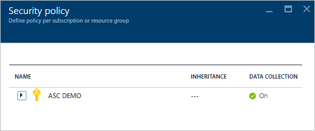
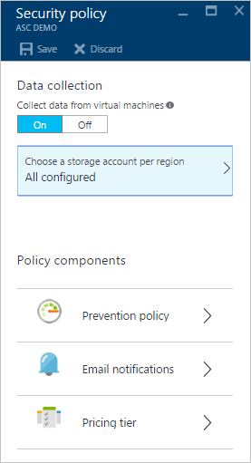
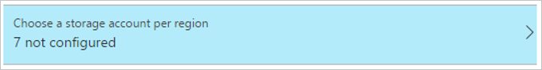
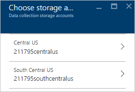
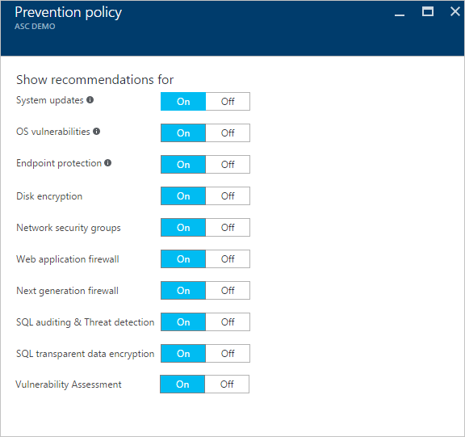
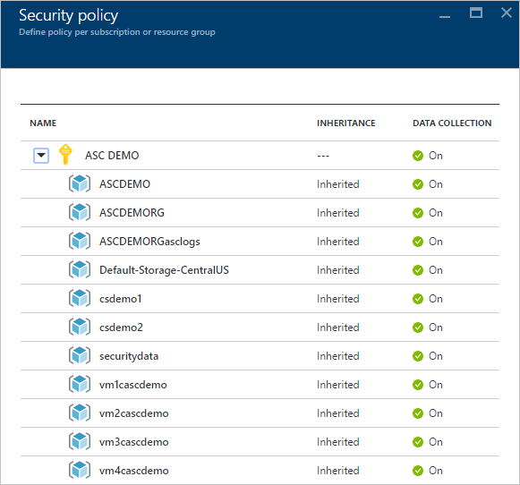
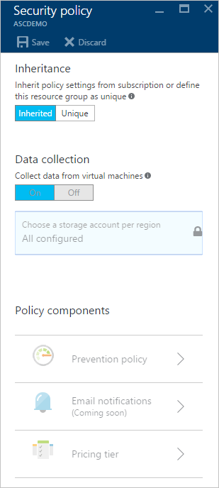

<properties
   pageTitle="Festlegen von Sicherheitsrichtlinien in Azure-Sicherheitscenter | Microsoft Azure"
   description="Dieses Dokument hilft Ihnen, Azure-Sicherheitscenter Sicherheitsrichtlinien konfigurieren."
   services="security-center"
   documentationCenter="na"
   authors="YuriDio"
   manager="swadhwa"
   editor=""/>

<tags
   ms.service="security-center"
   ms.devlang="na"
   ms.topic="hero-article"
   ms.tgt_pltfrm="na"
   ms.workload="na"
   ms.date="09/22/2016"
   ms.author="yurid"/>

# Festlegen von Sicherheitsrichtlinien in Azure-Sicherheitscenter
Dieses Dokument hilft Ihnen, die im Sicherheitscenter Sicherheitsrichtlinien konfigurieren, indem er Sie durch die erforderlichen Schritte zum Ausführen dieser Aufgabe begleitet.

## Was sind die Sicherheitsrichtlinien?
Eine Sicherheitsrichtlinie definiert die Steuerelemente, die für Ressourcen innerhalb des angegebenen Abonnement oder Ressourcengruppe vorgeschlagen werden. Im Sicherheitscenter definieren Sie Richtlinien für Ihre Azure-Abonnements oder Ressourcengruppe gemäß Ihren Anforderungen des Unternehmens Sicherheit und Anwendungstyp oder Vertraulichkeit der Daten in jedem Abonnement aus.

Angenommen, haben für die Entwicklung oder Test verwendeten Ressourcen andere Sicherheitsstandards gelten von Ressourcen, die für die Herstellung Applikationen verwendet werden. Ebenso erfordern, regulierte Daten wie personenbezogene Informationen verwenden, möglicherweise eine höhere Sicherheit. Sicherheitsrichtlinien, die im Sicherheitscenter Azure Laufwerk Sicherheit Empfehlungen aktiviert sind und Sie können die Überwachung ermitteln Sie potenzielle Anfälligkeiten und minimieren Risiken. Lesen Sie [Azure Security Center Planung und Operations Guide](security-center-planning-and-operations-guide.md) für Weitere Informationen dazu, wie Sie die Option zu ermitteln, die für Sie geeignet ist.

## Festlegen von Richtlinien für Abonnements Sicherheit

Sie können die Sicherheitsrichtlinien für jedes Abonnement oder Ressourcengruppe konfigurieren. Wenn Sie eine Sicherheitsrichtlinie ändern möchten, müssen Sie einen Besitzer oder Mitwirkender diesen Abonnementtyp sein. Melden Sie sich bei der Azure-Portal und die nachfolgenden Schritte zum Konfigurieren der Sicherheit in Sicherheitscenter Richtlinien folgen:

1. Klicken Sie auf die Kachel **Richtlinie** im Sicherheitscenter Dashboard.

2. Das Blade **Sicherheitsrichtlinie - Richtlinie pro Abonnement oder die Ressourcengruppe definieren** , das angezeigt wird, wählen Sie das Abonnement, an dem Sie die Sicherheitsrichtlinie aktivieren möchten. Wenn Sie die Sicherheitsrichtlinie für eine Ressourcengruppe statt das gesamte Abonnement aktivieren möchten, führen Sie einen Bildlauf nach unten bis zum nächsten Abschnitt, die kommuniziert Informationen Sicherheitsrichtlinien für Ressourcengruppen eingerichtet hat.

    

3. Das Blade **Sicherheitsrichtlinie** für das ausgewählte Abonnement können mit einer Reihe von Optionen wie die Optionen in den folgenden Screenshot geöffnet werden:

    

    Die verfügbaren Optionen in diesem Blade sind:
    - **Prevention Richtlinie**: Verwenden Sie diese Option zum Konfigurieren von Richtlinien pro Abonnement oder eine Ressourcengruppe aus.  
    - **E-Mail-Benachrichtigung**: mit dieser Option können Sie eine e-Mail-Benachrichtigung, die gesendet wird auf der ersten tägliche Auftretens einer Warnung und für Benachrichtigungen hoher Priorität konfigurieren. Nur für Abonnements Richtlinien können-e-Mail-Einstellungen konfiguriert werden. Lesen Sie für Weitere Informationen zum Konfigurieren einer e-Mail-Benachrichtigung [Bereitstellen Sicherheit Details im Sicherheitscenter Azure wenden Sie sich an](security-center-provide-security-contact-details.md) .
    - **Preise Ebene**: mit dieser Option können Sie um die Preisgestaltung Ebene Auswahl zu aktualisieren. Finden Sie unter [Sicherheitscenter Seite](https://azure.microsoft.com/pricing/details/security-center/) , um weitere Informationen zum Preise Optionen.

4.  Stellen Sie sicher, dass Optionen **Sammeln von Daten aus virtuellen Computern** ist, **Klicken Sie auf**. Diese Option aktiviert automatische Anmeldung für vorhandene und neue Ressourcen.

    >[AZURE.NOTE] Es empfiehlt sich, dass Sie Datensammlung für jede Ihrer Abonnements aktivieren, um sicherzustellen, dass die Sicherheit überwachen für alle vorhandenen und neuen virtuellen Computern verfügbar ist. Aktivieren der Datensammlung Installationen überwachen den Agent. Wenn Sie nicht Datensammlung jetzt von diesem Speicherort aktivieren möchten, können Sie es später aus den Ansichten **Gesundheit** und **Empfehlungen** durchführen. Sie können auch Datensammlung für nur das Abonnement oder select virtuellen Computern aktivieren. Weitere Informationen zu den unterstützten virtuellen Computern die [Häufig gestellte Fragen zur Azure Security Center](security-center-faq.md) finden Sie unter.

5. Wenn Ihr Speicherkonto noch nicht konfiguriert ist, wird möglicherweise beim Öffnen der **Sicherheitsrichtlinie**eine Warnung wie in den folgenden Screenshot angezeigt:

    

6. Wenn Sie diese Warnung angezeigt wird, klicken Sie auf diese Option, und wählen Sie die Region ein, wie im folgenden Screenshot gezeigt:

    

7. Wählen Sie für die einzelnen Regionen, in denen Sie die virtuellen Computern ausgeführt haben das Speicherkonto aus diesen virtuellen Computern gesammelten Daten gespeichert ist. Dies erleichtert das Speichern von Daten in der gleichen geografischen Bereich für Datenschutz und Daten Hoheit Zwecke. Nachdem Sie die Region entschieden, haben, die Sie verwenden möchten wählen Sie den Bereich aus, und wählen Sie das Speicherkonto.

8. Das Blade **Speicher-Konten auswählen** klicken Sie auf **OK**.

    > [AZURE.NOTE] Wenn Sie es vorziehen, können Sie Daten in einem zentralen Speicherkonto für virtuellen Computern aggregieren, die in verschiedenen Regionen sind. Die [Häufig gestellte Fragen zur Azure Security Center](security-center-faq.md) für Weitere Informationen finden Sie unter.

9. Klicken Sie in das Blade **Sicherheitsrichtlinie** **auf** um Empfehlungen im Zusammenhang mit der Sicherheit zu aktivieren, die Sie auf dieses Abonnement verwenden möchten. Klicken Sie auf **Prevention Richtlinie** , um Optionen wie im folgenden Screenshot anzuzeigen:

    

Verwenden Sie in der folgenden Tabelle als Referenz um zu verstehen, jede Option:

| Richtlinie | Wenn State auf ist |
|----- |-----|
| System-updates | Ruft eine tägliche Liste der verfügbaren Sicherheitsupdates und wichtige Updates von Windows Update oder Windows Server Update Services. Die abgerufene Liste hängt von der Dienst, der für die virtuellen Computern konfiguriert ist und es wird empfohlen, dass die fehlenden Updates angewendet werden. Unter Linux: verwendet die Richtlinie das bereitgestellte Distro Paket Management-System, um Pakete zu ermitteln, die verfügbaren Updates verfügen. Überprüft, ob auch Sicherheitsupdates und wichtige Updates von [Azure Cloud Services](./cloud-services/cloud-services-how-to-configure.md) -virtuellen Computern. |
| OS Schwachstellen | Analysiert täglich Betriebssystemkonfigurationen zum Ermitteln von Problemen, die des virtuellen Computers vor Angriffen geschützt werden konnte. Die Richtlinie empfiehlt auch diese Angriffsmethoden Konfiguration Änderungen an. Finden Sie in der [Liste der empfohlenen Basisplänen](https://gallery.technet.microsoft.com/Azure-Security-Center-a789e335) für Weitere Informationen zu den bestimmten Konfigurationen, die überwacht werden. |
| Endpunkt Schutz | Empfiehlt Endpunkt Schutz für alle Windows virtuellen Computern besser erkennen und Entfernen von Viren, Spyware und anderer bösartiger Software bereitgestellt werden.|
| Datenträger-Verschlüsselung | Empfiehlt Aktivieren der Datenträger-Verschlüsselung in allen virtuellen Maschinen Datenschutz auf Rest zu verbessern.
| Netzwerk-Sicherheitsgruppen | Empfiehlt, [Netzwerk-Sicherheitsgruppen](../virtual-network/virtual-networks-nsg.md) werden so konfiguriert, dass die eingehenden und ausgehenden Datenverkehr für virtuellen Computern steuern, den öffentlichen Endpunkte aufweisen. Alle virtuellen Computern Netzwerk-Schnittstellen werden Netzwerk-Sicherheitsgruppen, die für ein Subnetz konfiguriert werden übernommen, sofern nicht anders angegeben. Zusätzlich zur Überprüfung, dass eine Netzwerksicherheitsgruppe konfiguriert wurde, bewertet dieser Richtlinie Regeln eingehende Sicherheit, um Regeln zu identifizieren, die eingehenden Datenverkehr zulassen. |
| Web-Anwendung firewall | Empfiehlt, dass eine Web-Anwendung Firewall auf virtuellen Computern bereitgestellt werden, wenn eine der folgenden Aktionen ist wahr:  [Instanz Ebene öffentliche IP-Adresse](../virtual-network/virtual-networks-instance-level-public-ip.md) (ILPIP) verwendet wird, und die eingehende Sicherheitsregeln für die zugeordneten Netzwerk-Sicherheitsgruppe sind so konfiguriert, dass auf port 80/443 zugreifen dürfen.  IP Lastenausgleich wird verwendet, und die zugehörigen Lastenausgleich und eingehenden Netzwerk Adresse (Netzwerkadressübersetzung) Regeln sind so konfiguriert, dass auf port 80/443 zugreifen dürfen. (Weitere Informationen finden Sie unter [Azure Ressourcenmanager für Lastenausgleich zu unterstützen](../load-balancer/load-balancer-arm.md). |
| Nächste Generation firewall | Erweitert Netzwerk Schutzmechanismen jenseits Netzwerk Sicherheitsgruppen, die in Azure integriert werden. Sicherheitscenter entdecken Sie Bereitstellungen für die nächste Generation Firewall wird empfohlen, und ermöglichen es Ihnen, eine virtuelle Einheit bereitstellen. |
| SQL-Überwachung und Erkennung | Empfiehlt, aktiviert für Compliance und auch erweiterte Erkennung, für die Untersuchung werden Überwachung des Zugriffs auf Azure-Datenbank. |
| SQL-transparent Daten-Verschlüsselung | Empfiehlt, dass die Verschlüsselung statisch sind für Ihre Azure SQL-Datenbank, zugeordneten Sicherungskopien und Transaktionsprotokolldateien aktiviert werden. Auch wenn Ihre Daten verletzt werden, können sie nicht gelesen werden. |
| Sicherheitsrisiko Bewertung | Empfiehlt, eine Sicherheitsrisiko Bewertung Lösung Ihrer virtuellen Computers zu installieren. |

Nachdem Sie alle Optionen konfiguriert haben, klicken Sie auf **OK** , in der **Sicherheitsrichtlinie** Blade, das die Empfehlungen enthält, und klicken Sie dann auf **Speichern** , in der **Sicherheitsrichtlinie** Blade, das die anfänglichen Einstellungen enthält.

## Festlegen von Richtlinien für die Ressourcengruppen Sicherheit

Wenn Sie Ihre Sicherheitsrichtlinien pro Ressourcengruppe konfigurieren möchten, sind die Schritte wie diejenigen, die Sie verwenden, um Sicherheitsrichtlinien für Abonnements einzurichten. Der wichtigste Unterschied ist, dass Sie benötigen, erweitern den Namen des Abonnements, und wählen Sie die Ressourcengruppe aus, für die Sie die eigene Sicherheitsrichtlinie konfigurieren möchten:

Nachdem Sie die Ressourcengruppe auswählen, wird das Blade **Sicherheitsrichtlinie** geöffnet. Die **Vererbung** ist standardmäßig aktiviert. Dies bedeutet, dass alle Sicherheitsrichtlinien für diese Ressourcengruppe von Abonnement-Level vererbt werden. Sie können diese Konfiguration ändern, für den Fall, dass Sie eine benutzerdefinierte Sicherheitsrichtlinie für eine Ressourcengruppe verwenden möchten. Wenn dies der Fall ist, müssen Sie zum Auswählen von **eindeutig fest** , und nehmen Sie die Änderungen unter die Option **Richtlinie Prevention** .

> [AZURE.NOTE] Bei einem Konflikt zwischen Abonnement Ebene und Ressourcen Gruppenebene Richtlinie hat die Ressource Gruppierungsebene Richtlinie Vorrang vor.

## Siehe auch

In diesem Dokument gelernt Sie Azure-Sicherheitscenter Sicherheitsrichtlinien konfigurieren. Wenn Sie weitere Informationen zur Azure-Sicherheitscenter, probieren Sie Folgendes ein:

- [Leitfaden Azure Sicherheitscenter Planung und Betrieb](security-center-planning-and-operations-guide.md). Informationen Sie zum Planen und verstehen die gibt Azure-Sicherheitscenter Sichtspalten übernehmen.
- [Sicherheit Dienststatus in Azure Sicherheitscenter überwachen](security-center-monitoring.md). Erfahren Sie, wie die Integrität des Azure Ressourcen zu überwachen.
- [Verwaltung und Beantworten von Sicherheitshinweisen in Azure Sicherheitscenter](security-center-managing-and-responding-alerts.md). Informationen Sie zum Verwalten und Beantworten von Sicherheitshinweisen.
- [Überwachen von partnerlösungen mit Azure-Sicherheitscenter](security-center-partner-solutions.md). Erfahren Sie, wie Sie den Status des Ihrer partnerlösungen zu überwachen.
- [Azure Sicherheitscenter häufig gestellte Fragen](security-center-faq.md). Häufig gestellte Fragen zur Verwendung des Dienstes suchen.
- [Sicherheit von Azure-Blog](http://blogs.msdn.com/b/azuresecurity/). Suchen nach, dass Blogbeiträge zu Azure Sicherheit und Kompatibilität.
