<properties
   pageTitle="Rufen Sie Einblicke in Sicherheitscenter Azure-Daten mit Power BI | Microsoft Azure"
   description="Das Azure Security Center Power BI-Inhalte Pack erleichtert das Suchen von Sicherheitshinweisen, Empfehlungen, Ressourcen angegriffen und trends, basierend auf ein Dataset aus, die für Ihre Berichte erstellt wurde."
   services="security-center"
   documentationCenter="na"
   authors="YuriDio"
   manager="swadhwa"
   editor=""/>

<tags
   ms.service="security-center"
   ms.devlang="na"
   ms.topic="hero-article"
   ms.tgt_pltfrm="na"
   ms.workload="na"
   ms.date="09/22/2016"
   ms.author="yurid"/>

# Rufen Sie Einblicke in Sicherheitscenter Azure-Daten mit Power BI
Das [Power BI-Dashboard](http://aka.ms/azure-security-center-power-bi) für das Sicherheitscenter Azure ermöglicht es Ihnen zu visualisieren, analysieren und Filtern Sie Empfehlungen und Sicherheitswarnungen von überall, einschließlich von Ihrem mobilen Gerät aus. Verwenden Sie das Power BI-Dashboard zum Anzeigen von Trends und Muster - Ansicht von Sicherheitshinweisen Ressource oder Quelle IP-Adresse und unaddressed Risiken von Ressourcen oder ALTER Angriffen. 

Sie können auch von Sicherheitscenter Empfehlungen und Sicherheitswarnungen mit anderen Daten in interessanten Art und Weise, kombinieren beispielsweise mithilfe von Daten aus [Azure Überwachungsprotokolle](https://powerbi.microsoft.com/blog/monitor-azure-audit-logs-with-power-bi/) und [Überwachung zu Azure SQL-Datenbank](https://powerbi.microsoft.com/blog/monitor-your-azure-sql-database-auditing-activity-with-power-bi/). Beide Power BI-Dashboards bieten, und Sie können auch diese Daten nach Excel exportieren, um einfache Berichte über den Sicherheitsstatus Ihrer Cloud-Ressourcen.

##Mithilfe von Power BI Zugriff auf Sicherheitscenter Azure-dashboard
Das Sicherheitscenter Azure Dashboard können Sie auch auf Power BI-Berichte zuzugreifen. Führen Sie die Schritte aus, um diese Aufgabe auszuführen: 

1. Klicken Sie im **Sicherheitscenter Azure** Dashboard auf **Durchsuchen in Power BI** -Schaltfläche.

    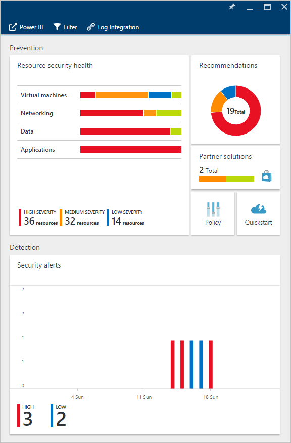 

2. Das Blade **: Untersuchen der Daten in Power BI** wird auf der rechten Seite geöffnet, wie in der folgenden Abbildung dargestellt:

    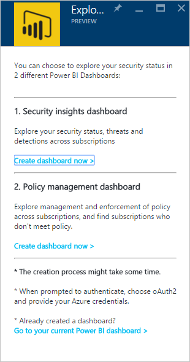

3. Wenn Sie das Power BI-Dashboard zum ersten Mal erstellen, können Sie eine der folgenden Optionen in der Blade **: Untersuchen der Daten in Power BI** -auswählen: 

    - **Sicherheit Einsichten Dashboard**: Wählen Sie diese Option aus, wenn Sie möchten von Dashboards, die Sicherheitsstatus, Threads und Erkennung enthält. Diese Option ist eine weitere gemeinsame für DevOps Rolle, die zum Analysieren von deren Schutzstatus verantwortlich ist und Benachrichtigungen über Abonnements erkannt.
    - **Richtlinie Management Dashboard**: Wählen Sie diese Option aus, wenn Sie Management und Durchsetzung Richtlinie auswerten möchten.  Diese Option ist eine weitere gemeinsame für zentralen IT, die mehr auf Governance befasst sind. Mit diesem Dashboard können sie um Sichtbarkeit und Einblicken auf Einhaltung der Richtlinie Sicherheit in ihrer Organisation zu erhalten.
    - Wenn Sie bereits über eine Power BI-Dashboard haben, klicken Sie auf **Gehe zu Ihrem aktuellen Power BI-Dashboard**.

4. Klicken Sie in diesem Beispiel auf **Sicherheit Einsichten Dashboard** -Option. Wenn dies das erste Mal ist, erstellen Sie ein Power BI-Dashboard für das Sicherheitscenter, die Sie aufgefordert werden, das Inhalte Pack zu installieren. Klicken Sie auf **erste** Schaltfläche im **Inhalt Packs für Power BI** -Fenster, wie in der folgenden Abbildung dargestellt:

    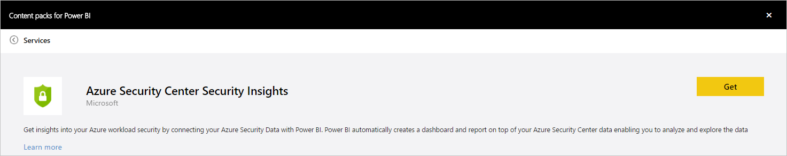

5. Das Fenster **mit Azure Security Center Fakten zum Thema Sicherheit** angezeigt. Vergewissern Sie sich **die Authentifizierungsmethode** **oAuth2** wie unten dargestellt ist, und klicken Sie auf die Schaltfläche **Anmelden** .
    
    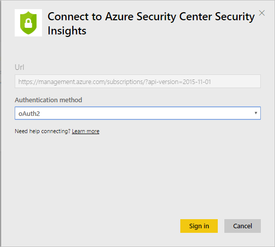

6. Sie möglicherweise aufgefordert, erneut mit Ihrer Azure Anmeldeinformationen authentifizieren. Nach der Authentifizierung des Dashboards wird erstellt. Nachdem das Dashboard erstellt wurde sehen Sie einen Bericht mit ähnlicher Struktur, wie in der folgenden Abbildung dargestellt:

    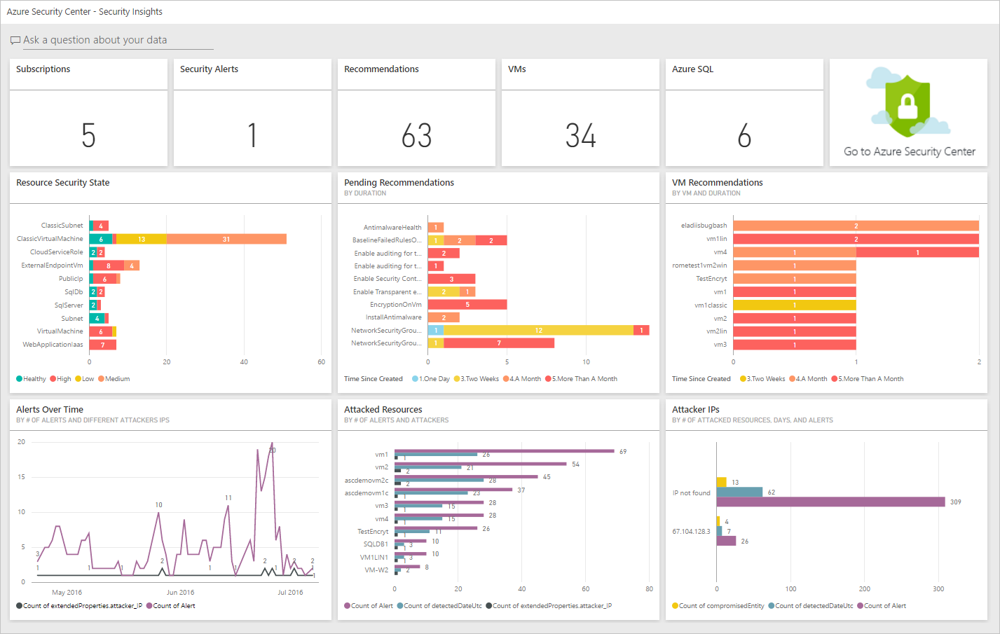

> [AZURE.NOTE] Eine Aktualisierung des Berichts ist stattfinden täglich berechnet. Für den Fall, dass Sie einen Fehler auf diese Aktualisierung auftreten, lesen Sie [Potenzielle aktualisieren Probleme mit der Power BI Azure Security Center](https://blogs.msdn.microsoft.com/azuresecurity/2016/04/07/azure-security-center-power-bi-refresh-fails/)für Weitere Informationen zur Problembehandlung bei.

Hier sehen Sie die Anzahl von Sicherheitshinweisen und Empfehlungen und die Anzahl der virtuellen Computern, SQL Azure-Datenbanken und Netzwerk-Ressourcen, die vom Sicherheitscenter Azure überwacht wird.

Ein Link zu Azure-Sicherheitscenter leitet Sie Azure-Portal an. Die Diagramme erleichtern Visualisieren von Informationen zu Sicherheit Empfehlungen und Benachrichtigungen, einschließlich:

- Status der Ressource-Sicherheit
- Ausstehende Empfehlungen
- Virtueller Computer Empfehlungen
- Benachrichtigungen über einen Zeitraum
- Betroffenen Ressourcen
- Betroffenen IP-Adressen

Hinter jedes Diagramm gibt es zusätzliche Hinweise. Wählen Sie eine Kachel, um weitere Informationen anzuzeigen. Zeigt beispielsweise die **Status der Ressource Sicherheit** Kachel Sie weitere Details zu ausstehend Empfehlungen von Ressourcen wie in der folgenden Abbildung dargestellt:

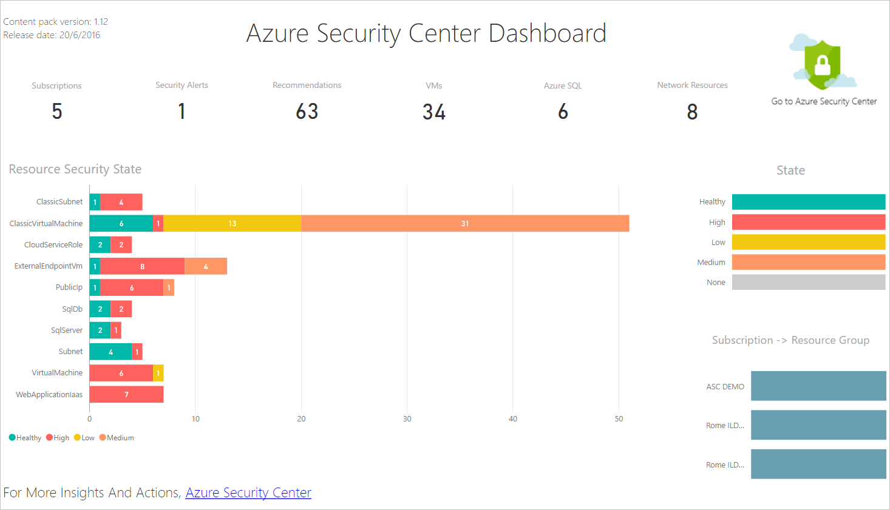

Wenn Sie auf eine Zeile diesem Diagramm klicken, werden die anderen grau, und Sie den Fokus nur auf den vertraut, die Sie ausgewählt haben. Um zu dem Dashboard zurückzukehren, klicken Sie auf **Sicherheitscenter Azure** unter die Option **Dashboards** im linken Bereich der Seite.

> [AZURE.NOTE] Wenn Sie Ihre Berichte zu anpassen, indem Sie zusätzliche Felder hinzufügen oder Ändern der vorhandenen visuellen Objekte möchten, können Sie den Bericht bearbeiten. Weitere Informationen finden Sie bei [Interaktion mit einem Bericht in der Bearbeitungsansicht in Power BI](https://powerbi.microsoft.com/documentation/powerbi-service-interact-with-a-report-in-editing-view/) .

Die Kacheln **Benachrichtigungen im Laufe der Zeit Ressourcen angegriffen** und **Angreifer IP -Adressen** , ähnlich wie die Ausgabe die müssen, beim Klicken auf jeweils davon. Dies geschieht, da der Bericht Informationen über alle diese drei Variablen aggregiert und sie **Ressourcen Angriffen** , ruft wie in der folgenden Abbildung dargestellt:

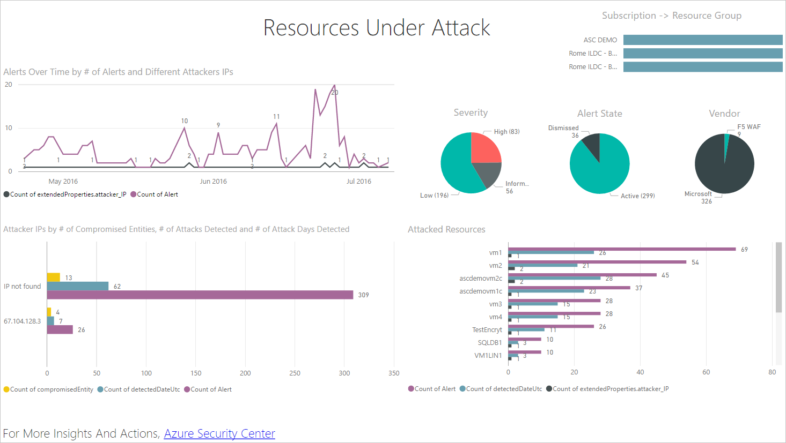

An diesem Punkt können auch eine Kopie der diesen Bericht speichern, drucken oder mithilfe der Optionen im Menü **Datei** auf im Web veröffentlichen.

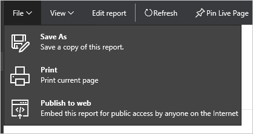

## Untersuchen von Sicherheitscenter Azure-Daten mit Power BI-Dienste

Eine Verbindung mit der [Power BI Inhalte Pack dieser Dienste](https://msit.powerbi.com/groups/me/getdata/services) in Power BI aus, und führen Sie folgende Schritte aus:

1. Klicken Sie im **Inhalt Pack für Power BI** sehen Sie zwei Optionen wie unten dargestellt.

    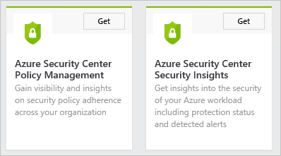

    >[AZURE.NOTE] Wenn Sie bereits im ersten Teil dieses Artikels ausgeführt sehen Sie nur eine Möglichkeit, also Azure Security Center Richtlinienmanagement.

2. Klicken Sie in diesem Beispiel wird in der Kachel **Azure Security Center Richtlinienmanagement** auf **Abrufen** .

3. Das Fenster **Verbinden zur Azure Center Richtlinie-Verwaltung** Vergewissern Sie sich zum Auswählen von **oAuth2** unter **Authentifizierungsmethode** Dropdown-siehe unten, und klicken Sie auf die Schaltfläche **Anmelden** .

    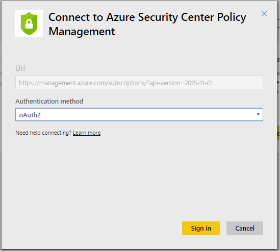

4. Sie können zu einer Authentifizierungsseite umgeleitet werden, Sie die Anmeldeinformationen, die Sie verwenden eingeben sollten, um die Verbindung mit Azure-Sicherheitscenter. Nach Abschluss der Authentifizierung wird Power BI gestartet Importieren von Daten, um Ihre Berichte zu erstellen. Dieses Zeitraums wird möglicherweise in der rechten Ecke des Browsers die folgende Meldung angezeigt:

    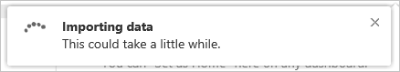

    >[AZURE.NOTE] Beim Erstellen das Dashboard zum ersten Mal erstellt wird kann es, vor allem für Szenarien dauert länger, in dem Sie mehrere Abonnements haben. 

5. Nachdem der Vorgang abgeschlossen ist, wird Ihr Azure Security Center Power BI-Dashboard mit dem **Policy Management** Bericht ähnlich dem unten gezeigten geladen:

    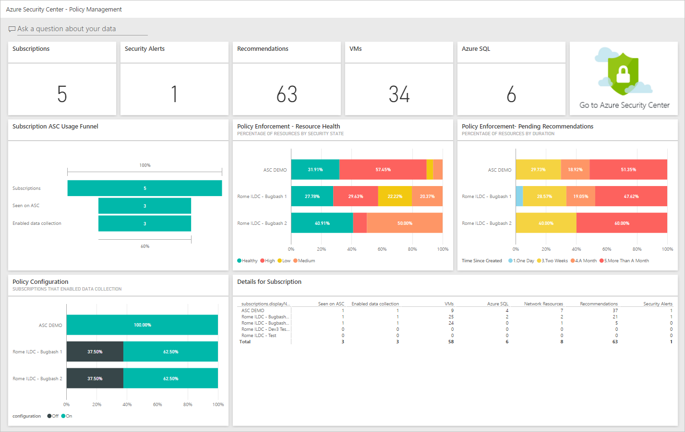

## Siehe auch
In diesem Dokument haben Sie die Verwendung von Power BI Azure-Sicherheitscenter. Wenn Sie weitere Informationen zur Azure-Sicherheitscenter, probieren Sie Folgendes ein:

- [Planen der Azure Sicherheit Center und Operations Guide](security-center-planning-and-operations-guide.md) – Informationen zum Planen der Azure-Sicherheitscenter Annahme.
- [Einrichten von Sicherheitsrichtlinien für die in Azure Sicherheitscenter](security-center-policies.md) – Informationen zum Konfigurieren von Sicherheitseinstellungen in Azure-Sicherheitscenter
- [Verwalten von und Beantworten von Sicherheitshinweisen im Sicherheitscenter Azure](security-center-managing-and-responding-alerts.md) – Informationen zum Verwalten und Beantworten von Sicherheitshinweisen
- [Häufig gestellte Fragen zur Azure Security Center](security-center-faq.md) – häufig gestellte Fragen zur Verwendung des Dienstes suchen
- [Azure Security Blog](http://blogs.msdn.com/b/azuresecurity/) – Suchen nach Blogbeiträge zu Azure Sicherheit und Kompatibilität
