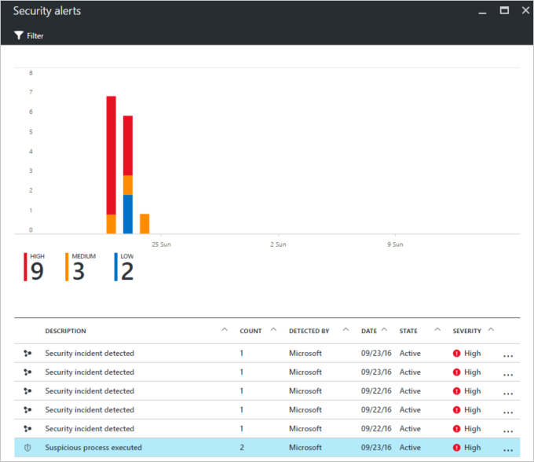
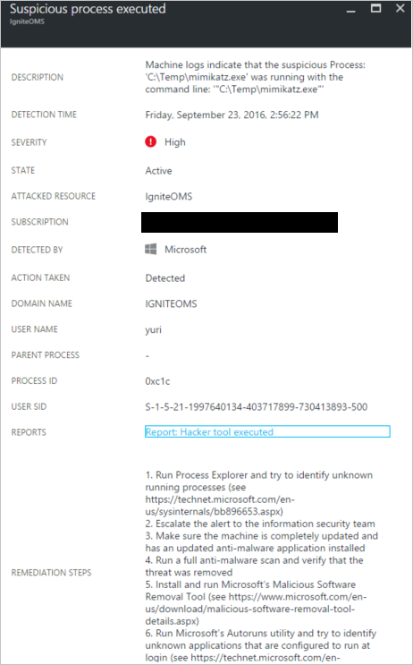
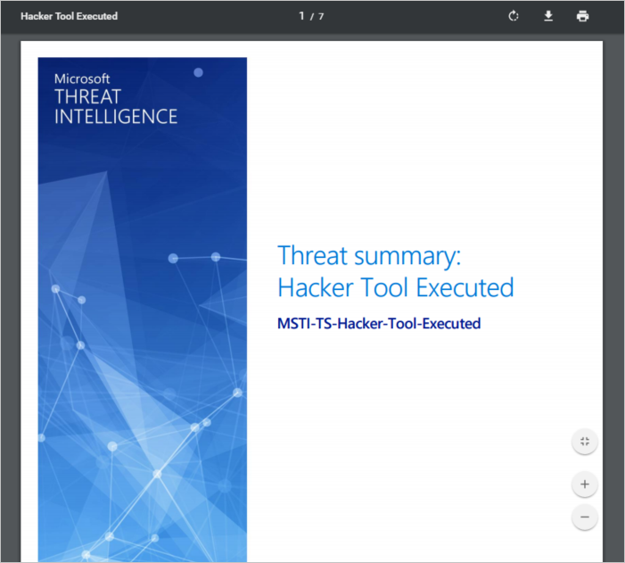

<properties
   pageTitle="Azure-Sicherheitscenter Threat Intelligence Report | Microsoft Azure"
   description="Dieses Dokument hilft Ihnen, die während der Untersuchung Azure Security Center Bedrohung intelligente Berichte verwenden, finden Sie weitere Informationen zu einem Sicherheitshinweis."
   services="security-center"
   documentationCenter="na"
   authors="YuriDio"
   manager="swadhwa"
   editor=""/>

<tags
   ms.service="security-center"
   ms.devlang="na"
   ms.topic="hero-article"
   ms.tgt_pltfrm="na"
   ms.workload="na"
   ms.date="10/17/2016"
   ms.author="yurid"/>

# Azure-Sicherheitscenter Threat Intelligence Report
Dieses Dokument wird erläutert, wie Azure Security Center Bedrohung intelligente Berichte können Sie weitere Informationen zur ein darstellen, die eine Warnung generiert.

## Was ist eine Bedrohung Intelligence Bericht?
Sicherheitscenter Erkennung funktioniert, wenn Sie Informationen aus Azure Ressourcen, die Netzwerk- und verbundenen partnerlösungen Sicherheit Überwachung. Er analysiert diese Informationen, die häufig Verknüpfen von Informationen aus mehreren Quellen, um Risiken zu identifizieren. Dieser Vorgang ist Teil der Sicherheitscenter [Erkennungsfunktionen](security-center-detection-capabilities.md). 

Wenn ein darstellen Sicherheitscenter erkannt wird, wird es einer [Sicherheitshinweis](security-center-managing-and-responding-alerts.md)auslösen die enthält ausführliche Informationen zu einem bestimmten Ereignis, einschließlich Vorschläge für die Behebung. Reaktion zur Unterstützung der Teams ermitteln und Beheben von Risiken Sicherheitscenter enthält einen Threat Intelligence-Bericht, der Informationen über das Risiko, die erkannt wurde enthält, einschließlich Informationen wie die: 

- Seine Identität oder Zuordnungen (falls diese Informationen zur Verfügung steht)
- Angreifern Ziele
- Aktuelle und zurückliegende Angriffen massensendungen zu ermitteln (falls diese Informationen zur Verfügung steht)
- Angreifern Taktiken, Tools und Verfahren
- Der Kompromisse (IoC) wie URLs und Dateihashes zugeordneten Indikatoren
- Victimology, also die Branche und geografischen Verteilung zu unterstützen Sie ermitteln, ob Ihre Azure Ressourcen Risiko sind
- Reduzierung and Behebung Informationen

>[AZURE.NOTE] Die Menge der Informationen in einen bestimmten Bericht ist unterschiedlich; die Detailebene basiert auf Aktivität und Verteilung des Schadsoftware.

Sicherheitscenter enthält drei Arten von Bedrohung Berichte, die sich entsprechend der Angriffen unterscheiden zu können. Die verfügbaren Berichte sind:

- **Die Gruppenbericht Vertriebsaktivität**: Tiefe Details in Angreifern, ihre Ziele und Taktiken enthält.
- **Für eine Marketingkampagne Bericht**: liegt der Schwerpunkt auf Details zu bestimmten Angriffen massensendungen zu ermitteln. 
- **Zusammenfassungsbericht Bedrohung**: alle Elemente in den vorherigen zwei Berichten behandelt.

Diese Art von Informationen während des Prozesses [Reaktion](security-center-incident-response.md) ist sehr hilfreich, in eine laufende Untersuchung zu verstehen, die Quelle für die Angriffen, seine Gründe und was zu tun ist, um dieses Problem nach vorne verschieben zu verringern vorhanden ist. 

## Wie den Bedrohung Intelligence Bericht zugreifen?

Indem Sie die Kachel **von Sicherheitshinweisen** können Sie Ihre aktuellen Benachrichtigungen überprüfen. Öffnen Sie das Azure-Portal, und folgen Sie den Schritten unten, um weitere Details zu jeder Benachrichtigung anzuzeigen:

1. Die Kachel **von Sicherheitshinweisen** auf dem Dashboard Sicherheitscenter wird angezeigt.

2. Klicken Sie auf die Kachel, um das Blade **Sicherheitswarnungen** zu öffnen, das weitere Details zu der Benachrichtigungen enthält, und klicken Sie auf der sicherheitswarnung, die Sie weitere Informationen zu erhalten möchten.

    

3. In diesem Fall zeigt das Blade **verdächtigen Prozesse ausgeführt** die Details der Warnung aus, wie in der folgenden Abbildung dargestellt:

    

4.  Die Menge der Informationen, die für jeden Sicherheitshinweis verfügbar variieren je nach Art der Benachrichtigung. Klicken Sie in das Feld " **Berichte** " müssen Sie einen Link zu den Threat Intelligence-Bericht aus. Klicken Sie darauf, und ein anderes Browserfenster mit PDF-Datei angezeigt.

    

Hier können Sie die PDF-Datei für den Bericht und Weitere Informationen das Problem, das erkannt wurde herunterladen und Aktionen basierend auf den Informationen zur Verfügung gestellt.

## Siehe auch

In diesem Dokument haben Sie gelernt, wie Azure Security Center Bedrohung intelligente Berichte während der Untersuchung zu von Sicherheitshinweisen helfen können. Wenn Sie weitere Informationen zur Azure-Sicherheitscenter, probieren Sie Folgendes ein:

- [Azure Sicherheitscenter häufig gestellte Fragen](security-center-faq.md). Häufig gestellte Fragen zur Nutzung des Diensts zu finden.
- [Nutzung der Azure-Sicherheitscenter für Vorfall Antwort](security-center-incident-response.md)
- [Azure-Sicherheitscenter Erkennung-Funktionen](security-center-detection-capabilities.md)
- [Leitfaden Azure Sicherheitscenter Planung und Betrieb](security-center-planning-and-operations-guide.md). Informationen Sie zum Planen und grundlegende Informationen zu den Entwurfsaspekte Azure-Sicherheitscenter Sichtspalten übernehmen.
- [Verwalten von und Beantworten von Sicherheitshinweisen in Azure Sicherheitscenter](security-center-managing-and-responding-alerts.md). Informationen Sie zum Verwalten und Beantworten von Sicherheitshinweisen.
- [Behandeln von Sicherheitsvorfall in Azure-Sicherheitscenter](security-center-incident.md)
- [Sicherheit von Azure-Blog](http://blogs.msdn.com/b/azuresecurity/). Suchen nach, dass Blogbeiträge zu Azure Sicherheit und Kompatibilität.
