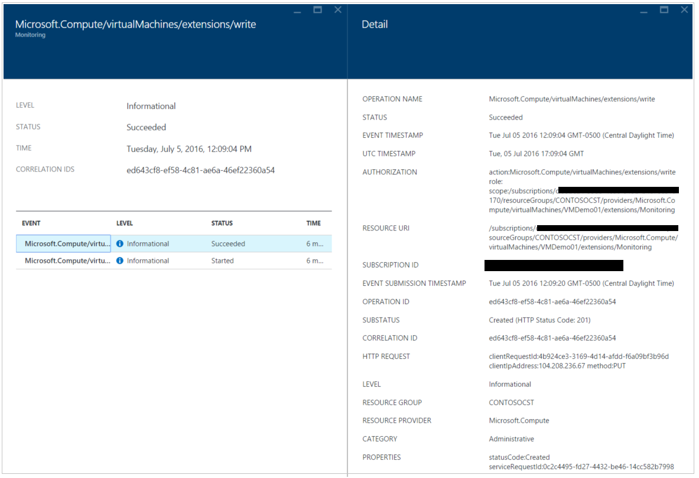
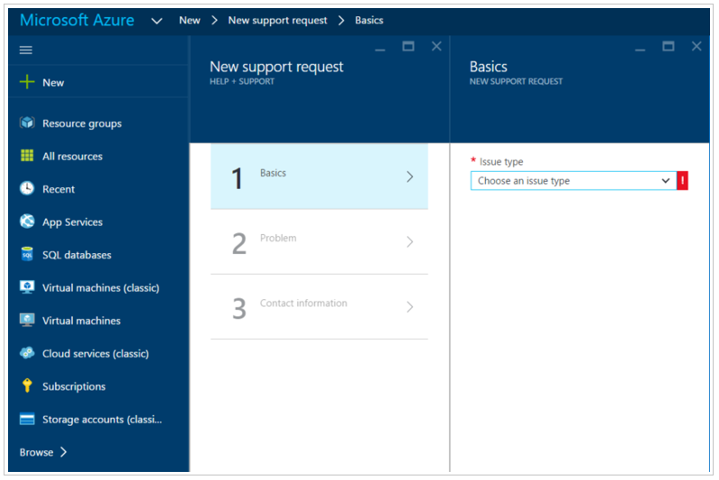

<properties
   pageTitle="Azure-Sicherheitscenter Problembehandlungsleitfadens | Microsoft Azure"
   description="Dieses Dokument unterstützt von Problemen in Azure Sicherheitscenter."
   services="security-center"
   documentationCenter="na"
   authors="YuriDio"
   manager="swadhwa"
   editor=""/>

<tags
   ms.service="security-center"
   ms.devlang="na"
   ms.topic="hero-article"
   ms.tgt_pltfrm="na"
   ms.workload="na"
   ms.date="10/18/2016"
   ms.author="yurid"/>

# Azure-Sicherheitscenter Handbuch zur Problembehandlung
Dieses Handbuch ist für IT-Experten (IT), Informationen Sicherheitsanalysten und Cloud-Administratoren, deren Organisationen Sicherheitscenter Azure verwenden und bei der Problembehandlung für, das Sicherheitscenter Problemen im Zusammenhang.

## Leitfadens zur Problembehandlung
Mit diesem Leitfaden wird erläutert, wie Behandeln von Problemen mit Sicherheitscenter zusammenhängende Probleme. Die meisten der Problembehandlung im Sicherheitscenter fertig erfolgt nach den ersten Blick auf die [Überwachungsprotokoll](https://azure.microsoft.com/updates/audit-logs-in-azure-preview-portal/) -Einträge für die fehlerhafte Komponente. Durchlaufen der Überwachungsprotokolle können Sie ermitteln:

- Welche Vorgänge vorgenommen wurden
- Wer initiiert den Vorgang
- Wenn der Vorgang wurde
- Der Status des Vorgangs
- Die Werte anderer Eigenschaften, die Ihnen helfen, möglicherweise Recherchieren des Vorgangs

Im Überwachungsprotokoll enthält alle Schreiboperationen (sich, Beitrag, löschen) auf Ressourcen, jedoch nicht gelesen Vorgänge (GET) enthalten.

## Problembehandlung bei der Überwachung Agentinstallation in Windows

Das Sicherheitscenter überwachender Agent wird verwendet, um die Datensammlung ausführen. Nachdem Datensammlung aktiviert ist, und der Agent ordnungsgemäß in der Ziel-Computer installiert ist, sollten folgende Prozesse bei der Ausführung:

- ASMAgentLauncher.exe - Agent für die Überwachung Azure 
- ASMMonitoringAgent.exe - Erweiterung Azure Überwachung der Sicherheit
- ASMSoftwareScanner.exe – Azure Scan-Manager

Die Erweiterung Azure Sicherheit Überwachung für verschiedene Sicherheit relevanten Konfiguration scannt und sammelt Sicherheitsprotokolle von des virtuellen Computers. Der Scan Manager wird als einen Scanner Patch verwendet werden.

Wenn die Installation erfolgreich durchgeführt wird, sollten Sie einen Eintrag ähnlich wie der Abbildung unten in der Überwachungsprotokolle für das Ziel virtueller Computer sehen:

Sie können auch weitere Informationen zu den Installationsvorgang abrufen, indem Sie die Agentenprotokolle, am *%systemdrive%\windowsazure\logs* (Beispiel: C:\WindowsAzure\Logs).

> [AZURE.NOTE] Wenn der Azure-Center-Agent problematische ist, müssen Sie das Ziel virtueller Computer neu starten, da es gibt keinen Befehl zum Beenden und starten Sie den Agent.

## Problembehandlung bei der Überwachung Agentinstallation in Linux
Bei der Problembehandlung virtueller Computer Agent-Installation in einem Linux System sollten Sie sicherstellen, dass die Erweiterung in/Var/Bibliothek/Waagent/heruntergeladen wurde. Sie können den folgenden Befehl zur Überprüfung, wenn es installiert wurde, ausführen:

`cat /var/log/waagent.log` 

Die anderen Protokolldateien, die Sie überprüfen können zur Behandlung dieses Problems Zweck sind: 

- /var/log/mdsd.Err
- / Var/Log/Azure /

In einem System arbeiten sollte eine Verbindung mit dem Mdsd Prozess auf TCP 29130 angezeigt werden. Hierbei handelt es sich um die Kommunikation mit dem Mdsd Prozess Syslog. Sie können dieses Verhalten überprüfen, indem Sie den folgenden Befehl ausführen:

`netstat -plantu | grep 29130`

## Microsoft-Support kontaktieren

Einige Probleme können anhand der Richtlinien, sofern in diesem Artikel, die Sie auch finden, andere Personen zu dem Sicherheitscenter öffentlichen [Forum](https://social.msdn.microsoft.com/Forums/en-US/home?forum=AzureSecurityCenter)dokumentieren identifiziert werden. Jedoch, wenn Sie weitere müssen Problembehandlung, können Sie öffnen, eine neue Supportanfrage Azure-Portal verwenden, wie unten dargestellt: 

## Siehe auch

In diesem Dokument gelernt Sie Azure-Sicherheitscenter Sicherheitsrichtlinien konfigurieren. Wenn Sie weitere Informationen zur Azure-Sicherheitscenter, probieren Sie Folgendes ein:

- [Planen der Azure Sicherheit Center und Operations Guide](security-center-planning-and-operations-guide.md) – Informationen zum Planen und grundlegende Informationen zu den Entwurfsaspekte Azure-Sicherheitscenter Sichtspalten übernehmen.
- [Sicherheit Dienststatus überwachen im Sicherheitscenter Azure](security-center-monitoring.md) – erfahren, wie Sie die Integrität des Azure Ressourcen überwachen.
- [Verwalten von und Beantworten von Sicherheitshinweisen im Sicherheitscenter Azure](security-center-managing-and-responding-alerts.md) – Informationen zum Verwalten und Beantworten von Sicherheitshinweisen
- [Überwachen von partnerlösungen mit Azure-Sicherheitscenter](security-center-partner-solutions.md) – erfahren, wie Sie den Status des Ihrer partnerlösungen zu überwachen.
- [Häufig gestellte Fragen zur Azure Security Center](security-center-faq.md) – häufig gestellte Fragen zur Verwendung des Dienstes suchen
- [Azure Security Blog](http://blogs.msdn.com/b/azuresecurity/) – Suchen nach Blogbeiträge zu Azure Sicherheit und Kompatibilität
