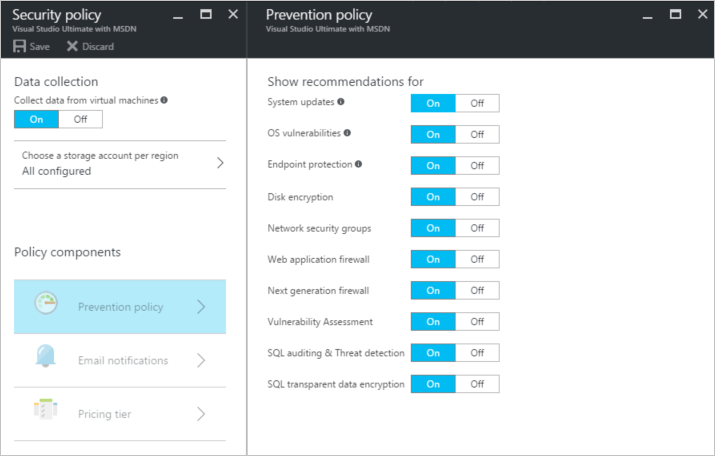
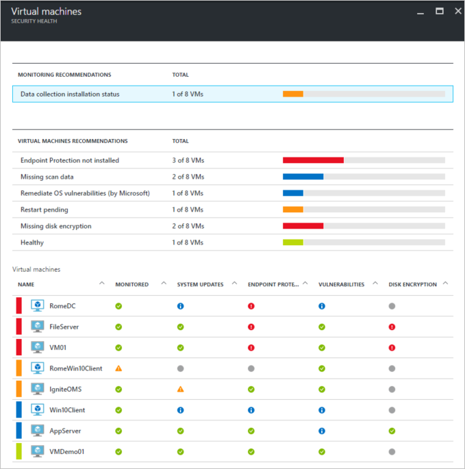
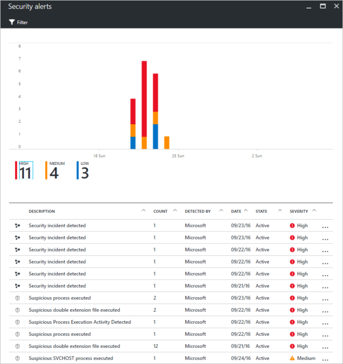

<properties
   pageTitle="Azure-Sicherheitscenter und Azure-virtuellen Computern | Microsoft Azure"
   description="Dieses Dokument hilft Ihnen zu verstehen, wie Azure-Sicherheitscenter Azure-virtuellen Computern an einem sicheren Ort können."
   services="security-center"
   documentationCenter="na"
   authors="YuriDio"
   manager="swadhwa"
   editor=""/>

<tags
   ms.service="security-center"
   ms.devlang="na"
   ms.topic="hero-article"
   ms.tgt_pltfrm="na"
   ms.workload="na"
   ms.date="10/07/2016"
   ms.author="yurid"/>

# Azure-Sicherheitscenter und Azure-virtuellen Computern

[Azure Sicherheitscenter](https://azure.microsoft.com/services/security-center/) hilft Ihnen der verhindern, erkennen und Beantworten von Risiken. Es bietet integrierte Sicherheit Überwachung und Policy Management über Ihre Azure-Abonnements, hilft Angriffen, die andernfalls aufgefallen und funktioniert mit einem ausgedehnten System von Lösungen Sicherheit erkennen.

In diesem Artikel zeigt an, wie das Sicherheitscenter Sie Ihre Azure-virtuellen Computern (VM) secure helfen können.

## Gründe für die Verwendung von Sicherheitscenter

Sicherheitscenter hilft Ihnen der virtuellen Computerdaten in Azure schützen können, indem Sie die Transparenz Ihres virtuellen Computers Sicherheitseinstellungen. Wenn das Sicherheitscenter Ihrer virtuellen Computern sichert, werden die folgenden Funktionen zur Verfügung:

- Betriebssystem (BS) Sicherheitseinstellungen mit den Regeln empfohlene Konfiguration
- System Sicherheitsupdates und Updates, die nicht vorhanden sind
- Endpunkt Schutz Empfehlungen
- Überprüfung der Datenträger-Verschlüsselung
- Sicherheitsrisiko Bewertung und Korrektur
- Erkennung

Nicht nur Ihre Azure-virtuellen Computern zu schützen, bietet Sicherheitscenter auch Sicherheit die Überwachung und Verwaltung für Cloud Services-App Services, virtuelle Netzwerke und vieles mehr. 

>[AZURE.NOTE] Finden Sie unter [Einführung in das Sicherheitscenter Azure](security-center-intro.md) erfahren Sie mehr über das Sicherheitscenter Azure.

## Erforderliche Komponenten

Um mit dem Azure-Sicherheitscenter anzufangen, müssen Sie wissen, und beachten Folgendes:

- Sie müssen ein Microsoft Azure-Abonnement verfügen. Weitere Informationen über das Sicherheitscenter kostenlosen und den Standardversionen Ebenen finden Sie unter [Sicherheit Center Preise](https://azure.microsoft.com/pricing/details/security-center/) .
- Planen Sie Ihrer Annahme Sicherheitscenter, finden Sie unter [Sicherheitscenter Azure Planung und Betrieb Leitfaden](security-center-planning-and-operations-guide.md) erfahren Sie mehr über die Planung und Betrieb Aspekte.
- Weitere Informationen über die Unterstützung von Betriebssystem finden Sie unter [Azure Sicherheitscenter häufig gestellte Fragen (FAQS)](security-center-faq.md). 

## Festgelegte Sicherheitsrichtlinie

Datensammlung muss aktiviert sein, damit diese Azure Sicherheitscenter, dass die benötigten Informationen sammeln können, geben Sie Empfehlungen und Benachrichtigungen, die generiert werden basierend auf der Sicherheitsrichtlinie Sie konfigurieren. In der folgenden Abbildung können Sie sehen, dass **Datensammlung** wurde **aktiviert**.

Eine Sicherheitsrichtlinie definiert die Steuerelemente, die für Ressourcen innerhalb des angegebenen Abonnement oder Ressourcengruppe vorgeschlagen werden. Bevor UFI-Sicherheitsrichtlinie, müssen Sie Datensammlung aktiviert, Sicherheitscenter sammelt Daten aus Ihrem virtuellen Computern und zu bewerten, deren Sicherheitsstatus, Vorschläge, wie Sicherheit, informieren Sie über Risiken. Im Sicherheitscenter definieren Sie Richtlinien für Ihre Azure-Abonnements oder Ressourcengruppen gemäß Ihres Unternehmens Sicherheit Anforderungen und Anwendungstyp oder Vertraulichkeit der Daten in jedes Abonnement. 

>[AZURE.NOTE] Weitere Informationen zu jeder **Prevention Richtlinie** verfügbar sind, finden Sie unter [Festlegen von Sicherheitsrichtlinien](security-center-policies.md) Artikel.

## Verwalten der Sicherheit Empfehlungen

Sicherheitscenter analysiert den Sicherheitszustand Azure Ressourcen. Beim Sicherheitscenter potenzieller Sicherheitslücken bezeichnet, erstellt Empfehlungen. Die Empfehlungen führen Sie durch die Verfahren zum Konfigurieren der erforderlichen Steuerelemente.

Nach dem Einrichten einer Sicherheitsrichtlinie, analysiert Sicherheitscenter den Sicherheitsstatus Ihrer Ressourcen zur Identifizierung möglicher Sicherheitslücken. Die Empfehlungen werden in einem Tabellenformat angezeigt, wobei jede Zeile eine bestimmte Empfehlungen darstellt. In der nachfolgenden Tabelle enthält einige Beispiele für Empfehlungen für Azure-virtuellen Computern und was wird jeweils tun, wenn Sie es anwenden. Wenn Sie eine Empfehlungen auswählen, werden Informationen bereitgestellt, die Sie wird gezeigt, wie die Empfehlungen im Sicherheitscenter implementieren.

|Empfehlungen|Beschreibung|
|-----|-----|
|[Datensammlung für Abonnements aktivieren](security-center-enable-data-collection.md)|Empfiehlt, dass Sie in Ihrer Abonnements Datensammlung in der Sicherheitsrichtlinie für jede Ihrer Abonnements und alle virtuellen Computern (virtuellen Computern) aktivieren.|
|[OS Schwachstellen kurzfristig zu beheben](security-center-remediate-os-vulnerabilities.md)|Empfiehlt, dass Sie Ihre Konfigurationen OS mit der Regeln für die empfohlene Konfiguration ausrichten z. B. zulassen nicht Kennwörter gespeichert werden.|
|[Anwenden von System-updates](security-center-apply-system-updates.md)|Empfiehlt, dass Sie fehlende System Sicherheitsupdates und wichtige Updates auf virtuellen Computern bereitstellen.|
|[Neu starten, wenn System-updates](security-center-apply-system-updates.md#reboot-after-system-updates)|Empfiehlt, dass Sie einen virtuellen zum Abschließen des Vorgangs der Anwendung System-Updates neu starten.|
|[Installieren der Endpunkt Schutz](security-center-install-endpoint-protection.md)|Empfiehlt die Bereitstellung von Modul-Programmen für virtuellen Computern (virtuelle nur für Windows-Computer).|
|[Beheben von Endpunkt Schutz Gesundheit Benachrichtigungen](security-center-resolve-endpoint-protection-health-alerts.md)|Empfiehlt, dass Sie Endpunkt Schutz Fehler beheben.|
|[Aktivieren der virtuellen Computer-Agents](security-center-enable-vm-agent.md)|Ermöglicht es Ihnen, finden Sie unter dem virtuellen Computern erfordern des virtuellen Computer-Agents. Des virtuellen Computer-Agents muss auf virtuellen Computern installiert sein, um die Bereitstellung von Patch scannen, geplante Scannen und Modul-Programmen. Der virtuellen Computer Agent ist standardmäßig für virtuelle Computer installiert, die aus dem Azure Marketplace bereitgestellt werden. [Virtueller Computer-Agents und Erweiterungen – Teil 2](http://azure.microsoft.com/blog/2014/04/15/vm-agent-and-extensions-part-2/) Artikel enthält Informationen zum Installieren des virtuellen Computer-Agents an.|
| [Anwenden von Datenträger-Verschlüsselung](security-center-apply-disk-encryption.md) |Empfiehlt, dass Sie Ihre virtuellen Computer Datenträger mit Azure Datenträger Verschlüsselung (Windows und Linux virtuellen Computern) verschlüsseln. Verschlüsselung wird für das Betriebssystem und die Daten Datenmengen Ihrer virtuellen Computers empfohlen.|
| [Sicherheitsrisiko Bewertung nicht installiert](security-center-vulnerability-assessment-recommendations.md) | Empfiehlt, eine Sicherheitsrisiko Bewertung Lösung Ihrer virtuellen Computers zu installieren. |
| [Behebung von Schwachstellen](security-center-vulnerability-assessment-recommendations.md#review-recommendation) | Ermöglicht es Ihnen System und Anwendung Sicherheitslücken erkannt durch die Sicherheitsrisiko Bewertung Lösung Ihrer virtuellen Computers installiert angezeigt. |

>[AZURE.NOTE] Erfahren Sie mehr über Empfehlungen, finden Sie unter [Verwalten von Sicherheit Empfehlungen](security-center-recommendations.md) Artikel.

## Überwachen Sicherheit Systemzustands

Nachdem Sie [Sicherheitsrichtlinien](security-center-policies.md) für Ressourcen ein Abonnement aktiviert haben, wird das Sicherheitscenter die Sicherheit Ihrer Ressourcen zur Identifizierung möglicher Sicherheitslücken analysieren.  Sie können den Sicherheitszustand Ihrer Ressourcen sowie Probleme in der **Ressource Sicherheit Gesundheit** Blade anzeigen. Wenn Sie in der **Ressource Sicherheit** Gesundheit Kachel **virtuellen Computern** klicken, wird das Blade **virtuellen Computern** mit Empfehlungen für Ihre virtuellen Computer geöffnet. 

## Verwalten und Beantworten von Sicherheitshinweisen

Sicherheitscenter automatisch erfasst, analysiert und Integration von Log-Daten aus Azure Ressourcen, die Netzwerk- und verbundenen partnerlösungen (wie Firewall und Endpunkt Schutz Lösungen), um real Risiken erkennen und falsche positive zu verringern. Durch die Nutzung einer unterschiedlichen Aggregation [Erkennung](security-center-detection-capabilities.md)-Funktionen, ist das Sicherheitscenter Priorität von Sicherheitshinweisen, mit denen Sie schnell das Problem zu untersuchen und Vorschläge, wie zur Vorgehensweise zur Behebung von möglicher Angriffen generieren können.

Wählen Sie eine sicherheitswarnung Weitere Informationen zu den Ereignissen, die die Benachrichtigung und was, ausgelöst wenn vorhanden, Schritte Sie zur Behebung von Angriffen durchführen müssen. Von Sicherheitshinweisen sind nach [Typ](security-center-alerts-type.md) und Datum gruppiert.

## Siehe auch

Weitere Informationen zum Sicherheitscenter, probieren Sie Folgendes ein:

- [Einrichten von Sicherheitsrichtlinien für die in Azure Sicherheitscenter](security-center-policies.md) – Informationen zum Konfigurieren von Richtlinien für Ihre Azure-Abonnements und Ressourcengruppen.
- [Verwalten von und Beantworten von Sicherheitshinweisen im Sicherheitscenter Azure](security-center-managing-and-responding-alerts.md) – Informationen zum Verwalten und Beantworten von Sicherheitshinweisen.
- [Häufig gestellte Fragen zur Azure Security Center](security-center-faq.md) – suchen häufig gestellte Fragen zur Verwendung des Dienstes.
