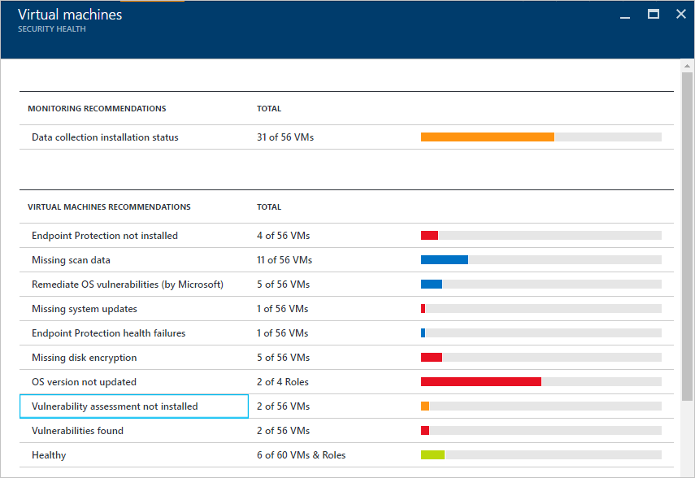
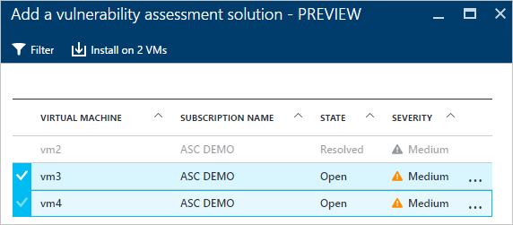
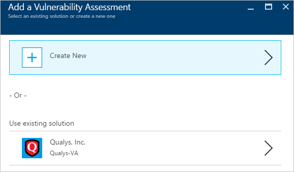
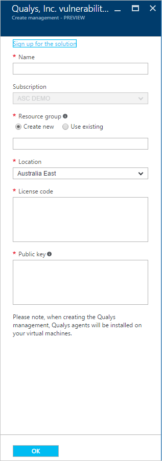
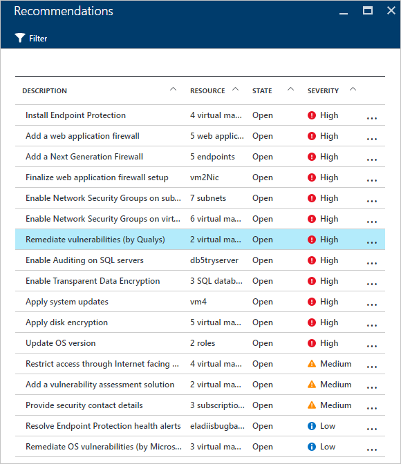
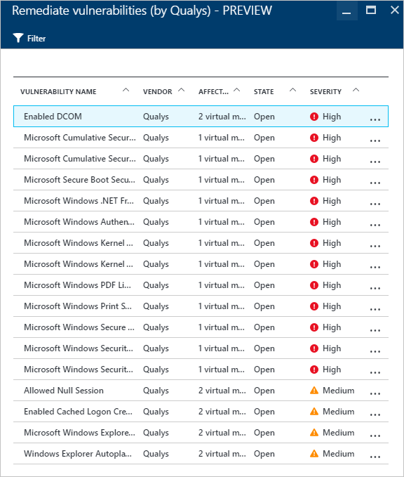
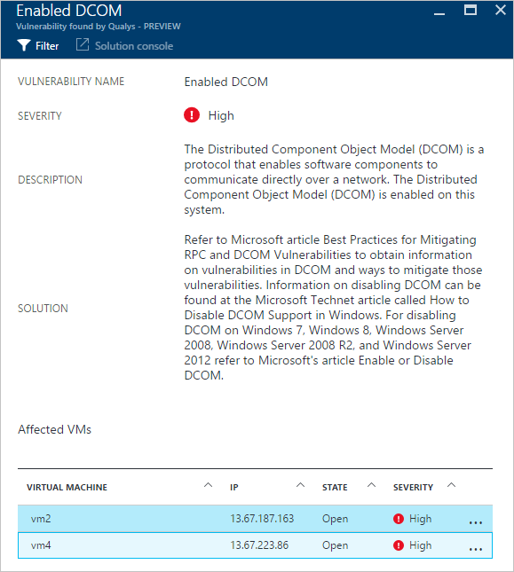

<properties
   pageTitle="Sicherheitsrisiko Bewertung im Sicherheitscenter Azure | Microsoft Azure"
   description="Dieses Dokument beantwortet Empfehlungen im Sicherheitscenter Azure, mit denen Sie Ihre virtuellen Computer durch Installieren der Lösung eines Sicherheitsrisiko Bewertung schützen."
   services="security-center"
   documentationCenter="na"
   authors="YuriDio"
   manager="swadhwa"
   editor=""/>

<tags
   ms.service="security-center"
   ms.devlang="na"
   ms.topic="hero-article"
   ms.tgt_pltfrm="na"
   ms.workload="na"
   ms.date="09/27/2016"
   ms.author="yurid"/>

# Sicherheitsrisiko Bewertung im Sicherheitscenter Azure
Dieses Dokument beantwortet Sicherheitsrisiko Bewertung Empfehlungen anwendbare virtuellen Computern in Azure ausgeführt werden.

## Was ist die Bewertung Sicherheitsrisiko?

Die Bewertung Sicherheitsrisiko im Sicherheitscenter Azure ist Teil der Empfehlungen virtuellen virtuellen Computern (Computer). Findet Sicherheitscenter keine Sicherheitsrisiko Bewertung Lösung, die auf Ihre virtuellen Computer installiert ist, wird es empfiehlt sich, dass eine Installation. Sobald bereitgestellt, der Partner-Agent beginnt Sicherheitsrisiko Berichtsdaten des Partners Management Platform das Sicherheitsrisiko wiederum bereitstellt und Gesundheit Überwachung Daten zum Sicherheitscenter zurück. Benutzer können schnell zu erkennen gefährdet virtuellen Computern aus Sicherheitscenter Dashboard und weitere Berichte und Informationen durch das Wechseln zur Partner-Verwaltungskonsole direkt aus Sicherheitscenter abrufen können.

> [AZURE.NOTE] Dieses Dokument wird den Dienst mithilfe einer Beispiel-bereitstellungs eingeführt. Dies ist keine schrittweise Anleitung.

## Einschränkungen Public Preview-Version

Die folgenden Einschränkungen gelten für den aktuellen Sicherheitsrisiko Bewertung public Preview-Version:

- Die einzige Partner Sicherheitsrisiko Bewertung Lösung zur Verfügung steht [Qualys](https://www.qualys.com/lp/azure). Weitere werden, in der Zukunft hinzugefügt.
- Sie können die Sicherheitsrisiko Bewertung Lösung in mehreren virtuellen Computern installieren, solange sie im selben Abonnement angehören.
- Nur Windows virtuellen Computern werden unterstützt, Linux virtuellen Computern für allgemeine Verfügbarkeit (GA) hinzugefügt werden.

## Implementieren der virtuellen Computern Empfehlungen

Wenn Sicherheitscenter eine identifiziert oder mehrere unterstützte virtuellen Computern, die eine Sicherheitsrisiko Bewertung Lösung fehlt, wird ein virtueller Computer Empfehlungen ausgelöst werden. Die folgenden Schritte zeigen, wie zugreifen und diese Empfehlungen für mehrere virtuellen Computern, die mit dem gleichen Abonnement gehören anwenden:

1. Klicken Sie in der Kachel **Ressource Sicherheit Dienststatus** auf **virtuellen Computern**
2. Wählen Sie in das Blade **virtuellen Computern** **Sicherheitsrisiko Bewertung nicht installiert** , wie in der folgenden Abbildung dargestellt:

    

3. Wählen Sie das **Hinzufügen einer Sicherheitsrisiko Bewertung Lösung - Vorschau** Blade der virtuellen Computern, die Sie die Sicherheitsrisiko Bewertung Lösung, wie in der folgenden Abbildung gezeigt installieren möchten:

    

4. Klicken Sie auf **Installieren auf 2 virtuellen Computern** (der Namen variieren gemäß der Anzahl von virtuellen Computern, die Sie ausgewählt haben) option und das **Hinzufügen von Sicherheitsrisiko Bewertung** Blade angezeigt wird in das **Hinzufügen einer Sicherheitsrisiko Bewertung Lösung - Vorschau** Blade wie in der folgenden Abbildung dargestellt:

    

5. In dieser Blade, die Sie auswählen können, um ein neues Sicherheitsrisiko erstellen kann Bewertung, dem Sie wählen Sie eine Lösung Partner **Azure Marketplace** , oder Sie können eine vorhandene Partner-Lösung unter vorhandene Lösung, in diesem Fall **Qualys**verwenden auswählen.

## Erstellen einer neuen Sicherheitsrisiko Bewertung Lösung

Wenn Sie mehrere Abonnements verfügen, können Sie ein Sicherheitsrisiko Bewertung Lösung für jedes Abonnement erstellen. Die wichtigsten Schritte sind die gleichen wie im vorherigen Abschnitt aufgelistet, die nur abweicht, die in Schritt 4, die Sie in die Option **Neu erstellen** klicken werden. Gehen Sie nach Auswahl dieser Option folgendermaßen vor, um den Vorgang fortzusetzen.

> [AZURE.NOTE] Im folgende Beispiel wird die Qualys verwendet. Um einen Cloud-Agent Qualys aus Sicherheitscenter bereitzustellen benötigen Sie eine Lizenzcode und öffentlicher Schlüssel aus Qualys. Finden Sie in der [Dokumentation Qualys](https://community.qualys.com/docs/DOC-5823-deploying-qualys-cloud-agents-from-microsoft-azure-security-center) zum Abrufen der Lizenzcode und öffentlicher Schlüssel.

1. Klicken Sie auf den Namen des Partners, in diesem Fall **Qualys**, in das **Erstellen einer neuen Sicherheitsrisiko Bewertung** Blade.
2. Des Partners Blade wird geöffnet. In diesem Blade angezeigte Felder können geändert werden gemäß den Partner, in diesem Beispiel, dass wir **Qualys**verwendet wird:

    

3. Geben Sie im Feld **Name** den Namen für diese Lösung aus. Sie können einen Namen, der verknüpft mit Ressourcengruppe oder Abonnement, die Sie daran binden möchten.
4. Wählen Sie im Feld **Abonnement** des Abonnements, die Sie für diese Lösung verwenden möchten.
5. Wählen Sie eine vorhandene Ressourcengruppe im Feld **Ressourcengruppe** oder erstellen Sie einen neuen.
6. Wählen Sie im Feld **Ort** , wo diese Lösung geografischen gespeichert werden sollen.
7. In das Feld für die **Lizenz-Code** (Dies ist für Qualys bestimmte), geben Sie die Lizenz ein, die vom Partner bereitgestellt wurden.
8. Im Feld **öffentlicher Schlüssel** (Dies ist für Qualys bestimmte), geben Sie die Informationen des öffentliche Schlüssels vom Partner bereitgestellt wurden, und klicken Sie auf **OK**.

## Überprüfen Sie Empfehlungen

Sobald die Lösung Sicherheitsrisiko Bewertung am Ziel virtuellen Computer installiert ist, wird es den virtuellen Computer zum Erkennen und Identifizieren von System und Anwendung Schwachstellen scannen.

> [AZURE.NOTE] Dauert es ein paar Stunden für die erste Überprüfung abgeschlossen und danach ist es ein stündlich Prozess.

Klicken Sie unter Optionen **Virtuellen Computern Empfehlungen** werden diese Probleme angezeigt werden. Das folgende Beispiel zeigt, wie die Empfehlungen unter dem Blade **Empfehlungen** angezeigt wird:

In diesem Beispiel zeigt die ausgewählten empfohlen, dass die Erkennung von Qualys durchgeführt wurde. Wenn Sie auf diese Empfehlungen klicken, werden kein neuer Blade mit einer Liste von Sicherheitslücken angezeigt, wie in der folgenden Abbildung dargestellt:

Diese Liste zeigt alle Sicherheitsrisiko schwere Reihenfolge und die Anzahl der virtuellen Computern, die von diesem Problem betroffen. In diesem Beispiel wird das Sicherheitsrisiko DCOM aktivieren aktiviert wurde und einer neuen Blade mit der empfohlenen Schritte dieses Problem behoben werden:

## Siehe auch

In diesem Dokument gelernt Sie Sicherheitsrisiko Bewertung Empfehlungen im Sicherheitscenter Azure anwenden. Wenn Sie weitere Informationen zur Azure-Sicherheitscenter, probieren Sie Folgendes ein:

- [Leitfaden Azure Sicherheitscenter Planung und Betrieb](security-center-planning-and-operations-guide.md). Informationen Sie zum Planen und grundlegende Informationen zu den Entwurfsaspekte Azure-Sicherheitscenter Sichtspalten übernehmen.
- [Sicherheit Gesundheit Azure Sicherheitscenter zu überwachen](security-center-monitoring.md). Erfahren Sie, wie die Integrität des Azure Ressourcen zu überwachen.
- [Verwalten von und Beantworten von Sicherheitshinweisen in Azure Sicherheitscenter](security-center-managing-and-responding-alerts.md). Informationen Sie zum Verwalten und Beantworten von Sicherheitshinweisen.
- [Überwachen von partnerlösungen mit Azure-Sicherheitscenter](security-center-partner-solutions.md). Erfahren Sie, wie Sie den Status des Ihrer partnerlösungen zu überwachen.
- [Azure Sicherheitscenter häufig gestellte Fragen](security-center-faq.md). Häufig gestellte Fragen zur Verwendung des Dienstes suchen.
- [Sicherheit von Azure-Blog](http://blogs.msdn.com/b/azuresecurity/). Suchen nach, dass Blogbeiträge zu Azure Sicherheit und Kompatibilität.
