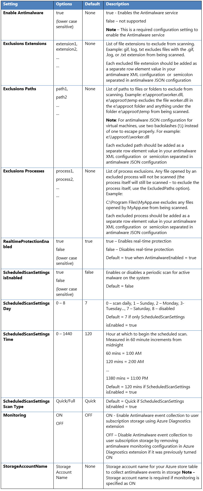

<properties
   pageTitle="Microsoft-Modul für Azure-Cloud-Diensten und virtuellen Computern | Microsoft Azure"
   description="Dieser Artikel bietet einen Überblick über Microsoft Antimalware für Azure, einschließlich unterstützten Szenarien und Konfigurationen für das aktivieren, konfigurieren und Bereitstellen von Schutz für Azure-Cloud-Diensten und virtuellen Computern. Grundlegende Konfiguration, Verwaltung und Überwachung der Funktionen, die über Microsoft Azure Servicemanagement API des PowerShell-Skripts, Azure-Portal und Visual Studio werden behandelt."
   services="security"
   documentationCenter="na"
   authors="YuriDio"
   manager="swadhwa"
   editor=""/>

<tags
   ms.service="security"
   ms.devlang="na"
   ms.topic="article"
   ms.tgt_pltfrm="na"
   ms.workload="na"
   ms.date="09/19/2016"
   ms.author="yurid"/>

#Microsoft-Modul für Azure-Cloud-Diensten und virtuellen Computern

Die moderne Bedrohungslage für Cloud-Umgebungen ist den Druck auf das Unternehmen IT zunehmender extrem dynamische cloud Abonnenten effektiven Schutz verwalten, um Compliance und Sicherheit erfüllen. Microsoft Antimalware für Azure-Cloud-Diensten und virtuellen Computern ist kostenlosen Schutz in Echtzeit-Funktion, die zu identifizieren Entfernen von Viren, Spyware und anderer bösartiger Software, mit konfigurierbare Benachrichtigungen und, wenn bekannt, dass bösartige oder unerwünschte Software versucht, installiert oder auf Ihren Azure-Systemen ausgeführt.

Die Lösung basiert auf der gleichen Modul Plattform als Microsoft Security Essentials \[MSE\], Microsoft Forefront Endpunkt Protection, Microsoft System Center Endpunkt Protection, Windows Intune und Windows Defender für Windows 8.0 oder höher. Microsoft Antimalware für Azure ist eine Single-Agent-Lösung für Applikationen und Mandanten Umgebungen, die im Hintergrund ohne personenbezogenen Eingriff ausgeführt werden sollen. Sie können Schutz basierend auf den Anforderungen Ihrer Auslastung, mit entweder grundlegende secure standardmäßige oder benutzerdefinierte Konfiguration, einschließlich der Überwachung Modul Erweiterte bereitstellen.

Wenn Sie bereitstellen und Microsoft Antimalware für Azure für Ihre Applikationen aktivieren, stehen die folgenden Core-Funktionen zur Verfügung:

- **Schutz in Echtzeit** - Monitore Aktivität in der Cloud Services und auf virtuellen Computern zu erkennen und Schadsoftware Ausführung blockieren.
- **Geplante Überprüfung** - führt regelmäßig gezielte Scannen zum Ermitteln von Schadsoftware, einschließlich der Programme aktiv ausgeführt wird.
- **Behebung von Schadsoftware** - Ausführung automatische von Aktionen auf erkannten Schadsoftware, z. B. löschen oder bösartige Dateien isolieren und Bereinigen von bösartiger Registrierungseinträge.
- **Signatur-Updates** – installiert automatisch, um sicherzustellen, dass Schutz auf dem neuesten Stand auf einer vordefinierten Häufigkeit ist die neuesten Schutzsignaturen (Virusdefinitionen).
- **Modul-Engine-Updates** – aktualisiert automatisch die Microsoft Antimalware-Engine.
- **Modul Plattform Updates** – aktualisiert automatisch die Microsoft Antimalware-Plattform.
- **Aktive Schutz** - Berichte werden Metadaten zu erkannten Risiken und verdächtigen Ressourcen in Microsoft Azure, um sicherzustellen, dass schnelle Antwort auf die Weiterentwicklung von Bedrohungslage, als auch in Echtzeit synchroner Signatur Übermittlung über die Microsoft aktiven Schutz System (MAPS) aktivieren.
- **Beispiele reporting** - bietet und Berichte Beispiele zum Dienst Microsoft Antimalware besser optimieren den Dienst und Problembehandlung aktivieren.
- **Ausschlüsse** – ermöglicht Anwendung und Dienstadministratoren bestimmte Dateien, Prozesse und Laufwerke konfigurieren sie Schutz und Leistung und/oder aus anderen Gründen gesucht ausgeschlossen werden.
- **Modul Ereignis Websitesammlung** - Einträge der Dienststatus Modul, verdächtige Aktivitäten und von Behebungsaktionen im Ereignisprotokoll Betriebssystem und sammelt diese in die Kundenkontos Azure-Speicher.

> [AZURE.NOTE] Microsoft Antimalware kann auch mithilfe von Azure-Sicherheitscenter bereitgestellt werden. Weitere Informationen finden Sie bei [Endpunkt Schutz im Sicherheitscenter Azure installieren](../security-center/security-center-install-endpoint-protection.md) . 

##Architektur

Die Microsoft Antimalware für Azure-Cloud-Diensten und virtuellen Computern Lösung enthält Microsoft Antimalware Client und Dienst Modul klassischen Bereitstellungsmodell, Antimalware PowerShell-Cmdlets und eine Durchwahl Azure-Diagnose. Die Microsoft Antimalware-Lösung wird unter Windows Server 2008 R2, Windows Server 2012 und Windows Server 2012 R2 Betriebssystemfamilien unterstützt. Es wird auf dem Betriebssystem Windows Server 2008 nicht unterstützt. Zu diesem Zeitpunkt Windows Server Technical Preview wird nicht unterstützt, und wir beabsichtigen, es in Zukunft zu unterstützen.

Microsoft Antimalware Client und Dienst ist standardmäßig deaktiviert in alle unterstützten Azure Gast Betriebssystemfamilien in der Cloud Services-Plattform installiert. Microsoft Antimalware Client und Dienst ist standardmäßig in der Plattform virtuellen Computern nicht installiert und als ein optionales Feature, über die Azure-Portal und Konfiguration der Visual Studio-virtuellen Computern unter Sicherheit Erweiterungen verfügbar ist.

Wenn mit Azure-Websites, die zugrunde liegenden Dienst, der das Web app hostet Microsoft Antimalware daran aktiviert hat. Dies wird verwendet, um Websites Azure Infrastruktur schützen und Kunden Inhalt wird nicht ausgeführt. 

###Microsoft-Modul workflow

Der Azure Service-Administrator kann Modul für Azure mit einer Standard- oder benutzerdefinierte Konfiguration für Ihre virtuellen Computern und Cloud-Diensten mit den folgenden Optionen aktivieren:

-   Virtuellen Computern – im Azure-Portal unter **Sicherheit Erweiterungen**

-   Virtuellen Computern – mit der Konfiguration der Visual Studio-virtuellen Computern im Server-Explorer

-   Virtuellen Computern und Cloud Services – mit dem Modul [Modell zur klassischen Bereitstellung](https://msdn.microsoft.com/library/azure/ee460799.aspx)

-   Virtuellen Computern und Cloud Services – verwenden von Modul PowerShell-cmdlets

Der Azure-Portal oder PowerShell-Cmdlets drücken Sie die Modul Erweiterung Paketdatei an das Azure System an einem zuvor festgelegten festen Standort aus. Der Azure Gast-Agent (oder die Fabric-Agent) startet die Modul-Erweiterung, die Modul Konfiguration Einstellungen bereitgestellt hat, als Eingabe anwenden. In diesem Schritt können den Dienst Modul mit den Standardfarben oder benutzerdefinierte Konfiguration Einstellungen. Wenn keine benutzerdefinierte Konfiguration bereitgestellt wird, ist der Dienst Modul mit den Standardeinstellungen für die Konfiguration aktiviert. Finden Sie in der [Microsoft-Modul für Azure-Cloud-Diensten und virtuellen Computern – Codebeispielen](http://aka.ms/amazsamples "Microsoft-Modul für Azure Cloud Services und virtuellen Computern Codebeispielen") Weitere Details im Abschnitt *Modul Konfiguration* .

Sobald ausgeführt wird, wird der Microsoft Antimalware-Client-downloads für den neuesten Schutz-Engine und Signatur Definitionen aus dem Internet und Azure System geladen. Der Microsoft Antimalware-Dienst schreibt Ereignisse im Zusammenhang mit dem Dienst in das System OS-Ereignisprotokoll unter der Quelle "Microsoft Antimalware". Ereignisse beziehen Sie den Integritätsstatus Modul Clients, Schutz und Behebung Status, Einstellungen für die neuen und alten Konfiguration, Engine-Updates und Signaturdefinitionen und andere.

Sie können das Modul für Ihre Cloud-Dienst oder virtuellen Computern Modul Ereignisse Ereignisprotokoll geschrieben, wie sie sich bei Ihrem Konto Azure-Speicher gefertigt wurden Überwachung aktivieren. Die Antimalware Service verwendet die Erweiterung Azure-Diagnose zum Erfassen von Modul Ereignisse aus dem Azure System in Tabellen in der vom Kunden Azure-Speicher-Konto an.

Der Bereitstellungsworkflow, einschließlich Konfigurationsschritte und Optionen für die obigen Szenarios unterstützt werden im [Modul Bereitstellungsszenarien](#_Antimalware_Deployment_Scenarios) Abschnitt dieses Dokuments beschrieben.

> [AZURE.NOTE] Powershell-APIs und Azure Ressourcenmanager Vorlagen können jedoch virtuellen Computern skalieren Datensätze mit der Erweiterung Microsoft-Anti-Malware bereitstellen.  Für eine Erweiterung auf einem bereits laufenden virtuellen Computern installiert haben, können Sie die Stichprobe Python Skript *vmssextn.py* befindet sich [hier](https://github.com/gbowerman/vmsstools). Dieses Skript ruft die vorhandene Erweiterung Config auf die Skalierung festlegen und die Liste der vorhandenen Erweiterungen auf den virtuellen Computer Maßstab Sätzen eine Erweiterung hinzugefügt.

###Standard- und benutzerdefinierte Modul Konfiguration

Die Konfiguration Standardeinstellungen werden angewendet, um die Modul für Azure Cloud Services oder virtuellen Computern aktivieren, wenn Sie keinen benutzerdefinierten Konfiguration Einstellungen angeben. Die Konfiguration Standardeinstellungen wurden für die Ausführung von in der Azure-Umgebung, die vorab optimierten. Optional können Sie diese Konfiguration Standardeinstellungen je nach Bedarf für Ihre Azure-Anwendung oder Dienst Bereitstellung anpassen und anderen Szenarien für die Bereitstellung beantragen.

> [AZURE.NOTE] Standardmäßig ist die Benutzeroberfläche von Microsoft Modul auf Azure Ressourcenmanager deaktiviert, wird diese Fehlermeldung umgehen [cleanuppolicy.xml](https://blogs.msdn.microsoft.com/azuresecurity/2016/02/24/update-on-microsoft-antimalware-and-azure-resource-manager-arm-vms/) Datei nicht unterstützt. Informationen zum Erstellen einer benutzerdefinierten Richtlinie finden Sie unter [Aktivieren von Microsoft Modul-Benutzeroberfläche auf virtuellen Computern Beitrag Bereitstellung von Azure Ressource Manager](https://blogs.msdn.microsoft.com/azuresecurity/2016/03/09/enabling-microsoft-antimalware-user-interface-post-deployment/). 

In der folgenden Tabelle enthält eine Übersicht über die Konfiguration Einstellungen für den Dienst Modul verfügbar. Klicken Sie unter der Spalte mit der Bezeichnung "Standard" werden die Standardeinstellungen für die Konfiguration markiert.

##Szenarien für die Bereitstellung von Modul

In diesem Abschnitt werden die Szenarien zum Aktivieren und Konfigurieren von Modul, einschließlich Überwachung für Azure-Cloud-Diensten und virtuellen Computern erläutert.

###Virtueller Computer – aktivieren und Konfigurieren der Modul

**Bereitstellung mithilfe von Azure-Portal**

Klicken Sie zum Aktivieren des Diensts Modul klicken Sie auf **Hinzufügen** , klicken Sie auf das Blade Erweiterungen **Microsoft-Modul** auf das neue Ressource Blade aus, klicken Sie auf das Microsoft Antimalware Blade auf **Erstellen** . Klicken Sie auf **Erstellen** , ohne alle Konfigurationswerte zum Aktivieren von Modul mit den Standardeinstellungen eingeben, oder geben Sie im Modul Konfiguration Einstellungen des virtuellen Computers so konfiguriert ist, wie in der Abbildung 2 unten dargestellt. Finden Sie in den **QuickInfos** mit jeder Einstellung Konfiguration auf das Hinzufügen der Erweiterung Blade unterstützte Konfigurationswerte finden Sie unter bereitgestellt.

**Bereitstellung über das klassische Azure-portal**

Zum Aktivieren und Konfigurieren von Microsoft Antimalware für Azure virtuellen Computern Azure-Portal während der Bereitstellung eines virtuellen Computers verwenden, und führen Sie die folgenden Schritte aus:

1.Klicken melden Sie sich das Azure-Portal unter <https://portal.azure.com> bei

2.Klicken um einen neuen virtuellen Computer zu erstellen, klicken Sie auf **neu** **zu berechnen**, **virtuellen** **Computers**, **Vom Katalog** (verwenden Sie nicht schnellen Erstellen) wie unten dargestellt:

3.Klicken Wählen Sie das **Microsoft Windows Server** -Bild auf der Seite **Wählen Sie ein Bild** aus.

4.konfigurieren klicken Sie auf den Pfeil nach rechts, und geben Sie die Konfiguration des virtuellen Computers.

5 ° Kontrollkästchen Sie das **Microsoft-Modul** unter **Sicherheit Erweiterungen** auf der Seite des virtuellen Computers konfigurieren.

6. Klicken Sie auf die Schaltfläche senden, um zu aktivieren und Konfigurieren von Microsoft Antimalware für Azure virtuellen Computern mit den Standardeinstellungen für die Konfiguration.

**Verwenden die Konfiguration des virtuellen Computers Visual Studio Bereitstellung**

Aktivieren und Konfigurieren des Microsoft Antimalware Service mit Visual Studio:

1.Klicken verbinden Sie mit Microsoft Azure in Visual Studio.

2.Klicken auswählen des virtuellen Computers in den **virtuellen Computern** Knoten im **Server-Explorer**

3.Klicken nach rechts klicken Sie auf **Konfigurieren** , um die Konfigurationsseite des virtuellen Computers anzeigen

4.konfigurieren wählen Sie 4.konfigurieren **Modul Microsoft** -Erweiterung aus der Dropdownliste unter **Extensions installiert** , und klicken Sie auf **Hinzufügen** , mit der standardmäßigen Modul Konfiguration konfigurieren.

5 ° zum Anpassen der Standard-Modul-Konfigurations, wählen Sie in der Liste der installierten Erweiterungen (hervorheben) im Modul Erweiterung aus, und klicken Sie auf **Konfigurieren**.

6. Ersetzen Sie 6. die standardmäßige Modul Konfiguration durch Ihre individuelle Konfiguration in unterstützten JSON-Format in das Textfeld **öffentlichen Konfiguration** , und klicken Sie auf OK.

7.das Klicken Sie auf die Schaltfläche **Aktualisieren** , um die Konfiguration Updates nach Ihrer virtuellen Computers zu verschieben.

**Hinweis:** Die Konfiguration der Visual Studio-virtuellen Computern für Modul unterstützt nur JSON-Formatkonfiguration. Die Antimalware JSON-Konfiguration Einstellungen Vorlage ist in der [Microsoft-Modul für Azure Cloud Services und virtuellen Computern - Codebeispielen](http://aka.ms/amazsamples "Microsoft-Modul für Azure Cloud Services und virtuellen Computern - Codebeispielen"), mit der unterstützten Modul Konfiguration Einstellungen enthalten.

**Bereitstellung mithilfe von PowerShell-cmdlets**

Ein Azure-Anwendung oder einen bestimmten Dienst kann aktivieren und Konfigurieren von Microsoft Antimalware für Azure virtuellen Computern PowerShell-Cmdlets verwenden.

So aktivieren und Konfigurieren des Microsoft-Modul Modul PowerShell-Cmdlets verwenden:

1. Einrichten Ihrer Umgebung PowerShell - schlagen Sie in der Dokumentation unter <https://github.com/Azure/azure-powershell>

2. Verwenden Sie das Cmdlet "Set-AzureVMMicrosoftAntimalwareExtension Modul" aktivieren und Konfigurieren von Microsoft Antimalware für den virtuellen Computer wie erläutert am <http://msdn.microsoft.com/library/azure/dn771718.aspx>

**Hinweis:** Die Konfiguration Azure-virtuellen Computern für Modul unterstützt nur JSON-Formatkonfiguration. Die Antimalware JSON-Konfiguration Einstellungen Vorlage ist in der [Microsoft-Modul für Azure Cloud Services und virtuellen Computern - Codebeispielen](http://aka.ms/amazsamples "Microsoft-Modul für Azure Cloud Services und virtuellen Computern - Codebeispielen"), mit der unterstützten Modul Konfiguration Einstellungen enthalten.

###Aktivieren und Konfigurieren von Modul mithilfe von PowerShell-cmdlets

Ein Azure-Anwendung oder einen bestimmten Dienst kann aktivieren und Konfigurieren von Microsoft Antimalware für Azure Cloud Services-PowerShell-Cmdlets verwenden. Beachten Sie, dass Microsoft Antimalware in deaktiviertem Zustand in der Cloud Services-Plattform installiert ist und eine Aktion durch eine Azure-Anwendung erfordert zu aktivieren.

Aktivieren und Konfigurieren von Microsoft Antimalware PowerShell-Cmdlets verwenden:

1.  Einrichten Ihrer Umgebung PowerShell - schlagen Sie in der Dokumentation unter <https://github.com/Azure/azure-sdk-tools#get-started>

2.  Verwenden Sie das Cmdlet "Set-AzureServiceAntimalwareExtension Modul" aktivieren und Konfigurieren von Microsoft Antimalware für Ihre Cloud-Dienst wie erläutert am <http://msdn.microsoft.com/library/azure/dn771718.aspx>

Die Antimalware XML-Konfiguration Einstellungen Vorlage ist in der [Microsoft-Modul für Azure Cloud Services und virtuellen Computern - Codebeispielen](http://aka.ms/amazsamples "Microsoft-Modul für Azure Cloud Services und virtuellen Computern - Codebeispielen"), mit der unterstützten Modul Konfiguration Einstellungen enthalten.

###Cloud-Diensten und virtuellen Computern - Konfiguration mithilfe der PowerShell-cmdlets

Ein Azure-Anwendung oder einen bestimmten Dienst kann die Microsoft Antimalware-Konfiguration für Cloud-Diensten und virtuellen Computern mit PowerShell-Cmdlets abrufen.

Abrufen von der Microsoft Antimalware-Konfiguration, die PowerShell-Cmdlets verwenden:

1.  Einrichten Ihrer Umgebung PowerShell - schlagen Sie in der Dokumentation unter <https://github.com/Azure/azure-sdk-tools#get-started>

2.  **Für virtuellen Computern**: Verwenden Sie das Cmdlet "Get-AzureVMMicrosoftAntimalwareExtension Modul", um die Konfiguration Modul abzurufen, wie bei <http://msdn.microsoft.com/library/azure/dn771719.aspx> erläutert

3.  **Für Cloud Services**: Verwenden Sie das Cmdlet "Get-AzureServiceAntimalwareConfig Modul", um die Konfiguration Modul abzurufen, wie bei <http://msdn.microsoft.com/library/azure/dn771722.aspx> erläutert

###Entfernen von Modul Konfiguration mithilfe von PowerShell-cmdlets

Eine Azure-Anwendung oder einen bestimmten Dienst kann die Konfiguration Modul und alle zugehörigen Modul Konfiguration Überwachung aus den relevanten Azure-Modul und Diagnose Dienst Erweiterungen mit der Cloud-Dienst oder virtuellen Computern verknüpften entfernen.

So entfernen Sie Microsoft Antimalware mithilfe der PowerShell-cmdlets

1.  Einrichten Ihrer Umgebung PowerShell - schlagen Sie in der Dokumentation unter <https://github.com/Azure/azure-sdk-tools#get-started>

2.  **Für virtuellen Computern**: Verwenden Sie das Cmdlet entfernen-AzureVMMicrosoftAntimalwareExtension Modul, wie zu <http://msdn.microsoft.com/library/azure/dn771720.aspx> dokumentieren,

3.  **Für Cloud Services:** Verwenden Sie das Cmdlet entfernen-AzureServiceAntimalwareExtension Modul, wie zu <http://msdn.microsoft.com/library/azure/dn771717.aspx> dokumentieren

Verwenden im Vorschau-Portal Azure Modul Ereignis-Auflistung für einen virtuellen Computer **Aktivieren** :

1.  Klicken Sie auf einen beliebigen Teil der Überwachung Lens in das Blade virtuellen Computern

2.  Klicken Sie auf den Befehl Diagnose metrischen blade

3.  Wählen Sie auf **Status** , und aktivieren Sie die Option für Windows-Ereignis-system 
4.  . Sie können auswählen, deaktivieren Sie alle anderen Optionen in der Liste, oder lassen sie pro Indexeigenschaften dienstanwendung aktiviert.

4.  Kategorien Ereignis Modul "Zurück", "Warnung", "Information" usw., werden in Ihrem Konto Azure-Speicher erfasst.

Modul Ereignisse werden aus den Windows-Ereignisprotokollen System bei Ihrem Konto Azure-Speicher erfasst. Sie können das Konto Speicherplatz für Ihre virtuellen Computers zu Modul Ereignisse zu erfassen, indem Sie das entsprechenden Speicherkonto auswählen konfigurieren.

> [AZURE.NOTE] Lesen Sie weitere Informationen zum Diagnoseprotokoll für Azure-Modul [Für Azure-Modul Diagnoseprotokoll aktivieren](https://blogs.msdn.microsoft.com/azuresecurity/2016/04/19/enabling-diagnostics-logging-for-azure-antimalware/)aus.

###Aktivieren und Konfigurieren der Modul für die Überwachung mit PowerShell-Cmdlets

Sie können die Sammlung von Microsoft Antimalware Ereignisse für Ihre Cloud-Dienst oder virtuellen Computern mit Azure-Diagnose durch Antimalware PowerShell-Cmdlets aktivieren. Die Erweiterung Azure-Diagnose kann zum Erfassen von Ereignissen aus der System-Ereignisprotokoll-Quelle "Microsoft Antimalware" bei Ihrem Konto Azure-Speicher konfiguriert werden. Kategorien Ereignis Modul "Zurück", "Warnung", "Information" usw., werden in Ihrem Konto Azure-Speicher erfasst.

So aktivieren Sie Modul Ereignis Websitesammlung bei Ihrem Speicher Azure-Konto mithilfe der PowerShell-cmdlets

1.  Einrichten Ihrer Umgebung PowerShell - verweisen auf <https://github.com/Azure/azure-sdk-tools#get-started>

2.  **Für virtuellen Computern** - Verwenden des Cmdlets Set-AzureVMMicrosoftAntimalwareExtension Modul mit Überwachung auf die Option als dokumentierten am <http://msdn.microsoft.com/library/azure/dn771716.aspx>

3.  **Für Cloud Services** - Verwenden des Cmdlets Set-AzureServiceAntimalwareExtension Modul mit Überwachung auf die Option als dokumentierten am <http://msdn.microsoft.com/library/azure/dn771718.aspx>

Sie können im Modul unformatierten Ereignisse anzeigen, indem Sie die Tabelle WADWindowsEventLogsTable in Ihrem Speicher Azure-Konto, die Sie so konfiguriert, dass das Modul für die Überwachung aktivieren. Dies kann zu überprüfen, ob das Modul Ereignis Websitesammlung arbeitet, einschließlich der erste Einblicke in das Modul Dienststatus, nützlich sein. Beispiel-Code zum Extrahieren Modul Ereignisse aus Ihrem Speicherkonto einschließlich Weitere Informationen hierzu finden Sie in [Microsoft-Modul für Azure Cloud Services und virtuellen Computern - Codebeispielen](http://aka.ms/amazsamples "Microsoft-Modul für Azure Cloud Services und virtuellen Computern - Codebeispielen").
