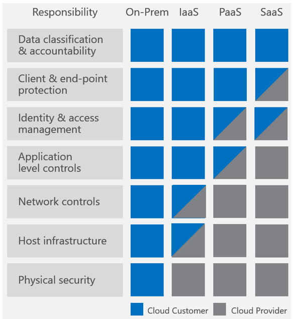
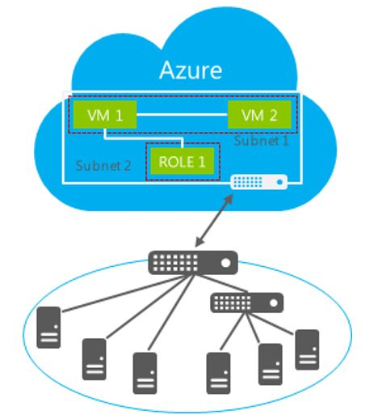

<properties
   pageTitle="Bewährte Methoden für Softwareupdates auf Microsoft Azure IaaS | Microsoft Azure"
   description="Artikel enthält eine Zusammenstellung von best Practices für Softwareupdates in einer Microsoft Azure IaaS-Umgebung.  Es ist für die IT-Profis vorgesehen und Sicherheitsanalysten, wer behandelt ändern-Steuerelement Software aktualisieren und Anlage Management täglich, einschließlich der Empfänger für ihre Organisation Sicherheits- und Compliance-anstrengungen verantwortlich."
   services="security"
   documentationCenter="na"
   authors="YuriDio"
   manager="swadhwa"
   editor=""/>

<tags
   ms.service="security"
   ms.devlang="na"
   ms.topic="article"
   ms.tgt_pltfrm="na"
   ms.workload="na"
   ms.date="10/18/2016"
   ms.author="yurid"/>

# Bewährte Methoden für Softwareupdates auf Microsoft Azure IaaS

Vor dem Einstieg in jede Art von Diskussion über bewährte Methoden für eine Azure [IaaS](https://azure.microsoft.com/overview/what-is-iaas/) -Umgebung, ist es wichtig, zu verstehen, was die Szenarien sind, die Sie Verwalten von Softwareupdates und den Zuständigkeiten aufweisen wird. Im nachstehenden Diagramm sollten Ihnen ein Verständnis dieser Grenzen:

Die Spalte ganz links zeigt sieben Zuständigkeiten (in den folgenden Abschnitten definiert), dass Organisationen zu berücksichtigen sind, die alle eigene Notizen hinzufügen können die Sicherheit und Datenschutz für einer Umgebung.
 
Klassifizierung von Daten und Zuständigkeit und Client und Endpunkt Schutz sind die Aufgaben, die ausschließlich in der Domäne des Kunden sind, und physische, Host und Netzwerk Zuständigkeiten in der Cloud-Dienstanbieter in den Modellen PaaS und SaaS-Domäne sind. 

Die verbleibenden Zuständigkeiten von mehreren Kunden und cloud-Dienstanbieter. Einige Zuständigkeiten erfordern der CSP und Kunden verwalten, und verwalten die Zuständigkeit zusammen, einschließlich Überwachung ihrer Domänen. Angenommen, erwägen Sie die Identität & zugreifen Sie Management, wenn Azure-Active Directory-Dienste verwenden; die Konfiguration von Diensten wie mehrstufige Authentifizierung ist auf den Kunden verantwortlich Microsoft Azure effektiven Funktionalität sichergestellt ist.

> [AZURE.NOTE] Weitere Informationen zu freigegebenen Zuständigkeiten in der Cloud finden Sie unter [Freigegebene Zuständigkeiten für Cloud Computing](https://gallery.technet.microsoft.com/Shared-Responsibilities-81d0ff91/file/153019/1/Shared%20responsibilities%20for%20cloud%20computing.pdf) 

Gleichen Prinzipien gelten in einem Hybriden Szenario, in dem Ihr Unternehmen Azure IaaS virtuellen Computern, die Kommunikation mit lokalen Ressourcen nutzt wie in der folgenden Abbildung gezeigt.

## Anfängliche Bewertung

Selbst wenn Ihr Unternehmen bereits ein Update Management-System verwenden ist und bereits Software Update Richtlinien direkte, ist es wichtig, häufig vorherigen Richtlinie Bewertung erneut, und aktualisieren sie Ihren aktuellen Anforderungen entsprechend. Dies bedeutet, dass Sie mit dem aktuellen Status der Ressourcen in Ihrem Unternehmen vertraut sein müssen. Um diesen Status zu erreichen, müssen Sie kennen:

-   Die physischen und virtuellen Computern im Unternehmen anzeigen.

-   Betriebssysteme und Versionen für diesen physischen und virtuellen Computern ausgeführt.

-   Softwareupdates derzeit auf jedem Computer (Service Pack-Versionen, Softwareupdates und andere Änderungen) installiert.

-   Die Funktion führt jeder Computer im Unternehmen anzeigen.

-   Der Anwendungen und auf jedem Computer ausgeführte Programme.

-   Besitz und Kontakt Informationen für jeden Computer.

-   Sie können die Anlagen in Ihrer Umgebung und deren relativer Wert zu bestimmen, welche Bereiche benötigen, die meiste Aufmerksamkeit und Schutz vorführen.

-   Bekannte Sicherheitsprobleme und den Prozessen hat Ihr Unternehmen eingeführt für Erkennungszeichen neue Sicherheitsprobleme oder Änderungen in Sicherheitsstufe.

-   Gegenmaßnahmen, die bereitgestellt wurden, um Ihre Umgebung zu sichern.

Sollten Sie diese Informationen regelmäßig aktualisieren, und es sollten nun jederzeit Ihre Software Update-Verwaltungsvorgang verbindet.

## Einrichten einer Basislinie

Ein wichtiger Bestandteil der Software Update-Prozess ist Initiale standard-Installationen von Versionen des Betriebssystems,-Anwendungen und Hardware auf Computern im Unternehmen anzeigen erstellen; Diese werden Basisplänen bezeichnet. Ein Basisplan ist die Konfiguration von einer eingerichteten Produkts oder Systems zu einem bestimmten Zeitpunkt. Eine Anwendung oder Betriebssystem Basisplan bietet beispielsweise die Möglichkeit, einen Computer oder Dienst auf einen bestimmten Zustand neu erstellen.

Basisplänen bieten die Grundlage für potenzielle Probleme erkennen und beheben und Aktualisierungsvorgang Management Software durch Verringern der Anzahl von Software-Updates, die Sie in Ihrem Unternehmen bereitstellen müssen sowohl durch Erhöhen der Möglichkeit zum Überwachen der Einhaltung von Vorschriften in zu vereinfachen.

Nach Durchführung des anfänglichen Audits Ihres Unternehmens, sollten Sie die Informationen verwenden, die aus der Audit zum Definieren einer Betrieb Basisplan für IT-Komponenten in Ihrer Umgebung Herstellung ermittelt wird. Eine Anzahl von Basisplänen möglicherweise erforderlich, je nach die verschiedenen Typen von Hard- und Software in Betrieb bereitgestellt.

Einige Server erfordern beispielsweise ein Software-Update, um zu verhindern, dass sie bei der Eingabe des Prozess war(en) beim Ausführen von Windows Server 2012 hängend. Ein Basisplan für diese Server sollte dieses Update enthalten.

In großen Unternehmen ist es häufig hilfreich, die Computer in Ihrem Unternehmen in Kategorien unterteilen und jeder Kategorie in einen standard Basisplan mithilfe der gleichen Versionen der Software und Softwareupdates beibehalten. Anschließend können Sie diese Anlage Kategorien in einer Verteilung der Software Update priorisieren.

## Abonnieren Sie die entsprechende Software Update Benachrichtigung services

Nachdem Sie eine anfängliche Prüfung der Software in verwenden in Ihrem Unternehmen ausführen, sollten Sie die beste Methode zum Empfang von Benachrichtigungen über neue Softwareupdates für jedes Softwareprodukt und Version ermitteln. Je nach dem Softwareprodukt möglicherweise die beste Benachrichtigungsmethode e-Mail-Benachrichtigungen, Websites oder Computer-Publikationen.

Beispielsweise Microsoft Security Antwort Center (MSRC) reagiert auf alle Sicherheits-Bedenken zu Microsoft-Produkten und stellt die Microsoft Sicherheitsbulletindienst eines kostenlosen e-Mail-Benachrichtigung neu identifizierten Sicherheitsrisiken und Softwareupdates, die um diese Angriffsmethoden freigegeben werden. Sie können diesen Dienst unter http://www.microsoft.com/technet/security/bulletin/notify.mspx abonnieren.

## Aspekte der Aktualisierung

Nachdem Sie eine anfängliche Prüfung der Software in verwenden in Ihrem Unternehmen ausführen, ermitteln Sie die Anforderungen auf Ihrem System Management Software Update zu installieren, wozu auch die Software Update Management-System abhängt, die Sie verwenden. WSUS [Best Practices mit Windows Server Update Services](https://technet.microsoft.com/library/Cc708536)lesen lesen Sie für System Center [Planen für Softwareupdates im Konfigurations-Manager](https://technet.microsoft.com/library/gg712696).

Es gibt jedoch einige allgemeine Aspekte und bewährte Methoden, die Sie unabhängig davon, die Lösung, die Sie verwenden, wie in den Abschnitten dargestellt, die folgt anwenden können.

### Einrichten der Umgebung

Beachten Sie, dass die folgenden Methoden bei der Planung für die Einrichtung der Software Management-Umgebung aktualisieren:

-   **Erstellen Herstellung Software Update Websitesammlungen auf der Grundlage von Kriterien unveränderliche**: im Allgemeinen unveränderliche Kriterien zum Erstellen von Websitesammlungen für Ihre Software Aktualisieren des Lagerbestands und Verteilung mit hilft auf um alle Phasen des Software Update-Prozesses zu vereinfachen. Die unveränderliche Kriterien können die installierten Client Betriebssystemversion und Service Pack-Version, Systemrolle oder Zielorganisation einbeziehen.

-   **Noch nicht produziert-Websitesammlungen erstellen, die Verweis-Computern enthalten**: die Sammlung noch nicht produziert sollte Vertreter Konfigurationen die Versionen des Betriebssystems, Reihe von Business Software-und andere Software unter in Ihrem Unternehmen umfassen.

Berücksichtigen Sie auch, in dem der Software Update-Server gespeichert, werden oder, wenn er in der Azure IaaS Infrastruktur in der Cloud angezeigt wird, wenn er, klicken Sie auf lokale angezeigt wird. Dies ist eine wichtige Entscheidung, denn Sie die Menge des Datenverkehrs zwischen lokalen Ressourcen und Azure Infrastruktur ausgewertet werden soll müssen. Weitere Informationen zum Azure Ihrer Infrastruktur lokale Verbindung finden Sie [Verbinden mit einem lokalen Netzwerk mit einem Microsoft Azure-virtuellen Netzwerk](https://technet.microsoft.com/library/Dn786406.aspx) .

Die Entwurfsoptionen, mit die bestimmt werden, wo der Updateserver gespeichert werden variiert auch entsprechend Ihrer aktuellen Infrastruktur und das Software Update-System, das Sie derzeit verwenden. WSUS finden Sie unter [Windows Server Update Services in Ihrer Organisation bereitstellen](https://technet.microsoft.com/library/hh852340.aspx) und Lesen Sie [Planung für Websites und Hierarchien im Konfigurations-Manager](https://technet.microsoft.com/library/Gg712681.aspx)für System Center-Konfigurations-Manager zu.

### Sicherung

Regelmäßigen Sicherungen sind wichtig, nicht nur für die Software Update Management-Plattform selbst aber auch für Server, die aktualisiert werden sollen. Organisationen, die eine [change Management-Prozess](https://technet.microsoft.com/library/cc543216.aspx) angeordnet haben benötigen IT zu die Gründen für das warum der Server aktualisiert werden soll, die geschätzte Ausfallzeiten und mögliche Auswirkung ausrichten. Um sicherzustellen, dass Sie zurücksetzen haben direkte Konfiguration für den Fall, dass ein Update fehlschlägt, stellen Sie sicher, das System regelmäßig sichern.

Einige zusätzliche Optionen für Azure IaaS umfassen Folgendes:

-   [Azure IaaS Arbeitsbelastung Schutz mit Data Protection Manager](https://azure.microsoft.com/blog/2014/09/08/azure-iaas-workload-protection-using-data-protection-manager/)

-   [Sichern von Azure-virtuellen Computern](../backup/backup-azure-vms.md)

### Für die Überwachung

Sie reguläre Berichten, um die Anzahl der fehlende überwachen ausgeführt werden soll, oder Updates oder Updates mit unvollständig angezeigt, für die einzelnen Softwareupdates, denen es gestattet ist, installiert. Updates, die autorisiert noch sind Berichte kann auf ähnliche Weise einfachere Bereitstellung Entscheidungen vereinfachen.

Berücksichtigen Sie auch die folgenden Aufgaben:

-   Durchführen einer Überwachungsmodus von anwendbare und installierte Sicherheitsupdates für alle Computer in Ihrem Unternehmen.

-   Autorisieren, und die Updates auf die entsprechenden Computer bereitstellen.

-   Nachverfolgen von den Bestand und Installationsstatus und den Fortschritt für alle Computer in Ihrem Unternehmen zu aktualisieren.

Darüber hinaus auf allgemeine Informationen, die in diesem Artikel erläutert wurden, sollten Sie auch berücksichtigen jedes Produkt ist die beste üben, zum Beispiel: Wenn Sie einen virtuellen Azure mit SQL Server haben, stellen Sie sicher, dass Sie die Software Updates Empfehlungen für dieses Produkt folgen.

## Nächste Schritte

Verwenden Sie die in diesem Artikel beschriebenen Richtlinien zur Unterstützung bei der besten Optionen für Softwareupdates für virtuelle Computer in Azure IaaS bestimmen. Es gibt viele gemeinsamkeiten zwischen Software Update bewährte Methoden in einem herkömmlichen Datencenter im Vergleich zu Azure IaaS, daher wird empfohlen, dass Sie Ihre aktuelle Software Update Richtlinien zum Azure-virtuellen Computern enthalten, und schließen Sie die relevanten bewährten Methoden in diesem Artikel in der gesamten Software Aktualisierungsvorgang ausgewertet werden soll.
