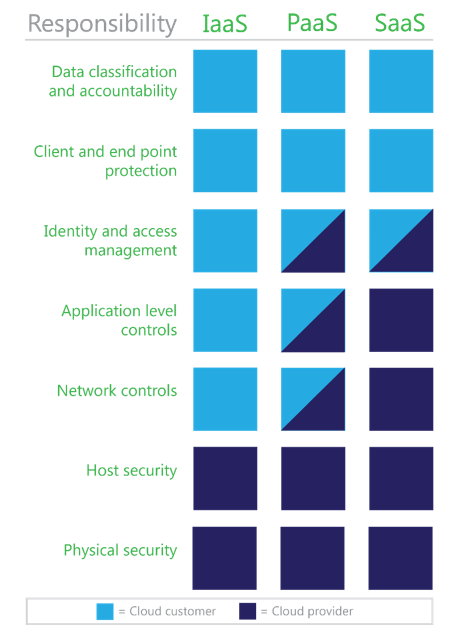

<properties
   pageTitle="Klassifizierung von Daten für Azure | Microsoft Azure"
   description="In diesem Artikel enthält eine Einführung in die Grundlagen der Klassifizierung von Daten und deren Wert, insbesondere im Zusammenhang mit der Cloud computing und verwenden Microsoft Azure hervorgehoben"
   services="security"
   documentationCenter="na"
   authors="YuriDio"
   manager="swadhwa"
   editor="TomSh"/>

<tags
   ms.service="security"
   ms.devlang="na"
   ms.topic="article"
   ms.tgt_pltfrm="na"
   ms.workload="na"
   ms.date="08/16/2016"
   ms.author="yurid"/>

# Klassifizierung von Daten für Azure

Dieser Artikel enthält eine Einführung in die Grundlagen der Klassifizierung von Daten und deren Wert, insbesondere im Zusammenhang mit der Cloud computing und verwenden Microsoft Azure hervorgehoben. 

## Grundlegendes zu Klassifizierung

Klassifizierung von erfolgreich Daten in einer Organisation erfordert umfassende Präsenz von den Anforderungen Ihrer Organisation und einen detaillierten Überblick über die, in denen Ihrer Datenbestände befinden.  
 
Daten in einem der drei grundlegende Zustände vorhanden sind: 

- Statisch 
- In Bearbeitung 
- Bei der Übertragung 
 
Alle drei Zuständen erfordern eindeutige technische Lösungen für Klassifizierung von Daten, aber die angewendeten Prinzipien der Klassifizierung von Daten müssen für jede dieselbe sein. Daten, die als vertraulich klassifiziert ist müssen wenn ruhen – unfertige und bei der Übertragung vertraulich bleiben. 
 
Daten können außerdem entweder strukturierten oder unstrukturierten sein. Typische Klassifizierung Prozesse für die strukturierten Daten in Datenbanken und Tabellen gefunden werden weniger komplex und zeitaufwändiger als die für unstrukturierte Daten wie Dokumente, Quellcode und e-Mail verwalten. 

> [AZURE.TIP] Weitere Informationen zur Azure-Funktionen und bewährte Methoden für die Daten finden Sie unter Verschlüsselung [Azure Daten Verschlüsselung bewährte Methoden](azure-security-data-encryption-best-practices.md)

Im Allgemeinen Organisationen gibt es eine weitere unstrukturierte Daten als strukturierte Daten. Unabhängig davon, ob Daten strukturiert oder unstrukturiert sind ist es wichtig, dass Sie die Vertraulichkeit von Daten zu verwalten. Bei einer sinnvollen Implementierung wird Klassifizierung von Daten an, die sensiblen oder vertraulichen Daten sichergestellt, die Bestände mit größer übersichtliche als Datenbestände verwaltet werden, die öffentliche oder verteilen kostenlos berücksichtigt werden. 

### Steuern des Zugriffs auf Daten 

Authentifizierung und Autorisierung häufig miteinander verwechselt werden, und ihre Rollen falsch verstanden. Tatsächlich sind sie ganz anders ab, wie in der folgenden Abbildung gezeigt.  

### Authentifizierung 

Authentifizierung in der Regel besteht aus mindestens zwei Teilen: einen Benutzernamen oder Benutzer-ID, zum Identifizieren eines Benutzers und ein Token, z. B. ein Kennwort, um zu bestätigen, dass die Username-Anmeldeinformationen gültig ist. Der Prozess bietet keine den authentifizierten Benutzer mit Zugriff auf alle Elemente oder Dienste. Es wird überprüft, dass der Benutzer, die diese besagen, dass sie sind.   

> [AZURE.TIP] [Azure Active Directory](../active-directory/active-directory-whatis.md) bietet cloudbasierten Identitätsdienste, mit denen Sie zum Authentifizieren und Autorisieren von Benutzern. 

### Autorisierung
 
Autorisierung ist die Vorgehensweise zum Bereitstellen von eines authentifizierten Benutzers der Möglichkeit, eine Anwendung, Datenmenge, Datendatei oder ein anderes Objekt zugreifen. Zuweisen von authentifizierten Benutzern die Berechtigung zum verwenden, ändern oder Löschen von Elementen, die sie zugreifen können, erfordert Aufmerksamkeit auf Klassifizierung von Daten. 

Erfolgreiche Autorisierung erfordert Implementierung von ein Verfahren zum Überprüfen der einzelne Benutzer muss Zugriff auf Dateien und Informationen basierend auf einer Kombination aus Rolle, Sicherheitsrichtlinie und Risiken Richtlinie Aspekte auf. Beispielsweise Daten aus bestimmten Line-of-Business (LOB) Applications möglicherweise nicht von allen Mitarbeitern zugegriffen werden müssen, und nur eine kleine Teilmenge der Mitarbeiter muss höchstwahrscheinlich Zugriff auf Dateien Personalwesen (h). Aber für Organisationen zu steuern, wer auf Daten, als sowie wann und wie, ein effektives System zur Benutzerauthentifizierung positioniert werden muss zugreifen können. 

> [AZURE.TIP] Microsoft Azure stellen Sie sicher, Azure Role-Based Access Steuerelement (RBAC), um nur der Menge von Zugriff gewähren, dass Benutzer ihre Aufgaben müssen zu nutzen. Weitere Informationen finden Sie bei [rollenzuweisungen zum Verwalten des Zugriffs auf Ihre Azure Active Directory-Ressourcen verwenden](../active-directory/role-based-access-control-configure.md) . 

### Rollen und Zuständigkeiten in cloud computing 

Obwohl Cloud-Anbieter Risikomanagement helfen können, Kunden müssen Sie sicherstellen, dass Daten Klassifizierung Management und Durchsetzung ist ordnungsgemäß implementiert, um die entsprechende Zugriffsebene Management Datendienste bereitzustellen.  
 
Daten Klassifizierung Zuständigkeiten ist davon abhängig die Cloud-Service-Modells an Ort ist, wie in der folgenden Abbildung gezeigt. Die drei primären Cloud-Service-Modelle sind Infrastruktur als Service (IaaS), Plattform als Service (PaaS), und die Software als Service (SaaS). Implementierung der Daten Klassifizierung Verfahren variiert auch basierend auf dem Abhängigkeit oder des Cloud-Anbieters informieren. 

Obwohl Sie Ihre Daten zu klassifizieren sind, sollten Cloud-Anbieter, geschriebene Zusagen darüber, wie sie secure und verwalten den Datenschutz für die Kundendaten in die Cloud gespeichert werden.  

- **IaaS Anbieter** Anforderungen sind darauf beschränkt, sicherzustellen, dass die virtuelle Umgebung Daten Klassifizierung Funktionen und Kunden Compliance-Anforderungen aufgenommen werden. IaaS Anbieter ist eine kleinere Rolle in Klassifizierung von Daten, da sie müssen nur sicherzustellen, dass Kundendaten Compliance-Anforderungen erfüllt. Anbieter müssen jedoch weiterhin sicherstellen, dass ihre virtuelle Umgebung Daten Klassifizierung Anforderungen zusätzlich zu sichern Sie ihre Daten Mittelpunkt von Adresse.
- **PaaS Anbieter** Zuständigkeiten möglicherweise gemischt werden, da die Plattform in Ebenen verwendet werden kann, um für eine Einstufung Tool Sicherheit zu gewährleisten. PaaS Anbieter möglicherweise Anmelde- und möglicherweise einige Autorisierungsregeln verantwortlich und müssen bieten, Sicherheit und Klassifizierung-Funktionen, die Daten zu ihrer Anwendung Layer. Viel müssen PaaS-Anbieter wie IaaS-Anbieter, um sicherzustellen, dass ihre Plattform alle relevante Daten Klassifizierung Anforderungen erfüllt.
- **SaaS Anbieter** häufig berücksichtigt werden als Teil einer Kette Autorisierung, und werden müssen um sicherzustellen, dass die Daten in der SaaS Anwendung gesteuert werden kann nach Klassifizierungstyp. SaaS Applikationen können für Applikationen LOB sowie deren Natur müssen verwendet werden, um bieten die Möglichkeit zum Authentifizieren und autorisieren Daten, die gespeichert und verwendet werden. 

## Klassifizierungsprozess 

Viele Organisationen, die die Notwendigkeit der Klassifizierung von Daten zu verstehen und möchten sie implementieren mit eine einfache Herausforderung konfrontiert:, wo Sie beginnen?

Eine effektive und einfache Möglichkeit, Klassifizierung von Daten zu implementieren ist, verwenden Sie das Kontrollkästchen PLAN, DO, dienen Modell von [MOF](https://technet.microsoft.com/solutionaccelerators/dd320379.aspx). Die folgende Abbildung Diagramme die Aufgaben, die für die erfolgreiche Klassifizierung von Daten in diesem Modell Implementierung erforderlich sind.  

1. **Planen**. Identifizieren Sie Datenbestände, ein Verwaltungsberechtigter Daten zum Bereitstellen des Programms Klassifizierung und Schutz Profile entwickeln. 
2. **DO**. Nach Daten Klassifizierung Richtlinien beim einverstanden sind, Bereitstellen Sie das Programm und implementieren Sie der Durchsetzung Technologien für vertrauliche Daten nach Bedarf.  
3. **Überprüfen**. Aktivieren und Überprüfen von Berichten, um sicherzustellen, dass die Tools und verwendeten Methoden die Richtlinien Klassifizierung effektiv adressieren. 
4. **ACT**. Überprüfen Sie den Status der Zugriff auf Daten und Überprüfen von Dateien und Daten, die eine erneute Klassifizierung und Überarbeitung Methode Sichtspalten Änderungen übernehmen mit Überarbeitung erforderlich und neue Risiken Adresse ein.  

 
###Wählen Sie ein Terminologie-Modell, die Ihren Anforderungen Adressen
 
Verschiedene Arten von Prozessen, die zur Klassifizierung von Daten, einschließlich manueller Prozesse vorhanden sind, standortbasierte Prozessen, die Daten zu klassifizieren auf Basis des Standorts eines Benutzers oder des Systems, Anwendung basierende Prozesse wie Datenbank-spezifische Einstufung, und automatische Prozesse von verschiedenen Technologien, von die einige im Abschnitt "Schützen von vertraulichen Daten" weiter unten in diesem Artikel beschriebenen verwendet.  
 
In diesem Artikel werden die zwei GRG Terminologie-Modelle, die gut verwendeten und Industrie eingehalten Modellen basieren. Diese Terminologie-Modelle, die beide die drei Ebenen Klassifizierung Vertraulichkeit unterstützen, sind in der folgenden Tabelle aufgeführt.  

> [AZURE.NOTE] Klassifizierung von einer Datei oder eine Ressource, die die Daten kombiniert, die in der Regel auf unterschiedlichen Ebenen klassifiziert werden möchten, muss die allgemeine Klassifizierung die höchste Ebene Klassifizierung präsentieren hergestellt werden. Beispiel: eine Datei mit eingeschränkter Daten klassifiziert werden sollte wie eingeschränkt.  

| **Vertraulichkeit**   | **Terminologie Modell 1**   | **Terminologie Modell 2** |
|--------------------|---------------------------|-------------------------|
| Hohe               | Es werden vertrauliche              | Eingeschränkt              |
| Mittel             | Nur für interne Verwendung     | Vertrauliche               |
| "Niedrig"                | Öffentliche                    | Uneingeschränkte            |

#### "Vertraulich" (eingeschränkt) 

Informationen, die als vertraulich oder eingeschränkten klassifiziert wird enthält Daten, die eine oder mehrere Personen und/oder Organisationen schwerwiegenden ist nicht korrekt oder verloren werden können. Diese Informationen werden häufig auf Basis "wissen müssen" bereitgestellt und enthalten möglicherweise: 

- Persönliche Daten, einschließlich personenbezogene Informationen wie soziale Sicherheit oder nationalen Erkennungszeichen Zahlen, Passport Zahlen, Kreditkartennummern, die Treiber Lizenz Zahlen, medizinische Daten und Lebensversicherung Richtlinie-IDs.  
- Finanzdaten, einschließlich Zahlen financial Konto, beispielsweise das Überprüfen oder Investition Konto Zahlen. 
- Business Material, beispielsweise Dokumente oder Daten, die eindeutige oder bestimmte geistiges Eigentum ist.  
- Rechtliche Daten, einschließlich potenziellen Anwalt Berechtigungen Material. 
- Authentifizierungsdaten, einschließlich Verschlüsselung privaten Schlüssel, Benutzername Kennwort-Paare oder anderen Kennung folgen, wie z. B. privaten Schlüssel biometrische-Dateien. 

Daten, die häufig als vertraulich klassifiziert ist weist behördliche und gesetzliche Vorschriften bei der Behandlung von Daten. 

#### Für interne Verwendung nur (/ Kleinschreibung)
 
Informationen, die als eingestuft wurde von Medium Vertraulichkeit enthält Dateien und Daten, die keinen erheblichen Einfluss auf die eine Einzelperson und/oder eine Organisation hätte, wenn verloren gehen oder gelöscht. Diese Informationen enthalten möglicherweise: 

- E-Mail, von denen meisten verteilt, ohne dass eine Krise (außer Postfächer oder e-Mails von Personen, die in der vertraulichen Klassifizierung identifiziert werden) oder gelöscht werden können.  
- Dokumente und Dateien, die keine vertrauliche Daten enthalten.
 
Im Allgemeinen enthält diese Klassifizierung nichts, die nicht vertraulich sind. Diese Klassifizierung kann die meisten Geschäftsdaten, einbeziehen, da die meisten Dateien, die verwaltete oder täglichen verwendet als vertraulich klassifiziert werden können. Mit Ausnahme von Daten, die besteht aus öffentlichen oder vertrauliche ist, können alle Daten in einer Organisation Business standardmäßig als vertraulich klassifiziert werden. 

#### Öffentliche (uneingeschränkte)
 
Informationen, die als öffentlich klassifiziert ist enthält Daten und Dateien, die nicht entscheidend, geschäftliche Anforderungen oder Vorgänge sind. Diese Klassifizierung kann auch enthalten Daten, die für die Öffentlichkeit für ihre Verwendung, z. B. marketing-Material absichtlich freigegeben wurde, oder drücken Ankündigungen. Darüber hinaus kann diese Klassifizierung Daten wie Spam e-Mail-Nachrichten gespeichert werden, indem Sie eine e-Mail-Dienst enthalten. 

### Definieren von Daten Besitz
 
Es ist wichtig, dass eine deaktivieren freiheitsentziehenden Kette des Besitzes für alle Datenbestände einrichten. In der folgenden Tabelle werden die anderen Daten Besitz Rollen in Daten Klassifizierung steigern und ihre jeweiligen Rechte aufgeführt.  

| **Rolle**        | **Erstellen**    | **Ändern/Löschen**   | **Stellvertretung**  | **Lesen**    | **Archivieren/Wiederherstellen**   |
|-----------------|---------------|---------------------|---------------|-------------|-----------------------|
| Besitzer           | X             | X                   | X             | X           | X                     |
| Verwaltungsberechtigte       |               |                     | X             |             |                       |
| Administrator   |               |                     |               |             | X                     |
| Benutzer\*          |               | X                   |               | X           |                       |
**Benutzer können zusätzliche Rechte wie bearbeiten und löschen, indem Sie ein Verwaltungsberechtigter gewährt werden* 

> [AZURE.NOTE] Diese Tabelle bietet eine vollständige Liste der Rollen und Berechtigungen, aber lediglich einen Vertreter Beispiel nicht. 

Der **Daten verantwortlichen** ist die ursprüngliche Ersteller der Daten, die Stellvertretung Besitz und weisen ein Verwaltungsberechtigter können. Wenn eine Datei erstellt wurde, sollte der Besitzer sein eine Einstufung, zuweisen d. h., sie eine Zuständigkeit haben zu verstehen, was muss als vertraulich klassifiziert werden basierend auf den Richtlinien ihrer Organisation. Alle Daten von einem Objekt-Besitzers können automatisch klassifiziert wie für interne Verwendung nur (/ Kleinschreibung) sein, es sei denn, sie für Besitzer oder Erstellen von vertraulichen (eingeschränkte) Datentypen zuständig sind. Der Besitzer der Rolle ändern häufig, nachdem die Daten klassifiziert ist. Der Besitzer möglicherweise beispielsweise vertrauliche Informationen in eine Datenbank erstellen und deren Anspruch auf der Daten Verwaltungsberechtigte abgeben.  

> [AZURE.NOTE] häufig verwenden, Daten Anlage Besitzer eine Mischung Services, Geräte und Medien, von denen einige persönlichen und von denen einige der Organisation gehören. Löschen Unternehmensrichtlinien kann sicherstellen, dass die Verwendung von Geräten, wie z. B. Laptops und intelligenten Geräten nach Daten Klassifizierung Richtlinien ist.  

Der **Daten Anlage Verwaltungsberechtigte** wird von Verantwortlichen für die Ressource (oder deren Stellvertretung) zum Verwalten der Anlage nach Agreements mit Verantwortlichen für die Ressource oder gemäß den betreffenden Richtlinie zugewiesen. Die Rolle des Verwaltungsberechtigte kann idealerweise in einem automatisierten System implementiert werden. Eine Anlage Verwaltungsberechtigte wird sichergestellt, dass Access erforderlichen Steuerelemente stehen zur Verfügung, und zum Verwalten und Schützen von Ressourcen an ihren Vorsicht delegiert verantwortlich ist. Die der der Anlage Verwaltungsberechtigte konnte folgende Aufgaben:  

- Schützen von der Anlage, die nach Maßgabe des Verantwortlichen für die Ressource Richtung oder mit Verantwortlichen für die Ressource 
- Um sicherzustellen, dass Klassifizierung Richtlinien eingehalten werden 
- Darüber informiert die Besitzer der Anlage über alle Änderungen an: bei Steuerelemente und/oder Schutz Verfahren, bevor Sie diese Änderungen wirksam 
- An den Besitzer der Anlage Reporting über Änderungen an oder Entfernen von der Anlage-Verwaltungsberechtigte Zuständigkeiten 
- Ein **Administrator** repräsentiert einen Benutzer, der wird sichergestellt, dass Integrität verwaltet wird, aber sie sind keiner verantwortlichen Daten, Verwaltungsberechtigte oder Benutzer. Tatsächlich bieten viele Administratorrollen Daten Container Management Services ohne Zugriff auf die Daten. Die Rolle des Administrators enthält zur Sicherung und Wiederherstellung der Daten, Verwalten von Datensätzen, Anlagen und auswählen, beim Abrufen und verwenden die Geräte und Speicher dieser House die Anlagen. 
- Der Benutzer Anlage enthält alle Personen, die Zugriff auf Daten oder einer Datei gewährt wird. Access-Zuordnung wird häufig vom Eigentümer der Anlage Verwaltungsberechtigte delegiert.  

### Implementierung
  
Gesichtspunkte gelten für alle Klassifizierung Methoden. Diese Aspekte müssen einbeziehen Details, wer, was, wo, wann und warum eine Anlage Daten verwendet, zugegriffen, geändert oder gelöscht würden,. Einen Überblick darüber, wie eine Organisation seine Risiken Ansichten alle Anlage Management vorgenommen werden, jedoch eine einfache Methode definierten beim Klassifizierung von Daten angewendet werden kann. Weitere Aspekte für Klassifizierung von Daten gehören die Einführung von neuen Anwendungen und Tools und Verwalten von ändern, nachdem eine Einstufung Methode implementiert wird.  

### Erneute Klassifizierung
 
Notwendigen oder ändern den Status Klassifizierung eines Anlageguts Daten muss ausgeführt werden, wenn Sie einen Benutzer oder eine System bestimmt, dass die Daten-Anlage Wichtigkeit oder Risiko Profil geändert hat. Diese Option ist für die Sicherstellung, dass der Status Klassifizierung aktuellen und gültigen werden weiterhin wichtig. Die meisten Inhalte, die nicht manuell klassifiziert kann automatisch klassifiziert oder je nach Verwendung von einem Verwaltungsberechtigten Daten oder Datenbesitzer werden. 

### Manuelle Daten erneute Klassifizierung
 
Idealerweise wird dieser Aufwand sichergestellt, dass die Details einer Änderung erfasst und überwacht werden. Der wahrscheinlichste Grund manuelle erneute Klassifizierung wäre aus Gründen der Vertraulichkeit oder für Datensätze in Papierformat oder eine Anforderung, Daten zu überprüfen, die ursprünglich falsch, klassifizierte wurde gespeichert sind. Da dieses Dokuments Klassifizierung von Daten und Verschieben von Daten in der Cloud betrachtet, manuelle erneute Klassifizierung steigern müssten Aufmerksamkeit auf Basis von Fall und ein Risiko Management überprüfen wäre an Adresse Klassifizierung eignet. Im Allgemeinen eine Option leistungsgesteuert würden in Betracht ziehen der Organisation Richtlinie zu was sein muss klassifiziert, Klassifizierung Standardzustand (alle Daten und Dateien werden vertrauliche aber nicht auf vertrauliche), und führen Sie die Ausnahmen für Daten mit hohem Risiko. 

### Automatische Daten erneute Klassifizierung
 
Automatische Daten erneute Klassifizierung verwendet dieselbe allgemeine Regel als manuellen Klassifizierung. Eine Ausnahme ist automatisierte Lösungen sichergestellt wird, dass Regeln gefolgt und je nach Bedarf angewendet werden. Klassifizierung von Daten kann als Teil einer Richtlinie Daten Klassifizierung Durchsetzung erzwungen werden kann, wenn die Daten gespeichert werden, verwendet, und klicken Sie in unter Verwendung von Autorisierung Technologie durchgeführt werden.

- Anwendung-basierten. Mit einer bestimmten Anwendung standardmäßig legt eine Einstufung Ebene. Daten von Kunden Beziehung (Relationship Management) Software, Personalwesen und Gesundheit Datensatz Verwaltungstools beträgt beispielsweise vertrauliche standardmäßig. 
- Standortbasierte. Datenspeicherort kann dabei helfen, die Vertraulichkeit von Daten zu identifizieren. Daten, die von einem HR oder financial Abteilung gespeichert beträgt beispielsweise eher vertraulich.  
 
### Daten Aufbewahrungsrichtlinien, Wiederherstellung und Freigabe 

Wiederherstellung von Daten und die Freigabe, wie Daten erneute Klassifizierung, ist ein wichtiger Aspekt des Datenbestände verwalten. Die Grundsätze für Wiederherstellung Daten und die Freigabe von einer Datenaufbewahrungsrichtlinie definiert und auf die gleiche Weise, wie Daten erneute Klassifizierung erzwungen; eine Option leistungsgesteuert würde von der Verwaltungsberechtigte und Administrator Rollen als Onlinezusammenarbeit Aufgaben durchgeführt werden.  

Bei eine Datenaufbewahrungsrichtlinie haben, kann Datenverlust oder behördliche und rechtlichen Ermittlung Anforderungen eingehalten bedeuten. Die meisten Organisationen, die nicht über eine Aufbewahrungsrichtlinie eindeutig definierte Daten verfügen in der Regel eine standardmäßige Aufbewahrungsrichtlinie "Alles beibehalten" verwenden. Solche eine Aufbewahrungsrichtlinie hat jedoch zusätzliche Risiken in der Cloud Services-Szenarien. 

Beispielsweise kann eine Datenaufbewahrungsrichtlinie für Cloud-Dienstanbieter wie für "die Dauer des Abonnements" betrachtet (solange der Dienst bezahlt für die Daten aufbewahrt werden). Solche eine Bezahlung für Aufbewahrungsrichtlinien Lizenzvertrag möglicherweise nicht im Unternehmen oder behördliche Aufbewahrungsrichtlinien behandelt. Definieren einer Richtlinie für vertrauliche Daten können Sie sicherstellen, dass die Daten gespeichert und basierend auf bewährte Methoden entfernt. Darüber hinaus kann eine Richtlinie Archivierung erstellt werden, um formalisieren Kenntnisse über welche Daten freigegeben werden sollten und wann. 

Datenaufbewahrungsrichtlinie sollte die erforderlichen Adresse behördliche und Vorschriften sowie corporate rechtliche Aufbewahrungsrichtlinien einzuhalten. Geschützte Daten möglicherweise Fragen zur Aufbewahrung Dauer und Ausnahmen für Daten, die gespeichert wurden, mit einem Anbieter liefern; solche Fragen werden eher für die Daten, die nicht ordnungsgemäß eingestuft wurde. 

> [AZURE.TIP] Weitere Informationen zu Azure Daten Aufbewahrungsrichtlinien und mehr durch Lesen des [Microsoft Online-Abonnement-Vertrag](https://azure.microsoft.com/support/legal/subscription-agreement/)

## Schützen von vertraulichen Daten
  
Nach Daten klassifiziert ist, wird der suchen und Implementierung von Methoden zum Schützen von vertraulichen Daten Bestandteil einer beliebigen Bereitstellungsstrategie für den Datenschutz. Schützen von vertraulichen Daten erfordert zusätzliche Aufmerksamkeit auf wie Daten gespeichert und in herkömmlichen Architekturen ebenso wie in der Cloud zu übermitteln. 

Dieser Abschnitt enthält grundlegenden Informationen zu einigen Technologien, die automatisieren können Durchsetzung steigern zum Schutz von Daten, die als vertraulich klassifiziert wurden. 
 
Wie die folgende Abbildung zeigt, können diese Technologien als lokale oder Lösungen cloudbasierten bereitgestellt werden – oder in einer Weise Hybrid mit einige von Ihnen bereitgestellten lokalen und einige in der Cloud. (Einige Technologien wie Verschlüsselung und Verwaltung von Informationsrechten, erweitern auch an Benutzer Geräte.)  

### Rights Management-software  

Eine Lösung für Schutz vor Datenverlust ist Rights Management-Software. Im Gegensatz zu Vorgehensweisen, die versuchen, Unterbrechen des Informationsflusses am beenden Punkte in einer Organisation, funktioniert Rights Management-Software auf Tiefe Ebenen Technologien Daten ein. Dokumente verschlüsselt sind, und steuern, wer entschlüsselt werden kann, verwendet Access-Steuerelemente, die in einer Lösung für die Authentifizierung Steuerelement wie ein Verzeichnisdienst definiert sind.  

> [AZURE.TIP] Azure Verwaltung von Informationsrechten (RMS Azure) können als die Informationen Protection-Lösung Sie um Daten in anderen Szenarien zu schützen. Lesen [Neuigkeiten Azure Verwaltung von Informationsrechten?](https://docs.microsoft.com/rights-management/understand-explore/what-is-azure-rms) für Weitere Informationen zu dieser Azure-Lösung.

Einige der Vorteile der Rights Managementsoftware einbeziehen möchten: 

- Gegen vertrauliche Informationen. Benutzer können ihre Daten direkt mithilfe von Rights Management-kompatible Applikationen schützen. Es sind keine zusätzliche Schritte erforderlich – Erstellen von Dokumenten, e-Mails senden und Veröffentlichen von Daten bieten eine einheitliche Schutz ermöglicht. 
- Schutz auf Reisen mit den Daten. Kunden bleiben steuern, wer Zugriff auf ihre Daten, ob in der Cloud, vorhandene IT-Infrastruktur oder auf dem Desktop des Benutzers hat. Organisationen können die Daten verschlüsseln und Einschränken des Zugriffs entsprechend ihren geschäftlichen Anforderungen auswählen. 
- Schutzrichtlinien Standard-Informationen. Administratoren und Benutzer können standard-Richtlinien für viele allgemeine geschäftliche Szenarios, wie etwa "Unternehmen" Vertraulich "– schreibgeschützt" und "Nicht weiterleiten." verwenden. Umfassende Verwendung, die Verwaltung von Informationsrechten unterstützt werden, wie lesen, kopieren, drucken, speichern, bearbeiten und Flexibilität beim Definieren benutzerdefinierte Nutzungsrechte dürfen weiterleiten. 

> [AZURE.TIP] Sie können Daten in Azure-Speicher mithilfe von [Azure-Speicher-Service-Verschlüsselung](../storage/storage-service-encryption.md) von Daten in der restlichen schützen. Sie können auch [Azure Datenträger Verschlüsselung](azure-security-disk-encryption.md) verwenden, zum Schützen von Daten auf virtuellen Laufwerken für Azure virtuellen Computern verwendet.

### Verschlüsselung gateways

Verschlüsselung Gateways arbeiten in eigene Layer um Verschlüsselung Services durch erneutes alle Zugriff auf Daten cloudbasierten zu ermöglichen. Dieser Ansatz sollte nicht mit der ein virtuelles privates Netzwerk (VPN) verwechselt werden. Verschlüsselung Gateways dienen eine transparente Ebene zu cloudbasierten Lösungen bereitzustellen.   

Verschlüsselung Gateways bieten eine Möglichkeit zum Verwalten und sichere Daten, die durch die Verschlüsselung der Daten bei der Übertragung und statische Daten als vertraulich eingestuft wurde.  
 
Verschlüsselung Gateways werden in den Datenfluss zwischen Benutzer Geräte und Anwendungsdaten Centers Verschlüsselung/entschlüsseln-Diensten platziert. Diese Lösungen, wie VPN, sind überwiegend lokalen Lösungen. Diese sollen ein dritten Kontrolle über Schlüssel für die Verschlüsselung, wodurch die Daten und die Taste Management mit einem Anbieter platzieren zu verringern. Solche Lösungen, ähnlich wie die Verschlüsselung arbeiten nahtlos und transparent zwischen Benutzern und dem Dienst dienen. 

> [AZURE.TIP] Azure ExpressRoute können Sie um Ihre lokalen Netzwerken in der Microsoft-Cloud über eine dedizierte private Verbindung zu erweitern. Lesen Sie für Weitere Informationen zu dieser Funktion [ExpressRoute – technische Übersicht](../expressroute/expressroute-introduction.md) . Eine andere Optionen für cross lokale Verbindung zwischen Ihrem lokalen Netzwerk und [Azure ist ein Standort-zu-Standort VPN](../vpn-gateway/vpn-gateway-howto-site-to-site-resource-manager-portal.md).

### Schutz vor Datenverlust 
Datenverlust (auch als Datenverlust bezeichnet) ist ein wichtiges Kriterium, und die Vermeidung von externen Datenverlust über durch bösartige und unbeabsichtigtes interne Lektüre für viele Organisationen wird.  
 
Data Loss Prevention (DLP) Technologien können können Sie sicherstellen, dass Lösungen wie e-Mail-Diensten nicht Daten übermitteln, die als vertraulich eingestuft wurde. Organisationen können DLP-Features in vorhandenen Produkte zum Verhindern von Datenverlust nutzen. Diese Features verwenden Sie Richtlinien, die einfach von Grund auf oder mithilfe einer Vorlage vom Provider Software erstellt werden können.  
 
DLP-Technologien können Tiefen Inhalt Analysen durch das Schlüsselwort entspricht, Wörterbuch entspricht, Auswertung von regulären Ausdrücken und andere Inhalte Prüfung Inhalt erkennen, die verletzt organisationsinterne DLP-Richtlinien durchführen können. Beispielsweise kann DLP-Hilfe zur Vermeidung von Datenverlust die folgenden Arten von Daten: 

- Soziale Sicherheit und nationalen Identifikationsnummern 
- Bankinformationen 
- Kreditkartennummern  
- IP-Adressen 

Einige DLP-Technologien bieten auch die Möglichkeit, die DLP-Konfiguration überschreiben (z. B., wenn eine Organisation Sozialversicherungsnummer Informationen für einen Prozessor Payroll übertragen muss). Darüber hinaus ist es möglich, DLP so konfigurieren, dass Benutzer benachrichtigt werden, bevor sie gerade versuchen, um vertrauliche Informationen zu senden, der nicht übertragen werden soll. 

> [AZURE.TIP] Office 365 DLP-Funktionen können Sie um Ihre Dokumente zu schützen. Lesen [Office 365 Compliance-Steuerelemente: Schutz vor Datenverlust](https://blogs.office.com/2013/10/28/office-365-compliance-controls-data-loss-prevention/) für Weitere Informationen.

## Siehe auch

- [Bewährte Methoden für die Verschlüsselung von Azure-Daten](azure-security-data-encryption-best-practices.md)
- [Bewährte Methoden für Sicherheit zu steuern Azure Identitätsmanagement und Zugriff](azure-security-identity-management-best-practices.md)
- [Sicherheit von Azure-Teamblog](http://blogs.msdn.com/b/azuresecurity/)
- [Microsoft-Antwort Sicherheitscenter](https://technet.microsoft.com/library/dn440717.aspx)

