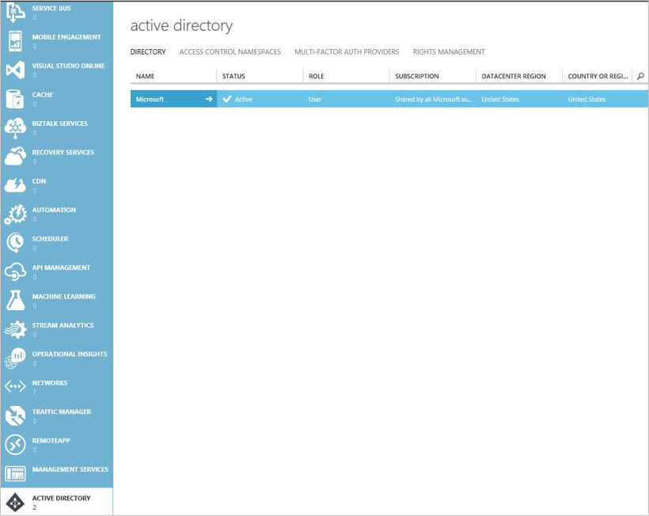
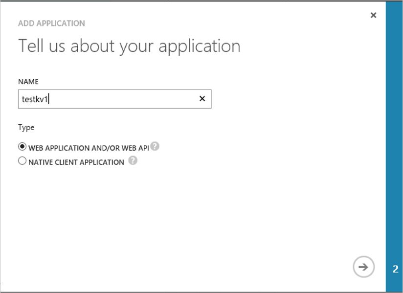
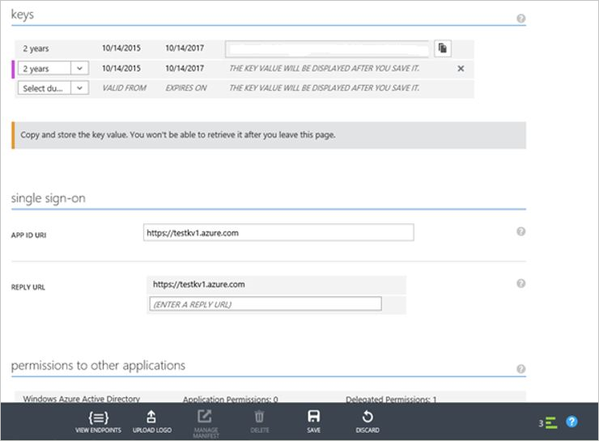
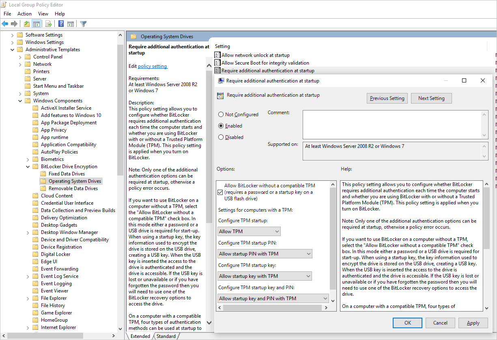
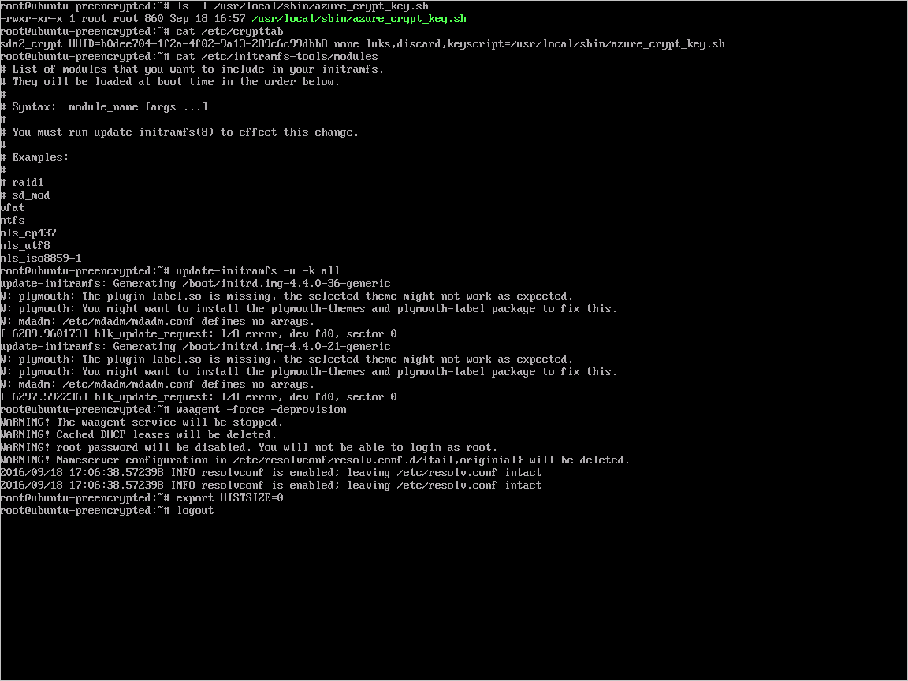
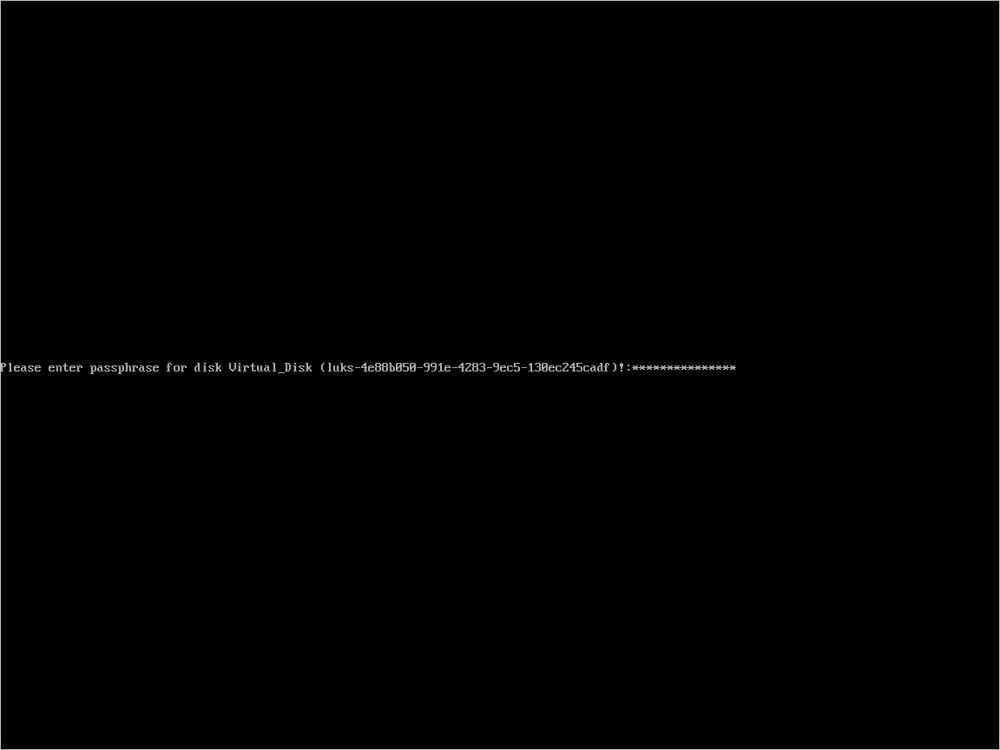

<properties
   pageTitle="Verschlüsselung für Windows und Linux IaaS virtuellen Computern Azure Festplatten | Microsoft Azure"
   description="Das Papier bietet einen Überblick über Microsoft Azure Datenträger Verschlüsselung für Windows und Linux IaaS virtuellen Computern an."
   services="security"
   documentationCenter="na"
   authors="YuriDio"
   manager="swadhwa"
   editor="TomSh"/>

<tags
   ms.service="security"
   ms.devlang="na"
   ms.topic="article"
   ms.tgt_pltfrm="na"
   ms.workload="na"
   ms.date="09/26/2016"
   ms.author="krkhan"/>

#Azure Datenträger Verschlüsselung für Windows und Linux IaaS virtuellen Computern

Microsoft Azure setzt sich alles um sicherzustellen, dass Ihre Datenschutz, Daten Hoheit und aktiviert Sie zu Ihrer Azure Daten über einen Zellbereich gehostet Steuerelement Technologien verschlüsseln, erweiterte steuern und Verwalten der Schlüssel für die Verschlüsselung, Steuerelement und Audit Zugriff auf Daten. Dies stellt Azure Kunden die Flexibilität, wählen Sie die Lösung, die ihre geschäftliche Anforderungen am besten entspricht. In diesem Artikel werden wir eine neue Technologie-Lösung "Verschlüsselung Azure Festplatten für Windows und Linux IaaS virtueller Computer des" vorgestellt zum schützen, und schützen Sie Daten, um Ihre Sicherheit in der Organisation und Compliance Zusagen entsprechen. Das Papier bietet detaillierte Anleitung zum Verwenden der Azure Datenträger Verschlüsselungsfeatures, einschließlich der unterstützten Szenarien und der Benutzer auftritt.

**Hinweis**: bestimmte Empfehlungen hierin enthaltenen können in höhere Daten, Netzwerk- oder Ressource: Einsatz berechnen resultierender in Lizenz oder das Abonnement Mehrkosten führen.

## (Übersicht)

Azure Datenträger Verschlüsselung ist eine neue Funktion, die Sie Ihre Windows und Linux IaaS virtuellen Computers Datenträger verschlüsseln kann. Azure Datenträger Verschlüsselung nutzt die Branche [BitLocker](https://technet.microsoft.com/library/cc732774.aspx) Standardfunktion von Windows und die Funktion [DM-Crypt](https://en.wikipedia.org/wiki/Dm-crypt) Linux um Lautstärke Verschlüsselung für das Betriebssystem und Festplatten mit den Daten zu ermöglichen. Die Lösung ist integriert Tresor [Azure-Taste](https://azure.microsoft.com/documentation/services/key-vault/) , mit deren Hilfe Sie steuern und Verwalten der Schlüssel zur Verschlüsselung und vertrauliche Informationen in Ihrem Abonnement Key Tresor und dabei sicherstellen, dass alle Daten im virtuellen Computern Laufwerke zum Rest in Azure-Speicher verschlüsselt werden.

Verschlüsselung für Windows und Linux IaaS virtuellen Computern Azure Festplatten ist jetzt im **Allgemeinen Verfügbarkeit** in allen Azure öffentlichen Regionen für Standard-virtuellen Computern und virtuellen Computern mit Premium-Speicher.

### Szenarios für die Verschlüsselung

Die Lösung Azure Datenträger Verschlüsselung unterstützt die folgenden Kundenszenarien:

- Aktivieren Sie die Verschlüsselung auf neuen Dokumentvorlagen vor der Verschlüsselung virtuelle Festplatte und Schlüssel für die Verschlüsselung IaaS virtuellen Computern
- Aktivieren Sie die Verschlüsselung auf neue IaaS virtuellen Computern erstellt aus den Bildern Azure-Katalog
- Aktivieren Sie die Verschlüsselung auf vorhandene IaaS virtuellen Computern in Azure ausgeführt
- Deaktivieren Sie die Verschlüsselung auf Windows IaaS virtuellen Computern
- Deaktivieren Sie die Verschlüsselung auf Datenlaufwerke für Linux IaaS virtuellen Computern

Die Lösung unterstützt die folgenden für IaaS virtuelle Computer, wenn in Microsoft Azure aktiviert:

- Integration in Azure Key Tresor
- Standard Ebene virtuellen Computern - [A, D, DS, G, GS usw. Reihe IaaS virtuellen Computern](https://azure.microsoft.com/pricing/details/virtual-machines/)
- Aktivieren Sie die Verschlüsselung unter Windows und Linux IaaS virtuellen Computern
- Deaktivieren Sie die Verschlüsselung auf Laufwerken OS und Daten für Windows IaaS virtuellen Computern
- Deaktivieren Sie die Verschlüsselung auf Datenlaufwerke für Linux IaaS virtuellen Computern
- Aktivieren Sie die Verschlüsselung auf IaaS virtuellen Computern unter Windows-Client-Betriebssystem
- Aktivieren Sie die Verschlüsselung auf Datenmengen mit Bereitstellungspfaden
- Aktivieren Sie die Verschlüsselung auf Linux virtuellen Computern mit Software-basierten RAID-System konfiguriert 
- Aktivieren Sie die Verschlüsselung auf Windows-virtuellen Computern mit Leerzeichen Speicher konfiguriert
- Alle Azure öffentliche Regionen werden unterstützt.

Die Lösung unterstützt nicht die folgenden Szenarien, Features und Technologie in der Version:

- Grundlegende Ebene IaaS virtuellen Computern
- Deaktivieren Sie die Verschlüsselung auf OS Laufwerk für Linux IaaS virtuellen Computern
- IaaS virtuellen Computern erstellt klassischen virtueller Computer Creation-Methode
- Integration in Ihrer lokalen Schlüsselverwaltungsdienst
- Windows Server 2016 Technical Preview wird in dieser Version nicht unterstützt.
- Azure Dateien (Azure Dateifreigabe), Netzwerk-Dateisystem (NFS), dynamische Datenträger, Windows virtuellen Computern konfiguriert mit RAID Software-basierte Betriebssysteme

### Verschlüsselungsfeatures

Beim Aktivieren und Azure Verschlüsselung Azure IaaS virtuellen Computern bereitstellen, werden die folgenden Funktionen aktiviert, je nach Konfiguration bereitgestellt:

- Verschlüsselung OS Lautstärke Boot Volumen bei Rest in Kunden-Speicher schützen
- Die Verschlüsselung der Daten Lautstärke/s, um die Datenbestände bei Rest in Kunden-Speicher schützen
- Deaktivieren Sie die Verschlüsselung auf Laufwerken OS und Daten für Windows IaaS virtuellen Computern
- Deaktivieren Sie die Verschlüsselung auf Datenlaufwerke für Linux IaaS virtuellen Computern
- Schützen der Schlüssel für die Verschlüsselung und vertrauliche Informationen in Kunden Azure Key Tresor Abonnement
- Statusberichte Verschlüsselung der verschlüsselten IaaS VM
- Entfernen von Datenträger Verschlüsselung Konfiguration Einstellungen aus der IaaS virtuellen Computern

Die Verschlüsselung Azure Festplatten für IaaS VMS für Windows und Linux-Lösung umfasst die Festplatte Verschlüsselung Erweiterung für Windows, Datenträger Verschlüsselung Erweiterung für Linux, Verschlüsselung PowerShell-Cmdlets Datenträger, Datenträger Verschlüsselung CLI Cmdlets und Datenträger Verschlüsselung Azure Ressourcenmanager Vorlagen. Die Lösung Azure Datenträger Verschlüsselung wird auf IaaS virtuellen Computern unter Windows oder Linux-Betriebssystem unterstützt. Weitere Informationen zu den unterstützten Betriebssystemen finden Sie unter Voraussetzungen für Abschnitt unten.

**Hinweis**: keine zusätzliche Gebühren für die Verschlüsselung von virtuellen Computer Datenträger mit Azure Datenträger Verschlüsselung.

### Der nutzen

Die Lösung Azure Datenträger Verschlüsselung Verwaltung ermöglicht die folgenden geschäftliche Anforderungen in der Cloud:

-   IaaS VMs sind bei Rest mit Industry standard-Verschlüsselung Technologie Adresse Sicherheit in der Organisation und Compliance-Anforderungen gesichert.
-   IaaS VMs Boot unter Kunden gesteuert Tasten und Richtlinien zur Verfügung und können sie deren Verwendung in Schlüssel Tresor überwachen.

### Workflow für Verschlüsselung

Die auf hoher Ebene Schritte zum Aktivieren der Datenträger Verschlüsselung für Windows und des Linux VM erforderlich sind:

1. Der Kunde wählt ein Verschlüsselungsszenario obigen Szenarios Verschlüsselung
2. Kunden wechselt in Aktivieren über das Azure Datenträger Verschlüsselung Ressourcenmanager Vorlage oder PS Cmdlets oder CLI-Befehl Datenträger-Verschlüsselung und gibt die Verschlüsselungskonfiguration

    - Für den Kunden verschlüsselt virtuelle Festplatte Szenario Kunden Uploads, die verschlüsselte virtuelle Festplatte zu deren Speicher-Konto und Verschlüsselung Key Materialien, deren Schlüssel Vaulting und Bereitstellen die Verschlüsselungskonfiguration, um die Verschlüsselung auf einer neuen IaaS VM aktivieren
    - Kunde bereitstellen für aus dem Katalog Azure und vorhandenen virtuellen Computers bereits in Azure ausgeführt des neuen virtuellen Computers erstellt haben, die Verschlüsselungskonfiguration zum Aktivieren der IaaS VM-Verschlüsselung

3. Kunden gewährt Zugang zur Azure-Plattform das Verschlüsselung Key Material (BitLocker Verschlüsselung Schlüssel für Windows-Betriebssysteme und Kennwort für Linux) aus ihrer Key Tresor Aktivierung Verschlüsselung für die IaaS VM lesen
4. Der Kunde bereitstellen Azure AD-Anwendungsidentität sowie das Schreiben das Verschlüsselung Key Material in deren Key Tresor Aktivierung Verschlüsselung für die IaaS VM für in #2 oben genannten Szenarien
5.  Azure aktualisiert des virtuellen Computer-Service-Modells mit Verschlüsselung und Key Tresor Konfiguration und Vorschriften verschlüsselt virtueller Computer für den Kunden

### Entschlüsseln Workflow

Die auf hoher Ebene Schritte zum Deaktivieren IaaS VMs Verschlüsselung erforderlich sind:

1. Kunde wählt So deaktivieren Sie die Verschlüsselung (entschlüsseln) auf einer laufenden IaaS VM in Azure über die Azure Datenträger Verschlüsselung Ressourcenmanager Vorlage oder PS Cmdlets und gibt die Konfiguration entschlüsseln.
2. Der deaktivieren Verschlüsselung Schritt deaktiviert Verschlüsselung und/oder die Lautstärke Betriebssystem oder Daten auf die laufenden Windows Neuerung. Jedoch deaktivieren von OS Verschlüsselung für Linux Datenträger werden nicht wie in der Dokumentation oben erwähnt. Der deaktivieren Schritt ist nur für Datenlaufwerke auf Linux virtuellen Computern zulässig. 
4. Azure aktualisiert des virtuellen Computer-Service-Modells, und die IaaS VM entschlüsselt gekennzeichnet ist. Den Inhalt der virtuellen Computer werden nicht mehr am Rest verschlüsselt werden.
5. Der Vorgang deaktivieren Verschlüsselung wird nicht gelöscht werden, die wichtigsten Tresor Kunden und die Verschlüsselung Key Material,-BitLocker Verschlüsselung Schlüssel für Windows oder Kennwort für Linux.

## Erforderliche Komponenten

Im folgenden werden die erforderlichen Komponenten Azure Datenträger Verschlüsselung auf Azure IaaS virtuellen Computern für die unterstützten Szenarios im Abschnitt Übersicht Hervorhebung aktivieren

- Benutzer müssen ein gültiges aktives Azure-Abonnement für Ressourcen in Azure in den Regionen unterstützt erstellen
- Klicken Sie auf den folgenden WindowsServer SKU des - Windows Server 2008 R2, Windows Server 2012 und Windows Server 2012 R2 wird Azure Datenträger Verschlüsselung unterstützt. Windows Server 2016 Technical Preview wird in dieser Version nicht unterstützt.
- Klicken Sie auf der folgenden Windows-Client SKU des - Client für Windows 8 und Windows-10-Client wird Azure Datenträger Verschlüsselung unterstützt.

**Hinweis**: für Windows Server 2008 R2, .net Framework 4.5 muss installiert sein, bevor UFI-Verschlüsselung in Azure. Sie können es von Windows Update installieren durch Installieren des optionale Updates "Microsoft .NET Framework 4.5.2 für Windows Server 2008 R2 X 64-basierte Betriebssysteme ([KB2901983](https://support.microsoft.com/kb/2901983))"

- Klicken Sie auf den folgenden Linux Server SKUs - Ubuntu, CentOS, SUSE und SUSE Linux Enterprise Server (SLES) und Red Hat Enterprise Linux wird Azure Datenträger Verschlüsselung unterstützt.

**Hinweis**: Linux OS Datenträger Verschlüsselung wird derzeit unterstützt, klicken Sie auf den folgenden Linux Verteilung - RHEL 7.2, CentOS 7.2, Ubuntu 16.04

- Alle Ressourcen (Ex: Key Tresor, Speicher zu berücksichtigen, virtueller Computer usw.) müssen den gleichen Azure Region und Abonnement gehören.

**Hinweis**: Verschlüsselung Azure Festplatten erfordert, dass die Taste Tresor und den virtuellen Computern in der gleichen Azure Region befinden. Konfigurieren diese in separaten Region bewirkt Fehler, dass in Azure Datenträger Verschlüsselungsfeature aktivieren.

- Zum Einrichten und Konfigurieren von Azure-Taste Tresor für Azure Datenträger Verschlüsselung Verwendung, finden Sie unter Abschnitt **Einstellung und Konfigurieren von Azure Schlüssel Tresor für Azure Datenträger Verschlüsselung Verwendung** im Abschnitt *Voraussetzungen für* dieses Artikels.
- Zum Einrichten und Konfigurieren von Azure AD-Anwendung in Azure Active Directory für die Verschlüsselung Verwendung Azure Datenträger, finden Sie unter Abschnitt im Abschnitt *Voraussetzungen für* **die Einrichtung der Azure AD-Anwendungs in Azure Active Directory** dieses Artikels.
- Zum Einrichten und Konfigurieren von Key Tresor Zugriffsrichtlinie für die Azure AD-Anwendung finden Sie unter Abschnitt **Einstellung Schlüssel Tresor-Zugriffsrichtlinie für die Azure AD-Anwendung** im Abschnitt *Voraussetzungen für* dieses Artikels.
- Um eine vordefinierte verschlüsselte Windows virtuelle Festplatte vorbereiten, finden Sie in Abschnitt in der Anlage **einer vordefinierten verschlüsselte Windows virtuellen vorbereiten** in diesem Artikel.
- Um eine vordefinierte verschlüsselte Linux VHD vorzubereiten, finden Sie unter Abschnitt in der Anlage **einer vordefinierten verschlüsselte Linux virtuellen vorbereiten** dieses Artikels.
- Azure-Plattform benötigt Zugriff auf den Schlüssel für die Verschlüsselung oder vertrauliche Informationen in Kunden Azure-Taste Tresor um virtuellen Computer zu starten, und die Lautstärke virtuellen Computern OS entschlüsseln verfügbar machen. Zur Azure-Plattform an den Kunden Schlüssel Tresor Zugriff zu gewähren, muss **EnabledForDiskEncryption** -Eigenschaft auf die Taste Tresor für diese Anforderung festgelegt werden. Im Abschnitt **Einstellung und Konfigurieren von Azure Schlüssel Tresor für Azure Datenträger Verschlüsselung Verwendung** in der Anlage dieses Artikels Weitere Informationen hierzu finden Sie unter.
- Die Taste Tresor geheim und Verschlüsselung Schlüssel (KEK) URLs müssen Versionsnummern. Azure erzwingt diese Einschränkung der Versionskontrolle. Hier einige Beispiele für gültige geheim und KEK URL:
    - Beispiele für gültige geheimen URL:   *https://contosovault.vault.azure.net/secrets/BitLockerEncryptionSecretWithKek/xxxxxxxxxxxxxxxxxxxxxxxxxxxxxxxx*
    - Beispiele für gültige KRK KEK:   *https://contosovault.vault.azure.net/keys/diskencryptionkek/xxxxxxxxxxxxxxxxxxxxxxxxxxxxxxxx*
- Azure Datenträger Verschlüsselung unterstützt keine Portnummern Tresor Schlüssel geheim und KEK URLs angegeben wird. Hier einige Beispiele für unterstützte Schlüssel Tresor URL:
    - Vom nicht akzeptierten Schlüssel Tresor URL   *Https://contosovault.vault.azure.net:443/Kennwörter/Contososecret/xxxxxxxxxxxxxxxxxxxxxxxxxxxxxxxx*
    - URL der zulässigen Key Tresor:   *https://contosovault.vault.azure.net/secrets/contososecret/xxxxxxxxxxxxxxxxxxxxxxxxxxxxxxxx*
- Zum Aktivieren der Azure Datenträger Verschlüsselung muss Features, die IaaS virtuellen Computern die folgenden Netzwerk-Endpunkt Konfiguration erfüllen: 
    - Die IaaS VM muss eine Verbindung herstellen mit Azure Active Directory-Endpunkt \[Login.windows.net\] ein Token Verbindung zum Azure Key Tresor abrufen
    - Die IaaS VM muss eine Verbindung herstellen mit Azure-Taste Tresor Endpunkt die Verschlüsselung Tasten Kunden Key Tresor Schreibvorgangs
    - Die IaaS VM muss zum Azure-Speicher Endpunkt herstellen der hostet Azure Erweiterung Repository und Azure-Speicherkonto der Dateien der virtuellen Festplatten hostet

**Hinweis:** Wenn Ihre Sicherheitsrichtlinie Access aus Azure-virtuellen Computern mit Internet beschränkt ist, können Sie den oben angegebenen URI beheben, zu dem Sie benötigen Konnektivität und konfigurieren eine bestimmte Regel, um ausgehende Verbindungen zu IP-Adressen zu ermöglichen.

- Verwenden Sie die neueste Version von Azure PowerShell SDK Version Azure Datenträger Verschlüsselung konfigurieren. Laden Sie die neueste Version von [Azure PowerShell lassen](https://github.com/Azure/azure-powershell/releases)

**Hinweis:** Azure Datenträger Verschlüsselung wird auf [Azure PowerShell SDK Version 1.1.0](https://github.com/Azure/azure-powershell/releases/tag/v1.1.0-January2016)nicht unterstützt. Wenn Sie einen Fehler im Zusammenhang mit der Verwendung von Azure PowerShell 1.1.0 empfangen können, finden Sie unter Artikel [Azure Datenträger Verschlüsselung Fehler Verwandte zu Azure PowerShell 1.1.0](http://blogs.msdn.com/b/azuresecurity/archive/2016/02/10/azure-disk-encryption-error-related-to-azure-powershell-1-1-0.aspx).

- Zum Ausführen aller zur Azure CLI Befehle, und ordnen Sie sie Ihr Abonnement Azure, müssen Sie zuerst Azure CLI Version installieren:
    - Zum Installieren von Azure CLI und ordnen Sie sie Ihr Abonnement Azure finden [Informationen zum Installieren und konfigurieren Sie Azure CLI](../xplat-cli-install.md)
    - Mithilfe der Azure-CLI für Mac, Linux und Windows Azure-Ressourcenmanager finden Sie [hier](azure-cli-arm-commands.md)
- Azure Datenträger Verschlüsselung Lösung verwenden externer BitLocker-Schlüsselschutzvorrichtung für Windows IaaS virtuelle Computer an. Wenn Ihre virtuellen Computern Domäne hinzugefügt haben, drücken Sie alle Gruppenrichtlinien, die TPM Schutzvorrichtungen erzwingen nicht. Finden Sie [in diesem Artikel](https://technet.microsoft.com/library/ee706521) Weitere Informationen zu den Gruppenrichtlinien für "BitLocker ohne kompatibles TPM zulassen".
- Azure Datenträger Verschlüsselung vorbereitende Powershellskript Azure AD-Anwendung zu erstellen, erstellen neue Key Tresor oder Setup vorhandenen Key Tresor und aktivieren Sie die Verschlüsselung befindet sich [hier](https://github.com/Azure/azure-powershell/blob/dev/src/ResourceManager/Compute/Commands.Compute/Extension/AzureDiskEncryption/Scripts/AzureDiskEncryptionPreRequisiteSetup.ps1).

#### Einrichten der Azure AD-Anwendung in Azure-Active Directory

Wenn Verschlüsselung einer laufenden virtuellen Computers in Azure aktiviert sein muss, ist Verschlüsselung Azure Festplatten generiert und schreibt den Schlüssel für die Verschlüsselung zu Ihrem Tresor-Taste. Verwalten von Schlüssel für die Verschlüsselung in Schlüssel Tresor benötigt Azure AD-Authentifizierung.

Zu diesem Zweck sollte eine Azure AD-Anwendung erstellt werden. Detaillierte Anweisungen zum Registrieren einer Anwendung, im Abschnitt "Abrufen einer Identität für Dienstanwendung" im Abschnitt in diesem [Blogbeitrag](http://blogs.technet.com/b/kv/archive/2015/06/02/azure-key-vault-step-by-step.aspx)finden Sie hier.  Diesen Beitrag enthält auch eine Reihe von hilfreiche Beispiele für die Bereitstellung und Konfiguration von Ihrem Tresor-Taste. Zwecks Authentifizierung Client geheim Grundlage Authentifizierung oder Zertifikaten basierende Azure AD-Client-Authentifizierung verwendet werden kann.

##### Geheim Client-basierte Authentifizierung für Azure AD

Den folgenden Abschnitten über die erforderlichen Schritte zum Konfigurieren einer geheimen basierend Clientauthentifizierung für Azure AD-verfügen.

##### Erstellen Sie ein neues mithilfe der PowerShell Azure Azure AD-app

Verwenden Sie das folgenden PowerShell-Cmdlet zum Erstellen eines neuen Azure AD-app:

    $aadClientSecret = “yourSecret”
    $azureAdApplication = New-AzureRmADApplication -DisplayName "<Your Application Display Name>" -HomePage "<https://YourApplicationHomePage>" -IdentifierUris "<https://YouApplicationUri>" -Password $aadClientSecret
    $servicePrincipal = New-AzureRmADServicePrincipal –ApplicationId $azureAdApplication.ApplicationId

**Hinweis:** $azureAdApplication.ApplicationId ist der Azure AD ClientID und $aadClientSecret ist der Client Schlüssel ein, den Sie später aktivieren ADE verwenden sollten. Sie sollten die Azure AD-Client geheim ordnungsgemäß schützen.

##### Den Azure AD-Client-ID und den Schlüssel aus dem Azure klassischen Bereitstellungsmodell Portal bereitgestellt

Azure AD-Client-ID und geheim können auch mit der Azure-Bereitstellung Option Klassisch Portal am https://manage.windowsazure.com bereitgestellt werden, gehen Sie zum Ausführen dieser Aufgabe:

1. Klicken Sie auf die Registerkarte Active Directory, wie in der Abbildung unten dargestellt:

2.Klicken Sie auf Anwendung hinzufügen, und geben Sie den Namen der Anwendung, wie unten dargestellt:

3.Klicken klicken Sie auf die Pfeilschaltfläche und Konfigurieren des app Eigenschaften aus, wie unten dargestellt:

4.konfigurieren klicken Sie auf das Häkchen in der unteren linken Ecke auf Fertig stellen. Auf der Seite des app diagnostizieren wird angezeigt. Beachten Sie, dass die Azure AD-Client-ID befindet sich in der unteren Rand der Seite, wie in der folgenden Abbildung gezeigt.

5 ° sparen Sie klicken Sie auf die Schaltfläche Speichern in der Azure AD-Client geheim. Klicken Sie auf das Schaltfläche und beachten Sie die geheim aus dem Textfeld Tasten, dies ist der Azure AD-Client geheim. Sie sollten die Azure AD-Client geheim ordnungsgemäß schützen.

**Hinweis:** dieser Fluss oben im Portal nicht unterstützt wird.

##### Verwenden einer vorhandenen app

Führen Sie die folgenden Befehle benötigen Sie das Azure AD-PowerShell-Modul, die von [hier](https://technet.microsoft.com/library/jj151815.aspx)abgerufen werden können.

**Hinweis:** die folgenden Befehle aus einem neuen Fenster der PowerShell ausgeführt werden müssen. Verwenden Sie diese Befehle ausführen nicht Azure PowerShell oder der Ressourcenmanager Azure-Fenster. Der Grund für diese Empfehlungen ist, da dieser Cmdlets im Modul MSOnline oder Azure AD-PowerShell sind.

    $clientSecret = ‘<yourAadClientSecret>’
    $aadClientID = '<Client ID of your AAD app>'
    connect-msolservice
    New-MsolServicePrincipalCredential -AppPrincipalId $aadClientID -Type password -Value $clientSecret

#### Basierendes Zertifikatauthentifizierung für Azure AD-

> [AZURE.NOTE] AAD basierendes Zertifikatauthentifizierung wird auf Linux virtuellen Computern derzeit nicht unterstützt.

Den folgenden Abschnitten über die erforderlichen Schritte zum Konfigurieren einer Authentifizierung basierendes Zertifikat für Azure AD-verfügen.

##### Erstellen Sie ein neues Azure AD-app

Führen Sie die PowerShell-Cmdlets zum Erstellen eines neuen unten Azure AD-app:

**Hinweis:** Ersetzen Sie `yourpassword` Zeichenfolge unter mit Ihrer sicheres Kennwort und das Kennwort schützen.

    $cert = New-Object System.Security.Cryptography.X509Certificates.X509Certificate("C:\certificates\examplecert.pfx", "yourpassword")
    $keyValue = [System.Convert]::ToBase64String($cert.GetRawCertData())
    $azureAdApplication = New-AzureRmADApplication -DisplayName "<Your Application Display Name>" -HomePage "<https://YourApplicationHomePage>" -IdentifierUris "<https://YouApplicationUri>" -KeyValue $keyValue -KeyType AsymmetricX509Cert
    $servicePrincipal = New-AzureRmADServicePrincipal –ApplicationId $azureAdApplication.ApplicationId

Nachdem Sie diesen Schritt abgeschlossen haben, Hochladen Sie eine PFX-Datei zum Schlüssel Tresor, und aktivieren Sie die Zugriffsrichtlinie erforderlich, dass das Zertifikat für einen virtuellen Computer bereitstellen.

##### Verwenden einer vorhandenen Azure AD-app
Wenn Sie basierendes Zertifikatauthentifizierung für eine vorhandene app konfigurieren möchten, verwenden Sie die folgenden PowerShell-Cmdlets. Stellen Sie sicher, dass diese von einer neuen PowerShell-Fenster ausführen.

    $certLocalPath = 'C:\certs\myaadapp.cer'
    $aadClientID = '<Client ID of your AAD app>'
    connect-msolservice
    $cer = New-Object System.Security.Cryptography.X509Certificates.X509Certificate
    $cer.Import($certLocalPath)
    $binCert = $cer.GetRawCertData()
    $credValue = [System.Convert]::ToBase64String($binCert);
    New-MsolServicePrincipalCredential -AppPrincipalId $aadClientID -Type asymmetric -Value $credValue -Usage verify

Nachdem Sie diesen Schritt abgeschlossen haben, Hochladen Sie eine PFX-Datei zum Schlüssel Tresor, und aktivieren Sie die Zugriffsrichtlinie erforderlich, dass das Zertifikat für einen virtuellen Computer bereitstellen.

##### Hochladen einer PFX-Datei auf-Taste Tresor
Sie können lesen Sie diesen [Blogbeitrag](http://blogs.technet.com/b/kv/archive/2015/07/14/vm_2d00_certificates.aspx) Erläuterung von Details zur Funktionsweise dieses Prozesses. Die folgenden PowerShell-Cmdlets sind jedoch alle, die Sie für diese Aufgabe müssen. Stellen Sie sicher, dass diese von Azure PowerShell-Konsole ausführen:

**Hinweis:** Ersetzen Sie `yourpassword` Zeichenfolge unter mit Ihrer sicheres Kennwort und das Kennwort schützen.

    $certLocalPath = 'C:\certs\myaadapp.pfx'
    $certPassword = "yourpassword"
    $resourceGroupName = ‘yourResourceGroup’
    $keyVaultName = ‘yourKeyVaultName’
    $keyVaultSecretName = ‘yourAadCertSecretName’

    $fileContentBytes = get-content $certLocalPath -Encoding Byte
    $fileContentEncoded = [System.Convert]::ToBase64String($fileContentBytes)

    $jsonObject = @"
    {
    "data": "$filecontentencoded",
    "dataType" :"pfx",
    "password": "$certPassword"
    }
    "@

    $jsonObjectBytes = [System.Text.Encoding]::UTF8.GetBytes($jsonObject)
    $jsonEncoded = [System.Convert]::ToBase64String($jsonObjectBytes)

    Switch-AzureMode -Name AzureResourceManager
    $secret = ConvertTo-SecureString -String $jsonEncoded -AsPlainText -Force
    Set-AzureKeyVaultSecret -VaultName $keyVaultName -Name $keyVaultSecretName -SecretValue $secret
    Set-AzureRmKeyVaultAccessPolicy -VaultName $keyVaultName -ResourceGroupName $resourceGroupName –EnabledForDeployment

##### Bereitstellen eines Zertifikats im Schlüssel Tresor zu einer vorhandenen virtuellen Computer
Nach dem Beenden der PFX hochladen, verwenden Sie die folgenden Schritte aus ein Zertifikat in Schlüssel Tresor zu einer vorhandenen virtuellen Computer bereitgestellt:

    $resourceGroupName = ‘yourResourceGroup’
    $keyVaultName = ‘yourKeyVaultName’
    $keyVaultSecretName = ‘yourAadCertSecretName’
    $vmName = ‘yourVMName’
    $certUrl = (Get-AzureKeyVaultSecret -VaultName $keyVaultName -Name $keyVaultSecretName).Id
    $sourceVaultId = (Get-AzureRmKeyVault -VaultName $keyVaultName -ResourceGroupName $resourceGroupName).ResourceId
    $vm = Get-AzureRmVM -ResourceGroupName $resourceGroupName -Name $vmName
    $vm = Add-AzureRmVMSecret -VM $vm -SourceVaultId $sourceVaultId -CertificateStore "My" -CertificateUrl $certUrl
    Update-AzureRmVM -VM $vm  -ResourceGroupName $resourceGroupName

#### Festlegen von Key Tresor Zugriffsrichtlinie für Azure AD-Anwendung

Die Azure AD-Anwendung benötigt Rechte auf den Schlüssel oder vertrauliche Informationen in den Tresor zugreifen. Verwenden Sie das Cmdlet " [Set-AzureKeyVaultAccessPolicy](https://msdn.microsoft.com/library/azure/dn903607.aspx) " zum Erteilen von Berechtigungen zur Anwendung, die Client-Id (das generiert wurde, wenn die Anwendung registriert wurde) als Parameterwert – ServicePrincipalName verwenden. Sie können [diesen Blogbeitrag](http://blogs.technet.com/b/kv/archive/2015/06/02/azure-key-vault-step-by-step.aspx) einige Beispiele für die lesen. Im folgenden haben Sie ein Beispiel zum Ausführen dieser Aufgabe über PowerShell:

    $keyVaultName = '<yourKeyVaultName>'
    $aadClientID = '<yourAadAppClientID>'
    $rgname = '<yourResourceGroup>'
    Set-AzureRmKeyVaultAccessPolicy -VaultName $keyVaultName -ServicePrincipalName $aadClientID -PermissionsToKeys 'WrapKey' -PermissionsToSecrets 'Set' -ResourceGroupName $rgname

**Hinweis**: Verschlüsselung Azure Festplatten erfordert, dass Sie die folgenden Richtlinien zur Clientanwendung AAD - konfigurieren 'WrapKey' und 'Festlegen' Berechtigungen

## Terminologie

Verwenden der Terminologie Tabelle als Referenz um zu verstehen, einige der gängigen Begriffe dieser Technologie verwendet:

| Terminologie           | Definition                                                                                                                                                                                                                                   |
|-----------------------|----------------------------------------------------------------------------------------------------------------------------------------------------------------------------------------------------------------------------------------------|
| Azure AD                   | Azure AD ist [Azure Active Directory](https://azure.microsoft.com/documentation/services/active-directory/). Azure AD-Konto ist eine Vorbedingung für die Authentifizierung, speichern und Abrufen von vertraulichen Daten aus dem Tresor-Taste.                                                                                                        |
| Azure Key Tresor [AKV] | Azure-Taste Tresor ist eine basierend auf FIPS-überprüften Hardware Security Module, Ihre cryptographic Tasten und geheimen vertrauliche Informationen sicher schützen cryptographic Schlüsselverwaltungsdienst., in der [Schlüssel Tresor](https://azure.microsoft.com/services/key-vault/) Dokumentation für weitere Details.          |
| CLOUD                   | Azure Ressourcenmanager                                                                                                                                                                                                                       |
| BitLocker             | [BitLocker](https://technet.microsoft.com/library/hh831713.aspx) ist, dass eine Branche Windows Lautstärke Verschlüsselung Technologie verwendet zum Aktivieren der Datenträger Verschlüsselung auf Windows IaaS virtuellen Computern erkannt                                                                                                                  |
| BEK                   | BitLocker Schlüssel für die Verschlüsselung werden verwendet, um die Lautstärke von OS Boot und Datenbestände verschlüsseln. Die BitLocker-Schlüssel sind Schutz in Kunden Azure Key Tresor als Kennwörter an.                                                                              |
| CLI                   | [Azure Line-Benutzeroberfläche](../xplat-cli-install.md)                                                                                                                                                                                                                 |
| DM-Crypt              | [DM-Crypt](https://en.wikipedia.org/wiki/Dm-crypt) ist das Linux-basierten transparente Verschlüsselung Festplattensubsystem verwendet zum Aktivieren der Datenträger Verschlüsselung auf Linux IaaS virtuellen Computern                                                                                                                           |
| KEK                   | Verschlüsselungsschlüssels Schlüssel ist die asymmetrische Schlüssel (2048 RSA), die zum Schützen oder das Geheimnis umbrechen, falls gewünscht. Sie können eine HSM geschützt oder Software geschützt Taste bereitstellen. Weitere Informationen hierzu finden Sie in [Azure Schlüssel Tresor](https://azure.microsoft.com/services/key-vault/) Dokumentation weitere Details |
| PS cmdlets            | [Azure PowerShell-cmdlets](powershell-install-configure.md)                                                                                                                                                                                                                                           |

### Einstellung und Konfigurieren von Azure-Taste Tresor für Azure Datenträger Verschlüsselung Verwendung

Azure Datenträger Verschlüsselung sichert die Schlüssel zur Verschlüsselung und vertrauliche Informationen in Ihrem Azure-Taste Tresor. Führen Sie die Schritte zum Einrichten Tresor Schlüssel für die Verschlüsselung Verwendung Azure Datenträger auf jedem den Abschnitten weiter unten.

#### Erstellen einer neuen Key Tresor
Verwenden Sie zum Erstellen einer neuen Schlüssel Tresor eine der aufgeführten Optionen aus:

- Verwenden Sie die "101-erstellen-KeyVault" Ressourcenmanager Vorlage befindet sich [hier](https://github.com/Azure/azure-quickstart-templates/blob/master/101-create-key-vault/azuredeploy.json)
- Verwenden Sie die Azure PowerShell- [Cmdlets für die Taste Tresor](https://msdn.microsoft.com/library/dn868052.aspx).
- Verwenden des Azure Ressource-Manager-Portals an.

**Hinweis:** Wenn Sie bereits ein Schlüssel Tresor Setup für Ihr Abonnement verfügen, fahren Sie mit im nächsten Abschnitt.

#### Bereitstellung eines Verschlüsselungsschlüssels Schlüssel (optional)

Wenn Sie einen Schlüssel Verschlüsselung Schlüssel (KEK) für eine weitere Sicherheitsebene zu verwenden, um Schlüssel für die Verschlüsselung der BitLocker umbrechen möchten, sollten Sie eine KEK zu Ihrem Tresor Schlüssel für die Verwendung bei der Bereitstellung hinzufügen.  Verwenden Sie das Cmdlet [Hinzufügen-AzureKeyVaultKey](https://msdn.microsoft.com/library/dn868048.aspx) , zum Erstellen eines neuen Schlüssel Verschlüsselungsschlüssels in Tresor-Taste. Sie können auch von Ihrem lokalen Key Management HSM KEK importieren. Weitere Informationen hierzu finden Sie unter [Key Tresor Dokumentation](https://azure.microsoft.com/documentation/services/key-vault/).

    Add-AzureKeyVaultKey [-VaultName] <string> [-Name] <string> -Destination <string> {HSM | Software}

Die KEK kann auch mit Azure-Taste Tresor UX Ressourcenmanager Azure-Portal hinzugefügt werden

#### Festlegen von Berechtigungen der Schlüssel Tresor Azure-Plattform Zugriff auf die Schlüssel und Kennwörter dürfen

Die Azure-Plattform benötigt Zugriff auf den Schlüssel für die Verschlüsselung oder vertrauliche Informationen in Ihrem Azure-Taste Tresor um verfügbar machen, um dem virtuellen Computer zu starten, und die Datenmengen entschlüsseln. Um zur Azure-Plattform Berechtigungen erteilen, damit sie die Taste Tresor zugreifen kann, muss die *EnabledForDiskEncryption* -Eigenschaft auf die Taste Tresor festgelegt werden. Sie können die Eigenschaft EnabledForDiskEncryption auf Ihrem Key Tresor mit den wichtigsten Tresor PS Cmdlet festlegen:

    Set-AzureRmKeyVaultAccessPolicy -VaultName <yourVaultName> -ResourceGroupName <yourResourceGroup> -EnabledForDiskEncryption

Sie können auch die Eigenschaft *EnabledForDiskEncryption* festlegen, indem Sie https://resources.azure.com besuchen. Sie müssen die Eigenschaft *EnabledForDiskEncryption* auf den Schlüssel Tresor festlegen, wie oben erwähnt. Andernfalls tritt ein Fehler die Bereitstellung.

Sie können Access-Richtlinien für eine Anwendung AAD aus Tresor bedienen Schlüssel einrichten:

Stellen Sie sicher, dass Tresor Schlüssel für die Verschlüsselung der Datenträger in "Erweiterte Access Richtlinien" aktiviert ist:

## Szenarien für die Bereitstellung von Datenträger Verschlüsselung und Benutzerfunktionalität

Es gibt viele Szenarios, Sie Datenträger Verschlüsselung aktivieren können und die Schritte gemäß dem Szenario variieren können. Den folgenden Abschnitten werden diese Szenarios noch ausführlicher behandelt.

### Aktivieren Sie die Verschlüsselung auf neue IaaS VM aus dem Katalog Azure erstellt

Verschlüsselung Festplatten kann auf neue Windows Neuerung aus Azure-Katalog in Azure mithilfe der Vorlage Ressourcenmanager aktiviert werden veröffentlichten [hier](https://github.com/Azure/azure-quickstart-templates/tree/master/201-encrypt-create-new-vm-gallery-image). Klicken Sie auf "Bereitstellen zu Azure" Schaltfläche auf der Vorlage Azure Schnellstart, Eingabewerte Verschlüsselungskonfiguration in das Blade Parameter ein, und klicken Sie auf OK. Wählen Sie Abonnement, Ressourcengruppe, Ressourcen Gruppe Speicherort, juristischen Begriffe und Vertrag, und klicken Sie auf die Schaltfläche erstellen, um eine neue IaaS VM Verschlüsselung aktivieren.

**Hinweis:** Diese Vorlage erstellt einen neuen verschlüsselte Windows virtuellen Computer mithilfe des Windows Server 2012-Katalog Bilds.

Verschlüsselung Festplatten kann mit einem 200 GB RAID0 Array mithilfe [dieser](https://aka.ms/fde-rhel) Ressource-Manager Vorlage auf eine neue Red Hat Linux 7.2 Neuerung aktiviert sein. Nachdem die Websitevorlage bereitgestellt wurde, überprüfen, ob die virtuellen Computer Verschlüsselung Status mit den `Get-AzureRmVmDiskEncryptionStatus` Cmdlet wie im Abschnitt "[Verschlüsseln von OS Laufwerk einer laufenden Linux virtuellen Computers](#encrypting-os-drive-on-a-running-linux-vm)" beschrieben. Wenn der Computer Status gibt `VMRestartPending`, starten Sie den virtuellen Computer neu.

Sie können die Ressourcenmanager Vorlage Parameter Details virtueller neuen Computer aus Azure Katalog Szenario mit Azure AD-Client-ID in der folgenden Tabelle finden Sie unter:

| Parameter                        | Beschreibung|
|-------------------------------|-------------------------------------------------------------------------------------------------------------------------------------------------------------------|
| adminUserName                 | Administrator-Benutzername für den virtuellen Computern                                                                                                                           |
| adminPassword                 | Benutzer Administratorkennworts des virtuellen Computers                                                                                                                       |
| newStorageAccountName         | Name des Speicherkontos zum Speichern von OS und Daten virtueller Festplatten                                                                                                             |
| vmSize                        | Größe der virtuellen Computer. Derzeit werden nur die Reihe Standard A, D und G unterstützt.                                                                                          |
| virtualNetworkName            | Name der VNet, der die VM NIC gehören soll.                                                                                                            |
| subnetName                    | Name des im Subnetz in der vNet, der die VM NIC gehören soll                                                                                               |
| AADClientID                   | Client-ID des die Azure AD-app, die über geheimen Informationen zum Schlüssel Tresor Schreibberechtigungen verfügt                                                                                       |
| AADClientSecret               | Client geheim der Azure AD-app, die über geheimen Informationen zum Schlüssel Tresor Schreibberechtigungen verfügt                                                                                   |
| keyVaultURL                   | URL der Schlüssel Tresor auf welche BitLocker Schlüssel auf hochgeladen werden soll. Sie können es mithilfe des Cmdlets abrufen: (Get-AzureRmKeyVault - VaultName,-ResourceGroupName). VaultURI |
| keyEncryptionKeyURL           | Die URL des Verschlüsselungsschlüssels Schlüssel, der den generierten Schlüssel und BitLocker verschlüsselt verwendet wird. Dies ist optional.                                                               |
| keyVaultResourceGroup         | Die wichtigsten Tresor Ressourcengruppe                                                               |
| vmName                        | Name des den virtuellen Computer auf welche Verschlüsselung Vorgang ausgeführt wird, die

**Hinweis:** KeyEncryptionKeyURL ist ein optionaler Parameter. Sie können eigene KEK zu weiteren Schutz der Daten der Schlüssel (Kennwort geheim) aus Tresor Schlüssel bringen.

### Aktivieren Sie die Verschlüsselung auf neue IaaS VM Dokumentvorlagen Kunden verschlüsselt virtuelle Festplatte und Verschlüsselung Tasten

In diesem Szenario können Sie mithilfe der Vorlage Ressourcenmanager, PowerShell-Cmdlets oder CLI-Befehle verschlüsseln. In den folgenden Abschnitten werden weitere Details der Ressourcenmanager Vorlage und CLI-Befehle werden.

Folgen Sie den Anweisungen in einer dieser Abschnitte zur Vorbereitung vor der Verschlüsselung Bilder, die in Azure verwendet werden können. Nachdem das Bild erstellt wurde, können die Schritte im nächsten Abschnitt zum Erstellen einer verschlüsselten Azure-virtuellen Computer verwendet werden.

- [Vorbereiten einer vordefinierten verschlüsselte Windows virtuellen](#preparing-a-pre-encrypted-windows-vhd)
- [Vorbereiten einer vordefinierten verschlüsselte Linux VHD](#preparing-a-pre-encrypted-linux-vhd)

#### Ressourcenmanager Vorlage verwenden

Datenträger-Verschlüsselung kann aktiviert werden, klicken Sie auf Kunden verschlüsselt virtuellen Festplatte mithilfe der Vorlage Ressourcenmanager veröffentlichten [hier](https://github.com/Azure/azure-quickstart-templates/tree/master/201-encrypt-create-pre-encrypted-vm). Klicken Sie auf "Bereitstellen zu Azure" Schaltfläche auf der Vorlage Azure Schnellstart, Eingabewerte Verschlüsselungskonfiguration in das Blade Parameter ein, und klicken Sie auf OK. Wählen Sie Abonnement, Ressourcengruppe, Ressourcen Gruppe Speicherort, juristischen Begriffe und Vertrag, und klicken Sie auf die Schaltfläche erstellen, um neue IaaS VM Verschlüsselung aktivieren.

In der folgenden Tabelle werden die Ressourcenmanager Vorlage Parameter Details für Kunden verschlüsselt virtuelle Festplatte Szenario beschrieben:

| Parameter                        | Beschreibung|
|-------------------------------|-------------------------------------------------------------------------------------------------------------------------------------------------------------------|
| newStorageAccountName | Der Name des Speicherkontos zum Speichern von verschlüsselten OS virtuelle Festplatte. Dieses Speicherkonto sollte bereits in der gleichen Ressourcengruppe und die gleichen Speicherort wie dem virtuellen Computer erstellt wurden                                                     |
| osVhdUri              | URI von OS virtuelle Festplatte von Speicherkonto                                                                                                                                                                                      |
| osType                | OS Produkttyp (Windows/Linux)                                                                                                                                                                                         |
| virtualNetworkName    | Name der VNet, der die VM NIC gehören soll. Dies sollte bereits in der gleichen Ressourcengruppe und die gleichen Speicherort wie dem virtuellen Computer erstellt wurden                                                                     |
| subnetName            | Name des im Subnetz in der vNet, der die VM NIC gehören soll                                                                                                                                                     |
| vmSize                | Größe der virtuellen Computer. Derzeit werden nur die Reihe Standard A, D und G unterstützt.                                                                                                                                                |
| keyVaultResourceID    | ResourceID Key Tresor Ressource in der Cloud zu identifizieren. Sie können es mithilfe des PowerShell-Cmdlets abrufen: (Get-AzureRmKeyVault - VaultName &lt;YourKeyVaultName&gt; - ResourceGroupName &lt;YourResourceGroupName&gt;). ResourceId |
| keyVaultSecretUrl     | Die URL des Verschlüsselungsschlüssels Datenträger nach der Bereitstellung in Key Tresor                                                                                                                                                                |
| keyVaultKekUrl        | Die URL des Verschlüsselungsschlüssels Schlüssel, die zum Verschlüsseln des Verschlüsselungsschlüssels generierten Datenträger ist                                                                                                                                       |
| vmName               | Namen der Neuerung   |

#### Mithilfe der PowerShell-cmdlets

Datenträger-Verschlüsselung kann aktiviert werden, klicken Sie auf Kunden verschlüsselt virtuellen Festplatte mithilfe der Cmdlets PS veröffentlichten [hier](https://msdn.microsoft.com/library/azure/mt603746.aspx).  

#### CLI-Befehlen

Führen Sie die Schritte zum Aktivieren der Datenträger Verschlüsselung für dieses Szenario CLI-Befehle verwenden:

1. Festlegen von Access-Richtlinien für Schlüssel Tresor:
    - 'EnabledForDiskEncryption' Kennzeichnung fest`azure keyvault set-policy --vault-name <keyVaultName> --enabled-for-disk-encryption true`
    - Festlegen von Berechtigungen zu Azure AD-app, um Kennwörter zu KeyVault schreiben:`azure keyvault set-policy --vault-name <keyVaultName> --spn <aadClientID> --perms-to-keys [\"all\"] --perms-to-secrets [\"all\"]`
2. Geben Sie zum Aktivieren der Verschlüsselung einer vorhandenen/Ausführung virtuellen Computers:  *Azure-virtuellen Computer aktivieren-Datenträger-Verschlüsselung – Ressourcengruppe <resourceGroupName> – Namen <vmName> – Aad-Client-Id <aadClientId> – Aad-Client-Schlüssel <aadClientSecret> – Datenträger-Verschlüsselung-Taste-Tresor-Url <keyVaultURL> – Datenträger-Verschlüsselung-Taste-Tresor-Id <keyVaultResourceId> *
3. Abrufen von Verschlüsselungsstatus: *"Azure-virtuellen Computer anzeigen-Datenträger-Verschlüsselung-Status – Ressourcengruppe <resourceGroupName> – Namen <vmName> – Json"*
4. Zum Aktivieren eines neuen virtuellen Computers von Kunden-Verschlüsselung verschlüsselt virtuelle Festplatte, verwenden Sie die unter Parameter mit dem Befehl "Azure virtuellen Computer erstellen":
    - Datenträger-Verschlüsselung-Taste-Tresor-Id < Datenträger-Verschlüsselung-Taste-Tresor-Id >
    - Datenträger-Verschlüsselung-Taste-Url < Datenträger-Verschlüsselung-Taste-Url >
    - Key-Verschlüsselung-Taste-Tresor-Id < Key-Verschlüsselung-Taste-Tresor-Id >
    - Key-Verschlüsselung-Taste-Url < Key-Verschlüsselung-Taste-Url >

### Aktivieren Sie die Verschlüsselung auf vorhandene oder Windows Neuerung in Azure ausgeführt

In diesem Szenario können Sie mithilfe der Vorlage Ressourcenmanager, PowerShell-Cmdlets oder CLI-Befehle verschlüsseln. In den folgenden Abschnitten werden erläutert, wie es mit CLI-Befehlen und Ressourcenmanager Vorlage aktivieren Weitere Details werden.

#### Ressourcenmanager Vorlage verwenden

Verschlüsselung Festplatten kann auf vorhandenen/Ausführung Windows Neuerung in Azure mithilfe der Vorlage Ressourcenmanager aktiviert werden veröffentlichten [hier](https://github.com/Azure/azure-quickstart-templates/tree/master/201-encrypt-running-windows-vm). Klicken Sie auf "Bereitstellen zu Azure" Schaltfläche auf der Vorlage Azure Schnellstart, Eingabewerte Verschlüsselungskonfiguration in das Blade Parameter ein, und klicken Sie auf OK. Wählen Sie Abonnement, Ressourcengruppe, Ressourcen Gruppe Speicherort, juristischen Begriffe und Vertrag, und klicken Sie auf die Schaltfläche erstellen, um vorhandene/Ausführung IaaS VM Verschlüsselung aktivieren.

Die Ressourcenmanager Vorlage Parameter Details für vorhandene/Ausführung virtueller Computer Szenario mit Azure AD-Client-ID stehen in der folgenden Tabelle zur Verfügung:

| Parameter                 | Beschreibung|
|-------------------------|---------------------------------------------------------------------------------------------------------------------------------------------------------------------------------------------------------------------------|
| AADClientID            | Client-ID des die Azure AD-app, die über geheimen Informationen zum Schlüssel Tresor Schreibberechtigungen verfügt                                                                                                                                              |
| AADClientSecret         | Client geheim der Azure AD-app, die über geheimen Informationen zum Schlüssel Tresor Schreibberechtigungen verfügt                                                                                                                                          |
| keyVaultName | Name des die Taste Tresor auf welche BitLocker Schlüssel auf hochgeladen werden soll. Sie können es mithilfe des Cmdlets abrufen: (Get-AzureRmKeyVault - ResourceGroupName <yourResourceGroupName>). Vaultname   |
|  keyEncryptionKeyURL   | Die URL des Verschlüsselungsschlüssels Schlüssel, der den generierten Schlüssel und BitLocker verschlüsselt verwendet wird. Dies ist optional, wenn Sie auswählen `nokek` in der Dropdownliste den UseExistingKek. Wenn Sie auswählen `kek` in der Dropdownliste den UseExistingKek müssen Sie den Wert KeyEncryptionKeyURL Eingabemethoden                                                                                                                        |
| volumeType             | Typ des Datenträgers für die Verschlüsselung Operation ausgeführt wird. Gültige Werte sind "OS", "Daten", "Alle"                                                                                                                     |
| sequenceVersion         | Sequenz Version des Vorgangs BitLocker. Erhöhen Sie diese Versionsnummer jedes Mal, wenn eines Vorgangs auf dem Datenträger Verschlüsselung auf dem gleichen virtuellen Computer ausgeführt wird                                                                             |
| vmName                 | Name des den virtuellen Computer auf welche Verschlüsselung Vorgang ausgeführt wird, die

**Hinweis:** KeyEncryptionKeyURL ist ein optionaler Parameter. Sie können eigene KEK zu weiteren Schutz der Daten der Schlüssel (BitLocker Verschlüsselung geheim) aus Tresor Schlüssel bringen.

#### Mithilfe der PowerShell-cmdlets

Finden Sie unter **Durchsuchen Azure Datenträger Verschlüsselung mit Azure PowerShell** -Blog Beitrag [Teil 1](http://blogs.msdn.com/b/azuresecurity/archive/2015/11/17/explore-azure-disk-encryption-with-azure-powershell.aspx) und [Teil 2](http://blogs.msdn.com/b/azuresecurity/archive/2015/11/21/explore-azure-disk-encryption-with-azure-powershell-part-2.aspx) ausführliche Informationen zum Aktivieren der Verschlüsselung mit Azure Datenträger Verschlüsselung PS Cmdlets verwenden.

#### CLI-Befehlen

Führen Sie die Schritte zum Aktivieren der Verschlüsselung auf vorhandene/Ausführung von Windows Neuerung in Azure CLI-Befehle verwenden:

1. Festlegen von Access-Richtlinien für Schlüssel Tresor:
    - "EnabledForDiskEncryption' Kennzeichnung festlegen:" Azure Keyvault festgelegte-Richtlinie – Tresor-Name <keyVaultName> – aktiviert-für-Datenträger-Verschlüsselung wahr "
    - Festlegen von Berechtigungen zur Azure AD-app Kennwörter KeyVault Schreibvorgangs: "Azure Keyvault festgelegte-Richtlinie – Tresor-Name <keyVaultName> – Spn <aadClientID> – Perms-auf-Taste [\"alle\"]--Perms-zu-Kennwörter [\"alle\"]"
2. Geben Sie zum Aktivieren der Verschlüsselung einer vorhandenen/Ausführung virtuellen Computers:  *Azure-virtuellen Computer aktivieren-Datenträger-Verschlüsselung – Ressourcengruppe <resourceGroupName> – Namen <vmName> – Aad-Client-Id <aadClientId> – Aad-Client-Schlüssel <aadClientSecret> – Datenträger-Verschlüsselung-Taste-Tresor-Url <keyVaultURL> – Datenträger-Verschlüsselung-Taste-Tresor-Id <keyVaultResourceId> *
3. Abrufen von Verschlüsselungsstatus: *"Azure-virtuellen Computer anzeigen-Datenträger-Verschlüsselung-Status – Ressourcengruppe <resourceGroupName> – Namen <vmName> – Json"*
4. Zum Aktivieren eines neuen virtuellen Computers von Kunden-Verschlüsselung verschlüsselt virtuelle Festplatte, verwenden Sie die unter Parameter mit dem Befehl "Azure virtuellen Computer erstellen":
    - Datenträger-Verschlüsselung-Taste-Tresor-Id < Datenträger-Verschlüsselung-Taste-Tresor-Id >
    - Datenträger-Verschlüsselung-Taste-Url < Datenträger-Verschlüsselung-Taste-Url >
    - Key-Verschlüsselung-Taste-Tresor-Id < Key-Verschlüsselung-Taste-Tresor-Id >
    - Key-Verschlüsselung-Taste-Url < Key-Verschlüsselung-Taste-Url >

### Aktivieren Sie die Verschlüsselung auf vorhandene oder Linux Neuerung in Azure ausgeführt

Verschlüsselung Festplatten kann auf vorhandenen/Ausführung Linux Neuerung in Azure mithilfe der Vorlage Ressourcenmanager aktiviert werden veröffentlichten [hier](https://github.com/Azure/azure-quickstart-templates/tree/master/201-encrypt-running-linux-vm). Klicken Sie auf "Bereitstellen zu Azure" Schaltfläche auf der Vorlage Azure Schnellstart, Eingabewerte Verschlüsselungskonfiguration in das Blade Parameter ein, und klicken Sie auf OK. Wählen Sie Abonnement, Ressourcengruppe, Ressourcen Gruppe Speicherort, juristischen Begriffe und Vertrag, und klicken Sie auf die Schaltfläche erstellen, um vorhandene/Ausführung IaaS VM Verschlüsselung aktivieren.

In der folgenden Tabelle werden die Ressourcenmanager Vorlage Parameter Details vorhandenen/Ausführung virtueller Computer Szenario mit Azure AD-Client-ID für beschrieben:

| Parameter                 | Beschreibung|
|-------------------------|---------------------------------------------------------------------------------------------------------------------------------------------------------------------------------------------------------------------------|
| AADClientID            | Client-ID des die Azure AD-app, die über geheimen Informationen zum Schlüssel Tresor Schreibberechtigungen verfügt                                                                                                                                              |
| AADClientSecret         | Client geheim der Azure AD-app, die über geheimen Informationen zum Schlüssel Tresor Schreibberechtigungen verfügt                                                                                                                                          |
| keyVaultName | Name des die Taste Tresor auf welche BitLocker Schlüssel auf hochgeladen werden soll. Sie können es mithilfe des Cmdlets abrufen: (Get-AzureRmKeyVault - ResourceGroupName <yourResourceGroupName>). Vaultname   |
|  keyEncryptionKeyURL   | Die URL des Verschlüsselungsschlüssels Schlüssel, der den generierten Schlüssel und BitLocker verschlüsselt verwendet wird. Dies ist optional, wenn Sie in der Dropdownliste den UseExistingKek "Nokek" auswählen. Wenn Sie in der Dropdownliste den UseExistingKek "Kek" auswählen, müssen Sie den Wert KeyEncryptionKeyURL eingeben.                                                                                                                        |
| volumeType             | Typ des Datenträgers für die Verschlüsselung Operation ausgeführt wird. Gültige unterstützten Werte sind "OS" / "Alle" (für RHEL 7.2, CentOS 7.2 und Ubuntu 16.04) und "Daten" für alle anderen Distros.                                                                                                                      |
| sequenceVersion         | Sequenz Version des Vorgangs BitLocker. Erhöhen Sie diese Versionsnummer jedes Mal, wenn eines Vorgangs auf dem Datenträger Verschlüsselung auf dem gleichen virtuellen Computer ausgeführt wird                                                                             |
| vmName                 | Name des den virtuellen Computer auf welche Verschlüsselung Vorgang ausgeführt wird, die
| Kennwort              | Geben Sie ein sicheres Kennwort als Schlüssel Verschlüsselung Daten                                                                                                                                                                       |                                                                                                                                                                                                                                                      

**Hinweis:** KeyEncryptionKeyURL ist ein optionaler Parameter. Sie können eigene KEK zu weiteren Schutz der Daten der Schlüssel (Kennwort geheim) aus Tresor Schlüssel bringen.

#### CLI-Befehle

Datenträger-Verschlüsselung kann aktiviert werden, klicken Sie auf Kunden verschlüsselt virtuelle Festplatte mit dem CLI-Befehl aus [hier](../xplat-cli-install.md)installiert. Führen Sie die Schritte zum Aktivieren der Verschlüsselung auf vorhandene/Ausführung von Linux Neuerung in Azure CLI-Befehle verwenden:

1. Festlegen von Access-Richtlinien für Schlüssel Tresor:
    - "EnabledForDiskEncryption' Kennzeichnung festlegen:" Azure Keyvault festgelegte-Richtlinie – Tresor-Name <keyVaultName> – aktiviert-für-Datenträger-Verschlüsselung wahr "
    - Festlegen von Berechtigungen zur Azure AD-app Kennwörter KeyVault Schreibvorgangs: "Azure Keyvault festgelegte-Richtlinie – Tresor-Name <keyVaultName> – Spn <aadClientID> – Perms-auf-Taste [\"alle\"]--Perms-zu-Kennwörter [\"alle\"]"
2. Geben Sie zum Aktivieren der Verschlüsselung einer vorhandenen/Ausführung virtuellen Computers:  *Azure-virtuellen Computer aktivieren-Datenträger-Verschlüsselung – Ressourcengruppe <resourceGroupName> – Namen <vmName> – Aad-Client-Id <aadClientId> – Aad-Client-Schlüssel <aadClientSecret> – Datenträger-Verschlüsselung-Taste-Tresor-Url <keyVaultURL> – Datenträger-Verschlüsselung-Taste-Tresor-Id <keyVaultResourceId> *
3. Abrufen von Verschlüsselungsstatus: "Azure-virtuellen Computer anzeigen-Datenträger-Verschlüsselung-Status – Ressourcengruppe <resourceGroupName> – Namen <vmName> – Json"
4. Zum Aktivieren eines neuen virtuellen Computers von Kunden-Verschlüsselung verschlüsselt virtuelle Festplatte, verwenden Sie die unter Parameter mit dem Befehl "Azure virtuellen Computer erstellen".
    - *Datenträger-Verschlüsselung-Taste-Tresor-Id < Datenträger-Verschlüsselung-Taste-Tresor-Id >*
    - *Datenträger-Verschlüsselung-Taste-Url < Datenträger-Verschlüsselung-Taste-Url >*
    - *Key-Verschlüsselung-Taste-Tresor-Id < Key-Verschlüsselung-Taste-Tresor-Id >*
    - *Key-Verschlüsselung-Taste-Url < Key-Verschlüsselung-Taste-Url >*

### Abrufen einer verschlüsselten IaaS VM Verschlüsselungsstatus

Sie können die Verschlüsselungsstatus mit Ressourcenmanager Azure-Portal, [PowerShell-Cmdlets](https://msdn.microsoft.com/library/azure/mt622700.aspx) oder CLI-Befehle erhalten. In den folgenden Abschnitten werden erläutert, wie Sie die CLI-Befehle und Azure-Portal verwenden, um den Verschlüsselungsstatus abzurufen.

#### Abrufen von Verschlüsselungsstatus einer verschlüsselten Windows virtueller Computer mithilfe von Ressourcenmanager Azure-portal

Sie können den Verschlüsselungsstatus der IaaS VM vom Ressourcenmanager Azure-Portal erhalten. Anmeldeinformationen Sie zum Azure-Portal unter https://portal.azure.com/, klicken Sie auf virtuellen Computern Link im linken Menü Zusammenfassungsansicht virtuellen Computern im Rahmen Ihres Abonnements angezeigt. Sie können die virtuellen Computern anzeigen, indem Sie den Namen des Abonnements aus der Dropdownliste Abonnement auswählen filtern. Klicken Sie auf Spalten, die am oberen Rand des Menüs Seite virtuellen Computern. Wählen Sie aus dem auswählen Spalte Blade Verschlüsselung Festplatten Spalte aus, und klicken Sie auf aktualisieren. Es sollte die Datenträger Verschlüsselung Spalte mit den Verschlüsselung Zustand "Aktiviert" oder "Nicht aktiviert" für jeden virtuellen Computer wie in der folgenden Abbildung dargestellt angezeigt.

#### Abrufen von Verschlüsselungsstatus einer verschlüsselten (Windows/Linux) IaaS VM Verschlüsselung Festplatten PS Cmdlet verwenden
Sie können den Verschlüsselungsstatus der IaaS VM von Datenträger Verschlüsselung PS Cmdlet "Get-AzureRmVMDiskEncryptionStatus" erhalten. Um die Verschlüsselung Einstellungen für Ihre virtuellen Computer zu gelangen, geben Sie in der Azure-PowerShell-Sitzung:

    C:\> Get-AzureRmVmDiskEncryptionStatus  -ResourceGroupName $ResourceGroupName -VMName $VMName
    -ExtensionName $ExtensionName
    
    OsVolumeEncrypted          : NotEncrypted
    DataVolumesEncrypted       : Encrypted
    OsVolumeEncryptionSettings : Microsoft.Azure.Management.Compute.Models.DiskEncryptionSettings
    ProgressMessage            : https://rheltest1keyvault.vault.azure.net/secrets/bdb6bfb1-5431-4c28-af46-b18d0025ef2a/abebacb83d864a5fa729508315020f8a

Die Ausgabe der Get-AzureRmVMDiskEncryptionStatus überprüft werden kann, für die Verschlüsselung wichtiger URLs.
    
    C:\> $status = Get-AzureRmVmDiskEncryptionStatus  -ResourceGroupName $ResourceGroupName -VMNam
    e $VMName -ExtensionName $ExtensionName
    C:\> $status.OsVolumeEncryptionSettings

    DiskEncryptionKey                                                 KeyEncryptionKey                                               Enabled
    -----------------                                                 ----------------                                               -------
    Microsoft.Azure.Management.Compute.Models.KeyVaultSecretReference Microsoft.Azure.Management.Compute.Models.KeyVaultKeyReference    True

    C:\> $status.OsVolumeEncryptionSettings.DiskEncryptionKey.SecretUrl
    https://rheltest1keyvault.vault.azure.net/secrets/bdb6bfb1-5431-4c28-af46-b18d0025ef2a/abebacb83d864a5fa729508315020f8a
    C:\> $status.OsVolumeEncryptionSettings.DiskEncryptionKey
    
    SecretUrl                                                                                                               SourceVault
    ---------                                                                                                               -----------
    https://rheltest1keyvault.vault.azure.net/secrets/bdb6bfb1-5431-4c28-af46-b18d0025ef2a/abebacb83d864a5fa729508315020f8a Microsoft.Azure.Management....

Der Wert für OSVolumeEncrypted und DataVolumesEncrypted Einstellungen festgelegt sind, dass "Verschlüsselte" angezeigt wird, dass die beiden Datenmengen mit Azure Datenträger-Verschlüsselung verschlüsselt werden. Finden Sie unter **Durchsuchen Azure Datenträger Verschlüsselung mit Azure PowerShell** -Blog Beitrag [Teil 1](http://blogs.msdn.com/b/azuresecurity/archive/2015/11/17/explore-azure-disk-encryption-with-azure-powershell.aspx) und [Teil 2](http://blogs.msdn.com/b/azuresecurity/archive/2015/11/21/explore-azure-disk-encryption-with-azure-powershell-part-2.aspx) ausführliche Informationen zum Aktivieren der Verschlüsselung mit Azure Datenträger Verschlüsselung PS Cmdlets verwenden.

**Hinweis**: auf Linux virtuellen Computern, die `Get-AzureRmVMDiskEncryptionStatus` Cmdlet ausführt, 3 und 4 Minuten, um den Verschlüsselungsstatus Berichten.

#### Abrufen von Verschlüsselungsstatus der IaaS VM von Datenträger Verschlüsselung CLI-Befehl

Sie können den Verschlüsselungsstatus der IaaS VM von Datenträger Verschlüsselung CLI Befehl *Azure-virtuellen Computer anzeigen-Datenträger-Verschlüsselung-Status*abrufen. Um die Verschlüsselung Einstellungen für Ihre virtuellen Computer zu gelangen, geben Sie in Ihrer Azure CLI-Sitzung:

    azure vm show-disk-encryption-status --resource-group <yourResourceGroupName> --name <yourVMName> --json  

#### Deaktivieren Sie die Verschlüsselung über das Ausführen von Windows Neuerung

Sie können die Verschlüsselung auf einem laufenden Windows oder Linux Neuerung über die Azure Datenträger Verschlüsselung Ressourcenmanager Vorlage oder PS Cmdlets deaktivieren und gibt die Konfiguration entschlüsseln.

##### Windows virtueller Computer

Der deaktivieren Verschlüsselung Schritt deaktiviert Verschlüsselung und/oder die Lautstärke Betriebssystem oder Daten auf die laufenden Windows Neuerung. Sie können nicht die Lautstärke OS deaktivieren und lassen Sie das Datenvolume, die verschlüsselt. Bei der Durchführung des deaktivieren Verschlüsselung Schritt Azure klassischen Bereitstellungsmodell aktualisiert des virtuellen Computer-Service-Modells, und die Windows-Neuerung entschlüsselt markiert. Den Inhalt der virtuellen Computer werden nicht mehr am Rest verschlüsselt werden. Die Verschlüsselung deaktivieren wird nicht gelöscht werden, die wichtigsten Tresor Kunden und die Verschlüsselung Key Material, also BitLocker Verschlüsselung Schlüssel für Windows und das Kennwort für Linux. 

##### Linux virtueller Computer

Der deaktivieren Verschlüsselung Schritt deaktiviert die Lautstärke der Daten auf dem laufenden Linux Neuerung Verschlüsselung

**Hinweis**: Deaktivieren der Verschlüsselung auf dem Datenträger OS auf Linux virtuellen Computern nicht zulässig ist.

##### Deaktivieren Sie die Verschlüsselung auf vorhandene/Ausführung IaaS VM in Azure Ressourcenmanager Vorlage verwenden

Zum Ausführen von Windows Neuerung mithilfe der Vorlage Ressourcenmanager Datenträger Verschlüsselung deaktiviert werden veröffentlichten [hier](https://github.com/Azure/azure-quickstart-templates/tree/master/201-decrypt-running-windows-vm). Klicken Sie auf "Bereitstellen zu Azure" Schaltfläche auf der Vorlage Azure Schnellstart, Eingabewerte entschlüsseln Konfiguration in das Blade Parameter ein, und klicken Sie auf OK. Wählen Sie Abonnement, Ressourcengruppe, Ressourcen Gruppe Speicherort, juristischen Begriffe und Vertrag, und klicken Sie auf die Schaltfläche erstellen, um eine neue IaaS VM Verschlüsselung aktivieren.

Für Linux VM kann [diese](https://aka.ms/decrypt-linuxvm) Vorlage verwendet werden, die Verschlüsselung deaktivieren.

Ressourcenmanager Vorlage Parameter Details zum Deaktivieren von Verschlüsselung IaaS VM ausführen:

| vmName         | Name des den virtuellen Computer auf welche Verschlüsselung Vorgang ausgeführt wird, die                                                                                                                                                                       |
|-----------------|----------------------------------------------------------------------------------------------------------------------------------------------------------------------------------------------------------------------------------------|
| volumeType     | Typ des Datenträgers für welche entschlüsseln Operation ausgeführt wird. Gültige Werte sind "OS", "Daten", "Alle". **Hinweis:** Sie können keine Verschlüsselung zum Ausführen von Windows Neuerung OS/Boot Volume ohne Deaktivieren der Verschlüsselung auf "Daten" Volume deaktivieren. **Hinweis**: Deaktivieren der Verschlüsselung auf dem Datenträger OS auf Linux virtuellen Computern nicht zulässig ist. |
| sequenceVersion | Sequenz Version des Vorgangs BitLocker. Erhöhen Sie diese Versionsnummer jedem Datenträger entschlüsselt werden auf dem gleichen virtuellen Computer ausgeführt wird                                                                                          |

##### Deaktivieren Sie die Verschlüsselung auf vorhandene/Ausführung IaaS VM in Azure PS Cmdlet verwenden

Zum Deaktivieren mithilfe des Cmdlets PS deaktiviert [Deaktivieren AzureRmVMDiskEncryption](https://msdn.microsoft.com/library/azure/mt715776.aspx) Cmdlet Verschlüsselung eine Infrastruktur als Service (IaaS) virtueller Computer an. Dieses Cmdlet unterstützt Windows- und Linux virtuellen Computern an. Dieses Cmdlet Installationen eine Erweiterung des virtuellen Computers, die Verschlüsselung deaktivieren. Wenn der Parameter Name nicht angegeben ist, ist eine Erweiterung mit dem Standardnamen "AzureDiskEncryption für Windows virtuellen Computern" erstellt haben. 

Auf Linux virtuellen Computern wird die Erweiterung "AzureDiskEncryptionForLinux" verwendet.

**Hinweis**: mit diesem Cmdlet Neustart des virtuellen Computers. 

## Anlage

### Herstellen einer Verbindung Ihres Abonnements mit

Vergewissern Sie sich, um zu überprüfen, den *Voraussetzungen für* Abschnitt in diesem Dokument, bevor Sie fortfahren. Stellen Sie sicher, dass alle Voraussetzungen für erfüllt wurden, führen Sie die Schritte für die Verbindung zu Ihrem Abonnement:

1.Klicken Starten einer Sitzung Azure PowerShell, und melden Sie sich bei Ihrem Azure-Konto mit den folgenden Befehl aus:

    Login-AzureRmAccount

2.klicken, wenn Sie mehrere Abonnements vorhanden sind, und geben Sie eine bestimmte verwenden möchten, geben Sie Folgendes ein, um die Abonnements für Ihr Konto finden Sie unter:

    Get-AzureRmSubscription

3.Klicken um das Abonnement angeben, die, das Sie verwenden möchten, geben Sie Folgendes ein:

    Select-AzureRmSubscription -SubscriptionName <Yoursubscriptionname>

4.konfigurieren um zu überprüfen, dass das Abonnement so konfiguriert, dass korrekt ist, geben Sie Folgendes ein:

    Get-AzureRmSubscription

5 ° um zu bestätigen, dass die Verschlüsselung der Azure Festplatten Cmdlets installiert sind, geben Sie Folgendes ein:

    Get-command *diskencryption*

6. Sie auftreten der unter Ausgabe bestätigen Azure Datenträger Verschlüsselung PowerShell-Installation:

    PS C:\Windows\System32\WindowsPowerShell\v1.0> get-command *diskencryption*
    CommandType  Name                                         Source                                                             
    Cmdlet       Get-AzureRmVMDiskEncryptionStatus            AzureRM.Compute                                                    
    Cmdlet       Disable-AzureRmVMDiskEncryption              AzureRM.Compute                                                    
    Cmdlet       Set-AzureRmVMDiskEncryptionExtension         AzureRM.Compute                                                     

### Vorbereiten einer vordefinierten verschlüsselte Windows virtuellen
Den folgenden Abschnitten sind erforderlich, um eine vordefinierte verschlüsselte Windows virtuelle Festplatte für die Bereitstellung als eine verschlüsselte virtuelle Festplatte in Azure IaaS vorbereiten. Die Schritte sind zum Vorbereiten und Starten von einer frisch Windows virtueller Computer (virtuelle Festplatte) auf Hyper-V oder Azure verwendet.

#### Aktualisieren von Gruppenrichtlinien ohne TPM für OS Schutz dürfen
Sie müssen die Gruppenrichtlinien BitLocker-Einstellung der BitLocker, finden Sie unter Richtlinien für Lokaler Computer \Computer Configuration\Administrative Vorlagen\Windows-Komponenten aufgerufen konfigurieren. Ändern Sie diese Einstellung, damit: *Betriebssystem Laufwerke - zusätzliche Authentifizierung beim Start - BitLocker ohne kompatibles TPM zulassen erforderlich* , wie in der folgenden Abbildung dargestellt:

#### Installieren von BitLocker Feature Komponenten
Windows Server 2012 und über die Verwendung der unter Befehl:

    dism /online /Enable-Feature /all /FeatureName:Bitlocker /quiet /norestart

Für die Verwendung von Windows Server 2008 R2 den folgenden Befehl:

    ServerManagerCmd -install BitLockers

#### Verwenden von BitLocker bereiten Sie OS Lautstärke vor`bdehdcfg`

Führen Sie den Befehl unten, um die Betriebssystempartition komprimieren und Vorbereiten des Computers für BitLocker.

    bdehdcfg -target c: shrink -quiet

#### Verwenden von BitLocker zum Schutz der Lautstärke Betriebssystem
Verwenden der [`manage-bde`](https://technet.microsoft.com/library/ff829849.aspx) Befehl aus, um die Verschlüsselung der Boot Lautstärke mit einer externen Schlüsselschutzvorrichtung aktivieren, und setzen Sie den externen Schlüssel (.bek-Datei) auf dem externen Laufwerk oder Volumen. Verschlüsselung wird auf dem Datenträger Systemstart/nach dem nächsten Neustart aktiviert sein.

    manage-bde -on %systemdrive% -sk [ExternalDriveOrVolume]
    reboot

**Hinweis:** Der virtuellen Computer muss mit einer virtuellen separaten Data-Ressource für den Abruf von des externen Schlüssels mit BitLocker vorbereitet werden.

#### Verschlüsseln von OS Laufwerk auf einer laufenden Linux VM

Klicken Sie auf den folgenden Distros wird OS Laufwerk auf einer laufenden Linux VM Verschlüsselung unterstützt:

- RHEL 7.2
- CentOS 7.2
- Ubuntu 16.04

Erforderliche Komponenten für die Verschlüsselung der Datenträger OS:

- Virtueller Computer muss aus Azure-Katalog Bild Ressourcenmanager Azure-Portal erstellt werden.
- Azure virtueller Computer mit mindestens 4 GB RAM (Größe werden 7 GB empfohlen).
- (Für RHEL und CentOS) SELinux muss des virtuellen Computers [deaktiviert](https://access.redhat.com/documentation/en-US/Red_Hat_Enterprise_Linux/7/html/SELinux_Users_and_Administrators_Guide/sect-Security-Enhanced_Linux-Working_with_SELinux-Changing_SELinux_Modes.html#sect-Security-Enhanced_Linux-Enabling_and_Disabling_SELinux-Disabling_SELinux) . Der virtuellen Computer muss mindestens einmal neu gestartet werden, nachdem Sie SELinux deaktiviert.

##### Schritte

1. erstellen Sie 1. einen virtuellen Computer mit einer der der oben angegebenen Distros.

OS Datenträger Verschlüsselung wird für CentOS 7.2 über ein Bild spezielle unterstützt. Um diese Abbildung zu verwenden, geben Sie "7.2n" als die Sku, den virtuellen Computer zu erstellen:

    Set-AzureRmVMSourceImage -VM $VirtualMachine -PublisherName "OpenLogic" -Offer "CentOS" -Skus "7.2n" -Version "latest"

2.Klicken konfigurieren Sie den virtuellen Computer entsprechend Ihren Anforderungen. Wenn Sie beabsichtigen, alle verschlüsseln (OS + Daten) die Daten auf den Laufwerken Laufwerke angegebenen und bereitgestellt werden können aus/etc/fstab werden müssen.

> [AZURE.NOTE] Sie müssen UUID verwenden =... Daten Laufwerke in/usw./Fstab statt Angabe des Zeitraums Gerät, z. B. /dev/sdb1 angeben. Bei der Verschlüsselung wird die Reihenfolge der Laufwerke des virtuellen Computers ändern. Wenn Ihre virtuellen Computer auf einer bestimmten Reihenfolge der Geräte sperren beruht tritt ein Fehler Sie sie nach der Verschlüsselung bereitzustellen.

3.Klicken Abmeldung SSH Sitzungen.

4.konfigurieren zum Verschlüsseln der OS, geben Sie VolumeType als "alle" oder "OS" beim [Aktivieren der Verschlüsselung](#enable-encryption-on-existing-or-running-iaas-linux-vm-in-azure).

> [AZURE.NOTE] Alle Benutzer-Speicherplatz Prozessen, die nicht als ausführen `systemd` Services müssen gelöscht werden, mit einer `SIGKILL`. Der virtuellen Computer muss neu gestartet werden. Planen Sie bitte auf Ausfall eines den virtuellen Computer beim Aktivieren von OS Verschlüsselung einer laufenden virtuellen Computers Datenträger.

5 ° den Fortschritt der Verschlüsselung anhand der Anweisungen im [nächsten Abschnitt](#monitoring-os-encryption-progress)regelmäßig zu überwachen.

6. nachdem Get-AzureRmVmDiskEncryptionStatus "VMRestartPending" angezeigt wird, starten Sie entweder Protokollierung bei diesen anzumelden oder über Portal/PowerShell/CLI Ihrer virtuellen Computer neu.

    C:\> Get-AzureRmVmDiskEncryptionStatus  -ResourceGroupName $ResourceGroupName -VMName $VMName
    -ExtensionName $ExtensionName
    
    OsVolumeEncrypted          : VMRestartPending
    DataVolumesEncrypted       : NotMounted
    OsVolumeEncryptionSettings : Microsoft.Azure.Management.Compute.Models.DiskEncryptionSettings
    ProgressMessage            : OS disk successfully encrypted, please reboot the VM

Es wird empfohlen, [Boot Diagnose](https://azure.microsoft.com/en-us/blog/boot-diagnostics-for-virtual-machines-v2/) von der virtuellen Computer *vor dem* Neustarten zu speichern.

#### Überwachen des Vorgangsfortschritts OS-Verschlüsselung

Es gibt drei Methoden zum Überwachen OS Verschlüsselung des aus.

1.Klicken verwenden Sie 1.Klicken das Cmdlet "Get-AzureRmVmDiskEncryptionStatus", und überprüfen Sie das Feld ProgressMessage: 
 
    OsVolumeEncrypted          : EncryptionInProgress
    DataVolumesEncrypted       : NotMounted
    OsVolumeEncryptionSettings : Microsoft.Azure.Management.Compute.Models.DiskEncryptionSettings
    ProgressMessage            : OS disk encryption started

Nachdem Sie der virtuellen Computer erreicht "OS Datenträger Verschlüsselung Schritte" dauert es ungefähr 40 bis 50 Minuten auf eine Premium-Speicher gesicherten virtuellen Computer.

Aufgrund von [Problem #388](https://github.com/Azure/WALinuxAgent/issues/388) in WALinuxAgent `OsVolumeEncrypted` und `DataVolumesEncrypted` werden als `Unknown` in einigen Distros. Mit WALinuxAgent Version 2.1.5 und höher Dies wird automatisch korrigiert. Falls Sie finden Sie unter `Unknown` in der Ausgabe können Sie den Datenträger Verschlüsselungsstatus mithilfe von Azure Ressource Viewer überprüfen.

Wechseln Sie zur [Azure Ressource Viewer](https://resources.azure.com/), und erweitern Sie diese Hierarchie im Bereich "Auswahl" auf Links:

~~~~
 |-- subscriptions
     |-- [Your subscription]
          |-- resourceGroups
               |-- [Your resource group]
                    |-- providers
                         |-- Microsoft.Compute
                              |-- virtualMachines
                                   |-- [Your virtual machine]
                                        |-- InstanceView
~~~~                

In der InstanceView einen Bildlauf nach unten aus, um die Verschlüsselungsstatus Ihren Laufwerken zu reduzieren.

2.Klicken prüfen Sie [Boot Diagnose](https://azure.microsoft.com/en-us/blog/boot-diagnostics-for-virtual-machines-v2/). Nachrichten von ADE Erweiterung müssen mit dem Präfix `[AzureDiskEncryption]`.

3.Klicken melden Sie sich an den virtuellen Computer über SSH und der Erweiterung Log aus erste

    /var/log/azure/Microsoft.Azure.Security.AzureDiskEncryptionForLinux

Es empfiehlt sich nicht an den virtuellen Computer anmelden, während OS Verschlüsselung ausgeführt wird. Daher sollten die Protokolle kopiert werden nur bei der anderen beiden Methoden ausgefallen.

#### Vorbereiten einer vordefinierten verschlüsselte Linux VHD

##### Ubuntu 16

###### Konfigurieren Sie während der Installation Distro-Verschlüsselung

1.Klicken Wählen Sie "Konfigurieren von verschlüsselten Datenmengen" beim Partitionieren von Festplatten.

2.Klicken erstellen Sie, einem separaten Boot-Laufwerk, das nicht verschlüsselt werden muss. Verschlüsseln Sie das Stammlaufwerk ein.

3.Klicken bieten Sie ein Kennwort an. Dies ist das Kennwort, das Sie in KeyVault hochladen möchten.

4.konfigurieren Ende Partitionierung.

5 ° beim den virtuellen Computer zu starten, werden Sie aufgefordert, ein Kennwort anzugeben. Verwenden Sie das Kennwort ein, die, das Sie in Schritt 3 angegeben.

6. bereiten Sie virtueller Computer für das Hochladen in Azure anhand der [folgenden Schritte vor](https://azure.microsoft.com/en-us/documentation/articles/virtual-machines-linux-create-upload-ubuntu/). Führen Sie im letzten Schritt (Entfernung den virtuellen Computer) nicht noch.

###### Konfigurieren Sie die Verschlüsselung mit Azure entwickelt

1.Klicken erstellen Sie 1.Klicken eine Datei unter /usr/local/sbin/azure_crypt_key.sh, mit dem Inhalt im folgenden Skript an. Achten Sie sich auf der KeyFileName, da sie das Kennwort Dateinamen setzen, indem Sie Azure ist.

    #!/bin/sh
    MountPoint=/tmp-keydisk-mount
    KeyFileName=LinuxPassPhraseFileName
    echo "Trying to get the key from disks ..." >&2
    mkdir -p $MountPoint
    modprobe vfat >/dev/null 2>&1
    modprobe ntfs >/dev/null 2>&1
    sleep 2
    OPENED=0
    cd /sys/block
    for DEV in sd*; do
        echo "> Trying device: $DEV ..." >&2
        mount -t vfat -r /dev/${DEV}1 $MountPoint >/dev/null||
        mount -t ntfs -r /dev/${DEV}1 $MountPoint >/dev/null
        if [ -f $MountPoint/$KeyFileName ]; then
                cat $MountPoint/$KeyFileName
                umount $MountPoint 2>/dev/null
                OPENED=1
                break
        fi
        umount $MountPoint 2>/dev/null
    done

      if [ $OPENED -eq 0 ]; then
        echo "FAILED to find suitable passphrase file ..." >&2
        echo -n "Try to enter your password: " >&2
        read -s -r A </dev/console
        echo -n "$A"
     else
        echo "Success loading keyfile!" >&2
    fi

2.Klicken Crypt Config in */etc/crypttab*zu ändern. Es sollte wie folgt aussehen:

    xxx_crypt uuid=xxxxxxxxxxxxxxxxxxxxx none luks,discard,keyscript=/usr/local/sbin/azure_crypt_key.sh

3.klicken, wenn Sie die *azure_crypt_key.sh* in Windows bearbeiten und auf Linux kopiert, vergessen Sie nicht *dos2unix /usr/local/sbin/azure_crypt_key.sh*ausführen.

4.konfigurieren ausführbare Berechtigungen das Skript hinzufügen:

    chmod +x /usr/local/sbin/azure_crypt_key.sh

4.konfigurieren bearbeiten Sie */etc/initramfs-tools/modules* Anfügen von Linien:

    vfat
    ntfs
    nls_cp437
    nls_utf8
    nls_iso8859-1

5 ° Ausführen von `update-initramfs -u -k all` der Initramfs vornehmen Aktualisieren der `keyscript` wirksam.
6. jetzt können Sie den virtuellen Computer entziehen.

7.das fahren Sie 7.das mit den nächsten Schritt und [Ihre virtuelle Festplatte hochladen](#upload-encrypted-vhd-to-an-azure-storage-account) in Azure.

##### OpenSUSE 13.2

###### Konfigurieren Sie während der Installation Distro-Verschlüsselung

1.Klicken Wählen Sie bei der Datenträger Partitionierung "Verschlüsseln Volume-Gruppe" aus. Geben Sie ein Kennwort ein. Dies ist das Kennwort, das Sie in KeyVault hochladen möchten.

2.Klicken starten Sie 2.Klicken den virtuellen Computer, Ihr Kennwort verwenden.

3.Klicken bereiten Sie virtueller Computer für das Hochladen in Azure anhand der [folgenden Schritte vor](https://azure.microsoft.com/en-us/documentation/articles/virtual-machines-linux-suse-create-upload-vhd/#prepare-opensuse-131). Führen Sie im letzten Schritt (Entfernung den virtuellen Computer) nicht noch.

###### Konfigurieren Sie die Verschlüsselung mit Azure entwickelt

1.Klicken bearbeiten Sie der /etc/dracut.conf, und fügen Sie die folgende Zeile hinzu:

    add_drivers+=" vfat ntfs nls_cp437 nls_iso8859-1"

2.Klicken kommentieren dieser Zeilen am Ende der Datei "/ usr/lib/dracut/modules.d/90crypt/module-setup.sh":

    #        inst_multiple -o \
    #        $systemdutildir/system-generators/systemd-cryptsetup-generator \
    #        $systemdutildir/systemd-cryptsetup \
    #        $systemdsystemunitdir/systemd-ask-password-console.path \
    #        $systemdsystemunitdir/systemd-ask-password-console.service \
    #        $systemdsystemunitdir/cryptsetup.target \
    #        $systemdsystemunitdir/sysinit.target.wants/cryptsetup.target \
    #        systemd-ask-password systemd-tty-ask-password-agent
    #        inst_script "$moddir"/crypt-run-generator.sh /sbin/crypt-run-generator

3.Klicken anfügen, die folgende Zeile am Anfang der Datei "/ usr/lib/dracut/modules.d/90crypt/parse-crypt.sh"

    DRACUT_SYSTEMD=0

und alle Vorkommen des ändern

    if [ -z "$DRACUT_SYSTEMD" ]; then

An

    if [ 1 ]; then

4.konfigurieren bearbeiten Sie /usr/lib/dracut/modules.d/90crypt/cryptroot-ask.sh, und fügen Sie diese nach "# Öffnen LUKS Gerät"

    MountPoint=/tmp-keydisk-mount
    KeyFileName=LinuxPassPhraseFileName
    echo "Trying to get the key from disks ..." >&2
    mkdir -p $MountPoint >&2
    modprobe vfat >/dev/null >&2
    modprobe ntfs >/dev/null >&2
    for SFS in /dev/sd*; do
    echo "> Trying device:$SFS..." >&2
    mount ${SFS}1 $MountPoint -t vfat -r >&2 ||
    mount ${SFS}1 $MountPoint -t ntfs -r >&2
    if [ -f $MountPoint/$KeyFileName ]; then
        echo "> keyfile got..." >&2
        cp $MountPoint/$KeyFileName /tmp-keyfile >&2
        luksfile=/tmp-keyfile
        umount $MountPoint >&2
        break
    fi
    done

5 ° Ausführen der "/ Usr/Sbin/Dracut - f - V" die Initrd aktualisieren.

6. jetzt können Sie die virtuellen Computer und [Ihre virtuelle Festplatte hochladen](#upload-encrypted-vhd-to-an-azure-storage-account) in Azure entziehen.

##### CentOS 7

###### Konfigurieren Sie während der Installation Distro-Verschlüsselung

1.Klicken Wählen Sie "Meine Daten verschlüsseln" bei der Datenträger Partitionierung.

2.Klicken stellen Sie sicher, dass "Verschlüsseln" für Stammpartition ausgewählt ist.

3.Klicken bieten Sie ein Kennwort an. Dies ist das Kennwort, das Sie in KeyVault hochladen möchten.

4.konfigurieren beim den virtuellen Computer zu starten, werden Sie aufgefordert, ein Kennwort anzugeben. Verwenden Sie das Kennwort ein, die, das Sie in Schritt 3 angegeben.

5 vor ° bereiten Sie virtueller Computer für das Hochladen in Azure anhand der [folgenden Schritte](https://azure.microsoft.com/en-us/documentation/articles/virtual-machines-linux-create-upload-centos/#centos-70). Führen Sie im letzten Schritt (Entfernung den virtuellen Computer) nicht noch.

6. jetzt können Sie die virtuellen Computer und [Ihre virtuelle Festplatte hochladen](#upload-encrypted-vhd-to-an-azure-storage-account) in Azure entziehen.

###### Konfigurieren Sie die Verschlüsselung mit Azure entwickelt

1.Klicken bearbeiten Sie der /etc/dracut.conf, und fügen Sie die folgende Zeile hinzu:

    add_drivers+=" vfat ntfs nls_cp437 nls_iso8859-1"

2.Klicken kommentieren dieser Zeilen am Ende der Datei "/ usr/lib/dracut/modules.d/90crypt/module-setup.sh":

    #        inst_multiple -o \
    #        $systemdutildir/system-generators/systemd-cryptsetup-generator \
    #        $systemdutildir/systemd-cryptsetup \
    #        $systemdsystemunitdir/systemd-ask-password-console.path \
    #        $systemdsystemunitdir/systemd-ask-password-console.service \
    #        $systemdsystemunitdir/cryptsetup.target \
    #        $systemdsystemunitdir/sysinit.target.wants/cryptsetup.target \
    #        systemd-ask-password systemd-tty-ask-password-agent
    #        inst_script "$moddir"/crypt-run-generator.sh /sbin/crypt-run-generator

3.Klicken anfügen, die folgende Zeile am Anfang der Datei "/ usr/lib/dracut/modules.d/90crypt/parse-crypt.sh"

    DRACUT_SYSTEMD=0

und alle Vorkommen des ändern

    if [ -z "$DRACUT_SYSTEMD" ]; then

An

    if [ 1 ]; then

4.konfigurieren bearbeiten Sie /usr/lib/dracut/modules.d/90crypt/cryptroot-ask.sh, und fügen Sie diese nach "# Öffnen LUKS Gerät"

    MountPoint=/tmp-keydisk-mount
    KeyFileName=LinuxPassPhraseFileName
    echo "Trying to get the key from disks ..." >&2
    mkdir -p $MountPoint >&2
    modprobe vfat >/dev/null >&2
    modprobe ntfs >/dev/null >&2
    for SFS in /dev/sd*; do
    echo "> Trying device:$SFS..." >&2
    mount ${SFS}1 $MountPoint -t vfat -r >&2 ||
    mount ${SFS}1 $MountPoint -t ntfs -r >&2
    if [ -f $MountPoint/$KeyFileName ]; then
        echo "> keyfile got..." >&2
        cp $MountPoint/$KeyFileName /tmp-keyfile >&2
        luksfile=/tmp-keyfile
        umount $MountPoint >&2
        break
    fi
    done

5 ° Ausführen der "/ Usr/Sbin/Dracut - f - V" die Initrd aktualisieren.

### Hochladen von verschlüsselten virtuelle Festplatte mit einer Firma Azure-Speicher
Nachdem die Verschlüsselung Kurs DM-Crypt Wenn BitLocker aktiviert ist, muss die lokale verschlüsselte virtuelle Festplatte bei Ihrem Speicherkonto hochgeladen werden.

    Add-AzureRmVhd [-Destination] <Uri> [-LocalFilePath] <FileInfo> [[-NumberOfUploaderThreads] <Int32> ] [[-BaseImageUriToPatch] <Uri> ] [[-OverWrite]] [ <CommonParameters>]

### Hochladen von Datenträger Verschlüsselung geheim für die vor der Verschlüsselung virtuellen Computer zum Schlüssel Tresor
Der Datenträger Verschlüsselung geheim abgerufen zuvor als Geheimnis in Schlüssel Tresor hochgeladen werden muss. Die Taste Tresor muss für Ihren Kunden AAD aktivierten Berechtigungen aufweisen sowie Verschlüsselung Festplatten.

    $AadClientId = "YourAADClientId"
    $AadClientSecret = "YourAADClientSecret"

    $KeyVault = New-AzureRmKeyVault -VaultName $KeyVaultName -ResourceGroupName $ResourceGroupName -Location $Location

    Set-AzureRmKeyVaultAccessPolicy -VaultName $KeyVaultName -ResourceGroupName $ResourceGroupName -ServicePrincipalName $AadClientId -PermissionsToKeys all -PermissionsToSecrets all
    Set-AzureRmKeyVaultAccessPolicy -VaultName $KeyVaultName -ResourceGroupName $ResourceGroupName -EnabledForDiskEncryption

#### Datenträger Verschlüsselung geheim nicht mit einem KEK verschlüsselt.
Verwenden Sie [Set-AzureKeyVaultSecret](https://msdn.microsoft.com/library/dn868050.aspx) , um das Geheimnis in Key Tresor bereitzustellen. Bei einem Windows-Computer ist die Datei Bek als Zeichenfolge base64 codierte und dann Key Tresor mithilfe des Cmdlets Set-AzureKeyVaultSecret geladen. Für Linux ist das Kennwort als Zeichenfolge base64 codierte, und klicken Sie dann auf-Taste Tresor hochgeladen. Darüber hinaus stellen Sie sicher, dass die folgenden Tags beim Erstellen der geheim in Key Tresor festgelegt sind.

    # This is the passphrase that was provided for encryption during distro install
    $passphrase = "contoso-password"

    $tags = @{"DiskEncryptionKeyEncryptionAlgorithm" = "RSA-OAEP"; "DiskEncryptionKeyFileName" = "LinuxPassPhraseFileName"}
    $secretName = [guid]::NewGuid().ToString()
    $secretValue = [Convert]::ToBase64String([System.Text.Encoding]::ASCII.GetBytes($passphrase))
    $secureSecretValue = ConvertTo-SecureString $secretValue -AsPlainText -Force

    $secret = Set-AzureKeyVaultSecret -VaultName $KeyVaultName -Name $secretName -SecretValue $secureSecretValue -tags $tags
    $secretUrl = $secret.Id

Die `$secretUrl` dürfen im nächsten Schritt für [den Datenträger OS ohne KEK anfügen](#without-using-a-kek)verwendet werden.

#### Datenträger Verschlüsselung geheim verschlüsselt mit einem KEK

Das Geheimnis kann optional mit einem Schlüssel Schlüssel vor dem Hochladen auf Schlüssel Tresor verschlüsselt werden. Verwenden Sie die umbrechen- [API](https://msdn.microsoft.com/library/azure/dn878066.aspx) zuerst das Geheimnis mithilfe der Schlüssel Verschlüsselung verschlüsseln. Die Ausgabe dieser Vorgang umbrechen ist eine base64 URL-codierte Zeichenfolge, die dann als Geheimnis mithilfe des Cmdlets [Set-AzureKeyVaultSecret](https://msdn.microsoft.com/library/dn868050.aspx) hochgeladen wird.

    # This is the passphrase that was provided for encryption during distro install
    $passphrase = "contoso-password"

    Add-AzureKeyVaultKey -VaultName $KeyVaultName -Name "keyencryptionkey" -Destination Software
    $KeyEncryptionKey = Get-AzureKeyVaultKey -VaultName $KeyVault.OriginalVault.Name -Name "keyencryptionkey"

    $apiversion = "2015-06-01"

    ##############################
    # Get Auth URI
    ##############################

    $uri = $KeyVault.VaultUri + "/keys"
    $headers = @{}

    $response = try { Invoke-RestMethod -Method GET -Uri $uri -Headers $headers } catch { $_.Exception.Response }

    $authHeader = $response.Headers["www-authenticate"]
    $authUri = [regex]::match($authHeader, 'authorization="(.*?)"').Groups[1].Value

    Write-Host "Got Auth URI successfully"

    ##############################
    # Get Auth Token
    ##############################

    $uri = $authUri + "/oauth2/token"
    $body = "grant_type=client_credentials"
    $body += "&client_id=" + $AadClientId
    $body += "&client_secret=" + [Uri]::EscapeDataString($AadClientSecret)
    $body += "&resource=" + [Uri]::EscapeDataString("https://vault.azure.net")
    $headers = @{}

    $response = Invoke-RestMethod -Method POST -Uri $uri -Headers $headers -Body $body

    $access_token = $response.access_token

    Write-Host "Got Auth Token successfully"

    ##############################
    # Get KEK info
    ##############################

    $uri = $KeyEncryptionKey.Id + "?api-version=" + $apiversion
    $headers = @{"Authorization" = "Bearer " + $access_token}

    $response = Invoke-RestMethod -Method GET -Uri $uri -Headers $headers

    $keyid = $response.key.kid

    Write-Host "Got KEK info successfully"

    ##############################
    # Encrypt passphrase using KEK
    ##############################

    $passphraseB64 = [Convert]::ToBase64String([System.Text.Encoding]::ASCII.GetBytes($Passphrase))
    $uri = $keyid + "/encrypt?api-version=" + $apiversion
    $headers = @{"Authorization" = "Bearer " + $access_token; "Content-Type" = "application/json"}
    $bodyObj = @{"alg" = "RSA-OAEP"; "value" = $passphraseB64}
    $body = $bodyObj | ConvertTo-Json

    $response = Invoke-RestMethod -Method POST -Uri $uri -Headers $headers -Body $body

    $wrappedSecret = $response.value

    Write-Host "Encrypted passphrase successfully"

    ##############################
    # Store secret
    ##############################

    $secretName = [guid]::NewGuid().ToString()
    $uri = $KeyVault.VaultUri + "/secrets/" + $secretName + "?api-version=" + $apiversion
    $secretAttributes = @{"enabled" = $true}
    $secretTags = @{"DiskEncryptionKeyEncryptionAlgorithm" = "RSA-OAEP"; "DiskEncryptionKeyFileName" = "LinuxPassPhraseFileName"}
    $headers = @{"Authorization" = "Bearer " + $access_token; "Content-Type" = "application/json"}
    $bodyObj = @{"value" = $wrappedSecret; "attributes" = $secretAttributes; "tags" = $secretTags}
    $body = $bodyObj | ConvertTo-Json

    $response = Invoke-RestMethod -Method PUT -Uri $uri -Headers $headers -Body $body

    Write-Host "Stored secret successfully"

    $secretUrl = $response.id

Die `$KeyEncryptionKey` und `$secretUrl` dürfen im nächsten Schritt für [den OS Datenträger mit KEK anfügen](#using-a-kek)verwendet werden.

### Geben Sie geheimen URL ein, wenn OS Datenträger anfügen

#### Ohne ein KEK

Während den Datenträger OS Anfügen `$secretUrl` übergeben werden muss. Die URL wurde in den Abschnitt ["Datenträger Verschlüsselung geheim verschlüsselt nicht mit einer KEK"](#disk-encryption-secret-not-encrypted-with-a-kek)generiert.

    Set-AzureRmVMOSDisk `
            -VM $VirtualMachine `
            -Name $OSDiskName `
            -SourceImageUri $VhdUri `
            -VhdUri $OSDiskUri `
            -Linux `
            -CreateOption FromImage `
            -DiskEncryptionKeyVaultId $KeyVault.ResourceId `
            -DiskEncryptionKeyUrl $SecretUrl

#### Verwenden einer KEK

Während den Datenträger OS Anfügen `$KeyEncryptionKey` und `$secretUrl` übergeben werden müssen. Die URL wurde in den Abschnitt ["Datenträger Verschlüsselung geheim verschlüsselt mit einem KEK"](#disk-encryption-secret-encrypted-with-a-kek)generiert.

    Set-AzureRmVMOSDisk `
            -VM $VirtualMachine `
            -Name $OSDiskName `
            -SourceImageUri $CopiedTemplateBlobUri `
            -VhdUri $OSDiskUri `
            -Linux `
            -CreateOption FromImage `
            -DiskEncryptionKeyVaultId $KeyVault.ResourceId `
            -DiskEncryptionKeyUrl $SecretUrl `
            -KeyEncryptionKeyVaultId $KeyVault.ResourceId `
            -KeyEncryptionKeyURL $KeyEncryptionKey.Id

## Dieses Handbuch herunterladen
Sie können dieses Handbuch aus der [TechNet-Katalog](https://gallery.technet.microsoft.com/Azure-Disk-Encryption-for-a0018eb0)herunterladen.

## Weitere Informationen
[Untersuchen Sie Verschlüsselung mit Azure PowerShell Azure Festplatten](http://blogs.msdn.com/b/azuresecurity/archive/2015/11/16/explore-azure-disk-encryption-with-azure-powershell.aspx?wa=wsignin1.0)

[Untersuchen der Datenträger Azure-Verschlüsselung mit Azure PowerShell - Teil 2](http://blogs.msdn.com/b/azuresecurity/archive/2015/11/21/explore-azure-disk-encryption-with-azure-powershell-part-2.aspx)
