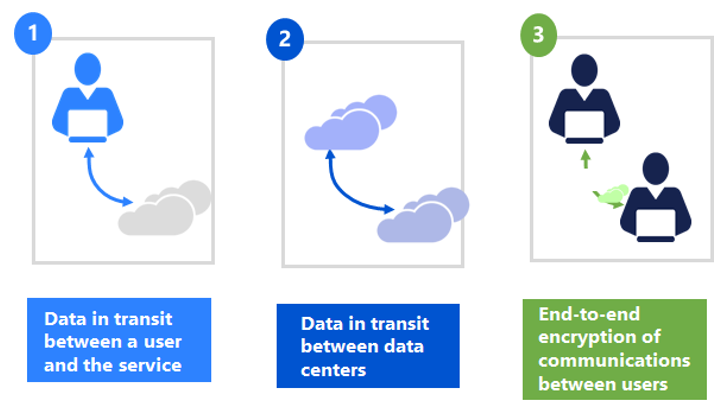
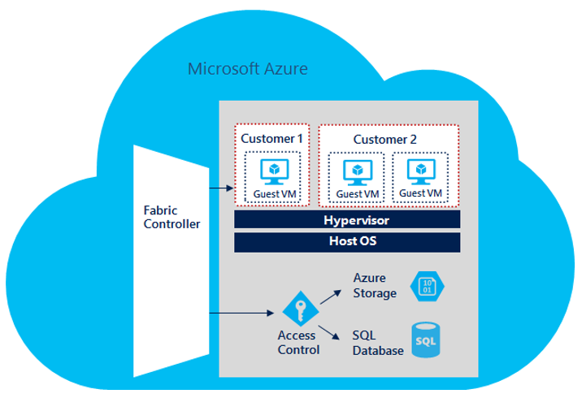
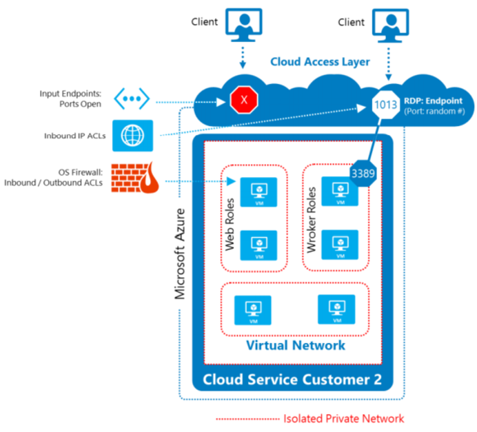
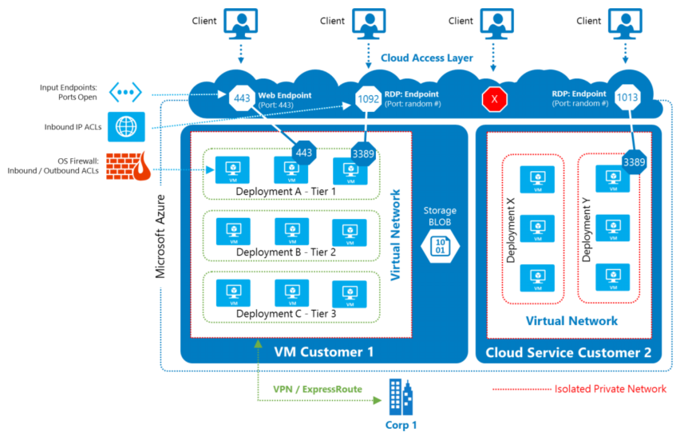
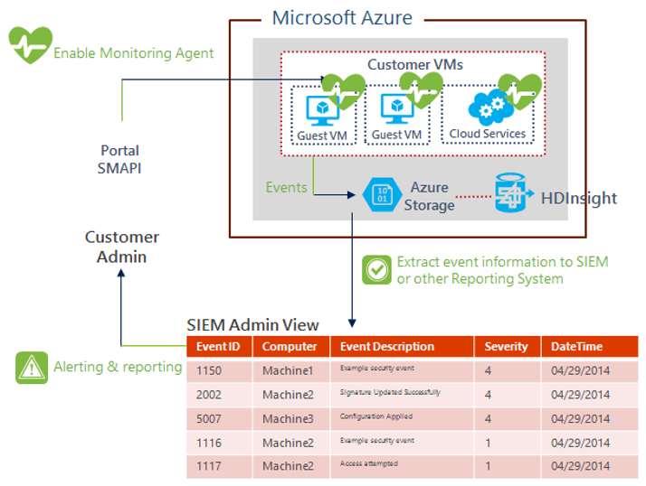

<properties
   pageTitle="Erste Schritte mit Microsoft Azure-Sicherheit | Microsoft Azure"
   description="Dieser Artikel enthält eine Übersicht über Funktionen, die Microsoft Azure-Sicherheit und Allgemeines für Organisationen, die ihren Ressourcen in einen Cloudanbieter migrieren."
   services="security"
   documentationCenter="na"
   authors="YuriDio"
   manager="swadhwa"
   editor="TomSh"/>

<tags
   ms.service="security"
   ms.devlang="na"
   ms.topic="article"
   ms.tgt_pltfrm="na"
   ms.workload="na"
   ms.date="05/19/2016"
   ms.author="yuridio"/>

#Erste Schritte mit Microsoft Azure-Sicherheit

Beim Erstellen oder Migrieren von IT-Ressourcen in einen Cloudanbieter, sind Sie verlassen, auf der Organisation Funktionen zum Schutz der Anwendungen und die Daten, die Sie für ihre Dienste und die Sicherheit-Steuerelemente, die sie Sie, um die Sicherheit Ihrer Anlagen cloudbasierten steuern bieten vertrauen.

Der Azure-Infrastruktur soll aus der Einrichtung Applikationen für Millionen von Kunden gleichzeitig hosten und Bereitstellen von einer vertrauenswürdigen Foundation Gegenstand Unternehmen ihre Sicherheit Bedürfnisse zuzuschneiden. Darüber hinaus bietet Azure Ihnen eine Vielzahl von konfigurierbare Sicherheitsoptionen und die Möglichkeit, diese steuern, damit Sie die Sicherheit, um die Bereitstellung Ihrer eindeutigen erfüllen anpassen können.

In diesem Übersichtsartikel zur Azure-Sicherheit werden erläutert:

-   Azure Dienste und Features, die Sie zum Schützen Ihrer Dienste und der Daten in Azure verwenden können

-   Wie Microsoft die Azure Infrastruktur zum Schutz Ihrer Daten und Applikationen sichert

##Verwaltung von Identität und Zugriff

Es ist entscheidend, Steuern des Zugriffs auf IT-Infrastruktur, Daten und Applikationen. Diese Funktionen sind in Microsoft Azure von Diensten wie Azure Active Directory, Azure-Speicher und Support für zahlreiche Standards und APIs übermittelt.

[Azure-Active Directory](../active-directory/active-directory-whatis.md) (Azure AD) ist ein Repository Identität und -Engine, die für Benutzer, Gruppen und Objekte eines Unternehmens Authentifizierung, Autorisierung und Access-Steuerelement enthält. Azure AD auch bietet Entwickler eine effiziente Möglichkeit Identitätsmanagement in ihre Clientanwendungen integriert werden soll. Protokolle nach Industriestandard wie [SAML 2.0](https://en.wikipedia.org/wiki/SAML_2.0), [WS-Verbund](https://msdn.microsoft.com/library/bb498017.aspx)und [Verbinden OpenID](http://openid.net/connect/) macht Anmeldung möglich auf einer Vielzahl von Plattformen wie .NET, Java, Node.js und PHP.

Die REST-basierten Graph-API ermöglicht Entwicklern das Lesen und Schreiben in dem Verzeichnis aus einer beliebigen Plattform. Durch die Unterstützung für [OAuth 2.0](http://oauth.net/2/)können Entwickler mobilen und Webanwendungen, die mit Microsoft und Drittanbietern Web APIs integriert werden soll, und erstellen ihre eigenen secure Web APIs. Open-Source-Client-Bibliotheken stehen für .net, Windows Store, iOS und Android mit zusätzlichen Bibliotheken in der Entwicklung.

### Wie Azure ermöglicht Identität und Access-Verwaltung

Azure AD kann als eigenständigen Cloud Verzeichnis für Ihre Organisation oder eine integrierte Lösung mit Ihrer vorhandenen lokalen Active Directory verwendet werden. Einige Features für die Integration gehören Verzeichnis synchronisieren und einmaliges Anmelden (SSO). Diese erweitern Sie die Reichweite Ihrer vorhandenen lokalen Identitäten in der Cloud und mit der Administrator und Endbenutzer verbessern.

Einige andere Funktionen für die Verwaltung von Identität und Access gehören:

-   Azure AD ermöglicht [SSO](https://azure.microsoft.com/documentation/videos/overview-of-single-sign-on/) SaaS Applications, unabhängig davon, wo sie gehostet sind. Einige Programme werden Verbund mit Azure AD- und andere Kennwort SSO verwenden. Partnerverbundkontakte Anwendungen können auch Benutzer bereitgestellt und Kennwort Vaulting unterstützen.

-   Zugriff auf Daten in [Azure-Speicher](https://azure.microsoft.com/services/storage/) wird über Authentifizierung gesteuert. Jedes Storage-Konto hat einen Primärschlüssel ([Kontoschlüssel Speicher](https://msdn.microsoft.com/library/azure/ee460785.aspx)oder SAK) und sekundären geheimen Schlüssel (der Access-Signatur freigegeben oder SAS).

-   Azure AD bietet Identität als Dienst Verbunds (mit [Active Directory Federation Services](../active-directory/fundamentals-identity.md), Synchronisierung und Replikation mit lokalen Verzeichnissen aus.

-   [Azure mehrstufige Authentifizierung (MFA)](../multi-factor-authentication/multi-factor-authentication.md) ist der kombinierte Authentifizierung-Dienst, der benötigt der Benutzer auch mithilfe einer mobile-app, Telefonanruf oder Textnachricht Sign-ins überprüfen. Es kann mit Azure AD verwenden, um die lokale Ressourcen mit dem Azure MFA-Server und mit benutzerdefinierten Programmen und Verzeichnisse mit dem SDK zu sichern.

-   [Azure-Active Directory-Domänendiensten](https://azure.microsoft.com/services/active-directory-ds/) können Sie die Azure-virtuellen Computern zu einer Domäne, ohne dass Domänencontroller bereitstellen hinzufügen. Benutzer können diesen virtuellen Computern mit ihren corporate Active Directory-Anmeldeinformationen an- und Verwenden von Gruppenrichtlinien zum Erzwingen der Sicherheit Basisplänen auf alle Ihre Azure-virtuellen Computern Domänenverbund virtuellen Computern verwalten.

-   [Azure Active Directory B2C](https://azure.microsoft.com/services/active-directory-b2c/) bietet Ihnen eine hoch verfügbare und globale Identität Verwaltungsdienst für Applikationen Consumer zugänglichen, die von Millionen von Identitäten skaliert. Sie können über Mobile integriert werden und web-Plattformen. Ihre Consumer können alle Ihre Applikationen durch anpassbare Erfahrung anhand ihrer vorhandenen sozialen Benutzerkonten oder durch Erstellen von neuen Anmeldeinformationen anmelden.

##Access-Steuerelement und Verschlüsselung

Microsoft setzt die Grundsätze der Trennung von Aufgaben und [Minimalen Rechte](https://en.wikipedia.org/wiki/Principle_of_least_privilege) in der gesamten Azure Vorgänge an. Zugriff auf Daten nach Azure Supportmitarbeiter erfordert die explizite Berechtigung und ist gewährt auf Basis "nur-in-Time", die protokolliert und überwacht wird, klicken Sie dann widerrufen nach Abschluss des Projekts.

Darüber hinaus bietet Azure mehrere Funktionen zum Schutz von Daten in Übertragung und am-Rest, einschließlich der Verschlüsselung für Daten, Dateien, Anwendungen, Services, Kommunikation und Laufwerke. Sie haben die Möglichkeit, Informationen, bevor Sie in Azure Ähnlichkeit sowie Speichern von Tasten in Ihrem lokalen Rechenzentren verschlüsseln.

### Azure Verschlüsselung Technologien

Sie können mithilfe von [Azure AD-Reporting](../active-directory/active-directory-reporting-audit-events.md)Details auf Administratorzugriff auf Ihre Umgebung Abonnement sammeln. Sie haben die Möglichkeit, [Der BitLocker](https://technet.microsoft.com/library/cc732774.aspx) auf virtuellen Festplatten mit vertraulichen Informationen in Azure konfigurieren.

Einschließen von anderen Funktionen in Azure, die Sie zum Schutz Ihrer Daten unterstützen:

-   Anwendung können Entwickler Verschlüsselung in Programme, die sie in Azure bereitstellen mithilfe der Windows- [CryptoAPI](https://msdn.microsoft.com/library/ms867086.aspx) und .NET Framework.

- Clientseitige Verschlüsselung für Microsoft BLOB-Speicher ermöglichen Ihnen die Tasten vollständig steuern.  Der Speicherdienst nie sieht die Tasten und ist nicht in der Lage Entschlüsseln der Daten.

-   [Azure RMS](https://technet.microsoft.com/library/jj585026.aspx) (mit dem [RMS-SDK](https://msdn.microsoft.com/library/dn758244.aspx) bietet Datei- und Datenebene Verschlüsselung und Verlust Datenverlust durch Access Policy-basiertes Management.

-   Azure unterstützt die [Tabelle und Spalte Verschlüsselung (TDE/Gitternetz)](http://blogs.msdn.com/b/sqlsecurity/archive/2015/05/12/recommendations-for-using-cell-level-encryption-in-azure-sql-database.aspx) in SQL Server virtuellen Computern und unterstützt von Drittanbietern lokalen Schlüsselverwaltungsdienst-Servern in Rechenzentren Kunden.

-   Tasten für Speicher-Konto, Access Signaturen freigegeben, Management Zertifikate und andere Tasten gelten nur für jede Azure Mandanten.

-   Azure [StorSimple](http://www.microsoft.com/server-cloud/products/storsimple/overview.aspx) Hybrid-Speicher verschlüsselt Daten über eine 128-Bit-öffentlichen / privaten Schlüssel Paar vor dem Hochladen der Datei auf Azure-Speicher.

-   Azure unterstützt und zahlreichen Verschlüsselungsmechanismen, einschließlich SSL/TLS, IPsec und AES, je nach den Datentypen und Container und den Transport verwendet.

##Virtualisierung

Die Azure Plattform verwendet eine virtualisierte Umgebung. Benutzerinstanzen als eigenständigen virtuellen Computern, die keinen Zugriff auf einen Server physischen Host fungieren, und diese Isolation wird erzwungen physischen [Prozessor (Ring-0/anrufen-3) Berechtigungsstufen](https://en.wikipedia.org/wiki/Protection_ring)verwenden.

Ring 0 ist die Berechtigungen und 3 die wenigsten. Weniger rechten anrufen 1 Gast-BS wird ausgeführt und Anwendungen in der letzten berechtigten Ring 3. Diese Virtualisierung von physischen Ressourcen führt zu einer klar zwischen Gast OS und Hypervisor, wodurch zusätzliche Sicherheit Trennung zwischen den beiden.

Azure des Hypervisor verhält sich wie eine Micro-Kernel und übergibt alle Hardware zugriffsanforderungen virtuellen Gastcomputern an den Host für die Verarbeitung von einer freigegebenen Arbeitsspeicher Schnittstelle VMBus bezeichnet. Dies verhindert, dass Benutzer unformatierten lesen, schreiben, Ausführen Zugriff auf das System abrufen und reduziert das Risiko Systemressourcen freigeben.

### Wie Virtualisierung implementiert Azure

Azure verwendet eine Firewall Hypervisor (Paketfilter), das in der Hypervisor implementiert und von einem Fabric Controller-Agent konfiguriert ist. Auf diese Weise können Mandanten vor unbefugtem Zugriff schützen. Standardmäßig können Sie beim Erstellen ein virtuellen Computers gesamten Verkehr ist gesperrt und der Fabric Controller Agent konfiguriert anschließend den Paketfilter, um *Regeln und Ausnahmen* , die autorisierte Datenverkehr zulassen hinzuzufügen.

Es gibt zwei Kategorien von Regeln, die so programmiert werden:

-   **Konfiguration des Computers oder Infrastruktur Regeln**: Standardmäßig ist die gesamte Kommunikation blockiert. Es gibt Ausnahmen ein virtuellen Computers zu senden und Empfangen von DHCP- und DNS-Datenverkehr zulassen. Virtuellen Computern können auch den Datenverkehr mit dem Internet "Öffentliche" Senden und senden den Datenverkehr anderen virtuellen Computern innerhalb der Cluster und OS Aktivierungs-Server. Der virtuellen Computern ausgehenden Zielliste schließt Azure Router Subnetze, Azure Management Back-End und andere Eigenschaften von Microsoft nicht zulässig.

-   **Konfigurationsdatei Rolle**: Hiermit wird die eingehende ACLs basierend auf den Mandanten Service-Modells definiert. Beispielsweise weist ein Mandanten eine Front-End-Web auf einen bestimmten virtuellen Port 80, wird dann Azure TCP-80 zu allen IP-Adressen konfigurieren von außen liegenden Tabellenblättern im Modell [Servicemanagement Azure](../resource-manager-deployment-model.md) sind. Wenn Sie der virtuellen Computer eine Back-End- oder Worker-Rolle ausgeführt wurde, wird die Worker-Rolle nur für den virtuellen Computer innerhalb des gleichen Mandanten geöffnet.

##Grad der Isolation

Verwalten von Trennung, um zu verhindern, dass nicht autorisierte und unbeabsichtigte Übertragung von Informationen zwischen Bereitstellungen in einer freigegebenen mit mehreren Mandanten Architektur ist eine weitere wichtige Cloud Security Anforderung.

Azure implementiert [Network Access Steuerelement](https://azure.microsoft.com/blog/network-isolation-options-for-machines-in-windows-azure-virtual-networks/) und Trennung bis VLAN Isolation, ACLs, laden Balancers und IP-Filter aus. Externe eingehende Netzwerkverkehr Ihre virtuelle Computer ist eingeschränkt zu Ports und Protokolle, die Sie definieren. Filterung wird implementiert, um zu verhindern, dass gefälschten Datenverkehr und beschränkt den eingehenden und ausgehenden Datenverkehr auf vertrauenswürdige Plattform-Komponenten. Richtlinien für den Datenverkehr Fluss werden standardmäßig auf Begrenzungslinie Schutz Geräten, die den Datenverkehr verweigern implementiert.

(Netzwerkadressübersetzung) wird verwendet, um die internen Netzwerkverkehr von externen Datenverkehr zu trennen. Interner Datenverkehr kann nicht extern weitergeleitet werden. [Virtuelle IP-Adressen](http://blogs.msdn.com/b/cloud_solution_architect/archive/2014/11/08/vips-dips-and-pips-in-microsoft-azure.aspx) , die extern geroutet werden werden [Internen dynamische IP](http://blogs.msdn.com/b/cloud_solution_architect/archive/2014/11/08/vips-dips-and-pips-in-microsoft-azure.aspx) -Adressen, die nur in Azure geroutet werden übersetzt.

Externe den Datenverkehr in Azure-virtuellen Computern wird über Access Control Lists (ACLs) auf Routern Lastenausgleich, Firewall und wechselt Layer 3. Nur bestimmte bekannte Protokolle zulässig sind. ACLs sind direkte Verkehr von Gastcomputern zu anderen VLANs verwendet für die Verwaltung zu beschränken. Darüber hinaus Datenverkehr gefiltert über IP-Filter auf dem Host OS, den Datenverkehr auf beide Ebenen Daten, Link und Netzwerk weiter einschränken.

### Wie Azure Isolation implementiert

Der Azure Fabric Controller ist verantwortlich für das Zuweisen von Infrastrukturressourcen für Auslastung Mandanten und unidirektionale Kommunikation vom Server zum virtuellen Computern verwaltet. Der Azure Hypervisor erzwingt einen Arbeitsspeicher und Prozess Abstand zwischen virtuellen Computern und sichere leitet Netzwerkdatenverkehr zu Gast OS Mandanten. Azure implementiert auch Isolation für den Mandanten, Speicher und virtuelle Netzwerke:

-   Jede Azure AD-Mandanten ist logisch isoliert Sicherheit Begrenzung verwenden.

-   Azure-Speicher-Konten sind für jedes Abonnement eindeutig und Access mit einem Speicher Kontoschlüssel authentifiziert werden muss.

-   Virtuelle Netzwerke werden durch eine Kombination von eindeutigen privaten IP-Adressen, Firewalls und IP-ACLs logisch isoliert. Laden Balancers Weiterleitung von Verkehr an den entsprechenden Mandanten basierend auf Endpunktdefinitionen.

##Virtuelle Netzwerk- und firewall

Die [verteilte und virtuelle Netzwerke](http://download.microsoft.com/download/4/3/9/43902EC9-410E-4875-8800-0788BE146A3D/Windows%20Azure%20Network%20Security%20Whitepaper%20-%20FINAL.docx) in Azure können Sie sicherstellen, dass Ihre privaten Netzwerkdatenverkehr logisch von den Datenverkehr in anderen Azure-virtuellen Netzwerken isoliert ist.

Ihr Abonnement kann mehrere isoliert private Netzwerke enthalten (und enthalten Firewall, den Lastenausgleich und Network Address Translation).

Azure bietet drei primären Netzwerk Trennung in jedem Azure Cluster logisch Aufteilen des Datenverkehrs. [Virtuelle lokale Netzwerke](https://azure.microsoft.com/services/virtual-network/) (VLANs) werden verwendet, um die Kunden Datenverkehr gegenüber dem Rest des Netzwerks Azure zu trennen. Zugriff auf das Azure Netzwerk von außerhalb der Cluster ist durch Lastenausgleich eingeschränkt.

Netzwerkdatenverkehr an und von virtuellen Computern muss über die virtuelle Umschaltung Hypervisor übergeben. Die IP-Filter-Komponente im Stammverzeichnis BS wird Rootbetriebssystems von der Gastcomputern und die Gastcomputern voneinander isoliert. Filtern des Datenverkehrs zum Einschränken der Kommunikation zwischen Mandanten Knoten und dem öffentlichen Internet (basierend auf Kunden Dienstkonfiguration), sie aus anderen Mandanten Trennung durchgeführt.

Der IP-Filter verhindert den virtuellen Gastcomputern aus:

- Generieren von gefälschten Datenverkehr

- Empfangen von Datenverkehr können nicht berücksichtigt.

- Leiten den Datenverkehr in geschützten Infrastruktur Endpunkte

- Senden oder Empfangen von unangemessene übertragenen Datenverkehr

Sie können Ihren virtuellen Computern auf [Azure-virtuellen Netzwerken](https://azure.microsoft.com/documentation/services/virtual-network/)platzieren. Diese virtuelle Netzwerke sind ähnlich wie die Netzwerke, die Sie in einer lokalen Umgebung konfigurieren, in dem sie einen virtuellen Switch in der Regel zugeordnet sind. Virtuelle Computer mit dem gleichen Azure-virtuellen Netzwerk verbunden können miteinander ohne zusätzliche Konfiguration kommunizieren. Sie haben auch die Option zum Konfigurieren der verschiedenen Subnets innerhalb des virtuellen Azure-Netzwerks.

Die folgenden Azure-virtuellen Netzwerk Technologien können sichere Kommunikation in Ihrem Azure-virtuellen Netzwerk unterstützen:

-   [**Netzwerk-Sicherheitsgruppen (NSG)**](../virtual-network/virtual-networks-nsg.md). Sie können eine NSG Steuerelement Datenverkehr an eine oder mehrere Instanzen von virtuellen Computern (virtueller Computer) in Ihrem Netzwerk virtuelle verwenden. Eine NSG enthält Access Steuerelement Regeln, die zulassen oder Datenverkehr basierend auf den Datenverkehr Richtung, Protokoll, Quellbilds und Port, und Zieladresse und Port verweigern.

-   [**Benutzerdefinierte Routing**](../virtual-network/virtual-networks-udr-overview.md). Sie können steuern, das routing von Paketen über eine virtuelle Einheit durch Erstellen von benutzerdefinierten weitergeleitet, die den nächsten Abschnitt für Pakete parallelen mit einem bestimmten Subnetz zu wechseln angeben einer Ihre virtuelle Netzwerk Sicherheit Einheit.

-   [**IP-forwarding**](../virtual-network/virtual-networks-udr-overview.md). Eine virtuelle Netzwerk Sicherheit Einheit muss eingehenden Datenverkehr empfangen, der nicht an sich selbst adressiert ist. Um einen virtuellen Computer zum Empfangen von Datenverkehr an andere Ziele berücksichtigt zuzulassen, aktivieren Sie IP-Weiterleitung für den virtuellen Computer.

-   [**Erzwungene Tunnel**](../vpn-gateway/vpn-gateway-about-forced-tunneling.md). Erzwungene Tunneling-ermöglicht, die Sie umleiten oder alle Internet gerichtete Datenverkehr, die auf Ihre virtuellen Computer in Azure-virtuellen "erzwingen" zurück zu Ihren lokalen Standort über eine Website-zu-Standort VPN-Tunnel für Prüfung und Überwachung

-   [ **Endpunkt** ACLs](../virtual-machines/virtual-machines-windows-classic-setup-endpoints.md). Sie können steuern, welche Computer eingehende Verbindungen aus dem Internet mit einem virtuellen Computer im Netzwerk virtuelle Azure zulässig sind durch Endpunkt ACLs definieren.

-   [**Partner Network Security Solutions**](https://azure.microsoft.com/marketplace/). Es gibt eine Anzahl von Partner Network Security-Lösung, die Sie aus dem Azure Marketplace zugreifen können.

### Wie Azure virtuelle Netzwerke und Firewall implementiert

Azure Firewalls Paket filtern, die für alle Host und Gast virtuellen Computern standardmäßig implementiert wird. Windows-Betriebssystem Bilder aus dem Katalog Azure besitzen außerdem die Windows-Firewall standardmäßig aktiviert. Lastenausgleich an den äußeren Azure des öffentlich zugänglichen Netzwerken Steuerelement weitergeben Grundlage IP-ACLs von Kunden Administratoren verwaltet werden.

Wenn die Daten eines Kunden als Teil der normalen Vorgänge oder während einem Datenverlust Azure verschoben werden, geschieht dies über private, verschlüsselte Kommunikationskanäle. Andere-Funktionen zur Verwendung in virtuelle Netzwerke und Firewall von Azure genutzt sind:

-   **Systemeigene Host Firewall**: Azure-Struktur und Speicher auf einer systemeigenen OS die hat keine Hypervisor ausgeführt und daher die Windows-Firewall mit den oben angegebenen zwei Sätze von Regeln konfiguriert ist. Speicher führt systemeigenen, um die Leistung zu optimieren.

-   **Host Firewall**: Host-Firewall besteht darin, des Hostbetriebssystems schützen, der den Hypervisor ausgeführt wird. Die Regeln werden nur den Fabric Controller zulassen und Felder zum Kommunizieren mit dem Host OS an einem bestimmten Port springen programmiert. Die anderen Ausnahmen sind, um DHCP-Antwort und DNS-Antworten zu ermöglichen. Azure verwendet, die Konfiguration des Computers Datei über die Vorlage eines firewall-Regeln für die Host-Betriebssystem. Der Host selbst wird durch einen Windows-Firewall so konfiguriert, dass nur Kommunikation von bekannten, authentifizierten Quellen vor externen geschützt.

-   **Gast Firewall**: repliziert die Regeln im virtuellen Computer wechseln Paket Filter jedoch programmierten in verschiedenen Software (d. h. der Windows-Firewall Teil der Gast-BS). Selbst wenn die Kommunikation von Konfigurationen am Host IP Filter zulässig ist, kann die Gast virtueller Computer Firewall zum Einschränken der Kommunikation in den oder aus dem Gast virtueller Computer, konfiguriert werden. Sie können beispielsweise die Gast virtueller Computer-Firewall zu verwenden, um die Kommunikation zwischen zwei der Ihrer VNets einschränken, die so konfiguriert haben, dass Sie um miteinander zu verbinden.

-   **Speicher Firewall (FW)**: die Firewall auf die Front-End-Speicher filtert Datenverkehr nur auf 80/443 und anderen notwendigen Programm Ports sein. Die Firewall auf die Back-End-Speicher beschränkt Kommunikation einfügt nur von Speicher Front-End-Servern.

-   **Virtuelle Netzwerk-Gateway**: [Azure-virtuellen Netzwerkgateways](../vpn-gateway/virtual-networks-configure-vnet-to-vnet-connection.md) dienen als das Kreuz Gebäuden der Gateways verbinden Ihrer Auslastung in Azure-virtuellen Netzwerk auf lokale Websites. Es ist erforderlich, klicken Sie auf lokale Websites über [IPsec Standort-zu-Standort VPN-Tunnel](../vpn-gateway/vpn-gateway-create-site-to-site-rm-powershell.md)oder [ExpressRoute](../expressroute/expressroute-introduction.md) Schaltkreise eine Verbindung zu. Für IPSec-/IKE VPN-Tunnel Gateways IKE Handshakes ausführen, und der IPsec S2S VPN-Tunnel zwischen den virtuellen Netzwerken und auf lokale Websites einrichten. Virtuelle Netzwerkgateways beendet auch [Punkt-zu-Standort VPN](../vpn-gateway/vpn-gateway-point-to-site-create.md).

##Sicheren Remote-Zugriff

In der Cloud gespeicherte Daten müssen ausreichende Garantien aktiviert, um zu verhindern, dass Angriffen und Vertraulichkeit und Integrität während in Übertragung beizubehalten. Dies umfasst Netzwerk-Steuerelemente, die mit einer Organisation Policy-basierte, überwachten Identität Access Management Verfahren zur und aneinander anpassen.

Integrierte cryptographic Technologie können Sie zum Verschlüsseln der Kommunikation innerhalb und zwischen Bereitstellungen zwischen Azure Regionen und aus Azure zu lokalen Rechenzentren. Administratorzugriff auf virtuelle Maschinen über [remote desktop Sitzungen](../virtual-machines/virtual-machines-windows-classic-connect-logon.md), [remote Windows PowerShell](http://blogs.technet.com/b/heyscriptingguy/archive/2013/09/07/weekend-scripter-remoting-the-cloud-with-windows-azure-and-powershell.aspx)und der Azure-Verwaltungsportal ist immer verschlüsselt.

Um sicher Datencenters lokal in der Cloud zu erweitern, bietet Azure sowohl [Standort-zu-Standort VPN](../vpn-gateway/vpn-gateway-create-site-to-site-rm-powershell.md) und [Punkt-zu-Standort VPN](../vpn-gateway/vpn-gateway-point-to-site-create.md), sowie dedizierte Verknüpfungen mit [ExpressRoute](../expressroute/expressroute-introduction.md) (Verbindungen mit Azure-virtuellen Netzwerken über VPN verschlüsselt sind).

### Wie implementiert Azure sicheren remote-Zugriff

Verbindungen mit Azure-Portal immer authentifiziert werden müssen, und erfordern SSL/TLS aus. Sie können Management Zertifikate zum Aktivieren der sicheren Verwaltung konfigurieren. Protokolle nach Industriestandard secure wie [SSTP](https://technet.microsoft.com/magazine/2007.06.cableguy.aspx) und [IPsec](https://en.wikipedia.org/wiki/IPsec) werden vollständig unterstützt.

[ExpressRoute Azure](../expressroute/expressroute-introduction.md) ermöglicht die Erstellung private Verbindungen zwischen Azure Rechenzentren und Infrastruktur, die Ihre lokal oder in einer Umgebung für die gemeinsame Speicherort ist. ExpressRoute Verbindungen gehen Sie nicht über das öffentliche Internet. Sie bieten weitere Zuverlässigkeit, höhere Geschwindigkeit, unteren Wartezeiten und höhere Sicherheit als normaler internetbasierten Hyperlinks. In einigen Fällen kann mithilfe von ExpressRoute-Verbindungen zum Übertragen von Daten zwischen lokalen und Azure auch signifikante Kostenvorteile erzielt werden.

##Protokollierung und Überwachung

Azure bietet authentifizierten Protokollierung der Sicherheit relevanten Ereignisse, die ein Protokoll zu generieren, und ist so gegen Manipulation werden konzipiert. Dies umfasst Systeminformationen, wie z. B. Ereignisprotokollen in Azure Infrastruktur virtuellen Computern und Azure AD-Sicherheit. Überwachen von Ereignissen Sicherheit umfasst sammeln Ereignisse wie Änderungen in DHCP- oder DNS-Server IP-Adressen versuchten Zugriff auf Ports, Protokolle oder IP-Adressen, die durch Auswahl der blockierten entwerfen, Änderungen in Sicherheitseinstellungen Richtlinie oder die Firewall, Konto oder eine Gruppe erstellen, unerwartete Prozesse oder Treiberinstallation.

Überwachungsprotokolle Aufzeichnung Berechtigungen des Benutzerzugriffs und Aktivitäten, autorisierten und nicht autorisierten Zugriffsversuche, Ausnahmen System und Sicherheitsereignisse für einen bestimmten Zeitraum beibehalten werden Informationen. Die Speicherung von Ihrem Protokolle ist je nach Bedarf, da Sie Log-Sammlung und Aufbewahrung an Ihre eigenen Bedürfnisse konfigurieren.

### Wie implementiert Azure Protokollierung und Überwachung

Azure bereitstellt Management Agents (MA) und Azure Sicherheit Monitor Jahr-Agents auf jede berechnen, Speicher oder Fabric Knoten unter Verwaltung, ob diese systemeigener oder virtuelle sind. Jeder Management-Agent ist für ein Team-Speicher Dienstkonto mit einem Zertifikat aus dem Azure-Zertifikatspeicher abgerufen und Weiterleiten vorkonfiguriert Diagnose und Ereignisdaten mit dem Speicherkonto authentifizieren konfiguriert. Diese Agents werden nicht auf Kunden-virtuellen Computern bereitgestellt.

Azure-Administratoren können Protokolle für den authentifizierten und gesteuert Zugriff auf die Protokolle ein Web-Portal zugreifen. Ein Administrator kann analysieren, filtern, koordinieren und Protokolle zu analysieren. Die Azure Team Speicher Dienstkonten für Protokolle sind vor direkten Administratorzugriff zu verhindern, dass gegen Log Manipulation geschützt.

Microsoft sammelt Protokolle aus mit dem Syslog-Protokoll Netzwerkgeräte und Host-Servern mit Microsoft Audit Collection Services (ACS). Diese Protokolle befinden sich in einer Protokoll-Datenbank aus denen Benachrichtigungen für verdächtige Ereignisse direkt mit einem Microsoft-Verbindung generiert werden. Der Administrator kann zugreifen und diese Protokolle analysieren.

[Azure-Diagnose](https://msdn.microsoft.com/library/azure/gg433048.aspx) ist ein Feature von Azure, die Sie zum Sammeln von Diagnoseprotokollen Daten aus einer Anwendung in Azure ausführen kann. Dies ist für das Debuggen und Problembehandlung, Messen der Leistung Überwachung Ressource: Einsatz hinzu, Analyse des Datenverkehrs und Kapazität, Planung und Überwachung diagnostic Daten. Nachdem die Diagnose Daten gesammelt wurden, können sie mit einer Firma Azure-Speicher für eine Beibehaltung übertragen werden. Übermittlungen können entweder geplant werden oder bei Bedarf.

##Bedrohung Reduzierung

Zusätzlich zu den Grad der Isolation, Verschlüsselung und Filtern beschäftigt Azure eine Reihe von Bedrohung Reduzierung Verfahren und Prozessen geschützt Infrastruktur und alle Dienste. Hierzu gehören internen Steuerelemente und Technologien zum Erkennen und Beheben von erweiterten Risiken wie DDoS, Berechtigungseskalation und die [OWASP Top-10](https://www.owasp.org/index.php/Category:OWASP_Top_Ten_Project)verwendet.

Reduzieren das Risiko handelt, die Sicherheit Steuerelemente und Risikomanagement Microsoft direkte seine Cloudinfrastruktur gesichert wird. Aber den Fall, dass ein Vorfall stattfindet, ist das Team Sicherheit Vorfall Management (SIM) innerhalb der Microsoft Onlinedienste Sicherheit und Einhaltung von Vorschriften (OSSC) Team bereit 24 x 7 reagiert.

### Wie Azure Bedrohung Reduzierung implementiert

Azure weist Sicherheit Steuerelemente direkte Bedrohung Reduzierung implementieren und unterstützen von Kunden minimieren mögliche Risiken in ihrer Umgebung. Die folgenden Liste sind die Bedrohung Reduzierung Funktionen Azure zusammengefasst:

-   [Azure Anti-Malware](../security/azure-security-antimalware.md) wird auf allen Infrastrukturservern standardmäßig aktiviert. Sie können optional innerhalb Ihrer eigenen virtuellen Computern aktivieren.

-   Microsoft unterhält fortlaufender Überwachung über Server, Netzwerke und eine Anwendung Risiken erkennen und verhindern, dass Angriffen. Automatisierte Benachrichtigungen benachrichtigen Administratoren abweichenden Verhaltensweisen, gleicht diese Maßnahme internen und externen Risiken übergeben.

-   Sie haben die Möglichkeit, 3rd Drittanbietern Sicherheit Lösungen innerhalb Ihrer Abonnements, z. B. Web Anwendung Firewalls von [Barracuda](https://techlib.barracuda.com/ng54/deployonazure)bereitstellen.

-   Microsoft Methode zum Durchdringungstests enthält "[Rot Kombination](http://download.microsoft.com/download/C/1/9/C1990DBA-502F-4C2A-848D-392B93D9B9C3/Microsoft_Enterprise_Cloud_Red_Teaming.pdf)", die Microsoft Security Professionals Angriffen auf (nicht Kunde) live Herstellung Systeme in Azure testen Schutz gegen praktisches, erweiterte beständigen umfasst.

-   Integrierte Bereitstellung Systeme verwalten die Verteilung und Installation von Sicherheitsupdates über die Azure-Plattform an.

##Nächste Schritte

[Azure Trust Center](https://azure.microsoft.com/support/trust-center/)

[Sicherheit von Azure-Teamblog](http://blogs.msdn.com/b/azuresecurity/)

[Microsoft-Antwort Sicherheitscenter](https://technet.microsoft.com/library/dn440717.aspx)

[Active Directory-Blog](http://blogs.technet.com/b/ad/)
