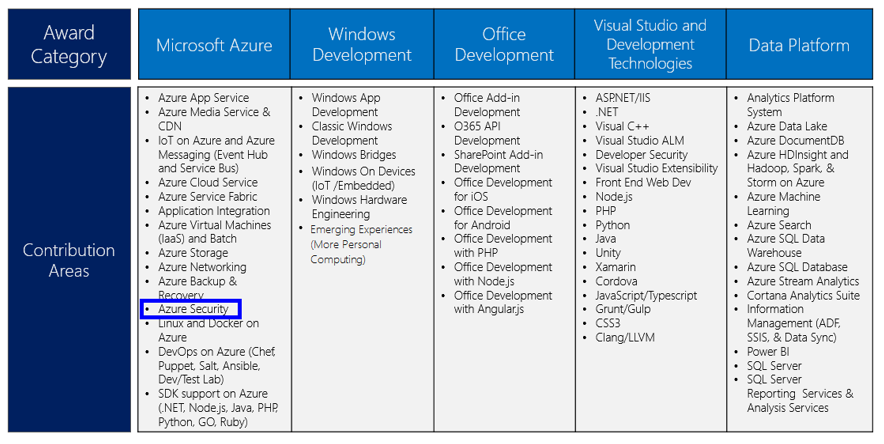

<properties
   pageTitle="MVP-Programm Sicherheit von Azure | Microsoft Azure"
   description="Der Artikel bietet einen Überblick über die Azure Sicherheitsbereichen-Beitrag in das MVP-Programm."
   services="security"
   documentationCenter="na"
   authors="TomShinder"
   manager="StevenPo"
   editor="TomSh"/>

<tags
   ms.service="security"
   ms.devlang="na"
   ms.topic="article"
   ms.tgt_pltfrm="na"
   ms.workload="na"
   ms.date="10/18/2016"
   ms.author="yurid"/>

# MVP-Programm Azure-Sicherheit

Microsoft Most Valuable Professionals (MVPs) sind Community Füllzeichen, wer eine exemplarische Zusicherung für den Schutz gezeigt haben, die andere Personen ihre Erfahrung mit Microsoft-Technologien optimal nutzen. Diese freigeben Community und Microsoft außergewöhnlichen Leidenschaft, praktisches Wissen, und Fachwissen.

Es tut mitteilen zu können, dass Microsoft Azure jetzt Community-Experten mit speziellen Fachwissen Azure-Sicherheit erkennt. Microsoft-MVPs können die MVP in Microsoft Azure im Bereich Beitrag Azure Sicherheit verliehen.

Zwar keine Maßstab für die teilweise zunehmend von MVP, da es nach Technologie und seines Lebenszyklus je, enthalten einige der Kriterien, die wir Auswerten den Einfluss der eine Kandidaten Beiträge zu online-Foren, wie etwa Microsoft Answers, TechNet und MSDN; Wikis und online-Inhalten; Konferenzen und die Benutzergruppen; Podcasts, Websites, Blogs und soziale Medien; und Artikel und Bücher. 

Sind Sie Experte Azure-Sicherheit? Kennen Sie eine andere Person? Dann [Diskussionsbeiträge sich selbst oder an eine andere Person](https://mvp.microsoft.com/Nomination/nominate-an-mvp) eine Azure Sicherheits-MVP heute vorgesehen ist!
