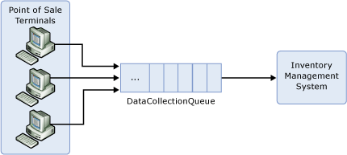
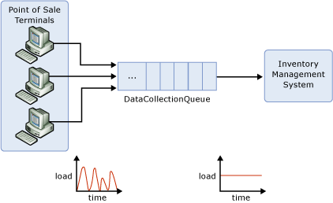
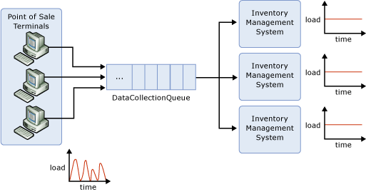

<properties 
    pageTitle="Schreiben, verwenden Servicebuswarteschlangen | Microsoft Azure"
    description="So schreiben Sie eine einfache Warteschlange-basierten Anwendung, die Dienstbus verwendet werden."
    services="service-bus"
    documentationCenter="na"
    authors="sethmanheim"
    manager="timlt"
    editor="" />
<tags 
    ms.service="service-bus"
    ms.devlang="na"
    ms.topic="article"
    ms.tgt_pltfrm="na"
    ms.workload="na"
    ms.date="10/03/2016"
    ms.author="sethm" />

# <a name="create-applications-that-use-service-bus-queues"></a>Erstellen von Applications, die Servicebuswarteschlangen verwenden

In diesem Thema werden Servicebuswarteschlangen und zeigt, wie eine einfache Warteschlange-basierten Anwendung zu schreiben, die Dienstbus verwendet.

Erwägen Sie ein Szenario aus der Welt der Einzelhandel in der Verkaufsdaten von den einzelnen Point-of-Sale () Verkaufsstellenterminals und einem Inventory Management-System muss, die die Daten verwendet weitergeleitet werden, um festzustellen, wann Stock aufgefüllt werden muss. Diese Lösung verwendet Dienstbus messaging für die Kommunikation zwischen der umsteigebahnhöfe und zum Inventory Management-System, wie in der folgenden Abbildung dargestellt:



Jedes POS-Terminal Berichte die Verkaufsdaten durch Senden von Nachrichten an die **DataCollectionQueue**an. Diese Nachrichten verbleiben in dieser Warteschlange, bis sie vom Inventory Managementsystem abgerufen werden. Dieses Muster wird häufig *asynchrones messaging*, bezeichnet, da das POS-Terminal nicht warten, bis eine Antwort aus dem Inventory Managementsystem Verarbeitung fortsetzen muss.

## <a name="why-queuing"></a>Warum queuing?

Bevor wir den Code, die zum Einrichten dieser Anwendungs erforderlich ist betrachten, sollten Sie die Vorteile der Verwendung einer Warteschlange in diesem Szenario, anstatt die Verkaufsstellenterminals sprechen Sie direkt (synchron) an das Inventory Managementsystem.

### <a name="temporal-decoupling"></a>Zeitliche Entkopplung

Mit dem Muster asynchronen messaging haben Hersteller und Verbraucher keine gleichzeitig online sein. Die messaging-Infrastruktur speichert Nachrichten zuverlässig, bis der Teilnehmer in Anspruch nehmen sie empfangen werden. Dies bedeutet, dass die Komponenten einer verteilten Anwendung, entweder freiwillig getrennt werden können. Angenommen, für die Wartung oder aufgrund einer Komponente Absturz, ohne Auswirkungen im gesamte System. Darüber hinaus möglicherweise die Anwendung in Anspruch nehmen nur bestimmten Zeiten des Tages online sein. Angenommen, in diesem Szenario Retail das Inventory Managementsystem nur möglicherweise nach dem Ende des Arbeitstags online sind.

### <a name="load-leveling"></a>Laden Sie die Abgleich

In vielen Programmen variierende System laden im Laufe der Zeit, während die für jede Arbeitseinheit benötigte Verarbeitungszeit normalerweise konstant ist. Intermediating Nachricht Hersteller und Nutzer mit einer Warteschlange bedeutet, dass nur die Anwendung in Anspruch nehmen (der Worker) bereitgestellt werden, um eine durchschnittliche Auslastung statt eine Belastung service. Die Tiefe der Warteschlange wird vergrößert, und wie die eingehende laden variierende Vertrag. Dadurch wird direkt Geld in Bezug auf die Menge der Infrastruktur erforderlich, um die Anwendung laden service gespeichert.



### <a name="load-balancing"></a>Lastenausgleich

Zunehmender die laden können weitere Arbeitsprozesse Lesen aus der Warteschlange hinzugefügt werden. Jede Nachricht wird nur von einem der Arbeitsprozesse verarbeitet werden. Darüber hinaus ermöglicht diese Abruf-basierten Lastenausgleich für optimale Nutzung der Computer Worker selbst wenn die Worker Computer im Hinblick auf Verarbeitung Power, unterscheiden sich diese Nachrichten mit eigene maximale Rate ziehen werden. Dieses Muster wird häufig das verschiedenen Consumer Muster bezeichnet.



### <a name="loose-coupling"></a>Bindung an

Mithilfe von Nachrichtenwarteschlangen, um zwischen den Hersteller der Nachricht und Nutzer mittlere bietet einen integrierten Kopplung zwischen den Komponenten. Da Hersteller und Verbraucher nicht miteinander bekannt sind, kann ein Consumer ohne Auswirkung auf die Producer aktualisiert werden. Darüber hinaus kann die messaging Suchtopologie weiterentwickelt, ohne die vorhandene Endpunkte. Diese wird mehr besprochen, wenn wir von Veröffentlichen/Abonnieren sprechen.

## <a name="show-me-the-code"></a>Anzeigen des Codes

Im folgende Abschnitt veranschaulicht, wie Dienstbus zu verwenden, um diese Anwendung zu erstellen.

### <a name="sign-up-for-an-azure-account"></a>Melden Sie für ein Azure-Konto an

Sie benötigen ein Azure-Konto, um die Arbeit mit Dienstbus beginnen. Wenn Sie nicht bereits eine verfügen, Sie können sich anmelden für ein kostenloses Konto [hier](https://azure.microsoft.com/pricing/free-trial/?WT.mc_id=A85619ABF).

### <a name="create-a-namespace"></a>Erstellen Sie einen namespace

Nachdem Sie ein Abonnement besitzen, können Sie [einen neuen Namespace erstellen](service-bus-create-namespace-portal.md). Jeder Namespace fungiert als Container für eine Gruppe von Personen Dienstbus Bereiche. Geben Sie Ihren neuen Namespace einen eindeutigen Namen über alle Dienstbus Konten hinweg. 

### <a name="install-the-nuget-package"></a>Installieren Sie das NuGet-Paket

Um den Dienstbus Namespace verwenden zu können, muss eine Anwendung Dienstbus Assembly, insbesondere Microsoft.ServiceBus.dll verweisen. Sie können diese Assembly als Teil des Microsoft Azure SDK suchen, und der Download auf der [Downloadseite für Azure SDK](https://azure.microsoft.com/downloads/)verfügbar ist. Der [Dienst Bus NuGet-Paket](https://www.nuget.org/packages/WindowsAzure.ServiceBus) ist jedoch die einfachste Möglichkeit, die Bus-API abzurufenden und so konfigurieren Sie die Anwendung mit allen die Abhängigkeiten Dienstbus.

### <a name="create-the-queue"></a>Erstellen der Warteschlange

Management werden für messaging Einheiten (Warteschlangen und Veröffentlichen/Abonnieren-Themen) Dienstbus über die Klasse [NamespaceManager](https://msdn.microsoft.com/library/azure/microsoft.servicebus.namespacemanager.aspx) Vorgänge. Dienstbus verwendet eine [Freigegebene Access Signatur (SAS)](service-bus-sas-overview.md) basierend Sicherheitsmodell. Die [TokenProvider](https://msdn.microsoft.com/library/azure/microsoft.servicebus.tokenprovider.aspx) -Klasse stellt eine Sicherheitstokenanbieter mit integrierten Factory-Methoden einige bekannte token Anbieter zurückgeben. Wir verwenden eine [CreateSharedAccessSignatureTokenProvider](https://msdn.microsoft.com/library/azure/microsoft.servicebus.tokenprovider.createsharedaccesssignaturetokenprovider.aspx) Methode, die die Anmeldeinformationen SAS enthalten soll. Die [NamespaceManager](https://msdn.microsoft.com/library/azure/microsoft.servicebus.namespacemanager.aspx) Instanz wird dann mit der Basisadresse aus dem Dienstbus Namespace und token-Provider erstellt.

[NamespaceManager](https://msdn.microsoft.com/library/azure/microsoft.servicebus.namespacemanager.aspx) -Klasse stellt Methoden zum Erstellen, auflisten und messaging Elemente löschen. Der Code, der hier dargestellt ist zeigt, wie die Instanz [NamespaceManager](https://msdn.microsoft.com/library/azure/microsoft.servicebus.namespacemanager.aspx) erstellt und verwendet, um die Warteschlange **DataCollectionQueue** zu erstellen.

```
Uri uri = ServiceBusEnvironment.CreateServiceUri("sb", 
                "test-blog", string.Empty);
string name = "RootManageSharedAccessKey";
string key = "abcdefghijklmopqrstuvwxyz";
 
TokenProvider tokenProvider = 
    TokenProvider.CreateSharedAccessSignatureTokenProvider(name, key);
NamespaceManager namespaceManager = 
    new NamespaceManager(uri, tokenProvider);
namespaceManager.CreateQueue("DataCollectionQueue");
```

Beachten Sie, dass es überladenen [CreateQueue](https://msdn.microsoft.com/library/azure/hh322663.aspx) -Methode, mit die Eigenschaften der Warteschlange gibt zu optimiert werden können. Beispielsweise können Sie den Time to live (TTL) Standardwert für Nachrichten, die an die Warteschlange gesendet festlegen.

### <a name="send-messages-to-the-queue"></a>Senden von Nachrichten in der Warteschlange

Für Vorgänge zur Laufzeit Dienstbus Personen; Beispielsweise muss beim Senden und Empfangen von Nachrichten, eine Anwendung zuerst ein Objekt [MessagingFactory](https://msdn.microsoft.com/library/azure/microsoft.servicebus.messaging.messagingfactory.aspx) erstellen. Ähnlich wie der Klasse [NamespaceManager](https://msdn.microsoft.com/library/azure/microsoft.servicebus.namespacemanager.aspx) , wird die [MessagingFactory](https://msdn.microsoft.com/library/azure/microsoft.servicebus.messaging.messagingfactory.aspx) Instanz von der Basisadresse aus dem Dienstnamespace und token-Provider erstellt.

```
 BrokeredMessage bm = new BrokeredMessage(salesData);
 bm.Label = "SalesReport";
 bm.Properties["StoreName"] = "Redmond";
 bm.Properties["MachineID"] = "POS_1";
```

An Nachrichten gesendet und Empfangen von Dienstbus sind Instanzen der Klasse [BrokeredMessage](https://msdn.microsoft.com/library/azure/microsoft.servicebus.messaging.brokeredmessage.aspx) . Diese Klasse besteht aus einer Reihe von Standardeigenschaften (z. B. [Bezeichnungsfeld](https://msdn.microsoft.com/library/azure/microsoft.servicebus.messaging.brokeredmessage.label.aspx) und [TimeToLive](https://msdn.microsoft.com/library/azure/microsoft.servicebus.messaging.brokeredmessage.timetolive.aspx)), ein Wörterbuch, das verwendet wird, die Anwendungseigenschaften, und den Text einer beliebigen Anwendungsdaten enthalten soll. Textkörper durch die Übergabe beliebiges serialisierbares Objekt (im folgende Beispiel übergibt eine **SalesData** -Objekt, das die Umsatzdaten POS-Terminal darstellt), kann der [DataContractSerializer](https://msdn.microsoft.com/library/azure/system.runtime.serialization.datacontractserializer.aspx) des Objekts vorgesehenen eine Anwendung einrichten. Alternativ kann ein [Stream](https://msdn.microsoft.com/library/azure/system.io.stream.aspx) -Objekt bereitgestellt werden.

Die einfachste Möglichkeit zum Senden von Nachrichten an eine bestimmte Warteschlange, in diesem Fall die **DataCollectionQueue**, besteht darin, [CreateMessageSender](https://msdn.microsoft.com/library/azure/hh322659.aspx) zu verwenden, um ein Objekt [NachrichtSender](https://msdn.microsoft.com/library/azure/microsoft.servicebus.messaging.messagesender.aspx) direkt aus der [MessagingFactory](https://msdn.microsoft.com/library/azure/microsoft.servicebus.messaging.messagingfactory.aspx) -Instanz zu erstellen.

```
MessageSender sender = factory.CreateMessageSender("DataCollectionQueue");
sender.Send(bm);
```

### <a name="receiving-messages-from-the-queue"></a>Empfangen von Nachrichten aus der Warteschlange

Zum Empfangen von Nachrichten aus der Warteschlange können Sie ein Objekt [MessageReceiver](https://msdn.microsoft.com/library/azure/microsoft.servicebus.messaging.messagereceiver.aspx) verwenden, die Sie direkt von der [MessagingFactory](https://msdn.microsoft.com/library/azure/microsoft.servicebus.messaging.messagingfactory.aspx) mit [CreateMessageReceiver](https://msdn.microsoft.com/library/azure/hh322642.aspx)erstellen. Empfänger der Nachricht können in zwei verschiedenen Modi arbeiten: **ReceiveAndDelete** und **PeekLock**. Die [ReceiveMode](https://msdn.microsoft.com/library/azure/microsoft.servicebus.messaging.receivemode.aspx) wird festgelegt, wenn der Nachrichtenempfänger als Parameter für den Anruf [CreateMessageReceiver](https://msdn.microsoft.com/library/azure/hh322642.aspx) erstellt wird.


Wenn Sie den **ReceiveAndDelete** -Modus verwenden, ist die empfangen eines Vorgangs Single-Screenshot; d. h., wenn Dienstbus die Anforderung empfängt, es kennzeichnet die Nachricht als verbraucht wird, und gibt es mit der Anwendung. **ReceiveAndDelete** -Modus ist die einfachste Modell und am besten geeignet für Szenarien, in denen die Anwendung nicht verarbeiten einer Nachricht tolerieren kann, wenn ein Fehler auftreten. Um dies zu verstehen, sollten Sie ein Szenario, in dem der Verbraucher gibt die Anforderung empfangen und dann stürzt ab, bevor Sie ihn aufbereiten, aus. Da Dienstbus die Nachricht markiert als verbraucht, wenn die Anwendung neu gestartet wurde und erneut Verarbeitung von Nachrichten beginnt, er die Nachricht verpasst haben wird, die vor der Absturz verbraucht wurde.

Im Modus " **PeekLock** " wird die empfangen einen Vorgang zwei Phasen, die Möglichkeit zur Unterstützung von Applications, die fehlende Nachrichten tolerieren. Wenn Dienstbus die Anforderung empfängt, findet die nächste Nachricht und genutzt werden sollen, sperren, um zu verhindern, dass andere Nutzer, die sie empfangen und gibt es dann an die Anwendung. Nach die Anwendung endet Verarbeiten der Nachricht (oder zuverlässig für die Verarbeitung von zukünftigen gespeichert), abgeschlossen durch Einwahl [abgeschlossen](https://msdn.microsoft.com/library/azure/microsoft.servicebus.messaging.brokeredmessage.complete.aspx) auf die empfangene Nachricht den endgültigen des Prozesses empfangen wird. Wenn Dienstbus der [abgeschlossen](https://msdn.microsoft.com/library/azure/microsoft.servicebus.messaging.brokeredmessage.complete.aspx) anrufen sieht, kennzeichnet die Nachricht als verarbeitet werden.

Zwei andere Ergebnisse sind möglich. Zunächst ist die Anwendung zum Verarbeiten der Nachricht aus irgendeinem Grund, kann er [aufgeben](https://msdn.microsoft.com/library/azure/hh181837.aspx) für die empfangene Nachricht (statt [abgeschlossen](https://msdn.microsoft.com/library/azure/microsoft.servicebus.messaging.brokeredmessage.complete.aspx)) aufrufen. Dadurch wird die Dienstbus zum Aufheben der Sperre der Nachricht und Verfügbarmachen erneut vom gleichen Consumer oder von einem anderen abschließen Consumer empfangen werden sollen. Zweites, es ist ein Timeout die Sperre zugeordnet und, wenn die Anwendung die Nachricht verarbeitet werden kann bevor Sie die Sperre Timeout abläuft (z. B., wenn die Anwendung stürzt ab) und dann Dienstbus wird die Nachricht entsperren und Verfügbarmachen erneut empfangen werden (im Wesentlichen eines Vorgangs [aufgeben](https://msdn.microsoft.com/library/azure/hh181837.aspx) standardmäßig).

Beachten Sie, dass, wenn die Anwendung stürzt ab, nachdem er die Nachricht verarbeitet jedoch vor der [abgeschlossen](https://msdn.microsoft.com/library/azure/microsoft.servicebus.messaging.brokeredmessage.complete.aspx) Anforderung erteilt wurde, die Nachricht an die Anwendung zugestellt werden nach dem Neustart wird. Dies wird häufig *Mindestenseinmal* Verarbeitung bezeichnet. Dies bedeutet, dass jede Nachricht mindestens einmal verarbeitet werden wird jedoch in bestimmten Situationen die gleiche Nachricht erneut werden kann. Wenn Sie das Szenario doppelte Verarbeitung tolerieren, ist zusätzliche Logik in der Anwendung, die Duplikate erkennen erforderlich. Dies kann erreicht werden, basierend auf der [Nachrichten-ID](https://msdn.microsoft.com/library/azure/microsoft.servicebus.messaging.brokeredmessage.messageid.aspx) -Eigenschaft der Nachricht. Der Wert dieser Eigenschaft bleibt über die Übermittlungsversuche konstant. Dies wird *Genau einmal* Verarbeitung bezeichnet.

Der Code, der hier angezeigt wird, empfängt und verarbeitet eine Meldung mit dem Modus **PeekLock** , wird der Standardwert, wenn kein [ReceiveMode](https://msdn.microsoft.com/library/azure/microsoft.servicebus.messaging.receivemode.aspx) Wert explizit bereitgestellt wird.

```
MessageReceiver receiver = factory.CreateMessageReceiver("DataCollectionQueue");
BrokeredMessage receivedMessage = receiver.Receive();
try
{
    ProcessMessage(receivedMessage);
    receivedMessage.Complete();
}
catch (Exception e)
{
    receivedMessage.Abandon();
}
```

### <a name="use-the-queue-client"></a>Verwenden Sie den Warteschlange-client

In den Beispielen in diesem Abschnitt früher erstellt [NachrichtSender](https://msdn.microsoft.com/library/azure/microsoft.servicebus.messaging.messagesender.aspx) und [MessageReceiver](https://msdn.microsoft.com/library/azure/microsoft.servicebus.messaging.messagereceiver.aspx) Objekte direkt aus der [MessagingFactory](https://msdn.microsoft.com/library/azure/microsoft.servicebus.messaging.messagingfactory.aspx) zu senden und Empfangen von Nachrichten aus der Warteschlange Hilfethemas. Eine weitere Möglichkeit besteht darin, die [QueueClient](https://msdn.microsoft.com/library/azure/microsoft.servicebus.messaging.queueclient.aspx) -Klasse, welche unterstützt senden und Empfangen von Vorgängen zusätzlich erweiterte Features wie Sitzungen zu verwenden.

```
QueueClient queueClient = factory.CreateQueueClient("DataCollectionQueue");
queueClient.Send(bm);
            
BrokeredMessage message = queueClient.Receive();

try
{
    ProcessMessage(message);
    message.Complete();
}
catch (Exception e)
{
    message.Abandon();
} 
```

## <a name="next-steps"></a>Nächste Schritte

Jetzt, da Sie die Grundlagen von Warteschlangen beherrschen, finden Sie unter [Erstellen von Applications, die Dienstbus Themen und Abonnements verwenden,](service-bus-create-topics-subscriptions.md) diese Diskussion mithilfe der Funktionen veröffentlichen/abonnieren Dienstbus Themen und Abonnements fortsetzen.