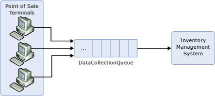

<properties 
    pageTitle="Erstellen von Applications, mit denen Dienstbus Themen und Abonnements | Microsoft Azure"
    description="Einführung in das Veröffentlichen-Abonnieren Dienstbus Themen und Abonnements-Funktionen."
    services="service-bus"
    documentationCenter="na"
    authors="sethmanheim"
    manager="timlt"
    editor="" />
<tags 
    ms.service="service-bus"
    ms.devlang="na"
    ms.topic="article"
    ms.tgt_pltfrm="na"
    ms.workload="na"
    ms.date="10/04/2016"
    ms.author="sethm" />

# <a name="create-applications-that-use-service-bus-topics-and-subscriptions"></a>Erstellen von Applications, die Dienstbus Themen und Abonnements verwenden

Azure Dienstbus unterstützt eine Reihe von cloudbasierten, Nachricht Orientierung Middleware Technologien, einschließlich Nachrichtenwarteschlangen zuverlässigen und dauerhaften Veröffentlichen/Abonnieren messaging. In diesem Artikel auf die Informationen in das [Erstellen von Applications Servicebuswarteschlangen verwenden, die Sie](service-bus-create-queues.md) erstellt und bietet eine Einführung in das Veröffentlichen/Abonnieren-Funktionen Dienstbus Themen.

## <a name="evolving-retail-scenario"></a>Szenario: Einzelhandel Weiterentwicklung

In diesem Artikel wird weiterhin im Einzelhandelsszenario in [Servicebuswarteschlangen verwenden, die Sie erstellen-Clientanwendungen](service-bus-create-queues.md)verwendet. Zurückrufen Sie die Umsatzdaten aus einzelnen Punkt der Verkauf (POS) umsteigebahnhöfe und einem Inventory Management-System weitergeleitet werden müssen, die die Daten verwendet wird, um zu ermitteln, wann Stock aufgefüllt werden muss. Jedes POS-Terminal Berichte die Verkaufsdaten durch Senden von Nachrichten an die Warteschlange **DataCollectionQueue** , bleiben diese, bis sie von der Inventory Management-System empfangen werden wie hier dargestellt:



Um dieses Szenario weiterentwickelt, eine neue Anforderung an das System hinzugefügt wurde: der Besitzer Store zum Überwachen der wie im Store in Echtzeit ausführt, in der Lage möchte.

Um diese Anforderung zu beheben, muss das System "Deaktivieren der Verkaufsdaten Stream Tippen Sie auf". Wir weiterhin jede Nachricht, die von der Verkaufsstellenterminals gesendet werden, das Inventory Management-System als vor gesendet werden sollen, aber wir eine Kopie jeder Nachricht, die wir verwenden können, um die Dashboard-Ansicht an den Besitzer der Store präsentieren möchten.

In jeder Situation wie folgt, in dem Sie jede Nachricht von mehreren Parteien verbraucht werden benötigen, können Sie Dienstbus *Themen*verwenden. Themen ein Veröffentlichen/Abonnieren Muster, in dem jede Nachricht veröffentlichten ein oder mehrere Abonnements mit dem Thema registriert zur Verfügung gestellt werden. Im Gegensatz dazu wird jede Nachricht mit Warteschlangen von einem einzelnen Verbraucher empfangen.

Nachrichten werden auf die gleiche Weise zu einem Thema gesendet, sobald sie an eine Warteschlange gesendet werden. Allerdings werden Nachrichten nicht aus dem Thema direkt empfangen; Sie empfangen werden von Abonnements. Sie können ein Abonnement zu einem Thema als eine virtuelle Warteschlange vorstellen, die Kopien der Nachrichten empfangen werden, die zu diesem Thema gesendet werden. Nachrichten werden aus einem Abonnement genauso empfangen, wie sie aus einer Warteschlange empfangen werden.

Wechseln wieder zu dem Szenario Retail, die Warteschlange wird durch ein Thema ersetzt, und ein Abonnement hinzugefügt wurde, die die Inventory Management Systemkomponente können. Das System wird nun wie folgt angezeigt:


Die Konfiguration so verhält wie vorherigen Warteschlange-basierten Entwurf. D. h., werden mit dem Thema gesendete Nachrichten in das Abonnement **Inventory** weitergeleitet, aus denen Sie das **Inventory Management System** verbraucht.

Um das Management Dashboard unterstützen, erstellen wir ein zweites Abonnement zum Thema, wie hier dargestellt:


Mit dieser Konfiguration besteht jede Nachricht die Verkaufsstellenterminals **Dashboards** und **Inventory** Abonnements zur Verfügung.

## <a name="show-me-the-code"></a>Anzeigen des Codes

Im Artikel [Erstellen von Applications verwenden, die Sie Servicebuswarteschlangen](service-bus-create-queues.md) beschrieben, wie Sie für ein Azure-Konto anmelden, und erstellen einen Dienstnamespace. Um einen Namespace Dienstbus verwenden zu können, muss eine Anwendung Dienstbus Assembly, insbesondere Microsoft.ServiceBus.dll verweisen. Die einfachste Möglichkeit zum Verweisen auf Dienstbus Abhängigkeiten besteht darin Dienstbus [Nuget-Paket](https://www.nuget.org/packages/WindowsAzure.ServiceBus/)installieren. Sie können auch die Assembly als Teil des SDK Azure suchen. Der Download ist auf der [Downloadseite für Azure SDK](https://azure.microsoft.com/downloads/)verfügbar.

### <a name="create-the-topic-and-subscriptions"></a>Erstellen Sie die Artikel und Abonnements

Management werden für messaging Einheiten (Warteschlangen und Veröffentlichen/Abonnieren-Themen) Dienstbus über die Klasse [NamespaceManager](https://msdn.microsoft.com/library/azure/microsoft.servicebus.namespacemanager.aspx) Vorgänge. Erstellen Sie eine Instanz [NamespaceManager](https://msdn.microsoft.com/library/azure/microsoft.servicebus.namespacemanager.aspx) für einen bestimmten Namespace, sind entsprechende Anmeldeinformationen erforderlich. Dienstbus verwendet eine [Freigegebene Access Signatur (SAS)](service-bus-sas-overview.md) basierend Sicherheitsmodell. Die [TokenProvider](https://msdn.microsoft.com/library/azure/microsoft.servicebus.tokenprovider.aspx) -Klasse stellt eine Sicherheitstokenanbieter mit integrierten Factory-Methoden einige bekannte token Anbieter zurückgeben. Wir verwenden eine [CreateSharedAccessSignatureTokenProvider](https://msdn.microsoft.com/library/azure/microsoft.servicebus.tokenprovider.createsharedaccesssignaturetokenprovider.aspx) Methode, die die Anmeldeinformationen SAS enthalten soll. Die [NamespaceManager](https://msdn.microsoft.com/library/azure/microsoft.servicebus.namespacemanager.aspx) Instanz wird dann mit der Basisadresse aus dem Dienstbus Namespace und token-Provider erstellt.

[NamespaceManager](https://msdn.microsoft.com/library/azure/microsoft.servicebus.namespacemanager.aspx) -Klasse stellt Methoden zum Erstellen, auflisten und messaging Elemente löschen. Der Code, der hier angezeigt wird gezeigt, wie die Instanz [NamespaceManager](https://msdn.microsoft.com/library/azure/microsoft.servicebus.namespacemanager.aspx) erstellt und verwendet, um das Thema **DataCollectionTopic** erstellen.

```
Uri uri = ServiceBusEnvironment.CreateServiceUri("sb", "test-blog", string.Empty);
string name = "RootManageSharedAccessKey";
string key = "abcdefghijklmopqrstuvwxyz";
     
TokenProvider tokenProvider = TokenProvider.CreateSharedAccessSignatureTokenProvider(name, key);
NamespaceManager namespaceManager = new NamespaceManager(uri, tokenProvider);
 
namespaceManager.CreateTopic("DataCollectionTopic");
```

Beachten Sie, dass es gibt überladenen die [CreateTopic](https://msdn.microsoft.com/library/azure/hh293080.aspx) Methode, die Sie zum Festlegen von Eigenschaften des Themas unterstützen. Beispielsweise können Sie den Time to live (TTL) Standardwert für Nachrichten, die mit dem Thema gesendet festlegen. Fügen Sie anschließend den **Bestand** und **Dashboard** -Abonnements.

```
namespaceManager.CreateSubscription("DataCollectionTopic", "Inventory");
namespaceManager.CreateSubscription("DataCollectionTopic", "Dashboard");
```

### <a name="send-messages-to-the-topic"></a>Senden von Nachrichten mit dem Thema

Für Vorgänge zur Laufzeit Dienstbus Personen; Beispielsweise muss beim Senden und Empfangen von Nachrichten, eine Anwendung zuerst ein Objekt [MessagingFactory](https://msdn.microsoft.com/library/azure/microsoft.servicebus.messaging.messagingfactory.aspx) erstellen. Ähnlich wie der Klasse [NamespaceManager](https://msdn.microsoft.com/library/azure/microsoft.servicebus.namespacemanager.aspx) , wird die [MessagingFactory](https://msdn.microsoft.com/library/azure/microsoft.servicebus.messaging.messagingfactory.aspx) Instanz von der Basisadresse aus dem Dienstnamespace und token-Provider erstellt.

```
MessagingFactory factory = MessagingFactory.Create(uri, tokenProvider);
```

An und gesendete Nachrichten empfangen von Dienstbus Themen, Instanzen der Klasse [BrokeredMessage](https://msdn.microsoft.com/library/azure/microsoft.servicebus.messaging.brokeredmessage.aspx) sind. Diese Klasse besteht aus einer Reihe von Standardeigenschaften (z. B. [Bezeichnungsfeld](https://msdn.microsoft.com/library/azure/microsoft.servicebus.messaging.brokeredmessage.label.aspx) und [TimeToLive](https://msdn.microsoft.com/library/azure/microsoft.servicebus.messaging.brokeredmessage.timetolive.aspx)), ein Wörterbuch, das verwendet wird, die Anwendungseigenschaften, und den Text einer beliebigen Anwendungsdaten enthalten soll. Textkörper durch die Übergabe beliebiges serialisierbares Objekt (im folgende Beispiel übergibt eine **SalesData** -Objekt, das die Umsatzdaten POS-Terminal darstellt), kann der [DataContractSerializer](https://msdn.microsoft.com/library/azure/system.runtime.serialization.datacontractserializer.aspx) des Objekts vorgesehenen eine Anwendung einrichten. Alternativ kann ein [Stream](https://msdn.microsoft.com/library/azure/system.io.stream.aspx) -Objekt bereitgestellt werden.

```
BrokeredMessage bm = new BrokeredMessage(salesData);
bm.Label = "SalesReport";
bm.Properties["StoreName"] = "Redmond";
bm.Properties["MachineID"] = "POS_1";
```

Die einfachste Möglichkeit zum Senden von Nachrichten mit dem Thema besteht darin, [CreateMessageSender](https://msdn.microsoft.com/library/azure/hh322659.aspx) zu verwenden, um ein Objekt [NachrichtSender](https://msdn.microsoft.com/library/azure/microsoft.servicebus.messaging.messagesender.aspx) direkt aus der [MessagingFactory](https://msdn.microsoft.com/library/azure/microsoft.servicebus.messaging.messagingfactory.aspx) -Instanz zu erstellen.

```
MessageSender sender = factory.CreateMessageSender("DataCollectionTopic");
sender.Send(bm);
```

### <a name="receive-messages-from-a-subscription"></a>Empfangen von Nachrichten aus einem Abonnement

Ähnlich wie bei der Verwendung von Warteschlangen, Nachrichten aus einem Abonnement erhalten Sie ein Objekt [MessageReceiver](https://msdn.microsoft.com/library/azure/microsoft.servicebus.messaging.messagereceiver.aspx) verwenden können, die Sie direkt von der [MessagingFactory](https://msdn.microsoft.com/library/azure/microsoft.servicebus.messaging.messagingfactory.aspx) mit [CreateMessageReceiver](https://msdn.microsoft.com/library/azure/hh322642.aspx)erstellen. Sie können eine der anderen beiden Modi (**ReceiveAndDelete** und **PeekLock**) erhalten, wie unter [Erstellen von Applications verwenden, die Sie Servicebuswarteschlangen](service-bus-create-queues.md)beschrieben.

Beachten Sie, dass beim Erstellen eines [MessageReceiver](https://msdn.microsoft.com/library/azure/microsoft.servicebus.messaging.messagereceiver.aspx) für Abonnements der Parameter *EntityPath* des Formulars ist `topicPath/subscriptions/subscriptionName`. Daher zum Erstellen eines [MessageReceiver](https://msdn.microsoft.com/library/azure/microsoft.servicebus.messaging.messagereceiver.aspx) für das Abonnement **Inventory** des Themas **DataCollectionTopic** *EntityPath* muss auf festgelegt sein `DataCollectionTopic/subscriptions/Inventory`. Der Code wird wie folgt angezeigt:

```
MessageReceiver receiver = factory.CreateMessageReceiver("DataCollectionTopic/subscriptions/Inventory");
BrokeredMessage receivedMessage = receiver.Receive();
try
{
    ProcessMessage(receivedMessage);
    receivedMessage.Complete();
}
catch (Exception e)
{
    receivedMessage.Abandon();
}
```

## <a name="subscription-filters"></a>Abonnementfilter

In diesem Szenario werden alle Nachrichten mit dem Thema bisher alle registrierten Abonnements zur Verfügung gestellt. Hier der wichtige Ausdruck wird "zur Verfügung gestellt." Während Dienstbus Abonnements alle Nachrichten mit dem Thema angezeigt wird, können Sie nur eine Teilmenge der diese Nachrichten in der Warteschlange virtuelle Abonnement kopieren. Dies wird ausgeführt, Abonnement *Filter*verwenden. Wenn Sie ein Abonnement erstellen, können Sie in Form eines Prädikats SQL92 Formatvorlage ein Filterausdrucks bereitstellen, die über die Eigenschaften der Nachricht, die Systemeigenschaften (z. B. [Beschriftung](https://msdn.microsoft.com/library/azure/microsoft.servicebus.messaging.brokeredmessage.label.aspx)), und die Anwendungseigenschaften wie **StoreName** im vorherigen Beispiel ausgeführt wird.

Weiterentwicklung von dem Szenario, um dies zu veranschaulichen, ist ein zweiter Speicher unserer Szenario: Einzelhandel hinzugefügt werden. Verkaufsdaten aus allen der Verkaufsstellenterminals aus beiden Stores haben Sie noch an die zentrale Inventory Management-System weitergeleitet werden müssen, aber einen Geschäftsführer mithilfe des Dashboard-Tools ist nur die Leistung von diesem Speicher interessiert. Abonnement filtern, um dies zu erreichen können. Beachten Sie, dass, wenn die Verkaufsstellenterminals Nachrichten veröffentlichen, sie die **StoreName** Application-Eigenschaft auf die Nachricht festgelegt. Zwei Speicher, beispielsweise **Redmond** und **Seattle**angegebenen, Speichern der Verkaufsstellenterminals in der Redmond Stempel, die ihre Verkaufsdaten Nachrichten mit einem **StoreName** gleich **Redmond**, während die Seattle Store Verkaufsstellenterminals einer **StoreName** verwenden in **Seattle**gleich aus. Der Geschäftsführer des Speichers Redmond möchte nur Daten von deren Verkaufsstellenterminals angezeigt. Das System sieht wie folgt aus:


Um diese routing eingerichtet haben, erstellen Sie das Abonnement **Dashboard** wie folgt:

```
SqlFilter dashboardFilter = new SqlFilter("StoreName = 'Redmond'");
namespaceManager.CreateSubscription("DataCollectionTopic", "Dashboard", dashboardFilter);
```

Mit diesem Abonnementfilter werden nur für Nachrichten, die die Eigenschaft **StoreName** **beschloss** haben in die virtuelle Warteschlange für das **Dashboard** -Abonnement kopiert werden. Es gibt viel mehr dem Abonnement zu filtern, jedoch. Applikationen können mehrere Filterregeln pro Abonnement sowie die Möglichkeit zum Ändern der Eigenschaften einer Nachricht, wenn er in einem Abonnement virtuelle Warteschlange bewegt haben.

## <a name="summary"></a>Zusammenfassung

Alle die Gründe für den Einsatz queuing beschrieben [verwenden, die Sie Servicebuswarteschlangen Applications erstellen](service-bus-create-queues.md) gelten auch für Themen, insbesondere:

- Zeitliche Entkopplung – Nachricht Hersteller und Verbraucher müssen nicht gleichzeitig online sein.

- Laden Abgleich – Spitzen in Last werden geglättet werden durch das Thema in Anspruch nehmen Applikationen für die durchschnittliche Auslastung statt Höchstwert Laden bereitgestellt werden aktivieren.

- Lastenausgleich – ähnlich wie in einer Warteschlange, Sie können haben mehrere verschiedenen Nutzer Abhören ein einzelnes Abonnement, mit jeder Nachricht an nur einer der Nutzer, damit auch die Last übergeben.

- Kopplung – Sie können im Netzwerk per weiterentwickelt, ohne die vorhandene Endpunkte; beispielsweise Abonnements hinzufügen oder Ändern von Filtern zu einem Thema, um neue Verbraucher zu ermöglichen.

## <a name="next-steps"></a>Nächste Schritte

Informationen zur Verwendung von Warteschlangen im Szenario Retail POS finden Sie unter [Erstellen von Applications, die Servicebuswarteschlangen verwenden](service-bus-create-queues.md) .